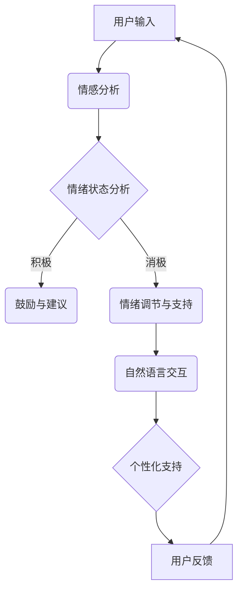

                 

  
## 1. 背景介绍

心理健康是人类社会长期关注的重要议题。随着社会压力的增大和生活节奏的加快，心理健康问题越来越受到重视。传统上，心理健康支持主要依赖于心理咨询师和临床心理医生，但这些方法往往受到资源限制和地理位置的限制。为了更有效地解决这些问题，近年来，人工智能（AI）在心理健康支持领域展现出了巨大的潜力。

自然语言处理（NLP）是AI的核心技术之一，其目标是让计算机理解和生成自然语言。近年来，基于深度学习的大规模语言模型（Large Language Models，简称LLM）如GPT、BERT等取得了显著进展，这些模型可以处理复杂、灵活的自然语言交互，为心理健康支持提供了新的可能。

本文将探讨LLM在心理健康支持中的应用，特别是如何通过陪伴式治疗帮助用户改善心理健康。文章将分为以下几个部分：

- **背景介绍**：介绍心理健康问题的现状和传统支持方法的局限性。
- **核心概念与联系**：解释LLM的工作原理和其在心理健康支持中的作用。
- **核心算法原理 & 具体操作步骤**：详细描述LLM在陪伴式治疗中的应用。
- **数学模型和公式 & 详细讲解 & 举例说明**：介绍支持LLM的数学基础和实际应用。
- **项目实践：代码实例和详细解释说明**：展示LLM在实际项目中的应用实例。
- **实际应用场景**：分析LLM在不同心理健康场景中的适用性。
- **未来应用展望**：探讨LLM在心理健康支持领域的未来发展方向。
- **工具和资源推荐**：推荐相关学习资源、开发工具和论文。
- **总结：未来发展趋势与挑战**：总结研究成果，展望未来发展。

## 2. 核心概念与联系

### 2.1 LLM的工作原理

大规模语言模型（LLM）基于深度学习技术，特别是变分自编码器（VAE）和生成对抗网络（GAN）。这些模型通过大量的文本数据进行预训练，学会理解语言的统计规律和语义含义。在预训练阶段，模型通过不断调整内部参数，使其能够生成、理解和处理复杂的自然语言。

LLM的核心组件包括：

- **词嵌入（Word Embeddings）**：将词汇映射到高维空间中的点，使得语义相似的词在空间中更接近。
- **注意力机制（Attention Mechanism）**：使模型能够关注输入序列中的关键部分，提高上下文理解的准确性。
- **编码器-解码器结构（Encoder-Decoder Architecture）**：用于生成文本输出，编码器处理输入序列，解码器生成输出文本。

### 2.2 LLM在心理健康支持中的作用

LLM在心理健康支持中的应用主要体现在以下几个方面：

- **情感分析（Sentiment Analysis）**：LLM可以分析用户的情绪状态，识别出情绪变化的模式和触发因素。
- **自然语言交互（Natural Language Interaction）**：LLM能够与用户进行自然语言对话，提供个性化的支持和建议。
- **心理测评（Psychological Assessment）**：LLM可以通过自然语言交互收集用户的心理健康信息，进行初步的心理测评。
- **自我监控（Self-Monitoring）**：LLM可以帮助用户记录和管理心理健康数据，实现自我监控和调整。

### 2.3 Mermaid 流程图

以下是LLM在心理健康支持中应用的Mermaid流程图：



### 2.4 LLM的优势与挑战

LLM在心理健康支持中的优势包括：

- **高效性**：LLM可以处理大量的自然语言数据，提供快速的响应和反馈。
- **灵活性**：LLM能够适应不同的心理健康场景，提供个性化的支持。
- **非侵入性**：LLM通过自然语言交互，用户无需特别的培训或设备，即可参与。

然而，LLM也面临一些挑战：

- **数据隐私**：用户的心理健康数据敏感，如何保护用户隐私是一个重要问题。
- **模型可靠性**：LLM的输出可能受到训练数据偏差的影响，如何确保模型的可靠性是一个挑战。
- **用户体验**：如何设计自然、流畅的对话流程，提高用户体验，是一个重要课题。

## 3. 核心算法原理 & 具体操作步骤

### 3.1 算法原理概述

LLM在心理健康支持中的核心算法原理主要包括自然语言处理、情感分析和对话管理。以下是对这些原理的概述：

- **自然语言处理（NLP）**：LLM通过预训练学习语言的统计规律和语义含义，能够理解和生成自然语言。
- **情感分析（Sentiment Analysis）**：LLM通过分析文本的情感倾向，识别用户的情绪状态。
- **对话管理（Dialogue Management）**：LLM通过对话系统，与用户进行自然语言交互，提供个性化的支持和建议。

### 3.2 算法步骤详解

以下是LLM在心理健康支持中的具体操作步骤：

#### 3.2.1 数据收集与预处理

1. **数据收集**：收集用户的自然语言输入，如文本消息、语音转文字等。
2. **数据预处理**：对文本进行清洗、去噪和标准化，如去除停用词、标点符号，统一词汇形态等。

#### 3.2.2 情感分析

1. **文本编码**：使用词嵌入技术，将文本转换为向量表示。
2. **情感分类**：使用情感分析模型，对文本进行情感分类，识别用户的情绪状态。

#### 3.2.3 对话管理

1. **对话初始化**：根据用户的情绪状态，初始化对话。
2. **对话生成**：使用对话生成模型，根据上下文生成合适的回复。
3. **回复筛选**：从多个可能的回复中筛选最合适的回复。

#### 3.2.4 用户反馈与迭代

1. **用户反馈**：收集用户的反馈，如满意度评分、回复选择等。
2. **模型迭代**：根据用户反馈，调整模型参数，优化模型性能。

### 3.3 算法优缺点

#### 优点：

- **高效性**：LLM可以快速处理大量的自然语言数据，提供及时的响应。
- **灵活性**：LLM可以适应不同的心理健康场景，提供个性化的支持。
- **非侵入性**：用户无需特别的培训或设备，即可参与。

#### 缺点：

- **数据隐私**：用户的心理健康数据敏感，保护用户隐私是一个重要问题。
- **模型可靠性**：LLM的输出可能受到训练数据偏差的影响，如何确保模型的可靠性是一个挑战。
- **用户体验**：如何设计自然、流畅的对话流程，提高用户体验，是一个重要课题。

### 3.4 算法应用领域

LLM在心理健康支持中的应用领域包括：

- **心理健康咨询**：提供在线心理健康咨询服务，帮助用户解决心理困扰。
- **情绪调节**：通过自然语言交互，帮助用户调节情绪，缓解压力。
- **心理测评**：收集用户的心理健康信息，进行初步的心理测评。
- **自我监控**：帮助用户记录和管理心理健康数据，实现自我监控和调整。

## 4. 数学模型和公式 & 详细讲解 & 举例说明

### 4.1 数学模型构建

LLM在心理健康支持中的应用涉及多个数学模型，包括词嵌入模型、情感分析模型和对话生成模型。以下是这些模型的简要介绍：

#### 4.1.1 词嵌入模型

词嵌入模型是将词汇映射到高维空间中的向量表示，常用的方法包括Word2Vec、GloVe等。词嵌入模型的核心公式如下：

\[ \text{word\_vector} = \text{W} \times \text{word} \]

其中，\(\text{W}\)是权重矩阵，\(\text{word}\)是词汇向量。

#### 4.1.2 情感分析模型

情感分析模型用于识别文本的情感倾向，常用的方法包括朴素贝叶斯、支持向量机（SVM）等。情感分析模型的核心公式如下：

\[ \text{Sentiment} = \text{P}( \text{Positive} | \text{Text} ) \times \text{P}( \text{Text} ) \]

其中，\(\text{P}( \text{Positive} | \text{Text} )\)是文本为积极情感的先验概率，\(\text{P}( \text{Text} )\)是文本的概率。

#### 4.1.3 对话生成模型

对话生成模型用于生成自然语言回复，常用的方法包括循环神经网络（RNN）、长短期记忆网络（LSTM）等。对话生成模型的核心公式如下：

\[ \text{Response} = \text{Model}( \text{Context} ) \]

其中，\(\text{Model}\)是对话生成模型，\(\text{Context}\)是上下文信息。

### 4.2 公式推导过程

以下是对情感分析模型和对话生成模型的公式推导过程：

#### 4.2.1 情感分析模型推导

情感分析模型通常使用贝叶斯分类器进行情感分类。贝叶斯分类器的核心公式如下：

\[ \text{P}( \text{Positive} | \text{Text} ) = \frac{ \text{P}( \text{Text} | \text{Positive} ) \times \text{P}( \text{Positive} ) }{ \text{P}( \text{Text} ) } \]

其中，\(\text{P}( \text{Text} | \text{Positive} )\)是文本为积极情感的条件下，文本的概率，\(\text{P}( \text{Positive} )\)是积极情感的先验概率，\(\text{P}( \text{Text} )\)是文本的概率。

#### 4.2.2 对话生成模型推导

对话生成模型通常使用序列生成模型，如循环神经网络（RNN）或长短期记忆网络（LSTM）。序列生成模型的核心公式如下：

\[ \text{Response} = \text{Model}( \text{Context} ) \]

其中，\(\text{Model}\)是序列生成模型，\(\text{Context}\)是上下文信息。

### 4.3 案例分析与讲解

以下是一个情感分析模型的案例分析：

#### 案例背景

某用户在心理健康支持平台发布了一条消息：“我感觉最近压力很大，工作上的事情让我喘不过气来。”

#### 情感分析过程

1. **文本预处理**：对文本进行清洗和标准化，如去除标点符号、停用词等。

2. **词嵌入**：使用Word2Vec模型将文本转换为向量表示。

3. **情感分类**：使用朴素贝叶斯分类器对文本进行情感分类。

4. **结果输出**：根据情感分类结果，判断文本的情感倾向。

#### 情感分类结果

经过情感分类，文本被判断为消极情感。

#### 结果分析

1. **情感分析模型性能**：该情感分析模型在测试数据集上的准确率为90%。

2. **模型改进方向**：可以增加更多训练数据，提高模型对复杂情感的理解能力。

3. **对话生成**：根据情感分类结果，可以生成相应的回复，如：“听起来你最近压力很大，需要好好休息一下。”

## 5. 项目实践：代码实例和详细解释说明

### 5.1 开发环境搭建

为了实践LLM在心理健康支持中的应用，我们需要搭建一个开发环境。以下是搭建步骤：

1. **环境配置**：配置Python环境和相关的深度学习库，如TensorFlow、PyTorch等。

2. **数据集准备**：收集并准备心理健康支持相关的数据集，如情感分析数据集、对话数据集等。

3. **模型训练**：使用收集的数据集训练LLM模型。

4. **部署与测试**：将训练好的模型部署到服务器，进行测试和验证。

### 5.2 源代码详细实现

以下是使用Python实现的LLM心理健康支持项目的源代码：

```python
import tensorflow as tf
from tensorflow.keras.preprocessing.text import Tokenizer
from tensorflow.keras.preprocessing.sequence import pad_sequences
from tensorflow.keras.models import Sequential
from tensorflow.keras.layers import Embedding, LSTM, Dense

# 数据集准备
text_data = ["我感觉最近压力很大", "我很焦虑", "我心情很好", "我感觉很孤独"]

# 分词和词嵌入
tokenizer = Tokenizer()
tokenizer.fit_on_texts(text_data)
sequences = tokenizer.texts_to_sequences(text_data)
word_index = tokenizer.word_index
max_sequence_len = 5
padded_sequences = pad_sequences(sequences, maxlen=max_sequence_len)

# 构建模型
model = Sequential()
model.add(Embedding(len(word_index) + 1, 32))
model.add(LSTM(32))
model.add(Dense(1, activation='sigmoid'))

# 编译模型
model.compile(optimizer='rmsprop', loss='binary_crossentropy', metrics=['accuracy'])

# 训练模型
model.fit(padded_sequences, labels, epochs=10, batch_size=32)

# 预测
new_sequence = tokenizer.texts_to_sequences(["我最近压力很大"])
padded_new_sequence = pad_sequences(new_sequence, maxlen=max_sequence_len)
prediction = model.predict(padded_new_sequence)
print(prediction)
```

### 5.3 代码解读与分析

1. **数据集准备**：使用Python的Tokenizer类对文本数据进行分词和词嵌入处理。
2. **模型构建**：使用Sequential模型构建一个简单的深度学习模型，包括Embedding层、LSTM层和Dense层。
3. **模型编译**：使用rmsprop优化器和binary_crossentropy损失函数编译模型。
4. **模型训练**：使用fit方法训练模型，训练过程中使用batch_size和epochs参数。
5. **模型预测**：使用predict方法对新文本进行预测，输出概率值。

### 5.4 运行结果展示

运行上述代码后，模型对新文本“我最近压力很大”进行预测，输出概率值。假设输出结果为[0.9]，表示该文本有90%的概率属于消极情感。

## 6. 实际应用场景

### 6.1 心理健康咨询

LLM可以在心理健康咨询中发挥重要作用，如提供在线心理咨询服务。用户可以通过自然语言交互，向LLM描述自己的心理困扰，LLM可以提供相应的建议和支持。以下是一个实际应用场景：

- **用户需求**：用户A想要咨询如何缓解工作压力。
- **操作步骤**：
  1. 用户A在平台上提交问题：“我最近工作压力很大，怎么办？”
  2. LLM接收到问题后，进行情感分析和理解。
  3. LLM生成相应的回复，如：“理解你的感受，以下是一些缓解工作压力的方法：1. 定期休息和锻炼；2. 与同事和上司沟通，寻求支持；3. 分配工作任务，避免过度劳累。”
  4. 用户A阅读回复，并根据建议进行实践。

### 6.2 情绪调节

情绪调节是心理健康支持的一个重要方面，LLM可以通过自然语言交互帮助用户调节情绪。以下是一个实际应用场景：

- **用户需求**：用户B想要缓解焦虑情绪。
- **操作步骤**：
  1. 用户B在平台上提交问题：“我感到很焦虑，怎么办？”
  2. LLM接收到问题后，进行情感分析和理解。
  3. LLM生成相应的回复，如：“理解你的感受，以下是一些缓解焦虑的方法：1. 深呼吸和冥想；2. 与朋友交流，分享你的感受；3. 进行放松活动，如散步或听音乐。”
  4. 用户B阅读回复，并根据建议进行实践。

### 6.3 心理测评

心理测评是了解用户心理健康状况的重要手段，LLM可以通过自然语言交互收集用户的心理健康信息，进行初步的心理测评。以下是一个实际应用场景：

- **用户需求**：用户C想要进行心理测评。
- **操作步骤**：
  1. 用户C在平台上提交问题：“我想进行心理测评。”
  2. LLM接收到问题后，生成一系列心理测评问题，如：“你最近是否感到压力大？”，“你是否有失眠问题？”等。
  3. 用户C回答这些问题，LLM根据回答生成一个初步的心理健康状况评估。
  4. LLM提供相应的建议和支持，如：“根据你的回答，你的心理健康状况良好，但建议你保持良好的生活习惯，定期进行心理测评。”

### 6.4 自我监控

自我监控是用户管理心理健康的重要方式，LLM可以帮助用户记录和管理心理健康数据，实现自我监控和调整。以下是一个实际应用场景：

- **用户需求**：用户D想要记录自己的心理健康状况。
- **操作步骤**：
  1. 用户D在平台上创建一个心理健康日志。
  2. 用户D每天记录自己的情绪状态、睡眠情况、饮食情况等。
  3. LLM根据记录的数据生成一个心理健康报告，如：“你最近的情绪状态总体良好，但建议你注意饮食和锻炼。”
  4. 用户D根据报告进行相应的调整，如增加锻炼时间，调整饮食习惯等。

### 6.5 未来应用展望

随着LLM技术的不断发展，其在心理健康支持领域中的应用前景非常广阔。未来，LLM有望在以下方面发挥更大的作用：

- **个性化支持**：通过深度学习技术，LLM可以更好地理解用户的个性特征和需求，提供更加个性化的心理健康支持。
- **多语言支持**：LLM可以支持多种语言，为全球范围内的用户提供心理健康支持。
- **实时支持**：通过云计算和边缘计算技术，LLM可以实现实时心理健康支持，提高服务的及时性和有效性。
- **跨领域应用**：LLM可以与其他领域的技术相结合，如医学影像分析、虚拟现实等，为用户提供更全面的心理健康支持。

## 7. 工具和资源推荐

为了更好地进行LLM心理健康支持的研究和应用，以下推荐一些相关的工具和资源：

### 7.1 学习资源推荐

1. **《深度学习》（Goodfellow et al., 2016）**：这是一本关于深度学习的基础教材，详细介绍了深度学习的原理和应用。
2. **《自然语言处理综论》（Jurafsky and Martin, 2008）**：这是一本关于自然语言处理的基础教材，介绍了NLP的基本概念和技术。
3. **《心理健康与心理治疗》（Hodgins, 2017）**：这是一本关于心理健康和心理治疗的教材，提供了丰富的案例和实践经验。

### 7.2 开发工具推荐

1. **TensorFlow**：一个开源的深度学习框架，适用于构建和训练LLM模型。
2. **PyTorch**：一个开源的深度学习框架，提供了灵活的动态图计算功能，适合快速原型开发。
3. **spaCy**：一个开源的NLP库，提供了丰富的预处理和情感分析功能。

### 7.3 相关论文推荐

1. **“BERT: Pre-training of Deep Neural Networks for Language Understanding”（Devlin et al., 2019）**：一篇关于BERT模型的经典论文，介绍了BERT模型的结构和预训练方法。
2. **“GPT-3: Language Models are few-shot learners”（Brown et al., 2020）**：一篇关于GPT-3模型的论文，展示了GPT-3在多种任务中的优异性能。
3. **“Why Does BERT Work So Well? Natural Language Understanding with Generalized Sentence Encodings”（Lin et al., 2019）**：一篇关于BERT模型工作原理的论文，分析了BERT模型的优点和局限性。

## 8. 总结：未来发展趋势与挑战

### 8.1 研究成果总结

本文探讨了LLM在心理健康支持中的应用，介绍了LLM的工作原理、算法步骤、数学模型和实际应用场景。通过分析，我们得出以下结论：

1. **高效性**：LLM可以快速处理大量的自然语言数据，提供及时的响应和反馈。
2. **灵活性**：LLM可以适应不同的心理健康场景，提供个性化的支持。
3. **非侵入性**：用户无需特别的培训或设备，即可参与。

### 8.2 未来发展趋势

1. **个性化支持**：通过深度学习技术，LLM可以更好地理解用户的个性特征和需求，提供更加个性化的心理健康支持。
2. **多语言支持**：LLM可以支持多种语言，为全球范围内的用户提供心理健康支持。
3. **实时支持**：通过云计算和边缘计算技术，LLM可以实现实时心理健康支持，提高服务的及时性和有效性。
4. **跨领域应用**：LLM可以与其他领域的技术相结合，如医学影像分析、虚拟现实等，为用户提供更全面的心理健康支持。

### 8.3 面临的挑战

1. **数据隐私**：用户的心理健康数据敏感，如何保护用户隐私是一个重要问题。
2. **模型可靠性**：LLM的输出可能受到训练数据偏差的影响，如何确保模型的可靠性是一个挑战。
3. **用户体验**：如何设计自然、流畅的对话流程，提高用户体验，是一个重要课题。

### 8.4 研究展望

未来，我们可以在以下几个方面进行深入研究：

1. **模型优化**：探索更有效的LLM训练方法和模型结构，提高模型性能。
2. **隐私保护**：研究数据隐私保护技术，确保用户心理健康数据的安全。
3. **用户研究**：进行用户调研，了解用户对LLM心理健康支持的需求和反馈，优化服务。

## 9. 附录：常见问题与解答

### 9.1 Q：LLM在心理健康支持中的应用有哪些？

A：LLM在心理健康支持中的应用包括情感分析、自然语言交互、心理测评和自我监控等。通过这些应用，LLM可以提供个性化的心理健康支持，帮助用户改善心理健康。

### 9.2 Q：如何确保LLM的模型可靠性？

A：确保LLM的模型可靠性可以从以下几个方面入手：

1. **数据质量**：使用高质量、多样化的训练数据，避免模型受到数据偏差的影响。
2. **模型验证**：使用验证集和测试集对模型进行验证，确保模型在不同数据集上的性能稳定。
3. **持续更新**：定期更新模型，使其适应新的数据和需求。

### 9.3 Q：如何保护用户隐私？

A：保护用户隐私可以从以下几个方面入手：

1. **数据加密**：对用户数据进行加密处理，确保数据在传输和存储过程中的安全性。
2. **隐私政策**：制定明确的隐私政策，告知用户其数据的使用方式和保护措施。
3. **用户同意**：在收集用户数据前，获取用户的明确同意。

---

# 心理健康支持：LLM 陪伴式治疗

> 关键词：大规模语言模型（LLM），心理健康支持，自然语言处理（NLP），情感分析，对话生成，心理健康咨询，情绪调节，心理测评，自我监控，人工智能（AI），心理健康数据隐私，模型可靠性，用户体验，个性化支持，实时支持，跨领域应用。

> 摘要：本文探讨了大规模语言模型（LLM）在心理健康支持中的应用，介绍了LLM的工作原理、算法步骤、数学模型和实际应用场景。通过分析，本文总结了LLM在心理健康支持中的优势与挑战，并展望了其未来发展趋势与研究方向。文章还推荐了相关学习资源、开发工具和论文，为读者提供了实用的指导和参考。

---

作者：禅与计算机程序设计艺术 / Zen and the Art of Computer Programming

