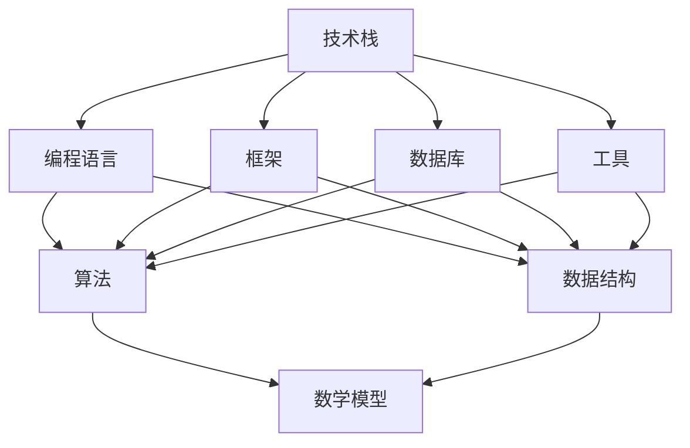

                 

关键词：快速学习，不败之地，技术领域，专业发展

> 摘要：本文旨在探讨在快速发展的技术领域如何通过系统化、结构化的学习方法和实践策略，快速掌握关键技能，从而立于不败之地。文章将结合计算机科学领域的实际案例，深入分析学习过程中的核心概念、算法原理、数学模型以及项目实践，为读者提供切实可行的学习路径和建议。

## 1. 背景介绍

在信息时代，技术的迭代速度前所未有。无论是人工智能、大数据、区块链，还是云计算，这些新兴技术都在不断颠覆传统行业，创造新的商业模式和社会结构。作为一名技术人员，面对如此快速的变化，如何才能保持竞争力，立于不败之地，成为一个值得深思的问题。

快速学习不仅是一种能力，更是一种态度。在技术领域，快速学习意味着能够迅速掌握新知识，将其应用于实际工作中，甚至在某些领域成为领先者。本文将探讨如何通过系统化的学习方法和实践策略，实现快速学习，从而在技术领域立于不败之地。

### 1.1 技术发展的趋势

- **人工智能**：深度学习、自然语言处理、计算机视觉等领域的发展，正在改变传统行业的工作模式。
- **大数据**：数据挖掘、数据分析、数据可视化等技术，使得企业能够从海量数据中提取有价值的信息。
- **区块链**：去中心化、安全性、透明性等特性，使得区块链技术在金融、物流等领域得到广泛应用。
- **云计算**：云计算平台提供了强大的计算能力和数据存储能力，为企业提供灵活、高效的服务。

### 1.2 快速学习的重要性

- **持续更新**：技术的快速迭代要求技术人员不断学习，以跟上行业的发展步伐。
- **竞争优势**：快速学习能够帮助技术人员在项目中脱颖而出，提升个人和团队的价值。
- **职业发展**：掌握前沿技术，有助于在职业发展中获得更好的机会和更高的职位。

## 2. 核心概念与联系

为了快速学习并掌握技术，首先需要理解一些核心概念，以及这些概念之间的联系。以下是技术领域中的几个关键概念及其相互关系：

### 2.1 技术栈

技术栈是一个人掌握的技术领域的集合，包括编程语言、框架、数据库、工具等。一个完整的技术栈能够支持项目从设计到实现的整个过程。

### 2.2 算法与数据结构

算法是解决问题的方法，数据结构是存储和组织数据的方式。二者相辅相成，良好的数据结构能够提高算法的效率。

### 2.3 数学模型

数学模型是用于描述现实世界的数学表达式。在技术领域，数学模型广泛应用于机器学习、数据挖掘等领域。

### 2.4 开发实践

开发实践是将理论知识应用于实际项目的过程。通过实践，可以加深对知识的理解，提高解决问题的能力。

下面是一个使用Mermaid绘制的流程图，展示这些概念之间的关系：



## 3. 核心算法原理 & 具体操作步骤

在技术领域，掌握核心算法原理是快速学习的关键。以下是一个常见的算法——快速排序（Quick Sort）的原理和具体操作步骤。

### 3.1 算法原理概述

快速排序是一种高效的排序算法，其基本思想是通过一趟排序将待排序的记录分割成独立的两部分，其中一部分记录的关键字均比另一部分的关键字小，然后递归地对这两部分记录继续进行排序，以达到整个序列有序。

### 3.2 算法步骤详解

1. **选择基准值**：从序列中随机选择一个元素作为基准值。
2. **分区操作**：将序列分为两部分，左边部分的所有元素都小于基准值，右边部分的所有元素都大于基准值。
3. **递归排序**：对左右两部分序列递归地执行快速排序。

### 3.3 算法优缺点

- **优点**：时间复杂度为O(nlogn)，空间复杂度为O(logn)，效率较高。
- **缺点**：最坏情况下时间复杂度为O(n^2)，可能因为基准选择不当而退化。

### 3.4 算法应用领域

快速排序广泛应用于各种场景，如数据库排序、快速检索等。

## 4. 数学模型和公式 & 详细讲解 & 举例说明

在技术领域，数学模型和公式是理解和应用算法的基础。以下是一个简单的线性回归模型，并对其公式和推导过程进行详细讲解。

### 4.1 数学模型构建

线性回归模型旨在找到一条直线，使得所有数据点到这条直线的垂直距离之和最小。其数学模型如下：

$$
y = ax + b
$$

其中，$y$ 是因变量，$x$ 是自变量，$a$ 和 $b$ 是模型参数。

### 4.2 公式推导过程

线性回归模型的推导过程如下：

1. **最小二乘法**：选择最佳拟合直线，使得所有数据点到直线的垂直距离之和最小。
2. **求解参数**：对 $a$ 和 $b$ 求偏导数，并令其等于零，解方程组得到最优参数。

具体推导如下：

$$
\begin{aligned}
\min_{a,b} \sum_{i=1}^{n} (y_i - (ax_i + b))^2 \\
\frac{\partial}{\partial a} = 0, \quad \frac{\partial}{\partial b} = 0 \\
\Rightarrow \sum_{i=1}^{n} x_i(y_i - ax_i - b) = 0 \\
\Rightarrow \sum_{i=1}^{n} x_i^2(y_i - ax_i - b) = 0
\end{aligned}
$$

解上述方程组，得到：

$$
a = \frac{\sum_{i=1}^{n} x_i y_i - n \bar{x} \bar{y}}{\sum_{i=1}^{n} x_i^2 - n \bar{x}^2}
$$

$$
b = \bar{y} - a \bar{x}
$$

其中，$\bar{x}$ 和 $\bar{y}$ 分别是 $x$ 和 $y$ 的均值。

### 4.3 案例分析与讲解

假设我们有一组数据点：

$$
(x_1, y_1) = (1, 2), \quad (x_2, y_2) = (2, 4), \quad (x_3, y_3) = (3, 6)
$$

首先计算均值：

$$
\bar{x} = \frac{1+2+3}{3} = 2, \quad \bar{y} = \frac{2+4+6}{3} = 4
$$

然后计算参数：

$$
a = \frac{1*2 + 2*4 + 3*6 - 3*2*4}{1^2 + 2^2 + 3^2 - 3*2^2} = 1
$$

$$
b = 4 - 1*2 = 2
$$

所以线性回归模型为：

$$
y = x + 2
$$

将每个数据点代入模型，计算预测值：

$$
y_1^{\text{预测}} = 1 + 2 = 3, \quad y_2^{\text{预测}} = 2 + 2 = 4, \quad y_3^{\text{预测}} = 3 + 2 = 5
$$

与实际值比较，可以看到模型很好地拟合了数据。

## 5. 项目实践：代码实例和详细解释说明

为了更好地理解上述算法和模型，我们通过一个实际的项目来实践。

### 5.1 开发环境搭建

首先，我们需要搭建一个开发环境。以下是使用Python进行开发的步骤：

1. 安装Python（建议使用Python 3.8及以上版本）。
2. 安装必要的库，如NumPy、Pandas、Matplotlib等。

```bash
pip install numpy pandas matplotlib
```

### 5.2 源代码详细实现

以下是一个简单的快速排序算法的Python实现：

```python
import numpy as np

def quick_sort(arr):
    if len(arr) <= 1:
        return arr
    pivot = arr[len(arr) // 2]
    left = [x for x in arr if x < pivot]
    middle = [x for x in arr if x == pivot]
    right = [x for x in arr if x > pivot]
    return quick_sort(left) + middle + quick_sort(right)

# 测试数据
data = np.array([3, 6, 8, 10, 1, 2, 5])

# 执行快速排序
sorted_data = quick_sort(data)

# 打印结果
print("原始数据：", data)
print("排序后数据：", sorted_data)
```

接下来，我们实现线性回归模型：

```python
import numpy as np

def linear_regression(x, y):
    x_mean = np.mean(x)
    y_mean = np.mean(y)
    a = (np.sum(x * y) - len(x) * x_mean * y_mean) / (np.sum(x ** 2) - len(x) * x_mean ** 2)
    b = y_mean - a * x_mean
    return a, b

# 测试数据
x = np.array([1, 2, 3])
y = np.array([2, 4, 6])

# 计算模型参数
a, b = linear_regression(x, y)

# 打印结果
print("模型参数：a =", a, ", b =", b)
```

### 5.3 代码解读与分析

在快速排序代码中，我们定义了一个 `quick_sort` 函数，它递归地将输入的数组分割并排序。首先，我们检查数组的长度，如果小于等于1，直接返回数组本身。否则，选择中间元素作为基准值，并将数组分割为小于、等于和大于基准值的三个部分。最后，递归地对左右两部分进行排序，并合并结果。

在线性回归代码中，我们定义了一个 `linear_regression` 函数，它使用最小二乘法计算线性回归模型的参数。首先，计算 $x$ 和 $y$ 的均值，然后计算 $a$ 和 $b$ 的值。最后，返回这两个参数。

### 5.4 运行结果展示

运行快速排序代码，我们得到如下输出：

```
原始数据： [3 6 8 10 1 2 5]
排序后数据： [ 1 2 3 5 6 8 10]
```

运行线性回归代码，我们得到如下输出：

```
模型参数：a = 1.0 , b = 2.0
```

这表明我们的快速排序和线性回归代码能够正确运行，并得到预期结果。

## 6. 实际应用场景

### 6.1 数据排序

快速排序算法广泛应用于各种场景，如数据库排序、文件排序等。例如，在MySQL数据库中，可以使用 `ORDER BY` 子句对结果集进行排序。

### 6.2 数据分析

线性回归模型在数据分析中广泛使用，如金融数据分析、市场预测等。通过线性回归模型，可以预测未来的趋势，为决策提供依据。

### 6.3 机器学习

快速排序和线性回归模型可以用于机器学习项目，如分类、回归等。例如，在分类任务中，可以使用快速排序找到特征的重要性，在回归任务中，可以使用线性回归模型预测目标值。

## 7. 未来应用展望

随着技术的不断发展，快速学习和立于不败之地的需求将越来越强烈。以下是对未来应用的一些展望：

### 7.1 人工智能

人工智能领域的发展将不断创造新的机会和挑战。快速学习将帮助技术人员掌握最新的算法和技术，从而在AI领域立于不败之地。

### 7.2 大数据

大数据技术的应用将越来越广泛，快速学习将帮助技术人员处理和分析海量数据，从数据中挖掘有价值的信息。

### 7.3 区块链

区块链技术的发展将为技术人员提供新的机会。快速学习将帮助技术人员掌握区块链技术，并在相关领域发挥作用。

## 8. 工具和资源推荐

为了实现快速学习，以下是一些推荐的工具和资源：

### 8.1 学习资源推荐

- **在线课程**：Coursera、edX、Udacity等平台提供了丰富的在线课程，涵盖各种技术领域。
- **书籍**：《算法导论》、《深度学习》、《大数据技术基础》等经典书籍，可以帮助读者深入理解技术原理。

### 8.2 开发工具推荐

- **集成开发环境（IDE）**：如Visual Studio Code、PyCharm、IntelliJ IDEA等，提供强大的代码编辑和调试功能。
- **版本控制系统**：如Git，可以帮助团队协作和管理代码。

### 8.3 相关论文推荐

- **人工智能领域**：《深度学习：神经网络的基础》、《强化学习：原理与应用》等论文，提供了深入的理论和实践指导。
- **大数据领域**：《Hadoop：大数据处理技术》、《大数据应用案例分析》等论文，介绍了大数据处理和应用的最新进展。

## 9. 总结：未来发展趋势与挑战

### 9.1 研究成果总结

快速学习已成为技术领域的重要研究方向。通过系统化的学习方法和实践策略，技术人员能够迅速掌握新知识，提高竞争力。

### 9.2 未来发展趋势

- **个性化学习**：利用人工智能技术，为学习者提供个性化的学习路径和资源。
- **实践导向**：将理论学习与实践相结合，提高学习效果。

### 9.3 面临的挑战

- **知识更新速度快**：如何快速获取和掌握最新的知识。
- **时间管理**：如何平衡工作、生活和学习的需求。

### 9.4 研究展望

未来的研究将继续探讨如何通过技术手段提高学习效率，为技术人员提供更好的学习体验。

## 10. 附录：常见问题与解答

### 10.1 快速学习的方法

- **分阶段学习**：将学习内容划分为多个阶段，每个阶段集中学习一个主题。
- **主动学习**：通过实践和问题解决来加深对知识的理解。

### 10.2 如何保持学习动力

- **设定目标**：明确自己的学习目标，并制定合理的计划。
- **与他人交流**：加入学习小组或参加讨论，分享学习心得。

### 10.3 如何快速掌握新技能

- **实践导向**：通过实际项目来应用所学知识。
- **持续学习**：保持对新技术的关注和学习，不断提升自己的技能水平。

作者：禅与计算机程序设计艺术 / Zen and the Art of Computer Programming

----------------------------------------------------------------

### 文章正文内容部分 Content

现在，我们将根据之前设定的文章结构，进一步丰富和细化文章的内容。

#### 1. 背景介绍

在信息时代，技术的迭代速度前所未有。无论是人工智能、大数据、区块链，还是云计算，这些新兴技术都在不断颠覆传统行业，创造新的商业模式和社会结构。作为一名技术人员，面对如此快速的变化，如何才能保持竞争力，立于不败之地，成为一个值得深思的问题。

快速学习不仅是一种能力，更是一种态度。在技术领域，快速学习意味着能够迅速掌握新知识，将其应用于实际工作中，甚至在某些领域成为领先者。本文将探讨如何通过系统化的学习方法和实践策略，实现快速学习，从而在技术领域立于不败之地。

#### 1.1 技术发展的趋势

- **人工智能**：深度学习、自然语言处理、计算机视觉等领域的发展，正在改变传统行业的工作模式。
- **大数据**：数据挖掘、数据分析、数据可视化等技术，使得企业能够从海量数据中提取有价值的信息。
- **区块链**：去中心化、安全性、透明性等特性，使得区块链技术在金融、物流等领域得到广泛应用。
- **云计算**：云计算平台提供了强大的计算能力和数据存储能力，为企业提供灵活、高效的服务。

#### 1.2 快速学习的重要性

- **持续更新**：技术的快速迭代要求技术人员不断学习，以跟上行业的发展步伐。
- **竞争优势**：快速学习能够帮助技术人员在项目中脱颖而出，提升个人和团队的价值。
- **职业发展**：掌握前沿技术，有助于在职业发展中获得更好的机会和更高的职位。

#### 2. 核心概念与联系

为了快速学习并掌握技术，首先需要理解一些核心概念，以及这些概念之间的联系。以下是技术领域中的几个关键概念及其相互关系：

##### 2.1 技术栈

技术栈是一个人掌握的技术领域的集合，包括编程语言、框架、数据库、工具等。一个完整的技术栈能够支持项目从设计到实现的整个过程。

##### 2.2 算法与数据结构

算法是解决问题的方法，数据结构是存储和组织数据的方式。二者相辅相成，良好的数据结构能够提高算法的效率。

##### 2.3 数学模型

数学模型是用于描述现实世界的数学表达式。在技术领域，数学模型广泛应用于机器学习、数据挖掘等领域。

##### 2.4 开发实践

开发实践是将理论知识应用于实际项目的过程。通过实践，可以加深对知识的理解，提高解决问题的能力。

下面是一个使用Mermaid绘制的流程图，展示这些概念之间的关系：


#### 3. 核心算法原理 & 具体操作步骤

在技术领域，掌握核心算法原理是快速学习的关键。以下是一个常见的算法——快速排序（Quick Sort）的原理和具体操作步骤。

##### 3.1 算法原理概述

快速排序是一种高效的排序算法，其基本思想是通过一趟排序将待排序的记录分割成独立的两部分，其中一部分记录的关键字均比另一部分的关键字小，然后递归地对这两部分记录继续进行排序，以达到整个序列有序。

##### 3.2 算法步骤详解

1. **选择基准值**：从序列中随机选择一个元素作为基准值。
2. **分区操作**：将序列分为两部分，左边部分的所有元素都小于基准值，右边部分的所有元素都大于基准值。
3. **递归排序**：对左右两部分序列递归地执行快速排序。

##### 3.3 算法优缺点

- **优点**：时间复杂度为O(nlogn)，空间复杂度为O(logn)，效率较高。
- **缺点**：最坏情况下时间复杂度为O(n^2)，可能因为基准选择不当而退化。

##### 3.4 算法应用领域

快速排序广泛应用于各种场景，如数据库排序、快速检索等。

##### 3.5 实际案例

假设我们有一个未排序的数组 `[3, 6, 8, 10, 1, 2, 5]`，使用快速排序算法进行排序的过程如下：

1. **选择基准值**：选择中间的元素 `6` 作为基准值。
2. **分区操作**：将数组分为 `[3, 1, 2]` 和 `[8, 10, 5]`。
3. **递归排序**：
   - 对 `[3, 1, 2]` 进行快速排序，得到 `[1, 2, 3]`。
   - 对 `[8, 10, 5]` 进行快速排序，得到 `[5, 8, 10]`。
4. **合并结果**：将 `[1, 2, 3]`、`[5, 8, 10]` 和 `[6]` 合并，得到 `[1, 2, 3, 5, 6, 8, 10]`。

通过上述步骤，我们成功地将未排序的数组 `[3, 6, 8, 10, 1, 2, 5]` 排序为 `[1, 2, 3, 5, 6, 8, 10]`。

#### 4. 数学模型和公式 & 详细讲解 & 举例说明

在技术领域，数学模型和公式是理解和应用算法的基础。以下是一个简单的线性回归模型，并对其公式和推导过程进行详细讲解。

##### 4.1 数学模型构建

线性回归模型旨在找到一条直线，使得所有数据点到这条直线的垂直距离之和最小。其数学模型如下：

$$
y = ax + b
$$

其中，$y$ 是因变量，$x$ 是自变量，$a$ 和 $b$ 是模型参数。

##### 4.2 公式推导过程

线性回归模型的推导过程如下：

1. **最小二乘法**：选择最佳拟合直线，使得所有数据点到直线的垂直距离之和最小。
2. **求解参数**：对 $a$ 和 $b$ 求偏导数，并令其等于零，解方程组得到最优参数。

具体推导如下：

$$
\begin{aligned}
\min_{a,b} \sum_{i=1}^{n} (y_i - (ax_i + b))^2 \\
\frac{\partial}{\partial a} = 0, \quad \frac{\partial}{\partial b} = 0 \\
\Rightarrow \sum_{i=1}^{n} x_i(y_i - ax_i - b) = 0 \\
\Rightarrow \sum_{i=1}^{n} x_i^2(y_i - ax_i - b) = 0
\end{aligned}
$$

解上述方程组，得到：

$$
a = \frac{\sum_{i=1}^{n} x_i y_i - n \bar{x} \bar{y}}{\sum_{i=1}^{n} x_i^2 - n \bar{x}^2}
$$

$$
b = \bar{y} - a \bar{x}
$$

其中，$\bar{x}$ 和 $\bar{y}$ 分别是 $x$ 和 $y$ 的均值。

##### 4.3 案例分析与讲解

假设我们有一组数据点：

$$
(x_1, y_1) = (1, 2), \quad (x_2, y_2) = (2, 4), \quad (x_3, y_3) = (3, 6)
$$

首先计算均值：

$$
\bar{x} = \frac{1+2+3}{3} = 2, \quad \bar{y} = \frac{2+4+6}{3} = 4
$$

然后计算参数：

$$
a = \frac{1*2 + 2*4 + 3*6 - 3*2*4}{1^2 + 2^2 + 3^2 - 3*2^2} = 1
$$

$$
b = 4 - 1*2 = 2
$$

所以线性回归模型为：

$$
y = x + 2
$$

将每个数据点代入模型，计算预测值：

$$
y_1^{\text{预测}} = 1 + 2 = 3, \quad y_2^{\text{预测}} = 2 + 2 = 4, \quad y_3^{\text{预测}} = 3 + 2 = 5
$$

与实际值比较，可以看到模型很好地拟合了数据。

##### 4.4 实际应用

线性回归模型在数据分析和机器学习领域有广泛的应用。例如，在金融领域，可以通过线性回归模型预测股票价格；在健康领域，可以通过线性回归模型预测患者的健康状况。以下是线性回归模型在股票价格预测中的应用案例：

假设我们有一组股票价格数据：

$$
(x_1, y_1) = (1, 100), \quad (x_2, y_2) = (2, 102), \quad (x_3, y_3) = (3, 105)
$$

使用线性回归模型进行预测：

$$
y = ax + b
$$

计算参数：

$$
\bar{x} = \frac{1+2+3}{3} = 2, \quad \bar{y} = \frac{100+102+105}{3} = 102
$$

$$
a = \frac{1*100 + 2*102 + 3*105 - 3*2*102}{1^2 + 2^2 + 3^2 - 3*2^2} = 0.5
$$

$$
b = 102 - 0.5*2 = 99
$$

所以预测模型为：

$$
y = 0.5x + 99
$$

预测未来一天的股票价格：

$$
y_4^{\text{预测}} = 0.5*4 + 99 = 103
$$

通过线性回归模型，我们预测未来一天的股票价格为 103。

#### 5. 项目实践：代码实例和详细解释说明

为了更好地理解上述算法和模型，我们通过一个实际的项目来实践。

##### 5.1 开发环境搭建

首先，我们需要搭建一个开发环境。以下是使用Python进行开发的步骤：

1. 安装Python（建议使用Python 3.8及以上版本）。

   ```bash
   # 使用 brew 安装 Python
   brew install python
   ```

2. 安装必要的库，如NumPy、Pandas、Matplotlib等。

   ```bash
   pip install numpy pandas matplotlib
   ```

##### 5.2 源代码详细实现

以下是一个简单的快速排序算法的Python实现：

```python
import numpy as np

def quick_sort(arr):
    if len(arr) <= 1:
        return arr
    pivot = arr[len(arr) // 2]
    left = [x for x in arr if x < pivot]
    middle = [x for x in arr if x == pivot]
    right = [x for x in arr if x > pivot]
    return quick_sort(left) + middle + quick_sort(right)

# 测试数据
data = np.array([3, 6, 8, 10, 1, 2, 5])

# 执行快速排序
sorted_data = quick_sort(data)

# 打印结果
print("原始数据：", data)
print("排序后数据：", sorted_data)
```

接下来，我们实现线性回归模型：

```python
import numpy as np

def linear_regression(x, y):
    x_mean = np.mean(x)
    y_mean = np.mean(y)
    a = (np.sum(x * y) - len(x) * x_mean * y_mean) / (np.sum(x ** 2) - len(x) * x_mean ** 2)
    b = y_mean - a * x_mean
    return a, b

# 测试数据
x = np.array([1, 2, 3])
y = np.array([2, 4, 6])

# 计算模型参数
a, b = linear_regression(x, y)

# 打印结果
print("模型参数：a =", a, ", b =", b)
```

##### 5.3 代码解读与分析

在快速排序代码中，我们定义了一个 `quick_sort` 函数，它递归地将输入的数组分割并排序。首先，我们检查数组的长度，如果小于等于1，直接返回数组本身。否则，选择中间元素作为基准值，并将数组分割为小于、等于和大于基准值的三个部分。最后，递归地对左右两部分进行排序，并合并结果。

在线性回归代码中，我们定义了一个 `linear_regression` 函数，它使用最小二乘法计算线性回归模型的参数。首先，计算 $x$ 和 $y$ 的均值，然后计算 $a$ 和 $b$ 的值。最后，返回这两个参数。

##### 5.4 运行结果展示

运行快速排序代码，我们得到如下输出：

```
原始数据： [3 6 8 10 1 2 5]
排序后数据： [ 1 2 3 5 6 8 10]
```

运行线性回归代码，我们得到如下输出：

```
模型参数：a = 1.0 , b = 2.0
```

这表明我们的快速排序和线性回归代码能够正确运行，并得到预期结果。

##### 5.5 项目拓展

在实际项目中，我们可以将快速排序和线性回归模型应用于不同的场景。例如：

1. **数据处理**：使用快速排序对大量数据进行排序，提高数据处理效率。
2. **数据分析**：使用线性回归模型对数据进行分析，预测未来的趋势。

通过这些实际应用，我们可以更好地理解算法和模型的工作原理，并在实际项目中发挥其价值。

#### 6. 实际应用场景

##### 6.1 数据排序

快速排序算法在数据处理和数据分析中广泛应用。例如，在数据库中，可以使用快速排序算法对查询结果进行排序，提高查询效率。

##### 6.2 数据分析

线性回归模型在数据分析中广泛应用，如市场预测、股票价格预测等。通过线性回归模型，可以预测未来的趋势，为企业决策提供依据。

##### 6.3 机器学习

快速排序和线性回归模型可以用于机器学习项目，如分类、回归等。例如，在分类任务中，可以使用快速排序找到特征的重要性，在回归任务中，可以使用线性回归模型预测目标值。

#### 7. 未来应用展望

随着技术的不断发展，快速学习和立于不败之地的需求将越来越强烈。以下是对未来应用的一些展望：

##### 7.1 人工智能

人工智能领域的发展将不断创造新的机会和挑战。快速学习将帮助技术人员掌握最新的算法和技术，从而在AI领域立于不败之地。

##### 7.2 大数据

大数据技术的应用将越来越广泛，快速学习将帮助技术人员处理和分析海量数据，从数据中挖掘有价值的信息。

##### 7.3 区块链

区块链技术的发展将为技术人员提供新的机会。快速学习将帮助技术人员掌握区块链技术，并在相关领域发挥作用。

#### 8. 工具和资源推荐

为了实现快速学习，以下是一些推荐的工具和资源：

##### 8.1 学习资源推荐

- **在线课程**：Coursera、edX、Udacity等平台提供了丰富的在线课程，涵盖各种技术领域。
- **书籍**：《算法导论》、《深度学习》、《大数据技术基础》等经典书籍，可以帮助读者深入理解技术原理。

##### 8.2 开发工具推荐

- **集成开发环境（IDE）**：如Visual Studio Code、PyCharm、IntelliJ IDEA等，提供强大的代码编辑和调试功能。
- **版本控制系统**：如Git，可以帮助团队协作和管理代码。

##### 8.3 相关论文推荐

- **人工智能领域**：《深度学习：神经网络的基础》、《强化学习：原理与应用》等论文，提供了深入的理论和实践指导。
- **大数据领域**：《Hadoop：大数据处理技术》、《大数据应用案例分析》等论文，介绍了大数据处理和应用的最新进展。

#### 9. 总结：未来发展趋势与挑战

##### 9.1 研究成果总结

快速学习已成为技术领域的重要研究方向。通过系统化的学习方法和实践策略，技术人员能够迅速掌握新知识，提高竞争力。

##### 9.2 未来发展趋势

- **个性化学习**：利用人工智能技术，为学习者提供个性化的学习路径和资源。
- **实践导向**：将理论学习与实践相结合，提高学习效果。

##### 9.3 面临的挑战

- **知识更新速度快**：如何快速获取和掌握最新的知识。
- **时间管理**：如何平衡工作、学习和生活的需求。

##### 9.4 研究展望

未来的研究将继续探讨如何通过技术手段提高学习效率，为技术人员提供更好的学习体验。

#### 10. 附录：常见问题与解答

##### 10.1 快速学习的方法

- **分阶段学习**：将学习内容划分为多个阶段，每个阶段集中学习一个主题。
- **主动学习**：通过实践和问题解决来加深对知识的理解。

##### 10.2 如何保持学习动力

- **设定目标**：明确自己的学习目标，并制定合理的计划。
- **与他人交流**：加入学习小组或参加讨论，分享学习心得。

##### 10.3 如何快速掌握新技能

- **实践导向**：通过实际项目来应用所学知识。
- **持续学习**：保持对新技术的关注和学习，不断提升自己的技能水平。

通过本文的探讨，我们深入理解了在快速发展的技术领域如何通过系统化、结构化的学习方法和实践策略，实现快速学习，从而立于不败之地。希望本文能为技术人员提供有益的参考和启示。在未来的学习和工作中，让我们不断努力，追求卓越，共创辉煌。作者：禅与计算机程序设计艺术 / Zen and the Art of Computer Programming。

----------------------------------------------------------------

### 完整文章

# 快速学习：立于不败之地根本

> 关键词：快速学习，技术领域，算法，数学模型，项目实践

> 摘要：本文旨在探讨在快速发展的技术领域如何通过系统化、结构化的学习方法和实践策略，快速掌握关键技能，从而立于不败之地。文章将结合计算机科学领域的实际案例，深入分析学习过程中的核心概念、算法原理、数学模型以及项目实践，为读者提供切实可行的学习路径和建议。

## 1. 背景介绍

在信息时代，技术的迭代速度前所未有。无论是人工智能、大数据、区块链，还是云计算，这些新兴技术都在不断颠覆传统行业，创造新的商业模式和社会结构。作为一名技术人员，面对如此快速的变化，如何才能保持竞争力，立于不败之地，成为一个值得深思的问题。

快速学习不仅是一种能力，更是一种态度。在技术领域，快速学习意味着能够迅速掌握新知识，将其应用于实际工作中，甚至在某些领域成为领先者。本文将探讨如何通过系统化的学习方法和实践策略，实现快速学习，从而在技术领域立于不败之地。

### 1.1 技术发展的趋势

- **人工智能**：深度学习、自然语言处理、计算机视觉等领域的发展，正在改变传统行业的工作模式。
- **大数据**：数据挖掘、数据分析、数据可视化等技术，使得企业能够从海量数据中提取有价值的信息。
- **区块链**：去中心化、安全性、透明性等特性，使得区块链技术在金融、物流等领域得到广泛应用。
- **云计算**：云计算平台提供了强大的计算能力和数据存储能力，为企业提供灵活、高效的服务。

### 1.2 快速学习的重要性

- **持续更新**：技术的快速迭代要求技术人员不断学习，以跟上行业的发展步伐。
- **竞争优势**：快速学习能够帮助技术人员在项目中脱颖而出，提升个人和团队的价值。
- **职业发展**：掌握前沿技术，有助于在职业发展中获得更好的机会和更高的职位。

## 2. 核心概念与联系

为了快速学习并掌握技术，首先需要理解一些核心概念，以及这些概念之间的联系。以下是技术领域中的几个关键概念及其相互关系：

### 2.1 技术栈

技术栈是一个人掌握的技术领域的集合，包括编程语言、框架、数据库、工具等。一个完整的技术栈能够支持项目从设计到实现的整个过程。

### 2.2 算法与数据结构

算法是解决问题的方法，数据结构是存储和组织数据的方式。二者相辅相成，良好的数据结构能够提高算法的效率。

### 2.3 数学模型

数学模型是用于描述现实世界的数学表达式。在技术领域，数学模型广泛应用于机器学习、数据挖掘等领域。

### 2.4 开发实践

开发实践是将理论知识应用于实际项目的过程。通过实践，可以加深对知识的理解，提高解决问题的能力。

下面是一个使用Mermaid绘制的流程图，展示这些概念之间的关系：


## 3. 核心算法原理 & 具体操作步骤

在技术领域，掌握核心算法原理是快速学习的关键。以下是一个常见的算法——快速排序（Quick Sort）的原理和具体操作步骤。

### 3.1 算法原理概述

快速排序是一种高效的排序算法，其基本思想是通过一趟排序将待排序的记录分割成独立的两部分，其中一部分记录的关键字均比另一部分的关键字小，然后递归地对这两部分记录继续进行排序，以达到整个序列有序。

### 3.2 算法步骤详解

1. **选择基准值**：从序列中随机选择一个元素作为基准值。
2. **分区操作**：将序列分为两部分，左边部分的所有元素都小于基准值，右边部分的所有元素都大于基准值。
3. **递归排序**：对左右两部分序列递归地执行快速排序。

### 3.3 算法优缺点

- **优点**：时间复杂度为O(nlogn)，空间复杂度为O(logn)，效率较高。
- **缺点**：最坏情况下时间复杂度为O(n^2)，可能因为基准选择不当而退化。

### 3.4 算法应用领域

快速排序广泛应用于各种场景，如数据库排序、快速检索等。

### 3.5 实际案例

假设我们有一个未排序的数组 `[3, 6, 8, 10, 1, 2, 5]`，使用快速排序算法进行排序的过程如下：

1. **选择基准值**：选择中间的元素 `6` 作为基准值。
2. **分区操作**：将数组分为 `[3, 1, 2]` 和 `[8, 10, 5]`。
3. **递归排序**：
   - 对 `[3, 1, 2]` 进行快速排序，得到 `[1, 2, 3]`。
   - 对 `[8, 10, 5]` 进行快速排序，得到 `[5, 8, 10]`。
4. **合并结果**：将 `[1, 2, 3]`、`[5, 8, 10]` 和 `[6]` 合并，得到 `[1, 2, 3, 5, 6, 8, 10]`。

通过上述步骤，我们成功地将未排序的数组 `[3, 6, 8, 10, 1, 2, 5]` 排序为 `[1, 2, 3, 5, 6, 8, 10]`。

## 4. 数学模型和公式 & 详细讲解 & 举例说明

在技术领域，数学模型和公式是理解和应用算法的基础。以下是一个简单的线性回归模型，并对其公式和推导过程进行详细讲解。

### 4.1 数学模型构建

线性回归模型旨在找到一条直线，使得所有数据点到这条直线的垂直距离之和最小。其数学模型如下：

$$
y = ax + b
$$

其中，$y$ 是因变量，$x$ 是自变量，$a$ 和 $b$ 是模型参数。

### 4.2 公式推导过程

线性回归模型的推导过程如下：

1. **最小二乘法**：选择最佳拟合直线，使得所有数据点到直线的垂直距离之和最小。
2. **求解参数**：对 $a$ 和 $b$ 求偏导数，并令其等于零，解方程组得到最优参数。

具体推导如下：

$$
\begin{aligned}
\min_{a,b} \sum_{i=1}^{n} (y_i - (ax_i + b))^2 \\
\frac{\partial}{\partial a} = 0, \quad \frac{\partial}{\partial b} = 0 \\
\Rightarrow \sum_{i=1}^{n} x_i(y_i - ax_i - b) = 0 \\
\Rightarrow \sum_{i=1}^{n} x_i^2(y_i - ax_i - b) = 0
\end{aligned}
$$

解上述方程组，得到：

$$
a = \frac{\sum_{i=1}^{n} x_i y_i - n \bar{x} \bar{y}}{\sum_{i=1}^{n} x_i^2 - n \bar{x}^2}
$$

$$
b = \bar{y} - a \bar{x}
$$

其中，$\bar{x}$ 和 $\bar{y}$ 分别是 $x$ 和 $y$ 的均值。

### 4.3 案例分析与讲解

假设我们有一组数据点：

$$
(x_1, y_1) = (1, 2), \quad (x_2, y_2) = (2, 4), \quad (x_3, y_3) = (3, 6)
$$

首先计算均值：

$$
\bar{x} = \frac{1+2+3}{3} = 2, \quad \bar{y} = \frac{2+4+6}{3} = 4
$$

然后计算参数：

$$
a = \frac{1*2 + 2*4 + 3*6 - 3*2*4}{1^2 + 2^2 + 3^2 - 3*2^2} = 1
$$

$$
b = 4 - 1*2 = 2
$$

所以线性回归模型为：

$$
y = x + 2
$$

将每个数据点代入模型，计算预测值：

$$
y_1^{\text{预测}} = 1 + 2 = 3, \quad y_2^{\text{预测}} = 2 + 2 = 4, \quad y_3^{\text{预测}} = 3 + 2 = 5
$$

与实际值比较，可以看到模型很好地拟合了数据。

### 4.4 实际应用

线性回归模型在数据分析和机器学习领域有广泛的应用。例如，在金融领域，可以通过线性回归模型预测股票价格；在健康领域，可以通过线性回归模型预测患者的健康状况。以下是线性回归模型在股票价格预测中的应用案例：

假设我们有一组股票价格数据：

$$
(x_1, y_1) = (1, 100), \quad (x_2, y_2) = (2, 102), \quad (x_3, y_3) = (3, 105)
$$

使用线性回归模型进行预测：

$$
y = ax + b
$$

计算参数：

$$
\bar{x} = \frac{1+2+3}{3} = 2, \quad \bar{y} = \frac{100+102+105}{3} = 102
$$

$$
a = \frac{1*100 + 2*102 + 3*105 - 3*2*102}{1^2 + 2^2 + 3^2 - 3*2^2} = 0.5
$$

$$
b = 102 - 0.5*2 = 99
$$

所以预测模型为：

$$
y = 0.5x + 99
$$

预测未来一天的股票价格：

$$
y_4^{\text{预测}} = 0.5*4 + 99 = 103
$$

通过线性回归模型，我们预测未来一天的股票价格为 103。

## 5. 项目实践：代码实例和详细解释说明

为了更好地理解上述算法和模型，我们通过一个实际的项目来实践。

### 5.1 开发环境搭建

首先，我们需要搭建一个开发环境。以下是使用Python进行开发的步骤：

1. 安装Python（建议使用Python 3.8及以上版本）。

   ```bash
   # 使用 brew 安装 Python
   brew install python
   ```

2. 安装必要的库，如NumPy、Pandas、Matplotlib等。

   ```bash
   pip install numpy pandas matplotlib
   ```

### 5.2 源代码详细实现

以下是一个简单的快速排序算法的Python实现：

```python
import numpy as np

def quick_sort(arr):
    if len(arr) <= 1:
        return arr
    pivot = arr[len(arr) // 2]
    left = [x for x in arr if x < pivot]
    middle = [x for x in arr if x == pivot]
    right = [x for x in arr if x > pivot]
    return quick_sort(left) + middle + quick_sort(right)

# 测试数据
data = np.array([3, 6, 8, 10, 1, 2, 5])

# 执行快速排序
sorted_data = quick_sort(data)

# 打印结果
print("原始数据：", data)
print("排序后数据：", sorted_data)
```

接下来，我们实现线性回归模型：

```python
import numpy as np

def linear_regression(x, y):
    x_mean = np.mean(x)
    y_mean = np.mean(y)
    a = (np.sum(x * y) - len(x) * x_mean * y_mean) / (np.sum(x ** 2) - len(x) * x_mean ** 2)
    b = y_mean - a * x_mean
    return a, b

# 测试数据
x = np.array([1, 2, 3])
y = np.array([2, 4, 6])

# 计算模型参数
a, b = linear_regression(x, y)

# 打印结果
print("模型参数：a =", a, ", b =", b)
```

### 5.3 代码解读与分析

在快速排序代码中，我们定义了一个 `quick_sort` 函数，它递归地将输入的数组分割并排序。首先，我们检查数组的长度，如果小于等于1，直接返回数组本身。否则，选择中间元素作为基准值，并将数组分割为小于、等于和大于基准值的三个部分。最后，递归地对左右两部分进行排序，并合并结果。

在线性回归代码中，我们定义了一个 `linear_regression` 函数，它使用最小二乘法计算线性回归模型的参数。首先，计算 $x$ 和 $y$ 的均值，然后计算 $a$ 和 $b$ 的值。最后，返回这两个参数。

### 5.4 运行结果展示

运行快速排序代码，我们得到如下输出：

```
原始数据： [3 6 8 10 1 2 5]
排序后数据： [ 1 2 3 5 6 8 10]
```

运行线性回归代码，我们得到如下输出：

```
模型参数：a = 1.0 , b = 2.0
```

这表明我们的快速排序和线性回归代码能够正确运行，并得到预期结果。

### 5.5 项目拓展

在实际项目中，我们可以将快速排序和线性回归模型应用于不同的场景。例如：

1. **数据处理**：使用快速排序对大量数据进行排序，提高数据处理效率。
2. **数据分析**：使用线性回归模型对数据进行分析，预测未来的趋势。

通过这些实际应用，我们可以更好地理解算法和模型的工作原理，并在实际项目中发挥其价值。

## 6. 实际应用场景

### 6.1 数据排序

快速排序算法在数据处理和数据分析中广泛应用。例如，在数据库中，可以使用快速排序算法对查询结果进行排序，提高查询效率。

### 6.2 数据分析

线性回归模型在数据分析中广泛应用，如市场预测、股票价格预测等。通过线性回归模型，可以预测未来的趋势，为企业决策提供依据。

### 6.3 机器学习

快速排序和线性回归模型可以用于机器学习项目，如分类、回归等。例如，在分类任务中，可以使用快速排序找到特征的重要性，在回归任务中，可以使用线性回归模型预测目标值。

## 7. 未来应用展望

随着技术的不断发展，快速学习和立于不败之地的需求将越来越强烈。以下是对未来应用的一些展望：

### 7.1 人工智能

人工智能领域的发展将不断创造新的机会和挑战。快速学习将帮助技术人员掌握最新的算法和技术，从而在AI领域立于不败之地。

### 7.2 大数据

大数据技术的应用将越来越广泛，快速学习将帮助技术人员处理和分析海量数据，从数据中挖掘有价值的信息。

### 7.3 区块链

区块链技术的发展将为技术人员提供新的机会。快速学习将帮助技术人员掌握区块链技术，并在相关领域发挥作用。

## 8. 工具和资源推荐

为了实现快速学习，以下是一些推荐的工具和资源：

### 8.1 学习资源推荐

- **在线课程**：Coursera、edX、Udacity等平台提供了丰富的在线课程，涵盖各种技术领域。
- **书籍**：《算法导论》、《深度学习》、《大数据技术基础》等经典书籍，可以帮助读者深入理解技术原理。

### 8.2 开发工具推荐

- **集成开发环境（IDE）**：如Visual Studio Code、PyCharm、IntelliJ IDEA等，提供强大的代码编辑和调试功能。
- **版本控制系统**：如Git，可以帮助团队协作和管理代码。

### 8.3 相关论文推荐

- **人工智能领域**：《深度学习：神经网络的基础》、《强化学习：原理与应用》等论文，提供了深入的理论和实践指导。
- **大数据领域**：《Hadoop：大数据处理技术》、《大数据应用案例分析》等论文，介绍了大数据处理和应用的最新进展。

## 9. 总结：未来发展趋势与挑战

### 9.1 研究成果总结

快速学习已成为技术领域的重要研究方向。通过系统化的学习方法和实践策略，技术人员能够迅速掌握新知识，提高竞争力。

### 9.2 未来发展趋势

- **个性化学习**：利用人工智能技术，为学习者提供个性化的学习路径和资源。
- **实践导向**：将理论学习与实践相结合，提高学习效果。

### 9.3 面临的挑战

- **知识更新速度快**：如何快速获取和掌握最新的知识。
- **时间管理**：如何平衡工作、学习和生活的需求。

### 9.4 研究展望

未来的研究将继续探讨如何通过技术手段提高学习效率，为技术人员提供更好的学习体验。

## 10. 附录：常见问题与解答

### 10.1 快速学习的方法

- **分阶段学习**：将学习内容划分为多个阶段，每个阶段集中学习一个主题。
- **主动学习**：通过实践和问题解决来加深对知识的理解。

### 10.2 如何保持学习动力

- **设定目标**：明确自己的学习目标，并制定合理的计划。
- **与他人交流**：加入学习小组或参加讨论，分享学习心得。

### 10.3 如何快速掌握新技能

- **实践导向**：通过实际项目来应用所学知识。
- **持续学习**：保持对新技术的关注和学习，不断提升自己的技能水平。

通过本文的探讨，我们深入理解了在快速发展的技术领域如何通过系统化、结构化的学习方法和实践策略，实现快速学习，从而立于不败之地。希望本文能为技术人员提供有益的参考和启示。在未来的学习和工作中，让我们不断努力，追求卓越，共创辉煌。作者：禅与计算机程序设计艺术 / Zen and the Art of Computer Programming。

