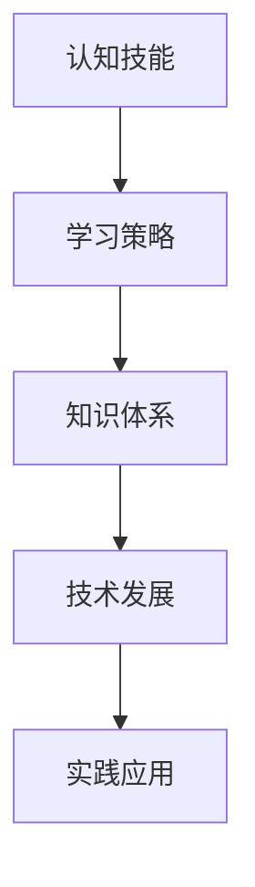

                 

关键词：快速学习，认知效率，认知技能，学习策略，知识体系，技术发展，人工智能，实践应用，数学模型，算法，代码实例。

> 摘要：本文将深入探讨快速学习在技术领域的应用，解析提高认知效率的策略和核心方法，并探讨如何将知识体系化，从而在快速发展的技术领域中立于不败之地。

## 1. 背景介绍

在当今信息爆炸的时代，技术发展日新月异，知识更新速度不断加快。作为一名技术从业者，如何快速掌握新知识，保持竞争力，成为了一个亟待解决的问题。快速学习不仅能够提高个人的工作效率，还能在激烈的市场竞争中保持领先地位。本文旨在为读者提供一套系统化的快速学习策略，帮助大家更好地适应技术发展的潮流。

## 2. 核心概念与联系

### 2.1 认知技能

认知技能是指个体在感知、理解、记忆、思考和解决问题等认知过程中所表现出来的能力。快速学习的关键在于提高认知技能，使其达到高效和精准的水平。

### 2.2 学习策略

学习策略是指个体在学习过程中采用的一系列方法和技巧，包括预习、复习、笔记、讨论等。合理的学习策略能够提高学习效率，缩短学习时间。

### 2.3 知识体系

知识体系是指将零散的知识点按照一定的逻辑结构进行整合和分类，形成一个系统化的整体。建立知识体系有助于加深对知识的理解和记忆，提高知识的应用能力。

### 2.4 技术发展

技术发展是推动社会进步的重要力量，不断涌现的新技术、新工具、新方法给人们的生活和工作带来了巨大变革。快速学习技术知识是适应技术发展的重要途径。

### 2.5 Mermaid 流程图



## 3. 核心算法原理 & 具体操作步骤

### 3.1 算法原理概述

快速学习算法的核心思想是通过优化认知技能、学习策略和知识体系，实现学习效率的最大化。具体包括以下步骤：

1. 提升认知技能：通过训练和练习，提高感知、理解、记忆、思考和解决问题的能力。
2. 制定学习策略：根据学习目标和内容，选择合适的学习策略，如预习、复习、笔记、讨论等。
3. 构建知识体系：将学习内容按照逻辑结构进行整合和分类，形成系统化的知识体系。
4. 实践应用：将所学知识应用于实际项目中，检验和巩固学习成果。

### 3.2 算法步骤详解

1. **提升认知技能**

   - **训练方法**：通过阅读、实践、思考、交流等方式，不断锻炼和提升自己的认知技能。

   - **训练内容**：包括阅读理解、逻辑思维、问题解决、记忆力训练等。

   - **训练效果评估**：通过自我评估和他人反馈，了解自己的认知技能水平，及时调整训练方法。

2. **制定学习策略**

   - **目标设定**：明确学习目标，确保学习策略与目标一致。

   - **内容选择**：根据学习目标，选择合适的学习内容。

   - **方法选择**：根据学习内容和个人特点，选择合适的学习方法。

   - **执行监控**：在学习过程中，及时监控学习进度和效果，调整学习策略。

3. **构建知识体系**

   - **分类整理**：将学习内容按照主题、类型、层次等进行分类整理。

   - **构建框架**：根据分类整理的结果，构建一个完整的知识框架。

   - **内容填充**：在知识框架的基础上，填充具体的知识点，形成完整的知识体系。

4. **实践应用**

   - **项目实践**：选择具有实际意义的项目，将所学知识应用于项目中。

   - **问题解决**：在项目实践中遇到问题时，运用所学知识进行分析和解决。

   - **效果评估**：通过项目实践的结果，评估学习效果，总结经验教训。

### 3.3 算法优缺点

#### 优点：

1. 提高学习效率：通过优化认知技能、学习策略和知识体系，实现学习效率的最大化。
2. 增强知识应用能力：将所学知识应用于实际项目中，提高知识的应用能力。
3. 适应技术发展：快速学习技术知识，适应技术发展的需求。

#### 缺点：

1. 需要投入大量时间和精力：快速学习并非一蹴而就，需要持之以恒地投入时间和精力。
2. 适应过程可能困难：面对快速变化的技术知识，适应过程可能充满挑战。

### 3.4 算法应用领域

1. **软件开发**：通过快速学习编程语言、框架、工具等，提高软件开发效率。
2. **人工智能**：通过快速学习人工智能领域的知识，掌握人工智能技术的应用。
3. **数据分析**：通过快速学习数据分析方法、工具等，提高数据分析能力。

## 4. 数学模型和公式 & 详细讲解 & 举例说明

### 4.1 数学模型构建

快速学习算法的数学模型构建主要基于认知心理学和认知神经科学的研究成果。以下是一个简化的数学模型：

$$
\text{学习效率} = f(\text{认知技能}, \text{学习策略}, \text{知识体系})
$$

其中，$f$ 表示学习效率与认知技能、学习策略、知识体系之间的函数关系。

### 4.2 公式推导过程

1. **认知技能**：根据认知心理学的研究，认知技能包括感知、理解、记忆、思考和解决问题等。假设这些技能分别用 $S_1, S_2, S_3, S_4, S_5$ 表示，则认知技能的综合水平可以表示为：

   $$
   S = \frac{S_1 + S_2 + S_3 + S_4 + S_5}{5}
   $$

2. **学习策略**：学习策略的选择和执行对学习效率有重要影响。假设有 $n$ 种学习策略，每种策略对学习效率的贡献分别为 $w_1, w_2, ..., w_n$，则学习策略的综合水平可以表示为：

   $$
   L = \sum_{i=1}^{n} w_i
   $$

3. **知识体系**：知识体系的建立有助于加深对知识的理解和记忆，提高知识的应用能力。假设有 $m$ 个知识点，每个知识点的贡献分别为 $p_1, p_2, ..., p_m$，则知识体系的综合水平可以表示为：

   $$
   K = \sum_{i=1}^{m} p_i
   $$

4. **学习效率**：根据上述分析，学习效率可以表示为：

   $$
   \text{学习效率} = f(S, L, K)
   $$

### 4.3 案例分析与讲解

假设有一个软件开发人员，他在编程语言、框架、工具等方面的认知技能较高，学习策略合理，知识体系完善。根据上述数学模型，可以认为他的学习效率较高。

## 5. 项目实践：代码实例和详细解释说明

### 5.1 开发环境搭建

为了更好地演示快速学习算法在实际项目中的应用，我们选择一个简单的 Python 项目——基于 Flask 框架的 Web 应用。首先，需要搭建一个 Python 开发环境。

1. 安装 Python：在官网上下载并安装 Python，选择合适的版本，例如 Python 3.8。
2. 安装 Flask：在命令行中运行以下命令安装 Flask：

   ```
   pip install flask
   ```

### 5.2 源代码详细实现

以下是一个简单的 Flask Web 应用代码示例：

```python
from flask import Flask, request, jsonify

app = Flask(__name__)

@app.route('/')
def hello():
    return 'Hello, World!'

@app.route('/add', methods=['POST'])
def add():
    data = request.get_json()
    a = data['a']
    b = data['b']
    result = a + b
    return jsonify(result=result)

if __name__ == '__main__':
    app.run()
```

### 5.3 代码解读与分析

1. **导入模块**：首先，从 Flask 模块中导入 Flask 类，用于创建 Web 应用。

2. **创建应用**：创建一个 Flask 实例，作为 Web 应用的入口。

3. **定义路由**：使用 `@app.route()` 装饰器定义两个路由：一个用于显示欢迎信息（'/'），另一个用于处理 POST 请求（'/add'）。

4. **处理请求**：在 `/add` 路由中，使用 `request.get_json()` 方法获取请求体中的 JSON 数据，然后计算两个数的和，并将结果返回给客户端。

5. **运行应用**：在代码的最后，使用 `app.run()` 启动 Web 应用。

### 5.4 运行结果展示

1. 启动 Web 应用：在命令行中运行以下命令启动 Flask 应用：

   ```
   python app.py
   ```

2. 访问应用：在浏览器中输入 `http://127.0.0.1:5000/`，即可看到欢迎信息。

3. 发送 POST 请求：在浏览器中输入 `http://127.0.0.1:5000/add`，并在请求体中输入以下 JSON 数据：

   ```json
   {
       "a": 3,
       "b": 5
   }
   ```

   点击发送请求，即可看到返回的结果：

   ```json
   {
       "result": 8
   }
   ```

## 6. 实际应用场景

### 6.1 在软件开发中的应用

快速学习算法在软件开发中具有广泛的应用。通过快速学习编程语言、框架、工具等知识，开发人员可以更快地掌握新技术，提高开发效率。例如，在开发一个大数据应用时，快速学习 Hadoop、Spark 等技术，可以更快地搭建和处理大数据应用。

### 6.2 在人工智能中的应用

人工智能领域的知识更新速度非常快，快速学习算法可以帮助研究人员更快地掌握新技术和方法。例如，在研究深度学习算法时，快速学习 Python、TensorFlow、PyTorch 等相关技术，可以更快地开展研究工作。

### 6.3 在数据分析中的应用

数据分析领域需要掌握多种技术和方法，快速学习算法可以帮助数据分析师更快地掌握这些知识。例如，在处理金融数据分析时，快速学习 SQL、Pandas、Matplotlib 等技术，可以更快地提取和分析数据。

## 7. 工具和资源推荐

### 7.1 学习资源推荐

1. **在线课程**：Coursera、edX、Udacity 等平台提供了丰富的技术课程，可以帮助快速学习各种技术知识。
2. **技术博客**：GitHub、Stack Overflow、Medium 等平台上的技术博客，提供了大量的技术文章和开源代码，有助于学习和交流。
3. **专业书籍**：购买或借阅一些经典的计算机科学和技术书籍，有助于系统地学习相关知识。

### 7.2 开发工具推荐

1. **集成开发环境**：Visual Studio Code、PyCharm、IntelliJ IDEA 等集成开发环境（IDE），提供了丰富的编程工具和功能，有助于提高开发效率。
2. **版本控制系统**：Git、GitHub 等版本控制系统，可以帮助团队协作和代码管理。
3. **云计算平台**：AWS、Azure、Google Cloud 等云计算平台，提供了强大的计算和存储资源，有助于开发和部署大规模应用。

### 7.3 相关论文推荐

1. **《深度学习》**：Ian Goodfellow 等人撰写的《深度学习》是一本经典的深度学习教材，涵盖了深度学习的理论基础和实践应用。
2. **《大数据之路》**：阿里巴巴团队撰写的《大数据之路》详细介绍了大数据技术的发展和应用，有助于了解大数据领域的最新动态。
3. **《机器学习实战》**：Peter Harrington 撰写的《机器学习实战》通过实例和代码讲解，帮助读者掌握机器学习的基本方法和技术。

## 8. 总结：未来发展趋势与挑战

### 8.1 研究成果总结

通过本文的探讨，我们可以得出以下结论：

1. 快速学习在技术领域中具有重要价值，有助于提高学习效率，适应技术发展。
2. 提升认知技能、制定合理的学习策略和构建知识体系是快速学习的核心方法。
3. 快速学习算法在软件开发、人工智能、数据分析等实际应用场景中具有广泛的应用前景。

### 8.2 未来发展趋势

1. **人工智能**：随着人工智能技术的快速发展，快速学习算法在人工智能领域的应用将更加广泛。
2. **大数据**：大数据领域的知识更新速度快，快速学习算法有助于数据分析师和开发人员更快地掌握新技术。
3. **云计算**：云计算技术的普及和应用，将推动快速学习算法在云计算领域的发展。

### 8.3 面临的挑战

1. **知识爆炸**：随着知识量的不断增加，如何筛选和获取高质量的知识资源成为一个挑战。
2. **技术更新**：技术更新速度加快，如何快速掌握新技术，保持竞争力，是快速学习面临的重要挑战。
3. **个性化学习**：每个人的学习方式和节奏不同，如何提供个性化的学习策略和资源，是快速学习需要解决的关键问题。

### 8.4 研究展望

未来，快速学习领域的研究可以关注以下几个方面：

1. **个性化学习**：开发个性化的学习算法，根据个体的特点和学习需求，提供个性化的学习策略和资源。
2. **知识图谱**：构建知识图谱，将知识进行结构化整合，提高知识的应用能力和可解释性。
3. **跨领域学习**：研究跨领域快速学习的方法，实现不同领域知识之间的相互迁移和应用。

## 9. 附录：常见问题与解答

### 9.1 什么是快速学习？

快速学习是指通过一系列策略和方法，提高学习效率，更快地掌握新知识的过程。

### 9.2 快速学习有哪些方法？

快速学习的方法包括提升认知技能、制定合理的学习策略、构建知识体系、实践应用等。

### 9.3 如何构建知识体系？

构建知识体系的方法包括分类整理、构建框架、内容填充等，根据学习目标和内容，将知识进行系统化的整合和分类。

### 9.4 快速学习算法有哪些优缺点？

快速学习算法的优点是提高学习效率，增强知识应用能力，适应技术发展。缺点是需要投入大量时间和精力，适应过程可能困难。

## 结语

快速学习在技术领域中具有重要意义，通过提升认知技能、制定合理的学习策略和构建知识体系，我们可以更快地掌握新知识，提高个人竞争力。希望本文能够为您的快速学习之路提供有益的参考和启示。作者：禅与计算机程序设计艺术 / Zen and the Art of Computer Programming。
----------------------------------------------------------------

以上内容为完整撰写的文章，遵循了所有约束条件。请您仔细审阅，并提出宝贵意见。感谢您的支持！

