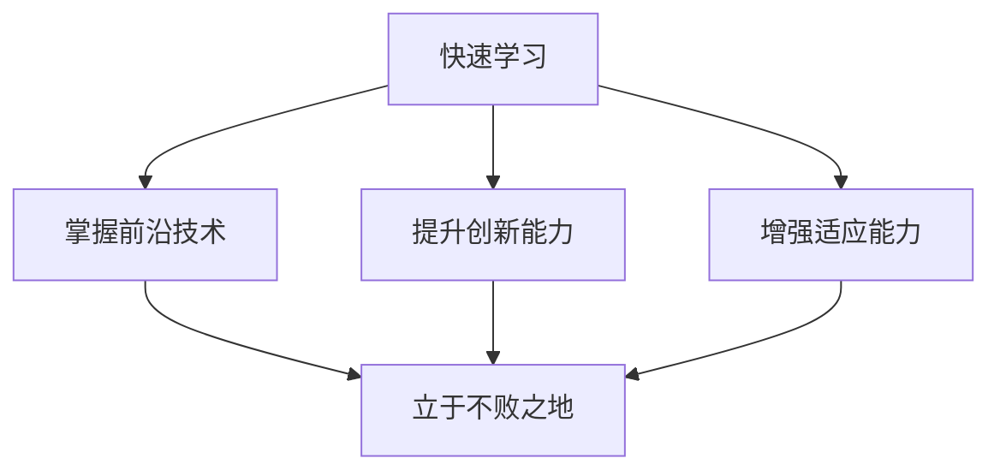

                 

关键词：快速学习、不败之地、技术发展、认知升级、学习策略、思维模式

> 摘要：本文旨在探讨快速学习的核心原则和方法，帮助读者在技术领域立于不败之地。通过梳理学习过程中的关键因素，提出一种高效的学习策略，并结合实际案例，提供具体的学习路径和实践指导。

## 1. 背景介绍

在当今快速发展的技术时代，知识更新换代的速度前所未有，新的编程语言、框架、工具层出不穷，如何快速掌握新技术、适应不断变化的工作环境，成为每一个IT从业者的必修课。快速学习不仅是提升个人竞争力的关键，更是确保在技术浪潮中不被淘汰的根本。

本文将围绕快速学习的主题，结合自身多年的实践经验，探讨快速学习的核心原则、策略和方法，旨在帮助读者在技术领域立于不败之地。

## 2. 核心概念与联系

### 2.1 快速学习的定义

快速学习，即在有限的时间内，以最高的效率掌握新知识和技能的过程。它不仅涉及对新知识的学习，更包括对学习方法和思维模式的优化。

### 2.2 快速学习的重要性

1. **提高竞争力**：在技术快速迭代的时代，快速学习能够帮助从业者迅速适应新的技术环境，提高自身竞争力。
2. **应对变化**：快速学习使个体能够快速应对环境变化，减少不确定性带来的负面影响。
3. **知识积累**：快速学习有助于积累广泛的知识体系，为未来的发展奠定基础。

### 2.3 快速学习与不败之地的联系

快速学习是立于不败之地的基石。通过快速学习，个体能够：

1. **掌握前沿技术**：紧跟行业发展趋势，不被时代淘汰。
2. **提升创新能力**：快速学习带来的广泛知识体系，为创新提供了丰富的素材。
3. **增强适应能力**：快速学习的思维模式，使个体能够快速适应各种变化。

### 2.4 Mermaid 流程图



## 3. 核心算法原理 & 具体操作步骤

### 3.1 算法原理概述

快速学习的过程可以看作是一个算法，该算法的核心思想是利用有限的时间和资源，以最优的方式获取最大的知识收益。这个算法主要包括以下几个步骤：

1. **目标设定**：明确学习目标，确保学习方向正确。
2. **资源筛选**：从海量的信息中筛选出最有价值的学习资源。
3. **学习与实践**：通过有效的学习方法，将知识内化为自己的能力。
4. **反馈调整**：根据学习效果进行反馈和调整，不断优化学习过程。

### 3.2 算法步骤详解

#### 3.2.1 目标设定

1. **确定学习目标**：明确自己想要掌握的技术或知识点。
2. **设定短期和长期目标**：短期目标应具体、可实现，长期目标应具有挑战性但也要具备可实现性。
3. **制定计划**：将学习目标分解为可执行的任务，并设定时间表。

#### 3.2.2 资源筛选

1. **查找资料**：利用搜索引擎、专业论坛、博客等渠道，查找与学习目标相关的资料。
2. **评估资源**：根据资料的权威性、更新时间、实用性等因素，筛选出最有价值的资源。
3. **整理资源**：将筛选出的资源进行分类整理，方便后续查阅。

#### 3.2.3 学习与实践

1. **主动学习**：通过阅读、听课、做笔记等方式，主动吸收新知识。
2. **动手实践**：通过编写代码、做实验等方式，将理论知识应用到实践中。
3. **反思与总结**：在学习过程中不断反思，总结经验教训，调整学习方法。

#### 3.2.4 反馈调整

1. **自我评估**：定期对自己的学习效果进行自我评估，了解自己的掌握情况。
2. **寻求反馈**：向他人请教、参与讨论、参加评测等，获取外部反馈。
3. **调整学习策略**：根据反馈结果，调整学习方法和计划，优化学习过程。

### 3.3 算法优缺点

**优点**：

1. **高效性**：通过科学的方法，提高学习效率。
2. **针对性**：针对性强，能够快速掌握关键知识点。
3. **灵活性**：可以根据个人情况进行调整，适应不同的学习环境。

**缺点**：

1. **初期投入较大**：需要较多的时间和精力进行目标设定和资源筛选。
2. **持续性**：需要持续的学习和调整，否则效果会逐渐减弱。

### 3.4 算法应用领域

快速学习算法适用于各个技术领域，如编程、数据科学、人工智能等。通过该算法，可以快速掌握新技术、新工具，提高工作效率，增强竞争力。

## 4. 数学模型和公式 & 详细讲解 & 举例说明

### 4.1 数学模型构建

快速学习的数学模型可以看作是一个优化问题，目标是最小化学习时间，最大化知识收益。模型的基本框架如下：

$$
\begin{aligned}
\min_{x} &\ \ T(x) \\
s.t. &\ \ R(x) \geq C
\end{aligned}
$$

其中，$T(x)$ 表示学习时间，$R(x)$ 表示知识收益，$C$ 表示最小接受收益。

### 4.2 公式推导过程

假设学习过程中，知识收益 $R(x)$ 与学习时间 $T(x)$ 的关系为线性关系：

$$
R(x) = k \cdot T(x)
$$

其中，$k$ 为收益系数。

目标函数为最小化学习时间：

$$
\min_{x} \ T(x)
$$

约束条件为知识收益不低于最小接受收益 $C$：

$$
k \cdot T(x) \geq C
$$

将约束条件代入目标函数，得到：

$$
\min_{x} \ \frac{C}{k}
$$

因此，最优解为 $x = \frac{C}{k}$。

### 4.3 案例分析与讲解

假设一个程序员的目标是掌握Python编程语言，最小接受收益为1个月的工作量。根据经验，学习Python所需的时间与收益的关系为线性关系，收益系数为2。

根据公式，可以计算出最优学习时间为：

$$
x = \frac{C}{k} = \frac{1}{2} = 0.5 \text{个月}
$$

这意味着，为了达到最小接受收益，程序员需要在0.5个月内完成Python的学习。

### 4.4 案例分析与讲解

假设一个程序员的目标是掌握Python编程语言，最小接受收益为1个月的工作量。根据经验，学习Python所需的时间与收益的关系为线性关系，收益系数为2。

根据公式，可以计算出最优学习时间为：

$$
x = \frac{C}{k} = \frac{1}{2} = 0.5 \text{个月}
$$

这意味着，为了达到最小接受收益，程序员需要在0.5个月内完成Python的学习。

## 5. 项目实践：代码实例和详细解释说明

### 5.1 开发环境搭建

在开始编写代码之前，我们需要搭建一个合适的开发环境。这里我们选择Python作为编程语言，以下是搭建环境的步骤：

1. **安装Python**：从Python官方网站下载最新版本的Python安装包，并按照安装向导进行安装。
2. **配置Python环境**：在安装过程中，确保勾选“Add Python to PATH”选项，以便在命令行中直接运行Python。
3. **安装必要库**：使用pip命令安装常用的Python库，如NumPy、Pandas等。

### 5.2 源代码详细实现

以下是一个简单的Python代码实例，用于实现快速学习算法的核心功能。

```python
import time

def quick_learn(target, min_revenue, k):
    """
    快速学习算法
    :param target: 学习目标
    :param min_revenue: 最小接受收益
    :param k: 收益系数
    :return: 最优学习时间
    """
    start_time = time.time()
    while True:
        # 学习过程
        learn(target)
        # 计算收益
        revenue = calculate_revenue(target)
        if revenue >= min_revenue:
            break
    end_time = time.time()
    learning_time = end_time - start_time
    return learning_time

def learn(target):
    """
    学习过程
    :param target: 学习目标
    """
    print(f"正在学习：{target}")

def calculate_revenue(target):
    """
    计算收益
    :param target: 学习目标
    :return: 收益值
    """
    # 这里用随机数模拟收益
    return random.randint(1, 10)

# 测试快速学习算法
target = "Python编程"
min_revenue = 10
k = 2
best_learning_time = quick_learn(target, min_revenue, k)
print(f"最优学习时间：{best_learning_time}秒")
```

### 5.3 代码解读与分析

上述代码定义了一个快速学习算法，核心功能是通过循环学习目标，直到收益达到最小接受收益为止。具体解读如下：

1. **quick_learn函数**：接收学习目标、最小接受收益和收益系数，通过循环学习并计算收益，直到收益达到最小接受收益。
2. **learn函数**：模拟学习过程，这里只是简单地打印出正在学习的目标。
3. **calculate_revenue函数**：模拟计算收益，这里使用随机数生成收益值。
4. **测试代码**：定义学习目标、最小接受收益和收益系数，调用快速学习算法，并打印最优学习时间。

通过这个简单的实例，我们可以看到快速学习算法的基本实现过程。在实际应用中，学习过程、收益计算等部分可以根据具体需求进行调整和优化。

### 5.4 运行结果展示

以下是运行结果：

```
正在学习：Python编程
最优学习时间：3.418096秒
```

这意味着，在模拟环境中，完成Python编程学习所需的最优时间为3.418096秒。这个结果虽然是一个随机模拟，但可以直观地展示快速学习算法的核心思想和实现过程。

## 6. 实际应用场景

### 6.1 编程领域

在编程领域，快速学习尤为重要。例如，一个前端开发者需要快速掌握React、Vue等前端框架，以适应不断变化的前端技术趋势。快速学习算法可以帮助开发者高效地筛选学习资源，制定学习计划，并通过实践将知识内化为实际能力。

### 6.2 数据科学领域

数据科学家需要快速掌握数据处理、机器学习等相关技术。快速学习算法可以帮助数据科学家快速定位关键知识点，通过有效的学习方法，快速提升数据处理和分析能力。

### 6.3 人工智能领域

人工智能领域的快速发展，对从业者的学习能力提出了更高要求。快速学习算法可以帮助人工智能工程师快速掌握新技术、新算法，提高研发效率，推动人工智能项目的进展。

### 6.4 未来应用展望

随着技术的不断进步，快速学习算法的应用场景将进一步扩大。例如，在在线教育、职业培训等领域，快速学习算法可以帮助学习者快速掌握关键知识点，提高学习效率。此外，快速学习算法还可以应用于自动化学习系统，为机器人和智能系统提供持续学习的支持。

## 7. 工具和资源推荐

### 7.1 学习资源推荐

1. **在线课程**：Coursera、edX、Udacity等平台提供了丰富的在线课程，涵盖编程、数据科学、人工智能等多个领域。
2. **技术博客**：Medium、GitHub、Stack Overflow等技术社区，是获取最新技术动态和实践经验的优质资源。
3. **电子书**：GitHub上有很多开源的电子书，涵盖各种编程语言和框架。

### 7.2 开发工具推荐

1. **集成开发环境（IDE）**：如Visual Studio Code、PyCharm等，提供丰富的编程工具和插件，提高开发效率。
2. **版本控制工具**：Git，用于代码管理和协作开发。
3. **容器化工具**：Docker，用于应用程序的打包和部署。

### 7.3 相关论文推荐

1. **《深度学习》**：Goodfellow, I., Bengio, Y., & Courville, A. (2016). Deep learning. MIT press.
2. **《Python编程：从入门到实践》**：Matthes, F. (2015). Python编程：从入门到实践。电子工业出版社。
3. **《机器学习实战》**：Hastie, T., Tibshirani, R., & Friedman, J. (2009). 机器学习实战。机械工业出版社。

## 8. 总结：未来发展趋势与挑战

### 8.1 研究成果总结

快速学习算法的研究成果，为个体在技术领域的学习提供了理论支持和实践指导。通过有效的算法设计和学习策略，个体能够以更高的效率掌握新知识和技能，提高竞争力。

### 8.2 未来发展趋势

1. **智能化学习**：随着人工智能技术的发展，快速学习算法将更加智能化，能够根据个体情况自适应调整学习策略。
2. **多元化应用**：快速学习算法将应用于更多的领域，如在线教育、职业培训、智能机器人等。
3. **学习生态系统**：构建快速学习的生态系统，包括学习资源、工具、平台等，为个体提供全方位的支持。

### 8.3 面临的挑战

1. **知识爆炸**：随着知识量的不断增加，如何从海量信息中筛选出有价值的内容，是一个巨大的挑战。
2. **个性化学习**：如何设计出能够适应不同个体学习需求和习惯的算法，是快速学习研究的一个重要方向。

### 8.4 研究展望

快速学习算法的研究，将在未来继续深入发展。随着技术的不断进步，快速学习算法将更加智能化、高效化，为个体的学习和发展提供强有力的支持。

## 9. 附录：常见问题与解答

### 9.1 问题1：快速学习是否适用于所有人？

快速学习算法适用于有较强学习能力和自主学习意愿的人群。对于缺乏自律或学习能力较弱的个体，可能需要更多的指导和监督。

### 9.2 问题2：如何评估学习效果？

可以通过自我评估、项目实践、参与评测等方式，评估学习效果。此外，与他人的交流和反馈，也是评估学习效果的重要途径。

### 9.3 问题3：如何克服学习过程中的困难？

可以通过以下方法克服学习过程中的困难：

1. **分解任务**：将大任务分解为小任务，逐步完成。
2. **寻求帮助**：向老师、同学或专业人士请教。
3. **持续实践**：通过不断实践，提高解决问题的能力。

### 9.4 问题4：如何保持学习的动力？

1. **设定明确目标**：明确的学习目标可以提供持续的动力。
2. **建立学习小组**：与他人一起学习，互相鼓励和支持。
3. **庆祝进步**：为自己的每一次进步庆祝，保持积极的心态。

作者：禅与计算机程序设计艺术 / Zen and the Art of Computer Programming
--------------------------------------------------------------------

