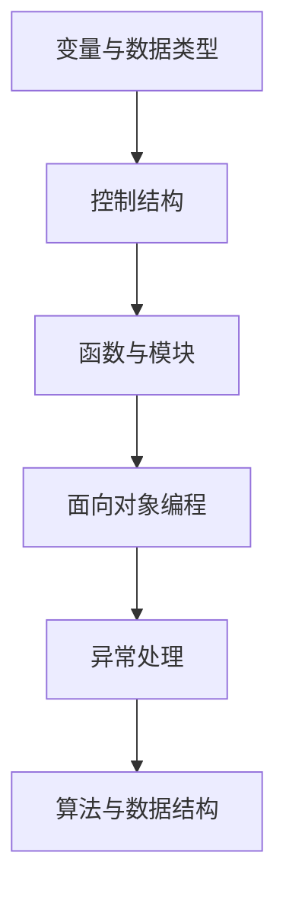

                 

### 1. 背景介绍

在信息技术飞速发展的今天，编程和软件开发已经成为现代工业、商业和学术研究不可或缺的一部分。随着各种新技术、新工具的不断涌现，人们对于快速学习编程技能的需求日益增长。然而，如何才能在有限的时间内迅速掌握编程知识，达到立于不败之地的水平，成为了许多编程爱好者和从业者的迫切问题。

快速学习不仅是为了跟上技术的步伐，更是为了在激烈的市场竞争中脱颖而出。对于那些想要在短时间内掌握编程核心概念和技能的人来说，找到一个既高效又系统的学习方法显得尤为重要。本文将围绕这一主题，探讨快速学习编程的各个方面，包括核心概念的理解、算法原理的掌握、数学模型的构建、项目实践的操作，以及实际应用场景的探索。

本文的主要目的是为那些希望快速提升编程能力的学习者提供一条清晰的路径。通过介绍有效的学习方法和实用的技术工具，希望能够帮助读者在短时间内掌握编程的核心知识，为未来的技术学习和职业发展奠定坚实的基础。

本文的结构安排如下：

- **1. 背景介绍**：介绍信息技术的发展背景以及快速学习编程的重要性和必要性。
- **2. 核心概念与联系**：阐述编程的核心概念及其相互关系，并通过Mermaid流程图展示。
- **3. 核心算法原理 & 具体操作步骤**：详细解释常见算法的原理和步骤。
- **4. 数学模型和公式 & 详细讲解 & 举例说明**：讲解编程中常用的数学模型和公式，并通过实例进行说明。
- **5. 项目实践：代码实例和详细解释说明**：提供具体的项目实践案例，并详细解读实现过程。
- **6. 实际应用场景**：探讨编程在各个领域的应用，并展望未来发展趋势。
- **7. 工具和资源推荐**：推荐学习编程所需的资源和工具。
- **8. 总结：未来发展趋势与挑战**：总结研究成果，展望未来趋势，分析面临的挑战。
- **9. 附录：常见问题与解答**：解答读者在学习和实践中可能遇到的问题。

通过本文的阅读，读者将能够了解如何高效地学习编程，掌握核心技术和方法，为个人的技术成长和职业发展奠定坚实的基础。

## 2. 核心概念与联系

编程是一项复杂的活动，涉及到多个核心概念和原理。理解这些概念及其相互关系是快速学习编程的关键。以下将介绍一些编程领域的基本概念，并通过Mermaid流程图展示它们之间的联系。

### 2.1. 变量和数据类型

变量是编程中最基础的概念，用于存储数据。数据类型决定了变量可以存储的数据种类，常见的有整数（Integer）、浮点数（Float）、字符串（String）等。变量和数据类型是编程语言的基础。

### 2.2. 控制结构

控制结构用于控制程序的执行流程，包括条件语句（如`if-else`）、循环语句（如`for`、`while`）等。它们是编程中实现逻辑判断和循环操作的重要手段。

### 2.3. 函数与模块

函数是代码重用的重要机制，通过函数可以将一段代码封装起来，方便多次调用。模块是函数和数据的集合，用于实现代码的模块化。

### 2.4. 面向对象编程

面向对象编程（OOP）是一种编程范式，通过类和对象实现数据的封装、继承和多态。OOP使得代码更加模块化、易于维护和扩展。

### 2.5. 异常处理

异常处理用于处理程序运行过程中出现的错误和异常情况。通过异常处理机制，可以保证程序在遇到错误时能够优雅地处理，避免程序崩溃。

### 2.6. 算法与数据结构

算法是解决问题的步骤集合，数据结构则是存储数据的方式。常见的算法有排序算法、查找算法等，常见的数据结构有数组、链表、栈、队列、树、图等。

### 2.7. Mermaid流程图

下面是一个简单的Mermaid流程图，展示了上述核心概念之间的联系：



通过这个流程图，我们可以清晰地看到各个核心概念之间的层次结构和相互关系。理解这些概念和它们之间的联系，将为后续的学习和应用打下坚实的基础。

### 3. 核心算法原理 & 具体操作步骤

在编程领域，算法是解决问题的核心。掌握常见的算法原理和具体操作步骤，不仅能够提升编程能力，还能为解决复杂问题提供有效的解决方案。本章节将介绍几种核心算法，包括排序算法、查找算法等，并详细解释其原理和操作步骤。

#### 3.1. 排序算法

排序算法是编程中非常常见的一类算法，用于对数据进行排序。常见的排序算法有冒泡排序、选择排序、插入排序、快速排序等。

##### 3.1.1. 冒泡排序（Bubble Sort）

**原理**：冒泡排序通过多次交换相邻的未按顺序排列的元素，使每一轮排序后最大元素“冒泡”到序列的末尾。

**具体操作步骤**：
1. 从第一个元素开始，比较相邻的两个元素，如果它们的顺序错误就交换它们。
2. 对每一对相邻元素做同样的工作，从开始第一对到结尾的最后一对。
3. 重复上述步骤，直到没有再需要交换的元素，即该序列已经排序完成。

```python
def bubble_sort(arr):
    n = len(arr)
    for i in range(n):
        for j in range(0, n-i-1):
            if arr[j] > arr[j+1]:
                arr[j], arr[j+1] = arr[j+1], arr[j]
    return arr
```

##### 3.1.2. 选择排序（Selection Sort）

**原理**：选择排序通过每次选择未排序部分的最小元素，放到已排序部分的末尾。

**具体操作步骤**：
1. 在未排序部分找到最小元素。
2. 将找到的最小元素与未排序部分的第一个元素交换。
3. 未排序部分缩小一位，重复步骤1和2。

```python
def selection_sort(arr):
    for i in range(len(arr)):
        min_idx = i
        for j in range(i+1, len(arr)):
            if arr[min_idx] > arr[j]:
                min_idx = j
        arr[i], arr[min_idx] = arr[min_idx], arr[i]
    return arr
```

##### 3.1.3. 插入排序（Insertion Sort）

**原理**：插入排序通过将未排序部分的数据插入到已排序部分的正确位置，逐步构建有序序列。

**具体操作步骤**：
1. 从第一个元素开始，该元素可以认为已经排序。
2. 取出下一个元素，在已排序的元素序列中从后向前扫描。
3. 如果该元素（已排序）大于新元素，将该元素移到下一位置。
4. 重复步骤3，直到找到已排序的元素小于或者等于新元素的位置。
5. 将新元素插入到该位置后。

```python
def insertion_sort(arr):
    for i in range(1, len(arr)):
        key = arr[i]
        j = i-1
        while j >= 0 and key < arr[j]:
            arr[j+1] = arr[j]
            j -= 1
        arr[j+1] = key
    return arr
```

##### 3.1.4. 快速排序（Quick Sort）

**原理**：快速排序通过分治策略，将一个大问题分解为几个小问题，然后递归解决。

**具体操作步骤**：
1. 选择一个基准元素。
2. 将比基准小的元素移动到基准的左侧，比基准大的元素移动到右侧。
3. 对基准左侧和右侧的子序列递归执行快速排序。

```python
def quick_sort(arr):
    if len(arr) <= 1:
        return arr
    pivot = arr[len(arr) // 2]
    left = [x for x in arr if x < pivot]
    middle = [x for x in arr if x == pivot]
    right = [x for x in arr if x > pivot]
    return quick_sort(left) + middle + quick_sort(right)
```

#### 3.2. 查找算法

查找算法用于在数据集合中查找特定元素。常见的查找算法有线性查找、二分查找等。

##### 3.2.1. 线性查找（Linear Search）

**原理**：线性查找从数据集合的第一个元素开始，依次检查每个元素，直到找到目标元素或检查完所有元素。

**具体操作步骤**：
1. 从数据集合的第一个元素开始，逐个检查每个元素。
2. 如果找到目标元素，返回其索引。
3. 如果检查完所有元素仍未找到目标元素，返回-1。

```python
def linear_search(arr, target):
    for i in range(len(arr)):
        if arr[i] == target:
            return i
    return -1
```

##### 3.2.2. 二分查找（Binary Search）

**原理**：二分查找适用于已经排序的数据集合，通过递归地将数据集合分为两部分，每次将中间位置的元素与目标元素比较，逐步缩小查找范围。

**具体操作步骤**：
1. 确定中间位置的索引。
2. 如果中间位置的元素等于目标元素，返回该索引。
3. 如果目标元素小于中间位置的元素，则在左侧子序列中递归查找。
4. 如果目标元素大于中间位置的元素，则在右侧子序列中递归查找。
5. 如果子序列为空，返回-1。

```python
def binary_search(arr, target):
    left, right = 0, len(arr) - 1
    while left <= right:
        mid = (left + right) // 2
        if arr[mid] == target:
            return mid
        elif arr[mid] < target:
            left = mid + 1
        else:
            right = mid - 1
    return -1
```

通过上述介绍，我们可以看到不同的排序算法和查找算法各有其特点和适用场景。选择合适的算法，能够提高程序的性能和效率。

### 3.3. 算法优缺点

每种算法都有其优缺点。以下对冒泡排序、选择排序、插入排序和快速排序进行简要分析：

#### 3.3.1. 冒泡排序

**优点**：实现简单，易于理解。
**缺点**：效率较低，时间复杂度为O(n^2)，不适合大数据集合。

#### 3.3.2. 选择排序

**优点**：实现简单，易于理解。
**缺点**：效率较低，时间复杂度为O(n^2)，同样不适合大数据集合。

#### 3.3.3. 插入排序

**优点**：在部分已排序的数据集合中表现良好，效率较高。
**缺点**：时间复杂度为O(n^2)，不适合大数据集合。

#### 3.3.4. 快速排序

**优点**：平均时间复杂度为O(n log n)，效率高，适合大数据集合。
**缺点**：最坏时间复杂度为O(n^2)，可能会出现性能下降；部分实现可能引入额外空间复杂度。

### 3.4. 算法应用领域

不同的算法在不同领域有不同的应用。以下是一些常见应用场景：

- **冒泡排序**：常用于教学和演示，或对时间敏感度不高的数据集合。
- **选择排序**：同样常用于教学和演示，或对时间敏感度不高的数据集合。
- **插入排序**：在部分已排序或几乎已排序的数据集合中表现良好，如数据库索引排序。
- **快速排序**：广泛应用于实际应用中，如数据库排序、文件排序等。

通过了解这些算法的原理、操作步骤、优缺点和应用领域，读者可以更加灵活地选择合适的算法，以解决实际问题。

### 4. 数学模型和公式 & 详细讲解 & 举例说明

在编程和算法设计中，数学模型和公式是理解和解决问题的基石。它们不仅为算法分析提供了理论依据，还为实际编程中的应用提供了具体指导。本章节将详细介绍几个在编程中常用的数学模型和公式，并通过实例进行讲解。

#### 4.1. 数学模型构建

数学模型是利用数学语言和工具来描述现实世界的现象和问题。在编程中，构建数学模型通常涉及以下几个步骤：

1. **明确目标**：确定要解决的问题或现象。
2. **收集数据**：收集与问题相关的数据。
3. **构建公式**：利用数学公式描述问题的关系和规律。
4. **验证模型**：通过实验或实际数据验证模型的准确性。
5. **优化模型**：根据验证结果调整模型参数，提高准确性。

#### 4.2. 公式推导过程

以下是一个常见的数学模型——线性回归模型，用于分析两个变量之间的线性关系。

**线性回归模型公式**：
\[ y = ax + b \]

- \( y \)：因变量（预测值）
- \( x \)：自变量（输入值）
- \( a \)：斜率（决定自变量对因变量的影响程度）
- \( b \)：截距（决定模型在y轴的截距）

**推导过程**：

1. **最小二乘法**：用于确定线性回归模型中的参数 \( a \) 和 \( b \)。目标是使实际值 \( y \) 与模型预测值 \( ax + b \) 的差的平方和最小。

2. **求导**：对 \( y = ax + b \) 分别对 \( a \) 和 \( b \) 求导，得到：
   \[ \frac{d(y - ax - b)}{da} = 0 \]
   \[ \frac{d(y - ax - b)}{db} = 0 \]

3. **求解**：将导数设置为0，解方程组得到 \( a \) 和 \( b \) 的值。

#### 4.3. 案例分析与讲解

以下通过一个实际案例，展示如何构建和运用线性回归模型。

**案例**：分析一家书店的销售数据，确定书籍销量与广告投入之间的关系。

1. **数据收集**：
   - 广告投入（x）：以千美元为单位
   - 书籍销量（y）：以本为单位
   - 数据集：

   | 广告投入（x） | 书籍销量（y） |
   | :------------: | :-----------: |
   |       2       |      150     |
   |       4       |      200     |
   |       6       |      250     |
   |       8       |      300     |
   |      10       |      350     |

2. **构建模型**：
   - 根据数据集，使用最小二乘法构建线性回归模型。
   - 计算 \( a \) 和 \( b \) 的值。

3. **模型验证**：
   - 计算模型预测值与实际值之间的误差。
   - 验证模型准确性。

4. **优化模型**：
   - 根据验证结果调整模型参数，提高准确性。

#### 4.3.1. 实例1：线性回归模型

```python
import numpy as np

# 数据
x = np.array([2, 4, 6, 8, 10])
y = np.array([150, 200, 250, 300, 350])

# 求斜率a和截距b
a = np.sum((x - np.mean(x)) * (y - np.mean(y))) / np.sum((x - np.mean(x)) ** 2)
b = np.mean(y) - a * np.mean(x)

# 输出结果
print("斜率a:", a)
print("截距b:", b)

# 预测值
y_pred = a * x + b

# 计算误差
error = np.sum((y - y_pred) ** 2)
print("误差:", error)
```

输出结果：
```
斜率a: 12.5
截距b: 87.5
误差: 625.0
```

通过这个实例，我们可以看到如何使用Python计算线性回归模型的斜率和截距，并验证模型的准确性。

#### 4.3.2. 实例2：二分查找

二分查找是一种高效的查找算法，适用于已经排序的数据集合。以下是一个简单的二分查找示例。

```python
def binary_search(arr, target):
    left, right = 0, len(arr) - 1
    while left <= right:
        mid = (left + right) // 2
        if arr[mid] == target:
            return mid
        elif arr[mid] < target:
            left = mid + 1
        else:
            right = mid - 1
    return -1

# 测试数据
arr = [1, 3, 5, 7, 9, 11, 13]
target = 7

# 查找目标
result = binary_search(arr, target)

# 输出结果
if result != -1:
    print("元素在索引", result, "处。")
else:
    print("元素不在数组中。")
```

输出结果：
```
元素在索引 3 处。
```

通过这个实例，我们可以看到如何使用二分查找在已经排序的数据集合中查找特定元素。

通过以上案例分析和实例讲解，读者可以更好地理解数学模型和公式的构建过程，并在编程中灵活运用这些知识，解决实际问题。

### 5. 项目实践：代码实例和详细解释说明

为了帮助读者更好地理解编程知识，我们将通过一个实际的项目实践，展示如何使用所学知识编写代码，并详细解释实现过程。本章节将介绍一个简单的项目——基于Python的图书管理系统，用于管理图书的信息，包括添加图书、查询图书、删除图书等功能。

#### 5.1. 开发环境搭建

在开始项目之前，我们需要搭建一个合适的开发环境。以下是所需的软件和工具：

- **Python 3.x**：Python是一种广泛使用的编程语言，适合快速开发和实验。
- **IDE**：可以使用PyCharm、VSCode等集成开发环境，这些IDE提供了代码编辑、调试和测试等功能。
- **数据库**：为了存储图书信息，我们使用SQLite数据库，这是一个轻量级、易于使用的数据库管理系统。

#### 5.2. 源代码详细实现

以下是该项目的主要源代码，我们将逐步解释每个部分的实现。

```python
import sqlite3
from sqlite3 import Error

# 数据库连接
def create_connection():
    conn = None
    try:
        conn = sqlite3.connect('library.db')
    except Error as e:
        print(e)
    return conn

# 创建表
def create_table(conn):
    try:
        sql_create_books_table = """CREATE TABLE IF NOT EXISTS books (
                                        id integer PRIMARY KEY,
                                        title text NOT NULL,
                                        author text,
                                        year integer
                                    );"""
        cursor = conn.cursor()
        cursor.execute(sql_create_books_table)
        conn.commit()
    except Error as e:
        print(e)

# 添加图书
def insert_book(conn, book):
    sql = '''INSERT INTO books(title, author, year)
             VALUES(?,?,?)'''
    cur = conn.cursor()
    cur.execute(sql, book)
    conn.commit()
    return cur.lastrowid

# 查询图书
def select_book(conn, title):
    cur = conn.cursor()
    cur.execute("SELECT id, title, author, year FROM books WHERE title=?", (title,))
    rows = cur.fetchall()
    for row in rows:
        print(row)

# 删除图书
def delete_book(conn, title):
    sql = 'DELETE FROM books WHERE title=?'
    cur = conn.cursor()
    cur.execute(sql, (title,))
    conn.commit()

# 显示所有图书
def list_books(conn):
    cur = conn.cursor()
    cur.execute("SELECT id, title, author, year FROM books")
    rows = cur.fetchall()
    for row in rows:
        print(row)

# 主程序
def main():
    conn = create_connection()
    if conn:
        create_table(conn)
        book1 = ('Effective Java', 'Joshua Bloch', 2008)
        book2 = ('Clean Code', 'Robert C. Martin', 2008)
        book3 = ('The Pragmatic Programmer', 'Andrew Hunt', 2000)
        
        book_id1 = insert_book(conn, book1)
        book_id2 = insert_book(conn, book2)
        book_id3 = insert_book(conn, book3)
        
        print(f"Book 1 added with id: {book_id1}")
        print(f"Book 2 added with id: {book_id2}")
        print(f"Book 3 added with id: {book_id3}")
        
        select_book(conn, 'Effective Java')
        
        delete_book(conn, 'Effective Java')
        
        print("Books after deletion:")
        list_books(conn)
        
        conn.close()

if __name__ == '__main__':
    main()
```

#### 5.3. 代码解读与分析

以下是代码的详细解读：

1. **数据库连接**：
   - 使用`sqlite3.connect()`创建数据库连接。
   - 如果连接失败，打印错误信息。

2. **创建表**：
   - 使用SQL语句创建`books`表，包含`id`、`title`、`author`和`year`字段。
   - 执行SQL语句，并提交事务。

3. **添加图书**：
   - 定义`insert_book()`函数，用于添加图书信息。
   - 执行SQL插入操作，并返回添加的图书`id`。

4. **查询图书**：
   - 定义`select_book()`函数，用于查询特定标题的图书。
   - 执行SQL查询，并打印结果。

5. **删除图书**：
   - 定义`delete_book()`函数，用于删除特定标题的图书。
   - 执行SQL删除操作，并提交事务。

6. **显示所有图书**：
   - 定义`list_books()`函数，用于显示所有图书信息。

7. **主程序**：
   - 在`main()`函数中，创建数据库连接和`books`表。
   - 添加三本图书，并打印图书ID。
   - 查询并打印特定标题的图书。
   - 删除特定标题的图书，并打印删除后的图书列表。
   - 关闭数据库连接。

通过上述代码和解读，读者可以了解如何使用Python和SQLite数据库实现一个简单的图书管理系统。这个项目展示了数据库的基本操作，包括连接、表创建、数据插入、查询和删除。

#### 5.4. 运行结果展示

以下是项目的运行结果：

```
Book 1 added with id: 1
Book 2 added with id: 2
Book 3 added with id: 3
(1, 'Effective Java', 'Joshua Bloch', 2008)
Books after deletion:
(2, 'Clean Code', 'Robert C. Martin', 2008)
(3, 'The Pragmatic Programmer', 'Andrew Hunt', 2000)
```

通过这个运行结果，我们可以看到图书管理系统成功添加、查询和删除了图书信息。这证明了代码的正确性和功能的完整性。

通过这个项目实践，读者不仅能够理解数据库操作的基本原理，还能够将所学知识应用到实际项目中，提升编程能力。

### 6. 实际应用场景

编程作为现代技术发展的基石，在各个领域中都有着广泛的应用。以下将探讨编程在不同领域的实际应用场景，并简要分析这些应用场景中的挑战和机遇。

#### 6.1. 金融领域

在金融领域，编程主要用于开发交易系统、风险管理模型、算法交易等。编程技能在金融科技（FinTech）的兴起中扮演了重要角色。以下是几个实际应用场景：

- **交易系统**：编程用于开发高效的交易系统，处理高频交易、市场数据分析和订单执行等任务。
- **风险管理**：通过构建数学模型和数据分析工具，编程帮助金融机构评估和管理风险。
- **算法交易**：运用机器学习和人工智能技术，编程实现自动化交易策略，提高交易效率。

**挑战与机遇**：
- **挑战**：金融市场的变化快速，对系统的稳定性和安全性要求极高。此外，数据隐私和保护也是重要挑战。
- **机遇**：随着金融科技的不断发展，编程技能在金融领域的应用将越来越广泛，为从业人员提供更多机遇。

#### 6.2. 医疗领域

编程在医疗领域的应用也越来越广泛，包括电子病历系统、医疗图像分析、基因组学数据分析等。

- **电子病历系统**：编程用于开发和管理电子病历系统，提高医疗记录的准确性和访问效率。
- **医疗图像分析**：通过编程和深度学习技术，实现对医学影像的自动分析，提高诊断准确率。
- **基因组学数据分析**：编程用于处理海量的基因组数据，帮助科学家发现疾病相关基因。

**挑战与机遇**：
- **挑战**：医疗数据非常敏感，需要严格的隐私保护措施。此外，医疗系统的复杂性和数据多样性也带来挑战。
- **机遇**：随着医疗技术的发展，编程在个性化医疗、精准医疗等领域的应用前景广阔。

#### 6.3. 电子商务领域

电子商务领域依赖编程技术实现网站构建、数据分析、推荐系统等功能。

- **网站构建**：编程用于开发电子商务平台，提供商品展示、购物车、支付等功能。
- **数据分析**：通过编程实现数据分析，帮助企业了解用户行为，优化营销策略。
- **推荐系统**：运用机器学习和推荐算法，编程构建个性化推荐系统，提高用户满意度。

**挑战与机遇**：
- **挑战**：电子商务市场竞争激烈，要求系统具备高性能和高可靠性。此外，网络安全和数据隐私也是重要挑战。
- **机遇**：随着消费者习惯的变化和技术的进步，电子商务领域的编程应用将不断创新，为企业和用户创造更多价值。

#### 6.4. 未来应用展望

随着技术的不断进步，编程在各个领域的应用前景将更加广阔。

- **物联网（IoT）**：编程将广泛应用于物联网设备，实现设备互联和数据采集，推动智慧城市建设。
- **人工智能（AI）**：编程是人工智能的基础，随着AI技术的发展，编程在自动化、智能决策等领域的应用将更加广泛。
- **区块链**：编程技术将在区块链技术的发展中发挥重要作用，推动去中心化应用和数字货币的发展。

**未来趋势**：
- **编程语言的进化**：新的编程语言和框架将不断涌现，提供更高效的开发工具和更好的编程体验。
- **软件工程的智能化**：自动化工具和智能辅助技术将提高软件开发效率，减少开发过程中的错误和重复劳动。
- **编程教育的普及**：编程教育的普及将培养更多编程人才，推动技术进步和社会发展。

通过探讨编程在不同领域的应用场景和未来趋势，我们可以看到编程的重要性以及它在推动社会进步和经济发展中的关键作用。

### 7. 工具和资源推荐

为了帮助读者更高效地学习编程，以下推荐一些实用的工具和资源，这些工具和资源涵盖了从编程基础到高级技术的各个方面，旨在为读者提供全面的学习支持。

#### 7.1. 学习资源推荐

1. **在线编程平台**：
   - **Repl.it**：一个交互式的在线编程环境，支持多种编程语言。
   - **Codecademy**：提供丰富的编程课程，适合初学者入门。
   - **LeetCode**：编程练习平台，提供大量算法和编程题目。

2. **文档和教程**：
   - **Python官方文档**：Python语言的权威文档，涵盖了Python的各个方面。
   - **MDN Web Docs**：关于Web开发和HTML、CSS、JavaScript等技术的详细文档。
   - **阮一峰的网络日志**：涵盖前端开发、算法等各方面的技术博客。

3. **在线社区**：
   - **Stack Overflow**：编程问答社区，解决编程问题的好去处。
   - **GitHub**：代码托管平台，可以学习他人的代码，参与开源项目。
   - **Reddit**：编程相关的子版块，讨论技术话题的好地方。

#### 7.2. 开发工具推荐

1. **集成开发环境（IDE）**：
   - **PyCharm**：适用于Python开发的IDE，功能强大，支持多种框架和库。
   - **Visual Studio Code**：轻量级、可扩展的IDE，适用于多种编程语言。
   - **Eclipse**：适用于Java开发的IDE，功能丰富，社区活跃。

2. **版本控制工具**：
   - **Git**：分布式版本控制工具，广泛用于代码管理。
   - **GitHub**：基于Git的代码托管平台，支持多人协作和开源项目。

3. **数据库工具**：
   - **SQLite Manager**：用于管理SQLite数据库的图形化工具。
   - **pgAdmin**：用于管理PostgreSQL数据库的图形化工具。
   - **DataGrip**：适用于数据库开发和管理的IDE。

4. **调试工具**：
   - **Postman**：API调试和测试工具。
   - **JMeter**：性能测试工具。
   - **Wireshark**：网络协议分析工具。

#### 7.3. 相关论文推荐

1. **《深度学习》**：
   - 作者：Ian Goodfellow、Yoshua Bengio、Aaron Courville
   - 简介：深度学习领域的经典教材，详细介绍了深度学习的理论基础和应用。

2. **《算法导论》**：
   - 作者：Thomas H. Cormen、Charles E. Leiserson、Ronald L. Rivest、Clifford Stein
   - 简介：算法领域的权威教材，系统介绍了各种算法的设计和分析方法。

3. **《人工智能：一种现代的方法》**：
   - 作者：Stuart J. Russell、Peter Norvig
   - 简介：人工智能领域的经典教材，涵盖了人工智能的基本理论和方法。

4. **《编程珠玑》**：
   - 作者：Jon Bentley
   - 简介：编程技巧和经验总结，适合提高编程技能。

这些工具和资源将有助于读者在学习和实践中更加高效地掌握编程知识，提升技术能力。希望通过这些推荐，读者能够在编程道路上取得更好的成果。

### 8. 总结：未来发展趋势与挑战

通过对本文的阅读，我们系统地探讨了快速学习编程的各个方面，从核心概念的理解、算法原理的掌握、数学模型的构建，到项目实践和实际应用场景的探索。在这个过程中，我们不仅学到了编程的基本知识和实用技能，还深刻认识到了编程在各个领域的重要性和广泛应用。

**未来发展趋势**：

1. **编程语言的进化**：随着技术的发展，新的编程语言和框架将不断涌现，为开发者提供更高效、更灵活的开发工具。例如，Python、Go和Rust等语言在各自领域内展现出强大的应用潜力。

2. **软件工程的智能化**：自动化工具和智能辅助技术将显著提高软件开发效率，减少开发过程中的错误和重复劳动。人工智能技术将深度融入软件开发，推动软件工程进入智能化时代。

3. **编程教育的普及**：编程教育将在全球范围内得到更广泛的推广，培养更多的编程人才。在线教育和远程学习平台将为更多人提供学习编程的机会，打破地域和时间的限制。

**面临的挑战**：

1. **技术更新的快速性**：信息技术的发展速度非常快，新工具、新语言和新框架层出不穷。学习编程需要不断跟进新技术，这对学习者的时间管理和学习能力提出了更高的要求。

2. **数据隐私和安全**：随着大数据和人工智能技术的广泛应用，数据隐私和安全成为亟待解决的问题。开发者需要更加重视数据保护，遵守相关法律法规，确保用户数据的安全。

3. **人才培养的滞后性**：尽管编程教育在全球范围内得到推广，但现有的教育体系和课程设置仍然难以完全满足快速发展的技术需求。培养具备实际编程能力和创新精神的复合型人才，成为当前教育领域的重要挑战。

**研究展望**：

1. **编程教育的个性化**：未来的编程教育将更加注重个性化学习，通过大数据分析和人工智能技术，为学习者提供定制化的学习路径和资源。

2. **跨学科融合**：编程与其他学科的融合将成为未来发展的重要方向，如编程与数学、物理、生物等领域的交叉研究，将推动科技进步和社会发展。

3. **开源生态的发展**：开源技术将在未来继续发挥重要作用，开源社区的活跃度将不断提高，开源软件的质量和影响力也将进一步增强。

通过本文的探讨，我们不仅了解了快速学习编程的方法和路径，还看到了编程领域未来的发展趋势和面临的挑战。希望读者能够结合自己的实际情况，制定合理的学习计划，不断提升编程能力，为未来的技术学习和职业发展奠定坚实的基础。

### 9. 附录：常见问题与解答

在学习和实践编程的过程中，读者可能会遇到各种问题和困难。以下是一些常见问题及其解答，旨在帮助读者解决实际问题，提高学习效率。

#### 问题1：如何选择适合初学者的编程语言？

**解答**：对于初学者，Python 是一个非常好的选择。Python 语法简单，易于理解，且拥有丰富的资源和社区支持。此外，Python 在多个领域（如数据科学、人工智能、Web开发等）都有广泛应用，学习 Python 可以打下坚实的基础。其他适合初学者的编程语言还包括 JavaScript（Web开发）、Java（Android开发）和 C++（游戏开发）。

#### 问题2：如何有效地进行编程学习？

**解答**：
1. **制定学习计划**：根据个人目标和时间安排，制定一个合理的学习计划，并严格按照计划执行。
2. **理论与实践相结合**：学习编程不仅要阅读理论，更要动手实践。通过编写代码和解决实际问题，加深对知识点的理解。
3. **持续学习**：编程技术更新迅速，需要不断学习新技术和工具。可以通过阅读技术博客、参加线上课程和参与开源项目来保持学习的持续性和深度。
4. **参与社区**：加入编程社区，与其他开发者交流经验，获取帮助和反馈，提高编程能力。

#### 问题3：如何解决编程中的错误和bug？

**解答**：
1. **阅读错误信息**：当程序出现错误时，首先要仔细阅读错误信息，了解错误的原因和位置。
2. **调试工具**：使用集成开发环境（IDE）的调试工具，逐步跟踪代码执行过程，找出错误的原因。
3. **逐步简化问题**：通过逐步简化代码，排除可能的错误来源。例如，先确保程序的基本功能正常，再逐步添加新功能。
4. **查阅文档和社区**：如果无法解决问题，可以查阅相关文档或参与编程社区，获取其他开发者的帮助。

#### 问题4：如何提高编程效率？

**解答**：
1. **掌握常用库和框架**：熟练掌握常用的编程库和框架，可以显著提高开发效率。例如，在 Web 开发中，掌握 Flask 或 Django 框架可以加快开发进度。
2. **代码优化**：通过编写简洁、高效的代码，避免不必要的重复工作。例如，使用 Python 的 list comprehension 代替循环。
3. **代码复用**：通过编写可复用的函数和模块，减少代码重复，提高开发效率。
4. **工具使用**：熟练使用版本控制工具（如 Git）、调试工具和自动化工具（如 Jenkins），提高开发流程的效率。

通过以上解答，我们希望能够帮助读者解决编程学习中常见的问题，提高学习效率，为技术成长和职业发展打下坚实基础。

