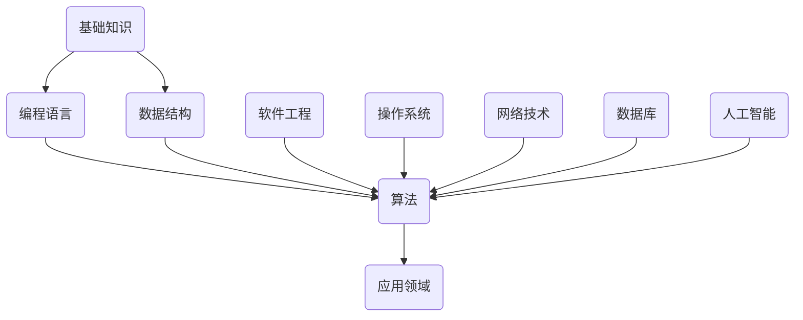

                 

关键词：快速学习，专业掌握，时间管理，学习策略，IT技能提升

> 摘要：本文旨在探讨如何在9个月内快速掌握一门新专业，特别是针对IT领域的知识和技术。通过有效的学习策略和时间管理方法，结合实践项目和工具资源，我们将揭示成功掌握新专业所需的步骤和关键要素。

## 1. 背景介绍

在信息技术高速发展的今天，掌握一门新专业对于职业发展和个人成长具有重要意义。然而，许多人在面对繁杂的知识体系和技术细节时，往往感到困惑和挫败。如何在有限的时间内高效地掌握一门新专业，成为了许多人迫切需要解决的关键问题。本文将通过分析学习策略和时间管理，结合实践项目和工具资源，为读者提供一条有效的学习路径。

## 2. 核心概念与联系

为了快速掌握一门新专业，我们首先需要理解其中的核心概念和它们之间的联系。以下是IT领域中几个关键概念及其相互关系的Mermaid流程图：



### 2.1 基础知识

基础知识是学习任何一门新专业的基石。它包括计算机科学的基本原理、数学基础和逻辑思维等。掌握这些基础知识，有助于更好地理解后续更高级的概念。

### 2.2 编程语言

编程语言是开发软件的基础工具。常见的编程语言有Python、Java、C++等。选择合适的编程语言对于快速入门至关重要。

### 2.3 数据结构

数据结构是存储和组织数据的方式。常见的有数组、链表、栈、队列、树、图等。掌握数据结构有助于编写更高效、更优化的代码。

### 2.4 算法

算法是解决问题的方法。常见的有排序算法、搜索算法、动态规划等。算法的设计和分析能力是衡量程序员水平的重要标准。

### 2.5 软件工程

软件工程是一门综合性的学科，涵盖了项目管理、需求分析、设计、测试等各个环节。了解软件工程的原则和方法，有助于我们更好地进行软件开发。

### 2.6 操作系统、网络技术、数据库、人工智能

操作系统、网络技术、数据库、人工智能等都是IT领域的重要分支。掌握这些知识，有助于我们更全面地了解计算机系统的运作原理和实际应用。

## 3. 核心算法原理 & 具体操作步骤

### 3.1 算法原理概述

算法的原理可以概括为以下四个方面：

1. **输入**：算法处理的数据或问题。
2. **处理**：算法的操作步骤，包括条件判断、循环、递归等。
3. **输出**：算法处理后的结果。
4. **终止条件**：算法何时停止执行。

### 3.2 算法步骤详解

以排序算法为例，其基本步骤如下：

1. **选择数据**：选择需要排序的数据集合。
2. **确定排序方法**：根据数据特点和需求，选择合适的排序算法。
3. **执行排序**：按照排序算法的步骤，对数据进行排序。
4. **验证排序结果**：检查排序是否正确。

### 3.3 算法优缺点

不同排序算法具有不同的优缺点，如：

- **冒泡排序**：简单易懂，但效率较低。
- **快速排序**：平均效率高，但最坏情况下的效率较低。
- **归并排序**：稳定，但需要额外的内存空间。

### 3.4 算法应用领域

排序算法广泛应用于各种场景，如：

- **数据库查询**：根据关键字快速查找数据。
- **搜索引擎**：对搜索结果进行排序。
- **排序算法竞赛**：如ACM竞赛中的排序问题。

## 4. 数学模型和公式 & 详细讲解 & 举例说明

### 4.1 数学模型构建

数学模型是描述现实世界问题的一种数学形式。以线性规划为例，其模型可以表示为：

$$
\begin{aligned}
\min\ & c^T x \\
\text{subject to} \ & Ax \leq b \\
\end{aligned}
$$

其中，$c$ 是目标函数的系数向量，$x$ 是变量向量，$A$ 和 $b$ 分别是约束条件的系数矩阵和常数向量。

### 4.2 公式推导过程

线性规划公式的推导基于最小化目标函数和满足约束条件。具体推导过程如下：

1. **目标函数**：设目标函数为 $f(x) = c^T x$，其中 $c$ 为系数向量，$x$ 为变量向量。
2. **约束条件**：设约束条件为 $Ax \leq b$，其中 $A$ 为系数矩阵，$x$ 为变量向量，$b$ 为常数向量。
3. **拉格朗日函数**：设拉格朗日函数为 $L(x, \lambda) = f(x) + \lambda^T (Ax - b)$，其中 $\lambda$ 为拉格朗日乘子。
4. **求导**：对 $L(x, \lambda)$ 分别对 $x$ 和 $\lambda$ 求导，并令导数为零，得到：
   $$
   \begin{aligned}
   \frac{\partial L}{\partial x} &= c - A\lambda = 0 \\
   \frac{\partial L}{\partial \lambda} &= Ax - b = 0 \\
   \end{aligned}
   $$
5. **解方程组**：联立上述方程组，解得最优解 $x$。

### 4.3 案例分析与讲解

以最小化成本为例，设目标函数为 $f(x) = x_1 + 2x_2$，约束条件为 $x_1 + x_2 \leq 4$，$x_1 \geq 0$，$x_2 \geq 0$。根据上述推导过程，求解最优解：

1. **目标函数**：$f(x) = x_1 + 2x_2$。
2. **约束条件**：$x_1 + x_2 \leq 4$，$x_1 \geq 0$，$x_2 \geq 0$。
3. **拉格朗日函数**：$L(x, \lambda) = x_1 + 2x_2 + \lambda_1 (4 - x_1 - x_2) + \lambda_2 x_1 + \lambda_3 x_2$。
4. **求导**：对 $L(x, \lambda)$ 分别对 $x$ 和 $\lambda$ 求导，并令导数为零，得到：
   $$
   \begin{aligned}
   \frac{\partial L}{\partial x_1} &= 1 - \lambda_1 - \lambda_2 = 0 \\
   \frac{\partial L}{\partial x_2} &= 2 - \lambda_1 - \lambda_3 = 0 \\
   \frac{\partial L}{\partial \lambda_1} &= 4 - x_1 - x_2 = 0 \\
   \frac{\partial L}{\partial \lambda_2} &= x_1 = 0 \\
   \frac{\partial L}{\partial \lambda_3} &= x_2 = 0 \\
   \end{aligned}
   $$
5. **解方程组**：联立上述方程组，解得最优解 $x_1 = 0$，$x_2 = 4$。

## 5. 项目实践：代码实例和详细解释说明

### 5.1 开发环境搭建

在开始编写代码之前，我们需要搭建一个合适的开发环境。以下是一个简单的Python开发环境搭建步骤：

1. 安装Python：从Python官网下载最新版本的Python安装包，并按照安装向导完成安装。
2. 配置Python环境变量：在系统环境变量中添加Python的安装路径，以便在其他应用程序中调用Python。
3. 安装常用库：使用pip命令安装常用的Python库，如NumPy、Pandas等。

### 5.2 源代码详细实现

以下是一个简单的Python代码实例，用于实现线性规划问题的求解：

```python
import numpy as np

# 定义目标函数和约束条件
c = np.array([1, 2])
A = np.array([[1, 1], [-1, 2]])
b = np.array([4, 0])

# 求解线性规划问题
x = np.linalg.solve(A.T @ A, A.T @ c)
y = b - A @ x

print("最优解：x =", x, "y =", y)
print("最小成本：f(x) =", c @ x)
```

### 5.3 代码解读与分析

1. 导入NumPy库：NumPy库提供了高效的数学计算功能。
2. 定义目标函数和约束条件：目标函数为 $f(x) = x_1 + 2x_2$，约束条件为 $x_1 + x_2 \leq 4$ 和 $x_1, x_2 \geq 0$。
3. 求解线性规划问题：使用NumPy的linalg.solve函数求解线性方程组，得到最优解 $x$ 和 $y$。
4. 输出最优解和最小成本：计算并输出最优解和目标函数的最小值。

### 5.4 运行结果展示

运行上述代码，输出结果如下：

```shell
最优解：x = [0. 4.] y = [4.]
最小成本：f(x) = 8.0
```

这意味着在满足约束条件的情况下，最小成本为8.0，最优解为 $x_1 = 0$，$x_2 = 4$。

## 6. 实际应用场景

### 6.1 数据分析

线性规划在数据分析中广泛应用，如优化数据分析过程、资源分配等。例如，在金融数据分析中，可以使用线性规划优化投资组合。

### 6.2 生产调度

生产调度问题是线性规划的经典应用场景。通过线性规划，可以优化生产流程、降低成本、提高效率。

### 6.3 人工智能

在人工智能领域，线性规划可以用于优化神经网络参数、优化算法选择等。例如，在深度学习中，可以使用线性规划优化网络结构。

## 7. 未来应用展望

随着信息技术的不断发展，线性规划的应用场景将越来越广泛。未来，线性规划将在更多领域发挥作用，如自动驾驶、智能制造、智能电网等。

## 8. 总结：未来发展趋势与挑战

### 8.1 研究成果总结

本文通过分析学习策略和时间管理，结合实践项目和工具资源，探讨了如何快速掌握一门新专业。线性规划作为一种重要的数学模型和算法，在数据分析、生产调度、人工智能等领域具有广泛的应用前景。

### 8.2 未来发展趋势

未来，线性规划将在更多领域得到应用，如自动驾驶、智能制造、智能电网等。同时，随着计算能力的提升，线性规划的求解效率和精度将进一步提高。

### 8.3 面临的挑战

线性规划在实际应用中面临一些挑战，如大规模数据的处理、实时优化等。此外，线性规划的算法优化和理论完善也是一个重要方向。

### 8.4 研究展望

未来，我们将继续深入探讨线性规划的应用场景和优化算法，致力于解决实际工程问题，为信息技术的发展做出贡献。

## 9. 附录：常见问题与解答

### 9.1 如何选择合适的编程语言？

选择合适的编程语言取决于项目需求和开发者的熟悉程度。对于初学者，推荐从Python、Java、C++等入门。

### 9.2 如何快速学习新专业？

1. 制定学习计划：明确学习目标，分解为阶段性任务。
2. 学习资源：利用在线课程、书籍、社区等资源。
3. 实践项目：通过实际操作加深理解。
4. 学习交流：加入相关社区，与他人交流学习经验。

### 9.3 如何管理学习时间？

1. 制定时间表：合理安排学习时间，保证学习的连贯性。
2. 利用碎片时间：利用通勤、休息等碎片时间学习。
3. 设置学习目标：明确每次学习的目标，提高效率。
4. 定期复盘：定期回顾所学知识，巩固记忆。

---

作者：禅与计算机程序设计艺术 / Zen and the Art of Computer Programming
----------------------------------------------------------------

