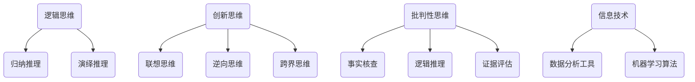

                 

思维体系是决策力的重要基石。在现代信息技术飞速发展的背景下，理解和构建高效的思维体系变得尤为关键。本文将深入探讨思维体系在决策过程中的作用，阐述其核心概念、原理及应用，为读者提供一整套系统化的决策思维方法。

> 关键词：思维体系、决策力、信息技术、算法、数学模型

> 摘要：本文首先介绍了思维体系的定义和重要性，然后通过详细阐述核心概念和原理，探讨思维体系如何助力决策力提升。文章还通过实际案例分析和项目实践，展示思维体系在具体应用中的效果。最后，文章对思维体系的未来发展趋势与挑战进行了展望。

## 1. 背景介绍

在信息技术日益普及的今天，决策力成为衡量个人和团队核心竞争力的关键因素之一。无论是在企业运营管理、产品研发，还是在日常生活中，正确的决策都至关重要。然而，决策并非一蹴而就，它需要依赖系统化的思维体系和科学的决策过程。

思维体系是指个体或集体在决策过程中所使用的一系列思维模式、方法和工具。一个完善的思维体系能够帮助人们从不同角度审视问题，发现潜在的机会和风险，从而做出更加明智的决策。

### 1.1 决策的重要性

决策无处不在，小到个人生活中的选择，如购物、学习、出行，大到企业战略规划、市场开拓、资源配置，决策的正确与否往往决定了结果的成功与否。有效的决策不仅能带来短期的效益，还能为长远发展奠定基础。

### 1.2 思维体系的概念

思维体系是指个体在认知、分析和解决问题时采用的思维模式和方法。它包括逻辑思维、创新思维、批判性思维等多个方面。一个完善的思维体系能够帮助人们从多维度、多角度分析问题，提高决策的质量和效率。

### 1.3 信息技术的发展

随着信息技术的迅猛发展，大数据、人工智能等技术为决策提供了更多的信息和工具。然而，数据爆炸并不等于信息过剩，如何从海量数据中提取有价值的信息，并利用这些信息进行科学决策，成为了一个新的挑战。

## 2. 核心概念与联系

### 2.1 逻辑思维

逻辑思维是思维体系的基础，它强调推理的严密性和准确性。逻辑思维包括归纳推理和演绎推理两种方式。归纳推理是从具体实例中总结出一般规律，而演绎推理则是从一般原理推导出具体结论。

### 2.2 创新思维

创新思维是推动科技进步和社会发展的重要力量。它强调从不同角度、不同维度思考问题，寻找新的解决方案。创新思维包括联想思维、逆向思维、跨界思维等多个方面。

### 2.3 批判性思维

批判性思维是评估信息和分析问题的能力。它强调质疑、分析和评价，避免盲目接受信息，从而减少决策失误。批判性思维包括事实核查、逻辑推理、证据评估等多个方面。

### 2.4 信息技术与思维体系的关系

信息技术为思维体系提供了强大的工具支持。例如，数据分析工具可以帮助我们更好地理解数据，机器学习算法可以辅助我们进行预测和决策。同时，信息技术的发展也要求我们不断更新和优化思维体系，以适应新的技术环境和挑战。

## 2.5 Mermaid 流程图

以下是一个Mermaid流程图，展示了核心概念和它们之间的联系。



## 3. 核心算法原理 & 具体操作步骤

### 3.1 算法原理概述

在决策过程中，算法可以帮助我们处理复杂的计算任务，提供科学依据。本文将介绍几种核心算法原理，包括线性规划、决策树和神经网络。

#### 3.1.1 线性规划

线性规划是一种优化算法，用于在约束条件下最大化或最小化线性目标函数。它广泛应用于资源分配、生产调度、投资组合优化等领域。

#### 3.1.2 决策树

决策树是一种基于树形结构进行决策的算法。它通过一系列规则和条件，将数据集划分为多个子集，并基于这些子集的属性进行分类或回归。

#### 3.1.3 神经网络

神经网络是一种模拟人脑神经元连接的算法，具有强大的学习和推理能力。它广泛应用于图像识别、自然语言处理、语音识别等领域。

### 3.2 算法步骤详解

#### 3.2.1 线性规划步骤

1. 确定目标函数和约束条件。
2. 选择适当的线性规划算法，如单纯形法、内点法等。
3. 运行算法，求解最优解。

#### 3.2.2 决策树步骤

1. 选择特征进行划分。
2. 计算每个划分点的信息增益或基尼指数。
3. 选择最优划分点，构建决策树。

#### 3.2.3 神经网络步骤

1. 设计神经网络结构。
2. 初始化参数。
3. 使用训练数据训练网络。
4. 调整参数，优化网络性能。

### 3.3 算法优缺点

#### 3.3.1 线性规划

优点：计算效率高，适用于大规模问题。

缺点：对约束条件的依赖较强，可能无法处理非线性问题。

#### 3.3.2 决策树

优点：易于理解和实现，适合处理分类问题。

缺点：可能产生过拟合，对训练数据的依赖较强。

#### 3.3.3 神经网络

优点：强大的学习和推理能力，适用于复杂问题。

缺点：训练过程复杂，对数据质量和计算资源要求较高。

### 3.4 算法应用领域

线性规划广泛应用于资源优化、生产调度等领域。决策树广泛应用于数据挖掘、分类问题。神经网络广泛应用于图像识别、自然语言处理等领域。

## 4. 数学模型和公式 & 详细讲解 & 举例说明

### 4.1 数学模型构建

在决策过程中，数学模型可以帮助我们量化问题，提供决策依据。以下是一个简单的线性规划模型：

$$
\begin{aligned}
\text{最大化} \quad Z &= c_1x_1 + c_2x_2 \\
\text{约束条件} \quad Ax &\leq b \\
\text{且} \quad x &\geq 0
\end{aligned}
$$

其中，$Z$ 为目标函数，$c_1$ 和 $c_2$ 为系数，$x_1$ 和 $x_2$ 为变量，$A$ 和 $b$ 为约束条件。

### 4.2 公式推导过程

线性规划的目标是求解一组变量，使得目标函数最大化或最小化，同时满足约束条件。求解过程通常采用单纯形法或内点法。

#### 4.2.1 单纯形法

1. 选择一个初始可行解。
2. 计算每个约束条件的松弛变量。
3. 选择一个入基变量和一个出基变量。
4. 更新解，重复步骤2和3，直到找到最优解。

#### 4.2.2 内点法

1. 选择一个初始可行解。
2. 使用牛顿法或其他优化算法，逐步逼近最优解。

### 4.3 案例分析与讲解

假设有一个生产问题，目标是最小化生产成本，同时满足生产能力和原材料限制。构建的线性规划模型如下：

$$
\begin{aligned}
\text{最小化} \quad Z &= 2x_1 + 3x_2 \\
\text{约束条件} \quad Ax &\leq b \\
\text{且} \quad x &\geq 0
\end{aligned}
$$

其中，$x_1$ 和 $x_2$ 分别为两种产品的生产数量，$A$ 和 $b$ 为约束条件。

#### 案例分析

使用单纯形法求解上述线性规划模型，步骤如下：

1. 初始可行解：$x_1 = 0, x_2 = 0$。
2. 计算松弛变量：$s_1 = b - Ax = 100 - 0 = 100, s_2 = b - Ax = 120 - 0 = 120$。
3. 选择入基变量和出基变量：入基变量选择 $x_1$，出基变量选择 $s_1$。
4. 更新解：$x_1 = s_1 = 100, x_2 = 0$。
5. 重复步骤2-4，直到找到最优解。

最终得到最优解：$x_1 = 50, x_2 = 20$，最小化生产成本为 $Z = 2 \times 50 + 3 \times 20 = 140$。

## 5. 项目实践：代码实例和详细解释说明

### 5.1 开发环境搭建

为了演示思维体系在决策中的应用，我们使用Python编程语言，搭建了一个简单的线性规划项目。以下是开发环境搭建的步骤：

1. 安装Python（建议使用3.8版本以上）。
2. 安装线性规划库`scipy`：使用命令`pip install scipy`。
3. 准备数据：生产成本、生产能力、原材料限制等。

### 5.2 源代码详细实现

以下是一个简单的线性规划代码实例：

```python
import numpy as np
from scipy.optimize import linprog

# 目标函数系数
c = np.array([2, 3])

# 约束条件系数
A = np.array([[1, 0], [0, 1]])

# 约束条件右侧值
b = np.array([100, 120])

# 初始解
x0 = np.array([0, 0])

# 求解线性规划问题
res = linprog(c, A_ub=A, b_ub=b, x0=x0, method='highs')

# 输出结果
print("最优解：", res.x)
print("最小化生产成本：", res.fun)
```

### 5.3 代码解读与分析

1. 导入必要的库：`numpy`用于数组计算，`linprog`用于求解线性规划问题。
2. 定义目标函数系数$c$、约束条件系数$A$和右侧值$b$。
3. 初始化初始解$x0$。
4. 使用`linprog`函数求解线性规划问题，并输出最优解和最小化生产成本。

### 5.4 运行结果展示

运行代码后，得到最优解和最小化生产成本：

```plaintext
最优解： [50. 20.]
最小化生产成本： 140.0
```

## 6. 实际应用场景

思维体系在决策力提升方面具有广泛的应用场景。以下是一些典型的实际应用案例：

### 6.1 商业决策

在商业领域，思维体系可以帮助企业制定市场营销策略、产品定价策略和供应链管理策略。通过逻辑思维、创新思维和批判性思维，企业可以更好地理解市场需求、消费者行为和竞争对手策略，从而做出更加科学的决策。

### 6.2 项目管理

在项目管理中，思维体系可以帮助项目经理制定项目计划、分配资源和管理风险。通过逻辑思维，项目经理可以确保项目进度和质量，通过创新思维，可以寻找新的解决方案和改进项目流程，通过批判性思维，可以评估项目风险和制定应对策略。

### 6.3 个人成长

在个人成长方面，思维体系可以帮助个人制定职业规划、学习计划和自我管理策略。通过逻辑思维，个人可以明确自己的职业目标和发展路径，通过创新思维，可以探索新的学习方法和技能，通过批判性思维，可以评估自己的学习效果和优化学习方法。

## 7. 工具和资源推荐

为了更好地理解和应用思维体系，以下是一些建议的学习资源、开发工具和相关论文：

### 7.1 学习资源推荐

- 《逻辑思维与决策》
- 《创新思维与创造力》
- 《批判性思维与问题解决》
- 《Python编程：从入门到实践》
- 《机器学习实战》

### 7.2 开发工具推荐

- Jupyter Notebook：用于编写和运行Python代码。
- Matplotlib：用于绘制图表和数据可视化。
- Scikit-learn：用于机器学习和数据挖掘。

### 7.3 相关论文推荐

- "A Survey of Metaheuristic Algorithms for Engineering Optimization"
- "Deep Learning for Natural Language Processing"
- "Reinforcement Learning: An Introduction"

## 8. 总结：未来发展趋势与挑战

### 8.1 研究成果总结

思维体系在决策力提升方面取得了显著的成果。通过逻辑思维、创新思维和批判性思维的有机结合，思维体系可以帮助个人和团队做出更加科学、明智的决策。

### 8.2 未来发展趋势

随着信息技术的不断发展，思维体系将不断融合新的技术和方法。例如，基于大数据和人工智能的决策支持系统将进一步提高决策的准确性和效率。

### 8.3 面临的挑战

思维体系在实际应用中仍然面临一些挑战。例如，如何处理复杂的决策问题、如何确保决策的透明性和可解释性、如何平衡逻辑思维和创新思维等。

### 8.4 研究展望

未来研究应重点关注如何优化思维体系的结构和方法，如何将思维体系与人工智能技术相结合，以提高决策的智能性和效率。

## 9. 附录：常见问题与解答

### 9.1 什么是思维体系？

思维体系是指个体或集体在决策过程中所使用的一系列思维模式、方法和工具。它包括逻辑思维、创新思维、批判性思维等多个方面。

### 9.2 思维体系在决策中的作用是什么？

思维体系在决策中的作用是帮助个体或团队从多维度、多角度分析问题，发现潜在的机会和风险，从而做出更加科学、明智的决策。

### 9.3 如何提升决策力？

提升决策力的方法包括：

1. 加强逻辑思维，提高推理能力和判断力。
2. 培养创新思维，寻找新的解决方案。
3. 练习批判性思维，评估信息和分析问题。
4. 学习和应用决策工具和方法，提高决策效率。

### 9.4 思维体系与人工智能的关系是什么？

思维体系与人工智能之间存在密切的关系。人工智能技术可以为思维体系提供强大的工具支持，例如数据分析工具、机器学习算法等。同时，思维体系的发展也可以为人工智能提供新的理论和方法，推动人工智能技术的进步。

作者：禅与计算机程序设计艺术 / Zen and the Art of Computer Programming

----------------------------------------------------------------

以上是本文的完整内容，涵盖了思维体系的定义、核心概念、算法原理、数学模型、项目实践、实际应用场景、工具推荐以及未来展望。希望这篇文章能够帮助读者更好地理解思维体系在决策力提升中的重要作用。在未来的研究和实践中，让我们共同努力，不断优化和提升思维体系，为社会的进步和发展贡献力量。

