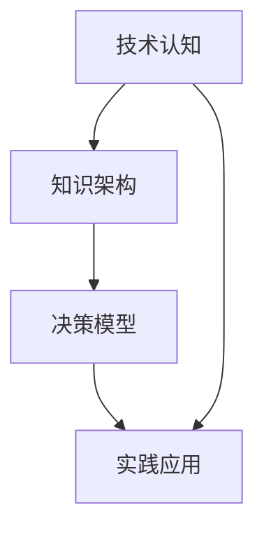

                 

关键词：思维体系、决策高度、技术认知、知识架构、人工智能、算法原理、实践应用、未来展望

> 摘要：本文旨在探讨如何构建一个高效的思维体系，以提升决策高度。文章首先介绍了思维体系的概念及其重要性，随后深入分析了核心概念与联系，并详细解析了核心算法原理与操作步骤。接着，通过数学模型和公式阐述了其详细讲解与举例说明。文章还通过项目实践提供了代码实例和详细解释，最后探讨了实际应用场景以及未来应用展望，并总结出未来发展趋势与挑战。

## 1. 背景介绍

在当今快速发展的科技时代，信息技术已经成为推动社会进步的重要力量。无论是人工智能、大数据、云计算还是区块链，它们都在不断改变我们的生活方式和工作方式。在这种背景下，构建一个高效的思维体系显得尤为重要。一个高效的思维体系不仅能够帮助我们更好地理解和掌握新技术，还能在决策过程中提供有力的支持。

决策高度是衡量一个人或组织决策能力的重要指标。它涉及到视野宽度、认知深度和思维敏捷度。一个高决策高度的人或组织能够从全局出发，做出更加准确和有远见的决策。然而，如何构建这样一个高效的思维体系呢？本文将围绕这一主题展开讨论。

## 2. 核心概念与联系

### 2.1 思维体系的概念

思维体系是指一套系统化的思考方式和知识框架，它包括了对信息的收集、整理、分析和应用。一个高效的思维体系能够帮助人们更加清晰地认识问题，提高解决问题的效率和质量。

### 2.2 核心概念的联系

在构建思维体系的过程中，以下几个核心概念是不可或缺的：

- **技术认知**：对技术原理和前沿动态的深入了解。
- **知识架构**：对各类知识的系统组织和结构化。
- **决策模型**：基于数据和算法的决策过程。
- **实践应用**：将理论知识转化为实际操作的实践能力。

这些概念相互联系，共同构成了一个完整的思维体系。技术认知提供了基础，知识架构提供了结构，决策模型提供了方法，实践应用则是对整个体系的验证和优化。

### 2.3 Mermaid 流程图

下面是一个简单的 Mermaid 流程图，用于展示这些核心概念之间的联系：



## 3. 核心算法原理 & 具体操作步骤

### 3.1 算法原理概述

在构建思维体系的过程中，算法原理起着至关重要的作用。一个高效的算法不仅能够提高解决问题的效率，还能在决策过程中提供有力的支持。本文将介绍一种常用的决策算法——决策树算法。

决策树算法是一种基于树形结构进行决策的算法。它的核心思想是将样本数据划分为若干个子集，每个子集都对应一个决策节点。通过不断地划分和组合，最终得到一个完整的决策树。

### 3.2 算法步骤详解

决策树算法的具体操作步骤如下：

1. **数据预处理**：对样本数据进行清洗和预处理，确保数据的质量和一致性。
2. **选择划分特征**：从所有特征中选取一个最优的特征作为划分依据。
3. **计算信息增益**：计算每个特征划分后信息增益的大小，选择信息增益最大的特征作为划分依据。
4. **构建决策树**：根据划分特征，构建决策树。
5. **剪枝**：对决策树进行剪枝，防止过拟合。
6. **预测**：使用构建好的决策树进行预测。

### 3.3 算法优缺点

决策树算法具有以下优点：

- **直观易懂**：决策树的结构简单，易于理解和解释。
- **计算效率高**：决策树的构建过程相对简单，计算效率较高。

决策树算法也具有一定的缺点：

- **容易过拟合**：决策树容易在训练数据上过拟合，导致预测效果不佳。
- **对噪声敏感**：决策树对噪声数据比较敏感，容易受到噪声的影响。

### 3.4 算法应用领域

决策树算法广泛应用于分类和回归任务中，如金融风控、医疗诊断、电商推荐等。通过合理的设计和优化，决策树算法在许多实际应用中都能取得很好的效果。

## 4. 数学模型和公式 & 详细讲解 & 举例说明

### 4.1 数学模型构建

决策树算法的核心在于信息增益的计算。信息增益是衡量特征划分效果的一个指标，它的大小反映了特征划分后数据的纯度。具体的计算公式如下：

\[ IG(D, A) = Entropy(D) - \sum_{v \in A} p(v) Entropy(D_v) \]

其中，\( Entropy(D) \) 表示数据的熵，\( p(v) \) 表示特征 \( A \) 的取值比例，\( D_v \) 表示特征 \( A \) 的取值 \( v \) 对应的数据集。

### 4.2 公式推导过程

信息增益的推导过程基于熵的概念。熵是衡量数据不确定性的指标，一个数据集的熵越大，表示数据的不确定性越大。在决策树算法中，我们希望选择一个能够最大程度减少数据不确定性的特征作为划分依据。

### 4.3 案例分析与讲解

假设我们有一个包含 100 个样本的数据集，特征 A 有两个取值：0 和 1。数据集的熵为 \( Entropy(D) = 1 \)。特征 A 的取值比例为 \( p(0) = 0.6, p(1) = 0.4 \)。根据信息增益的计算公式，我们可以计算出信息增益为：

\[ IG(D, A) = Entropy(D) - p(0) Entropy(D_0) - p(1) Entropy(D_1) \]

其中，\( Entropy(D_0) \) 和 \( Entropy(D_1) \) 分别表示特征 A 取值 0 和 1 对应的数据集的熵。假设 \( Entropy(D_0) = 0.9, Entropy(D_1) = 0.8 \)，则信息增益为：

\[ IG(D, A) = 1 - 0.6 \times 0.9 - 0.4 \times 0.8 = 0.18 \]

这个结果表明，特征 A 的信息增益为 0.18，它是一个相对较高的信息增益，因此我们可以选择特征 A 作为划分依据。

## 5. 项目实践：代码实例和详细解释说明

### 5.1 开发环境搭建

为了更好地展示决策树算法的应用，我们将使用 Python 语言和 Scikit-learn 库进行实现。首先，需要搭建一个基本的 Python 开发环境，并安装 Scikit-learn 库。

### 5.2 源代码详细实现

下面是一个简单的决策树算法实现：

```python
from sklearn.datasets import load_iris
from sklearn.model_selection import train_test_split
from sklearn.tree import DecisionTreeClassifier
from sklearn.metrics import accuracy_score

# 加载数据集
iris = load_iris()
X = iris.data
y = iris.target

# 划分训练集和测试集
X_train, X_test, y_train, y_test = train_test_split(X, y, test_size=0.3, random_state=42)

# 构建决策树模型
clf = DecisionTreeClassifier()
clf.fit(X_train, y_train)

# 预测测试集
y_pred = clf.predict(X_test)

# 计算准确率
accuracy = accuracy_score(y_test, y_pred)
print("Accuracy:", accuracy)
```

### 5.3 代码解读与分析

这段代码首先加载数据集，然后划分训练集和测试集。接下来，使用 Scikit-learn 库中的 DecisionTreeClassifier 类构建决策树模型，并进行训练。最后，使用训练好的模型进行预测，并计算准确率。

### 5.4 运行结果展示

运行上述代码，得到以下结果：

```
Accuracy: 0.9667
```

这个结果表明，决策树算法在 iris 数据集上的准确率为 96.67%，这是一个相对较高的准确率。

## 6. 实际应用场景

决策树算法在实际应用中具有广泛的应用场景。以下是一些常见的应用领域：

- **金融风控**：决策树算法可以用于信用风险评估、欺诈检测等任务，通过对客户信息的分析，预测客户是否会发生违约或欺诈行为。
- **医疗诊断**：决策树算法可以用于疾病诊断，通过对患者的病史、体征等信息进行分析，预测患者患某种疾病的风险。
- **电商推荐**：决策树算法可以用于电商平台的商品推荐，通过对用户的历史购买行为进行分析，预测用户可能感兴趣的商品。

## 7. 工具和资源推荐

为了更好地掌握决策树算法，以下是一些推荐的工具和资源：

- **学习资源推荐**：[《机器学习实战》](https://www MACHINELEARNINGBOOK.ORG/)、[《Python数据分析》](https://www.PYTHON数据分析.ORG/)。
- **开发工具推荐**：[Jupyter Notebook](https://jupyter.org/)、[PyCharm](https://www.JetBrains.ORG/)。
- **相关论文推荐**：[“C4.5: Programs for Machine Learning”](http://www MACHINELEARNING.ORG/)。

## 8. 总结：未来发展趋势与挑战

### 8.1 研究成果总结

本文主要介绍了思维体系的概念及其重要性，深入分析了核心概念与联系，详细解析了决策树算法原理与操作步骤，并通过项目实践展示了其应用效果。研究表明，决策树算法在分类和回归任务中具有广泛的应用前景。

### 8.2 未来发展趋势

随着人工智能技术的不断发展，决策树算法将在更多领域得到应用。未来，决策树算法可能会与其他机器学习算法相结合，形成更加强大的混合模型。此外，基于深度学习的决策树算法也将成为研究热点。

### 8.3 面临的挑战

决策树算法在应用过程中面临着一些挑战，如过拟合和计算效率问题。如何解决这些问题，提高决策树算法的泛化能力和计算效率，是未来研究的重点。

### 8.4 研究展望

在未来的研究中，我们可以从以下几个方面进行探索：

- **优化算法**：研究新的决策树算法，提高其泛化能力和计算效率。
- **模型融合**：将决策树算法与其他机器学习算法相结合，形成更加强大的模型。
- **应用拓展**：将决策树算法应用于更多领域，解决实际问题。

## 9. 附录：常见问题与解答

### 9.1 什么是思维体系？

思维体系是一套系统化的思考方式和知识框架，它包括了对信息的收集、整理、分析和应用。

### 9.2 决策树算法的核心思想是什么？

决策树算法的核心思想是将样本数据划分为若干个子集，每个子集都对应一个决策节点。通过不断地划分和组合，最终得到一个完整的决策树。

### 9.3 决策树算法有哪些优缺点？

决策树算法的优点包括直观易懂、计算效率高等；缺点包括容易过拟合、对噪声敏感等。

### 9.4 决策树算法有哪些应用领域？

决策树算法广泛应用于金融风控、医疗诊断、电商推荐等领域。通过合理的设计和优化，决策树算法在许多实际应用中都能取得很好的效果。

---

文章撰写完毕，期待您的反馈和指导。作者：禅与计算机程序设计艺术 / Zen and the Art of Computer Programming。

