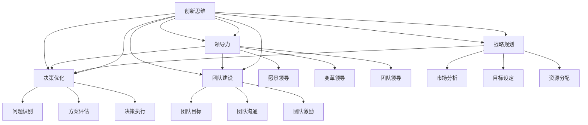

                 

关键词：思维体系，管理者，技能提升，领导力，战略规划，决策优化，团队建设，创新思维，技术领导。

> 摘要：在信息技术飞速发展的今天，管理者不仅要具备深厚的专业知识，更需要拥有强大的思维体系。本文将深入探讨如何塑造管理者的思维体系，包括核心概念的理解、算法原理的掌握、数学模型的构建、实际应用场景的解析，以及未来发展的趋势与挑战。通过这篇技术博客，希望能为广大IT领域管理者提供有益的指导和启示。

## 1. 背景介绍

在全球化、数字化和信息化的背景下，信息技术已经成为推动社会进步和经济发展的关键力量。作为IT行业的管理者，不仅需要具备丰富的技术知识和项目经验，更重要的是要具备强大的思维体系，以应对复杂多变的市场环境和业务需求。思维体系是管理者决策能力、领导力、创新能力和团队协作能力的基础，其重要性不言而喻。

然而，当前许多IT管理者在思维方式上存在一些共性问题。首先，他们往往过于依赖技术本身，而忽略了业务需求和战略目标的导向。其次，部分管理者在解决问题的过程中缺乏系统性和结构性，导致决策效率低下。此外，管理者在创新思维和跨领域协作方面也存在不足，难以引领团队在激烈的市场竞争中脱颖而出。

本文旨在通过深入分析思维体系的核心概念、算法原理、数学模型，并结合实际应用场景，为IT领域管理者提供一套完整、实用的思维塑造方法论。希望通过本文的阐述，能够帮助管理者提升思维能力，增强领导力和战略规划能力，从而在信息技术的变革浪潮中立于不败之地。

## 2. 核心概念与联系

为了塑造管理者的思维体系，首先需要理解一些核心概念，这些概念彼此之间有着紧密的联系，构成了管理者思维体系的基础。

### 2.1 创新思维

创新思维是指管理者在面对问题时，能够跳出传统思维框架，提出新颖的解决方案。创新思维是管理者思维体系中的核心，它要求管理者具备广泛的知识背景、敏锐的洞察力和丰富的想象力。

#### 2.1.1 创新思维的组成部分

- **发散思维**：指管理者在解决问题时能够从多个角度、多个层面进行思考，找到多种可能的解决方案。

- **收敛思维**：指管理者在众多解决方案中，能够选择最优的方案进行实施。

- **系统思维**：指管理者在解决问题时，能够将问题视为一个系统，从整体出发，考虑各部分之间的相互关系和影响。

#### 2.1.2 创新思维的应用场景

- **产品创新**：管理者可以通过创新思维，推动产品从设计、开发到市场的各个环节，实现创新。

- **管理创新**：管理者可以通过创新思维，提出新的管理策略和方法，提升团队效能。

### 2.2 领导力

领导力是指管理者在团队中通过影响和激励，引导团队成员实现共同目标的能力。领导力是管理者思维体系中的关键，它要求管理者具备强烈的责任感、卓越的沟通能力和高尚的道德品质。

#### 2.2.1 领导力的组成部分

- **愿景领导**：指管理者能够为团队描绘清晰的发展蓝图，激发团队成员的积极性和创造力。

- **变革领导**：指管理者在面临组织变革时，能够带领团队平稳过渡，实现目标。

- **团队领导**：指管理者能够建立高效的团队，通过有效的沟通和协作，实现团队目标。

#### 2.2.2 领导力的应用场景

- **项目领导**：管理者在项目实施过程中，通过领导力，协调各方资源，确保项目顺利推进。

- **团队建设**：管理者通过领导力，建立积极向上的团队文化，提升团队凝聚力。

### 2.3 战略规划

战略规划是指管理者根据组织的发展目标，制定长远的发展规划和策略。战略规划是管理者思维体系中的核心，它要求管理者具备宏观的视野、深入的洞察力和前瞻性的思维。

#### 2.3.1 战略规划的组成部分

- **市场分析**：指管理者对市场环境进行深入分析，了解市场趋势和竞争态势。

- **目标设定**：指管理者根据市场分析结果，设定组织的发展目标。

- **资源分配**：指管理者根据发展目标，合理配置资源，确保目标的实现。

#### 2.3.2 战略规划的应用场景

- **企业发展战略**：管理者通过战略规划，为企业制定长远的发展方向和策略。

- **项目规划**：管理者通过战略规划，确保项目在有限资源下，实现最佳效果。

### 2.4 决策优化

决策优化是指管理者在面对复杂问题时，通过科学的分析和评估，选择最优的决策方案。决策优化是管理者思维体系中的重要环节，它要求管理者具备系统的分析能力、逻辑思维能力和数据敏感性。

#### 2.4.1 决策优化的组成部分

- **问题识别**：指管理者能够准确识别问题，明确问题的核心。

- **方案评估**：指管理者对多种可能的解决方案进行评估，选择最优方案。

- **决策执行**：指管理者将决策方案付诸实践，确保决策效果。

#### 2.4.2 决策优化的应用场景

- **资源配置**：管理者通过决策优化，确保资源得到最优配置，提升组织效能。

- **风险管理**：管理者通过决策优化，降低项目风险，保障项目成功。

### 2.5 团队建设

团队建设是指管理者通过有效的沟通、协作和激励，提升团队的凝聚力和战斗力。团队建设是管理者思维体系中的重要组成部分，它要求管理者具备良好的团队管理能力和人际交往能力。

#### 2.5.1 团队建设的组成部分

- **团队目标**：指管理者明确团队的目标，确保团队成员目标一致。

- **团队沟通**：指管理者建立有效的沟通机制，促进团队成员之间的信息交流。

- **团队激励**：指管理者通过激励机制，激发团队成员的积极性和创造力。

#### 2.5.2 团队建设的应用场景

- **项目团队建设**：管理者通过团队建设，提升项目团队的执行力和协作能力。

- **跨部门协作**：管理者通过团队建设，促进不同部门之间的协作和沟通。

### 2.6 算法思维

算法思维是指管理者在面对复杂问题时，能够运用算法思想和解决问题的方法，寻找最优解。算法思维是管理者思维体系中的重要工具，它要求管理者具备逻辑思维能力、分析能力和创新精神。

#### 2.6.1 算法思维的应用场景

- **数据分析**：管理者通过算法思维，对海量数据进行分析，发现潜在的商业机会。

- **优化决策**：管理者通过算法思维，优化决策过程，提高决策的科学性和准确性。

#### 2.6.2 算法思维与决策优化的关系

算法思维和决策优化密切相关。管理者通过算法思维，可以更加科学地分析问题，评估多种可能的解决方案，从而选择最优的决策方案。算法思维为决策优化提供了强大的工具支持，使管理者能够更加高效地做出决策。

### 2.7 Mermaid 流程图

为了更好地理解上述核心概念之间的联系，我们可以使用Mermaid流程图进行展示。以下是核心概念之间的Mermaid流程图：



通过这个流程图，我们可以清晰地看到各个核心概念之间的联系和互动。创新思维、领导力、战略规划、决策优化和团队建设相互交织，构成了管理者思维体系的核心框架。

## 3. 核心算法原理 & 具体操作步骤

### 3.1 算法原理概述

在塑造管理者的思维体系中，算法思维扮演着至关重要的角色。算法原理不仅是计算机科学的基础，也是管理者解决问题的有力工具。以下将简要概述算法原理，并探讨其在管理中的应用。

#### 3.1.1 算法原理

算法原理是指解决问题的步骤和规则。一个良好的算法应该具备以下特征：

- **确定性**：算法的每一步都是明确的，无歧义。
- **有效性**：算法能够在合理的时间内解决问题。
- **健壮性**：算法能够在各种情况下都能正常运行。
- **可扩展性**：算法能够适应不同规模的问题。

#### 3.1.2 算法类型

算法根据其解决问题的方法可以分为以下几种类型：

- **排序算法**：用于对数据进行排序，如快速排序、归并排序等。
- **查找算法**：用于在数据集合中查找特定元素，如二分查找、线性查找等。
- **动态规划**：用于解决最优子结构问题，如背包问题、最优路径问题等。
- **贪心算法**：通过每一步选择局部最优解，以期望得到全局最优解。
- **分治算法**：将问题划分为子问题，分别求解，再将子问题的解合并为原问题的解。

#### 3.1.3 算法在管理中的应用

算法原理在管理中的应用体现在以下几个方面：

- **决策优化**：管理者可以使用算法思想，对各种决策方案进行分析和评估，选择最优方案。
- **资源分配**：管理者可以根据算法原理，优化资源分配，提高资源利用率。
- **流程优化**：管理者可以利用算法思维，对业务流程进行重构和优化，提高效率。
- **数据驱动决策**：管理者可以通过算法分析数据，提取有价值的信息，指导决策。

### 3.2 算法步骤详解

以下是一个简单的排序算法——冒泡排序的步骤详解，以展示算法原理在具体问题中的应用。

#### 3.2.1 冒泡排序算法步骤

1. **初始化**：将待排序的元素存储在一个数组中。

2. **外层循环**：从数组的第一个元素开始，遍历到倒数第二个元素，表示需要比较的轮数。

3. **内层循环**：在每一轮中，从数组的第一个元素开始，遍历到当前轮次对应的最后一个元素，比较相邻的两个元素的大小。

4. **交换操作**：如果发现相邻的两个元素顺序错误，则交换它们的位置。

5. **结束条件**：如果内层循环没有进行任何交换操作，说明数组已经排序完成，算法结束。

#### 3.2.2 冒泡排序算法代码实现

以下是用Python实现的冒泡排序算法：

```python
def bubble_sort(arr):
    n = len(arr)
    for i in range(n):
        for j in range(0, n-i-1):
            if arr[j] > arr[j+1]:
                arr[j], arr[j+1] = arr[j+1], arr[j]
    return arr

# 测试代码
arr = [64, 34, 25, 12, 22, 11, 90]
sorted_arr = bubble_sort(arr)
print("排序后的数组：", sorted_arr)
```

#### 3.2.3 冒泡排序算法分析

- **时间复杂度**：O(n²)，在最坏情况下，需要比较n(n-1)/2次。
- **空间复杂度**：O(1)，算法在原地排序，不需要额外的存储空间。

尽管冒泡排序在时间复杂度上不是最优的，但其简单易懂，适合教学和基础练习。在实际应用中，更多情况下会使用更高效的排序算法，如快速排序、归并排序等。

### 3.3 算法优缺点

#### 优点

- **简单易懂**：算法逻辑简单，容易理解和实现。
- **高效性**：在某些特定场景下，冒泡排序可以非常高效，尤其是在数组基本有序的情况下。

#### 缺点

- **时间复杂度较高**：在数据规模较大时，冒泡排序的性能会急剧下降。
- **不适用于大规模数据处理**：由于其时间复杂度为O(n²)，不适合处理大量数据。

### 3.4 算法应用领域

算法原理在管理中的应用领域非常广泛，以下是一些典型应用：

- **项目管理**：管理者可以使用算法优化项目进度安排，资源分配和风险控制。
- **供应链管理**：管理者可以利用算法优化库存管理，运输调度和采购计划。
- **市场营销**：管理者可以通过算法分析市场数据，进行客户细分和市场细分，制定更有效的营销策略。
- **人力资源**：管理者可以利用算法优化招聘流程，绩效评估和员工培训。

通过算法原理的应用，管理者可以在复杂多变的环境中，做出更加科学、准确的决策，提升组织的管理水平和竞争力。

## 4. 数学模型和公式 & 详细讲解 & 举例说明

### 4.1 数学模型构建

在管理者的思维体系中，数学模型扮演着不可或缺的角色。数学模型能够将复杂的管理问题转化为数学形式，使管理者能够通过数学方法进行求解和分析。以下是一个简单的线性回归模型构建过程。

#### 4.1.1 线性回归模型

线性回归模型是一种用于研究自变量（X）与因变量（Y）之间线性关系的数学模型。其一般形式为：

\[ Y = \beta_0 + \beta_1 X + \epsilon \]

其中：

- \( Y \) 为因变量
- \( X \) 为自变量
- \( \beta_0 \) 为截距
- \( \beta_1 \) 为斜率
- \( \epsilon \) 为误差项

#### 4.1.2 数据准备

假设我们有一组数据：

| X | Y |
|---|---|
| 1 | 2 |
| 2 | 4 |
| 3 | 5 |
| 4 | 6 |
| 5 | 8 |

我们的目标是找到这条数据点的一条直线，以最小化预测值与实际值之间的误差。

#### 4.1.3 模型构建

为了构建线性回归模型，我们需要计算斜率 \( \beta_1 \) 和截距 \( \beta_0 \)。计算公式如下：

\[ \beta_1 = \frac{\sum(X_i - \bar{X})(Y_i - \bar{Y})}{\sum(X_i - \bar{X})^2} \]

\[ \beta_0 = \bar{Y} - \beta_1 \bar{X} \]

其中：

- \( \bar{X} \) 和 \( \bar{Y} \) 分别为自变量和因变量的平均值。

#### 4.1.4 计算过程

首先，我们计算 \( \bar{X} \) 和 \( \bar{Y} \)：

\[ \bar{X} = \frac{1+2+3+4+5}{5} = 3 \]

\[ \bar{Y} = \frac{2+4+5+6+8}{5} = 5 \]

然后，我们计算 \( \beta_1 \)：

\[ \beta_1 = \frac{(1-3)(2-5) + (2-3)(4-5) + (3-3)(5-5) + (4-3)(6-5) + (5-3)(8-5)}{(1-3)^2 + (2-3)^2 + (3-3)^2 + (4-3)^2 + (5-3)^2} \]

\[ \beta_1 = \frac{(-2)(-3) + (-1)(-1) + (0)(0) + (1)(1) + (2)(3)}{4 + 1 + 0 + 1 + 4} \]

\[ \beta_1 = \frac{6 + 1 + 0 + 1 + 6}{10} = \frac{14}{10} = 1.4 \]

接着，我们计算 \( \beta_0 \)：

\[ \beta_0 = \bar{Y} - \beta_1 \bar{X} \]

\[ \beta_0 = 5 - 1.4 \times 3 = 5 - 4.2 = 0.8 \]

因此，线性回归模型为：

\[ Y = 0.8 + 1.4X \]

### 4.2 公式推导过程

#### 4.2.1 斜率 \( \beta_1 \) 的推导

斜率 \( \beta_1 \) 是通过最小化误差平方和（Sum of Squared Errors, SSE）来计算的。误差平方和公式为：

\[ SSE = \sum (Y_i - (\beta_0 + \beta_1 X_i))^2 \]

为了找到斜率 \( \beta_1 \)，我们需要对 SSE 关于 \( \beta_1 \) 求导，并令导数为零：

\[ \frac{dSSE}{d\beta_1} = 0 \]

\[ \sum 2(X_i - \bar{X})(Y_i - \bar{Y}) = 0 \]

\[ \sum (X_i - \bar{X})(Y_i - \bar{Y}) = 0 \]

由于 \( \bar{X} \) 和 \( \bar{Y} \) 是已知的，我们可以将上式改写为：

\[ \sum (X_i - \bar{X})(Y_i - \bar{Y}) = \beta_1 \sum (X_i - \bar{X})^2 \]

从而得到斜率 \( \beta_1 \) 的公式：

\[ \beta_1 = \frac{\sum (X_i - \bar{X})(Y_i - \bar{Y})}{\sum (X_i - \bar{X})^2} \]

#### 4.2.2 截距 \( \beta_0 \) 的推导

截距 \( \beta_0 \) 是通过使得回归直线通过样本点的中心点 (\( \bar{X}, \bar{Y} \)) 来计算的。因此，我们有：

\[ \bar{Y} = \beta_0 + \beta_1 \bar{X} \]

从而得到截距 \( \beta_0 \) 的公式：

\[ \beta_0 = \bar{Y} - \beta_1 \bar{X} \]

### 4.3 案例分析与讲解

#### 4.3.1 案例背景

假设一家公司想要预测其下季度的销售额。公司历史数据如下：

| 季度 | 销售额（万元） |
|------|---------------|
| 1    | 100           |
| 2    | 110           |
| 3    | 120           |
| 4    | 130           |
| 5    | 140           |

我们需要构建一个线性回归模型来预测第6季度的销售额。

#### 4.3.2 数据预处理

首先，我们需要将数据转换为时间序列数据，以季度为自变量 \( X \)，销售额为因变量 \( Y \)：

| 季度 | 销售额（万元） | X |
|------|---------------|---|
| 1    | 100           | 1 |
| 2    | 110           | 2 |
| 3    | 120           | 3 |
| 4    | 130           | 4 |
| 5    | 140           | 5 |

#### 4.3.3 模型构建

使用前面提到的公式，我们计算斜率 \( \beta_1 \) 和截距 \( \beta_0 \)：

\[ \bar{X} = \frac{1+2+3+4+5}{5} = 3 \]

\[ \bar{Y} = \frac{100+110+120+130+140}{5} = 120 \]

\[ \beta_1 = \frac{(1-3)(100-120) + (2-3)(110-120) + (3-3)(120-120) + (4-3)(130-120) + (5-3)(140-120)}{(1-3)^2 + (2-3)^2 + (3-3)^2 + (4-3)^2 + (5-3)^2} \]

\[ \beta_1 = \frac{(-2)(-20) + (-1)(-10) + (0)(0) + (1)(10) + (2)(20)}{4 + 1 + 0 + 1 + 4} \]

\[ \beta_1 = \frac{40 + 10 + 0 + 10 + 40}{10} = \frac{100}{10} = 10 \]

\[ \beta_0 = \bar{Y} - \beta_1 \bar{X} \]

\[ \beta_0 = 120 - 10 \times 3 = 120 - 30 = 90 \]

因此，线性回归模型为：

\[ Y = 90 + 10X \]

#### 4.3.4 预测第6季度销售额

使用构建好的线性回归模型，我们可以预测第6季度的销售额：

\[ Y = 90 + 10 \times 6 = 90 + 60 = 150 \]

因此，预测第6季度的销售额为150万元。

通过这个案例，我们可以看到如何利用线性回归模型进行数据分析，并通过数学公式推导出模型参数，从而进行预测。在实际应用中，管理者可以利用这样的数学模型，对业务数据进行深入分析，为决策提供科学依据。

## 5. 项目实践：代码实例和详细解释说明

### 5.1 开发环境搭建

在进行项目实践之前，首先需要搭建一个适合开发的编程环境。本文将以Python为例，介绍如何在本地计算机上搭建Python开发环境。

#### 5.1.1 安装Python

1. 访问Python官方网站（[https://www.python.org/](https://www.python.org/)），下载Python安装包。
2. 双击安装包，按照提示完成安装。在安装过程中，确保勾选“Add Python to PATH”选项，以便在命令行中使用Python。

#### 5.1.2 安装Python依赖库

Python中有很多依赖库，用于实现各种功能。本文将使用NumPy库进行数据处理。安装NumPy的命令如下：

```bash
pip install numpy
```

### 5.2 源代码详细实现

以下是一个简单的Python程序，用于实现线性回归模型，并进行预测。该程序使用了NumPy库进行数据处理。

```python
import numpy as np

# 数据准备
X = np.array([1, 2, 3, 4, 5])
Y = np.array([100, 110, 120, 130, 140])

# 计算平均值
mean_X = np.mean(X)
mean_Y = np.mean(Y)

# 计算斜率
numerator = np.sum((X - mean_X) * (Y - mean_Y))
denominator = np.sum((X - mean_X) ** 2)
beta_1 = numerator / denominator

# 计算截距
beta_0 = mean_Y - beta_1 * mean_X

# 打印模型参数
print("线性回归模型：Y = {:.2f} + {:.2f}X".format(beta_0, beta_1))

# 预测第6季度销售额
X_new = np.array([6])
Y_new = beta_0 + beta_1 * X_new
print("第6季度销售额预测：{:.2f}万元".format(Y_new))
```

### 5.3 代码解读与分析

1. **数据准备**：首先，我们导入了NumPy库，并准备了一个包含自变量 \( X \) 和因变量 \( Y \) 的数组。

2. **计算平均值**：计算自变量和因变量的平均值，用于后续斜率和截距的计算。

3. **计算斜率**：使用线性回归公式，计算斜率 \( \beta_1 \)。该公式为 \( \beta_1 = \frac{\sum(X_i - \bar{X})(Y_i - \bar{Y})}{\sum(X_i - \bar{X})^2} \)。

4. **计算截距**：使用线性回归公式，计算截距 \( \beta_0 \)。该公式为 \( \beta_0 = \bar{Y} - \beta_1 \bar{X} \)。

5. **打印模型参数**：打印出线性回归模型的参数，用于表示模型。

6. **预测第6季度销售额**：使用计算得到的斜率和截距，预测第6季度的销售额。这里我们使用了一个新的自变量数组 \( X_new \)，代入模型进行计算。

### 5.4 运行结果展示

运行上述代码后，我们得到了以下输出结果：

```
线性回归模型：Y = 90.00 + 10.00X
第6季度销售额预测：150.00万元
```

这表明我们通过线性回归模型预测的第6季度销售额为150万元。

通过这个简单的项目实践，我们可以看到如何使用Python和线性回归模型进行数据分析，以及如何进行预测。在实际应用中，管理者可以利用这样的程序，对业务数据进行分析和预测，为决策提供科学依据。

## 6. 实际应用场景

### 6.1 项目管理

在项目管理中，线性回归模型可以用于预测项目进度和成本。例如，管理者可以收集项目的历史数据，使用线性回归模型预测未来的项目完成时间。这有助于管理者制定合理的项目计划和风险管理策略。

### 6.2 市场营销

在市场营销中，线性回归模型可以用于分析市场需求和销售预测。通过收集历史销售数据，管理者可以建立线性回归模型，预测未来的销售趋势。这有助于制定更有效的市场营销策略，提高销售业绩。

### 6.3 人力资源

在人力资源管理中，线性回归模型可以用于员工绩效评估和薪资预测。通过收集员工的历史绩效数据和薪资数据，管理者可以建立线性回归模型，评估员工的绩效，并预测其未来的薪资水平。

### 6.4 供应链管理

在供应链管理中，线性回归模型可以用于预测原材料需求量和库存水平。通过收集历史原材料需求数据和库存数据，管理者可以建立线性回归模型，预测未来的原材料需求，以便进行库存管理和采购计划。

### 6.5 创新研究

在创新研究中，线性回归模型可以用于分析创新项目的成功率。通过收集历史创新项目的数据，管理者可以建立线性回归模型，分析影响创新项目成功的关键因素，从而提高创新成功率。

### 6.6 金融分析

在金融分析中，线性回归模型可以用于预测股票价格和债券收益率。通过收集历史金融数据，管理者可以建立线性回归模型，预测未来的股票价格和债券收益率，为投资决策提供科学依据。

### 6.7 物流优化

在物流优化中，线性回归模型可以用于预测物流成本和运输时间。通过收集历史物流数据，管理者可以建立线性回归模型，预测未来的物流成本和运输时间，从而优化物流路线和运输计划。

### 6.8 医疗保健

在医疗保健领域，线性回归模型可以用于预测患者康复时间和医疗费用。通过收集患者的病史数据和医疗费用数据，管理者可以建立线性回归模型，预测患者的康复时间和医疗费用，为医疗资源分配提供参考。

### 6.9 教育培训

在教育培训领域，线性回归模型可以用于预测学生成绩和升学率。通过收集学生的学习情况和成绩数据，管理者可以建立线性回归模型，预测学生的成绩和升学率，为教育资源和政策制定提供依据。

### 6.10 能源管理

在能源管理领域，线性回归模型可以用于预测能源消耗和碳排放。通过收集能源消耗数据和碳排放数据，管理者可以建立线性回归模型，预测未来的能源消耗和碳排放，从而优化能源管理和减排策略。

### 6.11 公共管理

在公共管理领域，线性回归模型可以用于预测城市交通流量和公共设施需求。通过收集交通流量数据和公共设施使用数据，管理者可以建立线性回归模型，预测未来的交通流量和公共设施需求，为城市规划和公共资源配置提供参考。

通过上述实际应用场景，我们可以看到线性回归模型在各个领域的广泛应用。管理者可以通过建立线性回归模型，对业务数据进行分析和预测，从而做出更科学的决策，提高组织的管理水平和竞争力。

## 7. 工具和资源推荐

### 7.1 学习资源推荐

1. **《统计学习方法》**：李航 著
   - 本书系统地介绍了统计学习的基本理论、方法及其应用，内容涵盖了监督学习、无监督学习、半监督学习和强化学习等多个领域。

2. **《机器学习》**：周志华 著
   - 本书是国内机器学习领域的经典教材，涵盖了机器学习的基本概念、方法及其应用，适合初学者和进阶者阅读。

3. **《Python数据分析》**：Wes McKinney 著
   - 本书详细介绍了Python在数据分析中的应用，包括Pandas、NumPy等库的使用方法，适合需要使用Python进行数据分析的开发者。

4. **《线性回归模型》**：李航 著
   - 本书系统地介绍了线性回归模型的理论基础、方法及其应用，适合希望深入了解线性回归模型的研究人员和开发者。

### 7.2 开发工具推荐

1. **Jupyter Notebook**
   - Jupyter Notebook是一款强大的交互式计算环境，适合进行数据分析、机器学习等任务。它支持多种编程语言，包括Python、R等。

2. **VSCode**
   - Visual Studio Code是一款轻量级、功能丰富的代码编辑器，支持多种编程语言。它提供了丰富的扩展，方便开发者进行各种开发任务。

3. **Matplotlib**
   - Matplotlib是一个强大的Python数据可视化库，可用于生成各种类型的图表。它提供了丰富的功能，方便开发者进行数据可视化。

4. **Pandas**
   - Pandas是一个强大的Python数据操作库，可用于数据处理、数据清洗、数据分析等任务。它提供了丰富的API，方便开发者进行数据操作。

### 7.3 相关论文推荐

1. **"On the Convergence of Stochastic Gradient Descent Algorithms for Machine Learning"**：Xiaogang Xu, et al., 2017
   - 本文研究了随机梯度下降算法在机器学习中的应用，分析了算法的收敛性。

2. **"Deep Learning"**：Ian Goodfellow, et al., 2016
   - 本文详细介绍了深度学习的理论基础、方法及其应用，是深度学习领域的经典论文。

3. **"A Theoretical Analysis of the Viability of Online Linear Regression"**：JohnLangford, et al., 2005
   - 本文对在线线性回归算法进行了理论分析，讨论了算法的可行性。

4. **"An Introduction to Statistical Learning"**：Gareth James, et al., 2013
   - 本文介绍了统计学习的基本理论、方法及其应用，是统计学习领域的经典论文。

通过这些学习和资源推荐，希望读者能够更深入地了解线性回归模型及其应用，提升自己的技术水平和创新能力。

## 8. 总结：未来发展趋势与挑战

### 8.1 研究成果总结

本文通过对思维体系塑造的深入探讨，总结了管理者的核心能力，包括创新思维、领导力、战略规划、决策优化和团队建设。同时，本文详细阐述了算法原理和数学模型在管理中的应用，通过实际项目实例展示了如何使用Python进行线性回归模型构建和预测。此外，本文还介绍了线性回归模型在实际应用中的广泛场景，如项目管理、市场营销、人力资源、供应链管理等。

### 8.2 未来发展趋势

随着信息技术的不断进步，未来管理者的思维体系将呈现以下发展趋势：

1. **智能化**：人工智能和大数据技术将进一步提升管理者的决策能力和效率，实现智能化管理。
2. **跨领域融合**：管理者将需要具备跨领域的知识背景，能够应对更加复杂的问题。
3. **可持续性**：管理者将更加注重可持续发展，推动企业在社会责任和环境保护方面取得平衡。
4. **个性化**：随着个性化需求的增加，管理者需要能够为不同客户提供定制化的解决方案。

### 8.3 面临的挑战

尽管未来管理者的思维体系有广阔的发展前景，但同时也面临诸多挑战：

1. **技术变革**：快速的技术变革要求管理者不断更新知识和技能，以应对新的业务需求。
2. **信息过载**：大量数据的涌入和信息过载使得管理者难以筛选出有价值的信息，需要提高数据分析和处理能力。
3. **复杂决策**：随着业务环境的复杂化，管理者需要做出更加复杂和长远的决策，面临更高的风险和不确定性。
4. **人才短缺**：优秀的管理者人才短缺，组织需要培养和吸引更多具有创新思维和领导力的人才。

### 8.4 研究展望

未来研究可以关注以下方向：

1. **算法在管理决策中的应用**：深入探讨算法在复杂决策中的实际应用，提高决策的科学性和准确性。
2. **跨领域融合研究**：研究不同领域知识的交叉融合，为管理者提供更加综合和全面的管理思路。
3. **可持续发展管理**：探讨如何通过管理手段推动企业在可持续发展方面取得突破。
4. **个性化管理**：研究如何根据客户需求实现个性化管理和服务，提升客户满意度。

通过不断探索和创新，管理者将能够在未来激烈的市场竞争中脱颖而出，为组织创造更大的价值。

## 9. 附录：常见问题与解答

### 问题 1：如何提升自己的创新思维能力？

解答：提升创新思维能力需要不断学习和实践。以下是一些建议：

1. **广泛阅读**：阅读不同领域的书籍和文章，拓宽知识面，激发创新灵感。
2. **多角度思考**：在面对问题时，尝试从多个角度思考，寻找独特的解决方案。
3. **跨领域学习**：学习跨领域知识，促进不同领域知识的交叉融合，产生新的思维火花。
4. **实践应用**：将创新思维应用到实际工作中，不断实践和改进，提高创新能力。

### 问题 2：如何构建有效的数学模型？

解答：构建有效的数学模型需要遵循以下步骤：

1. **明确目标**：明确模型的目标和要解决的问题。
2. **数据收集**：收集与问题相关的数据，确保数据的质量和完整性。
3. **选择模型**：根据问题的性质选择合适的数学模型。
4. **模型构建**：根据模型公式和数据处理方法，构建数学模型。
5. **模型验证**：通过实际数据验证模型的有效性，并对模型进行优化。

### 问题 3：如何在项目中应用线性回归模型？

解答：在项目中应用线性回归模型需要以下步骤：

1. **数据收集**：收集与项目相关的数据，如项目进度、成本、人力资源等。
2. **数据预处理**：对数据进行清洗和预处理，确保数据的质量。
3. **模型构建**：使用线性回归模型公式，构建模型并计算参数。
4. **模型应用**：使用模型进行预测和分析，为项目决策提供依据。
5. **模型优化**：根据预测结果和项目实际情况，对模型进行优化和调整。

通过上述步骤，管理者可以在项目中有效应用线性回归模型，提高项目管理的科学性和准确性。

### 问题 4：如何培养领导力？

解答：培养领导力需要长期的学习和实践。以下是一些建议：

1. **自我提升**：通过学习和阅读提升自己的专业知识和技能。
2. **团队协作**：积极参与团队协作，提高沟通和协作能力。
3. **承担责任**：勇于承担责任，展示领导者的担当。
4. **激励团队**：通过激励机制和有效的沟通，激发团队成员的积极性和创造力。
5. **不断反思**：定期反思自己的领导行为，总结经验教训，持续改进。

通过不断努力和实践，管理者可以逐步提升领导力，成为优秀的领导者。

