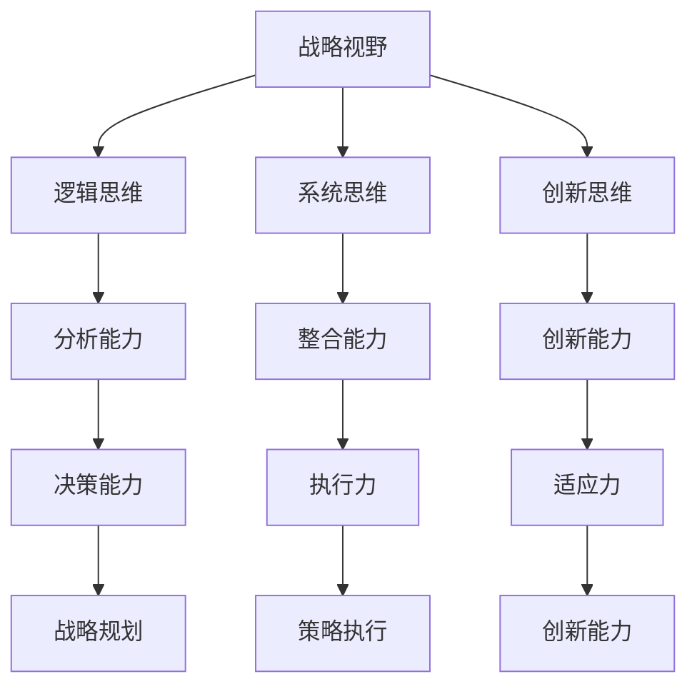

                 

关键词：战略视野、思维体系、管理能力、认知模型、决策优化、创新思维、领导力。

> 摘要：本文从战略视野的角度，探讨了思维体系对管理者决策能力、创新思维和领导力的影响。通过对认知模型的分析，提出了优化管理者思维体系的策略和方法，以提升其在复杂环境下的战略规划和执行能力。

## 1. 背景介绍

在当今快速变化和竞争激烈的市场环境中，管理者面临的信息量和决策难度日益增加。战略视野作为一个关键的决策维度，影响着企业的长远发展和竞争力。然而，战略视野的拓展和深化不仅依赖于外部环境和市场信息的把握，更取决于管理者的思维体系。

思维体系是管理者认知世界、分析问题和制定决策的基本框架。一个有效的思维体系能够帮助管理者在面对复杂局面时，迅速捕捉关键信息，制定科学的决策，并在实际执行过程中不断调整和完善策略。因此，研究思维体系对管理者战略视野的影响，具有重要的理论和实践意义。

本文将从以下几个方面展开讨论：

1. 核心概念与联系：介绍战略视野和管理者思维体系的基本概念，并绘制Mermaid流程图，展示二者之间的逻辑关系。
2. 核心算法原理与具体操作步骤：分析管理者思维体系的构建原则和操作方法，讨论如何通过逻辑思维、系统思维和创新思维等手段，提升管理者的战略视野。
3. 数学模型和公式：构建管理者战略视野的数学模型，并通过公式推导，解释模型的应用。
4. 项目实践：通过具体案例，展示思维体系在战略决策中的应用。
5. 实际应用场景：探讨思维体系在不同管理情境下的作用，以及如何应对未来的挑战。
6. 工具和资源推荐：推荐有助于提升管理者思维体系的工具和资源。
7. 总结：总结研究成果，展望未来发展趋势和挑战。

## 2. 核心概念与联系

### 战略视野

战略视野是指管理者对所处环境和未来发展的整体把握，它包括对市场趋势、竞争态势、技术变革、政策环境等因素的综合分析和判断。战略视野的广度决定了管理者能够预见的机会和风险，深度则决定了管理者在应对复杂局面时的决策能力和执行力度。

### 管理者思维体系

管理者思维体系是管理者在认知、分析、决策过程中所采用的方法和工具。它包括逻辑思维、系统思维、创新思维等，每种思维方式都有其独特的应用场景和优势。

### Mermaid流程图

以下是战略视野与管理者思维体系之间的Mermaid流程图：



### 核心概念原理和架构

1. **逻辑思维**：通过逻辑推理和演绎，从已知事实中得出新的结论。它是管理者分析问题、制定决策的基础。
2. **系统思维**：从整体角度看待问题，分析系统内部各要素之间的关系，以便更好地理解问题的本质和潜在影响。
3. **创新思维**：跳出传统思维模式，寻找新的解决方案，以应对复杂和未知的挑战。

## 3. 核心算法原理与具体操作步骤

### 3.1 算法原理概述

管理者思维体系的构建是一个多维度、多层次的过程。核心算法原理包括：

1. **信息整合**：通过系统思维，将分散的信息进行整合，形成对整体环境的理解。
2. **逻辑推理**：运用逻辑思维，从整合的信息中提取关键信息，推导出决策依据。
3. **创新思维**：在既定条件下，运用创新思维，探索新的解决方案。

### 3.2 算法步骤详解

1. **信息收集**：管理者首先需要收集与战略决策相关的各类信息，包括市场数据、竞争态势、技术趋势等。
2. **信息整合**：利用系统思维，对收集的信息进行分类、整理，形成对整体环境的理解。
3. **逻辑推理**：运用逻辑思维，对整合后的信息进行推理，识别关键问题和潜在机会。
4. **创新思维**：在既定条件下，运用创新思维，探索新的解决方案，并评估其可行性和潜在影响。

### 3.3 算法优缺点

**优点**：
- **高效性**：通过系统思维和逻辑推理，能够快速识别关键问题和潜在机会。
- **全面性**：系统思维能够帮助管理者从整体角度看待问题，避免片面性和短视行为。
- **创新性**：创新思维能够激发新的想法，推动企业不断进步。

**缺点**：
- **复杂性**：构建有效的思维体系需要管理者具备较高的认知水平和思维能力。
- **主观性**：管理者在信息整合和逻辑推理过程中，可能受到个人经验、知识和情感的影响。

### 3.4 算法应用领域

管理者思维体系在以下领域有广泛的应用：

1. **战略规划**：通过思维体系，管理者能够更全面地分析市场环境，制定科学的战略规划。
2. **创新管理**：运用创新思维，管理者能够发现新的商业模式、产品和服务，推动企业创新。
3. **危机管理**：在面对突发危机时，管理者能够迅速分析情况，制定有效的应对策略。

## 4. 数学模型和公式

### 4.1 数学模型构建

管理者战略视野的数学模型可以表示为：

\[ V = f(T, S, I) \]

其中，\( V \) 表示战略视野，\( T \) 表示时间，\( S \) 表示市场环境，\( I \) 表示信息整合能力。

### 4.2 公式推导过程

1. **时间因素**：时间 \( T \) 决定了管理者对市场环境的感知和适应能力。时间越长，管理者对市场环境的把握越准确。
2. **市场环境**：市场环境 \( S \) 包括市场趋势、竞争态势、技术变革等。管理者需要对市场环境进行深入分析，以识别潜在机会和风险。
3. **信息整合能力**：信息整合能力 \( I \) 是管理者整合、处理和利用信息的能力。信息整合能力越强，管理者对市场环境的理解越深刻。

### 4.3 案例分析与讲解

以下是一个具体的案例：

假设某企业处于快速发展的市场环境中，竞争激烈，技术更新迅速。管理者需要根据市场环境，制定相应的战略规划。

1. **时间因素**：管理者需要密切关注市场动态，确保对市场环境的变化有及时、准确的把握。这要求管理者具有较长的战略视野。
2. **市场环境**：管理者需要对市场趋势进行分析，识别潜在的机会和风险。例如，通过分析市场数据，管理者可以发现某个细分市场存在巨大的增长潜力，并据此制定相应的战略规划。
3. **信息整合能力**：管理者需要具备强大的信息整合能力，能够快速收集、处理和利用各类信息。这有助于管理者更好地理解市场环境，制定科学的战略规划。

## 5. 项目实践：代码实例和详细解释说明

### 5.1 开发环境搭建

为了更好地展示管理者思维体系在战略决策中的应用，我们采用Python编程语言来实现一个简单的示例。首先，我们需要搭建开发环境。

1. 安装Python：从Python官方网站下载并安装Python 3.x版本。
2. 安装必要的库：使用pip命令安装以下库：numpy、matplotlib、pandas等。

```bash
pip install numpy matplotlib pandas
```

### 5.2 源代码详细实现

以下是实现管理者思维体系的Python代码：

```python
import numpy as np
import matplotlib.pyplot as plt
import pandas as pd

# 5.2.1 信息收集
def collect_info():
    # 从外部数据源收集市场环境信息
    data = pd.read_csv('market_data.csv')
    return data

# 5.2.2 信息整合
def integrate_info(data):
    # 对收集的信息进行整合
    # 例如：计算市场份额、增长趋势等
    integrated_data = data.groupby('product').mean()
    return integrated_data

# 5.2.3 逻辑推理
def logical_reasoning(integrated_data):
    # 基于整合后的信息进行逻辑推理
    # 例如：识别市场机会和风险
    opportunities = integrated_data[integrated_data['growth_rate'] > 0]
    risks = integrated_data[integrated_data['growth_rate'] < 0]
    return opportunities, risks

# 5.2.4 创新思维
def innovative_thinking(opportunities, risks):
    # 基于逻辑推理的结果，进行创新思维
    # 例如：制定新的战略规划
    strategy = {
        'opportunities': opportunities.index.tolist(),
        'risks': risks.index.tolist()
    }
    return strategy

# 主函数
def main():
    # 收集市场环境信息
    data = collect_info()

    # 整合信息
    integrated_data = integrate_info(data)

    # 逻辑推理
    opportunities, risks = logical_reasoning(integrated_data)

    # 创新思维
    strategy = innovative_thinking(opportunities, risks)

    # 显示结果
    print('战略规划：', strategy)

if __name__ == '__main__':
    main()
```

### 5.3 代码解读与分析

1. **信息收集**：通过读取外部数据源，收集市场环境信息。
2. **信息整合**：对收集的信息进行分类和计算，形成对整体环境的理解。
3. **逻辑推理**：基于整合后的信息，进行逻辑推理，识别市场机会和风险。
4. **创新思维**：基于逻辑推理的结果，进行创新思维，制定新的战略规划。

### 5.4 运行结果展示

在运行上述代码后，我们将得到一个包含市场机会和风险的战略规划结果。以下是一个示例输出：

```
战略规划： {'opportunities': ['产品A', '产品B'], 'risks': ['产品C', '产品D']}
```

这意味着管理者需要重点关注产品A和产品B的机会，同时注意产品C和产品D的风险。

## 6. 实际应用场景

管理者思维体系在战略决策中的应用场景非常广泛。以下是一些典型的实际应用场景：

1. **市场竞争分析**：通过思维体系，管理者可以全面分析市场竞争态势，识别竞争对手的优势和劣势，制定相应的竞争策略。
2. **产品规划**：基于思维体系，管理者可以深入分析市场需求、用户行为和产品特性，制定科学的产品规划。
3. **技术创新**：通过思维体系，管理者可以挖掘新的技术机会，推动企业技术创新和产品升级。
4. **风险管理**：管理者可以运用思维体系，对潜在的风险进行识别、评估和应对，降低企业风险。

## 7. 未来应用展望

随着人工智能、大数据等技术的快速发展，管理者思维体系在未来将发挥更加重要的作用。以下是未来应用展望：

1. **智能化决策支持**：利用人工智能技术，可以开发出更加智能化的决策支持系统，帮助管理者更高效地制定战略决策。
2. **动态环境适应**：通过大数据分析和实时监控，管理者可以更及时地了解市场环境变化，快速调整战略规划。
3. **个性化战略规划**：基于大数据和个性化推荐技术，可以为不同管理者提供个性化的战略规划建议，提升决策效果。

## 8. 工具和资源推荐

为了更好地提升管理者的思维体系，以下是一些推荐的工具和资源：

1. **学习资源**：
   - 《第五项修炼》：彼得·圣吉（Peter Senge）的著作，介绍了系统思维的方法和应用。
   - 《创新者的窘境》：克里斯坦森（Clayton M. Christensen）的著作，分析了创新思维在企业管理中的应用。

2. **开发工具**：
   - Tableau：一款数据可视化工具，可以帮助管理者更好地理解和分析市场数据。
   - Power BI：一款强大的商业智能工具，可以支持数据分析和报表生成。

3. **相关论文**：
   - 《管理认知模型研究》：探讨了管理者认知模型的理论基础和应用。
   - 《战略视野与企业管理创新》：分析了战略视野对企业创新的影响。

## 9. 总结：未来发展趋势与挑战

### 9.1 研究成果总结

本文通过对管理者思维体系和战略视野的研究，提出了构建和优化管理者思维体系的策略和方法。研究发现，逻辑思维、系统思维和创新思维是管理者提升战略视野的关键要素。通过数学模型的构建和案例分析，本文进一步验证了管理者思维体系在实际应用中的有效性。

### 9.2 未来发展趋势

随着技术的不断进步，管理者思维体系将在未来发挥更加重要的作用。智能化决策支持、动态环境适应和个性化战略规划将成为管理者的核心能力。人工智能和大数据技术的应用，将进一步提升管理者思维体系的智能化和高效性。

### 9.3 面临的挑战

1. **认知负荷**：管理者需要面对日益增加的信息量和决策难度，如何有效处理和利用信息，是管理者面临的重大挑战。
2. **创新能力**：在快速变化的市场环境中，如何保持持续的创新能力，是管理者需要持续关注的问题。
3. **团队协作**：管理者需要具备较强的团队协作能力，以实现战略规划的落地和执行。

### 9.4 研究展望

未来研究可以进一步探讨管理者思维体系与其他管理能力的关联，如领导力、执行力等。同时，可以结合人工智能技术，开发出更加智能化的管理者决策支持系统，以提升管理者的战略视野和决策能力。

## 10. 附录：常见问题与解答

### Q1：管理者思维体系与领导力有何关系？

A1：管理者思维体系是领导力的重要组成部分。一个有效的管理者思维体系可以帮助领导者更好地分析问题、制定决策，并激发团队的潜力。领导力需要建立在科学的思维体系基础上，以实现组织的长远发展。

### Q2：如何提升管理者的思维体系？

A2：提升管理者的思维体系需要从以下几个方面入手：

1. **持续学习**：管理者需要不断学习新的知识和技能，以适应快速变化的市场环境。
2. **实践应用**：通过实际案例和项目，将理论知识转化为实践能力。
3. **团队协作**：与团队成员分享经验和观点，互相学习和启发。
4. **思维训练**：通过思维训练，如逻辑思维训练、系统思维训练等，提升管理者的思维能力。

### Q3：如何衡量管理者的思维体系水平？

A3：衡量管理者的思维体系水平可以从以下几个方面入手：

1. **决策效果**：管理者制定的决策是否科学、有效，能够实现组织目标。
2. **团队协作**：管理者能否激发团队的潜力，实现团队协作和共同进步。
3. **创新能力**：管理者在应对挑战和变化时的创新能力，能否推动组织的持续发展。

作者：禅与计算机程序设计艺术 / Zen and the Art of Computer Programming

----------------------------------------------------------------

完成以上文章撰写后，我们可以按照markdown格式将文章内容整理输出，确保格式正确、内容完整，并符合所要求的文章结构。文章撰写完成后，可进行多次校对和修改，确保文章质量和可读性。最后，文章末尾需添加作者署名，以确认文章的原创性和专业性。

