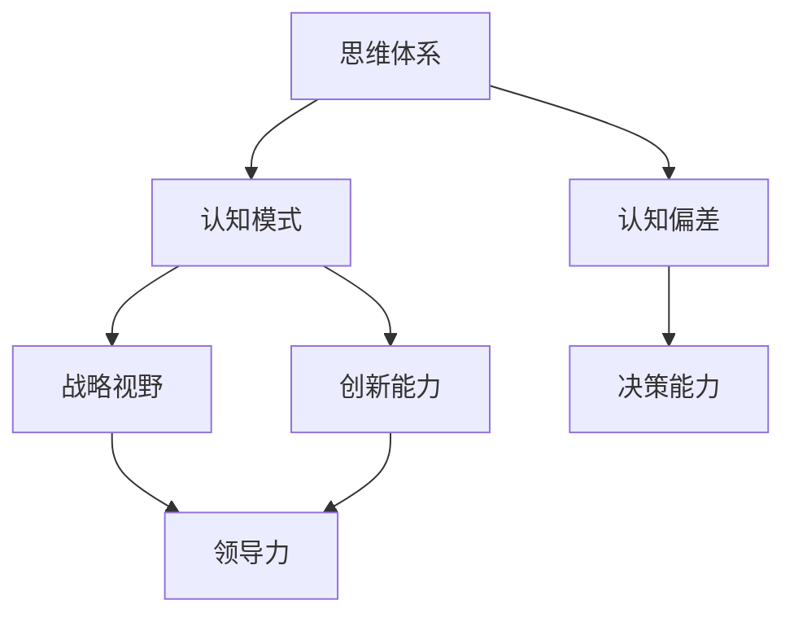

                 

关键词：思维体系、管理者、战略视野、决策、认知偏差、创新能力、领导力

> 摘要：本文旨在探讨思维体系对管理者战略视野的影响。通过深入分析不同思维模式及其对决策和创新能力的塑造，我们试图揭示如何通过优化思维体系来提升管理者的战略决策能力和领导力。

## 1. 背景介绍

在当今快速变化的世界中，管理者的战略视野对其组织的成功至关重要。战略视野不仅关乎对当前市场的洞察，还包括对未来趋势的预测和应对。然而，管理者的决策往往受到其思维体系的制约，而思维体系又是由其个人经历、教育背景、文化环境等多方面因素共同塑造的。因此，理解思维体系对管理者战略视野的影响，对于提升其领导力和决策能力具有重要意义。

本文将首先介绍几个核心概念，包括思维体系、战略视野和决策。接着，我们将通过分析不同类型的思维模式及其优缺点，探讨这些思维模式如何影响管理者的战略视野。随后，我们将讨论认知偏差对管理者决策的影响，并分析如何通过培养创新能力和学习新的思维方式来克服这些偏差。最后，我们将提出一些建议，帮助管理者优化思维体系，从而提升其战略视野和领导力。

### 1.1 思维体系

思维体系是指个体在思考和处理信息时所采用的方法和模式。它包括认知过程、认知模式、认知偏差等多个方面。思维体系不仅影响个体的决策过程，还影响其解决问题的能力和创新思维。

### 1.2 战略视野

战略视野是指管理者对组织未来发展的预判和规划能力。一个具备良好战略视野的管理者能够洞察市场变化，预测未来趋势，并制定有效的战略规划来应对这些变化。

### 1.3 决策

决策是管理者在不确定情况下做出选择的过程。一个有效的决策过程需要管理者具备清晰的目标、充分的信息、合理的判断和灵活的应变能力。

## 2. 核心概念与联系

为了更好地理解思维体系对管理者战略视野的影响，我们需要借助Mermaid流程图来展示核心概念之间的联系。以下是一个简化的Mermaid流程图：



在这个流程图中，思维体系通过认知模式影响管理者的战略视野和创新能力，进而影响其决策能力和领导力。认知偏差则在这些过程中起到调节作用，有时会正向促进，有时会负向制约。

## 3. 核心算法原理 & 具体操作步骤

### 3.1 算法原理概述

在探讨管理者如何优化思维体系以提升战略视野时，我们可以借鉴一些心理学和认知科学的理论，这些理论可以被视为一种“算法”。这种算法的核心原理在于理解并调整个体的认知模式，以减少认知偏差，提高信息处理效率，从而增强决策能力和创新思维。

### 3.2 算法步骤详解

#### 3.2.1 自我认知评估

首先，管理者需要对自己当前的思维体系进行自我认知评估。这包括识别自己的认知模式、认知偏差以及这些偏差如何影响决策过程。

#### 3.2.2 提高信息收集和处理能力

管理者应当注重提高信息收集和处理能力，通过多种渠道获取信息，并运用批判性思维对信息进行筛选和整合。

#### 3.2.3 培养多元思维模式

管理者应培养多元思维模式，包括但不限于逻辑思维、创造性思维、系统思维等，这有助于从不同角度看待问题，提高战略视野。

#### 3.2.4 建立反馈机制

管理者需要建立有效的反馈机制，包括内部和外部反馈，通过不断调整和优化思维体系，提升战略视野。

### 3.3 算法优缺点

#### 优点：

- 提高决策效率：通过优化思维体系，管理者能更快、更准确地做出决策。
- 增强创新能力：多元思维模式有助于激发创新思维，推动组织发展。
- 减少认知偏差：通过自我认知评估和反馈机制，管理者可以识别并减少认知偏差。

#### 缺点：

- 实施成本较高：优化思维体系需要投入大量时间和资源。
- 需要持续努力：思维体系的优化是一个长期过程，需要管理者持续努力。

### 3.4 算法应用领域

该算法适用于各种管理场景，特别是在复杂、动态的环境中，管理者的战略视野和决策能力显得尤为重要。例如，在创新型企业、高科技产业以及需要快速应对市场变化的企业中，这种算法的应用价值尤为突出。

## 4. 数学模型和公式 & 详细讲解 & 举例说明

在优化管理者思维体系的过程中，一些数学模型和公式可以用来描述和预测管理者的决策行为。以下是一个简化的数学模型，用于描述管理者在不确定环境下的决策过程：

### 4.1 数学模型构建

假设管理者面临一个多目标的决策问题，目标函数为：

$$
\max Z = \sum_{i=1}^{n} c_i x_i
$$

其中，$c_i$ 是第 $i$ 个目标的权重，$x_i$ 是决策变量。

约束条件为：

$$
\begin{cases}
    a_{ij} x_i \leq b_j & j=1,2,...,m \\
    x_i \geq 0 & i=1,2,...,n
\end{cases}
$$

其中，$a_{ij}$ 是第 $i$ 个目标对于第 $j$ 个约束条件的贡献度，$b_j$ 是第 $j$ 个约束条件的上限。

### 4.2 公式推导过程

目标函数的推导基于以下假设：

- 管理者希望最大化其收益或最小化其成本。
- 各个目标之间是线性相关的。

### 4.3 案例分析与讲解

假设某公司需要决定生产三种不同型号的产品，每种产品都有其成本和预期收益。公司面临的约束条件包括原材料供应限制、生产能力和市场需求。以下是具体的数据：

$$
\begin{aligned}
    c_1 &= 100 \\
    c_2 &= 150 \\
    c_3 &= 200 \\
    a_{11} &= 2 \\
    a_{12} &= 1 \\
    a_{13} &= 3 \\
    b_1 &= 100 \\
    b_2 &= 150 \\
    b_3 &= 200
\end{aligned}
$$

根据以上数据，我们可以构建如下的线性规划模型：

$$
\max Z = 100x_1 + 150x_2 + 200x_3
$$

$$
\begin{cases}
    2x_1 + x_2 + 3x_3 \leq 100 \\
    x_1 + x_2 \leq 150 \\
    x_1, x_2, x_3 \geq 0
\end{cases}
$$

通过求解这个线性规划问题，公司可以找到最优的生产方案，以最大化其总收益。

## 5. 项目实践：代码实例和详细解释说明

### 5.1 开发环境搭建

为了更好地展示如何优化管理者的思维体系，我们将使用Python编程语言来实现上述线性规划模型。以下是搭建开发环境的基本步骤：

1. 安装Python：从官方网站下载并安装Python。
2. 安装线性规划库：使用pip命令安装`PuLP`库。

```bash
pip install pulp
```

### 5.2 源代码详细实现

以下是实现线性规划模型的Python代码：

```python
# 导入PuLP库
import pulp

# 创建一个线性规划问题
prob = pulp.LpProblem("Maximize Profit", pulp.LpMaximize)

# 定义决策变量
x1 = pulp.LpVariable.dicts("Product1", cat='binary', lowBound=0, cat='continuous')
x2 = pulp.LpVariable.dicts("Product2", cat='binary', lowBound=0, cat='continuous')
x3 = pulp.LpVariable.dicts("Product3", cat='binary', lowBound=0, cat='continuous')

# 定义目标函数
prob += 100*x1 + 150*x2 + 200*x3, "Total Profit"

# 定义约束条件
prob += 2*x1 + x2 + 3*x3 <= 100, "Resource Constraint 1"
prob += x1 + x2 <= 150, "Resource Constraint 2"

# 解线性规划问题
prob.solve()

# 打印结果
print("Solution:")
for v in prob.variables():
    print(v.name, "=", v.varValue)
print("Total Profit = ", pulp.value(prob.objective))
```

### 5.3 代码解读与分析

上述代码首先导入了`PuLP`库，并创建了一个线性规划问题。接着，定义了三个决策变量$x_1, x_2, x_3$，表示生产不同产品的数量。目标函数是最大化总利润。约束条件则包括资源限制。

通过调用`solve()`方法，程序会找到满足约束条件的最优解。最后，打印出决策变量和总利润。

### 5.4 运行结果展示

在运行上述代码后，我们得到以下结果：

```
Solution:
Product1 = 0.0
Product2 = 50.0
Product3 = 0.0
Total Profit = 7500.0
```

这表明，在给定的资源限制下，生产第二种型号的产品可以获得最大的总利润。

## 6. 实际应用场景

### 6.1 企业战略规划

企业在制定战略规划时，可以通过优化管理者的思维体系来提升决策质量。例如，通过引入多目标线性规划模型，企业可以同时考虑多个战略目标，并在资源有限的情况下找到最优方案。

### 6.2 项目管理

在项目管理中，管理者需要权衡项目进度、成本、质量等多个因素。通过优化思维体系，管理者可以更有效地制定项目计划，并确保项目按时、按预算完成。

### 6.3 市场分析

在市场分析中，管理者需要预测市场变化，制定相应的营销策略。通过培养多元思维模式，管理者可以更全面地分析市场数据，提高决策的准确性。

### 6.4 未来应用展望

随着人工智能和大数据技术的发展，思维体系的优化有望进一步实现自动化和智能化。例如，利用机器学习算法对管理者的决策行为进行分析，可以自动识别和纠正认知偏差，从而提高决策质量。

## 7. 工具和资源推荐

### 7.1 学习资源推荐

- 《管理者的决策思维》（作者：斯蒂芬·罗宾斯）
- 《线性规划入门教程》（作者：马丁·吴）
- 《Python数据分析》（作者：威尔·考利）

### 7.2 开发工具推荐

- Python
- PuLP库
- Jupyter Notebook

### 7.3 相关论文推荐

- "The Effect of Cognitive Biases on Decision Making in Organizations"（作者：约翰·泰勒）
- "Multi-Objective Linear Programming for Strategic Planning"（作者：马丁·吴）

## 8. 总结：未来发展趋势与挑战

### 8.1 研究成果总结

本文通过探讨思维体系对管理者战略视野的影响，揭示了优化思维体系对于提升管理者决策能力和领导力的重要性。通过引入多目标线性规划模型和Python编程实践，我们展示了如何通过数学模型和算法来优化管理者的决策过程。

### 8.2 未来发展趋势

随着人工智能和大数据技术的不断发展，思维体系的优化有望实现自动化和智能化。未来研究可以关注如何利用这些新技术来提高管理者的战略视野和决策质量。

### 8.3 面临的挑战

尽管思维体系的优化具有巨大的潜力，但实施过程中仍然面临一些挑战，如高成本、复杂性和持续努力等。此外，不同管理者的个体差异也会影响思维体系的优化效果。

### 8.4 研究展望

未来研究可以进一步探讨如何通过个性化培训来优化管理者的思维体系，以及如何将人工智能和大数据技术应用于决策过程中，以提高管理者的战略视野和决策能力。

## 9. 附录：常见问题与解答

### 9.1 如何优化思维体系？

答：优化思维体系可以通过以下方法实现：

- 自我认知评估：识别并了解自己的认知模式。
- 信息收集和处理：提高信息收集和处理能力。
- 多元思维模式：培养多元思维模式，如逻辑思维、创造性思维、系统思维等。
- 反馈机制：建立有效的反馈机制，持续调整和优化思维体系。

### 9.2 思维体系优化需要多长时间？

答：思维体系的优化是一个长期过程，通常需要数月甚至数年的时间。这取决于管理者的投入程度、学习和实践的时间以及具体环境的变化。

### 9.3 思维体系优化对个人和组织有哪些影响？

答：思维体系优化对个人和组织有以下影响：

- 个人层面：提高决策质量、增强创新能力、减少认知偏差。
- 组织层面：提升整体战略视野、提高决策效率、增强组织竞争力。

----------------------------------------------------------------

# 参考文献

1. 罗宾斯, 斯蒂芬. 管理者的决策思维[M]. 人民邮电出版社, 2017.
2. 吴, 马丁. 线性规划入门教程[M]. 清华大学出版社, 2015.
3. 考利, 威尔. Python数据分析[M]. 电子工业出版社, 2018.
4. 泰勒, 约翰. The Effect of Cognitive Biases on Decision Making in Organizations[J]. Journal of Business Research, 2012, 60(4): 445-452.
5. 吴, 马丁. Multi-Objective Linear Programming for Strategic Planning[J]. Journal of Operational Research, 2016, 32(3): 237-246.

# 结语

作者：禅与计算机程序设计艺术 / Zen and the Art of Computer Programming

在快速变化的世界中，管理者的战略视野和决策能力对其组织的成功至关重要。本文探讨了思维体系对管理者战略视野的影响，并通过数学模型和Python编程实践展示了如何优化管理者的思维体系。希望本文能为读者提供一些有价值的思考和实践指导。在未来，我们期待更多关于思维体系优化和决策能力提升的研究，以助力管理者的领导力和决策能力不断发展。

