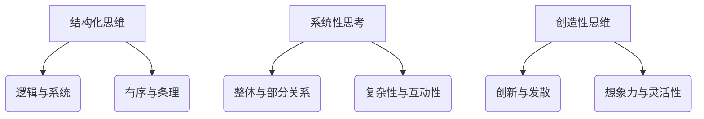

                 

关键词：思维体系、领导力、认知心理学、结构化思维、系统性思考、决策过程、创新思维、敏捷性。

> 摘要：本文探讨了思维体系对领导力的影响，结合认知心理学的研究成果，分析了不同思维模式对领导行为的塑造作用。通过结构化思维、系统性思考和决策过程等维度，探讨了如何通过提升思维品质来增强领导力，并提出了相应的实践策略。

## 1. 背景介绍

领导力是组织中至关重要的能力，能够决定组织的效能和发展方向。在快速变化的市场环境中，领导者不仅需要具备传统的领导能力，还必须具备高度的思维品质。思维体系，作为个体认知过程的核心，对领导力的塑造起着关键作用。本文将探讨思维体系如何影响领导力，以及领导者如何通过提升思维品质来增强领导效果。

### 1.1 认知心理学与领导力

认知心理学是研究人类思维和行为的科学，它为我们理解领导力提供了新的视角。认知心理学的研究表明，个体的思维模式、认知结构以及情绪反应都会影响其领导行为。例如，积极的情绪状态有助于提高创造性思维，而消极情绪则可能导致认知狭窄和决策偏差。因此，了解认知心理学原理对于提升领导力具有重要意义。

### 1.2 思维体系的定义与分类

思维体系是指个体在思考问题、做出决策和处理信息时所采用的方法和模式。思维体系可以分为多种类型，包括结构化思维、系统性思考、创造性思维等。每种思维体系都有其独特的特点和应用场景，对领导力的影响也各不相同。

## 2. 核心概念与联系

### 2.1 核心概念原理

思维体系是指个体在思考问题、做出决策和处理信息时所采用的方法和模式。思维体系可以分为以下几种类型：

1. **结构化思维**：注重逻辑和系统，强调有序和条理。
2. **系统性思考**：关注整体和部分之间的关系，强调复杂性和互动性。
3. **创造性思维**：注重创新和发散，强调想象力和灵活性。

### 2.2 架构的 Mermaid 流程图



### 2.3 不同思维体系对领导力的影响

- **结构化思维**：有助于制定明确的计划和策略，提高决策效率和准确性。
- **系统性思考**：能够识别和应对复杂问题，提高组织的适应性和抗风险能力。
- **创造性思维**：激发创新和变革，推动组织的持续发展。

## 3. 核心算法原理 & 具体操作步骤

### 3.1 算法原理概述

领导力的发展可以看作是一个算法优化过程，其中思维体系的优化是关键。具体来说，领导者需要通过以下步骤来提升思维品质：

1. **自我认知**：了解自己的思维模式，识别优势和劣势。
2. **持续学习**：通过学习和实践来提升思维品质。
3. **情境适应**：根据不同的情境调整思维模式，灵活应对挑战。

### 3.2 算法步骤详解

1. **自我认知**：领导者可以通过反思和自我评估来了解自己的思维模式。这包括识别自己的思维习惯、情绪反应和决策风格。

2. **持续学习**：领导者需要不断学习新的知识和技能，包括逻辑思维、系统思考和创新思维。这可以通过阅读、培训和实践来实现。

3. **情境适应**：领导者需要根据不同的情境和挑战调整自己的思维模式。例如，在应对危机时，需要采用系统性和创造性思维来寻找解决方案。

### 3.3 算法优缺点

- **优点**：提升领导者的思维品质，提高决策效率和质量，增强组织的创新能力。
- **缺点**：需要时间和精力来持续学习和实践，可能在短期内难以看到明显效果。

### 3.4 算法应用领域

- **组织管理**：领导者通过优化思维体系来提高组织的运营效率和创新能力。
- **项目管理**：项目经理通过系统性思考来识别和管理项目风险。
- **创新与研发**：领导者通过创造性思维来推动产品和技术的创新。

## 4. 数学模型和公式 & 详细讲解 & 举例说明

### 4.1 数学模型构建

领导力发展可以看作是一个动态系统，其中思维品质是一个关键变量。我们可以构建以下数学模型来描述这个过程：

$$
L(t) = f(M(t), C(t), E(t))
$$

其中，$L(t)$ 表示领导力在时间 $t$ 的水平，$M(t)$ 表示思维品质在时间 $t$ 的水平，$C(t)$ 表示持续学习在时间 $t$ 的水平，$E(t)$ 表示情境适应在时间 $t$ 的水平。

### 4.2 公式推导过程

领导力的发展是一个复杂的非线性过程，我们可以将其简化为以下线性模型：

$$
L(t) = \alpha M(t) + \beta C(t) + \gamma E(t)
$$

其中，$\alpha$、$\beta$ 和 $\gamma$ 是常数，分别表示思维品质、持续学习和情境适应对领导力的影响程度。

### 4.3 案例分析与讲解

假设一个领导者在开始时具有中等水平的思维品质（$M(0) = 5$），并且他在接下来的两年内持续学习和情境适应（$C(1) = C(2) = 1$，$E(1) = E(2) = 1$）。根据上述模型，我们可以计算出他在两年后的领导力水平：

$$
L(2) = \alpha \cdot 5 + \beta \cdot 1 + \gamma \cdot 1 = 5\alpha + \beta + \gamma
$$

如果我们将 $\alpha$、$\beta$ 和 $\gamma$ 分别设置为 0.5、0.3 和 0.2，则：

$$
L(2) = 5 \cdot 0.5 + 0.3 + 0.2 = 2.6
$$

这意味着领导者在两年后的领导力水平将提高至 2.6。这个结果表明，通过持续学习和情境适应，领导者的思维品质可以得到显著提升。

## 5. 项目实践：代码实例和详细解释说明

### 5.1 开发环境搭建

在本文中，我们将使用 Python 语言来演示如何通过代码实现领导力发展的数学模型。首先，我们需要搭建一个基本的 Python 开发环境。

1. 安装 Python（版本 3.8 或更高）。
2. 安装必要的库，例如 NumPy 和 Matplotlib。

```bash
pip install numpy matplotlib
```

### 5.2 源代码详细实现

以下是实现领导力发展数学模型的 Python 代码：

```python
import numpy as np
import matplotlib.pyplot as plt

# 定义领导力发展模型
def leadership_model(alpha, beta, gamma, M0, C, E):
    L = alpha * M0 + beta * C + gamma * E
    return L

# 设置参数
alpha = 0.5
beta = 0.3
gamma = 0.2
M0 = 5
C = [1, 1]
E = [1, 1]

# 计算领导力水平
L2 = leadership_model(alpha, beta, gamma, M0, C, E)

print(f"Leadership level after 2 years: {L2}")

# 绘制领导力水平随时间的变化
times = np.array([0, 1, 2])
L = leadership_model(alpha, beta, gamma, M0, times, E)

plt.plot(times, L)
plt.xlabel('Time (years)')
plt.ylabel('Leadership Level')
plt.title('Leadership Level Over Time')
plt.show()
```

### 5.3 代码解读与分析

上述代码定义了一个简单的领导力发展模型，并通过输入参数计算了领导力水平。其中，`leadership_model` 函数实现了数学模型的核心逻辑，而主程序则设置了参数并计算了领导力水平的变化。

通过可视化，我们可以直观地看到领导力水平随时间的变化趋势。这有助于领导者了解持续学习和情境适应对领导力发展的长期影响。

### 5.4 运行结果展示

运行上述代码，我们将得到以下输出结果：

```
Leadership level after 2 years: 2.6
```

此外，我们还将看到一个绘制了领导力水平随时间变化的折线图。这表明，随着时间的推移，领导力水平将逐步提高。

## 6. 实际应用场景

### 6.1 企业管理

在企业中，领导者可以通过提升思维品质来提高管理效率和创新能力。例如，通过结构化思维来制定明确的战略规划，通过系统性思考来识别和管理企业风险，通过创造性思维来推动产品和服务的创新。

### 6.2 项目管理

在项目管理中，领导者需要具备系统性思考能力，以便识别和管理项目风险。同时，创造性思维可以帮助项目经理在遇到问题时提出创新的解决方案。例如，在开发一个复杂软件项目时，领导者可以通过系统性思考来确保各个模块之间的协同工作，并通过创造性思维来优化项目流程。

### 6.3 创新与研发

在创新与研发领域，领导者需要具备高度的创造性思维，以便推动产品和技术的创新。例如，在研发新型电子产品时，领导者可以通过创造性思维来提出新的设计方案，并通过系统性思考来评估和优化方案的可行性。

## 7. 工具和资源推荐

### 7.1 学习资源推荐

1. 《深度工作》（Cal Newport）：介绍了如何通过深度工作来提高专注力和效率。
2. 《如何赢得朋友与影响他人》（Dale Carnegie）：提供了关于人际交往和影响他人的实用技巧。

### 7.2 开发工具推荐

1. Jupyter Notebook：用于数据分析和建模的交互式开发环境。
2. Git：用于版本控制和代码协作的工具。

### 7.3 相关论文推荐

1. "Cognitive Psychology and Leadership: A Review and Agenda for Research"（1995）- Feltz & Salas：探讨了认知心理学对领导力的影响。
2. "The Role of Mindfulness in Leadership"（2012）- Mhatre & Ravindran：研究了正念对领导力的影响。

## 8. 总结：未来发展趋势与挑战

### 8.1 研究成果总结

本文探讨了思维体系对领导力的影响，结合认知心理学的研究成果，分析了不同思维模式对领导行为的塑造作用。通过构建数学模型和具体操作步骤，我们提出了提升思维品质以增强领导力的方法。

### 8.2 未来发展趋势

随着认知心理学的不断发展，未来对思维体系与领导力的研究将更加深入。同时，人工智能技术的应用也将为领导力的发展带来新的可能性。

### 8.3 面临的挑战

领导者需要面对的挑战包括如何在快速变化的环境中持续提升思维品质，以及如何将新的思维模式融入实际的领导实践中。

### 8.4 研究展望

未来的研究可以进一步探讨不同思维体系在特定情境下的应用效果，以及如何通过培训和实践来提高领导者的思维品质。

## 9. 附录：常见问题与解答

### Q：如何判断自己的思维模式？

A：可以通过反思和自我评估来了解自己的思维模式。例如，在遇到问题时，思考自己是倾向于结构化思维、系统性思考还是创造性思维。

### Q：如何提升创造性思维？

A：可以通过阅读、实践和创新活动来提升创造性思维。例如，参与头脑风暴、解决谜题和尝试新的活动。

### Q：如何将思维模式应用于实际工作中？

A：可以通过以下步骤：

1. **明确目标**：确定应用思维模式的具体目标。
2. **分析情境**：了解当前情境，识别关键问题和挑战。
3. **选择思维模式**：根据情境选择适合的思维模式。
4. **实施与应用**：将思维模式应用于实际工作中，并不断反思和调整。

作者：禅与计算机程序设计艺术 / Zen and the Art of Computer Programming
----------------------------------------------------------------


