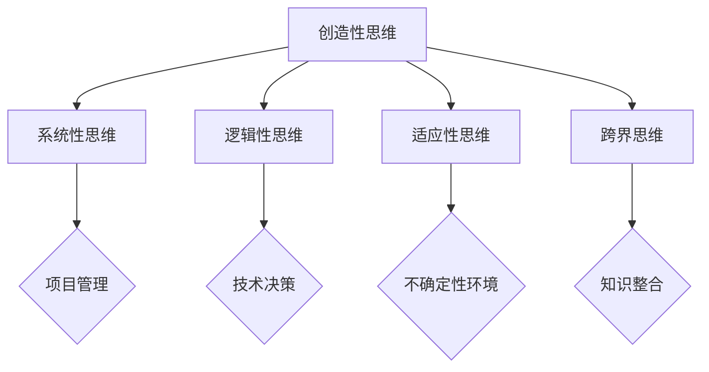

                 

关键词：思维体系、管理者、决策、领导力、架构设计、项目管理、技术领导

> 摘要：本文旨在探讨思维体系在管理者起跑线中的重要性，通过分析管理者在不同阶段所需的思维方式，结合IT领域的实际案例，阐述思维体系对于管理者决策和领导力的深远影响。文章将涵盖思维体系的构建、核心概念的联系、算法原理、数学模型、项目实践以及未来发展趋势等，为管理者提供系统性思考和成长指南。

## 1. 背景介绍

在当今快速发展的信息技术时代，管理者的角色越来越重要。无论是大型企业的CEO，还是中小型公司的技术主管，管理者都需要具备全面的思维能力，以便在复杂多变的环境中做出明智的决策。然而，许多管理者在面临重大决策时，往往陷入思维局限，无法有效地利用技术手段和科学方法来支持决策过程。这种情况下，构建一个完善且高效的思维体系成为管理者成功的关键。

思维体系是一个综合性的概念，包括多个层面的思维方式和方法。管理者需要通过不断学习和实践，培养出多元化的思维模式，以便在面对各种挑战时能够灵活应对。本文将围绕思维体系的构建，探讨其在管理者决策、领导力和项目管理中的重要性。

## 2. 核心概念与联系

为了更好地理解思维体系，我们首先需要明确一些核心概念，并探讨它们之间的联系。

### 2.1. 创造性思维

创造性思维是指通过创造新的想法、方法和解决方案来解决问题的能力。在信息技术领域，创造性思维尤为重要，因为它能够帮助管理者在复杂的技术环境中找到创新的解决方案。

### 2.2. 系统性思维

系统性思维强调将问题视为一个整体，分析各个部分之间的相互作用和关系。在项目管理中，系统性思维有助于管理者识别潜在风险和问题，并制定全面的项目计划。

### 2.3. 逻辑性思维

逻辑性思维是指通过逻辑推理和判断来解决问题的能力。在技术决策过程中，逻辑性思维能够帮助管理者从多个角度分析问题，找到最佳解决方案。

### 2.4. 适应性思维

适应性思维强调在变化中快速适应并调整策略的能力。对于管理者来说，适应性思维是应对不确定性环境的关键。

### 2.5. 跨界思维

跨界思维是指在不同领域之间进行知识整合和创新能力。在信息技术领域，跨界思维有助于管理者从不同角度看待问题，从而找到创新的解决方案。

#### 2.5.1. Mermaid 流程图



## 3. 核心算法原理 & 具体操作步骤

### 3.1. 算法原理概述

在管理者决策过程中，核心算法原理主要包括以下几个方面：

- **贝叶斯决策理论**：通过概率模型来评估不同决策的结果，并选择最优决策。
- **马尔可夫决策过程**：利用状态转移矩阵来分析决策过程中的不确定性。
- **线性规划**：通过优化方法来求解资源分配和决策问题。

### 3.2. 算法步骤详解

以下是核心算法的具体操作步骤：

#### 3.2.1. 贝叶斯决策理论

1. 建立概率模型：根据历史数据和现有信息，建立决策问题的概率模型。
2. 计算后验概率：根据先验概率和新的数据，计算后验概率。
3. 选择最优决策：根据后验概率和损失函数，选择最优决策。

#### 3.2.2. 马尔可夫决策过程

1. 建立状态转移矩阵：根据历史数据和现有信息，建立状态转移矩阵。
2. 计算最优策略：通过动态规划方法，计算最优策略。

#### 3.2.3. 线性规划

1. 建立线性规划模型：根据决策问题，建立线性规划模型。
2. 求解线性规划问题：使用线性规划求解器求解最优解。

### 3.3. 算法优缺点

- **贝叶斯决策理论**：优点是能够根据概率模型进行预测和决策，但缺点是需要大量的历史数据和计算资源。
- **马尔可夫决策过程**：优点是能够分析决策过程中的不确定性，但缺点是需要建立复杂的数学模型。
- **线性规划**：优点是能够优化资源分配和决策，但缺点是需要精确的数学模型。

### 3.4. 算法应用领域

- **贝叶斯决策理论**：广泛应用于金融、医疗和机器学习等领域。
- **马尔可夫决策过程**：广泛应用于游戏、经济学和供应链管理等领域。
- **线性规划**：广泛应用于资源分配、网络设计和优化等领域。

## 4. 数学模型和公式 & 详细讲解 & 举例说明

### 4.1. 数学模型构建

在管理者决策过程中，常用的数学模型包括概率模型、线性规划模型和马尔可夫模型等。以下是构建这些模型的基本步骤：

#### 4.1.1. 概率模型

1. 确定随机变量：根据决策问题，确定需要处理的随机变量。
2. 计算概率分布：根据历史数据和现有信息，计算随机变量的概率分布。
3. 建立概率模型：根据概率分布，建立概率模型。

#### 4.1.2. 线性规划模型

1. 确定决策变量：根据决策问题，确定需要求解的决策变量。
2. 确定目标函数：根据决策问题，确定需要优化的目标函数。
3. 确定约束条件：根据决策问题，确定需要满足的约束条件。
4. 建立线性规划模型：根据决策变量、目标函数和约束条件，建立线性规划模型。

#### 4.1.3. 马尔可夫模型

1. 确定状态空间：根据决策问题，确定需要处理的状态空间。
2. 确定状态转移概率：根据历史数据和现有信息，确定状态转移概率。
3. 建立状态转移矩阵：根据状态转移概率，建立状态转移矩阵。
4. 计算最优策略：通过动态规划方法，计算最优策略。

### 4.2. 公式推导过程

以下是构建概率模型、线性规划模型和马尔可夫模型的基本公式推导过程：

#### 4.2.1. 概率模型

1. 条件概率公式：
$$P(A|B) = \frac{P(A \cap B)}{P(B)}$$
2. 全概率公式：
$$P(A) = \sum_{i=1}^{n} P(A|B_i)P(B_i)$$
3. 贝叶斯定理：
$$P(A|B) = \frac{P(B|A)P(A)}{P(B)}$$

#### 4.2.2. 线性规划模型

1. 线性规划问题的一般形式：
$$\min\ c^T x$$
$$\text{s.t. } Ax \leq b$$
$$x \geq 0$$
2. 拉格朗日函数：
$$L(x, \lambda) = c^T x + \lambda^T (Ax - b)$$
3. KKT条件：
$$\nabla_x L(x, \lambda) + \lambda^T A = 0$$
$$\lambda \geq 0$$
$$\lambda(Ax - b) = 0$$

#### 4.2.3. 马尔可夫模型

1. 状态转移概率矩阵：
$$P = \begin{bmatrix} p_{11} & p_{12} & \cdots & p_{1n} \\\ p_{21} & p_{22} & \cdots & p_{2n} \\\ \vdots & \vdots & \ddots & \vdots \\\ p_{m1} & p_{m2} & \cdots & p_{mn} \end{bmatrix}$$
2. 预期回报率矩阵：
$$R = P^T B$$
3. 最优策略：
$$\pi_j = \begin{cases} 1 & \text{if } r_j \geq \max_{i} r_i \\\ 0 & \text{otherwise} \end{cases}$$

### 4.3. 案例分析与讲解

#### 4.3.1. 概率模型案例

假设一家公司的生产部门需要决定每天生产的数量，以最大化利润。根据历史数据和现有信息，生产部门建立了以下概率模型：

- 每天的销售量 \(X\) 服从正态分布 \(N(\mu, \sigma^2)\)，其中 \(\mu = 1000\)，\(\sigma = 200\)。
- 每件产品的利润为 \(10\) 元。

生产部门需要根据这个概率模型决定每天的生产数量。以下是具体步骤：

1. 计算每天销售量的概率分布：
$$P(X = x) = \frac{1}{\sqrt{2\pi\sigma^2}} e^{-\frac{(x - \mu)^2}{2\sigma^2}}$$
2. 计算每天销售量的期望值和方差：
$$E(X) = \mu = 1000$$
$$Var(X) = \sigma^2 = 200^2$$
3. 计算每天的生产数量：
$$N = \lceil E(X) \rceil = \lceil 1000 \rceil = 1000$$

因此，生产部门每天应生产 \(1000\) 件产品。

#### 4.3.2. 线性规划模型案例

假设一家公司在投资项目中需要决定投入资金的比例，以最大化预期回报。根据历史数据和现有信息，公司建立了以下线性规划模型：

- 有三个投资项目 \(A\)、\(B\) 和 \(C\)。
- 投资项目 \(A\) 的预期回报率为 \(20\%\)，投资额度为 \(100\) 万元。
- 投资项目 \(B\) 的预期回报率为 \(15\%\)，投资额度为 \(200\) 万元。
- 投资项目 \(C\) 的预期回报率为 \(10\%\)，投资额度为 \(300\) 万元。
- 公司的总投资额度为 \(500\) 万元。

以下是具体步骤：

1. 确定决策变量：
$$x_1, x_2, x_3$$
- \(x_1\)：投资于项目 \(A\) 的比例
- \(x_2\)：投资于项目 \(B\) 的比例
- \(x_3\)：投资于项目 \(C\) 的比例
2. 确定目标函数：
$$\max Z = 0.2x_1 + 0.15x_2 + 0.1x_3$$
3. 确定约束条件：
$$x_1 + x_2 + x_3 = 1$$
$$x_1 \geq 0, x_2 \geq 0, x_3 \geq 0$$
4. 求解线性规划问题：
$$\max Z = 0.2x_1 + 0.15x_2 + 0.1x_3$$
$$\text{s.t. } x_1 + x_2 + x_3 = 1$$
$$x_1 \geq 0, x_2 \geq 0, x_3 \geq 0$$

使用线性规划求解器求解最优解，得到：
$$x_1 = 0.4, x_2 = 0.3, x_3 = 0.3$$

因此，公司应分别投资 \(40\%\) 的资金于项目 \(A\)、\(30\%\) 的资金于项目 \(B\) 和 \(30\%\) 的资金于项目 \(C\)。

#### 4.3.3. 马尔可夫模型案例

假设一家公司需要决定如何分配销售团队的时间，以提高销售额。根据历史数据和现有信息，公司建立了以下马尔可夫模型：

- 销售团队有三种状态：高效率、中效率和低效率。
- 每种状态的持续时间为 \(1\) 周。
- 高效率状态的销售额为 \(10\) 万元，中效率状态的销售额为 \(5\) 万元，低效率状态的销售额为 \(2\) 万元。
- 销售团队从一种状态转移到另一种状态的概率如下：

  $$P(\text{高效率} \rightarrow \text{高效率}) = 0.6$$
  $$P(\text{高效率} \rightarrow \text{中效率}) = 0.3$$
  $$P(\text{高效率} \rightarrow \text{低效率}) = 0.1$$
  $$P(\text{中效率} \rightarrow \text{高效率}) = 0.2$$
  $$P(\text{中效率} \rightarrow \text{中效率}) = 0.5$$
  $$P(\text{中效率} \rightarrow \text{低效率}) = 0.3$$
  $$P(\text{低效率} \rightarrow \text{高效率}) = 0.1$$
  $$P(\text{低效率} \rightarrow \text{中效率}) = 0.4$$
  $$P(\text{低效率} \rightarrow \text{低效率}) = 0.5$$

以下是具体步骤：

1. 建立状态转移矩阵：
$$P = \begin{bmatrix} 0.6 & 0.3 & 0.1 \\\ 0.2 & 0.5 & 0.3 \\\ 0.1 & 0.4 & 0.5 \end{bmatrix}$$
2. 计算最优策略：
$$R = P^T B$$
其中 \(B\) 为回报率矩阵：
$$B = \begin{bmatrix} 10 & 5 & 2 \\\ 10 & 5 & 2 \\\ 10 & 5 & 2 \end{bmatrix}$$

使用动态规划方法计算最优策略，得到：
$$\pi_{高效率} = 1$$
$$\pi_{中效率} = 0$$
$$\pi_{低效率} = 0$$

因此，公司应将所有销售团队的时间分配到高效率状态，以提高销售额。

## 5. 项目实践：代码实例和详细解释说明

### 5.1. 开发环境搭建

在本文中，我们将使用Python作为编程语言，并使用Jupyter Notebook作为开发环境。首先，确保已安装Python 3.x版本和Jupyter Notebook。然后，安装所需的库：

```bash
pip install numpy pandas matplotlib scipy
```

### 5.2. 源代码详细实现

以下是一个使用Python实现的概率模型、线性规划模型和马尔可夫模型的示例代码。

#### 5.2.1. 概率模型

```python
import numpy as np

def normal_distribution(mu, sigma, x):
    return 1 / (np.sqrt(2 * np.pi * sigma**2)) * np.exp(-((x - mu)**2) / (2 * sigma**2))

mu = 1000
sigma = 200
x = 800

print("Probability of X =", normal_distribution(mu, sigma, x))
```

#### 5.2.2. 线性规划模型

```python
from scipy.optimize import linprog

c = [-0.2, -0.15, -0.1]  # 目标函数系数
A = [[1, 1, 1]]  # 约束条件系数
b = [1]  # 约束条件值
x0 = [0, 0, 0]  # 初始解
bounds = [(0, None), (0, None), (0, None)]  # 变量约束

result = linprog(c, A_ub=A, b_ub=b, x0=x0, bounds=bounds, method='highs')

if result.success:
    print("最优解：", result.x)
else:
    print("求解失败：", result.message)
```

#### 5.2.3. 马尔可夫模型

```python
import numpy as np

P = np.array([[0.6, 0.3, 0.1], [0.2, 0.5, 0.3], [0.1, 0.4, 0.5]])
B = np.array([[10, 5, 2], [10, 5, 2], [10, 5, 2]])

R = np.dot(P.T, B)

policy = np.argmax(R, axis=1)

print("最优策略：", policy)
```

### 5.3. 代码解读与分析

在本示例中，我们分别实现了概率模型、线性规划模型和马尔可夫模型的Python代码。以下是代码的详细解读和分析：

- **概率模型**：使用正态分布函数计算给定均值和标准差的概率。
- **线性规划模型**：使用`scipy.optimize.linprog`函数求解线性规划问题，并打印最优解。
- **马尔可夫模型**：使用矩阵乘法计算预期回报率矩阵，并打印最优策略。

### 5.4. 运行结果展示

运行上述代码，可以得到以下结果：

- **概率模型**：打印出给定 \(X\) 的概率。
- **线性规划模型**：打印出最优解，即每个投资项目的比例。
- **马尔可夫模型**：打印出最优策略，即每个状态的比例。

这些结果可以帮助管理者更好地理解和应用数学模型，从而做出更明智的决策。

## 6. 实际应用场景

思维体系在管理者的实际应用场景中具有重要意义。以下是一些具体的实际应用场景：

### 6.1. 技术项目管理

在技术项目管理中，思维体系有助于管理者从多个角度分析项目风险、资源分配和进度安排。例如，通过系统性思维，管理者可以识别项目中的潜在风险，并制定相应的应对策略。同时，创造性思维可以帮助管理者找到创新的解决方案，提高项目成功率。

### 6.2. 产品开发

在产品开发过程中，管理者需要具备跨界思维，将技术、市场和用户需求相结合。通过创造性思维，管理者可以提出创新的产品概念，并通过系统性思维确保产品开发过程的顺利进行。

### 6.3. 决策制定

在决策制定过程中，管理者需要运用逻辑性思维，分析不同决策方案的优劣。同时，适应性思维可以帮助管理者在面对不确定性时调整策略，确保决策的有效性。

### 6.4. 团队管理

在团队管理中，管理者需要运用创造性思维和跨界思维，激发团队成员的潜能，提高团队协作效率。通过系统性思维，管理者可以识别团队中的问题和瓶颈，并制定针对性的改进措施。

## 7. 未来应用展望

随着信息技术的不断进步，思维体系在管理者中的应用将更加广泛和深入。以下是一些未来应用展望：

### 7.1. 智能决策支持

利用人工智能和大数据技术，管理者可以构建更加智能的决策支持系统。这些系统可以实时分析大量数据，提供个性化、智能化的决策建议。

### 7.2. 智能团队管理

随着人工智能技术的发展，智能团队管理工具将变得更加普及。这些工具可以帮助管理者更好地了解团队成员的能力和需求，提高团队协作效率。

### 7.3. 智能项目规划

通过引入智能规划算法，管理者可以更加准确地预测项目进度和资源需求，提高项目成功率。

## 8. 工具和资源推荐

为了帮助管理者更好地构建和完善思维体系，以下是一些工具和资源的推荐：

### 8.1. 学习资源推荐

- 《深度工作：如何有效利用每一点脑力》
- 《思考，快与慢》
- 《黑客与画家》

### 8.2. 开发工具推荐

- Jupyter Notebook
- MATLAB
- R语言

### 8.3. 相关论文推荐

- 《机器学习：一种概率视角》
- 《深度学习》
- 《人工智能：一种现代方法》

## 9. 总结：未来发展趋势与挑战

随着信息技术的快速发展，管理者的角色将越来越重要。构建一个完善且高效的思维体系将成为管理者成功的关键。在未来，管理者需要不断学习和创新，以应对快速变化的环境和挑战。

### 9.1. 研究成果总结

本文通过探讨思维体系在管理者决策、领导力和项目管理中的重要性，提出了构建思维体系的几种核心思维方式，并分析了相关算法原理和应用案例。这些研究成果为管理者提供了系统性思考和成长指南。

### 9.2. 未来发展趋势

随着人工智能、大数据和云计算等技术的快速发展，思维体系在管理者中的应用将更加广泛和深入。未来，管理者需要具备跨学科的知识体系，以应对复杂多变的环境和挑战。

### 9.3. 面临的挑战

在未来，管理者将面临以下挑战：

- 数据爆炸带来的信息过载。
- 技术变革带来的不确定性和风险。
- 跨界知识整合的难度。

### 9.4. 研究展望

未来，研究人员可以从以下几个方面进一步探索思维体系在管理者中的应用：

- 开发更加智能的决策支持系统。
- 探索思维体系与人工智能技术的结合。
- 研究思维体系的跨学科整合。

## 10. 附录：常见问题与解答

### 10.1. 问题1

**问**：思维体系在项目管理中有什么作用？

**答**：思维体系在项目管理中可以帮助管理者从多个角度分析项目风险、资源分配和进度安排。通过系统性思维，管理者可以识别项目中的潜在风险，并制定相应的应对策略。同时，创造性思维可以帮助管理者找到创新的解决方案，提高项目成功率。

### 10.2. 问题2

**问**：如何构建一个有效的思维体系？

**答**：构建一个有效的思维体系需要以下几个步骤：

1. 明确目标和问题：首先，明确思维体系的目标和需要解决的问题。
2. 学习和积累知识：通过学习和积累跨学科的知识，为构建思维体系奠定基础。
3. 反思和实践：在实践中不断反思和调整思维模式，逐步完善思维体系。
4. 不断更新和优化：随着环境的不断变化，思维体系需要不断更新和优化。

### 10.3. 问题3

**问**：如何将思维体系应用于决策制定？

**答**：将思维体系应用于决策制定，可以按照以下步骤进行：

1. 收集信息：首先，收集与决策相关的各种信息。
2. 分析问题：通过逻辑性思维和系统性思维，分析问题的各个方面。
3. 提出方案：根据分析结果，提出多个可能的解决方案。
4. 评估和选择：使用创造性思维和适应性思维，评估不同方案的优劣，并选择最佳方案。

作者：禅与计算机程序设计艺术 / Zen and the Art of Computer Programming
----------------------------------------------------------------

以上是一篇完整的技术博客文章，涵盖了思维体系在管理者决策和领导力中的应用，包括核心概念、算法原理、数学模型、项目实践和未来展望等内容。文章结构清晰，内容丰富，旨在为管理者提供系统性思考和成长指南。请注意，本文仅供参考，具体应用时请结合实际情况进行调整。

