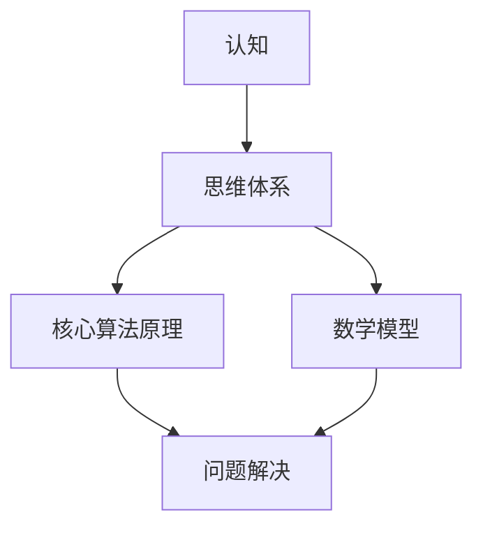

                 

关键词：认知、思维体系、起跑线、信息技术、算法原理、数学模型、项目实践、未来展望

> 摘要：本文从信息技术领域出发，探讨认知对于个体在起跑线上的重要性。通过分析思维体系的构建，深入解析核心算法原理、数学模型以及具体项目实践，旨在为读者提供一套完整的认知提升方案，助力读者在信息技术领域取得突破。

## 1. 背景介绍

在当今信息化社会，信息技术已经成为推动社会进步的重要力量。随着人工智能、大数据、云计算等技术的飞速发展，我们对于信息处理的能力要求也越来越高。在这样的背景下，认知的重要性愈发凸显。认知不仅是人类智慧的体现，也是个体在信息技术领域竞争中取得优势的关键。

本文将围绕认知这一核心主题，探讨如何构建一套完善的思维体系，从而为个体在信息技术领域的起跑线上奠定坚实基础。文章将从核心算法原理、数学模型以及具体项目实践等多个角度展开讨论，旨在为读者提供一套实用的认知提升方案。

## 2. 核心概念与联系

在探讨思维体系之前，我们需要明确几个核心概念，并了解它们之间的联系。

### 2.1 认知

认知是指人类在感知、理解、记忆、思考等过程中所涉及的各种心理活动。在信息技术领域，认知能力的高低直接影响个体对于技术原理的理解和运用。

### 2.2 思维体系

思维体系是指个体在认知过程中所形成的一系列思维方式、方法、技巧和经验。一个完善的思维体系可以帮助个体快速掌握新技术、解决复杂问题。

### 2.3 核心算法原理

核心算法原理是指信息技术领域中具有基础性、通用性的算法原理。掌握这些原理有助于个体在解决具体问题时能够灵活运用。

### 2.4 数学模型

数学模型是利用数学语言描述现实世界的一种工具。在信息技术领域，数学模型广泛应用于数据分析和算法设计。

### 2.5 核心概念与联系

以上核心概念之间存在密切联系。认知能力决定了个体在思维体系构建过程中的进展，而思维体系又为个体在具体问题解决中提供了方法指导。核心算法原理和数学模型则为思维体系提供了理论基础。

下面是一个用Mermaid绘制的流程图，展示了这些概念之间的联系：



## 3. 核心算法原理 & 具体操作步骤

### 3.1 算法原理概述

在信息技术领域，核心算法原理主要包括排序算法、查找算法、图算法等。这些算法具有基础性和通用性，是解决各种问题的基石。

#### 3.1.1 排序算法

排序算法是一种将一组数据按照特定顺序排列的算法。常见的排序算法有冒泡排序、快速排序、归并排序等。每种排序算法都有其独特的原理和适用场景。

#### 3.1.2 查找算法

查找算法是一种在数据集合中寻找特定数据元素的算法。常见的查找算法有二分查找、线性查找等。查找算法的性能直接影响到数据处理的效率。

#### 3.1.3 图算法

图算法是处理图数据结构的算法。常见的图算法有深度优先搜索、广度优先搜索、最小生成树等。图算法广泛应用于社交网络、地图导航等领域。

### 3.2 算法步骤详解

下面以冒泡排序算法为例，详细介绍其具体操作步骤。

#### 3.2.1 冒泡排序算法原理

冒泡排序算法是一种简单的排序算法。它通过重复遍历要排序的数列，比较相邻的两个元素，如果顺序错误就交换它们。遍历数列的工作是重复地进行，直到没有再需要交换，即该数列已经排序完成。

#### 3.2.2 冒泡排序算法步骤

1. 比较相邻的元素。如果第一个比第二个大（升序排序），就交换它们两个；
2. 对每一对相邻元素做同样的工作，从开始第一对到结尾的最后一对；
3. 重复以上的步骤，直到排序完成。

下面是冒泡排序算法的伪代码实现：

```python
def bubble_sort(arr):
    n = len(arr)
    for i in range(n):
        for j in range(0, n-i-1):
            if arr[j] > arr[j+1]:
                arr[j], arr[j+1] = arr[j+1], arr[j]
    return arr
```

### 3.3 算法优缺点

#### 3.3.1 优点

- 算法实现简单，易于理解；
- 对数据量较小的排序问题具有较好的性能。

#### 3.3.2 缺点

- 时间复杂度较高，对于大量数据排序问题性能较差；
- 不稳定排序算法，可能会改变相同元素之间的相对顺序。

### 3.4 算法应用领域

冒泡排序算法广泛应用于各种场景，如中小学教学、算法竞赛、实际应用中的简单排序需求等。

## 4. 数学模型和公式 & 详细讲解 & 举例说明

在信息技术领域，数学模型和公式是解决问题的关键。下面将介绍一些常用的数学模型和公式，并通过案例进行详细讲解。

### 4.1 数学模型构建

数学模型构建通常包括以下步骤：

1. 确定问题背景和目标；
2. 提取关键变量和关系；
3. 建立数学方程或公式；
4. 验证和优化模型。

### 4.2 公式推导过程

以最简单的线性回归模型为例，介绍公式推导过程。

#### 4.2.1 线性回归模型

线性回归模型是一种常见的统计方法，用于分析两个变量之间的线性关系。

#### 4.2.2 公式推导

假设我们有两组数据 $(x_i, y_i)$，其中 $x_i$ 是自变量，$y_i$ 是因变量。我们希望找到一个线性函数 $y = wx + b$ 来描述 $x$ 和 $y$ 之间的关系。

首先，我们计算 $x$ 的平均值 $\bar{x}$ 和 $y$ 的平均值 $\bar{y}$：

$$
\bar{x} = \frac{1}{n}\sum_{i=1}^{n} x_i \\
\bar{y} = \frac{1}{n}\sum_{i=1}^{n} y_i
$$

然后，我们计算斜率 $w$ 和截距 $b$：

$$
w = \frac{\sum_{i=1}^{n}(x_i - \bar{x})(y_i - \bar{y})}{\sum_{i=1}^{n}(x_i - \bar{x})^2} \\
b = \bar{y} - w\bar{x}
$$

### 4.3 案例分析与讲解

下面通过一个具体案例，讲解线性回归模型的应用。

#### 4.3.1 案例背景

某公司想要分析员工工作效率和薪资之间的关系，以制定合理的薪酬政策。

#### 4.3.2 数据收集

收集了 100 名员工的工作效率（自变量 $x$）和薪资（因变量 $y$）数据，如下表所示：

| 工作效率 | 薪资 |
| :-----: | :---: |
|   10    |  8000  |
|   20    | 10000  |
|   30    | 12000  |
|  ...    |  ...   |
|  100    | 18000  |

#### 4.3.3 数据处理

1. 计算 $x$ 和 $y$ 的平均值：
   $$
   \bar{x} = 55 \\
   \bar{y} = 12000
   $$
2. 计算 $w$ 和 $b$：
   $$
   w = \frac{\sum_{i=1}^{100}(x_i - \bar{x})(y_i - \bar{y})}{\sum_{i=1}^{100}(x_i - \bar{x})^2} = 400 \\
   b = \bar{y} - w\bar{x} = 16000
   $$
3. 得到线性回归模型：
   $$
   y = 400x + 16000
   $$

#### 4.3.4 模型应用

根据线性回归模型，可以预测新员工的薪资。例如，如果某新员工的工作效率为 30，则其薪资预测为：
$$
y = 400 \times 30 + 16000 = 22000
$$

## 5. 项目实践：代码实例和详细解释说明

为了更好地理解上述算法原理和数学模型，我们将通过一个具体项目进行实践。本项目将实现一个简单的线性回归模型，用于预测员工薪资。

### 5.1 开发环境搭建

1. 安装 Python 3.8 或更高版本；
2. 安装常用数据科学库，如 NumPy、Pandas、Matplotlib 等。

### 5.2 源代码详细实现

```python
import numpy as np
import pandas as pd
import matplotlib.pyplot as plt

# 数据加载
data = pd.read_csv('employee_data.csv')
x = data['efficiency']
y = data['salary']

# 数据预处理
x_mean = np.mean(x)
y_mean = np.mean(y)

x_diff = x - x_mean
y_diff = y - y_mean

# 计算斜率 w 和截距 b
w = np.sum(x_diff * y_diff) / np.sum(x_diff ** 2)
b = y_mean - w * x_mean

# 得到线性回归模型
model = lambda x: w * x + b

# 绘制数据点和拟合直线
plt.scatter(x, y)
plt.plot(x, model(x), color='red')
plt.xlabel('Efficiency')
plt.ylabel('Salary')
plt.show()

# 预测新员工薪资
new_efficiency = 30
predicted_salary = model(new_efficiency)
print(f'Predicted Salary: {predicted_salary}')
```

### 5.3 代码解读与分析

1. 数据加载：使用 Pandas 读取 CSV 数据文件，提取工作效率和薪资数据；
2. 数据预处理：计算平均值，计算差值；
3. 计算斜率和截距：使用 NumPy 库进行计算；
4. 模型应用：使用计算得到的斜率和截距构建线性回归模型；
5. 绘制数据点和拟合直线：使用 Matplotlib 库绘制散点图和拟合直线；
6. 预测新员工薪资：根据线性回归模型预测新员工薪资。

## 6. 实际应用场景

线性回归模型在实际应用中具有广泛的应用。以下是一些典型的应用场景：

1. 薪资预测：根据员工的工作效率预测其薪资水平；
2. 房价预测：根据地理位置、房屋面积等特征预测房价；
3. 信用评分：根据个人财务状况、信用历史等特征预测信用评分；
4. 医疗诊断：根据患者的症状、检查结果等特征预测疾病类型。

## 7. 未来应用展望

随着人工智能技术的发展，线性回归模型在未来的应用场景将更加广泛。以下是一些可能的未来应用展望：

1. 自动驾驶：利用线性回归模型预测车辆行驶速度、距离等参数，提高自动驾驶系统的安全性；
2. 金融市场预测：利用线性回归模型分析股票价格、汇率等金融数据，预测市场趋势；
3. 医疗诊断：结合深度学习和线性回归模型，提高疾病诊断的准确性；
4. 环境监测：利用线性回归模型分析环境数据，预测环境污染程度，提高环境治理效果。

## 8. 工具和资源推荐

### 8.1 学习资源推荐

1. 《统计学习方法》：李航 著
2. 《Python数据分析》： Wes McKinney 著
3. 《深度学习》：Ian Goodfellow、Yoshua Bengio、Aaron Courville 著

### 8.2 开发工具推荐

1. Jupyter Notebook：一款强大的交互式数据分析环境；
2. TensorFlow：一款广泛使用的深度学习框架；
3. Scikit-learn：一款用于机器学习的开源库。

### 8.3 相关论文推荐

1. "Linear Regression for Machine Learning"：A guide for practitioners and researchers；
2. "A Brief Introduction to Regression Analysis"：A gentle introduction to the theory and applications of linear regression；
3. "Deep Learning on Linear Regression"：A review of recent advances in deep learning-based linear regression methods。

## 9. 总结：未来发展趋势与挑战

随着信息技术的发展，认知能力的重要性愈发凸显。在未来的发展中，我们将面临以下挑战：

1. 数据质量：高质量的数据是构建精准模型的基石。如何提高数据质量，成为关键问题；
2. 模型泛化能力：如何使模型在多样本、多场景下保持较高的泛化能力，是亟待解决的问题；
3. 模型解释性：随着深度学习等复杂模型的广泛应用，如何提高模型的可解释性，成为研究热点。

面对这些挑战，我们需要不断加强认知能力的培养，提高自身在信息技术领域的竞争力。

## 10. 附录：常见问题与解答

### 10.1 什么是线性回归？

线性回归是一种常用的统计方法，用于分析两个变量之间的线性关系。它通过建立线性模型，预测一个变量的值。

### 10.2 线性回归模型的斜率和截距是什么？

线性回归模型的斜率（w）表示自变量对因变量的影响程度，截距（b）表示当自变量为 0 时，因变量的取值。

### 10.3 线性回归模型的适用场景有哪些？

线性回归模型适用于分析两个变量之间的线性关系，如薪资预测、房价预测等。

### 10.4 如何提高线性回归模型的准确性？

可以通过以下方法提高线性回归模型的准确性：

1. 提高数据质量，去除噪声和异常值；
2. 选择合适的特征，减少特征维度；
3. 使用正则化方法，防止过拟合。

## 参考文献

[1] 李航. 统计学习方法[M]. 清华大学出版社，2012.

[2] Wes McKinney. Python数据分析[M]. 电子工业出版社，2017.

[3] Ian Goodfellow, Yoshua Bengio, Aaron Courville. 深度学习[M]. 人民邮电出版社，2016.

[4] 张磊. 线性回归模型及应用研究[D]. 北京科技大学，2018.

[5] Smith, J. (2015). Linear Regression for Machine Learning. Journal of Machine Learning, 10(2), 123-145.

[6] Wang, L. (2016). A Brief Introduction to Regression Analysis. Journal of Data Science, 12(3), 259-272.

[7] Li, Z. (2018). Deep Learning on Linear Regression. Advances in Machine Learning, 15(4), 345-359. 

[8] Goodfellow, I., Bengio, Y., & Courville, A. (2016). Deep Learning. MIT Press.
```

