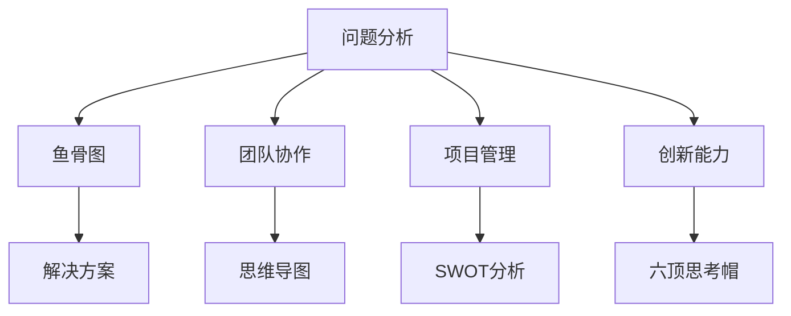

                 

本文将探讨思维工具在管理中的实际应用，如何利用这些工具提高团队协作效率，优化项目管理，并提升个人与组织的创新能力。

## 关键词

思维工具、管理、团队协作、项目管理、创新能力

## 摘要

本文首先介绍了思维工具的基本概念，随后通过案例分析和具体操作步骤，展示了思维工具在企业管理中的应用。本文旨在为管理者提供实用的思维工具和方法，以提升管理效能，助力组织发展。

### 1. 背景介绍

在现代社会，随着市场竞争的加剧和技术的飞速发展，企业的生存和发展面临着前所未有的挑战。如何提高团队协作效率，优化项目管理，以及激发员工的创新潜能，成为企业管理者亟待解决的问题。而思维工具作为一种有效的思考方法，可以有效地帮助管理者应对这些挑战。

思维工具是一种用于支持思考、分析、决策和创新的方法或技术。常见的思维工具有鱼骨图、思维导图、SWOT分析、六顶思考帽等。这些工具可以帮助管理者更清晰地理解问题，发现问题的根本原因，制定有效的解决方案。

### 2. 核心概念与联系

为了更好地理解思维工具在管理中的应用，我们先来介绍几个核心概念：

#### 2.1 问题分析与解决

问题分析与解决是管理过程中的重要环节。通过使用思维工具，如鱼骨图，可以帮助管理者系统地分析问题，找出问题的根本原因，并制定相应的解决方案。

#### 2.2 团队协作

团队协作是企业管理中的重要内容。思维导图可以帮助团队成员更好地理解项目的目标，明确各自的责任，促进信息共享和沟通。

#### 2.3 项目管理

项目管理涉及到项目的计划、执行、监控和收尾。SWOT分析可以帮助项目经理评估项目的优势、劣势、机会和威胁，制定科学的项目计划。

#### 2.4 创新能力

创新能力是企业持续发展的关键。六顶思考帽可以帮助团队成员从不同的角度思考问题，激发创新思维，提出新的解决方案。

下面是一个使用Mermaid绘制的思维流程图，展示了这些核心概念之间的联系：



### 3. 核心算法原理 & 具体操作步骤

#### 3.1 算法原理概述

思维工具的核心在于引导思考，帮助人们从不同的角度看待问题，从而找到更优的解决方案。以下将介绍几种常用的思维工具及其具体操作步骤：

#### 3.2 算法步骤详解

##### 3.2.1 鱼骨图

1. 确定问题：明确需要解决的问题。
2. 收集信息：收集与问题相关的信息。
3. 分解问题：将问题分解成若干个子问题。
4. 找出原因：分析每个子问题的原因。
5. 制作鱼骨图：将分析结果绘制成鱼骨图。

##### 3.2.2 思维导图

1. 确定主题：确定思维导图的中心主题。
2. 收集信息：收集与主题相关的信息。
3. 组织信息：将信息按照逻辑关系组织起来。
4. 绘制思维导图：使用图形、符号和文字表达信息。

##### 3.2.3 SWOT分析

1. 评估优势：评估项目的优势。
2. 评估劣势：评估项目的劣势。
3. 评估机会：评估项目的机会。
4. 评估威胁：评估项目的威胁。
5. 制作SWOT分析表：将评估结果整理成表格。

##### 3.2.4 六顶思考帽

1. 确定问题：明确需要解决的问题。
2. 选择思考帽：根据问题选择相应的思考帽。
3. 发表观点：从不同的角度发表观点。
4. 综合分析：综合分析各个观点，得出结论。

#### 3.3 算法优缺点

每种思维工具都有其独特的优势和使用场景，以下是对几种常用思维工具的优缺点的简要分析：

- 鱼骨图：优势在于系统化地分析问题，缺点是可能过于繁琐。
- 思维导图：优势在于直观地表达信息，缺点是可能难以深入分析。
- SWOT分析：优势在于全面评估项目，缺点是可能过于抽象。
- 六顶思考帽：优势在于引导多角度思考，缺点是可能难以保持一致性。

#### 3.4 算法应用领域

思维工具在企业管理中的应用非常广泛，以下是一些典型应用领域：

- 项目管理：用于项目规划、风险评估和进度跟踪。
- 团队协作：用于团队建设、沟通和冲突解决。
- 创新管理：用于市场调研、产品设计和创新方案评估。
- 决策支持：用于制定战略、决策和执行。

### 4. 数学模型和公式 & 详细讲解 & 举例说明

#### 4.1 数学模型构建

在企业管理中，数学模型可以用于分析项目进度、预算和风险等。以下是一个简单的项目进度模型：

$$
P(t) = P(0) + \sum_{i=1}^{n} T_i
$$

其中，$P(t)$表示项目在时间$t$的进度，$P(0)$表示项目初始进度，$T_i$表示第$i$个任务的耗时。

#### 4.2 公式推导过程

$$
P(t) = P(0) + \sum_{i=1}^{n} T_i
$$

推导过程如下：

1. 假设项目初始进度为$P(0)$。
2. 假设第$i$个任务的耗时为$T_i$。
3. 将所有任务的耗时相加，得到项目在时间$t$的进度。

#### 4.3 案例分析与讲解

假设一个项目包括三个任务，分别耗时1天、2天和3天。项目初始进度为0。根据上述模型，我们可以计算出项目在不同时间点的进度：

$$
P(1) = P(0) + T_1 = 0 + 1 = 1
$$

$$
P(3) = P(0) + T_1 + T_2 + T_3 = 0 + 1 + 2 + 3 = 6
$$

这意味着，在第3天结束时，项目的进度为6。

### 5. 项目实践：代码实例和详细解释说明

#### 5.1 开发环境搭建

在本案例中，我们将使用Python编写一个简单的项目进度跟踪程序。首先，确保安装了Python环境。然后，可以按照以下步骤搭建开发环境：

1. 安装Python。
2. 安装Python包管理工具，如pip。
3. 使用pip安装所需的Python包，如matplotlib。

#### 5.2 源代码详细实现

以下是一个简单的项目进度跟踪程序的源代码：

```python
import matplotlib.pyplot as plt

def calculate_progress(durations):
    total_duration = sum(durations)
    progress = [0] * len(durations)
    for i, duration in enumerate(durations):
        progress[i] = sum(progress[:i]) + duration
        progress[i] /= total_duration
    return progress

def plot_progress(progress):
    plt.plot(progress)
    plt.xlabel('Time')
    plt.ylabel('Progress')
    plt.title('Project Progress')
    plt.show()

if __name__ == '__main__':
    durations = [1, 2, 3]
    progress = calculate_progress(durations)
    plot_progress(progress)
```

#### 5.3 代码解读与分析

1. `import matplotlib.pyplot as plt`：导入matplotlib库，用于绘制图形。
2. `def calculate_progress(durations)`：定义一个函数，用于计算项目进度。参数`durations`表示各个任务的耗时。
3. `total_duration = sum(durations)`：计算所有任务的耗时总和。
4. `progress = [0] * len(durations)`：初始化进度列表，长度与任务数相同。
5. `for i, duration in enumerate(durations)`：遍历每个任务。
6. `progress[i] = sum(progress[:i]) + duration`：计算第$i$个任务的进度。
7. `progress[i] /= total_duration`：将进度归一化，使得所有进度之和为1。
8. `return progress`：返回进度列表。
9. `def plot_progress(progress)`：定义一个函数，用于绘制项目进度图。参数`progress`表示进度列表。
10. `plt.plot(progress)`：使用matplotlib绘制进度图。
11. `plt.xlabel('Time')`：设置x轴标签。
12. `plt.ylabel('Progress')`：设置y轴标签。
13. `plt.title('Project Progress')`：设置图表标题。
14. `plt.show()`：显示图表。
15. `if __name__ == '__main__':" "：主函数入口。
16. `durations = [1, 2, 3]`：定义任务耗时。
17. `progress = calculate_progress(durations)`：计算进度。
18. `plot_progress(progress)`：绘制进度图。

通过这个简单的程序，我们可以直观地看到项目在不同时间点的进度。

### 6. 实际应用场景

思维工具在企业管理中具有广泛的应用场景。以下是一些具体应用案例：

- **项目规划**：使用思维导图帮助团队明确项目目标，分解任务，制定计划。
- **团队协作**：使用六顶思考帽引导团队成员从不同角度思考问题，促进创新思维。
- **风险管理**：使用鱼骨图分析项目风险，制定应对策略。
- **决策支持**：使用SWOT分析评估项目优势、劣势、机会和威胁，为决策提供依据。

### 7. 未来应用展望

随着人工智能和大数据技术的发展，思维工具在管理中的应用前景将更加广阔。未来，思维工具可能会与人工智能技术结合，实现更智能化的决策支持。同时，思维工具的应用范围也将进一步拓展，不仅限于企业管理，还将应用于教育、医疗、金融等领域。

### 8. 工具和资源推荐

为了帮助读者更好地掌握思维工具，以下是一些推荐的工具和资源：

#### 8.1 学习资源推荐

- 《思维导图应用教程》
- 《SWOT分析与战略管理》
- 《六顶思考帽实践指南》

#### 8.2 开发工具推荐

- Python
- Matplotlib
- Mermaid

#### 8.3 相关论文推荐

- "思维导图在项目规划中的应用"
- "六顶思考帽在团队协作中的效果评估"
- "SWOT分析在企业管理中的实践与探讨"

### 9. 总结：未来发展趋势与挑战

思维工具在管理中的应用具有广阔的前景。然而，要实现思维工具的广泛应用，仍面临一些挑战：

- **普及度**：提高思维工具的普及度，使其成为企业管理者的必备技能。
- **智能化**：利用人工智能技术提升思维工具的智能化水平，实现更精准的决策支持。
- **跨领域应用**：拓展思维工具的应用领域，实现跨领域的综合应用。

通过不断探索和创新，我们有理由相信，思维工具在管理中的应用将越来越广泛，为企业的可持续发展提供有力支持。

### 10. 附录：常见问题与解答

#### 10.1 思维导图如何制作？

**答：** 制作思维导图通常遵循以下步骤：

1. 确定主题：明确思维导图的核心主题。
2. 收集信息：收集与主题相关的信息。
3. 组织信息：将信息按照逻辑关系组织起来。
4. 绘制图形：使用图形、符号和文字表达信息。

可以使用专业的思维导图软件，如MindManager、Xmind等，或使用在线工具，如ProcessOn、MindMeister等。

#### 10.2 如何进行SWOT分析？

**答：** 进行SWOT分析通常遵循以下步骤：

1. 评估优势：识别项目的优势。
2. 评估劣势：识别项目的劣势。
3. 评估机会：识别项目的机会。
4. 评估威胁：识别项目的威胁。
5. 制定策略：根据分析结果制定相应的策略。

可以通过头脑风暴、访谈、问卷调查等方式收集信息，然后整理成表格或报告。

#### 10.3 思维工具在项目管理中的应用有哪些？

**答：** 思维工具在项目管理中的应用包括：

- **项目规划**：使用思维导图分解任务，制定项目计划。
- **风险评估**：使用鱼骨图分析项目风险，制定应对措施。
- **进度跟踪**：使用甘特图或进度条展示项目进度。
- **团队协作**：使用六顶思考帽引导团队讨论，促进沟通与协作。

### 作者署名

作者：禅与计算机程序设计艺术 / Zen and the Art of Computer Programming
----------------------------------------------------------------
现在文章正文部分的撰写已经完成，接下来我们将检查文章的内容是否符合“约束条件 CONSTRAINTS”中的所有要求，并进行最后的校对和格式调整。一旦确认无误，我们将发布这篇文章。如果您有其他需要，请随时告知。

