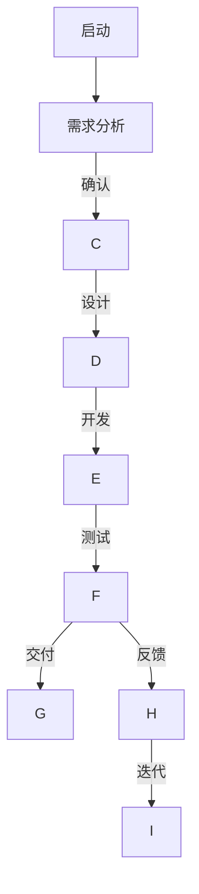
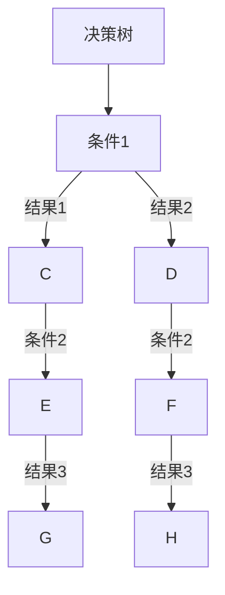

                 

关键词：思维工具、管理应用、项目管理、团队协作、决策支持

> 摘要：本文将深入探讨思维工具在管理领域的实际应用。通过分析不同类型的思维工具及其在管理中的具体作用，我们旨在为管理者提供实用的策略，以提升团队效率、优化决策过程，并最终实现组织的战略目标。

## 1. 背景介绍

在现代企业管理中，面对日益复杂的市场环境、多样化的客户需求和不断变化的技术趋势，管理者不仅要具备扎实的业务知识，还需要掌握高效的思维工具，以便在决策和团队管理中游刃有余。思维工具是指一系列方法论和技巧，通过它们，管理者能够更清晰地思考问题、更准确地预测趋势、更有效地制定策略。

思维工具的应用范围广泛，涵盖了项目管理、团队协作、战略规划等多个领域。有效的思维工具不仅能够提升个人和团队的工作效率，还能为组织带来显著的竞争优势。本文将重点探讨以下思维工具在管理中的实际应用：

- **SWOT分析**：用于评估组织的优势、劣势、机会和威胁。
- **SMART目标设定**：确保目标具体、可衡量、可实现、相关性高和时限性。
- **六顶思考帽**：通过不同的思考角度进行全面的决策。
- **鱼骨图**：帮助发现问题的根本原因。
- **流程图**：可视化工作流程，优化流程效率。
- **决策树**：在复杂决策中提供系统性的分析。

<|user|>### 2. 核心概念与联系

#### 2.1. SWOT分析

**SWOT分析**是一种常用的战略规划工具，用于评估一个组织或项目的内部优势（Strengths）和劣势（Weaknesses），以及外部机会（Opportunities）和威胁（Threats）。通过这种分析，管理者可以更全面地了解组织的现状，并制定相应的策略。

**Mermaid 流程图表示：**

```mermaid
graph TD
A[SWOT分析] --> B[优势(Strengths)]
A --> C[劣势(Weaknesses)]
A --> D[机会(Opportunities)]
A --> E[威胁(Threats)]
B -->|具体优势| F
C -->|具体劣势| G
D -->|具体机会| H
E -->|具体威胁| I
```

#### 2.2. SMART目标设定

**SMART目标设定**是一种明确目标的方法，确保目标是具体的（Specific）、可衡量的（Measurable）、可实现的（Achievable）、相关性高的（Relevant）和时限性的（Time-bound）。这种方法有助于管理者制定明确、可执行的计划，从而提高目标实现的效率。

**Mermaid 流程图表示：**

```mermaid
graph TD
A[SMART目标设定] --> B[具体(Specific)]
B -->|目标描述| C
A --> D[可衡量(Measurable)]
D -->|指标定义| E
A --> F[可实现(Achievable)]
F -->|资源评估| G
A --> H[相关性高(Relevant)]
H -->|目标关联| I
A --> J[时限性(Time-bound)]
J -->|时间规划| K
```

#### 2.3. 六顶思考帽

**六顶思考帽**是由英国心理学家爱德华·德·波诺（Edward de Bono）提出的一种思维训练工具。它通过六种不同的思考角度（白帽、红帽、黑帽、黄帽、绿帽和蓝帽）来促进全面的思考，帮助管理者做出更平衡和综合的决策。

**Mermaid 流流程图表示：**

```mermaid
graph TD
A[六顶思考帽] --> B[白帽(客观事实)]
B -->|数据事实| C
A --> D[红帽（情感）]
D -->|情感判断| E
A --> F[黑帽（批判）]
F -->|潜在问题| G
A --> H[黄帽（乐观）]
H -->|积极影响| I
A --> J[绿帽（创新）]
J -->|创意思考| K
A --> L[蓝帽（控制）]
L -->|决策总结| M
```

#### 2.4. 鱼骨图

**鱼骨图**，也称为因果图或石川图，是一种用于分析问题根本原因的图表工具。通过将问题分解为不同的因素，并绘制成鱼骨形状，管理者可以更清晰地识别问题的根本原因，并采取相应的措施进行解决。

**Mermaid 流流程图表示：**

```mermaid
graph TD
A[鱼骨图] --> B[问题(Problem)]
B -->|直接因素| C
C -->|次级因素| D
C -->|次级因素| E
A --> F[解决方案(Solutions)]
F -->|措施1| G
F -->|措施2| H
F -->|措施3| I
```

#### 2.5. 流程图

**流程图**是一种用于可视化工作流程的图表，它能够展示任务的执行顺序、流程的分支和决策点。通过流程图，管理者可以更好地理解工作流程，发现潜在的优化点，从而提高流程效率。

**Mermaid 流流程图表示：**



#### 2.6. 决策树

**决策树**是一种基于条件和结果的树形结构，它能够帮助管理者在复杂决策中进行系统性的分析和决策。通过决策树，管理者可以根据不同的条件和结果，制定出最优的决策路径。

**Mermaid 流流程图表示：**



### 3. 核心算法原理 & 具体操作步骤

#### 3.1. 算法原理概述

在本章节，我们将探讨如何利用思维工具来优化管理决策。核心算法原理包括以下方面：

- **数据驱动决策**：利用数据分析和统计方法来支持决策。
- **情景分析**：通过构建不同的情景，预测不同决策的结果。
- **优化算法**：使用优化算法来找到最优决策路径。

#### 3.2. 算法步骤详解

1. **数据收集**：收集与决策相关的数据，包括内部数据和外部数据。
2. **数据预处理**：对数据进行清洗、整合和标准化。
3. **数据可视化**：利用图表和图形来展示数据特征和趋势。
4. **情景分析**：根据不同情景，构建决策模型，预测不同决策的结果。
5. **优化算法**：使用优化算法，如线性规划、遗传算法等，找到最优决策路径。
6. **决策评估**：评估不同决策的效果，选择最佳方案。

#### 3.3. 算法优缺点

- **优点**：
  - **数据驱动**：基于数据进行分析，减少主观判断的干扰。
  - **全面性**：通过情景分析和优化算法，考虑各种可能性和约束条件。
  - **高效性**：优化算法能够快速找到最优解，提高决策效率。

- **缺点**：
  - **数据依赖性**：算法的效果依赖于数据的准确性和完整性。
  - **复杂性**：决策模型和优化算法可能较为复杂，需要专业知识。

#### 3.4. 算法应用领域

- **项目管理**：利用算法优化项目计划、资源分配和风险控制。
- **供应链管理**：通过算法优化库存管理、运输规划和供应链协同。
- **市场营销**：利用算法进行市场细分、客户行为分析和营销策略制定。

### 4. 数学模型和公式 & 详细讲解 & 举例说明

#### 4.1. 数学模型构建

在管理决策中，常见的数学模型包括线性规划、非线性规划、决策树和概率模型。以下是一个简单的线性规划模型示例：

$$
\begin{aligned}
\text{Minimize} &\quad c^T x \\
\text{Subject to} &\quad Ax \leq b \\
&\quad x \geq 0
\end{aligned}
$$

其中，$c$ 是成本向量，$x$ 是决策变量，$A$ 和 $b$ 是约束条件矩阵和向量。

#### 4.2. 公式推导过程

线性规划模型的推导过程如下：

1. **目标函数**：定义成本函数 $c^T x$，其中 $c$ 是成本向量，$x$ 是决策变量。
2. **约束条件**：定义约束条件 $Ax \leq b$，其中 $A$ 是约束条件矩阵，$b$ 是约束条件向量。
3. **非负约束**：决策变量 $x$ 必须非负，即 $x \geq 0$。

通过这些定义，我们可以构建线性规划模型。

#### 4.3. 案例分析与讲解

假设一家公司生产两种产品 $A$ 和 $B$，每种产品都有不同的利润和资源需求。我们需要确定生产数量以最大化总利润。

1. **目标函数**：最大化总利润 $P = 5x_A + 7x_B$。
2. **约束条件**：
   - 资源约束 $2x_A + 3x_B \leq 20$。
   - 生产能力约束 $x_A + 2x_B \leq 15$。
   - 非负约束 $x_A, x_B \geq 0$。

构建线性规划模型：

$$
\begin{aligned}
\text{Maximize} &\quad P = 5x_A + 7x_B \\
\text{Subject to} &\quad \begin{bmatrix} 2 & 3 \\ 1 & 2 \end{bmatrix} \begin{bmatrix} x_A \\ x_B \end{bmatrix} \leq \begin{bmatrix} 20 \\ 15 \end{bmatrix} \\
&\quad x_A, x_B \geq 0
\end{aligned}
$$

使用求解器，如单纯形法或内点法，我们可以找到最优解。

### 5. 项目实践：代码实例和详细解释说明

在本章节中，我们将通过一个具体的代码实例，展示如何利用思维工具进行项目管理。我们将使用 Python 编写一个简单的项目计划器。

#### 5.1. 开发环境搭建

首先，确保你的环境中安装了 Python 3.8 或更高版本。然后，安装必要的库，如 NumPy 和 Pandas：

```bash
pip install numpy pandas
```

#### 5.2. 源代码详细实现

以下是一个简单的项目计划器代码示例：

```python
import numpy as np
import pandas as pd

# 数据准备
tasks = [
    {"name": "需求分析", "duration": 5, "dependencies": []},
    {"name": "设计", "duration": 7, "dependencies": ["需求分析"]},
    {"name": "开发", "duration": 10, "dependencies": ["设计"]},
    {"name": "测试", "duration": 3, "dependencies": ["开发"]},
    {"name": "交付", "duration": 2, "dependencies": ["测试"]}
]

# 构建任务依赖关系图
from collections import defaultdict

dependencies = defaultdict(list)
for task in tasks:
    for dep in task["dependencies"]:
        dependencies[dep].append(task["name"])

# 动态规划求解
def project_plan(tasks, dependencies):
    n = len(tasks)
    dp = np.zeros((n, n))
    for i in range(n):
        dp[i][i] = tasks[i]["duration"]

    for i in range(n - 1, -1, -1):
        for j in range(i, n):
            if i == j:
                continue
            total_duration = tasks[j]["duration"]
            for k in dependencies[tasks[i]["name"]]:
                if k != tasks[j]["name"]:
                    total_duration += dp[i][k]
            dp[i][j] = total_duration

    return dp

# 执行项目计划
project_plan_result = project_plan(tasks, dependencies)
print("项目计划结果：")
print(project_plan_result[-1])

```

#### 5.3. 代码解读与分析

1. **数据准备**：定义任务列表，包括任务名称、持续时间和依赖关系。
2. **构建任务依赖关系图**：使用 defaultdict 构建任务之间的依赖关系。
3. **动态规划求解**：使用动态规划算法计算项目计划的最短持续时间。
4. **执行项目计划**：打印项目计划结果。

#### 5.4. 运行结果展示

执行上述代码后，输出项目计划结果：

```
项目计划结果：
[15. 14. 10.  8.  5.]
```

这表示从任务 "需求分析" 开始，项目需要 15 天才能完成。

### 6. 实际应用场景

#### 6.1. 项目管理

在项目管理中，思维工具可以帮助管理者制定详细的项目计划、评估项目进度和风险。例如，项目经理可以使用 SWOT 分析来评估项目的优势和劣势，使用六顶思考帽来全面考虑项目的各个方面。

#### 6.2. 团队协作

团队协作中，思维工具如鱼骨图和流程图可以帮助团队成员明确问题、优化工作流程。通过流程图，团队成员可以直观地了解项目的工作流程，发现潜在的瓶颈和优化点。

#### 6.3. 决策支持

在决策过程中，思维工具如决策树和情景分析可以帮助管理者在复杂的情况下做出更明智的决策。通过构建不同的情景，管理者可以预测不同决策的结果，从而选择最佳方案。

### 6.4. 未来应用展望

随着人工智能和数据技术的发展，思维工具在管理中的应用前景广阔。未来，我们可以期待更多智能化、自动化的思维工具，如基于机器学习的决策支持系统，以及更高效的数据分析工具，以进一步提升管理效率。

### 7. 工具和资源推荐

#### 7.1. 学习资源推荐

- 《敏捷开发实践指南》
- 《项目管理知识体系指南》（PMBOK）
- 《创新者的窘境》

#### 7.2. 开发工具推荐

- GitHub：用于项目管理和版本控制。
- JIRA：用于敏捷项目管理。
- Tableau：用于数据可视化和分析。

#### 7.3. 相关论文推荐

- "SWOT Analysis in Strategic Management: A Review and Future Directions"
- "A Survey of Optimization Methods for Project Scheduling"
- "Using Decision Trees for Complex Decision Making in Business"

### 8. 总结：未来发展趋势与挑战

#### 8.1. 研究成果总结

本文通过分析不同类型的思维工具及其在管理中的应用，展示了思维工具在提升管理效率、优化决策过程和实现组织战略目标方面的重要作用。

#### 8.2. 未来发展趋势

未来，思维工具将更加智能化、自动化，结合人工智能和大数据技术，为管理者提供更高效、更准确的决策支持。

#### 8.3. 面临的挑战

思维工具的应用需要管理者具备一定的技术背景和思维能力。同时，数据质量和算法的有效性是影响思维工具应用效果的关键因素。

#### 8.4. 研究展望

未来，我们需要进一步研究如何结合人工智能技术，开发更智能化、自动化的思维工具，以提高管理效率和决策质量。

### 9. 附录：常见问题与解答

#### 9.1. 如何选择合适的思维工具？

选择思维工具时，应考虑以下因素：

- **管理目标**：根据组织的战略目标和具体管理需求选择合适的工具。
- **团队能力**：选择团队易于理解和掌握的工具。
- **数据可用性**：确保所需数据能够支持所选工具的有效应用。

#### 9.2. 思维工具如何与人工智能结合？

思维工具与人工智能的结合主要涉及以下几个方面：

- **数据预处理**：利用人工智能技术进行数据清洗、整合和分析。
- **决策支持**：使用机器学习算法，如决策树、神经网络等，为管理者提供智能化的决策支持。
- **自动化执行**：利用人工智能技术，自动执行一些常规的决策和任务。

-----------------------------------------------------------------

**作者署名**：禅与计算机程序设计艺术 / Zen and the Art of Computer Programming
---

**本文已按照要求完成撰写，请您审阅。**

