                 

作为世界级人工智能专家，程序员，软件架构师，CTO，世界顶级技术畅销书作者，计算机图灵奖获得者，计算机领域大师，今天我将与您探讨一个关键且广泛的话题：**思维框架——结构化思考的工具**。

在信息技术迅猛发展的今天，复杂问题的解决不再是单一的技能或知识点的应用，而是需要我们具备**结构化思考**的能力。本文旨在为您提供一个全面的视角，了解结构化思考的概念、重要性以及如何在实际工作和生活中应用它。

> 关键词：思维框架、结构化思考、IT技能、问题解决、复杂系统、设计模式

> 摘要：本文首先介绍了结构化思考的定义和重要性，随后深入探讨了思维框架的概念、组成部分及其在IT领域的应用。通过具体案例和数学模型，我们将展示如何使用思维框架来解决复杂问题，最后，讨论了思维框架的未来发展趋势和面临的挑战。

## 1. 背景介绍

在过去的几十年中，信息技术的发展速度前所未有。从最初的计算机科学到现在的深度学习和人工智能，技术的边界不断扩展，同时也带来了前所未有的复杂性。对于许多从业人员来说，面对日益复杂的技术问题和项目，单靠传统的线性思维方式已经不够，我们需要一种新的思维方式——**结构化思考**。

结构化思考强调将复杂的问题分解为若干个简单的部分，通过逐步分析和解决这些部分，最终得到整体的解决方案。这种思维方式不仅在计算机科学领域具有重要价值，在商业、管理、教育等多个领域也得到了广泛应用。

本文将重点关注结构化思考在IT领域的应用，特别是如何通过**思维框架**这一工具来提高我们的问题解决能力和系统设计效率。接下来，我们将逐步深入讨论这一主题。

### 1.1 计算机科学的发展

计算机科学自诞生以来，经历了多个重要的阶段。从最初的计算机硬件发展到软件工程，再到现代的人工智能和大数据技术，每一阶段都带来了新的挑战和机遇。

在软件工程阶段，结构化编程和模块化设计成为主流。程序员们开始意识到，只有通过清晰的逻辑和结构，才能编写出可靠且易于维护的代码。这种方法不仅提高了开发效率，也增强了代码的可读性和可扩展性。

随着计算机科学的发展，复杂性不断增加。现代软件系统往往包含大量的模块和组件，涉及多个领域的技术。这种复杂性使得传统的线性思维方式难以应对。因此，需要一种更高级的思维方式——结构化思考。

### 1.2 结构化思考的重要性

结构化思考在IT领域的重要性不言而喻。首先，它能够帮助我们更好地理解复杂系统。通过将系统分解为若干个部分，我们可以逐个分析和解决这些部分，从而构建出一个完整的系统。

其次，结构化思考有助于提高我们的问题解决能力。在面对复杂问题时，结构化思考能够帮助我们将问题分解为若干个子问题，逐一解决。这种方法不仅使问题更易于管理，也使我们能够更清晰地看到问题的本质。

最后，结构化思考在项目管理和团队协作中发挥着重要作用。通过结构化思考，项目经理和团队成员可以更有效地沟通和协作，确保项目的顺利进行。

## 2. 核心概念与联系

在深入探讨思维框架之前，我们需要明确几个核心概念，并了解它们之间的联系。以下是一个使用Mermaid绘制的流程图，展示了这些概念及其关系：

```mermaid
graph TB
    A[结构化思考] --> B[思维框架]
    A --> C[系统分解]
    A --> D[逻辑推理]
    A --> E[问题解决]
    B --> F[模块化设计]
    B --> G[系统建模]
    B --> H[决策树]
    C --> I[模块化]
    C --> J[层次化]
    D --> K[演绎推理]
    D --> L[归纳推理]
    E --> M[算法]
    E --> N[流程图]
    F --> O[设计模式]
    G --> P[状态机]
    G --> Q[数据流图]
    H --> R[条件分支]
    H --> S[决策树]
    I --> T[组件化]
    I --> U[可复用性]
    J --> V[层次结构]
    J --> W[信息隐藏]
    K --> X[定理证明]
    K --> Y[逻辑门]
    L --> Z[机器学习]
    M --> AA[贪心算法]
    M --> BB[动态规划]
    N --> CC[Petri网]
    O --> DD[工厂模式]
    O --> EE[单例模式]
    P --> FF[有限状态机]
    P --> GG[事务处理]
    Q --> HH[数据流分析]
    Q --> II[管道编程]
    R --> JJ[条件判断]
    R --> KK[多重条件分支]
    S --> LL[路径选择]
    S --> MM[多目标决策]
    T --> NN[组件库]
    T --> OO[组件化框架]
    U --> PP[代码复用]
    U --> QQ[软件复用]
    V --> RR[分层架构]
    V --> SS[模块化架构]
    W --> TT[封装]
    W --> UU[抽象]
    X --> VV[形式验证]
    X --> WW[模型检查]
    Y --> XX[逻辑电路]
    Y --> YY[布尔逻辑]
    Z --> ZZ[分类器]
    Z --> AAA[聚类算法]
    AA --> BBB[最优子结构]
    BB --> CCC[重叠子问题]
    CC --> DDD[状态转换]
    DD --> EEE[依赖管理]
    EE --> FFF[对象封装]
    FF --> GGG[状态迁移]
    GG --> HHH[事务管理]
    HH --> III[数据流动]
    II --> JJJ[管道流水线]
    JJ --> KKK[条件分支逻辑]
    KK --> LLL[路径选择逻辑]
    LL --> MMM[多目标优化]
    MM --> NNN[综合评价]
    NN --> OOO[模块化开发]
    OO --> PPP[组件化平台]
    PP --> QQQ[代码重用机制]
    QQ --> RRR[软件工程]
    RR --> SSS[架构设计]
    SS --> TTT[模块化设计]
    TT --> UUU[模块化框架]
    UU --> VVV[抽象层次]
    VV --> WWW[代码复用策略]
    WW --> XXX[设计模式]
```



### 2.1 结构化思考与思维框架

**结构化思考**是一种思维方式，强调将复杂问题分解为若干简单部分，并逐步解决。它依赖于**思维框架**这一工具，通过系统化、模块化的方法，实现问题的有效解决。

**思维框架**是由一系列概念、模型、工具和算法构成的工具集，用于指导我们的结构化思考。它包括模块化设计、系统建模、逻辑推理、问题解决等多个方面。

### 2.2 系统分解与模块化

**系统分解**是将复杂系统划分为若干个独立的部分，每个部分负责特定的功能。这种分解方法有助于我们更好地理解系统的结构和运作机制。

**模块化**是系统分解的一种实现方式，强调组件的可复用性和独立性。通过模块化，我们可以将系统分解为多个可重用的组件，从而提高开发效率和代码质量。

### 2.3 逻辑推理与问题解决

**逻辑推理**是结构化思考的核心方法，通过演绎推理和归纳推理，我们能够从已知事实推导出新的结论。逻辑推理不仅帮助我们理解复杂问题，还为问题解决提供了有效的工具。

**问题解决**是结构化思考的终极目标，通过逐步分析和解决子问题，我们能够找到整体解决方案。在这个过程中，逻辑推理和系统分解方法发挥了关键作用。

## 3. 核心算法原理 & 具体操作步骤

### 3.1 算法原理概述

在IT领域中，核心算法原理是构建结构化思考的重要基石。以下是一些关键的算法原理及其在系统设计中的应用：

#### 3.1.1 贪心算法

**贪心算法**是一种局部最优解策略，通过不断选择当前情况下最优的决策，逐步构建出整体最优解。例如，在寻找最短路径问题时，Dijkstra算法就是基于贪心策略实现的。

#### 3.1.2 动态规划

**动态规划**是一种用于解决最优化问题的算法，通过将问题分解为多个子问题，并保存子问题的解，避免重复计算。经典的动态规划问题包括背包问题和矩阵链乘问题。

#### 3.1.3 贪心算法与动态规划的异同

**贪心算法**和**动态规划**都是解决最优化问题的常用方法，但它们有以下不同之处：

- **贪心算法**关注局部最优解，而**动态规划**关注整体最优解。
- **贪心算法**通常更简单，但**动态规划**能够解决更复杂的问题。
- **贪心算法**可能在某些情况下无法得到最优解，而**动态规划**总能找到最优解。

#### 3.1.4 算法步骤详解

以下是**贪心算法**和**动态规划**的基本步骤：

**贪心算法步骤：**

1. 初始化：设定初始状态。
2. 选择：在当前状态下，选择最优的决策。
3. 更新：根据选择的决策，更新状态。
4. 终止：当达到终止条件时，算法结束。

**动态规划步骤：**

1. 初始化：设定初始状态。
2. 分解：将问题分解为多个子问题。
3. 递归：使用递归或迭代方式求解子问题。
4. 缓存：保存子问题的解，避免重复计算。
5. 组合：将子问题的解组合成整体问题的解。
6. 终止：当所有子问题求解完毕时，算法结束。

#### 3.1.5 算法优缺点

**贪心算法**的优点是：

- **简单高效**：实现简单，易于理解。
- **时间复杂度低**：在许多情况下，贪心算法能够快速得到最优解。

**贪心算法**的缺点是：

- **不一定得到最优解**：在某些情况下，贪心算法可能无法保证全局最优。
- **适用范围有限**：仅适用于特定类型的问题。

**动态规划**的优点是：

- **总能找到最优解**：适用于复杂的最优化问题。
- **缓存机制**：通过缓存子问题的解，避免重复计算，提高效率。

**动态规划**的缺点是：

- **实现复杂**：相较于贪心算法，动态规划的实现更复杂，更难以理解。
- **时间复杂度高**：在某些情况下，动态规划可能需要大量计算资源。

#### 3.1.6 算法应用领域

**贪心算法**和**动态规划**在多个IT领域都有广泛应用，例如：

- **贪心算法**：用于最短路径问题（如Dijkstra算法）、背包问题、活动选择问题等。
- **动态规划**：用于最优化问题（如背包问题、矩阵链乘、最长公共子序列等）、组合优化问题（如旅行售货员问题、任务分配问题等）。

### 3.2 算法步骤详解

#### 3.2.1 贪心算法步骤详解

以**最短路径问题**为例，以下是贪心算法的具体步骤：

1. 初始化：设定初始状态，包括顶点集合V、边集合E和权重函数w。
2. 选择：从顶点集合V中选择未访问过的顶点u。
3. 更新：计算从源点s到顶点u的最短路径长度，并更新状态。
4. 终止：当所有顶点都访问完毕时，算法结束。

#### 3.2.2 动态规划步骤详解

以**背包问题**为例，以下是动态规划的具体步骤：

1. 初始化：设定初始状态，包括物品集合I、容量C和收益函数r。
2. 分解：将背包问题分解为多个子问题，每个子问题表示将部分物品放入背包中。
3. 递归：使用递归或迭代方式求解子问题，并保存子问题的解。
4. 组合：将子问题的解组合成整体问题的解。
5. 终止：当所有子问题求解完毕时，算法结束。

### 3.3 算法优缺点

#### 3.3.1 贪心算法优缺点

**优点：**

- **简单高效**：贪心算法实现简单，易于理解，能够快速得到最优解。
- **适用范围广**：贪心算法适用于许多最优化问题，如最短路径、背包问题等。

**缺点：**

- **不一定得到最优解**：在某些情况下，贪心算法可能无法保证全局最优。
- **适用范围有限**：仅适用于特定类型的问题。

#### 3.3.2 动态规划优缺点

**优点：**

- **总能找到最优解**：动态规划适用于复杂的最优化问题，总能找到最优解。
- **缓存机制**：通过缓存子问题的解，避免重复计算，提高效率。

**缺点：**

- **实现复杂**：相较于贪心算法，动态规划的实现更复杂，更难以理解。
- **时间复杂度高**：在某些情况下，动态规划可能需要大量计算资源。

### 3.4 算法应用领域

**贪心算法**和**动态规划**在多个IT领域都有广泛应用，如：

- **贪心算法**：用于最短路径问题（如Dijkstra算法）、背包问题、活动选择问题等。
- **动态规划**：用于最优化问题（如背包问题、矩阵链乘、最长公共子序列等）、组合优化问题（如旅行售货员问题、任务分配问题等）。

## 4. 数学模型和公式 & 详细讲解 & 举例说明

### 4.1 数学模型构建

在探讨结构化思考的过程中，数学模型和公式起着至关重要的作用。它们不仅能够帮助我们理解和描述复杂系统，还能提供精确的量化工具。以下是一个简单的数学模型构建过程：

#### 4.1.1 确定变量

首先，我们需要确定系统中的关键变量。例如，在一个社交网络分析中，变量可能包括用户数量、互动频率、社区密度等。

#### 4.1.2 确定关系

接下来，我们分析这些变量之间的关系。例如，用户数量可能影响社区密度，而互动频率可能影响用户留存率。

#### 4.1.3 构建公式

基于变量之间的关系，我们可以构建数学公式。例如，一个简单的线性关系可能表示为：

\[ y = mx + b \]

其中，\( y \)是社区密度，\( x \)是用户数量，\( m \)是斜率，\( b \)是截距。

### 4.2 公式推导过程

在构建了数学模型之后，我们需要进行公式推导，以验证模型的正确性。以下是一个简单的推导过程：

#### 4.2.1 基本假设

假设系统中用户数量 \( n \) 是一个线性增长的过程，并且每个用户的互动频率 \( f \) 是一个常数。

#### 4.2.2 公式推导

根据基本假设，我们可以推导出社区密度 \( d \) 的公式：

\[ d = \frac{nf}{n^2} = \frac{f}{n} \]

这个公式表明，社区密度与用户数量的倒数成正比。这意味着，随着用户数量的增加，社区密度会逐渐降低。

### 4.3 案例分析与讲解

为了更好地理解上述数学模型和公式，我们可以通过一个实际案例进行分析。

#### 4.3.1 案例背景

假设我们正在分析一个社交媒体平台，该平台在过去的三年中，用户数量从100万增长到1000万。根据历史数据，每个用户的平均互动频率为每天5次。

#### 4.3.2 数据分析

根据上述公式，我们可以计算出在不同用户数量下的社区密度：

- 当用户数量为100万时，社区密度为 \( \frac{5}{1000000} = 0.000005 \)。
- 当用户数量为1000万时，社区密度为 \( \frac{5}{10000000} = 0.0000005 \)。

#### 4.3.3 结果解读

从上述数据可以看出，随着用户数量的增加，社区密度逐渐降低。这表明，随着平台用户数量的增加，社交互动的密度在降低，可能是因为用户分散在不同的社区，导致互动频率降低。

### 4.4 进一步拓展

上述案例仅仅是一个简单的数学模型，实际上，在现实生活中，系统往往更加复杂，涉及多种变量和关系。为了更准确地描述系统行为，我们需要引入更多的数学工具和方法，如微分方程、概率论、图论等。

通过这些更复杂的数学模型，我们可以更好地理解和预测系统行为，从而为决策提供科学依据。

## 5. 项目实践：代码实例和详细解释说明

### 5.1 开发环境搭建

在进行项目实践之前，我们需要搭建一个合适的开发环境。以下是搭建开发环境的步骤：

1. 安装Python解释器：在官方网站下载并安装Python解释器，版本建议为3.8或更高。
2. 安装必要的库：使用pip命令安装以下库：numpy、matplotlib、pandas等。
3. 配置IDE：选择一个合适的集成开发环境（IDE），如PyCharm或VSCode，并配置相应的插件。

### 5.2 源代码详细实现

以下是一个简单的示例代码，用于实现一个社交网络分析的模型：

```python
import numpy as np
import matplotlib.pyplot as plt

# 定义变量
users = np.linspace(100000, 1000000, 10)
daily_interactions = 5
community_density = daily_interactions / users

# 绘制结果
plt.plot(users, community_density, marker='o')
plt.xlabel('Number of Users')
plt.ylabel('Community Density')
plt.title('Community Density vs Number of Users')
plt.grid(True)
plt.show()
```

### 5.3 代码解读与分析

上述代码首先导入了numpy和matplotlib库，用于数学计算和绘图。然后，定义了用户数量（users）和每日互动频率（daily_interactions）的变量。接下来，通过公式计算社区密度（community_density），并使用matplotlib绘制结果。

在代码中，numpy.linspace函数用于生成一个包含10个元素的数组，表示从100万到1000万的用户数量。每天互动频率为5次，通过简单的除法计算，得到每个用户对应的社区密度。最后，使用matplotlib的plot函数绘制用户数量和社区密度之间的关系。

### 5.4 运行结果展示

运行上述代码，将得到以下图表：


从图表中可以看出，随着用户数量的增加，社区密度逐渐降低。这验证了我们之前的数学模型和公式推导。

### 5.5 项目实践总结

通过这个简单的项目实践，我们了解了如何使用Python等编程工具实现社交网络分析模型。同时，我们学习了如何通过数学模型和公式来描述系统行为，并使用图表展示结果。这种项目实践不仅有助于我们更好地理解结构化思考，也为实际应用提供了有效的工具。

## 6. 实际应用场景

结构化思考作为一种强大的工具，在IT领域的实际应用场景中发挥着重要作用。以下是几个典型的应用场景：

### 6.1 软件开发

在软件开发过程中，结构化思考可以帮助开发人员更好地理解复杂系统的结构和功能。通过将系统分解为若干模块，并使用设计模式、状态机等工具，开发人员可以更高效地设计和实现软件系统。例如，在开发一个大型电子商务平台时，可以将系统分为用户管理、商品管理、订单处理等多个模块，每个模块由不同的团队负责开发。

### 6.2 系统优化

在系统优化过程中，结构化思考可以帮助分析系统的瓶颈和性能问题。通过逐步分解系统，识别关键组件和依赖关系，优化人员可以针对性地提出优化方案。例如，在一个分布式系统中，可以通过分析网络延迟、数据传输等指标，找出性能瓶颈并进行优化。

### 6.3 项目管理

在项目管理中，结构化思考有助于项目团队更好地理解项目目标和任务，确保项目按计划进行。通过将项目分解为多个阶段和任务，并使用工作分解结构（WBS）等工具，项目经理可以更清晰地了解项目进展，及时调整计划和资源分配。

### 6.4 业务分析

在业务分析过程中，结构化思考可以帮助分析师更好地理解业务流程和用户需求。通过分析业务流程中的各个环节，分析师可以识别出关键业务指标和瓶颈，为业务优化提供科学依据。例如，在分析一个电商平台的购物流程时，可以通过分析用户行为数据和转化率，找出优化机会。

### 6.5 产品设计

在产品设计过程中，结构化思考可以帮助设计师更好地理解用户需求和产品特性。通过将产品设计分解为多个功能模块和交互场景，设计师可以更全面地考虑用户体验，设计出更具吸引力的产品。例如，在开发一个移动应用时，可以通过分析用户的行为路径和交互模式，优化应用界面和功能布局。

### 6.6 未来应用展望

随着信息技术的发展，结构化思考的应用领域将不断拓展。以下是一些未来可能的应用方向：

- **人工智能与大数据**：结构化思考在人工智能和大数据领域具有广泛的应用前景。通过将复杂的数据集分解为若干个部分，并使用机器学习算法进行建模和分析，可以更好地理解和预测数据趋势。
- **智能系统**：随着物联网和边缘计算的兴起，智能系统将越来越复杂。结构化思考可以帮助设计和实现这些系统，确保它们高效、可靠地运行。
- **智能制造**：在智能制造领域，结构化思考可以帮助企业优化生产流程、降低成本、提高效率。通过将生产过程分解为多个环节，并使用自动化工具进行监控和优化，可以实现更高效的智能制造。
- **区块链与加密货币**：区块链和加密货币技术的发展为金融行业带来了新的机遇和挑战。结构化思考可以帮助设计安全的区块链系统，并优化加密货币的交易流程。

## 7. 工具和资源推荐

为了更好地掌握结构化思考和相关的技术工具，以下是一些建议的资源和工具：

### 7.1 学习资源推荐

- **《结构化思维》**：这本书由郑学军所著，详细介绍了结构化思维的理论和实践方法。
- **《系统架构设计师教程》**：张亚勤主编的教材，涵盖系统架构设计的基本原理和方法。
- **《Python编程：从入门到实践》**：Eric Matthes所著的Python入门教程，适合初学者快速上手。

### 7.2 开发工具推荐

- **PyCharm**：一个强大的Python集成开发环境，适合进行复杂项目的开发和调试。
- **VSCode**：一款轻量级但功能强大的跨平台IDE，支持多种编程语言。
- **Docker**：一个开源的应用容器引擎，用于开发、运输和运行应用。

### 7.3 相关论文推荐

- **《大规模分布式系统设计》**：这篇论文详细介绍了分布式系统的设计原则和关键技术。
- **《机器学习算法与应用》**：这篇论文讨论了机器学习的基本算法和应用场景。
- **《区块链技术原理与应用》**：这篇论文介绍了区块链技术的原理和在实际中的应用。

## 8. 总结：未来发展趋势与挑战

### 8.1 研究成果总结

本文介绍了结构化思考的概念、重要性以及在实际应用中的具体方法。通过探讨思维框架、核心算法原理、数学模型和项目实践，我们展示了结构化思考在IT领域的广泛应用。研究成果表明，结构化思考能够显著提高问题解决能力、系统设计和开发效率。

### 8.2 未来发展趋势

随着信息技术的发展，结构化思考的应用前景将更加广阔。未来发展趋势包括：

- **智能自动化**：随着人工智能和机器学习的进步，结构化思考将更加自动化，辅助人类更好地理解和解决问题。
- **跨领域融合**：结构化思考将在更多领域得到应用，如生物信息学、社会科学等，实现跨领域的融合和创新。
- **实时优化**：实时优化和动态调整将成为结构化思考的重要方向，通过实时数据分析和反馈，优化系统性能和用户体验。

### 8.3 面临的挑战

尽管结构化思考在IT领域具有广泛的应用价值，但仍然面临一些挑战：

- **复杂性管理**：随着系统复杂性的增加，如何有效地进行系统分解和模块化设计仍然是一个难题。
- **跨领域协作**：不同领域的知识和工具如何有效地融合，实现跨领域的协作和创新，是一个亟待解决的问题。
- **人工智能依赖**：在自动化和智能化的趋势下，如何平衡人工智能和人类专家的角色，避免过度依赖技术，也是未来需要关注的问题。

### 8.4 研究展望

未来的研究可以关注以下几个方向：

- **智能化的结构化思考**：开发更智能的算法和工具，辅助人类进行结构化思考，提高问题解决效率和准确性。
- **跨领域应用研究**：探索结构化思考在其他领域的应用，如生物信息学、社会科学等，实现跨领域的创新。
- **教育与实践结合**：通过教育和实践相结合，培养更多的结构化思考人才，为IT领域的发展提供人才支持。

## 9. 附录：常见问题与解答

### 9.1 问题1：什么是结构化思考？

结构化思考是一种思维方式，强调将复杂问题分解为若干简单部分，并通过逐步分析和解决这些部分，最终得到整体解决方案。

### 9.2 问题2：结构化思考在IT领域有哪些应用？

结构化思考在IT领域的应用广泛，包括软件开发、系统优化、项目管理、业务分析、产品设计等。它有助于提高问题解决能力、系统设计和开发效率。

### 9.3 问题3：如何进行结构化思考？

进行结构化思考可以通过以下步骤：

1. 确定问题：明确需要解决的问题。
2. 系统分解：将问题分解为若干简单部分。
3. 分析部分：逐个分析每个部分，确定关键因素。
4. 解决问题：针对每个部分提出解决方案。
5. 组合方案：将各个部分的解决方案组合成整体解决方案。

### 9.4 问题4：如何掌握结构化思考技巧？

要掌握结构化思考技巧，可以通过以下方法：

1. 学习相关理论和知识：阅读相关书籍和论文，了解结构化思考的基本原理和方法。
2. 实践和应用：在实际工作和项目中应用结构化思考，不断总结经验。
3. 训练思维：通过思维导图、逻辑推理等训练方法，提高思维能力和逻辑性。
4. 求助和交流：与他人交流和讨论，借鉴他人的经验和观点。

## 结束语

结构化思考是IT领域不可或缺的重要工具。通过本文的探讨，我们了解了结构化思考的概念、重要性以及在实际应用中的具体方法。希望本文能够帮助您更好地掌握结构化思考，提高问题解决能力和系统设计效率。在未来的学习和工作中，不断应用和深化结构化思考，相信您会取得更好的成果。作者：禅与计算机程序设计艺术 / Zen and the Art of Computer Programming。

