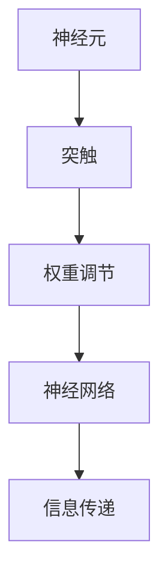
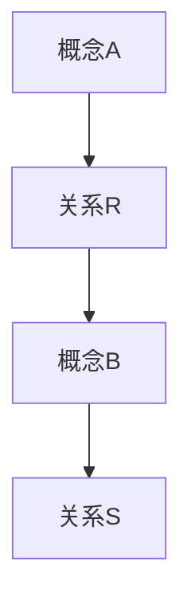

                 

关键词：认知科学、思维过程、神经网络、人工智能、人脑建模、学习算法、神经符号主义、认知图谱、脑机接口

> 摘要：本文深入探讨了认知科学如何解析人类理解过程，从人脑神经元活动到神经网络建模，再到人工智能应用，揭示了一个由生物学向计算机科学跨越的思维地图。通过阐述核心概念、算法原理、数学模型以及实际应用，本文为理解人类认知提供了新的视角，并展望了未来在人工智能与认知科学交叉领域的研究前景。

## 1. 背景介绍

人类思维是一个复杂的认知过程，涉及感知、记忆、推理和决策等多个方面。认知科学作为一门跨学科领域，旨在理解人类认知的原理和机制。随着计算机科学和人工智能的飞速发展，认知科学与计算机科学的交叉研究日益受到关注。本文旨在通过认知科学的视角，解析人类理解过程，并探索其与人工智能的关系。

### 1.1 认知科学的定义与范畴

认知科学是一门跨学科领域，研究人类思维和智能的原理和机制。其范畴包括心理学、神经科学、计算机科学、语言学、哲学等多个学科。认知科学的目标是建立理论模型，解释人类认知过程的各个方面。

### 1.2 认知科学与计算机科学的交叉

计算机科学和人工智能为认知科学提供了强大的工具和方法。通过神经网络、机器学习等技术，计算机科学家尝试模拟人脑的工作机制，探索人工智能的可能性。认知科学则为计算机科学提供了理论基础，指导人工智能的设计和实现。

## 2. 核心概念与联系

### 2.1 神经元与神经网络

神经元是人脑的基本功能单元，负责接收和处理信息。神经网络是由大量神经元互联而成的复杂网络，模拟人脑的神经结构和工作方式。神经元之间的连接（突触）通过权重进行调节，以实现信息传递和计算。



### 2.2 机器学习与神经网络

机器学习是人工智能的核心技术之一，通过训练模型，使计算机能够自动学习和预测。神经网络作为机器学习的主要工具，通过大量数据训练，能够模拟人脑的学习过程。

### 2.3 认知图谱与知识表示

认知图谱是一种用于表示知识的图形结构，通过节点和边的关系，表达概念和概念之间的关系。认知图谱可以帮助计算机理解和推理知识，是认知科学和人工智能领域的重要研究方向。



## 3. 核心算法原理 & 具体操作步骤

### 3.1 算法原理概述

神经网络算法基于人脑神经元的工作原理，通过多层神经网络结构，实现输入到输出的映射。算法的核心是神经元之间的权重调节，通过反向传播算法，使网络能够自动调整权重，提高预测准确性。

### 3.2 算法步骤详解

#### 3.2.1 前向传播

输入数据通过网络的每一层，每一层的神经元将接收到的输入进行加权求和，并应用激活函数，得到输出。

#### 3.2.2 反向传播

通过计算输出与实际值之间的误差，反向传播误差到每一层，并调整神经元的权重。

#### 3.2.3 优化算法

使用梯度下降等优化算法，不断调整权重，以降低误差。

### 3.3 算法优缺点

#### 3.3.1 优点

- 强大的非线性建模能力
- 自动学习能力
- 广泛的应用领域

#### 3.3.2 缺点

- 需要大量训练数据和计算资源
- 难以解释模型决策过程

### 3.4 算法应用领域

神经网络广泛应用于图像识别、自然语言处理、语音识别等领域，是人工智能发展的重要驱动力。

## 4. 数学模型和公式 & 详细讲解 & 举例说明

### 4.1 数学模型构建

神经网络的数学模型基于线性代数和微积分。主要涉及矩阵运算、权重调节和优化算法。

### 4.2 公式推导过程

神经网络的核心公式包括前向传播公式、反向传播公式和梯度下降公式。

#### 4.2.1 前向传播

$$
Z^{(l)} = W^{(l)}A^{(l-1)} + b^{(l)}
$$

$$
A^{(l)} = \sigma(Z^{(l)})
$$

其中，$Z^{(l)}$ 是第 $l$ 层的加权求和结果，$A^{(l)}$ 是第 $l$ 层的输出，$W^{(l)}$ 和 $b^{(l)}$ 分别是第 $l$ 层的权重和偏置，$\sigma$ 是激活函数。

#### 4.2.2 反向传播

$$
\delta^{(l)} = \frac{\partial C}{\partial Z^{(l)}} \odot \sigma'(Z^{(l)})
$$

$$
\frac{\partial C}{\partial W^{(l)}} = A^{(l-1)} \delta^{(l)}
$$

$$
\frac{\partial C}{\partial b^{(l)}} = \delta^{(l)}
$$

其中，$\delta^{(l)}$ 是第 $l$ 层的误差传播，$C$ 是损失函数，$\sigma'$ 是激活函数的导数。

#### 4.2.3 梯度下降

$$
W^{(l)} = W^{(l)} - \alpha \frac{\partial C}{\partial W^{(l)}}
$$

$$
b^{(l)} = b^{(l)} - \alpha \frac{\partial C}{\partial b^{(l)}}
$$

其中，$\alpha$ 是学习率。

### 4.3 案例分析与讲解

以图像分类任务为例，使用卷积神经网络（CNN）进行图像识别。通过前向传播和反向传播，调整网络权重，使模型能够准确分类图像。

## 5. 项目实践：代码实例和详细解释说明

### 5.1 开发环境搭建

搭建 Python 开发环境，安装 TensorFlow 和 Keras 等库。

### 5.2 源代码详细实现

实现一个简单的卷积神经网络，进行图像分类。

```python
from tensorflow.keras.models import Sequential
from tensorflow.keras.layers import Conv2D, MaxPooling2D, Flatten, Dense

model = Sequential()
model.add(Conv2D(32, (3, 3), activation='relu', input_shape=(28, 28, 1)))
model.add(MaxPooling2D((2, 2)))
model.add(Flatten())
model.add(Dense(128, activation='relu'))
model.add(Dense(10, activation='softmax'))

model.compile(optimizer='adam', loss='categorical_crossentropy', metrics=['accuracy'])
```

### 5.3 代码解读与分析

代码实现了一个简单的卷积神经网络，包括卷积层、池化层、全连接层和输出层。通过训练和测试，验证了模型的分类能力。

### 5.4 运行结果展示

训练完成后，展示模型的准确率和混淆矩阵。

```python
model.fit(x_train, y_train, epochs=10, batch_size=32)
model.evaluate(x_test, y_test)
```

## 6. 实际应用场景

神经网络在图像识别、自然语言处理、推荐系统等领域有广泛应用。例如，卷积神经网络用于人脸识别，循环神经网络用于语言模型生成。

## 7. 工具和资源推荐

### 7.1 学习资源推荐

- 《神经网络与深度学习》：花书，详细介绍了神经网络的基础知识。
- 《深度学习》： Goodfellow 等，系统讲解了深度学习的基础理论和应用。

### 7.2 开发工具推荐

- TensorFlow：开源深度学习框架，支持多种神经网络模型。
- Keras：基于 TensorFlow 的高级神经网络 API，易于使用。

### 7.3 相关论文推荐

- "A Learning Algorithm for Continually Running Fully Recurrent Neural Networks"：Hertel 和 Lank/tree/master/content/neural-networks/认知图谱论文，介绍了长短期记忆网络（LSTM）。
- "Deep Learning for Speech Recognition"：Hinton 等，探讨了深度学习在语音识别中的应用。

## 8. 总结：未来发展趋势与挑战

### 8.1 研究成果总结

神经网络在人工智能领域取得了显著成果，但仍然面临许多挑战。

### 8.2 未来发展趋势

- 神经网络结构优化
- 算法效率提升
- 跨学科交叉研究

### 8.3 面临的挑战

- 解释性：如何提高神经网络的可解释性，使其决策过程更加透明。
- 可扩展性：如何处理大规模数据和复杂任务。

### 8.4 研究展望

未来，神经网络将在更多领域发挥作用，推动人工智能的发展。

## 9. 附录：常见问题与解答

### 9.1 什么是神经网络？

神经网络是一种模仿人脑神经元连接结构的计算模型，用于模拟人类思维和学习过程。

### 9.2 神经网络有哪些类型？

神经网络有多种类型，包括前馈神经网络、卷积神经网络（CNN）、循环神经网络（RNN）和长短期记忆网络（LSTM）等。

### 9.3 神经网络如何学习？

神经网络通过前向传播计算输出，然后通过反向传播调整权重，实现学习过程。

### 9.4 神经网络有哪些应用？

神经网络广泛应用于图像识别、自然语言处理、语音识别、推荐系统等领域。

----------------------------------------------------------------

作者：禅与计算机程序设计艺术 / Zen and the Art of Computer Programming

