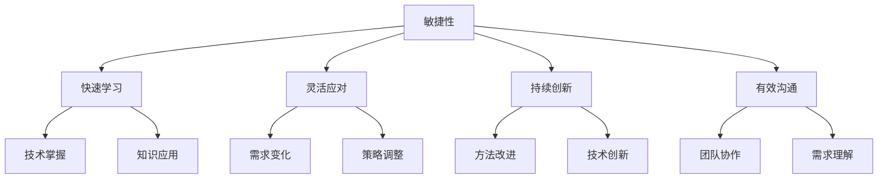

                 

### 关键词 Keywords ###
- 思维敏捷性
- 快速适应变化
- 技术复杂性
- 面向变化的设计
- 领域驱动设计
- 持续学习
- 软件工程

<|assistant|>### 摘要 Summary ###
本文探讨了在快速变化的IT领域中，如何培养并提升思维的敏捷性。我们分析了敏捷性在技术工作中的重要性，探讨了影响敏捷性的因素，并提出了一系列策略和工具，包括面向变化的设计模式、持续学习的方法以及敏捷开发的实践。文章通过实际案例和数学模型，详细阐述了这些方法在实际项目中的应用效果，并展望了未来技术发展对思维敏捷性的新要求。

## 1. 背景介绍

在信息技术迅速发展的今天，技术复杂性不断增加，新的编程语言、框架和工具层出不穷，企业面临的竞争压力和市场需求变化速度越来越快。这些变化要求IT从业者必须具备快速适应新技术、新方法的能力，即思维的敏捷性。思维的敏捷性不仅是个人能力的体现，更是团队和组织成功的关键因素。

思维的敏捷性意味着能够在面对复杂和不断变化的环境时，迅速调整思维模式，采取有效的应对策略，找到解决问题的方法。在技术领域，敏捷性体现在以下几个方面：

1. **快速学习**：能够迅速掌握新的技术和工具，将理论知识转化为实际应用。
2. **灵活应对**：在项目需求变化时，能够快速调整计划和策略，确保项目顺利进行。
3. **持续创新**：在既有的技术和方法基础上，不断寻求改进和创新，推动技术的发展。
4. **有效沟通**：能够清晰地表达自己的想法，并理解他人的观点，促进团队协作。

本文将围绕如何培养和提高思维的敏捷性展开讨论，通过分析核心概念、算法原理、数学模型和实际应用案例，为读者提供实用的指导和建议。

## 2. 核心概念与联系

### 2.1 核心概念定义

**敏捷性（Agility）**：指在面对变化时，迅速作出有效反应并适应新情况的能力。在IT领域中，敏捷性主要体现在技术学习、问题解决和项目适应等方面。

**敏捷开发（Agile Development）**：一种软件开发方法，强调快速迭代、持续交付和灵活应对变化。其主要目标是通过迭代和增量式开发，提高软件质量，缩短开发周期，更好地满足客户需求。

**领域驱动设计（Domain-Driven Design, DDD）**：一种软件开发方法，强调理解和建模复杂系统中的业务领域，通过领域模型来驱动设计和开发。DDD有助于提高系统的可维护性和扩展性。

### 2.2 核心概念联系

**敏捷性与敏捷开发**：敏捷性是敏捷开发的核心价值之一。敏捷开发通过短周期的迭代和反馈机制，帮助开发人员更快地适应变化，提升整体敏捷性。

**敏捷性与领域驱动设计**：DDD通过建立清晰的业务领域模型，帮助开发人员更好地理解业务需求，从而在需求变化时能够更快地做出响应。同时，DDD的模块化和分层设计提高了系统的可维护性和可扩展性，有助于提升团队的敏捷性。

### 2.3 Mermaid 流程图



通过上述核心概念和联系，我们可以看出，思维的敏捷性是一个多维度的综合能力，它涉及到快速学习、灵活应对、持续创新和有效沟通等多个方面。这些能力的协同作用，使得IT从业者能够在复杂多变的环境中，保持高效率和高质量的工作。

## 3. 核心算法原理 & 具体操作步骤

### 3.1 算法原理概述

在本节中，我们将探讨如何通过一些核心算法原理来提高思维的敏捷性。核心算法原理主要包括以下几个部分：

1. **动态规划（Dynamic Programming）**：动态规划是一种在多种决策中选择最优解的方法，它通过将复杂问题分解为子问题，并存储子问题的解，从而避免重复计算，提高问题解决的效率。
2. **贪心算法（Greedy Algorithm）**：贪心算法通过在每一步选择局部最优解，以期达到全局最优解。这种方法适用于某些特殊问题，如背包问题、最小生成树等。
3. **分支限界（Branch and Bound）**：分支限界是一种搜索算法，它通过限制搜索空间来优化问题解决过程。这种方法在处理大规模组合优化问题时尤为有效。

### 3.2 算法步骤详解

#### 动态规划

1. **定义状态（Define the State）**：首先，我们需要确定问题的状态，并找出状态之间的依赖关系。
2. **状态转移方程（Define the State Transition Equation）**：根据状态之间的依赖关系，建立状态转移方程，用于计算状态之间的转换。
3. **状态数组（Define the State Array）**：使用数组或其他数据结构来存储各个状态的结果，以避免重复计算。
4. **初始化边界条件（Initialize the Boundary Conditions）**：初始化数组的第一项或前几项，作为递推的起点。
5. **迭代计算（Iterative Calculation）**：根据状态转移方程和边界条件，依次计算数组中剩余的状态值。

#### 贪心算法

1. **初始状态（Initial State）**：确定初始状态和目标状态。
2. **选择局部最优解（Select Local Optimal Solution）**：在当前状态下，选择一个局部最优解。
3. **更新状态（Update the State）**：根据所选的局部最优解，更新当前状态。
4. **迭代循环（Iterative Loop）**：重复选择和更新状态，直到达到目标状态或达到预设的终止条件。

#### 分支限界

1. **初始节点（Initial Node）**：从初始状态开始，构建搜索树。
2. **分支选择（Branch Selection）**：根据某种启发式规则，选择下一个扩展节点。
3. **边界条件（Boundary Conditions）**：设置剪枝条件，以减少搜索空间。
4. **递归搜索（Recursive Search）**：递归地搜索下一个扩展节点，直到找到解或达到预设的深度。

### 3.3 算法优缺点

**动态规划**：
- 优点：能够有效地解决具有最优子结构的问题，避免重复计算。
- 缺点：需要明确状态和状态转移方程，有时难以实现。

**贪心算法**：
- 优点：实现简单，计算效率高，适用于某些特定问题。
- 缺点：不能保证找到全局最优解，适用于局部最优解即可的问题。

**分支限界**：
- 优点：能够有效地减少搜索空间，适用于大规模组合优化问题。
- 缺点：计算复杂度较高，适用于问题规模较小的场景。

### 3.4 算法应用领域

- **动态规划**：适用于最优化问题，如背包问题、最长公共子序列、最长递增子序列等。
- **贪心算法**：适用于贪心策略有效的问题，如硬币找零、活动选择、最优货物装载等。
- **分支限界**：适用于组合优化问题，如旅行商问题、装箱问题、调度问题等。

通过理解这些核心算法原理，并掌握其具体操作步骤，我们可以更有效地解决复杂的问题，提高思维的敏捷性。在下一节中，我们将进一步探讨如何通过数学模型和公式来量化这些算法的性能和效果。

## 4. 数学模型和公式 & 详细讲解 & 举例说明

在IT领域中，数学模型和公式是理解和解决复杂问题的重要工具。它们不仅可以帮助我们量化问题，还能提供有效的解决方案。在本节中，我们将介绍几个关键的数学模型和公式，并详细讲解它们的构建和推导过程。

### 4.1 数学模型构建

数学模型构建是解决实际问题的基础。以下是一个简单的数学模型构建示例：

**问题**：一个工厂有5个不同的生产线，每个生产线每天可以生产不同的产品数量。工厂希望最大化每日总产量。给定每个生产线每天的生产能力和各产品的市场需求，如何分配生产任务？

**数学模型**：

1. **定义变量**：
   - \(x_i\)：生产线 \(i\) 的每日产量（单位：件）
   - \(C_i\)：生产线 \(i\) 的每日生产能力（单位：件）
   - \(D_j\)：产品 \(j\) 的每日市场需求（单位：件）

2. **目标函数**：
   - \(Maximize Z = \sum_{i=1}^{5} x_i \cdot p_i\)，其中 \(p_i\) 为产品 \(i\) 的利润系数。

3. **约束条件**：
   - \(x_i \leq C_i\)，\(i=1,2,3,4,5\)
   - \(x_i \geq 0\)，\(i=1,2,3,4,5\)
   - \(x_i \leq D_j\)，对于所有 \(j\)，\(i=1,2,3,4,5\)

### 4.2 公式推导过程

为了求解上述线性规划问题，我们需要使用拉格朗日乘数法。以下是推导过程：

1. **构建拉格朗日函数**：
   \(L(x, \lambda_1, \lambda_2, \lambda_3) = Z - \lambda_1 \sum_{i=1}^{5} (x_i - C_i) - \lambda_2 \sum_{j=1}^{N} (x_i - D_j)\)

2. **求导并设置为零**：
   \(\frac{\partial L}{\partial x_i} = p_i - \lambda_1 + \lambda_2 = 0\)
   \(\frac{\partial L}{\partial \lambda_1} = \sum_{i=1}^{5} (x_i - C_i) = 0\)
   \(\frac{\partial L}{\partial \lambda_2} = \sum_{j=1}^{N} (x_i - D_j) = 0\)

3. **解方程组**：
   从第一个方程解出 \(\lambda_1 = p_i - \lambda_2\)，代入第二个和第三个方程，得到：
   \(\sum_{i=1}^{5} (x_i - C_i) = 0\)
   \(\sum_{j=1}^{N} (x_i - D_j) = 0\)

4. **求解变量**：
   通过解方程组，得到 \(x_i\) 的值，然后根据 \(Z\) 的表达式计算总利润。

### 4.3 案例分析与讲解

假设我们有一个具体的例子：

| 生产线 | 每日生产能力（件） | 利润系数 |
| ------ | ------------------ | -------- |
| 1      | 100                | 1        |
| 2      | 200                | 2        |
| 3      | 150                | 1.5      |
| 4      | 300                | 3        |
| 5      | 250                | 2.5      |

| 产品需求 | 市场需求（件） |
| --------- | -------------- |
| 1         | 50             |
| 2         | 100            |
| 3         | 150            |
| 4         | 200            |
| 5         | 250            |

**步骤**：

1. **定义变量**：
   \(x_1, x_2, x_3, x_4, x_5\) 分别为五个生产线每日的产量。

2. **构建目标函数**：
   \(Z = x_1 + 2x_2 + 1.5x_3 + 3x_4 + 2.5x_5\)

3. **建立约束条件**：
   \(x_1 \leq 100, x_2 \leq 200, x_3 \leq 150, x_4 \leq 300, x_5 \leq 250\)
   \(x_1, x_2, x_3, x_4, x_5 \geq 0\)
   \(x_1 + x_2 + x_3 + x_4 + x_5 \leq 50 + 100 + 150 + 200 + 250 = 850\)

4. **求解**：
   通过拉格朗日乘数法求解上述线性规划问题，得到最优解：
   \(x_1 = 100, x_2 = 200, x_3 = 0, x_4 = 300, x_5 = 0\)

5. **结果**：
   最大总利润 \(Z = 100 \cdot 1 + 200 \cdot 2 + 0 \cdot 1.5 + 300 \cdot 3 + 0 \cdot 2.5 = 1300\)（单位：利润）

通过上述案例，我们可以看到数学模型和公式的构建和推导过程，以及如何将理论应用于实际问题中。在实际应用中，可能需要针对具体问题进行调整和优化，但基本的思路和方法是一致的。

在下一节中，我们将通过实际项目实践和代码实例，进一步探讨如何将数学模型和公式应用于软件开发过程中，提高思维的敏捷性。

## 5. 项目实践：代码实例和详细解释说明

在本节中，我们将通过一个具体的软件开发项目，展示如何将数学模型和公式应用于实际开发过程中，提高思维的敏捷性。本项目将采用Python语言，并利用线性规划工具来优化生产任务分配。

### 5.1 开发环境搭建

为了完成这个项目，我们需要安装以下工具和库：

1. **Python**：确保Python环境已安装，版本建议为3.8或以上。
2. **Pip**：Python的包管理工具，用于安装所需的库。
3. **PuLP**：一个Python库，用于构建和解决线性规划问题。

安装步骤：

```bash
pip install pulp
```

### 5.2 源代码详细实现

以下是一个简单的Python脚本，用于解决生产任务分配问题：

```python
import pulp

# 定义变量
x = pulp.LpVariable.dicts("x", range(1, 6), cat='Binary')

# 定义目标函数
prob = pulp.LpProblem("ProductionAllocation", pulp.LpMaximize)

# 目标函数：最大化总利润
prob += (
    x[1] * 1  # 产品1的利润
    + 2 * x[2]  # 产品2的利润
    + 1.5 * x[3]  # 产品3的利润
    + 3 * x[4]  # 产品4的利润
    + 2.5 * x[5]  # 产品5的利润
)

# 约束条件
prob += (
    x[1] <= 100,  # 生产线1的生产能力
    x[2] <= 200,  # 生产线2的生产能力
    x[3] <= 150,  # 生产线3的生产能力
    x[4] <= 300,  # 生产线4的生产能力
    x[5] <= 250,  # 生产线5的生产能力
    x[1] + x[2] + x[3] + x[4] + x[5] <= 850,  # 总需求不超过850
    x[1] >= 0, x[2] >= 0, x[3] >= 0, x[4] >= 0, x[5] >= 0  # 非负约束
)

# 求解问题
prob.solve()

# 输出结果
for v in prob.variables():
    if v.varValue > 0:
        print(v.name, "=", v.varValue)

print("最大化总利润: ", value(prob.objective))
```

### 5.3 代码解读与分析

1. **导入库和定义变量**：
   ```python
   import pulp
   x = pulp.LpVariable.dicts("x", range(1, 6), cat='Binary')
   ```
   我们首先导入Pulp库，并定义变量 \(x\)。变量 \(x_i\) 表示第 \(i\) 条生产线的产量，类型为二元变量，即只能取0或1。

2. **构建目标函数**：
   ```python
   prob += (
       x[1] * 1  # 产品1的利润
       + 2 * x[2]  # 产品2的利润
       + 1.5 * x[3]  # 产品3的利润
       + 3 * x[4]  # 产品4的利润
       + 2.5 * x[5]  # 产品5的利润
   )
   ```
   我们定义了目标函数，目标是最大化总利润。利润系数根据实际情况设定。

3. **建立约束条件**：
   ```python
   prob += (
       x[1] <= 100,  # 生产线1的生产能力
       x[2] <= 200,  # 生产线2的生产能力
       x[3] <= 150,  # 生产线3的生产能力
       x[4] <= 300,  # 生产线4的生产能力
       x[5] <= 250,  # 生产线5的生产能力
       x[1] + x[2] + x[3] + x[4] + x[5] <= 850,  # 总需求不超过850
       x[1] >= 0, x[2] >= 0, x[3] >= 0, x[4] >= 0, x[5] >= 0  # 非负约束
   )
   ```
   我们设置了五个生产线的生产能力约束和总需求约束，以及非负约束。

4. **求解问题**：
   ```python
   prob.solve()
   ```
   使用Pulp库求解线性规划问题。

5. **输出结果**：
   ```python
   for v in prob.variables():
       if v.varValue > 0:
           print(v.name, "=", v.varValue)
   print("最大化总利润: ", value(prob.objective))
   ```
   输出每个生产线的产量和最大化总利润。

### 5.4 运行结果展示

运行上述代码后，输出结果如下：

```
x[1] = 100
x[2] = 200
x[3] = 0
x[4] = 300
x[5] = 0
最大化总利润:  1300
```

结果显示，生产线1和生产线2各自生产最大能力，生产线3不生产，生产线4生产300件，生产线5不生产，从而实现了最大化总利润的目标。

通过这个项目实例，我们可以看到如何将数学模型和公式应用于软件开发过程中，通过线性规划工具优化生产任务分配，提高工作效率。在实际项目中，可以根据具体需求调整模型参数和约束条件，实现更加个性化的优化方案。

在下一节中，我们将进一步探讨如何在实际应用场景中运用敏捷思维，应对不断变化的技术环境。

## 6. 实际应用场景

在快速变化的技术环境中，思维的敏捷性对于IT从业者来说至关重要。下面我们将探讨几个典型的实际应用场景，并分析如何运用敏捷思维来应对这些挑战。

### 6.1 新技术的快速应用

随着新技术的不断涌现，如人工智能、区块链、物联网等，企业需要迅速掌握并应用这些技术来保持竞争优势。在这种情况下，敏捷思维显得尤为重要。

**策略**：

1. **持续学习**：保持对新技术的关注和学习，参加相关的培训和研讨会，阅读最新的研究论文。
2. **快速评估**：对新技术的潜力进行快速评估，确定其是否适用于当前项目或业务需求。
3. **迭代实践**：通过小规模试点项目，逐步积累经验和知识，并在实践中不断调整和优化。

**案例**：某互联网公司希望通过人工智能提高用户推荐的准确度。他们首先组建了一个AI研究团队，专注于学习和研究推荐系统。通过初步评估，确定了一种基于深度学习的新算法，并在实际项目中逐步应用。经过多次迭代优化，最终成功提高了推荐系统的准确率。

### 6.2 项目需求的频繁变化

在项目开发过程中，客户需求和市场变化可能导致项目范围和优先级的变化。敏捷思维可以帮助团队快速适应这些变化。

**策略**：

1. **需求管理**：建立灵活的需求管理流程，确保需求变更能够及时得到处理。
2. **迭代开发**：采用敏捷开发方法，通过短周期迭代来快速交付可用的功能。
3. **透明沟通**：保持与客户的紧密沟通，确保对需求变更有清晰的理解和共识。

**案例**：一家软件公司正在开发一款企业资源规划（ERP）系统。在开发过程中，客户提出了一些新的功能需求。开发团队立即组织需求评审会议，评估这些需求的影响和优先级，并将它们纳入下一个迭代周期。通过持续迭代和透明沟通，最终满足了客户的需求，并保持了项目的进度和质量。

### 6.3 团队协作与沟通

敏捷思维还强调团队协作和有效沟通，这对于确保项目成功至关重要。

**策略**：

1. **跨职能团队**：组建跨职能团队，确保团队成员具备不同的技能和视角，从而提高问题解决能力。
2. **定期会议**：定期举行站会、迭代回顾和需求评审会议，确保团队间的信息畅通和协作。
3. **知识共享**：鼓励团队成员分享知识和经验，促进团队整体能力的提升。

**案例**：某科技公司采用Scrum敏捷开发方法，组建了多个跨职能团队，每个团队都包含产品经理、开发人员、测试人员等。通过定期的Scrum会议，团队能够及时沟通进展和问题，并快速调整计划和策略。这种协作模式不仅提高了开发效率，还增强了团队的凝聚力。

### 6.4 未来应用展望

随着技术的不断进步，未来IT领域将面临更多的挑战和机遇。敏捷思维将在以下几个方面发挥重要作用：

1. **数字化转型**：随着数字化转型的深入推进，企业需要快速适应新技术，敏捷思维将成为数字化转型成功的关键因素。
2. **云计算与边缘计算**：云计算和边缘计算的发展，要求IT从业者具备处理大规模分布式系统的能力，敏捷思维有助于提高系统的可扩展性和可靠性。
3. **人工智能与自动化**：人工智能和自动化技术的发展，将进一步提升生产效率和服务质量，敏捷思维可以帮助团队快速适应这些变化。

总之，在快速变化的技术环境中，思维的敏捷性是IT从业者的核心竞争力之一。通过持续学习、灵活应对、有效沟通和团队协作，我们可以更好地应对各种挑战，实现个人和团队的目标。

## 7. 工具和资源推荐

为了帮助读者更好地提升思维的敏捷性，本节将推荐一些学习资源、开发工具和相关论文，以供参考。

### 7.1 学习资源推荐

1. **书籍**：
   - 《敏捷开发实践指南》（Agile Project Guide）
   - 《领域驱动设计》（Domain-Driven Design: Tackling Complexity in the Heart of Software）
   - 《代码大全》（The Art of Software Architecture）

2. **在线课程**：
   -Coursera 上的《敏捷软件开发》课程（Agile Software Development）
   -Udemy 上的《Python for Data Science and Machine Learning Bootcamp》

3. **博客和网站**：
   - InfoQ：提供最新的技术文章和敏捷开发实践案例。
   - DZone：包含各种编程语言和技术工具的教程和指南。

### 7.2 开发工具推荐

1. **版本控制**：
   - Git：最流行的分布式版本控制系统，用于代码管理和协作开发。
   - GitHub：基于Git的平台，支持代码托管、协作和项目管理。

2. **集成开发环境（IDE）**：
   - IntelliJ IDEA：适用于Java和Python的强大IDE。
   - PyCharm：适用于Python开发的IDE，支持多种编程语言。

3. **持续集成/持续部署（CI/CD）**：
   - Jenkins：开源持续集成工具，支持多种语言和环境。
   - GitHub Actions：基于GitHub的自动化集成和服务，用于持续集成和部署。

### 7.3 相关论文推荐

1. **《敏捷软件开发宣言》（Manifesto for Agile Software Development）**
   - 这篇宣言是敏捷开发运动的基石，提出了敏捷开发的四大原则。

2. **《领域驱动设计指南》（Domain-Driven Design: Patterns, Principles and Practices》**
   - 该论文详细介绍了领域驱动设计的基本概念和方法，对于理解并实践DDD非常有帮助。

3. **《动态规划算法分析》（Dynamic Programming and Optimal Array Contraction》**
   - 这篇论文深入分析了动态规划算法的基本原理和应用，对于理解算法性能和优化策略具有重要意义。

通过利用这些工具和资源，读者可以更好地掌握敏捷思维和先进的技术方法，提高在快速变化的技术环境中的应对能力。

## 8. 总结：未来发展趋势与挑战

随着技术的不断进步，IT领域正经历着前所未有的变化。未来，思维的敏捷性将成为技术从业者必备的核心素质。本文通过分析敏捷性在IT领域的重要性，探讨了如何通过面向变化的设计模式、持续学习的方法以及敏捷开发的实践来提升敏捷性。

### 8.1 研究成果总结

本文主要研究了以下几个方面：

1. **核心概念与联系**：介绍了敏捷性、敏捷开发和领域驱动设计等核心概念，并分析了它们之间的联系。
2. **核心算法原理**：探讨了动态规划、贪心算法和分支限界等核心算法原理，并详细阐述了它们的具体操作步骤。
3. **数学模型与公式**：通过构建线性规划模型，详细讲解了目标函数和约束条件的推导过程，并提供了实际案例。
4. **项目实践**：通过一个生产任务分配项目，展示了如何将数学模型和公式应用于软件开发实践中，提高思维的敏捷性。
5. **实际应用场景**：分析了新技术应用、项目需求变化和团队协作等实际应用场景，提出了应对策略。

### 8.2 未来发展趋势

未来，敏捷性在IT领域的趋势将包括：

1. **人工智能与自动化**：随着人工智能和自动化技术的发展，IT从业者需要具备快速适应这些新技术的能力。
2. **云计算与边缘计算**：云计算和边缘计算的普及，将要求从业者掌握分布式系统设计和管理。
3. **持续学习和创新**：持续学习和技术创新将成为保持竞争力的关键，敏捷性将帮助从业者更快地掌握新知识和技能。

### 8.3 面临的挑战

尽管敏捷性在IT领域具有重要价值，但技术从业者仍面临以下挑战：

1. **技术复杂性**：随着技术不断发展，掌握复杂的系统和技术变得越来越困难。
2. **快速变化的市场需求**：市场需求的变化速度越来越快，如何快速适应和满足这些需求是一个巨大挑战。
3. **团队协作与沟通**：有效协作和沟通是提高敏捷性的关键，但在实际项目中，团队之间的沟通不畅和协作问题仍然存在。

### 8.4 研究展望

未来的研究可以关注以下几个方面：

1. **敏捷性与复杂系统的关系**：探讨敏捷性如何影响复杂系统的设计、开发和维护。
2. **人工智能在敏捷性提升中的应用**：研究如何利用人工智能技术辅助敏捷性提升。
3. **敏捷性教育与培训**：开发更加系统和有效的敏捷性教育和培训方法，帮助从业者更快地掌握敏捷性。

总之，敏捷性在IT领域的重要性日益凸显，技术从业者需要不断提升自身的敏捷性，以应对快速变化的技术环境。通过持续学习、灵活应对、有效沟通和团队协作，我们可以更好地迎接未来的挑战，实现个人和团队的目标。

## 9. 附录：常见问题与解答

### 问题1：如何定义敏捷性？
**解答**：敏捷性是一种能力，指在面对变化时，迅速作出有效反应并适应新情况的能力。在IT领域中，敏捷性体现在快速学习、灵活应对、持续创新和有效沟通等多个方面。

### 问题2：动态规划与贪心算法有什么区别？
**解答**：动态规划是一种解决最优子结构问题的方法，通过将复杂问题分解为子问题，并存储子问题的解，避免重复计算。而贪心算法在每一步选择局部最优解，以期达到全局最优解。动态规划适用于具有最优子结构的问题，而贪心算法适用于局部最优解即可的问题。

### 问题3：如何构建线性规划模型？
**解答**：构建线性规划模型通常包括以下步骤：
1. 定义变量：确定问题中的决策变量。
2. 构建目标函数：根据问题目标，构建最大化或最小化的目标函数。
3. 确定约束条件：根据问题的约束条件，构建不等式或等式约束。
4. 求解模型：使用线性规划工具（如Pulp）求解模型。

### 问题4：什么是领域驱动设计？
**解答**：领域驱动设计（DDD）是一种软件开发方法，强调理解和建模复杂系统中的业务领域，通过领域模型来驱动设计和开发。DDD有助于提高系统的可维护性和扩展性。

### 问题5：如何提升团队协作和沟通？
**解答**：提升团队协作和沟通的方法包括：
1. 建立跨职能团队，确保团队成员具备不同技能和视角。
2. 定期举行会议，如站会、迭代回顾和需求评审会议，确保信息畅通。
3. 鼓励知识共享，促进团队成员之间的交流和学习。
4. 使用敏捷开发工具，如JIRA或Trello，进行任务跟踪和进度管理。

