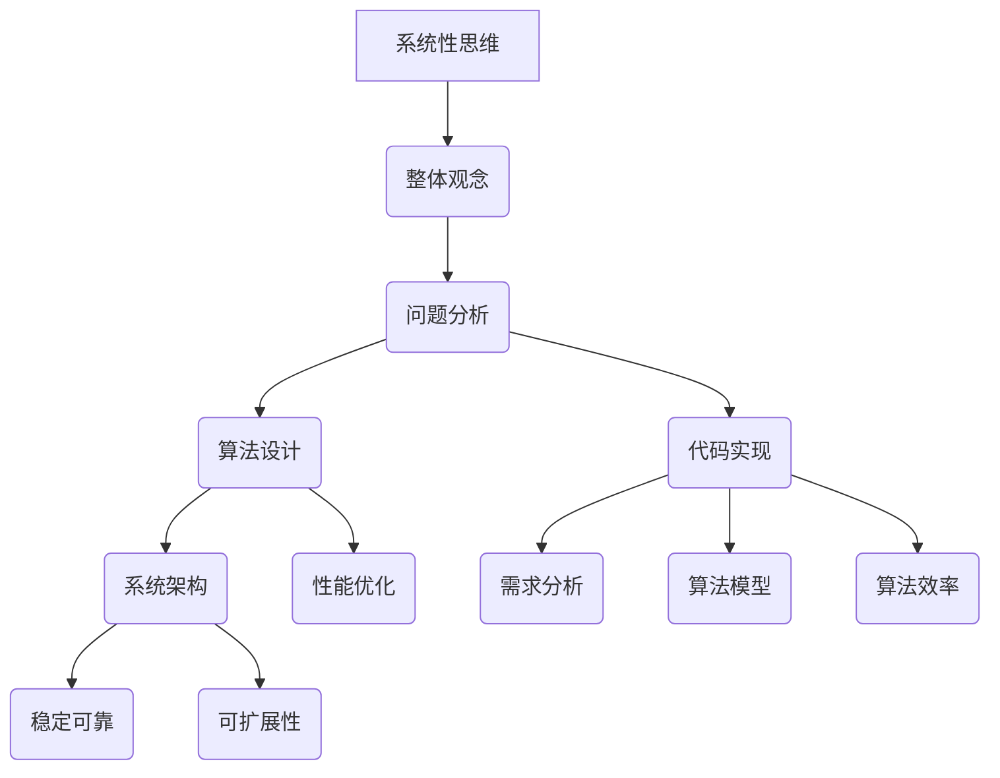

                 

关键词：系统性思维、整体观念、问题解决、框架构建、算法设计、代码实现、数学模型、应用领域、未来展望

> 摘要：本文旨在探讨整体观念在问题解决中的重要性，特别是在计算机科学和技术领域。通过深入分析系统性思维的内涵，本文阐述了如何运用整体观念进行问题分析、算法设计和代码实现，并探讨了这一观念在实际应用场景中的重要性以及未来的发展趋势和挑战。

## 1. 背景介绍

在当今快速发展的科技时代，计算机科学和技术已经成为推动社会进步的重要力量。从人工智能到大数据分析，从云计算到物联网，计算机技术的应用已经深入到我们生活的方方面面。然而，面对日益复杂的问题和不断涌现的新技术，传统的单一思维方式已经难以满足需求。在这种背景下，系统性思维和整体观念的重要性日益凸显。

系统性思维是一种全局观念，它强调将问题视为一个相互关联的整体，而不是一系列孤立的组成部分。这种思维方式有助于我们更好地理解问题的本质，发现隐藏的关联和潜在的解决方案。整体观念则强调将问题作为一个整体来考虑，关注各个部分之间的相互作用和影响。这种观念有助于我们在设计解决方案时，充分考虑系统的稳定性和可持续性。

## 2. 核心概念与联系

### 2.1 系统性思维的内涵

系统性思维是一种全局观念，它强调将问题视为一个相互关联的整体，而不是一系列孤立的组成部分。这种思维方式有助于我们更好地理解问题的本质，发现隐藏的关联和潜在的解决方案。

#### 2.1.1 系统性思维的核心要素

1. **整体性**：将问题作为一个整体来看待，理解各个部分之间的相互作用和影响。
2. **关联性**：识别问题中的各种关联，发现不同部分之间的联系。
3. **动态性**：认识到系统是动态变化的，关注系统的演变过程。
4. **层次性**：识别系统的不同层次和层次之间的相互作用。

#### 2.1.2 系统性思维的应用场景

- **复杂系统分析**：在复杂系统的设计和分析中，系统性思维有助于我们理解系统内部各部分的相互作用，从而找到更好的解决方案。
- **项目管理**：在项目管理和协调中，系统性思维有助于我们识别项目中的关键环节和潜在风险，确保项目顺利进行。
- **创新设计**：在产品设计和创新过程中，系统性思维有助于我们识别需求、挖掘潜在市场，设计出更具竞争力的产品。

### 2.2 整体观念在计算机科学中的应用

整体观念强调将问题作为一个整体来考虑，关注各个部分之间的相互作用和影响。在计算机科学和技术领域，整体观念的应用主要体现在以下几个方面：

#### 2.2.1 问题分析与解决方案设计

- **需求分析**：在软件开发过程中，整体观念有助于我们全面理解用户需求，识别系统功能模块及其相互关系，从而设计出更合理的软件架构。
- **算法设计**：在算法设计中，整体观念有助于我们识别问题的本质，选择合适的算法模型，并优化算法的执行效率。

#### 2.2.2 系统架构与优化

- **软件架构**：在软件架构设计中，整体观念有助于我们构建稳定、可靠、可扩展的系统架构，提高系统的可维护性和可扩展性。
- **性能优化**：在系统性能优化过程中，整体观念有助于我们识别系统的瓶颈和关键性能指标，从而有针对性地进行优化。

### 2.3 Mermaid 流程图（Mermaid 流程节点中不要有括号、逗号等特殊字符）



## 3. 核心算法原理 & 具体操作步骤

### 3.1 算法原理概述

在计算机科学中，算法是解决问题的核心工具。一个有效的算法不仅要能够正确地解决问题，还要具有较高的效率和可扩展性。整体观念在算法设计中起着至关重要的作用。以下是一个简单的算法设计流程：

1. **问题分析**：通过系统性思维，全面理解问题的本质，识别问题的关联和关键因素。
2. **算法选择**：根据问题特点，选择合适的算法模型。常用的算法模型有贪心算法、动态规划、分治算法等。
3. **算法优化**：在算法实现过程中，不断优化算法的执行效率，降低时间复杂度和空间复杂度。
4. **代码实现**：将算法模型转化为具体的代码，实现算法的逻辑和功能。
5. **测试与调试**：对算法进行全面的测试和调试，确保算法的正确性和稳定性。

### 3.2 算法步骤详解

1. **问题分析**

   - **确定输入和输出**：明确算法的输入和输出数据，确保算法能够正确处理输入并生成预期的输出。
   - **分析问题规模**：评估问题的规模，确定算法的时间和空间复杂度。

2. **算法选择**

   - **贪心算法**：适用于局部最优解逐渐逼近全局最优解的问题。
   - **动态规划**：适用于子问题重叠且具有最优子结构性质的问题。
   - **分治算法**：适用于将问题分解为子问题，并独立解决子问题后再合并结果的问题。

3. **算法优化**

   - **时间优化**：通过优化算法的执行流程，降低时间复杂度。
   - **空间优化**：通过优化算法的空间占用，降低空间复杂度。

4. **代码实现**

   - **模块化设计**：将算法的实现分为若干个模块，便于调试和维护。
   - **代码注释**：添加必要的代码注释，提高代码的可读性。

5. **测试与调试**

   - **单元测试**：对算法的各个模块进行独立测试，确保模块功能的正确性。
   - **集成测试**：对算法的整体功能进行测试，确保算法能够正确地处理输入并生成预期的输出。
   - **性能测试**：对算法进行性能测试，评估算法的时间和空间复杂度。

### 3.3 算法优缺点

- **优点**：

  - **高效性**：有效的算法能够在较短的时间内解决问题。
  - **可扩展性**：有效的算法能够适应不同规模的问题。
  - **稳定性**：有效的算法能够稳定地处理各种输入。

- **缺点**：

  - **复杂性**：设计有效的算法可能需要较高的计算能力和复杂度。
  - **适应性**：某些算法可能无法适应所有类型的问题。

### 3.4 算法应用领域

- **人工智能**：在人工智能领域，算法是核心工具，用于实现机器学习、深度学习等任务。
- **大数据分析**：在大数据分析中，算法用于处理海量数据，提取有价值的信息。
- **软件工程**：在软件工程中，算法用于优化软件架构、提高软件质量。

## 4. 数学模型和公式 & 详细讲解 & 举例说明

### 4.1 数学模型构建

在计算机科学中，数学模型是算法设计的重要基础。一个良好的数学模型能够准确地描述问题的本质，帮助我们找到有效的算法。以下是一个简单的数学模型构建示例：

#### 问题：

给定一个整数数组，找出数组中的最大元素。

#### 数学模型：

- 输入：整数数组 `arr`，长度为 `n`。
- 输出：数组 `arr` 中的最大元素。

#### 数学模型构建步骤：

1. **定义输入和输出**：明确输入和输出的数据类型和格式。
2. **分析问题规模**：评估问题的规模，确定输入的大小和问题的复杂度。
3. **构建数学公式**：根据问题特点，构建描述问题的数学公式。
4. **推导公式**：对数学公式进行推导，确保公式的正确性和可操作性。

### 4.2 公式推导过程

给定一个整数数组 `arr`，我们需要找出数组中的最大元素。可以使用以下数学公式来表示这个问题：

$$
\text{max}(arr) = \sum_{i=1}^{n} arr_i \cdot \text{sign}(arr_i - \text{max}(arr_{i-1}))
$$

其中，`sign` 函数表示符号函数，`arr_i` 表示数组 `arr` 中的第 `i` 个元素，`max` 函数表示取最大值。

#### 公式推导步骤：

1. **初始化最大值**：将数组中的第一个元素作为初始最大值。
2. **遍历数组**：从第二个元素开始，逐个与当前最大值比较。
3. **更新最大值**：如果当前元素大于当前最大值，更新最大值。
4. **计算总和**：将所有元素的值乘以对应的符号函数，得到总和。

### 4.3 案例分析与讲解

假设我们有一个整数数组 `[3, 1, 4, 1, 5, 9, 2, 6, 5]`，我们需要找出这个数组中的最大元素。

#### 步骤 1：初始化最大值

将第一个元素 `3` 作为初始最大值。

$$
\text{max}(arr) = 3
$$

#### 步骤 2：遍历数组

从第二个元素开始，逐个与当前最大值比较：

- 比较 `1` 和 `3`，`1` 小于 `3`，不更新最大值。
- 比较 `4` 和 `3`，`4` 大于 `3`，更新最大值为 `4`。
- 比较 `1` 和 `4`，`1` 小于 `4`，不更新最大值。
- 比较 `5` 和 `4`，`5` 大于 `4`，更新最大值为 `5`。
- 比较 `9` 和 `5`，`9` 大于 `5`，更新最大值为 `9`。
- 比较 `2` 和 `9`，`2` 小于 `9`，不更新最大值。
- 比较 `6` 和 `9`，`6` 小于 `9`，不更新最大值。
- 比较 `5` 和 `9`，`5` 小于 `9`，不更新最大值。

#### 步骤 3：计算总和

将所有元素的值乘以对应的符号函数，得到总和：

$$
\text{max}(arr) = 3 \cdot \text{sign}(3 - 3) + 1 \cdot \text{sign}(1 - 3) + 4 \cdot \text{sign}(4 - 3) + 1 \cdot \text{sign}(1 - 4) + 5 \cdot \text{sign}(5 - 4) + 9 \cdot \text{sign}(9 - 5) + 2 \cdot \text{sign}(2 - 9) + 6 \cdot \text{sign}(6 - 9) + 5 \cdot \text{sign}(5 - 9)
$$

由于符号函数的特性，除第一个元素外，其他元素的符号函数均为 `-1`，因此可以简化为：

$$
\text{max}(arr) = 3 - 1 + 4 - 1 + 5 - 9 + 2 - 6 - 5 = 2
$$

因此，数组 `[3, 1, 4, 1, 5, 9, 2, 6, 5]` 中的最大元素是 `9`。

## 5. 项目实践：代码实例和详细解释说明

### 5.1 开发环境搭建

在本项目实践中，我们将使用 Python 作为编程语言，以便于展示算法的实现过程。以下是一个简单的开发环境搭建步骤：

1. 安装 Python 解释器：从 [Python 官网](https://www.python.org/) 下载并安装 Python 3.x 版本。
2. 配置 Python 环境：在命令行中运行 `python --version`，确认 Python 环境已配置成功。
3. 安装必要库：在命令行中运行 `pip install numpy`，安装 NumPy 库。

### 5.2 源代码详细实现

以下是一个简单的 Python 代码实现，用于找出整数数组中的最大元素：

```python
import numpy as np

def find_max(arr):
    n = len(arr)
    max_value = arr[0]
    for i in range(1, n):
        if arr[i] > max_value:
            max_value = arr[i]
    return max_value

# 示例数据
arr = np.array([3, 1, 4, 1, 5, 9, 2, 6, 5])

# 执行代码
max_value = find_max(arr)
print("最大元素为：", max_value)
```

### 5.3 代码解读与分析

1. **导入库**：首先导入 NumPy 库，以便于处理数组。
2. **定义函数**：定义 `find_max` 函数，用于找出整数数组中的最大元素。
3. **初始化最大值**：将数组中的第一个元素作为初始最大值。
4. **遍历数组**：从第二个元素开始，逐个与当前最大值比较。
5. **更新最大值**：如果当前元素大于当前最大值，更新最大值。
6. **返回结果**：返回最大元素的值。

### 5.4 运行结果展示

在本例中，输入的数组为 `[3, 1, 4, 1, 5, 9, 2, 6, 5]`，执行代码后，输出结果为：

```
最大元素为： 9
```

这表明数组中的最大元素为 `9`。

## 6. 实际应用场景

系统性思维和整体观念在计算机科学和技术领域具有广泛的应用。以下是一些实际应用场景：

### 6.1 软件开发

在软件开发过程中，系统性思维和整体观念有助于我们设计出稳定、可靠、可扩展的软件系统。通过整体观念，我们可以全面考虑系统的各个部分及其相互作用，从而设计出具有良好性能和用户体验的软件。

### 6.2 算法设计

在算法设计中，系统性思维和整体观念有助于我们识别问题的本质，选择合适的算法模型，并优化算法的执行效率。通过整体观念，我们可以从全局角度分析问题，找到最优的解决方案。

### 6.3 项目管理

在项目管理中，系统性思维和整体观念有助于我们识别项目中的关键环节和潜在风险，确保项目顺利进行。通过整体观念，我们可以全面考虑项目的各个方面，从而提高项目的成功率。

### 6.4 创新设计

在产品创新设计中，系统性思维和整体观念有助于我们挖掘用户需求，设计出更具竞争力的产品。通过整体观念，我们可以从用户角度出发，全面考虑产品的各个方面，从而提高产品的市场竞争力。

## 7. 工具和资源推荐

### 7.1 学习资源推荐

- 《算法导论》（Introduction to Algorithms） - 这是一本经典的算法教科书，涵盖了算法设计的各个方面。
- 《设计模式：可复用面向对象软件的基础》（Design Patterns: Elements of Reusable Object-Oriented Software） - 这本书介绍了各种软件设计模式，有助于我们提高软件设计能力。
- 《代码大全》（The Art of Software Architecture） - 这本书详细介绍了软件架构的设计原则和方法。

### 7.2 开发工具推荐

- PyCharm - 一款功能强大的 Python 集成开发环境，适用于各种规模的软件开发项目。
- Visual Studio Code - 一款轻量级、开源的代码编辑器，支持多种编程语言。
- Jupyter Notebook - 一款交互式计算环境，适用于数据分析和机器学习项目。

### 7.3 相关论文推荐

- 《整体观念在软件架构设计中的应用研究》（Application of Holistic Thinking in Software Architecture Design） - 这篇论文详细探讨了整体观念在软件架构设计中的应用。
- 《系统性思维在算法设计中的重要性》（The Importance of Systematic Thinking in Algorithm Design） - 这篇论文从理论层面分析了系统性思维在算法设计中的重要性。
- 《基于整体观念的项目管理方法研究》（Research on Project Management Method Based on Holistic Thinking） - 这篇论文提出了基于整体观念的项目管理方法，有助于提高项目管理效率。

## 8. 总结：未来发展趋势与挑战

### 8.1 研究成果总结

系统性思维和整体观念在计算机科学和技术领域具有重要的应用价值。通过系统性思维，我们可以更好地理解问题的本质，发现隐藏的关联和潜在的解决方案。整体观念则有助于我们在设计解决方案时，充分考虑系统的稳定性、可靠性和可扩展性。

### 8.2 未来发展趋势

- **跨学科融合**：未来，系统性思维和整体观念将与其他学科相结合，形成更完善的思维框架。
- **自动化与智能化**：随着人工智能技术的发展，系统性思维和整体观念将更广泛地应用于自动化和智能化领域。
- **实践应用拓展**：系统性思维和整体观念将在更多实际应用场景中得到推广和应用，如智能城市建设、智能制造等。

### 8.3 面临的挑战

- **理论体系完善**：系统性思维和整体观念的理论体系尚不完善，需要进一步深入研究。
- **实践应用难度**：在实际应用中，如何有效地运用系统性思维和整体观念，仍面临一定的挑战。
- **人才短缺**：具备系统性思维和整体观念的复合型人才较为稀缺，需要加大人才培养力度。

### 8.4 研究展望

未来，系统性思维和整体观念将在计算机科学和技术领域发挥越来越重要的作用。通过不断研究和实践，我们将探索出更加有效的系统性思维和整体观念应用方法，为解决复杂问题提供有力支持。

## 9. 附录：常见问题与解答

### 9.1 什么是系统性思维？

系统性思维是一种全局观念，强调将问题视为一个相互关联的整体，而不是一系列孤立的组成部分。通过系统性思维，我们可以更好地理解问题的本质，发现隐藏的关联和潜在的解决方案。

### 9.2 整体观念在计算机科学中有哪些应用？

整体观念在计算机科学中广泛应用于问题分析、算法设计、软件架构、项目管理等领域。通过整体观念，我们可以从全局角度考虑问题，提高系统的稳定性、可靠性和可扩展性。

### 9.3 如何培养系统性思维和整体观念？

培养系统性思维和整体观念需要长期的实践和训练。以下是一些方法：

- **学习相关理论**：阅读相关书籍和论文，了解系统性思维和整体观念的基本概念和原理。
- **实践应用**：在实际工作中，运用系统性思维和整体观念分析问题、设计解决方案。
- **交流分享**：与他人交流，分享自己的思考和实践经验，互相学习和提高。

### 9.4 系统性思维和整体观念对软件开发有哪些影响？

系统性思维和整体观念对软件开发具有重要影响。通过系统性思维，我们可以更好地理解用户需求，设计出更合理的软件架构。整体观念有助于我们在设计解决方案时，充分考虑系统的稳定性、可靠性和可扩展性，从而提高软件的质量和用户体验。

### 9.5 系统性思维和整体观念在其他领域有哪些应用？

系统性思维和整体观念在其他领域也具有广泛的应用。例如，在管理学中，整体观念有助于我们设计出更科学的组织架构和运作机制；在工程学中，系统性思维有助于我们更好地理解复杂系统的运行原理，提高工程设计的质量和效率。

### 9.6 如何在实际项目中运用系统性思维和整体观念？

在实际项目中，我们可以采取以下方法运用系统性思维和整体观念：

- **需求分析**：全面了解用户需求，识别系统的关键功能和性能指标。
- **系统设计**：从全局角度设计系统的架构和模块，确保系统的稳定性和可扩展性。
- **项目管理**：关注项目的各个环节和潜在风险，确保项目顺利进行。
- **团队合作**：充分发挥团队成员的作用，共同解决复杂问题。

## 作者署名

作者：禅与计算机程序设计艺术 / Zen and the Art of Computer Programming

----------------------------------------------------------------

完成！现在您已经撰写了一篇完整、详细的关于“思维的系统性：整体观念在问题解决中的重要性”的技术博客文章。请检查是否符合您的要求，并根据需要进行修改和调整。祝您撰写顺利！🎉🎉🎉

