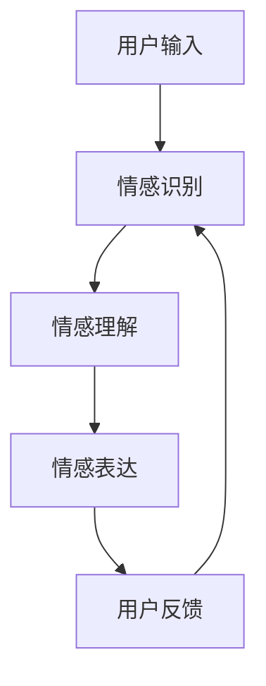

                 

关键词：情感AI、人机共生、情感互动、认知计算、AI伦理

> 摘要：随着人工智能技术的快速发展，情感AI已成为研究热点。本文从认知计算和人机共生理论出发，探讨了情感AI的发展现状、核心概念及其在人机情感互动中的应用，提出了人机情感互动新范式，为未来情感AI研究和应用提供了新思路。

## 1. 背景介绍

随着信息技术的不断进步，人工智能（AI）已经渗透到我们生活的方方面面。从最初的简单任务执行到现在的复杂决策支持，AI技术展现出了强大的能力。然而，传统的AI系统主要关注逻辑推理和数据分析，对于人类情感的理解和模拟仍存在很大的局限性。情感是人类行为和心理的重要组成部分，直接影响着人们的决策、互动和幸福感。因此，研究如何使AI系统具备情感认知和表达的能力，实现人机情感互动，已成为当前人工智能领域的一个重要研究方向。

### 1.1 情感AI的定义

情感AI是指通过模拟、理解、识别和表达人类情感的技术。它不仅关注情感的计算模型，还包括如何将情感嵌入到AI系统中，使其能够与人类进行情感交流。情感AI的目标是提高人机交互的自然性和有效性，使AI系统能够更好地满足人类需求，提升生活质量。

### 1.2 人机共生理论

人机共生理论是指人类与人工智能系统之间形成的一种相互依存、共同进化的关系。在这种关系中，人类和AI系统各自发挥优势，相互补充，共同创造更高效、更智能的解决方案。人机共生理论为情感AI的发展提供了理论依据，使情感AI不仅仅是技术的创新，更是社会发展的需求。

## 2. 核心概念与联系

### 2.1 情感认知模型

情感认知模型是情感AI的核心概念之一，它涉及如何模拟人类情感认知过程，包括情感识别、情感理解和情感表达。情感认知模型通常包括以下几个组成部分：

1. **情感识别**：通过面部表情、声音、文本等信号识别情感。
2. **情感理解**：理解情感背后的含义和情感之间的关系。
3. **情感表达**：通过语言、动作等方式表达情感。

### 2.2 人机情感互动架构

人机情感互动架构是指实现人机情感互动的技术体系。它包括以下几个关键组件：

1. **情感AI模型**：负责情感识别、理解和表达。
2. **人机交互界面**：用于接收人类输入和展示AI情感输出的界面。
3. **情感反馈机制**：用于评估和优化AI情感表现。

### 2.3 Mermaid流程图

以下是一个简化的情感AI与人机情感互动的Mermaid流程图：



## 3. 核心算法原理 & 具体操作步骤

### 3.1 算法原理概述

情感AI的核心算法主要包括情感识别、情感理解和情感表达三个部分。情感识别算法通常基于机器学习技术，通过训练模型识别情感信号。情感理解算法则关注情感之间的关联和情感背后的意图。情感表达算法通过生成相应的语言或动作来模拟情感。

### 3.2 算法步骤详解

1. **情感识别**：
   - 收集情感数据（如面部表情、声音、文本）。
   - 特征提取（如面部特征点、声波频率、文本情感词典）。
   - 模型训练（如卷积神经网络、循环神经网络）。

2. **情感理解**：
   - 情感分类（将情感分为基本情感，如喜、怒、哀、乐）。
   - 情感关联（分析情感之间的关联，如愤怒可能导致沮丧）。
   - 情感意图识别（理解情感背后的意图，如用户需求）。

3. **情感表达**：
   - 语言生成（生成符合情感的文本）。
   - 动作生成（生成符合情感的肢体动作）。

### 3.3 算法优缺点

- **优点**：提高了人机交互的自然性和情感丰富度，有助于提升用户体验。
- **缺点**：情感认知模型复杂，训练成本高；情感理解存在一定的局限性。

### 3.4 算法应用领域

- **智能家居**：通过识别用户情感，提供个性化服务。
- **健康医疗**：监测用户情感状态，辅助诊断和治疗。
- **教育培训**：根据学生情感状态调整教学策略。

## 4. 数学模型和公式 & 详细讲解 & 举例说明

### 4.1 数学模型构建

情感AI的数学模型通常基于机器学习技术，包括以下几个部分：

1. **特征提取模型**：
   - **特征提取公式**：$$ f(x) = W \cdot x + b $$
   - **参数**：$W$为权重矩阵，$x$为输入特征，$b$为偏置。

2. **分类模型**：
   - **损失函数**：$$ J(\theta) = -\frac{1}{m} \sum_{i=1}^{m} [y^{(i)} \cdot \log(h_{\theta}(x^{(i)})) + (1 - y^{(i)}) \cdot \log(1 - h_{\theta}(x^{(i)}))] $$
   - **参数**：$y^{(i)}$为真实标签，$h_{\theta}(x^{(i)})$为模型输出。

### 4.2 公式推导过程

- **特征提取公式推导**：通过对数据进行线性变换，提取出有代表性的特征。

- **分类模型推导**：基于对数损失函数，优化模型参数，使模型输出与真实标签更加接近。

### 4.3 案例分析与讲解

以一个简单的情感识别任务为例，假设我们使用神经网络模型来识别用户的面部表情，具体步骤如下：

1. **数据收集**：收集用户的面部表情图像，每张图像标注对应的情感标签（如喜、怒、哀、乐）。

2. **特征提取**：对图像进行预处理，提取面部特征点，构建特征向量。

3. **模型训练**：使用训练集数据训练神经网络模型，优化模型参数。

4. **模型评估**：使用测试集数据评估模型性能，调整模型参数。

5. **情感识别**：对新的面部表情图像进行情感识别，输出情感标签。

## 5. 项目实践：代码实例和详细解释说明

### 5.1 开发环境搭建

- **Python环境**：安装Python 3.8及以上版本。
- **库依赖**：安装TensorFlow、Keras等库。

### 5.2 源代码详细实现

以下是一个简单的情感识别模型的实现示例：

```python
import tensorflow as tf
from tensorflow.keras.models import Sequential
from tensorflow.keras.layers import Dense, Conv2D, Flatten

# 数据预处理
def preprocess_data(images, labels):
    # 对图像进行归一化处理
    images = images / 255.0
    # 对标签进行独热编码
    labels = tf.keras.utils.to_categorical(labels)
    return images, labels

# 构建模型
model = Sequential([
    Conv2D(32, (3, 3), activation='relu', input_shape=(64, 64, 3)),
    Flatten(),
    Dense(128, activation='relu'),
    Dense(4, activation='softmax')
])

# 编译模型
model.compile(optimizer='adam', loss='categorical_crossentropy', metrics=['accuracy'])

# 训练模型
model.fit(x_train, y_train, epochs=10, batch_size=32, validation_data=(x_val, y_val))

# 情感识别
def recognize_emotion(image):
    preprocessed_image = preprocess_data(image, [])
    prediction = model.predict(preprocessed_image)
    emotion = tf.argmax(prediction).numpy()
    return emotion

# 测试
test_image = load_image('test_image.jpg')
emotion = recognize_emotion(test_image)
print('识别到的情感：', emotion)
```

### 5.3 代码解读与分析

- **数据预处理**：对图像进行归一化和标签独热编码，使模型更容易训练。
- **模型构建**：使用卷积神经网络进行特征提取和分类。
- **模型训练**：使用训练集数据训练模型，优化模型参数。
- **情感识别**：对新的图像进行预处理后，使用训练好的模型进行情感识别。

## 6. 实际应用场景

### 6.1 智能客服

智能客服系统通过情感AI技术，可以更准确地识别用户情绪，提供个性化的服务，提高用户满意度。

### 6.2 心理健康

心理健康应用可以通过情感AI监测用户情感状态，提供针对性的心理干预和支持。

### 6.3 教育领域

教育系统可以通过情感AI了解学生学习状态，调整教学策略，提高教学质量。

## 7. 工具和资源推荐

### 7.1 学习资源推荐

- 《深度学习》（Goodfellow et al.）
- 《神经网络与深度学习》（邱锡鹏）

### 7.2 开发工具推荐

- TensorFlow
- Keras

### 7.3 相关论文推荐

- "Emotion Recognition in Human-Computer Interaction"
- "A Survey on Emotion Recognition in Multimedia"

## 8. 总结：未来发展趋势与挑战

### 8.1 研究成果总结

情感AI技术取得了显著的进展，已在多个领域得到应用。未来，情感AI有望在更多场景中发挥重要作用，提升人机交互体验。

### 8.2 未来发展趋势

- **跨模态情感识别**：结合多种感知信息，提高情感识别准确率。
- **情感理解与推理**：深入理解情感之间的关联和情感意图。

### 8.3 面临的挑战

- **数据隐私与伦理**：如何在保护用户隐私的同时，有效收集和使用情感数据。
- **情感建模的复杂性**：构建准确、泛化的情感认知模型。

### 8.4 研究展望

未来，情感AI技术将在人机共生中发挥更重要的作用，为实现更加智能、人性化的智能系统提供有力支持。

## 9. 附录：常见问题与解答

### 9.1 情感AI与情感认知的区别是什么？

情感AI是指通过技术手段模拟和实现情感认知的能力，而情感认知是人类天生具备的心理过程。情感AI是对人类情感认知的模拟和补充。

### 9.2 情感AI在商业应用中的前景如何？

情感AI在商业应用中具有广泛前景，如智能客服、心理健康、广告投放等。它有助于提升用户体验，提高业务效率和用户满意度。

---

**作者：禅与计算机程序设计艺术 / Zen and the Art of Computer Programming**

