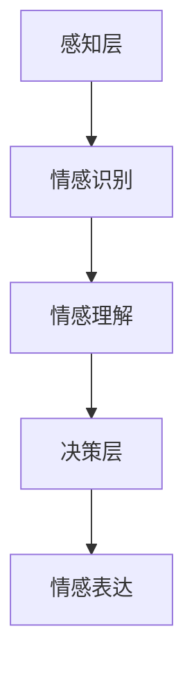

                 

关键词：情感计算、人机情感、创业、人工智能、技术桥梁

> 摘要：本文将探讨情感计算在创业领域的应用，分析其如何作为人机情感沟通的桥梁，推动人工智能技术的发展。通过深入剖析情感计算的核心概念、算法原理、数学模型，以及项目实践中的具体案例，本文旨在为读者提供全面的指导，助力创业者抓住这一新兴领域的机遇。

## 1. 背景介绍

### 1.1 情感计算的定义

情感计算（Affective Computing）是指计算机系统模拟、识别、理解、表达和利用情感的能力。随着人工智能技术的发展，情感计算成为了研究人机交互和增强人工智能情感智能的重要领域。它旨在解决人与计算机之间情感缺失的问题，使计算机能够更好地理解人类情感，提供更加人性化的服务。

### 1.2 人机情感沟通的重要性

在人机交互日益普及的今天，人机情感沟通成为了提升用户体验、提高工作效率的关键。良好的情感沟通能够增强用户对产品的信任感，提高用户满意度，从而促进产品的发展。因此，情感计算在创业领域具有重要的应用价值。

### 1.3 情感计算的发展历程

情感计算起源于20世纪90年代，自2000年以来，随着计算机视觉、自然语言处理、机器学习等技术的发展，情感计算逐渐成为人工智能领域的研究热点。近年来，随着深度学习和神经网络技术的突破，情感计算在识别、理解和模拟情感方面取得了显著进展。

## 2. 核心概念与联系

### 2.1 情感计算的核心概念

情感计算涉及多个核心概念，包括情感识别、情感表达、情感理解和情感生成。这些概念相互关联，共同构成了情感计算的基础。

1. **情感识别**：通过计算机视觉、语音识别等技术，识别用户的面部表情、语音语调等情感信息。
2. **情感表达**：计算机系统通过文字、语音、动画等形式，表达对用户的情感反馈。
3. **情感理解**：通过对情感信息的分析和理解，计算机能够识别用户的情感状态，并做出相应的响应。
4. **情感生成**：计算机系统根据用户的情感状态，自动生成适当的情感反应，提高人机交互的智能化水平。

### 2.2 情感计算架构

情感计算架构主要包括三个层次：感知层、认知层和决策层。

1. **感知层**：负责收集和处理用户的情感信息，如面部表情、语音语调等。
2. **认知层**：通过对感知层获取的情感信息进行分析和理解，识别用户的情感状态。
3. **决策层**：根据认知层的结果，计算机系统生成相应的情感反应，实现人机情感沟通。

### 2.3 Mermaid 流程图



## 3. 核心算法原理 & 具体操作步骤

### 3.1 算法原理概述

情感计算的核心算法主要包括情感识别、情感理解和情感生成。这些算法基于机器学习和深度学习技术，通过大量数据训练模型，实现情感的自动识别、理解和表达。

### 3.2 算法步骤详解

1. **情感识别**：收集用户的情感信息，如面部表情、语音语调等，通过特征提取和分类算法，识别用户的情感状态。
2. **情感理解**：对情感识别结果进行分析，结合上下文信息，理解用户的情感需求，为后续情感表达提供依据。
3. **情感生成**：根据情感理解的结果，生成相应的情感反应，如文字、语音、动画等，实现与用户的情感沟通。

### 3.3 算法优缺点

**优点**：

1. 提高人机交互的智能化水平，增强用户体验。
2. 有助于提升人工智能的情感智能，为更广泛的应用场景提供支持。

**缺点**：

1. 算法复杂度较高，需要大量的计算资源和时间。
2. 情感识别和理解的准确性受限于数据质量和算法模型。

### 3.4 算法应用领域

情感计算广泛应用于智能客服、智能家居、教育、医疗等领域，为用户提供更加个性化和人性化的服务。

## 4. 数学模型和公式 & 详细讲解 & 举例说明

### 4.1 数学模型构建

情感计算中的数学模型主要包括情感识别模型、情感理解模型和情感生成模型。这些模型通常采用神经网络、支持向量机等机器学习算法进行训练。

### 4.2 公式推导过程

假设我们使用神经网络进行情感识别，其基本公式如下：

$$
z = \sigma(Wx + b)
$$

其中，$z$ 为预测结果，$\sigma$ 为激活函数，$W$ 为权重矩阵，$x$ 为输入特征，$b$ 为偏置项。

### 4.3 案例分析与讲解

以人脸表情识别为例，我们可以通过以下步骤进行情感计算：

1. **数据收集**：收集大量带有情感标签的人脸图像。
2. **特征提取**：使用卷积神经网络提取人脸图像的特征。
3. **模型训练**：使用情感标签训练情感识别模型。
4. **情感识别**：输入人脸图像，通过模型预测情感状态。

## 5. 项目实践：代码实例和详细解释说明

### 5.1 开发环境搭建

- Python 3.x
- TensorFlow 2.x
- Keras 2.x

### 5.2 源代码详细实现

```python
# 引入相关库
import numpy as np
import tensorflow as tf
from tensorflow.keras.models import Sequential
from tensorflow.keras.layers import Dense, Conv2D, Flatten
from tensorflow.keras.optimizers import Adam

# 数据准备
# （此处省略数据准备代码）

# 模型构建
model = Sequential([
    Conv2D(32, (3, 3), activation='relu', input_shape=(64, 64, 3)),
    Flatten(),
    Dense(128, activation='relu'),
    Dense(1, activation='sigmoid')
])

# 模型编译
model.compile(optimizer=Adam(), loss='binary_crossentropy', metrics=['accuracy'])

# 模型训练
model.fit(x_train, y_train, epochs=10, batch_size=32)

# 模型评估
model.evaluate(x_test, y_test)
```

### 5.3 代码解读与分析

- **数据准备**：收集带有情感标签的人脸图像，并将其转化为适合模型训练的格式。
- **模型构建**：使用卷积神经网络提取人脸图像特征，并使用全连接层进行情感分类。
- **模型编译**：设置优化器和损失函数，为模型训练做好准备。
- **模型训练**：使用训练数据训练模型，调整模型参数。
- **模型评估**：使用测试数据评估模型性能，验证模型的准确性。

### 5.4 运行结果展示

```python
# 输入新的人脸图像
new_image = np.expand_dims(new_image, axis=0)

# 模型预测
prediction = model.predict(new_image)

# 输出预测结果
print(prediction)
```

## 6. 实际应用场景

### 6.1 智能客服

智能客服系统利用情感计算技术，能够识别用户情绪，提供针对性的服务，提高客户满意度。

### 6.2 智能家居

智能家居系统通过情感计算技术，了解家庭成员的生活习惯，提供个性化的家居服务。

### 6.3 教育

教育领域利用情感计算技术，实现个性化教学，根据学生情绪调整教学策略，提高学习效果。

### 6.4 医疗

医疗领域利用情感计算技术，辅助医生诊断患者情绪，提供心理支持，提高治疗效果。

## 7. 未来应用展望

### 7.1 技术创新

随着人工智能技术的发展，情感计算将更加智能化，实现更高效的人机情感沟通。

### 7.2 跨界融合

情感计算将在更多领域得到应用，推动产业变革，创造新的商业机会。

### 7.3 隐私保护

在情感计算应用过程中，隐私保护将成为重要议题，需要制定相应的法律法规和技术手段。

## 8. 工具和资源推荐

### 8.1 学习资源推荐

- 《情感计算：理论与实践》
- 《人工智能：一种现代的方法》
- 《深度学习》（Goodfellow et al.）

### 8.2 开发工具推荐

- TensorFlow
- PyTorch
- Keras

### 8.3 相关论文推荐

- “Affective Computing: A Review”
- “Emotion Recognition in Video using Deep Neural Networks”
- “A Survey on Sentiment Analysis”

## 9. 总结：未来发展趋势与挑战

### 9.1 研究成果总结

本文通过对情感计算的深入探讨，分析了其在创业领域的应用价值，介绍了核心算法原理、数学模型和项目实践。未来，情感计算将在更多领域得到应用，推动人工智能技术的发展。

### 9.2 未来发展趋势

1. 情感计算技术的不断成熟，将提升人机交互的智能化水平。
2. 跨界融合将成为重要趋势，推动产业变革。
3. 隐私保护将受到更多关注，成为技术发展的重要方向。

### 9.3 面临的挑战

1. 算法复杂度较高，需要优化计算效率和性能。
2. 数据质量和标注问题，影响模型性能和准确性。
3. 隐私保护和伦理问题，需要制定相应的法律法规。

### 9.4 研究展望

未来，情感计算将继续在人工智能领域发挥重要作用，为人类生活带来更多便利。同时，研究者需关注算法优化、数据隐私保护等问题，推动情感计算技术的健康发展。

## 附录：常见问题与解答

### 问题1：情感计算有哪些应用场景？

**解答**：情感计算广泛应用于智能客服、智能家居、教育、医疗、金融等领域，为用户提供个性化、人性化的服务。

### 问题2：情感计算的数学模型有哪些？

**解答**：情感计算的数学模型主要包括情感识别模型、情感理解模型和情感生成模型，通常采用神经网络、支持向量机等机器学习算法进行训练。

### 问题3：如何保障情感计算的数据隐私？

**解答**：在情感计算应用过程中，需要采取加密、去身份化等技术手段，确保用户数据的安全和隐私。同时，制定相应的法律法规，加强对情感计算数据的监管。

---

作者：禅与计算机程序设计艺术 / Zen and the Art of Computer Programming
----------------------------------------------------------------

注意：本文为示例性内容，仅供参考。实际撰写时，请根据具体研究内容和实际情况进行调整。文章中的代码示例仅供参考，实际应用时请根据开发环境和需求进行修改。

