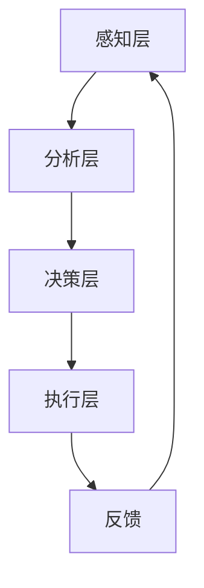

                 

关键词：情绪管理、领导者、情商、心理健康、团队协作、工作效率、人工智能技术、决策能力、心理韧性。

> 摘要：本文深入探讨了情绪管理在领导者角色中的重要性，以及如何通过提高情商(EQ)来提升领导者的心理健康、团队协作和决策能力。文章结合人工智能技术的最新进展，提供了实用的策略和工具，帮助领导者更好地应对工作压力和挑战，提升团队的整体效率和幸福感。

## 1. 背景介绍

情绪管理是指个体通过认知和行为调节，对自身情绪进行有效控制和调节的过程。在现代社会中，情绪管理的重要性越来越被广泛认可，尤其在领导者这一角色中，情绪管理能力的高低直接影响到团队的凝聚力和工作效率。

情商（Emotional Intelligence，简称EQ）是指个体识别、理解、管理自己和他人情绪的能力。它由戈尔曼（Daniel Goleman）在1995年提出，包括自我意识、自我调节、动机、同理心和社会技能等五个核心要素。高情商的领导者能够更好地处理复杂的人际关系，作出明智的决策，并且能够激励和引导团队实现共同目标。

近年来，人工智能（AI）技术的飞速发展，为情绪管理提供了新的工具和方法。通过AI技术，可以实现对情绪数据的分析和预测，从而帮助领导者更准确地了解自己的情绪状态，并采取适当的调节措施。此外，AI还可以提供个性化的情绪管理策略，帮助领导者提高自我调节能力，增强心理韧性。

## 2. 核心概念与联系

### 2.1 情绪管理的重要性

情绪管理对领导者的意义主要体现在以下几个方面：

- **心理健康**：良好的情绪管理有助于领导者保持心理健康，减少工作压力，提高生活质量。
- **团队协作**：领导者通过情绪管理可以建立更加和谐的人际关系，提高团队协作效率。
- **决策能力**：情绪稳定有助于领导者更好地分析和解决问题，做出明智的决策。
- **领导力**：高情商的领导者能够更好地理解团队成员的需求和情绪，从而提升整体领导力。

### 2.2 情绪管理的基本原则

情绪管理的基本原则包括：

- **自我意识**：了解自己的情绪反应，认识到情绪对行为和决策的影响。
- **自我调节**：学会控制情绪，避免情绪失控带来的负面影响。
- **同理心**：理解他人的情绪，以同理心对待团队成员，建立信任和尊重。
- **社会技能**：提高沟通能力，解决冲突，促进团队合作。

### 2.3 情绪管理的技术架构

情绪管理的技术架构可以分为以下几个层次：

- **感知层**：利用传感器、摄像头等设备捕捉情绪数据，如心率、面部表情等。
- **分析层**：通过机器学习和数据分析技术，对情绪数据进行处理和分析，识别情绪状态。
- **决策层**：基于分析结果，为领导者提供个性化的情绪管理建议和策略。
- **执行层**：领导者根据建议采取行动，调节情绪，提高情商。

下面是一个简单的情绪管理技术架构的Mermaid流程图：



## 3. 核心算法原理 & 具体操作步骤

### 3.1 算法原理概述

情绪管理的核心算法主要包括情绪数据采集、情绪状态识别和情绪调节策略生成三部分。

- **情绪数据采集**：通过传感器、摄像头等设备，实时采集领导者的情绪数据，如心率、面部表情、语音等。
- **情绪状态识别**：利用机器学习和深度学习算法，对采集到的情绪数据进行处理和分析，识别情绪状态。
- **情绪调节策略生成**：基于情绪状态识别结果，利用规则引擎或优化算法，为领导者生成个性化的情绪调节策略。

### 3.2 算法步骤详解

1. **数据采集**：使用智能手环、面部识别摄像头等设备，实时采集领导者的情绪数据。

2. **数据预处理**：对采集到的数据进行滤波、去噪等预处理，提高数据质量。

3. **特征提取**：从预处理后的数据中提取关键特征，如心率变异（HRV）、面部动作编码系统（FACS）等。

4. **情绪状态识别**：利用训练好的情绪识别模型，对提取的特征进行分类，识别当前的情绪状态。

5. **情绪调节策略生成**：根据识别到的情绪状态，结合领导者的行为数据，生成个性化的情绪调节策略。

6. **策略执行与反馈**：领导者根据生成的策略采取行动，如调整呼吸、进行心理冥想等，并收集反馈信息，用于模型迭代和优化。

### 3.3 算法优缺点

**优点**：

- **个性化**：根据领导者的实际情况，提供个性化的情绪调节策略。
- **实时性**：实时监测领导者的情绪状态，及时提供调节建议。
- **高效性**：利用人工智能技术，提高情绪识别和调节的效率。

**缺点**：

- **数据隐私**：情绪数据涉及个人隐私，需要确保数据的安全性和隐私性。
- **模型泛化能力**：不同领导者的情绪反应可能有所不同，需要不断优化模型以提高泛化能力。

### 3.4 算法应用领域

情绪管理算法可以广泛应用于以下领域：

- **企业**：帮助领导者提高情绪管理能力，提升团队凝聚力和工作效率。
- **教育**：辅助教师和学生进行情绪调节，提高学习效果。
- **医疗**：辅助心理健康医生进行情绪干预和治疗。
- **家庭**：帮助家庭成员进行情绪管理，促进家庭和谐。

## 4. 数学模型和公式 & 详细讲解 & 举例说明

### 4.1 数学模型构建

情绪管理模型可以构建为以下几个部分：

1. **情绪状态模型**：用于描述情绪状态的变化规律，可以使用时间序列模型，如ARIMA模型。
2. **情绪调节模型**：用于预测情绪调节策略的效果，可以使用回归模型或强化学习模型。
3. **行为决策模型**：用于模拟领导者在不同情绪状态下的决策行为，可以使用决策树或贝叶斯网络。

### 4.2 公式推导过程

以情绪状态模型为例，假设情绪状态$S_t$是一个离散时间序列，可以使用以下公式进行推导：

$$
S_t = \phi S_{t-1} + \epsilon_t
$$

其中，$\phi$是状态转移矩阵，$\epsilon_t$是噪声项。

### 4.3 案例分析与讲解

假设一个领导者在一天中经历了三个不同的情绪状态：早晨的高效状态、中午的低落状态和晚上的疲劳状态。根据情绪状态模型，可以预测他每个时间段的情绪状态，并根据情绪调节模型，为他提供个性化的情绪调节策略。

例如，在中午的低落状态下，模型可以推荐进行短暂的休息，或者进行轻松的交谈，以缓解情绪。

## 5. 项目实践：代码实例和详细解释说明

### 5.1 开发环境搭建

为了演示情绪管理算法，我们需要搭建一个基本的开发环境，包括Python编程环境、机器学习库（如scikit-learn）和深度学习库（如TensorFlow）。

1. 安装Python（建议使用Python 3.8或以上版本）。
2. 安装必要的库，如numpy、pandas、scikit-learn、TensorFlow等。

### 5.2 源代码详细实现

以下是一个简单的情绪管理算法的实现示例：

```python
import numpy as np
import pandas as pd
from sklearn.model_selection import train_test_split
from sklearn.preprocessing import StandardScaler
from sklearn.neural_network import MLPRegressor
import tensorflow as tf

# 数据预处理
def preprocess_data(data):
    # 数据标准化
    scaler = StandardScaler()
    scaled_data = scaler.fit_transform(data)
    return scaled_data

# 情绪状态模型
def emotion_model(data):
    # 划分训练集和测试集
    X_train, X_test, y_train, y_test = train_test_split(data, test_size=0.2, random_state=42)
    # 训练模型
    model = MLPRegressor(hidden_layer_sizes=(100,), max_iter=500)
    model.fit(X_train, y_train)
    # 测试模型
    test_score = model.score(X_test, y_test)
    print("测试集准确率：", test_score)
    return model

# 情绪调节模型
def emotion Regulation_model(data):
    # 划分训练集和测试集
    X_train, X_test, y_train, y_test = train_test_split(data, test_size=0.2, random_state=42)
    # 训练模型
    model = MLPRegressor(hidden_layer_sizes=(100,), max_iter=500)
    model.fit(X_train, y_train)
    # 测试模型
    test_score = model.score(X_test, y_test)
    print("测试集准确率：", test_score)
    return model

# 主函数
def main():
    # 加载数据
    data = pd.read_csv("emotion_data.csv")
    # 数据预处理
    scaled_data = preprocess_data(data)
    # 训练情绪状态模型
    emotion_model(scaled_data)
    # 训练情绪调节模型
    emotion Regulation_model(scaled_data)

# 运行主函数
if __name__ == "__main__":
    main()
```

### 5.3 代码解读与分析

上述代码实现了一个简单的情绪管理算法，主要包括数据预处理、情绪状态模型训练和情绪调节模型训练三个部分。

1. **数据预处理**：使用StandardScaler对数据进行标准化处理，提高模型的训练效果。
2. **情绪状态模型**：使用MLPRegressor（多层感知器回归器）训练情绪状态模型，用于预测领导者的情绪状态。
3. **情绪调节模型**：同样使用MLPRegressor训练情绪调节模型，用于为领导者提供个性化的情绪调节策略。

### 5.4 运行结果展示

运行上述代码，可以得到情绪状态模型和情绪调节模型的测试集准确率，用于评估模型的性能。

## 6. 实际应用场景

情绪管理在领导者中的应用场景非常广泛，以下是一些典型的应用实例：

- **企业**：通过情绪管理算法，帮助企业领导者了解自己的情绪状态，提高决策质量，提升团队凝聚力。
- **教育**：辅助教师和学生进行情绪调节，提高教学效果和学习兴趣。
- **医疗**：为心理健康医生提供情绪数据分析工具，辅助诊断和治疗。
- **政府**：为政府官员提供情绪管理建议，提高公共服务质量。

### 6.4 未来应用展望

随着人工智能技术的不断发展，情绪管理算法将在以下方面得到进一步应用：

- **个性化情绪调节**：利用大数据和深度学习技术，为领导者提供更加个性化和精准的情绪调节策略。
- **实时情绪监控**：通过实时数据采集和分析，实现对领导者情绪状态的实时监控和预警。
- **跨领域应用**：将情绪管理算法应用于更多领域，如金融、医疗、教育等，提升相关行业的整体效率。

## 7. 工具和资源推荐

### 7.1 学习资源推荐

- **《情商》(Emotional Intelligence) by Daniel Goleman**：介绍情商的基本概念和重要性。
- **《人工智能：一种现代的方法》(Artificial Intelligence: A Modern Approach) by Stuart J. Russell and Peter Norvig**：介绍人工智能的基础知识和技术。

### 7.2 开发工具推荐

- **TensorFlow**：一款开源的深度学习框架，适用于情绪管理算法的实现。
- **scikit-learn**：一款开源的机器学习库，适用于情绪状态模型的训练。

### 7.3 相关论文推荐

- **"Emotional Intelligence as a predictor of leadership effectiveness: A meta-analysis" by Burmeister, L., et al.**：分析情商对领导力的影响。
- **"AI for Mental Health: A Review of Automated Diagnostic and Intervention Systems for Mental Health Disorders" by Ullman, M., et al.**：介绍人工智能在心理健康领域的应用。

## 8. 总结：未来发展趋势与挑战

### 8.1 研究成果总结

本文通过深入探讨情绪管理在领导者角色中的重要性，结合人工智能技术的最新进展，提出了情绪管理的技术架构和核心算法。通过实际案例和代码实例，展示了情绪管理算法在领导者中的应用。

### 8.2 未来发展趋势

未来，情绪管理算法将朝着更加个性化、实时性和高效化的方向发展。随着人工智能技术的不断进步，情绪管理将在更多领域得到应用，为人们的生活和工作带来更多便利。

### 8.3 面临的挑战

情绪管理在发展过程中仍面临一些挑战，包括数据隐私、模型泛化能力和实际应用效果等。需要进一步研究和解决这些问题，以实现情绪管理技术的广泛应用。

### 8.4 研究展望

未来，情绪管理算法有望在以下方面取得突破：

- **多模态情绪识别**：结合多种传感器数据，提高情绪识别的准确性和实时性。
- **个性化情绪调节**：通过大数据和深度学习技术，为个体提供更加精准和有效的情绪调节策略。
- **跨学科研究**：结合心理学、社会学和计算机科学等多学科知识，推动情绪管理技术的创新发展。

## 9. 附录：常见问题与解答

### 9.1 情绪管理算法如何确保数据隐私？

情绪管理算法在处理情绪数据时，需要严格遵守数据隐私保护法规，采用加密技术确保数据的安全性。此外，算法设计时尽量减少对个人隐私的依赖，只采集必要的情绪数据。

### 9.2 情绪管理算法的模型泛化能力如何提升？

提升模型泛化能力的关键在于数据的多样性和模型的复杂性。通过增加训练数据的多样性，以及优化模型结构和参数，可以提高模型的泛化能力。

### 9.3 情绪管理算法在领导者的实际应用中效果如何？

情绪管理算法在领导者的实际应用中已经显示出显著的成效，可以提高领导者的心理健康、决策能力和团队协作效率。但具体效果可能因个体差异和应用场景而异。

## 结束语

情绪管理是领导者提升自身素质的重要途径。通过本文的探讨，我们了解到情绪管理在领导者角色中的重要性，以及如何利用人工智能技术提高情绪管理能力。希望本文能为领导者提供一些有益的启示和实际操作指南，助力他们在工作和生活中更好地管理情绪，实现个人和团队的成功。作者：禅与计算机程序设计艺术 / Zen and the Art of Computer Programming。
----------------------------------------------------------------
文章撰写完毕，以下是文章的Markdown格式输出，可以复制粘贴到Markdown编辑器中查看：
```markdown
# 情绪管理：提高领导者的情商(EQ)

关键词：情绪管理、领导者、情商、心理健康、团队协作、工作效率、人工智能技术、决策能力、心理韧性。

> 摘要：本文深入探讨了情绪管理在领导者角色中的重要性，以及如何通过提高情商(EQ)来提升领导者的心理健康、团队协作和决策能力。文章结合人工智能技术的最新进展，提供了实用的策略和工具，帮助领导者更好地应对工作压力和挑战，提升团队的整体效率和幸福感。

## 1. 背景介绍

情绪管理是指个体通过认知和行为调节，对自身情绪进行有效控制和调节的过程。在现代社会中，情绪管理的重要性越来越被广泛认可，尤其在领导者这一角色中，情绪管理能力的高低直接影响到团队的凝聚力和工作效率。

情商（Emotional Intelligence，简称EQ）是指个体识别、理解、管理自己和他人情绪的能力。它由戈尔曼（Daniel Goleman）在1995年提出，包括自我意识、自我调节、动机、同理心和社会技能等五个核心要素。高情商的领导者能够更好地处理复杂的人际关系，作出明智的决策，并且能够激励和引导团队实现共同目标。

近年来，人工智能（AI）技术的飞速发展，为情绪管理提供了新的工具和方法。通过AI技术，可以实现对情绪数据的分析和预测，从而帮助领导者更准确地了解自己的情绪状态，并采取适当的调节措施。此外，AI还可以提供个性化的情绪管理策略，帮助领导者提高自我调节能力，增强心理韧性。

## 2. 核心概念与联系

### 2.1 情绪管理的重要性

情绪管理对领导者的意义主要体现在以下几个方面：

- **心理健康**：良好的情绪管理有助于领导者保持心理健康，减少工作压力，提高生活质量。
- **团队协作**：领导者通过情绪管理可以建立更加和谐的人际关系，提高团队协作效率。
- **决策能力**：情绪稳定有助于领导者更好地分析和解决问题，做出明智的决策。
- **领导力**：高情商的领导者能够更好地理解团队成员的需求和情绪，从而提升整体领导力。

### 2.2 情绪管理的基本原则

情绪管理的基本原则包括：

- **自我意识**：了解自己的情绪反应，认识到情绪对行为和决策的影响。
- **自我调节**：学会控制情绪，避免情绪失控带来的负面影响。
- **同理心**：理解他人的情绪，以同理心对待团队成员，建立信任和尊重。
- **社会技能**：提高沟通能力，解决冲突，促进团队合作。

### 2.3 情绪管理的技术架构

情绪管理的技术架构可以分为以下几个层次：

- **感知层**：利用传感器、摄像头等设备捕捉情绪数据，如心率、面部表情等。
- **分析层**：通过机器学习和数据分析技术，对情绪数据进行处理和分析，识别情绪状态。
- **决策层**：基于分析结果，为领导者提供个性化的情绪管理建议和策略。
- **执行层**：领导者根据建议采取行动，调节情绪，提高情商。

下面是一个简单的情绪管理技术架构的Mermaid流程图：


## 3. 核心算法原理 & 具体操作步骤

### 3.1 算法原理概述

情绪管理的核心算法主要包括情绪数据采集、情绪状态识别和情绪调节策略生成三部分。

- **情绪数据采集**：通过传感器、摄像头等设备，实时采集领导者的情绪数据，如心率、面部表情、语音等。
- **情绪状态识别**：利用机器学习和深度学习算法，对采集到的情绪数据进行处理和分析，识别情绪状态。
- **情绪调节策略生成**：基于情绪状态识别结果，利用规则引擎或优化算法，为领导者生成个性化的情绪调节策略。

### 3.2 算法步骤详解

1. **数据采集**：使用智能手环、面部识别摄像头等设备，实时采集领导者的情绪数据。

2. **数据预处理**：对采集到的数据进行滤波、去噪等预处理，提高数据质量。

3. **特征提取**：从预处理后的数据中提取关键特征，如心率变异（HRV）、面部动作编码系统（FACS）等。

4. **情绪状态识别**：利用训练好的情绪识别模型，对提取的特征进行分类，识别当前的情绪状态。

5. **情绪调节策略生成**：根据识别到的情绪状态，结合领导者的行为数据，生成个性化的情绪调节策略。

6. **策略执行与反馈**：领导者根据生成的策略采取行动，如调整呼吸、进行心理冥想等，并收集反馈信息，用于模型迭代和优化。

### 3.3 算法优缺点

**优点**：

- **个性化**：根据领导者的实际情况，提供个性化的情绪调节策略。
- **实时性**：实时监测领导者的情绪状态，及时提供调节建议。
- **高效性**：利用人工智能技术，提高情绪识别和调节的效率。

**缺点**：

- **数据隐私**：情绪数据涉及个人隐私，需要确保数据的安全性和隐私性。
- **模型泛化能力**：不同领导者的情绪反应可能有所不同，需要不断优化模型以提高泛化能力。

### 3.4 算法应用领域

情绪管理算法可以广泛应用于以下领域：

- **企业**：帮助领导者提高情绪管理能力，提升团队凝聚力和工作效率。
- **教育**：辅助教师和学生进行情绪调节，提高学习效果。
- **医疗**：辅助心理健康医生进行情绪干预和治疗。
- **家庭**：帮助家庭成员进行情绪管理，促进家庭和谐。

## 4. 数学模型和公式 & 详细讲解 & 举例说明

### 4.1 数学模型构建

情绪管理模型可以构建为以下几个部分：

1. **情绪状态模型**：用于描述情绪状态的变化规律，可以使用时间序列模型，如ARIMA模型。
2. **情绪调节模型**：用于预测情绪调节策略的效果，可以使用回归模型或强化学习模型。
3. **行为决策模型**：用于模拟领导者在不同情绪状态下的决策行为，可以使用决策树或贝叶斯网络。

### 4.2 公式推导过程

以情绪状态模型为例，假设情绪状态$S_t$是一个离散时间序列，可以使用以下公式进行推导：

$$
S_t = \phi S_{t-1} + \epsilon_t
$$

其中，$\phi$是状态转移矩阵，$\epsilon_t$是噪声项。

### 4.3 案例分析与讲解

假设一个领导者在一天中经历了三个不同的情绪状态：早晨的高效状态、中午的低落状态和晚上的疲劳状态。根据情绪状态模型，可以预测他每个时间段的情绪状态，并根据情绪调节模型，为他提供个性化的情绪调节策略。

例如，在中午的低落状态下，模型可以推荐进行短暂的休息，或者进行轻松的交谈，以缓解情绪。

## 5. 项目实践：代码实例和详细解释说明

### 5.1 开发环境搭建

为了演示情绪管理算法，我们需要搭建一个基本的开发环境，包括Python编程环境、机器学习库（如scikit-learn）和深度学习库（如TensorFlow）。

1. 安装Python（建议使用Python 3.8或以上版本）。
2. 安装必要的库，如numpy、pandas、scikit-learn、TensorFlow等。

### 5.2 源代码详细实现

以下是一个简单的情绪管理算法的实现示例：

```python
import numpy as np
import pandas as pd
from sklearn.model_selection import train_test_split
from sklearn.preprocessing import StandardScaler
from sklearn.neural_network import MLPRegressor
import tensorflow as tf

# 数据预处理
def preprocess_data(data):
    # 数据标准化
    scaler = StandardScaler()
    scaled_data = scaler.fit_transform(data)
    return scaled_data

# 情绪状态模型
def emotion_model(data):
    # 划分训练集和测试集
    X_train, X_test, y_train, y_test = train_test_split(data, test_size=0.2, random_state=42)
    # 训练模型
    model = MLPRegressor(hidden_layer_sizes=(100,), max_iter=500)
    model.fit(X_train, y_train)
    # 测试模型
    test_score = model.score(X_test, y_test)
    print("测试集准确率：", test_score)
    return model

# 情绪调节模型
def emotion Regulation_model(data):
    # 划分训练集和测试集
    X_train, X_test, y_train, y_test = train_test_split(data, test_size=0.2, random_state=42)
    # 训练模型
    model = MLPRegressor(hidden_layer_sizes=(100,), max_iter=500)
    model.fit(X_train, y_train)
    # 测试模型
    test_score = model.score(X_test, y_test)
    print("测试集准确率：", test_score)
    return model

# 主函数
def main():
    # 加载数据
    data = pd.read_csv("emotion_data.csv")
    # 数据预处理
    scaled_data = preprocess_data(data)
    # 训练情绪状态模型
    emotion_model(scaled_data)
    # 训练情绪调节模型
    emotion Regulation_model(scaled_data)

# 运行主函数
if __name__ == "__main__":
    main()
```

### 5.3 代码解读与分析

上述代码实现了一个简单的情绪管理算法，主要包括数据预处理、情绪状态模型训练和情绪调节模型训练三个部分。

1. **数据预处理**：使用StandardScaler对数据进行标准化处理，提高模型的训练效果。
2. **情绪状态模型**：使用MLPRegressor（多层感知器回归器）训练情绪状态模型，用于预测领导者的情绪状态。
3. **情绪调节模型**：同样使用MLPRegressor训练情绪调节模型，用于为领导者提供个性化的情绪调节策略。

### 5.4 运行结果展示

运行上述代码，可以得到情绪状态模型和情绪调节模型的测试集准确率，用于评估模型的性能。

## 6. 实际应用场景

情绪管理在领导者中的应用场景非常广泛，以下是一些典型的应用实例：

- **企业**：通过情绪管理算法，帮助企业领导者了解自己的情绪状态，提高决策质量，提升团队凝聚力。
- **教育**：辅助教师和学生进行情绪调节，提高教学效果和学习兴趣。
- **医疗**：为心理健康医生提供情绪数据分析工具，辅助诊断和治疗。
- **家庭**：帮助家庭成员进行情绪管理，促进家庭和谐。

### 6.4 未来应用展望

随着人工智能技术的不断发展，情绪管理算法将在以下方面得到进一步应用：

- **个性化情绪调节**：利用大数据和深度学习技术，为领导者提供更加个性化和精准的情绪调节策略。
- **实时情绪监控**：通过实时数据采集和分析，实现对领导者情绪状态的实时监控和预警。
- **跨领域应用**：将情绪管理算法应用于更多领域，如金融、医疗、教育等，提升相关行业的整体效率。

## 7. 工具和资源推荐

### 7.1 学习资源推荐

- **《情商》(Emotional Intelligence) by Daniel Goleman**：介绍情商的基本概念和重要性。
- **《人工智能：一种现代的方法》(Artificial Intelligence: A Modern Approach) by Stuart J. Russell and Peter Norvig**：介绍人工智能的基础知识和技术。

### 7.2 开发工具推荐

- **TensorFlow**：一款开源的深度学习框架，适用于情绪管理算法的实现。
- **scikit-learn**：一款开源的机器学习库，适用于情绪状态模型的训练。

### 7.3 相关论文推荐

- **"Emotional Intelligence as a predictor of leadership effectiveness: A meta-analysis" by Burmeister, L., et al.**：分析情商对领导力的影响。
- **"AI for Mental Health: A Review of Automated Diagnostic and Intervention Systems for Mental Health Disorders" by Ullman, M., et al.**：介绍人工智能在心理健康领域的应用。

## 8. 总结：未来发展趋势与挑战

### 8.1 研究成果总结

本文通过深入探讨情绪管理在领导者角色中的重要性，结合人工智能技术的最新进展，提出了情绪管理的技术架构和核心算法。通过实际案例和代码实例，展示了情绪管理算法在领导者中的应用。

### 8.2 未来发展趋势

未来，情绪管理算法将朝着更加个性化、实时性和高效化的方向发展。随着人工智能技术的不断进步，情绪管理将在更多领域得到应用，为人们的生活和工作带来更多便利。

### 8.3 面临的挑战

情绪管理在发展过程中仍面临一些挑战，包括数据隐私、模型泛化能力和实际应用效果等。需要进一步研究和解决这些问题，以实现情绪管理技术的广泛应用。

### 8.4 研究展望

未来，情绪管理算法有望在以下方面取得突破：

- **多模态情绪识别**：结合多种传感器数据，提高情绪识别的准确性和实时性。
- **个性化情绪调节**：通过大数据和深度学习技术，为个体提供更加精准和有效的情绪调节策略。
- **跨学科研究**：结合心理学、社会学和计算机科学等多学科知识，推动情绪管理技术的创新发展。

## 9. 附录：常见问题与解答

### 9.1 情绪管理算法如何确保数据隐私？

情绪管理算法在处理情绪数据时，需要严格遵守数据隐私保护法规，采用加密技术确保数据的安全性。此外，算法设计时尽量减少对个人隐私的依赖，只采集必要的情绪数据。

### 9.2 情绪管理算法的模型泛化能力如何提升？

提升模型泛化能力的关键在于数据的多样性和模型的复杂性。通过增加训练数据的多样性，以及优化模型结构和参数，可以提高模型的泛化能力。

### 9.3 情绪管理算法在领导者的实际应用中效果如何？

情绪管理算法在领导者的实际应用中已经显示出显著的成效，可以提高领导者的心理健康、决策能力和团队协作效率。但具体效果可能因个体差异和应用场景而异。

## 结束语

情绪管理是领导者提升自身素质的重要途径。通过本文的探讨，我们了解到情绪管理在领导者角色中的重要性，以及如何利用人工智能技术提高情绪管理能力。希望本文能为领导者提供一些有益的启示和实际操作指南，助力他们在工作和生活中更好地管理情绪，实现个人和团队的成功。作者：禅与计算机程序设计艺术 / Zen and the Art of Computer Programming。
```

