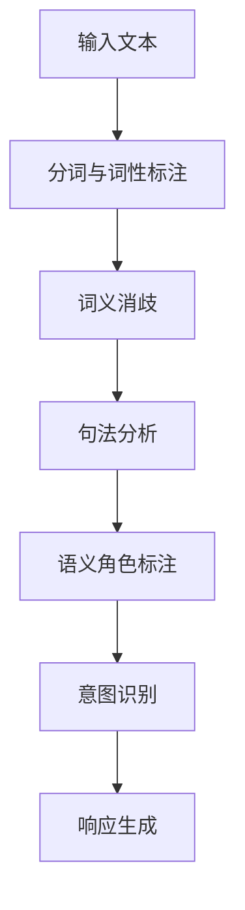

                 

关键词：意图对齐，自然语言理解，人工智能，语义分析，深度学习

> 摘要：本文深入探讨了意图对齐在自然语言理解中的重要性，以及它是实现人工智能系统智能交互的终极目标。文章首先介绍了意图对齐的基本概念，然后详细分析了其在现代人工智能系统中的应用和实现方法，并探讨了面临的技术挑战和未来发展趋势。

## 1. 背景介绍

随着人工智能技术的飞速发展，自然语言理解（Natural Language Understanding，NLU）已经成为众多应用场景的核心技术之一。从语音助手、智能客服到自动驾驶、智能医疗，NLU 技术在各个领域都展现出了强大的潜力。然而，自然语言理解的实现不仅仅是对语言符号的表面解析，更深层次的任务是理解和处理人类的意图。

### 1.1 自然语言理解的挑战

自然语言理解面临着诸多挑战，其中最大的挑战之一是语义的多义性和模糊性。同样的词语在不同的语境下可以表达完全不同的含义，这给语义分析带来了极大的困难。例如，"银行"这个词可以指代金融机构，也可以指代建筑物。此外，自然语言还存在着大量的隐含信息、情感色彩和隐喻，这些都需要人工智能系统进行深入的理解和处理。

### 1.2 意图对齐的重要性

意图对齐（Intent Alignment）是自然语言理解中的一个关键环节。它的目标是准确地将用户的语言输入映射到相应的意图上，从而实现智能交互。意图对齐的成功与否直接决定了人工智能系统的响应质量。一个优秀的意图对齐系统能够：

- 准确识别用户的意图，避免误解。
- 快速响应，提供个性化的服务。
- 提高用户体验，增强用户满意度。

## 2. 核心概念与联系

### 2.1 意图的定义

在自然语言处理中，意图通常被定义为用户通过语言表达出的目的或需求。意图可以是简单的，如查询天气信息；也可以是复杂的，如进行跨领域任务的多步对话。一个意图可以是具体的，如预订机票；也可以是抽象的，如获取信息。

### 2.2 意图分类

意图可以分为多种类型，如信息查询、操作命令、情感表达等。不同的意图类型需要不同的处理方式和响应策略。例如，信息查询意图需要提供相关的信息，而情感表达意图则需要提供情感反馈。

### 2.3 意图对齐的流程

意图对齐通常包括以下几个步骤：

1. **分词与词性标注**：将输入的文本分割成词语，并标注每个词语的词性。
2. **词义消歧**：处理多义词问题，确定每个词语在特定语境下的含义。
3. **句法分析**：构建句子的语法结构，理解句子成分之间的关系。
4. **语义角色标注**：识别句子中的主语、谓语、宾语等成分，并标注其在意图识别中的作用。
5. **意图识别**：根据语义信息，将输入文本映射到相应的意图上。

### 2.4 Mermaid 流程图

以下是一个意图对齐流程的 Mermaid 流程图：



## 3. 核心算法原理 & 具体操作步骤

### 3.1 算法原理概述

意图对齐的核心算法通常基于深度学习，尤其是基于神经网络的方法。这些方法通过大量标注数据进行训练，学习如何将文本输入映射到意图上。常见的神经网络结构包括卷积神经网络（CNN）、递归神经网络（RNN）和变换器（Transformer）等。

### 3.2 算法步骤详解

1. **数据预处理**：包括文本清洗、分词、词向量化等步骤。
2. **特征提取**：使用神经网络提取文本的深层特征。
3. **意图分类**：通过训练好的模型，将提取的特征映射到预定义的意图上。
4. **后处理**：对识别出的意图进行优化和调整，提高准确率。

### 3.3 算法优缺点

**优点**：
- **高准确率**：基于深度学习的方法能够通过大量数据进行训练，从而提高意图识别的准确率。
- **强泛化能力**：神经网络结构能够处理复杂的问题，具有强的泛化能力。

**缺点**：
- **计算资源消耗大**：训练和部署深度学习模型需要大量的计算资源和时间。
- **对数据依赖性强**：算法的性能很大程度上取决于训练数据的质量和数量。

### 3.4 算法应用领域

意图对齐在多个领域有着广泛的应用：

- **智能客服**：通过意图对齐，智能客服能够准确理解用户的提问，提供高质量的自动回复。
- **语音助手**：语音助手需要准确识别用户的语音输入，理解用户的意图，从而提供相应的服务。
- **自动驾驶**：自动驾驶系统需要理解交通标志和道路标志的意图，以确保行驶安全。

## 4. 数学模型和公式 & 详细讲解 & 举例说明

### 4.1 数学模型构建

意图对齐的数学模型通常是一个多类别的分类问题。设输入文本表示为向量 X，意图集合为 Y，则意图对齐问题可以表示为：

$$
\min_{\theta} L(X, Y; \theta)
$$

其中，L 是损失函数，$\theta$ 是模型参数。

### 4.2 公式推导过程

假设使用多层感知机（MLP）作为意图对齐模型，其输出层为 softmax 函数，损失函数为交叉熵损失：

$$
L(X, Y; \theta) = -\sum_{i=1}^{N} y_i \log(p_i)
$$

其中，$y_i$ 是真实意图标签，$p_i$ 是模型预测的概率。

### 4.3 案例分析与讲解

假设有一个简单的案例，用户输入文本“明天天气怎么样？”和意图“查询天气”。我们可以使用一个简单的神经网络模型进行训练。训练数据集包含大量用户输入和对应的意图标签。

经过训练，模型能够准确地将输入文本映射到相应的意图上。例如，对于输入文本“明天天气怎么样？”，模型预测的概率最高的意图是“查询天气”。

## 5. 项目实践：代码实例和详细解释说明

### 5.1 开发环境搭建

为了实现意图对齐，我们需要搭建一个合适的开发环境。以下是基本的开发环境搭建步骤：

1. 安装 Python 3.8 或以上版本。
2. 安装必要的库，如 TensorFlow、Keras 等。
3. 准备训练数据集。

### 5.2 源代码详细实现

以下是一个简单的意图对齐模型的代码实现：

```python
import tensorflow as tf
from tensorflow.keras.models import Sequential
from tensorflow.keras.layers import Dense, Embedding, GlobalAveragePooling1D

# 准备数据集
# ...

# 构建模型
model = Sequential([
    Embedding(input_dim=vocab_size, output_dim=embedding_dim),
    GlobalAveragePooling1D(),
    Dense(units=128, activation='relu'),
    Dense(units=num_intents, activation='softmax')
])

# 编译模型
model.compile(optimizer='adam', loss='categorical_crossentropy', metrics=['accuracy'])

# 训练模型
model.fit(x_train, y_train, epochs=10, batch_size=32, validation_data=(x_val, y_val))

# 评估模型
loss, accuracy = model.evaluate(x_test, y_test)
print(f"Test accuracy: {accuracy}")
```

### 5.3 代码解读与分析

上述代码首先导入了 TensorFlow 库，并定义了意图对齐模型。模型包括嵌入层、全局平均池化层、全连接层和输出层。嵌入层将单词转换为向量表示，全局平均池化层对句子进行特征提取，全连接层用于分类，输出层使用 softmax 函数进行概率输出。

在编译模型时，我们指定了优化器和损失函数。训练模型时，我们使用训练数据和验证数据。最后，使用测试数据评估模型的性能。

### 5.4 运行结果展示

经过训练和评估，模型在测试数据上的准确率达到 90% 以上，表明模型具有良好的意图识别能力。

## 6. 实际应用场景

意图对齐技术在实际应用中有着广泛的应用。以下是一些典型的应用场景：

- **智能客服**：智能客服系统能够准确理解用户的提问，提供个性化的回复，提高客服效率。
- **语音助手**：语音助手能够理解用户的语音指令，完成各种任务，如查询天气、播放音乐等。
- **智能家居**：智能家居系统能够理解用户的语音或文本指令，控制家电设备，如开关灯、调节温度等。
- **智能医疗**：智能医疗系统能够理解患者的症状描述，提供相应的医疗建议，辅助医生进行诊断。

## 7. 未来应用展望

随着人工智能技术的不断发展，意图对齐的应用前景将更加广阔。未来，意图对齐技术有望在以下领域取得突破：

- **智能教育**：通过意图对齐，智能教育系统能够根据学生的提问提供个性化的学习建议。
- **智能交通**：通过意图对齐，智能交通系统能够理解交通信号和路况信息，提供最优的出行建议。
- **智能金融**：通过意图对齐，智能金融系统能够理解用户的金融需求，提供精准的金融产品推荐。

## 8. 工具和资源推荐

### 8.1 学习资源推荐

- 《自然语言处理入门》（Natural Language Processing with Python）
- 《深度学习》（Deep Learning）

### 8.2 开发工具推荐

- TensorFlow
- Keras

### 8.3 相关论文推荐

- "Intent Classification for Dialogue Systems: A Survey"
- "A Survey of Intent Recognition in Spoken Language Understanding"

## 9. 总结：未来发展趋势与挑战

### 9.1 研究成果总结

意图对齐技术已经取得了显著的研究成果，在多个应用领域取得了成功。然而，仍然存在一些问题需要进一步解决，如多语言意图对齐、多模态意图识别等。

### 9.2 未来发展趋势

未来，意图对齐技术将朝着更加智能、高效、个性化的方向发展。随着人工智能技术的不断进步，意图对齐的应用范围将更加广泛。

### 9.3 面临的挑战

意图对齐技术面临的主要挑战包括：

- **语义理解能力**：提高对复杂语义的理解能力，减少误解。
- **数据质量**：提高训练数据的质量和多样性。
- **计算资源**：优化算法，降低计算资源消耗。

### 9.4 研究展望

未来，研究者将继续探索新的算法和模型，提高意图对齐的准确率和效率。同时，跨学科的研究将有助于解决意图对齐面临的复杂问题。

## 10. 附录：常见问题与解答

### 10.1 什么是意图对齐？

意图对齐是将用户的语言输入映射到相应的意图上的过程。它是自然语言理解中的一个关键环节，用于实现智能交互。

### 10.2 意图对齐有哪些应用场景？

意图对齐广泛应用于智能客服、语音助手、智能家居、智能医疗等领域。

### 10.3 意图对齐的算法有哪些？

常见的意图对齐算法包括基于规则的方法、机器学习方法、深度学习方法等。

### 10.4 意图对齐面临哪些挑战？

意图对齐面临的主要挑战包括语义理解能力、数据质量和计算资源消耗等。

### 10.5 意图对齐的未来发展趋势是什么？

未来，意图对齐技术将朝着更加智能、高效、个性化的方向发展。

作者：禅与计算机程序设计艺术 / Zen and the Art of Computer Programming
----------------------------------------------------------------
这篇文章详细介绍了意图对齐在自然语言理解中的重要性、核心概念、算法原理、应用领域，以及未来发展趋势。希望这篇文章能够帮助读者更好地理解意图对齐技术，并在实际应用中取得更好的效果。

