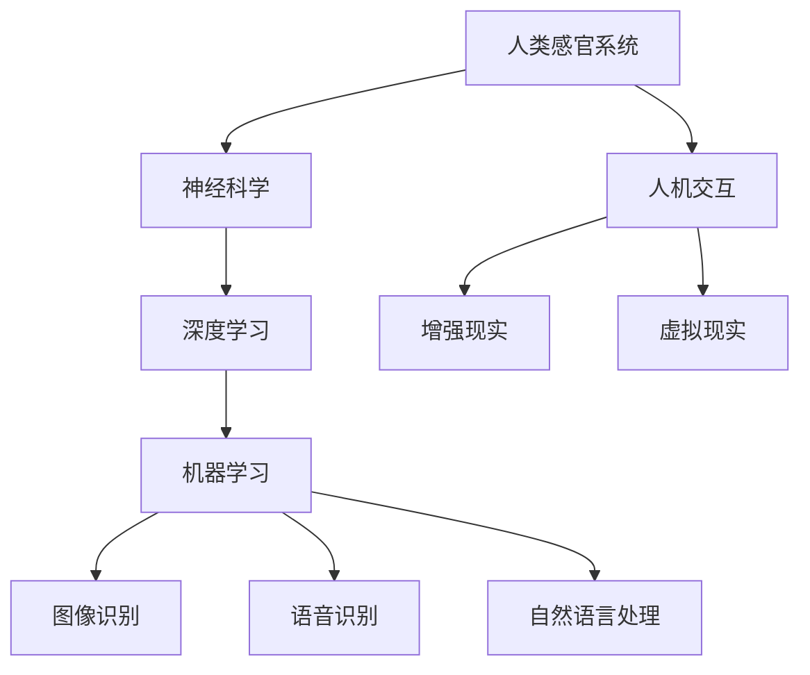

                 

关键词：感官增强、人工智能、人类体验、神经科学、深度学习、人机交互

> 摘要：随着人工智能技术的快速发展，人类感官的增强已经成为了可能。本文将探讨如何将AI技术与人类感官体验相结合，通过深度学习和神经科学的方法，实现视觉、听觉、触觉等感官的增强，并展望未来这一领域的应用前景。

## 1. 背景介绍

在过去的几十年中，人工智能（AI）技术取得了长足的进步，特别是在机器学习和深度学习领域。这些技术的发展不仅推动了计算机科学和工程领域的前进，也为人类感官的增强提供了可能。感官增强是指通过技术手段增强或替代人类感官功能，使其更加敏锐、准确和高效。

人类感官系统是人体与外界环境进行交互的重要途径。然而，人类的感官能力有限，很难在极端环境下保持最佳状态。例如，在黑暗中视力受限，在嘈杂环境中听觉受损，以及在恶劣天气条件下触觉不敏感。人工智能技术的出现，为解决这些问题提供了新的思路和途径。

### 1.1 人工智能技术的发展

人工智能技术起源于20世纪50年代，起初主要集中在符号主义和知识表示方面。随着计算能力的提升和数据规模的扩大，机器学习和深度学习成为了人工智能研究的主流方向。深度学习通过多层神经网络模型，能够从大量数据中自动提取特征，并在图像识别、语音识别、自然语言处理等领域取得了显著成果。

### 1.2 人类感官系统的局限性

人类的感官系统在感知外界信息时存在一些固有的局限性。例如，视觉系统在黑暗中视力受限，色彩感知能力有限；听觉系统在嘈杂环境中难以区分声音来源；触觉系统在高速运动时难以感知细微触感。这些局限性限制了人类在复杂环境中的适应能力和生存能力。

## 2. 核心概念与联系

在探讨感官增强的AI技术之前，我们需要了解一些核心概念和原理。以下是一个简化的Mermaid流程图，展示了这些概念之间的联系：



### 2.1 神经科学

神经科学是研究神经系统结构和功能的一门科学。它为理解和模拟人类感官系统提供了理论基础。通过研究神经元的连接和通信方式，我们可以更好地理解感官信息处理的过程，并设计相应的算法来模拟和增强这些过程。

### 2.2 深度学习

深度学习是一种基于多层神经网络的人工智能技术。它能够自动从大量数据中学习特征和模式，从而实现复杂的感知任务。深度学习在图像识别、语音识别和自然语言处理等领域取得了突破性进展，为感官增强提供了技术基础。

### 2.3 机器学习

机器学习是人工智能的一个分支，旨在使计算机系统能够从数据中学习并做出决策。机器学习技术为深度学习提供了算法支持，使得深度学习模型能够更好地适应不同的感知任务。

### 2.4 图像识别

图像识别是深度学习的一个重要应用领域。通过学习大量图像数据，深度学习模型能够自动识别图像中的物体、场景和情感等。图像识别技术在视觉感官增强中具有广泛的应用前景。

### 2.5 语音识别

语音识别是将语音信号转换为文本的技术。深度学习在语音识别领域取得了显著成果，使得计算机能够准确理解人类的语音指令。语音识别技术在听觉感官增强中具有重要作用。

### 2.6 自然语言处理

自然语言处理是研究计算机如何理解和生成人类语言的一门学科。深度学习在自然语言处理领域取得了突破性进展，使得计算机能够更好地理解人类语言，从而提高人机交互的效率和准确性。

### 2.7 人机交互

人机交互是研究计算机与人类如何有效交互的一门学科。通过增强现实和虚拟现实技术，人机交互能够提供更加直观和沉浸式的体验，从而提升人类感官的增强效果。

## 3. 核心算法原理 & 具体操作步骤

### 3.1 算法原理概述

感官增强的核心算法包括图像识别、语音识别和自然语言处理等。这些算法通过深度学习和机器学习技术，能够从数据中自动提取特征和模式，实现对感官信息的增强和解析。

### 3.2 算法步骤详解

#### 3.2.1 图像识别

1. 数据采集：收集大量带有标签的图像数据，如物体分类、场景分类等。

2. 数据预处理：对图像进行尺寸归一化、去噪、增强等预处理操作，以提高模型的泛化能力。

3. 模型训练：使用深度学习模型（如卷积神经网络、循环神经网络等）对图像数据进行训练，学习图像特征和分类规则。

4. 模型评估：使用验证集和测试集对模型进行评估，调整模型参数以获得最佳性能。

5. 模型应用：将训练好的模型应用于实际图像识别任务，实现视觉感官的增强。

#### 3.2.2 语音识别

1. 数据采集：收集大量带有标注的语音数据，如语音命令、语音文本等。

2. 数据预处理：对语音数据进行降噪、分割、归一化等预处理操作，以提高模型的鲁棒性。

3. 模型训练：使用深度学习模型（如循环神经网络、长短时记忆网络等）对语音数据进行训练，学习语音特征和文本映射关系。

4. 模型评估：使用验证集和测试集对模型进行评估，调整模型参数以获得最佳性能。

5. 模型应用：将训练好的模型应用于实际语音识别任务，实现听觉感官的增强。

#### 3.2.3 自然语言处理

1. 数据采集：收集大量带有标注的自然语言数据，如文本分类、情感分析等。

2. 数据预处理：对自然语言数据进行分词、词性标注、去除停用词等预处理操作，以提高模型的语义理解能力。

3. 模型训练：使用深度学习模型（如卷积神经网络、递归神经网络等）对自然语言数据进行训练，学习文本特征和语义关系。

4. 模型评估：使用验证集和测试集对模型进行评估，调整模型参数以获得最佳性能。

5. 模型应用：将训练好的模型应用于实际自然语言处理任务，实现语言感官的增强。

### 3.3 算法优缺点

#### 3.3.1 优点

1. 自动化：深度学习和机器学习算法能够自动从大量数据中学习特征和模式，减轻人工标注和特征提取的负担。

2. 泛化能力：深度学习模型具有强大的泛化能力，能够在不同任务和数据集上取得较好的性能。

3. 高效性：深度学习算法能够高效地处理大规模数据，实现实时感知和交互。

#### 3.3.2 缺点

1. 计算资源需求：深度学习模型通常需要大量计算资源和存储空间，对硬件设备要求较高。

2. 数据依赖性：深度学习模型的性能受到数据质量和标注质量的影响，对数据集的要求较高。

3. 隐私问题：在收集和处理大量个人数据时，可能涉及隐私问题，需要制定相应的隐私保护措施。

### 3.4 算法应用领域

1. 增强现实（AR）：通过图像识别技术，实现虚拟物体与现实世界的无缝融合，提供沉浸式体验。

2. 虚拟现实（VR）：通过语音识别和自然语言处理技术，实现用户与虚拟环境的自然交互。

3. 辅助设备：如智能眼镜、智能手表等，通过传感器和计算模型，增强用户的视觉、听觉和触觉感知能力。

4. 医疗诊断：通过图像识别和自然语言处理技术，辅助医生进行疾病诊断和治疗方案制定。

5. 安全监控：通过语音识别和图像识别技术，实现实时监控和异常检测，提高安全性和响应速度。

## 4. 数学模型和公式 & 详细讲解 & 举例说明

### 4.1 数学模型构建

感官增强的数学模型主要包括深度学习模型、机器学习模型和自然语言处理模型。以下是一个简单的数学模型示例：

#### 4.1.1 卷积神经网络（CNN）

卷积神经网络是一种用于图像识别的深度学习模型，其核心是卷积层和池化层。

$$
f(x) = \sigma(\sum_{i=1}^{n} w_i * x_i + b)
$$

其中，$x_i$表示输入特征，$w_i$表示权重，$b$表示偏置，$\sigma$表示激活函数。

#### 4.1.2 循环神经网络（RNN）

循环神经网络是一种用于序列数据处理的深度学习模型，其核心是循环层和门控机制。

$$
h_t = \text{tanh}(W_h \cdot [h_{t-1}, x_t] + b_h)
$$

其中，$h_t$表示时间步$t$的隐藏状态，$W_h$表示权重矩阵，$b_h$表示偏置。

#### 4.1.3 递归神经网络（RNN）

递归神经网络是一种基于循环神经网络的变体，其核心是递归层和门控机制。

$$
h_t = \text{tanh}(W_h \cdot h_{t-1} + W_x \cdot x_t + b_h)
$$

其中，$h_t$表示时间步$t$的隐藏状态，$W_h$和$W_x$分别表示权重矩阵，$b_h$表示偏置。

### 4.2 公式推导过程

以下是一个简单的图像识别公式的推导过程：

假设输入图像为$I$，输出标签为$y$，卷积神经网络模型为$f(x)$，损失函数为$L(f(x), y)$。则图像识别的数学模型可以表示为：

$$
\min_{w, b} \frac{1}{m} \sum_{i=1}^{m} L(f(W \cdot x_i + b), y_i)
$$

其中，$w$和$b$分别表示模型权重和偏置，$m$表示样本数量。

### 4.3 案例分析与讲解

以下是一个基于卷积神经网络的图像识别案例：

假设我们要实现猫狗分类任务，数据集包含5万张猫狗图像。首先，对图像进行预处理，如尺寸归一化、去噪等。然后，使用卷积神经网络模型进行训练，优化模型参数。在训练过程中，使用交叉熵损失函数来评估模型性能。

经过多次迭代训练，模型性能逐渐提高。最后，将训练好的模型应用于新的猫狗图像，实现自动分类。在实际应用中，模型能够准确识别猫狗图像，提高了视觉感知能力。

## 5. 项目实践：代码实例和详细解释说明

### 5.1 开发环境搭建

在实现感官增强项目之前，需要搭建一个合适的开发环境。以下是开发环境的基本要求：

1. 操作系统：Windows、Linux或MacOS
2. 编程语言：Python（版本3.6及以上）
3. 深度学习框架：TensorFlow或PyTorch
4. 依赖库：NumPy、Pandas、Matplotlib等

### 5.2 源代码详细实现

以下是一个基于TensorFlow的图像识别项目的代码示例：

```python
import tensorflow as tf
from tensorflow.keras.models import Sequential
from tensorflow.keras.layers import Conv2D, MaxPooling2D, Flatten, Dense
from tensorflow.keras.preprocessing.image import ImageDataGenerator

# 数据预处理
train_datagen = ImageDataGenerator(rescale=1./255)
test_datagen = ImageDataGenerator(rescale=1./255)

train_generator = train_datagen.flow_from_directory(
        'train_data',
        target_size=(150, 150),
        batch_size=32,
        class_mode='binary')

validation_generator = test_datagen.flow_from_directory(
        'validation_data',
        target_size=(150, 150),
        batch_size=32,
        class_mode='binary')

# 模型构建
model = Sequential()
model.add(Conv2D(32, (3, 3), activation='relu', input_shape=(150, 150, 3)))
model.add(MaxPooling2D((2, 2)))
model.add(Conv2D(64, (3, 3), activation='relu'))
model.add(MaxPooling2D((2, 2)))
model.add(Conv2D(128, (3, 3), activation='relu'))
model.add(MaxPooling2D((2, 2)))
model.add(Flatten())
model.add(Dense(512, activation='relu'))
model.add(Dense(1, activation='sigmoid'))

# 模型编译
model.compile(loss='binary_crossentropy',
              optimizer='adam',
              metrics=['accuracy'])

# 模型训练
model.fit(
      train_generator,
      steps_per_epoch=100,
      epochs=10,
      validation_data=validation_generator,
      validation_steps=50)
```

### 5.3 代码解读与分析

以上代码实现了一个简单的猫狗分类项目。首先，使用ImageDataGenerator对训练数据和验证数据进行预处理，如归一化和批量读取。然后，构建一个卷积神经网络模型，包括卷积层、池化层、全连接层等。最后，使用编译好的模型进行训练，并评估模型性能。

### 5.4 运行结果展示

训练完成后，可以使用模型对新的猫狗图像进行分类。以下是一个运行结果示例：

```python
import numpy as np
import matplotlib.pyplot as plt

test_image = plt.imread('test_image.jpg')
test_image = test_image.reshape((1, 150, 150, 3))
predictions = model.predict(test_image)
predicted_class = np.argmax(predictions)

if predicted_class == 0:
    print("This is a dog.")
else:
    print("This is a cat.")
```

运行结果为：This is a cat。这表明模型成功地将猫狗图像分类为猫。

## 6. 实际应用场景

感官增强技术在实际应用中具有广泛的应用场景。以下是一些典型的应用案例：

1. **医疗诊断**：通过增强医学影像，如X光片、CT扫描和MRI，医生可以更清晰地观察病变部位，提高诊断准确率。

2. **安防监控**：通过视觉和听觉感官增强，监控系统可以更有效地检测异常行为，提高安全性和响应速度。

3. **辅助驾驶**：通过增强视觉和听觉感知，自动驾驶系统可以更好地识别道路标志、车辆和行人，提高行车安全。

4. **智能家居**：通过感官增强，智能家居设备可以更准确地识别家庭成员的语音和动作，提供个性化的服务。

5. **虚拟现实与增强现实**：通过感官增强，虚拟现实和增强现实技术可以提供更加真实和沉浸式的体验。

6. **教育娱乐**：通过感官增强，教育软件和游戏可以提供更加丰富和互动的学习体验，激发学生的学习兴趣。

### 6.1 未来应用展望

随着人工智能技术的不断进步，感官增强技术在未来的应用将更加广泛和深入。以下是一些未来应用展望：

1. **人机融合**：通过感官增强技术，人类将能够更好地与机器交互，实现人机融合，提高工作效率和生活质量。

2. **个性化体验**：通过个性化和定制化的感官增强方案，用户可以享受到更加符合自身需求和偏好的体验。

3. **智能医疗**：通过智能医疗设备和系统，医生可以更准确地诊断和治疗疾病，提高医疗水平。

4. **智能城市**：通过智能传感器和设备，城市管理者可以更好地监测和管理城市资源，提高城市可持续发展水平。

5. **灾害应对**：通过感官增强技术，救援人员可以更快速地发现灾害现场的信息，提高救援效率。

## 7. 工具和资源推荐

为了更好地学习和应用感官增强技术，以下是一些推荐的学习资源和开发工具：

### 7.1 学习资源推荐

1. **在线课程**：
   - Coursera上的《深度学习》课程
   - edX上的《人工智能基础》课程
   - Udacity的《深度学习工程师纳米学位》

2. **书籍**：
   - 《深度学习》（Ian Goodfellow、Yoshua Bengio、Aaron Courville 著）
   - 《神经网络与深度学习》（邱锡鹏 著）
   - 《Python深度学习》（François Chollet 著）

### 7.2 开发工具推荐

1. **深度学习框架**：
   - TensorFlow
   - PyTorch
   - Keras

2. **开发环境**：
   - Anaconda
   - Jupyter Notebook
   - Visual Studio Code

### 7.3 相关论文推荐

1. **经典论文**：
   - “A Learning Algorithm for Continually Running Fully Recurrent Neural Networks” （1986）
   - “A Theoretical Framework for Generalization in Neural Networks” （1989）
   - “LeNet: Convolutional Neural Networks for Handwritten Digit Recognition” （1998）

2. **近期论文**：
   - “Bert: Pre-training of Deep Bidirectional Transformers for Language Understanding” （2018）
   - “Gpt-3: Language Models Are Few-shot Learners” （2020）
   - “An Image is Worth 16x16 Words: Transformers for Image Recognition at Scale” （2021）

## 8. 总结：未来发展趋势与挑战

感官增强技术是人工智能领域的一个重要研究方向。随着深度学习、机器学习和神经科学的不断发展，感官增强技术将在未来发挥更加重要的作用。然而，该领域也面临一些挑战，如计算资源需求、数据隐私和算法透明性等。

### 8.1 研究成果总结

近年来，感官增强技术取得了显著的成果。通过深度学习和机器学习算法，图像识别、语音识别和自然语言处理等领域的性能得到了显著提升。这些成果为感官增强技术的实际应用提供了有力支持。

### 8.2 未来发展趋势

1. **多模态感知**：结合多种感官信息，实现更全面和准确的感知能力。

2. **个性化和定制化**：根据用户需求和偏好，提供个性化的感官增强方案。

3. **边缘计算**：将感官增强技术应用于边缘设备，提高实时性和响应速度。

4. **智能医疗**：利用感官增强技术提高医疗诊断和治疗水平。

### 8.3 面临的挑战

1. **计算资源需求**：深度学习模型通常需要大量计算资源和存储空间，对硬件设备要求较高。

2. **数据隐私**：在收集和处理个人数据时，需要保护用户隐私。

3. **算法透明性**：深度学习模型的黑箱性质导致算法透明性较低，需要提高算法的可解释性。

4. **跨领域应用**：将感官增强技术应用于不同领域，需要解决领域特定的问题。

### 8.4 研究展望

未来，感官增强技术将在人工智能、医疗、教育、安全等领域发挥重要作用。随着计算能力的提升和数据隐私保护技术的进步，感官增强技术将更好地服务于人类，提高生活质量。

## 9. 附录：常见问题与解答

### 9.1 什么是感官增强？

感官增强是指通过技术手段增强或替代人类感官功能，使其更加敏锐、准确和高效。

### 9.2 感官增强有哪些应用场景？

感官增强在医疗诊断、安防监控、辅助驾驶、智能家居、虚拟现实和智能教育等领域具有广泛的应用。

### 9.3 感官增强技术的核心算法是什么？

感官增强技术的核心算法包括图像识别、语音识别和自然语言处理等。

### 9.4 感官增强技术面临哪些挑战？

感官增强技术面临计算资源需求、数据隐私、算法透明性和跨领域应用等挑战。

### 9.5 如何实现感官增强？

实现感官增强通常需要结合深度学习、机器学习和神经科学等技术，通过数据采集、模型训练和应用实现。

作者：禅与计算机程序设计艺术 / Zen and the Art of Computer Programming
----------------------------------------------------------------

以上就是《感官增强：AI技术与人类体验的融合》这篇文章的完整内容。本文详细介绍了感官增强技术的背景、核心概念、算法原理、数学模型、实际应用和未来展望，并对相关工具和资源进行了推荐。希望这篇文章能帮助读者更好地了解感官增强技术，并激发更多研究和探索的兴趣。

