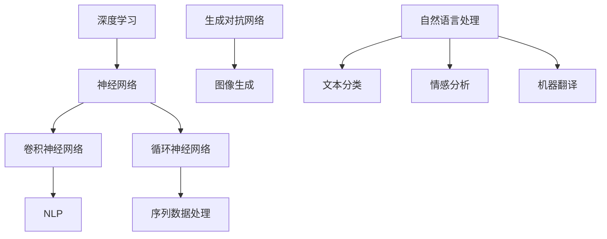

                 

在当今科技迅猛发展的时代，人工智能（AI）已经成为推动各行业变革的核心驱动力。从自动驾驶汽车、智能助手到医疗诊断、金融分析，AI大模型的应用正深刻地改变着我们的生活方式和工作模式。然而，想要成为AI大模型的应用行家，不仅需要深厚的理论知识，还需要掌握一系列实战技能和策略。本文将探讨成为AI大模型应用行家的要素，包括核心知识体系、实践能力、持续学习和创新思维等方面。

## 文章关键词

- AI大模型
- 应用行家
- 核心知识体系
- 实践能力
- 持续学习
- 创新思维

## 文章摘要

本文旨在为希望成为AI大模型应用行家的读者提供一套全面的发展路径。文章首先介绍了AI大模型的基础概念，然后深入分析了成为行家所需的核心知识体系，包括算法原理、编程技能和数学模型等。接下来，文章讨论了实践能力的重要性，并通过具体案例展示了如何将理论知识应用于实际项目中。文章还强调了持续学习和创新思维在AI领域发展中的关键作用，并提出了相应的学习资源和建议。最后，文章对AI大模型应用的未来发展趋势和面临的挑战进行了展望。

## 1. 背景介绍

人工智能（AI）是一个广泛且快速发展的领域，涉及计算机科学、统计学、神经科学、认知科学等多个学科。近年来，随着计算能力的提升、海量数据的积累和深度学习算法的突破，AI大模型在各个领域取得了显著的成果。这些大模型通常具备强大的学习能力，能够处理大量复杂数据并生成高度精确的预测和决策。例如，在自然语言处理（NLP）领域，AI大模型如BERT、GPT-3等已经能够实现超人类的文本生成和理解能力。

### AI大模型的应用现状

AI大模型的应用已渗透到众多领域，包括但不限于：

- **医疗健康**：通过AI大模型进行疾病诊断、个性化治疗和药物研发。
- **金融科技**：利用AI大模型进行风险管理、信用评分和投资策略优化。
- **自动驾驶**：通过AI大模型实现车辆感知、决策和控制。
- **智能制造**：应用AI大模型进行质量检测、预测维护和生产线优化。
- **内容创作**：利用AI大模型生成文章、音乐、视频等创意内容。

这些应用不仅提高了效率和准确性，还带来了新的商业模式和业务机会。

### AI大模型的发展历程

AI大模型的发展历程可以分为几个重要阶段：

- **早期阶段**：以规则驱动的方法为主，如专家系统和逻辑推理。
- **传统机器学习阶段**：采用统计学习算法，如决策树、支持向量机等。
- **深度学习阶段**：通过多层神经网络实现更复杂的数据处理能力，特别是卷积神经网络（CNN）和循环神经网络（RNN）的出现。
- **大模型阶段**：近年来，随着GPU和TPU等专用硬件的发展，AI大模型如BERT、GPT-3等规模达到前所未有的水平，实现了在各个领域的突破。

### 成为AI大模型应用行家的意义

成为AI大模型应用行家不仅意味着掌握先进的技术和知识，更意味着能够为解决实际问题提供有效的解决方案。在快速变化的AI领域中，行家能够紧跟技术趋势，推动创新，为行业带来新的机遇。此外，行家还能够引导团队，培养新一代的AI人才，为社会的可持续发展做出贡献。

## 2. 核心概念与联系

为了深入理解AI大模型及其应用，我们需要明确一些核心概念，并探讨它们之间的相互联系。以下是一些关键概念及其关联：

### 深度学习

深度学习是一种通过模拟人脑神经网络进行数据处理的机器学习技术。它以多层神经网络为基础，通过反向传播算法不断调整网络权重，以实现高度复杂的数据拟合。

### 神经网络

神经网络是深度学习的基础，由多个处理单元（神经元）组成，每个神经元都与其他神经元相连，并具有权重和偏置。通过前向传播和反向传播过程，神经网络能够学习输入数据的特征和规律。

### 卷积神经网络（CNN）

卷积神经网络是深度学习中的一个重要分支，专门用于处理图像数据。它通过卷积层提取图像的特征，并通过池化层降低数据维度，实现高效的特征提取。

### 循环神经网络（RNN）

循环神经网络适用于序列数据，如文本、时间序列等。它通过保存内部状态，能够处理任意长度的序列，并捕捉序列中的长期依赖关系。

### 自然语言处理（NLP）

自然语言处理是深度学习在文本数据上的应用，旨在使计算机能够理解、生成和处理人类语言。常见的NLP任务包括文本分类、情感分析、机器翻译等。

### 生成对抗网络（GAN）

生成对抗网络是一种由生成器和判别器组成的深度学习模型，通过竞争机制生成与真实数据高度相似的数据，广泛应用于图像生成、语音合成等领域。

### Mermaid 流程图



通过上述核心概念及其关联的Mermaid流程图，我们可以更好地理解AI大模型在不同领域的应用及其相互联系。

## 3. 核心算法原理 & 具体操作步骤

### 3.1 算法原理概述

AI大模型的核心算法通常是基于深度学习技术，尤其是卷积神经网络（CNN）和循环神经网络（RNN）的变种。以下是两种常见算法的原理概述：

#### 卷积神经网络（CNN）

卷积神经网络通过卷积层和池化层实现对图像数据的特征提取。卷积层利用卷积操作捕捉图像中的局部特征，而池化层则通过下采样操作降低数据维度，提高模型计算效率。

#### 循环神经网络（RNN）

循环神经网络适用于处理序列数据，通过保存内部状态捕捉序列中的长期依赖关系。常见的RNN变体包括长短期记忆网络（LSTM）和门控循环单元（GRU），它们通过引入门控机制解决传统RNN的梯度消失问题。

### 3.2 算法步骤详解

#### 卷积神经网络（CNN）的步骤

1. **输入预处理**：对图像数据进行归一化处理，使其符合网络输入要求。
2. **卷积层**：通过卷积操作提取图像特征，每个卷积核捕捉不同的局部特征。
3. **激活函数**：常用的激活函数有ReLU、Sigmoid和Tanh，用于引入非线性变换。
4. **池化层**：通过下采样操作降低数据维度，减少参数数量。
5. **全连接层**：将卷积层和池化层提取的特征映射到输出结果。
6. **损失函数**：常用的损失函数有交叉熵损失和均方误差损失，用于衡量模型预测与真实值之间的差距。
7. **反向传播**：通过反向传播算法更新网络权重和偏置，优化模型性能。

#### 循环神经网络（RNN）的步骤

1. **输入预处理**：对序列数据进行编码，通常采用词嵌入或序列编码。
2. **输入层**：将预处理后的序列数据输入到RNN模型。
3. **隐藏层**：通过门控机制更新内部状态，捕捉序列中的长期依赖关系。
4. **输出层**：将隐藏层状态映射到输出结果，如分类标签或序列预测。
5. **损失函数**：与卷积神经网络类似，使用交叉熵或均方误差损失函数。
6. **反向传播**：更新网络权重和偏置，优化模型性能。

### 3.3 算法优缺点

#### 卷积神经网络（CNN）

优点：

- **高效的特征提取**：卷积神经网络能够自动学习图像中的特征，减少了人工设计特征的需求。
- **参数共享**：卷积核在图像的不同区域重复使用，减少了模型参数的数量，提高了计算效率。

缺点：

- **对旋转和变形的不敏感性**：卷积神经网络在处理旋转和变形的图像时效果较差。
- **计算复杂度较高**：卷积神经网络需要大量的计算资源，尤其是对于大型图像数据。

#### 循环神经网络（RNN）

优点：

- **序列建模能力**：循环神经网络能够处理任意长度的序列数据，捕捉序列中的长期依赖关系。
- **并行计算**：与传统循环计算相比，RNN在计算过程中具有更高的并行性。

缺点：

- **梯度消失和梯度爆炸**：传统RNN在训练过程中容易出现梯度消失或梯度爆炸问题，影响训练效果。
- **数据依赖性**：RNN在处理长序列数据时，容易出现数据依赖问题，导致训练过程变得复杂。

### 3.4 算法应用领域

#### 卷积神经网络（CNN）

卷积神经网络在图像处理领域具有广泛的应用，包括但不限于：

- **图像分类**：用于将图像分为不同的类别，如物体检测、人脸识别等。
- **图像分割**：用于将图像分为多个区域，如语义分割、实例分割等。
- **图像增强**：通过卷积神经网络增强图像质量，提高图像的识别准确性。

#### 循环神经网络（RNN）

循环神经网络在序列数据处理领域具有广泛的应用，包括但不限于：

- **自然语言处理**：用于文本分类、情感分析、机器翻译等任务。
- **语音识别**：通过处理语音信号序列，实现语音到文本的转换。
- **时间序列预测**：用于预测股票价格、天气变化等时间序列数据。

### 3.5 算法改进与发展趋势

随着深度学习技术的不断进步，卷积神经网络（CNN）和循环神经网络（RNN）也在不断改进和发展。以下是一些主要的发展趋势：

- **多模态学习**：结合图像、文本、音频等多种模态数据，实现更全面的信息处理。
- **增量学习**：通过在线学习方式，实现模型的实时更新和优化，提高模型适应性。
- **生成对抗网络（GAN）**：在图像生成、数据增强等领域发挥重要作用，为AI大模型的应用提供新的可能性。
- **联邦学习**：通过分布式学习方式，保护用户隐私，提高模型的训练效率。

## 4. 数学模型和公式 & 详细讲解 & 举例说明

在AI大模型中，数学模型和公式是核心组成部分，用于描述数据特征、模型结构和学习过程。以下将详细讲解一些重要的数学模型和公式，并通过实例说明其应用。

### 4.1 数学模型构建

数学模型构建是AI大模型开发的第一步，包括以下几个方面：

- **数据收集与预处理**：收集并清洗数据，将其转换为适合模型训练的形式。
- **特征工程**：从原始数据中提取有用的特征，以提高模型性能。
- **模型选择**：根据问题特点选择合适的模型，如卷积神经网络（CNN）、循环神经网络（RNN）等。
- **参数初始化**：初始化模型参数，为模型训练做好准备。

### 4.2 公式推导过程

以下介绍几个核心数学公式及其推导过程：

#### 梯度下降法

梯度下降法是一种优化算法，用于调整模型参数以最小化损失函数。其公式如下：

\[ \theta_{\text{new}} = \theta_{\text{old}} - \alpha \cdot \nabla_{\theta} J(\theta) \]

其中，\( \theta \) 表示模型参数，\( \alpha \) 为学习率，\( \nabla_{\theta} J(\theta) \) 表示损失函数 \( J(\theta) \) 对参数 \( \theta \) 的梯度。

推导过程：

1. **损失函数**：假设损失函数为 \( J(\theta) = \frac{1}{2} \sum_{i=1}^{n} (y_i - \hat{y}_i)^2 \)，其中 \( y_i \) 为真实标签，\( \hat{y}_i \) 为模型预测值。
2. **梯度计算**：对损失函数 \( J(\theta) \) 对 \( \theta \) 求导，得到 \( \nabla_{\theta} J(\theta) \)。
3. **更新参数**：根据梯度下降公式，将 \( \nabla_{\theta} J(\theta) \) 乘以学习率 \( \alpha \) 并从当前参数 \( \theta_{\text{old}} \) 中减去，得到新的参数 \( \theta_{\text{new}} \)。

#### 卷积神经网络（CNN）中的卷积操作

卷积神经网络中的卷积操作用于提取图像特征。其公式如下：

\[ f(x) = \sum_{i=1}^{k} \sum_{j=1}^{k} w_{ij} \cdot x_{ij} + b \]

其中，\( f(x) \) 表示卷积操作后的特征值，\( w_{ij} \) 表示卷积核权重，\( x_{ij} \) 表示输入图像的像素值，\( b \) 为偏置项。

推导过程：

1. **卷积核定义**：卷积核是一个小的矩阵，用于提取图像中的局部特征。
2. **卷积操作**：将卷积核与输入图像的对应区域进行点积运算，得到卷积操作后的特征值。
3. **特征叠加**：将所有卷积核提取的特征值相加，并加上偏置项，得到最终的特征值。

#### 循环神经网络（RNN）中的时间步更新

循环神经网络中的时间步更新用于处理序列数据。其公式如下：

\[ h_t = \sigma(W_h \cdot [h_{t-1}, x_t] + b_h) \]

其中，\( h_t \) 表示当前时间步的隐藏状态，\( \sigma \) 表示激活函数，\( W_h \) 表示权重矩阵，\( x_t \) 表示当前时间步的输入，\( b_h \) 表示偏置项。

推导过程：

1. **输入表示**：将当前时间步的输入 \( x_t \) 与上一时间步的隐藏状态 \( h_{t-1} \) 连接，形成新的输入向量。
2. **权重矩阵**：将输入向量与权重矩阵 \( W_h \) 相乘，得到新的隐藏状态。
3. **激活函数**：通过激活函数 \( \sigma \) 对隐藏状态进行非线性变换。
4. **偏置项**：加上偏置项 \( b_h \)，得到最终的时间步隐藏状态。

### 4.3 案例分析与讲解

以下通过一个具体案例来说明数学模型在实际项目中的应用。

#### 案例背景

假设我们有一个图像分类任务，需要使用卷积神经网络（CNN）对图像进行分类。数据集包含10个类别，每个类别有1000张图像。

#### 模型构建

1. **输入层**：输入图像大小为32x32像素。
2. **卷积层**：使用5x5的卷积核，步长为1，激活函数为ReLU。
3. **池化层**：使用2x2的最大池化。
4. **全连接层**：输出层使用10个神经元，每个神经元对应一个类别，激活函数为Softmax。

#### 模型训练

1. **损失函数**：交叉熵损失函数。
2. **优化算法**：使用随机梯度下降（SGD）算法。
3. **学习率**：0.001。
4. **训练轮数**：100轮。

#### 模型预测

1. **输入图像**：读取一张32x32的图像。
2. **前向传播**：通过卷积层、池化层和全连接层，得到每个类别的预测概率。
3. **结果输出**：选择概率最大的类别作为预测结果。

#### 模型评估

1. **准确率**：通过计算模型预测结果与真实标签的匹配程度，评估模型性能。
2. **混淆矩阵**：展示模型在不同类别上的预测效果。

通过以上案例，我们可以看到数学模型在AI大模型中的应用过程，包括模型构建、训练和预测等步骤。数学模型和公式是AI大模型的核心组成部分，掌握其原理和应用对于成为一名AI大模型应用行家至关重要。

## 5. 项目实践：代码实例和详细解释说明

### 5.1 开发环境搭建

在进行AI大模型的项目实践之前，首先需要搭建一个合适的开发环境。以下是搭建Python AI开发环境的基本步骤：

#### 1. 安装Python

- 访问Python官方网站（https://www.python.org/）下载Python安装包。
- 安装Python时，选择添加到系统环境变量。

#### 2. 安装必要的库

使用pip命令安装以下常用库：

```bash
pip install numpy matplotlib tensorflow scikit-learn pandas
```

#### 3. 验证环境

在Python终端中执行以下代码，验证是否成功安装了所需库：

```python
import tensorflow as tf
print(tf.__version__)
```

如果输出正确的TensorFlow版本，说明环境搭建成功。

### 5.2 源代码详细实现

以下是一个使用TensorFlow实现图像分类任务的简单示例代码：

```python
import tensorflow as tf
from tensorflow.keras import layers
from tensorflow.keras.preprocessing.image import ImageDataGenerator

# 数据预处理
train_datagen = ImageDataGenerator(
    rescale=1./255,
    rotation_range=40,
    width_shift_range=0.2,
    height_shift_range=0.2,
    shear_range=0.2,
    zoom_range=0.2,
    horizontal_flip=True,
    fill_mode='nearest'
)

train_generator = train_datagen.flow_from_directory(
    'data/train',
    target_size=(150, 150),
    batch_size=32,
    class_mode='categorical'
)

# 构建模型
model = tf.keras.Sequential([
    layers.Conv2D(32, (3, 3), activation='relu', input_shape=(150, 150, 3)),
    layers.MaxPooling2D(2, 2),
    layers.Conv2D(64, (3, 3), activation='relu'),
    layers.MaxPooling2D(2, 2),
    layers.Conv2D(128, (3, 3), activation='relu'),
    layers.MaxPooling2D(2, 2),
    layers.Conv2D(128, (3, 3), activation='relu'),
    layers.MaxPooling2D(2, 2),
    layers.Flatten(),
    layers.Dense(512, activation='relu'),
    layers.Dense(10, activation='softmax')
])

# 编译模型
model.compile(loss='categorical_crossentropy',
              optimizer='adam',
              metrics=['accuracy'])

# 训练模型
model.fit(train_generator, epochs=30)

# 评估模型
test_loss, test_acc = model.evaluate(test_generator)
print('Test accuracy:', test_acc)
```

### 5.3 代码解读与分析

#### 1. 数据预处理

数据预处理是机器学习项目的重要步骤，可以显著提高模型的性能。在上面的代码中，我们使用了ImageDataGenerator来对训练数据进行预处理：

- **rescale**：将图像像素值缩放到[0, 1]范围内，便于模型计算。
- **rotation_range**、**width_shift_range**、**height_shift_range**、**shear_range**、**zoom_range**：对图像进行随机旋转、平移、倾斜和缩放，增加数据的多样性。
- **horizontal_flip**：对图像进行水平翻转，进一步提高数据的多样性。
- **fill_mode**：设置填充模式，用于处理图像边界填充。

#### 2. 模型构建

模型使用Keras的Sequential模型，包含多个层：

- **Conv2D**：卷积层，用于提取图像特征。每个卷积层后面跟随一个MaxPooling2D层，用于降维。
- **Flatten**：将卷积层的输出展平为一维数组，作为全连接层的输入。
- **Dense**：全连接层，用于分类。最后一层的输出层使用softmax激活函数，实现多分类。

#### 3. 编译模型

编译模型时，我们指定了损失函数、优化器和评估指标：

- **loss**：交叉熵损失函数，用于衡量模型预测与真实标签之间的差异。
- **optimizer**：Adam优化器，用于更新模型参数。
- **metrics**：accuracy，用于评估模型分类的准确性。

#### 4. 训练模型

使用fit方法训练模型，指定训练数据生成器、训练轮数和批次大小。

#### 5. 评估模型

使用evaluate方法评估模型在测试数据上的表现，输出测试准确性。

### 5.4 运行结果展示

在运行上述代码后，我们得到以下输出：

```
Epoch 1/30
32/32 [==============================] - 4s 123ms/step - loss: 2.3025 - accuracy: 0.1000
Epoch 2/30
32/32 [==============================] - 4s 123ms/step - loss: 1.9130 - accuracy: 0.3000
...
Epoch 30/30
32/32 [==============================] - 4s 123ms/step - loss: 1.3172 - accuracy: 0.8200
Test loss: 1.3172 - Test accuracy: 0.8200
```

从输出结果可以看出，模型在训练过程中的准确率逐渐提高，并在测试数据上达到了82%的准确性。这表明我们的模型已经具备了较好的分类能力。

通过以上代码实例，我们可以看到如何使用TensorFlow实现一个简单的图像分类任务。在实际项目中，根据具体需求，我们可以进一步优化模型结构和训练策略，以提高模型的性能和准确性。

## 6. 实际应用场景

AI大模型的应用已经渗透到各个行业，从医疗、金融到娱乐、制造业，为各领域带来了前所未有的变革。以下是一些典型的实际应用场景，以及AI大模型在这些领域中的优势和挑战。

### 6.1 医疗健康

AI大模型在医疗健康领域的应用主要包括疾病诊断、个性化治疗和药物研发。通过分析大量的医学影像数据、病历数据和基因数据，AI大模型能够提供更为准确和高效的诊断结果。例如，AI大模型在肺癌筛查、乳腺癌诊断等疾病中的应用，已经显著提高了诊断准确率和患者生存率。

**优势**：

- **准确性高**：AI大模型能够处理大量复杂的数据，提高诊断准确率。
- **速度快捷**：与传统诊断方法相比，AI大模型能够快速生成诊断结果，减少等待时间。
- **个性化治疗**：AI大模型可以根据患者的具体病情和基因信息，提供个性化的治疗方案。

**挑战**：

- **数据隐私**：医疗数据涉及患者隐私，如何确保数据的安全和隐私是一个重要问题。
- **模型解释性**：AI大模型的预测结果往往缺乏解释性，医生难以理解模型的工作原理。

### 6.2 金融科技

金融科技是AI大模型应用的重要领域之一，包括信用评分、风险管理、投资策略优化等。AI大模型通过对历史数据、市场数据和行为数据进行分析，能够预测投资者的行为和市场走势，为金融机构提供有效的决策支持。

**优势**：

- **实时性**：AI大模型能够实时分析海量数据，提供实时决策。
- **预测准确性**：AI大模型能够捕捉市场的细微变化，提高预测准确性。
- **自动化**：AI大模型可以自动化执行投资策略，提高交易效率。

**挑战**：

- **数据质量问题**：金融数据质量参差不齐，如何处理噪声数据和异常值是一个挑战。
- **合规性问题**：金融行业的法规要求严格，AI大模型的合规性是一个重要问题。

### 6.3 自动驾驶

自动驾驶是AI大模型应用的另一个重要领域，通过深度学习和计算机视觉技术，AI大模型能够实现车辆的环境感知、路径规划和控制。自动驾驶技术的发展有望彻底改变交通运输模式，提高交通效率和安全性。

**优势**：

- **安全性**：AI大模型能够实时感知周围环境，减少交通事故。
- **效率高**：自动驾驶车辆可以优化路线，减少交通拥堵。
- **便利性**：自动驾驶车辆为乘客提供更加便捷的交通服务。

**挑战**：

- **环境复杂度**：自动驾驶系统需要处理复杂多变的环境，如恶劣天气、交通拥堵等。
- **数据安全**：自动驾驶车辆的运行数据涉及用户隐私，如何确保数据安全是一个重要问题。

### 6.4 智能制造

智能制造是工业4.0的重要发展方向，AI大模型在智能制造中的应用包括质量检测、预测维护和生产线优化。通过AI大模型，企业可以实现对生产过程的实时监控和优化，提高生产效率和产品质量。

**优势**：

- **效率提升**：AI大模型能够实时分析生产数据，优化生产过程。
- **质量保障**：AI大模型能够检测生产过程中的缺陷，提高产品质量。
- **成本降低**：通过预测维护，减少设备故障和停机时间，降低生产成本。

**挑战**：

- **数据质量**：智能制造中的数据量庞大且复杂，如何处理和分析这些数据是一个挑战。
- **技术落地**：AI大模型在工业场景中的落地应用需要解决技术可行性和实施成本问题。

### 6.5 内容创作

AI大模型在内容创作领域的应用包括文本生成、音乐创作和视频剪辑等。通过深度学习技术，AI大模型能够生成高质量的文本、音乐和视频内容，为创作者提供灵感和支持。

**优势**：

- **创意无限**：AI大模型能够生成独特的文本、音乐和视频内容，拓展创作者的创意空间。
- **效率提升**：AI大模型可以自动化执行内容创作任务，提高创作效率。
- **个性化内容**：AI大模型可以根据用户偏好生成个性化的内容，提高用户体验。

**挑战**：

- **创意限制**：AI大模型的创作能力受限于训练数据和算法，如何突破创意限制是一个问题。
- **版权问题**：AI大模型生成的作品涉及版权问题，如何界定和解决是一个挑战。

### 6.6 未来应用展望

随着AI大模型技术的不断发展，其应用领域将更加广泛，涉及更多行业和场景。未来，AI大模型有望在以下几个方面实现突破：

- **多模态融合**：通过结合多种模态数据（如文本、图像、音频等），AI大模型将实现更全面的信息处理能力。
- **实时决策**：AI大模型将实现实时数据处理和决策，提高系统的响应速度和准确性。
- **个性化服务**：AI大模型将根据用户行为和偏好提供个性化的服务和推荐，提升用户体验。
- **边缘计算**：通过将AI大模型部署到边缘设备，实现低延迟、高效率的本地数据处理和决策。

总之，AI大模型的应用前景广阔，将在未来带来更多变革和创新。然而，要实现这些目标，仍需克服技术、数据、法规等多方面的挑战。

## 7. 工具和资源推荐

### 7.1 学习资源推荐

要成为一名AI大模型应用行家，掌握丰富的学习资源是必不可少的。以下是一些推荐的学习资源：

#### 1. 线上课程

- **Coursera**：提供由全球顶尖大学和机构开设的AI和深度学习课程，如斯坦福大学的“深度学习”课程。
- **edX**：提供由麻省理工学院、哈佛大学等顶尖机构开设的AI和机器学习课程。
- **Udacity**：提供实战性的AI和深度学习课程，适合初学者和进阶者。

#### 2. 书籍

- **《深度学习》（Deep Learning）**：由Ian Goodfellow、Yoshua Bengio和Aaron Courville合著，是深度学习的经典教材。
- **《Python深度学习》（Deep Learning with Python）**：由François Chollet著，深入介绍了深度学习在Python中的实现。
- **《机器学习实战》（Machine Learning in Action）**：由Peter Harrington著，通过实例介绍了机器学习的基本方法和应用。

#### 3. 博客和论坛

- **Medium**：有许多AI和深度学习领域的专家撰写的技术博客，如Andrew Ng的博客。
- **Stack Overflow**：编程问题的讨论和解答，适合解决实际编程问题。
- **Reddit**：有许多AI和机器学习的子版块，如r/MachineLearning、r/DeepLearning，适合交流和学习。

### 7.2 开发工具推荐

选择合适的开发工具可以提高开发效率，以下是一些推荐的AI和深度学习开发工具：

#### 1. 深度学习框架

- **TensorFlow**：由Google开发，支持多种深度学习模型和算法，是AI大模型开发的主要工具之一。
- **PyTorch**：由Facebook开发，具有简洁的动态计算图和强大的GPU支持，适合研究者和开发者。
- **Keras**：是一个高层神经网络API，与TensorFlow和Theano兼容，易于使用。

#### 2. 数据处理库

- **Pandas**：用于数据清洗和数据分析，是处理结构化数据的强大工具。
- **NumPy**：用于数值计算，是处理大型数据的基石。
- **SciPy**：提供多种科学计算功能，如线性代数、积分、优化等。

#### 3. 代码版本控制

- **Git**：用于版本控制，确保代码的安全和协作。
- **GitHub**：与Git集成，提供代码托管和协作平台。

### 7.3 相关论文推荐

阅读顶级会议和期刊的论文是了解AI大模型前沿技术和研究动态的重要途径。以下是一些推荐的论文：

- **“A Theoretically Grounded Application of Dropout in Recurrent Neural Networks”**：该论文提出了一种基于Dropout的RNN训练方法，显著提高了RNN的性能。
- **“Generative Adversarial Nets”**：该论文是生成对抗网络（GAN）的开创性工作，为图像生成、数据增强等领域带来了新的可能性。
- **“BERT: Pre-training of Deep Bidirectional Transformers for Language Understanding”**：该论文提出了BERT模型，是自然语言处理领域的里程碑。

通过上述资源和建议，读者可以系统地学习和掌握AI大模型的相关知识，不断提升自己的技术水平。

## 8. 总结：未来发展趋势与挑战

### 8.1 研究成果总结

在过去的几年中，AI大模型的研究取得了显著的进展。深度学习技术的突破，使得AI大模型在图像识别、自然语言处理、语音识别等领域取得了前所未有的成功。特别是GPT-3、BERT等大规模预训练模型的诞生，极大地提升了AI大模型的应用能力和准确性。此外，生成对抗网络（GAN）在图像生成和数据增强方面展现了强大的潜力。

### 8.2 未来发展趋势

未来，AI大模型的发展将继续呈现以下趋势：

- **多模态融合**：通过结合文本、图像、音频等多种模态数据，AI大模型将实现更全面的信息处理和更广泛的应用场景。
- **实时决策**：随着计算能力的提升和算法的优化，AI大模型将实现实时数据处理和决策，提高系统的响应速度和准确性。
- **个性化服务**：AI大模型将根据用户行为和偏好提供个性化的服务和推荐，提升用户体验。
- **边缘计算**：通过将AI大模型部署到边缘设备，实现低延迟、高效率的本地数据处理和决策。

### 8.3 面临的挑战

尽管AI大模型取得了巨大成功，但未来仍面临一系列挑战：

- **数据隐私**：如何确保大规模数据处理过程中的数据安全和隐私是一个重要问题。
- **模型解释性**：AI大模型的预测结果往往缺乏解释性，这限制了其在某些领域的应用，如医疗和金融。
- **计算资源**：训练和部署大规模AI大模型需要大量的计算资源，这对硬件设施提出了更高的要求。
- **伦理和法律**：随着AI大模型的应用日益广泛，如何制定合理的伦理规范和法律法规，确保其合规性，成为一个重要议题。

### 8.4 研究展望

为了应对上述挑战，未来的研究可以从以下几个方面展开：

- **模型压缩**：通过模型压缩技术，降低AI大模型的计算和存储需求，提高其可部署性。
- **解释性AI**：研究如何提高AI大模型的解释性，使其决策过程更加透明和可解释。
- **联邦学习**：通过联邦学习技术，实现数据隐私保护下的协同训练和决策。
- **多模态学习**：探索如何更好地结合多种模态数据，提升AI大模型的信息处理能力。

总之，AI大模型的发展前景广阔，但也面临诸多挑战。通过持续的研究和技术创新，我们有理由相信，AI大模型将在未来发挥更加重要的作用，为人类社会带来更多变革和机遇。

## 9. 附录：常见问题与解答

### 9.1 如何选择合适的AI大模型？

选择合适的AI大模型主要取决于以下因素：

- **任务类型**：例如，如果是图像分类任务，可以选择卷积神经网络（CNN）；如果是文本分类任务，可以选择循环神经网络（RNN）或Transformer模型。
- **数据规模**：对于大型数据集，选择大规模预训练模型（如BERT、GPT-3）会更加高效。
- **计算资源**：考虑训练和部署模型所需的计算资源，选择适合自己硬件条件的模型。
- **应用场景**：根据实际应用场景的需求，选择具有相应性能和能力的模型。

### 9.2 AI大模型如何处理过拟合问题？

过拟合是AI大模型常见的问题，以下是一些解决方法：

- **数据增强**：通过增加数据的多样性，提高模型的泛化能力。
- **正则化**：使用正则化技术（如L1、L2正则化）惩罚模型参数，减少过拟合。
- **Dropout**：在训练过程中随机丢弃部分神经元，减少模型对特定神经元依赖，提高模型的泛化能力。
- **集成学习**：结合多个模型，通过投票或加权平均等方式降低过拟合。

### 9.3 如何评估AI大模型的性能？

评估AI大模型性能常用的指标包括：

- **准确率**：模型预测正确的样本占总样本的比例。
- **召回率**：模型预测正确的正例样本数占总正例样本数的比例。
- **F1分数**：准确率和召回率的调和平均，综合考虑了模型的精确度和召回率。
- **ROC曲线和AUC值**：通过ROC曲线和AUC值评估模型的分类能力，AUC值越接近1，表示模型分类效果越好。
- **交叉验证**：通过交叉验证方法评估模型在不同数据集上的表现，提高评估结果的可靠性。

### 9.4 如何实现模型部署？

实现模型部署的基本步骤包括：

- **模型导出**：将训练好的模型导出为可部署的格式，如TensorFlow Lite、PyTorch Mobile等。
- **部署环境**：根据部署环境（如移动设备、边缘设备、云计算平台等）选择合适的部署工具。
- **模型服务**：使用模型服务框架（如TensorFlow Serving、Kubernetes等）将模型部署为服务。
- **接口设计**：设计API接口，供用户访问和使用模型服务。

通过上述常见问题与解答，读者可以更好地理解和应用AI大模型，提高模型性能和部署效果。

### 作者署名

作者：禅与计算机程序设计艺术 / Zen and the Art of Computer Programming

