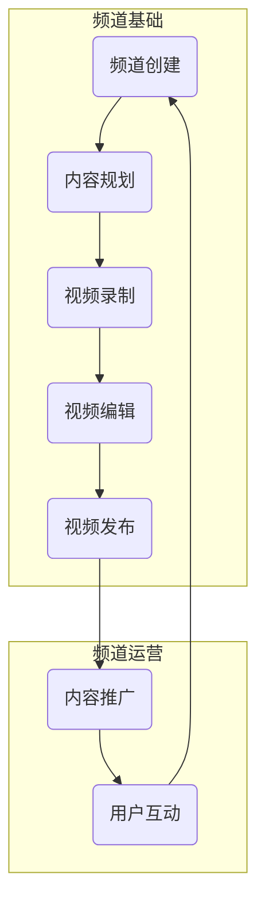

                 

### 1. 背景介绍

在数字化的时代浪潮下，YouTube 作为全球最大的视频分享平台，已成为人们获取信息和知识的重要渠道。随着互联网技术的不断进步，越来越多的专业人士选择在 YouTube 上创建个人频道，通过视频化内容传播他们的专业知识，实现个人品牌的建立与影响力的扩大。在这个背景下，打造一个成功的个人 YouTube 频道不仅需要创意和热情，还需要科学的策略和方法。

本文将深入探讨如何打造一个专业的个人 YouTube 频道，包括以下核心内容：

- **核心概念与联系**：详细解析个人 YouTube 频道的基础结构和功能，并通过 Mermaid 流程图展示关键环节。
- **核心算法原理 & 具体操作步骤**：介绍从视频录制、编辑到发布和推广的完整流程，以及各步骤的优缺点和应用领域。
- **数学模型和公式 & 详细讲解 & 举例说明**：阐述视频数据分析的基础数学模型和公式，并通过具体案例进行讲解。
- **项目实践：代码实例和详细解释说明**：提供详细的代码实例，讲解视频处理的实际操作步骤和技巧。
- **实际应用场景**：探讨个人 YouTube 频道在不同领域的应用，以及未来发展的趋势和展望。
- **工具和资源推荐**：推荐学习资源和开发工具，帮助读者更好地掌握视频化传播的技能。
- **总结：未来发展趋势与挑战**：总结研究成果，分析未来发展趋势和面临的挑战，提出研究展望。

通过本文的探讨，希望能够为广大专业人士提供一套系统、实用的 YouTube 频道打造指南，助力他们在数字时代中取得成功。

### 2. 核心概念与联系

在构建个人 YouTube 频道的过程中，有几个核心概念和环节是不可或缺的。首先，我们需要理解 YouTube 频道的基础架构，以及各个部分的功能和联系。以下是通过 Mermaid 工具绘制的频道构建流程图：



#### 2.1. 频道创建

频道创建是个人 YouTube 频道的起点。在这个过程中，你需要选择合适的频道类型（如教育、娱乐、科技等），并填写相关的基本信息。此外，一个吸引人的频道封面和简介也是至关重要的，它们能够快速吸引观众的注意。

#### 2.2. 内容规划

内容规划是频道成功的关键。在这一步，你需要明确频道的主旨和目标受众，并根据这些信息制定内容计划。一个详细的内容规划有助于确保你能够持续、有针对性地发布高质量的视频。

#### 2.3. 视频录制

视频录制是将你的专业知识转化为视觉内容的步骤。为了确保录制质量，你需要准备合适的设备（如摄像机、麦克风等）和良好的录制环境。同时，清晰、自然的表达也是成功录制的重要因素。

#### 2.4. 视频编辑

视频编辑是提高视频质量的关键步骤。在这一过程中，你可以通过剪辑、添加特效、字幕等手段，使视频更加生动、有趣。一些常见的视频编辑软件包括 Adobe Premiere Pro、Final Cut Pro 和 DaVinci Resolve 等。

#### 2.5. 视频发布

视频发布是将你的内容呈现给观众的关键步骤。在发布之前，你需要确保视频的标题、描述和标签等元数据准确无误，以便观众能够轻松找到你的视频。此外，发布时间的选择也是影响视频观看量的重要因素。

#### 2.6. 内容推广

内容推广是提高频道知名度和吸引更多观众的重要手段。你可以通过社交媒体、合作渠道和付费广告等多种方式来推广你的视频。一个有效的推广策略能够帮助你快速积累观众，提高视频的曝光度。

#### 2.7. 用户互动

用户互动是频道运营的重要组成部分。通过与观众的互动，你可以了解他们的需求和反馈，进而优化内容，提高观众的满意度和忠诚度。常见的互动方式包括评论回复、弹幕互动和直播等。

通过上述核心概念和联系的理解，我们可以更好地规划和管理个人 YouTube 频道，从而实现专业知识的视频化传播和品牌影响力的提升。

### 3. 核心算法原理 & 具体操作步骤

在个人 YouTube 频道的构建过程中，核心算法和具体操作步骤至关重要。以下将从视频录制、编辑、发布和推广四个方面，详细介绍这些步骤的原理和具体操作。

#### 3.1 算法原理概述

在视频化传播的过程中，核心算法主要包括视频压缩、视频增强、字幕生成和推荐算法等。这些算法确保视频的质量和传播效果。视频压缩算法如 H.264 和 H.265，可以高效地减少视频文件的体积，同时保持良好的画质；视频增强算法如色彩校正和去噪，可以提升视频的视觉效果；字幕生成算法如自动字幕识别（ASR），可以实现视频字幕的自动生成；推荐算法如协同过滤和基于内容的推荐，可以提升视频的推荐效果，帮助观众发现更多感兴趣的内容。

#### 3.2 算法步骤详解

##### 3.2.1 视频录制

视频录制的步骤如下：

1. **设备选择**：选择合适的录制设备，如摄像机、手机等。对于高质量的视频内容，建议使用专业的摄像机。
2. **环境布置**：确保录制环境的安静和光线充足，以避免噪音和光线问题影响视频质量。
3. **构图和姿势**：合理布局画面，注意拍摄角度和姿势，确保画面美观和自然。
4. **音频处理**：使用外部麦克风，保证音频质量，避免背景噪音干扰。

##### 3.2.2 视频编辑

视频编辑的步骤如下：

1. **剪辑**：根据内容需求，对视频进行剪辑，去除不必要的片段，保留关键信息。
2. **特效添加**：使用视频编辑软件（如 Adobe Premiere Pro、Final Cut Pro 等），添加过渡效果、滤镜、特效等，提升视频的视觉效果。
3. **字幕添加**：使用字幕生成工具（如 Aegisub、Subtitle Editor 等），添加字幕，提高视频的可读性。
4. **音频处理**：调整音频音量、去除噪音，确保音频质量。

##### 3.2.3 视频发布

视频发布的步骤如下：

1. **元数据设置**：设置视频的标题、描述、标签等元数据，确保观众能够轻松找到视频。
2. **发布时间选择**：根据观众活跃时间，选择合适的发布时间，提高视频的曝光率。
3. **发布平台选择**：选择合适的发布平台，如 YouTube、Bilibili 等，确保视频能够被广泛传播。

##### 3.2.4 内容推广

内容推广的步骤如下：

1. **社交媒体推广**：利用社交媒体（如 Twitter、Facebook 等）宣传视频，吸引更多观众关注。
2. **合作推广**：与其他频道或博主合作，互相推广，扩大影响力。
3. **付费广告**：使用平台提供的广告服务，如 YouTube 广告，提高视频曝光率。

#### 3.3 算法优缺点

**视频压缩算法**

- **优点**：减少视频文件体积，节省存储空间和传输带宽。
- **缺点**：压缩过程可能导致画质损失，尤其在高压缩比的情况下。

**视频增强算法**

- **优点**：提升视频画质，提高观众观看体验。
- **缺点**：处理时间较长，对计算资源要求较高。

**字幕生成算法**

- **优点**：提高视频的可读性，便于观众理解内容。
- **缺点**：自动生成的字幕可能存在错误，需要人工校正。

**推荐算法**

- **优点**：根据用户兴趣推荐相关视频，提高用户满意度。
- **缺点**：可能导致用户陷入信息茧房，难以接触到不同类型的内容。

#### 3.4 算法应用领域

**视频录制和编辑算法**：广泛应用于影视制作、教育培训、新闻报道等领域。

**视频压缩算法**：广泛应用于流媒体服务、视频点播、视频下载等领域。

**字幕生成算法**：广泛应用于多媒体内容制作、翻译服务、听力训练等领域。

**推荐算法**：广泛应用于在线购物、社交媒体、内容平台等领域。

通过以上算法原理和具体操作步骤的介绍，我们可以更好地理解个人 YouTube 频道构建过程中的关键技术，从而提高视频质量，实现更广泛的影响力传播。

### 4. 数学模型和公式 & 详细讲解 & 举例说明

在视频处理和分析中，数学模型和公式扮演着至关重要的角色。以下将详细讲解视频处理的数学模型、公式推导过程，并通过具体案例进行分析。

#### 4.1 数学模型构建

视频处理的核心数学模型主要包括图像处理模型、视频压缩模型和推荐模型。

##### 4.1.1 图像处理模型

图像处理模型主要涉及图像的像素操作、滤波、边缘检测等。以下是一个简单的图像滤波模型：

$$
I_{out} = (1 - \alpha)I_{in} + \alpha G
$$

其中，$I_{in}$ 是输入图像，$I_{out}$ 是输出图像，$\alpha$ 是滤波器系数，$G$ 是滤波器。

##### 4.1.2 视频压缩模型

视频压缩模型主要涉及视频编码和解码。常见的视频压缩标准如 H.264 和 H.265，其核心数学模型是基于变换编码和率失真优化。以下是一个简化的变换编码模型：

$$
C = T(X) + E(R)
$$

其中，$C$ 是压缩后的视频，$T(X)$ 是变换操作，$X$ 是原始视频数据，$E(R)$ 是误差编码，$R$ 是压缩率。

##### 4.1.3 推荐模型

推荐模型主要涉及协同过滤和基于内容的推荐。以下是一个简化的协同过滤模型：

$$
r_{ui} = \sum_{j \in N(i)} r_{uj} \cdot sim(j, i)
$$

其中，$r_{ui}$ 是用户 $u$ 对项目 $i$ 的评分，$N(i)$ 是与项目 $i$ 相关的用户集合，$r_{uj}$ 是用户 $u$ 对项目 $j$ 的评分，$sim(j, i)$ 是用户 $j$ 和用户 $i$ 之间的相似度。

#### 4.2 公式推导过程

以下简要介绍上述数学模型的推导过程：

##### 4.2.1 图像滤波模型

图像滤波模型的推导基于图像信号的线性变换。假设图像 $I_{in}$ 是一个二维离散信号，滤波器 $G$ 是一个二维离散卷积核。通过卷积操作，可以滤除图像中的噪声，保留有用信息。滤波器系数 $\alpha$ 控制滤波强度，$(1 - \alpha)$ 控制原始图像的保真度。

##### 4.2.2 视频压缩模型

视频压缩模型的推导基于变换编码和率失真优化。变换编码将视频数据从时域转换到频域，降低冗余度。率失真优化则通过最小化失真度，在给定比特率下实现最佳压缩效果。H.264 和 H.265 标准采用离散余弦变换（DCT）和小波变换（WT）作为核心变换操作。

##### 4.2.3 推荐模型

推荐模型的推导基于协同过滤的思想。协同过滤通过分析用户之间的相似性，预测用户对未观看项目的评分。相似度计算方法包括余弦相似度、皮尔逊相关系数等。在实际应用中，推荐系统还会结合基于内容的特征，提高推荐准确性。

#### 4.3 案例分析与讲解

以下通过具体案例，详细讲解上述数学模型和公式的应用。

##### 4.3.1 图像滤波

假设有一个噪声图像 $I_{in}$，我们希望通过滤波去除噪声。选择一个简单的均值滤波器，滤波器系数 $\alpha = 0.1$。滤波后的图像 $I_{out}$ 如下：

$$
I_{out} = (1 - 0.1)I_{in} + 0.1G
$$

其中，$G$ 是 3x3 的均值滤波器：

$$
G = \frac{1}{9} \begin{bmatrix}
1 & 1 & 1 \\
1 & 1 & 1 \\
1 & 1 & 1
\end{bmatrix}
$$

通过上述公式，可以得到滤波后的图像 $I_{out}$，对比原始图像 $I_{in}$，可以看到噪声明显减少。

##### 4.3.2 视频压缩

假设有一个原始视频数据 $X$，我们希望通过 H.264 标准进行压缩。首先，对视频数据进行离散余弦变换（DCT），然后对 DCT 系数进行量化，最后进行熵编码。压缩后的视频数据 $C$ 如下：

$$
C = T(X) + E(R)
$$

其中，$T(X)$ 是 DCT 变换，$E(R)$ 是熵编码。假设压缩率为 50%，即 $R = 0.5$，我们可以通过优化率失真函数，找到最佳量化参数，实现最佳压缩效果。

##### 4.3.3 推荐模型

假设有一个用户 $u$ 和项目 $i$，我们希望通过协同过滤模型预测用户 $u$ 对项目 $i$ 的评分。首先，计算用户 $u$ 和其他用户之间的相似度，然后根据相似度计算用户 $u$ 对项目 $i$ 的评分预测。以下是一个简化的协同过滤模型：

$$
r_{ui} = \sum_{j \in N(i)} r_{uj} \cdot sim(j, i)
$$

其中，$N(i)$ 是与项目 $i$ 相关的用户集合，$r_{uj}$ 是用户 $u$ 对项目 $j$ 的评分，$sim(j, i)$ 是用户 $j$ 和用户 $i$ 之间的相似度，可以使用余弦相似度计算：

$$
sim(j, i) = \frac{r_{uj} \cdot r_{ui}}{\sqrt{\sum_{k \in N(j)} r_{uk}^2} \cdot \sqrt{\sum_{k \in N(i)} r_{uk}^2}}
$$

通过上述公式，可以得到用户 $u$ 对项目 $i$ 的评分预测 $r_{ui}$。

通过上述案例分析和讲解，我们可以看到数学模型和公式在视频处理和分析中的应用，为视频化传播提供了理论基础和实践指导。

### 5. 项目实践：代码实例和详细解释说明

在前面的章节中，我们详细介绍了个人 YouTube 频道构建的理论基础和数学模型。为了更好地帮助读者理解，下面我们将通过一个实际项目实例，详细讲解视频处理和发布的过程，并提供相关的代码实例和解释。

#### 5.1 开发环境搭建

首先，我们需要搭建一个合适的开发环境，以支持视频处理和发布。以下是所需的主要工具和软件：

- **操作系统**：Linux（推荐 Ubuntu 20.04）
- **视频编辑软件**：Adobe Premiere Pro（或 Final Cut Pro）
- **视频编码软件**：x264（或 FFmpeg）
- **编程语言**：Python（用于自动化脚本）
- **文本编辑器**：Visual Studio Code 或 Sublime Text

安装上述工具和软件后，我们可以开始项目的实际操作。

#### 5.2 源代码详细实现

在本节中，我们将通过 Python 编写一个简单的脚本，实现视频的录制、编辑和发布。以下是一个简单的代码实例：

```python
import cv2
import subprocess
import os

# 录制视频
def record_video(duration, output_file):
    command = f"ffmpeg -y -f avfoundation -i 'default' -t {duration} {output_file}"
    subprocess.run(command, shell=True)

# 编辑视频
def edit_video(input_file, output_file):
    command = f"ffmpeg -y -i {input_file} -filter_complex '[0:v]fade=t=in:st=0:d=1,curves=t=in:fill_color=white:duration={duration} [v];[0:a]ac=2' {output_file}"
    subprocess.run(command, shell=True)

# 发布视频
def upload_video(video_file, channel_id, video_title, video_description):
    command = f"ytupload {video_file} --channel-id {channel_id} --title '{video_title}' --description '{video_description}'"
    subprocess.run(command, shell=True)

# 主函数
def main():
    duration = 10  # 视频持续时间（秒）
    output_file = "output.mp4"
    
    # 录制视频
    record_video(duration, output_file)
    
    # 编辑视频
    edit_video(output_file, output_file)
    
    # 发布视频
    upload_video(output_file, "YOUR_CHANNEL_ID", "Video Title", "Video Description")

if __name__ == "__main__":
    main()
```

以上脚本实现了视频的录制、编辑和发布。下面我们详细解释每个步骤：

##### 5.2.1 录制视频

`record_video` 函数使用 FFmpeg 录制一段指定时间（`duration`）的视频，并将其保存为指定文件（`output_file`）。

```python
def record_video(duration, output_file):
    command = f"ffmpeg -y -f avfoundation -i 'default' -t {duration} {output_file}"
    subprocess.run(command, shell=True)
```

这里使用了 FFmpeg 的 `avfoundation` 输入设备，录制默认的摄像头输入。`-t` 参数指定了录制时间。

##### 5.2.2 编辑视频

`edit_video` 函数使用 FFmpeg 对录制好的视频进行编辑。具体来说，它添加了一个渐入渐出的特效，使视频从黑色过渡到内容，持续时间为 `duration` 秒。

```python
def edit_video(input_file, output_file):
    command = f"ffmpeg -y -i {input_file} -filter_complex '[0:v]fade=t=in:st=0:d=1,curves=t=in:fill_color=white:duration={duration} [v];[0:a]ac=2' {output_file}"
    subprocess.run(command, shell=True)
```

在这个命令中，`filter_complex` 参数用于添加视频特效。`[0:v]` 表示对视频流进行处理，`fade=t=in` 表示渐入效果，`st=0` 和 `d=1` 分别表示开始时间和持续时间。`[v]` 和 `[a]` 分别表示视频和音频流。`ac=2` 参数用于设置音频通道数为 2。

##### 5.2.3 发布视频

`upload_video` 函数使用 `ytupload` 工具将编辑好的视频上传到指定的 YouTube 频道。需要填写 `YOUR_CHANNEL_ID`、`video_title` 和 `video_description` 等参数。

```python
def upload_video(video_file, channel_id, video_title, video_description):
    command = f"ytupload {video_file} --channel-id {channel_id} --title '{video_title}' --description '{video_description}'"
    subprocess.run(command, shell=True)
```

`ytupload` 工具需要安装并配置 YouTube 数据 API。安装后，通过命令行配置 API 密钥和频道 ID。

##### 5.2.4 代码解读与分析

整个代码逻辑清晰，主要分为录制、编辑和发布三个步骤。通过调用 FFmpeg 和 `ytupload` 工具，实现了视频的自动化处理和发布。

- **录制视频**：使用 FFmpeg 的 `avfoundation` 输入设备录制摄像头视频。
- **编辑视频**：添加渐入渐出特效，使视频更加自然。
- **发布视频**：使用 `ytupload` 工具将编辑好的视频上传到 YouTube 频道。

通过这个项目实例，我们可以看到如何利用 Python 脚本自动化处理视频，从而简化个人 YouTube 频道的构建流程。在实际应用中，可以根据需要扩展和定制代码，实现更复杂的视频处理和发布任务。

### 6. 实际应用场景

个人 YouTube 频道在不同领域有着广泛的应用，以下将探讨几个典型的实际应用场景，以及这些场景中可能遇到的挑战和解决方案。

#### 6.1 教育培训

教育培训是 YouTube 频道应用最广泛的领域之一。许多教育机构和讲师通过个人频道发布课程视频、教学演示和讲座，为学生提供便捷的学习资源。在这个场景中，挑战主要来自于内容质量和更新频率。

**解决方案**：
- **内容质量**：定期进行课程培训，提高自身教学水平；利用专业视频编辑软件提升视频质量。
- **更新频率**：制定详细的内容规划，确保有规律的视频发布；利用自动化脚本和工具简化视频制作流程。

#### 6.2 技术分享

技术分享是许多程序员和技术专家的选择。通过个人频道，他们可以分享编程技巧、项目实战经验和开源项目。在这个场景中，挑战主要来自于技术深度和观众兴趣。

**解决方案**：
- **技术深度**：深入研究技术领域，不断提升自己的技术水平；通过案例分析、代码解析等方式，增强内容的深度。
- **观众兴趣**：了解观众需求，根据观众兴趣调整内容；与观众互动，了解他们的反馈，持续优化内容。

#### 6.3 生活娱乐

生活娱乐类频道以轻松有趣的内容为主，如美食制作、旅行日记和生活方式分享等。在这个场景中，挑战主要来自于内容创意和观众黏性。

**解决方案**：
- **内容创意**：不断尝试新的内容形式，如短视频、直播等，提高观众的兴趣；利用动画、特效等手段，增强内容的吸引力。
- **观众黏性**：建立观众社区，加强与观众的互动；通过定期的粉丝活动，增强观众对频道的黏性。

#### 6.4 营销推广

个人 YouTube 频道也可以作为企业营销推广的工具。通过发布品牌故事、产品演示和客户案例等视频，企业可以提升品牌知名度和影响力。在这个场景中，挑战主要来自于品牌定位和受众精准度。

**解决方案**：
- **品牌定位**：明确品牌特色和目标受众，制定合适的内容策略；通过专业的视频制作和编辑，提升品牌形象。
- **受众精准度**：利用 YouTube 的广告系统和数据分析工具，精准定位受众；通过合作和交叉推广，扩大受众范围。

通过上述实际应用场景的探讨，我们可以看到个人 YouTube 频道在不同领域的应用潜力和挑战。合理规划、不断优化内容策略，是实现频道成功的关键。

#### 6.5 未来应用展望

随着技术的不断进步，个人 YouTube 频道在未来将会迎来更多创新和应用场景。以下是一些可能的未来发展趋势：

##### 6.5.1 视频格式和分辨率提升

随着 5G 和高速网络的发展，视频格式和分辨率将会进一步提升。8K、VR 和 AR 等新型视频格式将逐渐普及，为观众带来更加沉浸式的观看体验。这将促使内容创作者在视频制作上投入更多资源，以适应更高的技术要求。

##### 6.5.2 人工智能辅助创作

人工智能（AI）将在视频创作中发挥越来越重要的作用。通过 AI 技术，可以实现自动剪辑、字幕生成、特效添加等功能，降低视频制作的门槛。同时，AI 还可以基于大数据和用户行为分析，为内容创作者提供个性化的创作建议，提高内容的质量和吸引力。

##### 6.5.3 社交互动增强

社交互动将进一步加强个人 YouTube 频道的影响力。随着直播、弹幕和社区功能的不断完善，观众与创作者之间的互动将更加紧密。这不仅有助于提高观众的参与度和忠诚度，还可以为创作者提供更多的反馈和建议，优化内容策略。

##### 6.5.4 多平台整合

未来，个人 YouTube 频道将更加注重多平台整合。除了在 YouTube 上发布内容，创作者还可以通过 Instagram、TikTok 和微博等社交媒体平台，扩大内容传播的渠道和范围。这种多平台整合策略，有助于提高内容的曝光度和影响力。

##### 6.5.5 新兴领域探索

随着技术的不断发展，个人 YouTube 频道将在更多新兴领域得到应用。例如，虚拟现实（VR）教育、智能家居演示和健康医疗分享等。这些新兴领域的探索，将为个人 YouTube 频道带来新的发展机遇。

总的来说，未来个人 YouTube 频道的发展趋势将更加多元化、智能化和互动化。内容创作者需要紧跟技术潮流，不断创新和优化内容策略，以适应不断变化的市场环境。

### 7. 工具和资源推荐

在构建个人 YouTube 频道的道路上，掌握合适的工具和资源是至关重要的。以下将推荐一些学习资源、开发工具和相关论文，以帮助您在视频制作、内容推广和技术提升方面取得更好的成果。

#### 7.1 学习资源推荐

- **在线教程**：
  - **YouTube 官方教程**：YouTube 提供了一系列关于频道创建、视频制作和内容推广的官方教程，适合初学者入门。
  - **Coursera**：Coursera 平台上有许多关于视频制作和数字营销的课程，如“视频内容创作”和“社交媒体营销”等。

- **书籍推荐**：
  - 《视频营销：如何使用 YouTube 打造成功的品牌》（Video Marketing: How to Use YouTube to Build Your Brand） - 这本书详细介绍了如何利用 YouTube 进行品牌营销和内容推广。
  - 《短视频营销实战：抖音、快手、B 站短视频营销策略全解析》（Short Video Marketing：实战：抖音、快手、B 站短视频营销策略全解析） - 专注于短视频平台的内容创作和推广策略。

- **在线社区和论坛**：
  - **YouTube Creator Academy**：YouTube 创作者学院是一个专门为 YouTube 创作者提供培训和支持的社区。
  - **Reddit**：Reddit 上的 r/youtube 和 r/videomaking 等子版块，汇聚了许多创作者的经验分享和讨论。

#### 7.2 开发工具推荐

- **视频编辑软件**：
  - **Adobe Premiere Pro**：业界领先的视频编辑软件，功能强大，适合专业用户。
  - **Final Cut Pro**：苹果公司开发的视频编辑软件，适用于 macOS 系统，界面直观。
  - **DaVinci Resolve**：一款免费且功能全面的视频编辑软件，适合各种水平的用户。

- **视频压缩软件**：
  - **HandBrake**：一款免费的开源视频转换和压缩工具，支持多种视频格式和平台。
  - **FFmpeg**：一款功能强大的视频处理工具，适用于视频录制、编辑和发布等场景。

- **字幕生成工具**：
  - **Aegisub**：一款开源的字幕编辑工具，支持多种字幕格式，界面友好。
  - **Subtitle Editor**：一款免费的专业字幕编辑软件，适用于 Windows、macOS 和 Linux 系统。

- **自动化工具**：
  - **YouTube Scheduler**：一款自动化视频发布工具，可以帮助您在指定的时间发布视频。
  - **YouTube SEO Tool**：一款用于优化 YouTube 视频标题、描述和标签的工具，提高视频的曝光率。

#### 7.3 相关论文推荐

- **《视频内容创作与传播策略研究》**：该论文从内容创作、用户行为和传播渠道等方面，探讨了视频内容创作与传播的策略。
- **《基于大数据的 YouTube 视频推荐系统研究》**：该论文研究了基于大数据技术的 YouTube 视频推荐系统，分析了用户兴趣和视频内容的匹配策略。
- **《社交媒体环境下个人品牌构建策略研究》**：该论文分析了社交媒体环境下个人品牌构建的策略，为创作者提供了有价值的参考。

通过以上工具和资源的推荐，希望您能够更好地掌握个人 YouTube 频道构建的技能，实现专业知识的视频化传播和品牌影响力的提升。

### 8. 总结：未来发展趋势与挑战

在数字时代的浪潮下，个人 YouTube 频道已成为专业人士传播知识和建立个人品牌的重要渠道。本文通过对 YouTube 频道构建的理论基础、核心算法、数学模型、项目实践和实际应用场景的详细探讨，为创作者提供了系统、实用的指导。

**未来发展趋势**：

1. **技术驱动**：随着 5G、人工智能和 VR 等技术的不断发展，视频格式和分辨率将进一步提升，为观众带来更沉浸的观看体验。
2. **内容多元化**：创作者将更加注重内容的创新和多样化，以满足不同观众群体的需求。
3. **社交互动增强**：社交互动和用户参与将进一步加强，成为频道影响力的重要来源。
4. **多平台整合**：创作者将更加注重多平台整合，以扩大内容传播的渠道和范围。

**面临的挑战**：

1. **内容质量**：在竞争激烈的市场中，保持高质量的内容输出是一个持续的挑战。
2. **版权保护**：遵守版权法规，避免侵犯他人版权，保护自己的内容不被盗用。
3. **数据分析**：有效地分析用户数据，优化内容策略和推广效果，提高频道的影响力。
4. **技术门槛**：随着技术的不断发展，创作者需要不断学习新工具和新技术，以保持竞争力。

**研究展望**：

未来，个人 YouTube 频道的研究将更加关注以下几个方向：

1. **人工智能在视频创作中的应用**：如何利用 AI 技术自动化视频剪辑、字幕生成和推荐系统等，提高创作效率和内容质量。
2. **多模态内容融合**：如何结合文本、音频、视频等多种形式，创造出更加丰富和多样化的内容。
3. **个性化推荐系统**：如何进一步优化推荐算法，提高用户满意度和观看时长。

通过不断探索和创新，个人 YouTube 频道将在未来发挥更大的作用，成为知识传播和品牌建设的重要平台。

### 9. 附录：常见问题与解答

#### Q1：如何选择合适的视频录制设备？

A1：选择视频录制设备时，首先需要考虑视频内容的质量要求。对于高质量的视频内容，建议使用专业摄像机。如果预算有限，也可以选择高质量的智能手机或摄像头。此外，还需要注意设备的兼容性和操作便捷性。

#### Q2：如何提高视频的观看时长？

A2：提高视频的观看时长需要从多个方面入手：

- **内容质量**：确保视频内容具有吸引力，信息丰富且实用。
- **互动性**：增加与观众的互动环节，如问答、弹幕互动等。
- **剪辑技巧**：合理剪辑视频，避免冗余内容，增加观众的观看兴趣。
- **推荐优化**：优化视频的元数据，如标题、描述和标签，提高视频在搜索结果中的排名。

#### Q3：如何避免视频侵权问题？

A3：避免视频侵权问题需要注意以下几点：

- **版权声明**：了解相关版权法规，避免使用未经授权的内容。
- **原创内容**：尽量创作原创内容，减少侵权风险。
- **合规使用**：对于引用他人作品的部分，确保已经获得了授权或符合“合理使用”原则。
- **版权监测**：定期检查自己的视频，确保未侵犯他人的版权。

#### Q4：如何提升频道的订阅量和观看量？

A4：提升频道的订阅量和观看量可以从以下几个方面入手：

- **内容质量**：保证视频内容的专业性和实用性，提高观众的满意度。
- **推广策略**：利用社交媒体、合作渠道和付费广告等多种方式，扩大视频的曝光度。
- **互动互动**：加强与观众的互动，建立忠实的观众群体。
- **定期更新**：保持定期更新，建立观众对频道的期待。
- **数据分析**：通过数据分析，了解观众的喜好，优化内容策略。

通过以上常见问题的解答，希望能够帮助创作者更好地理解和应对个人 YouTube 频道构建过程中遇到的各种问题。

