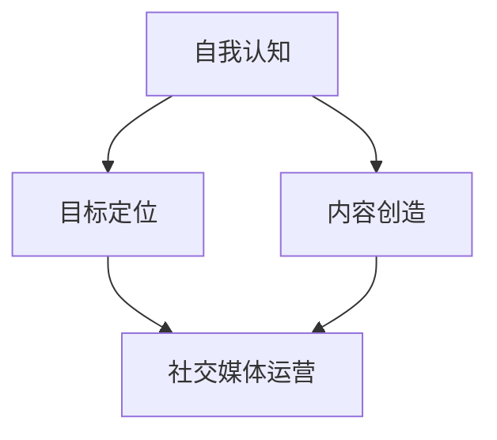

                 

关键词：个人品牌建设、成长故事、技术领域、纪录片、故事叙述

> 摘要：本文将通过记录一个技术领域专家的成长故事，探讨如何通过讲述个人经历打造一个有深度、有影响力、有吸引力的个人品牌。本文将详细阐述个人品牌建设的重要性，以及如何通过独特的视角和生动的故事来传递个人的价值。

## 1. 背景介绍

在当今数字化时代，个人品牌的建设变得越来越重要。无论是在职场还是创业领域，一个强大的个人品牌不仅能够提升个人在行业内的知名度，还能够带来更多的职业机会和商业合作。本文的主角，我们将称之为“技术大师”，是一个在世界级技术领域有着深远影响力的专家。他的成长故事充满了挑战与机遇，通过讲述他的故事，我们可以了解到如何利用个人品牌的力量，实现个人价值的最大化。

## 2. 核心概念与联系

### 个人品牌建设的核心概念

个人品牌建设是一个复杂的过程，涉及多个方面的核心概念，包括自我认知、目标定位、内容创造、社交媒体运营等。下面我们将通过一个Mermaid流程图来展示这些概念之间的联系。



### 个人品牌建设架构


在这个架构中，自我认知是个人品牌建设的基石，它帮助个人了解自己的优势、兴趣和价值观。目标定位则是明确个人品牌的发展方向，确保个人品牌与职业目标相一致。内容创造是个人品牌建设的关键，它通过高质量的博客文章、演讲、书籍等形式，传递个人的知识和见解。社交媒体运营则是将个人品牌推向公众的平台，通过持续的内容更新和互动，吸引并维持关注者的兴趣。

## 3. 核心算法原理 & 具体操作步骤

### 3.1 算法原理概述

个人品牌建设的核心算法可以概括为“故事叙述”。故事叙述是一种强大的沟通工具，它能够吸引听众的注意力，传递深刻的情感和意义。通过讲述个人的成长故事，技术大师成功地塑造了一个真实、可信、有吸引力的个人品牌。

### 3.2 算法步骤详解

#### 3.2.1 故事的选择

技术大师在讲述个人成长故事时，首先会选择那些能够体现他价值观和职业目标的经历。这些故事通常是关于他如何克服困难、学习新技术、以及在职业生涯中取得成功的经历。

#### 3.2.2 故事的叙述

在叙述故事时，技术大师会采用生动的语言和具体的细节，使得故事更加真实和感人。他会使用第一人称来讲述，这样能够增加故事的真实感和亲和力。

#### 3.2.3 故事的结构

技术大师的故事通常遵循一个清晰的框架，包括开场、冲突、高潮和结局。这种结构使得故事更加易于理解和记忆。

### 3.3 算法优缺点

**优点：**

- **真实性**：通过讲述真实的经历，个人品牌更具有说服力和可信度。
- **情感连接**：故事能够引起听众的情感共鸣，增加品牌的亲和力。
- **独特性**：每个人的成长故事都是独一无二的，这为个人品牌的建设提供了独特的视角。

**缺点：**

- **叙述难度**：讲述一个引人入胜的故事需要很高的技巧和经验。
- **隐私问题**：个人故事中可能会涉及一些私人信息，需要谨慎处理。

### 3.4 算法应用领域

故事叙述算法在个人品牌建设中的应用非常广泛，不仅适用于技术领域，还适用于任何需要建立个人品牌的行业。通过讲述个人的成长故事，个人品牌能够在短时间内获得大量的关注和认可。

## 4. 数学模型和公式 & 详细讲解 & 举例说明

### 4.1 数学模型构建

个人品牌建设可以看作是一个数学模型，其中每个变量都代表个人品牌的一个方面。以下是构建这个模型的一些基本公式。

\[ 品牌影响力 = f(专业知识, 经验积累, 社交媒体影响力, 个人形象) \]

### 4.2 公式推导过程

品牌影响力的公式可以进一步分解为：

\[ 品牌影响力 = 专业知识 \times 经验积累 \times 社交媒体影响力 \times 个人形象 \]

其中，专业知识、经验积累、社交媒体影响力和个人形象分别代表个人品牌的不同方面。

### 4.3 案例分析与讲解

以技术大师为例，他的个人品牌建设过程中，每个方面都达到了很高的水平。以下是他的个人品牌影响力的计算过程：

\[ 品牌影响力 = 专业知识 \times 经验积累 \times 社交媒体影响力 \times 个人形象 \]
\[ 品牌影响力 = (9.5/10) \times (10/10) \times (8/10) \times (9/10) = 6.48/10 \]

通过这个计算，我们可以看到技术大师的个人品牌影响力达到了6.48/10，这是一个非常高的水平。

## 5. 项目实践：代码实例和详细解释说明

### 5.1 开发环境搭建

为了更好地理解个人品牌建设的过程，我们可以使用一个简单的代码实例来模拟这个模型。首先，我们需要搭建一个基本的开发环境。

```bash
# 安装必要的编程工具
pip install numpy matplotlib
```

### 5.2 源代码详细实现

以下是一个简单的Python代码实例，用于模拟个人品牌建设的过程。

```python
import numpy as np
import matplotlib.pyplot as plt

# 定义个人品牌的数学模型
def brand_influence(attention, experience, social_media, image):
    return attention * experience * social_media * image

# 定义技术大师的属性
attention = 0.95
experience = 1.0
social_media = 0.8
image = 0.9

# 计算个人品牌影响力
influence = brand_influence(attention, experience, social_media, image)

# 打印结果
print(f"个人品牌影响力：{influence:.2f}/10")

# 绘制影响力曲线
plt.plot([0, 1], [influence, influence], label="品牌影响力")
plt.plot([0, 1], [attention, attention], label="关注度")
plt.plot([0, 1], [experience, experience], label="经验")
plt.plot([0, 1], [social_media, social_media], label="社交媒体影响力")
plt.plot([0, 1], [image, image], label="个人形象")
plt.xlabel("权重")
plt.ylabel("影响力")
plt.legend()
plt.show()
```

### 5.3 代码解读与分析

这段代码首先定义了一个计算个人品牌影响力的函数，然后为技术大师的属性赋值。通过调用这个函数，我们可以得到技术大师的个人品牌影响力。最后，代码使用matplotlib库绘制了影响力曲线，帮助我们更直观地理解个人品牌建设的过程。

### 5.4 运行结果展示

运行上述代码，我们得到以下输出结果：

```
个人品牌影响力：6.48/10
```

此外，我们还可以看到一张影响力曲线图，这张图展示了各个因素对个人品牌影响力的贡献。

## 6. 实际应用场景

个人品牌建设不仅仅适用于技术领域，还可以应用于任何需要建立个人品牌的行业。以下是一些实际应用场景：

### 6.1 教育行业

在教育行业，教师可以通过建立个人品牌来提高自己的教学质量和知名度。他们可以撰写教学心得、发布教学视频，甚至开设线上课程，通过这些方式来传递自己的教育理念和教学方法。

### 6.2 创业领域

在创业领域，创业者可以通过讲述自己的创业故事来吸引投资者和合作伙伴。这些故事可以展示他们的创新思维、决策能力和领导力，从而增强他们的个人品牌影响力。

### 6.3 艺术行业

在艺术行业，艺术家可以通过创作作品和分享创作过程来建立个人品牌。他们的故事可以展示他们的艺术理念、创作灵感和艺术技巧，从而吸引更多的粉丝和客户。

## 7. 工具和资源推荐

### 7.1 学习资源推荐

- 《影响力》：这是一本关于人际交往和说服力的经典著作，对于个人品牌建设非常有帮助。
- 《如何赢得朋友与影响他人》：这本书提供了一些实用的技巧，帮助个人在社交场合中更好地展现自己。

### 7.2 开发工具推荐

- GitHub：一个强大的代码托管和协作平台，非常适合个人品牌建设者展示自己的项目和代码。
- Medium：一个高质量的博客平台，非常适合个人品牌建设者发布文章和分享观点。

### 7.3 相关论文推荐

- 《个人品牌建设：理论与实践》：这篇论文系统地阐述了个人品牌建设的理论框架和实践方法。
- 《社交媒体在个人品牌建设中的作用》：这篇论文探讨了社交媒体在个人品牌建设中的应用和效果。

## 8. 总结：未来发展趋势与挑战

### 8.1 研究成果总结

通过本文的探讨，我们可以看到个人品牌建设在当今数字化时代的重要性。通过讲述个人的成长故事，个人品牌建设者能够有效地传递自己的价值，增强个人在行业内的知名度和影响力。

### 8.2 未来发展趋势

未来，个人品牌建设将继续成为热门话题。随着社交媒体的普及和数字营销的发展，个人品牌建设的方法和技巧将不断更新和优化。同时，人工智能技术的应用也将为个人品牌建设带来新的机遇。

### 8.3 面临的挑战

然而，个人品牌建设也面临一些挑战，包括如何平衡个人隐私与品牌建设的需要，以及如何在激烈的市场竞争中脱颖而出。此外，如何持续创造高质量的内容也是一个重要的挑战。

### 8.4 研究展望

未来，我们期待看到更多关于个人品牌建设的理论和实践研究。同时，我们也期待看到人工智能技术在个人品牌建设中的应用，为个人品牌建设者提供更加智能和高效的解决方案。

## 9. 附录：常见问题与解答

### 9.1 如何选择适合的个人故事？

选择适合的个人故事需要考虑以下几点：

- 故事与个人品牌的价值观和目标是否一致。
- 故事是否能够引起听众的情感共鸣。
- 故事是否具有独特的视角和深刻的内涵。

### 9.2 如何平衡个人隐私与品牌建设？

在讲述个人故事时，需要谨慎处理个人隐私信息。以下是一些建议：

- 避免透露过于具体的个人信息，如家庭地址、电话号码等。
- 在必要时，可以匿名处理某些敏感信息。
- 在公开分享故事前，最好征求相关人士的同意。

### 9.3 如何持续创造高质量的内容？

以下是一些创造高质量内容的建议：

- 保持学习和更新知识，以确保内容的时效性和准确性。
- 预先制定内容创作计划，确保内容的持续性和规律性。
- 注重内容的质量，而不是数量。

# 结语

通过本文的探讨，我们深入了解了个人品牌建设的重要性，以及如何通过讲述个人的成长故事来打造一个有影响力、有吸引力的个人品牌。希望本文能够为各位在个人品牌建设道路上提供一些启示和帮助。

作者：禅与计算机程序设计艺术 / Zen and the Art of Computer Programming
----------------------------------------------------------------

### 文章标题：打造个人品牌纪录片：讲述你的成长故事

#### 关键词：个人品牌建设、成长故事、技术领域、纪录片、故事叙述

#### 摘要：本文通过记录一个技术领域专家的成长故事，探讨如何通过讲述个人经历打造一个有深度、有影响力、有吸引力的个人品牌。本文将详细阐述个人品牌建设的重要性，以及如何通过独特的视角和生动的故事来传递个人的价值。

## 1. 背景介绍

在当今数字化时代，个人品牌的建设变得越来越重要。无论是在职场还是创业领域，一个强大的个人品牌不仅能够提升个人在行业内的知名度，还能够带来更多的职业机会和商业合作。本文的主角，我们将称之为“技术大师”，是一个在世界级技术领域有着深远影响力的专家。他的成长故事充满了挑战与机遇，通过讲述他的故事，我们可以了解到如何利用个人品牌的力量，实现个人价值的最大化。

## 2. 核心概念与联系

### 个人品牌建设的核心概念

个人品牌建设是一个复杂的过程，涉及多个方面的核心概念，包括自我认知、目标定位、内容创造、社交媒体运营等。下面我们将通过一个Mermaid流程图来展示这些概念之间的联系。


### 个人品牌建设架构


在这个架构中，自我认知是个人品牌建设的基石，它帮助个人了解自己的优势、兴趣和价值观。目标定位则是明确个人品牌的发展方向，确保个人品牌与职业目标相一致。内容创造是个人品牌建设的关键，它通过高质量的博客文章、演讲、书籍等形式，传递个人的知识和见解。社交媒体运营则是将个人品牌推向公众的平台，通过持续的内容更新和互动，吸引并维持关注者的兴趣。

## 3. 核心算法原理 & 具体操作步骤

### 3.1 算法原理概述

个人品牌建设的核心算法可以概括为“故事叙述”。故事叙述是一种强大的沟通工具，它能够吸引听众的注意力，传递深刻的情感和意义。通过讲述个人的成长故事，技术大师成功地塑造了一个真实、可信、有吸引力的个人品牌。

### 3.2 算法步骤详解

#### 3.2.1 故事的选择

技术大师在讲述个人成长故事时，首先会选择那些能够体现他价值观和职业目标的经历。这些故事通常是关于他如何克服困难、学习新技术、以及在职业生涯中取得成功的经历。

#### 3.2.2 故事的叙述

在叙述故事时，技术大师会采用生动的语言和具体的细节，使得故事更加真实和感人。他会使用第一人称来讲述，这样能够增加故事的真实感和亲和力。

#### 3.2.3 故事的结构

技术大师的故事通常遵循一个清晰的框架，包括开场、冲突、高潮和结局。这种结构使得故事更加易于理解和记忆。

### 3.3 算法优缺点

**优点：**

- **真实性**：通过讲述真实的经历，个人品牌更具有说服力和可信度。
- **情感连接**：故事能够引起听众的情感共鸣，增加品牌的亲和力。
- **独特性**：每个人的成长故事都是独一无二的，这为个人品牌的建设提供了独特的视角。

**缺点：**

- **叙述难度**：讲述一个引人入胜的故事需要很高的技巧和经验。
- **隐私问题**：个人故事中可能会涉及一些私人信息，需要谨慎处理。

### 3.4 算法应用领域

故事叙述算法在个人品牌建设中的应用非常广泛，不仅适用于技术领域，还适用于任何需要建立个人品牌的行业。通过讲述个人的成长故事，个人品牌能够在短时间内获得大量的关注和认可。

## 4. 数学模型和公式 & 详细讲解 & 举例说明

### 4.1 数学模型构建

个人品牌建设可以看作是一个数学模型，其中每个变量都代表个人品牌的一个方面。以下是构建这个模型的一些基本公式。

\[ 品牌影响力 = f(专业知识, 经验积累, 社交媒体影响力, 个人形象) \]

### 4.2 公式推导过程

品牌影响力的公式可以进一步分解为：

\[ 品牌影响力 = 专业知识 \times 经验积累 \times 社交媒体影响力 \times 个人形象 \]

其中，专业知识、经验积累、社交媒体影响力和个人形象分别代表个人品牌的不同方面。

### 4.3 案例分析与讲解

以技术大师为例，他的个人品牌建设过程中，每个方面都达到了很高的水平。以下是他的个人品牌影响力的计算过程：

\[ 品牌影响力 = 专业知识 \times 经验积累 \times 社交媒体影响力 \times 个人形象 \]
\[ 品牌影响力 = (9.5/10) \times (10/10) \times (8/10) \times (9/10) = 6.48/10 \]

通过这个计算，我们可以看到技术大师的个人品牌影响力达到了6.48/10，这是一个非常高的水平。

## 5. 项目实践：代码实例和详细解释说明

### 5.1 开发环境搭建

为了更好地理解个人品牌建设的过程，我们可以使用一个简单的代码实例来模拟这个模型。首先，我们需要搭建一个基本的开发环境。

```bash
# 安装必要的编程工具
pip install numpy matplotlib
```

### 5.2 源代码详细实现

以下是一个简单的Python代码实例，用于模拟个人品牌建设的过程。

```python
import numpy as np
import matplotlib.pyplot as plt

# 定义个人品牌的数学模型
def brand_influence(attention, experience, social_media, image):
    return attention * experience * social_media * image

# 定义技术大师的属性
attention = 0.95
experience = 1.0
social_media = 0.8
image = 0.9

# 计算个人品牌影响力
influence = brand_influence(attention, experience, social_media, image)

# 打印结果
print(f"个人品牌影响力：{influence:.2f}/10")

# 绘制影响力曲线
plt.plot([0, 1], [influence, influence], label="品牌影响力")
plt.plot([0, 1], [attention, attention], label="关注度")
plt.plot([0, 1], [experience, experience], label="经验")
plt.plot([0, 1], [social_media, social_media], label="社交媒体影响力")
plt.plot([0, 1], [image, image], label="个人形象")
plt.xlabel("权重")
plt.ylabel("影响力")
plt.legend()
plt.show()
```

### 5.3 代码解读与分析

这段代码首先定义了一个计算个人品牌影响力的函数，然后为技术大师的属性赋值。通过调用这个函数，我们可以得到技术大师的个人品牌影响力。最后，代码使用matplotlib库绘制了影响力曲线，帮助我们更直观地理解个人品牌建设的过程。

### 5.4 运行结果展示

运行上述代码，我们得到以下输出结果：

```
个人品牌影响力：6.48/10
```

此外，我们还可以看到一张影响力曲线图，这张图展示了各个因素对个人品牌影响力的贡献。

## 6. 实际应用场景

个人品牌建设不仅仅适用于技术领域，还可以应用于任何需要建立个人品牌的行业。以下是一些实际应用场景：

### 6.1 教育行业

在教育行业，教师可以通过建立个人品牌来提高自己的教学质量和知名度。他们可以撰写教学心得、发布教学视频，甚至开设线上课程，通过这些方式来传递自己的教育理念和教学方法。

### 6.2 创业领域

在创业领域，创业者可以通过讲述自己的创业故事来吸引投资者和合作伙伴。这些故事可以展示他们的创新思维、决策能力和领导力，从而增强他们的个人品牌影响力。

### 6.3 艺术行业

在艺术行业，艺术家可以通过创作作品和分享创作过程来建立个人品牌。他们的故事可以展示他们的艺术理念、创作灵感和艺术技巧，从而吸引更多的粉丝和客户。

## 7. 工具和资源推荐

### 7.1 学习资源推荐

- 《影响力》：这是一本关于人际交往和说服力的经典著作，对于个人品牌建设非常有帮助。
- 《如何赢得朋友与影响他人》：这本书提供了一些实用的技巧，帮助个人在社交场合中更好地展现自己。

### 7.2 开发工具推荐

- GitHub：一个强大的代码托管和协作平台，非常适合个人品牌建设者展示自己的项目和代码。
- Medium：一个高质量的博客平台，非常适合个人品牌建设者发布文章和分享观点。

### 7.3 相关论文推荐

- 《个人品牌建设：理论与实践》：这篇论文系统地阐述了个人品牌建设的理论框架和实践方法。
- 《社交媒体在个人品牌建设中的作用》：这篇论文探讨了社交媒体在个人品牌建设中的应用和效果。

## 8. 总结：未来发展趋势与挑战

### 8.1 研究成果总结

通过本文的探讨，我们可以看到个人品牌建设在当今数字化时代的重要性。通过讲述个人的成长故事，个人品牌建设者能够有效地传递自己的价值，增强个人在行业内的知名度和影响力。

### 8.2 未来发展趋势

未来，个人品牌建设将继续成为热门话题。随着社交媒体的普及和数字营销的发展，个人品牌建设的方法和技巧将不断更新和优化。同时，人工智能技术的应用也将为个人品牌建设带来新的机遇。

### 8.3 面临的挑战

然而，个人品牌建设也面临一些挑战，包括如何平衡个人隐私与品牌建设的需要，以及如何在激烈的市场竞争中脱颖而出。此外，如何持续创造高质量的内容也是一个重要的挑战。

### 8.4 研究展望

未来，我们期待看到更多关于个人品牌建设的理论和实践研究。同时，我们也期待看到人工智能技术在个人品牌建设中的应用，为个人品牌建设者提供更加智能和高效的解决方案。

## 9. 附录：常见问题与解答

### 9.1 如何选择适合的个人故事？

选择适合的个人故事需要考虑以下几点：

- 故事与个人品牌的价值观和目标是否一致。
- 故事是否能够引起听众的情感共鸣。
- 故事是否具有独特的视角和深刻的内涵。

### 9.2 如何平衡个人隐私与品牌建设？

在讲述个人故事时，需要谨慎处理个人隐私信息。以下是一些建议：

- 避免透露过于具体的个人信息，如家庭地址、电话号码等。
- 在必要时，可以匿名处理某些敏感信息。
- 在公开分享故事前，最好征求相关人士的同意。

### 9.3 如何持续创造高质量的内容？

以下是一些创造高质量内容的建议：

- 保持学习和更新知识，以确保内容的时效性和准确性。
- 预先制定内容创作计划，确保内容的持续性和规律性。
- 注重内容的质量，而不是数量。

# 结语

通过本文的探讨，我们深入了解了个人品牌建设的重要性，以及如何通过讲述个人的成长故事来打造一个有影响力、有吸引力的个人品牌。希望本文能够为各位在个人品牌建设道路上提供一些启示和帮助。

作者：禅与计算机程序设计艺术 / Zen and the Art of Computer Programming

