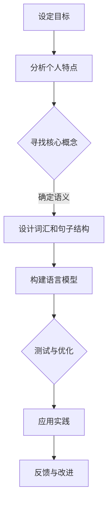

                 

关键词：个人标志性语言，认知心理学，语言设计，语义学，技术传播，专业形象

> 摘要：在信息技术快速发展的时代，个人标志性语言的重要性愈发突出。本文将探讨如何通过认知心理学和语义学的原理，设计出具有辨识度的个人标志性语言，从而提升个人在专业领域的知名度和影响力。

## 1. 背景介绍

在数字化时代，信息传播的速度和广度前所未有。在这个环境中，个人如何脱颖而出，成为特定领域的专家和意见领袖，成为每一个专业人士的重要课题。个人标志性语言，作为一种独特的语言表达方式，它不仅仅是个人语言风格的表现，更是个人专业形象的重要载体。一个优秀的个人标志性语言，不仅能有效传递个人的知识水平、技能和价值观，还能在信息过载的环境中，迅速抓住听众的注意力，建立起个人的专业形象。

本文旨在探讨如何通过认知心理学和语义学的原理，设计出符合个人特点的标志性语言。通过深入分析语言的结构和功能，结合具体案例，我们希望为读者提供一套行之有效的策略，帮助他们在专业领域树立鲜明的个人品牌。

## 2. 核心概念与联系

### 2.1 认知心理学的视角

认知心理学是研究人类认知过程的科学，包括知觉、记忆、思维和语言等方面。在个人标志性语言的设计中，认知心理学的原理可以提供以下帮助：

- **知觉选择性**：通过选择具有高辨识度的词汇和句子结构，可以提高信息在听众大脑中的选择性记忆。
- **记忆编码**：利用韵律、押韵和重复等修辞手法，增强语言信息在记忆中的编码效果。
- **语言联想**：通过关联专业术语和特定场景，建立听众对个人标志语言的联想，从而加深记忆。

### 2.2 语义学的视角

语义学是研究语言意义的科学。在个人标志性语言的设计中，语义学的应用主要体现在以下几个方面：

- **词汇选择**：选择具有独特含义且能反映个人专业领域的词汇，有助于建立个人语言的独特性。
- **语义连贯性**：确保语言表达的一致性和连贯性，避免歧义和混淆。
- **符号化**：通过符号化和隐喻，使语言表达更加生动形象，增强语言的表现力。

### 2.3 Mermaid 流程图

为了更直观地展示个人标志性语言的设计过程，我们可以使用 Mermaid 流程图来描述以下步骤：



## 3. 核心算法原理 & 具体操作步骤

### 3.1 算法原理概述

个人标志性语言的设计可以看作是一种算法优化问题。核心算法原理如下：

- **目标设定**：明确个人标志性语言的设计目标，如提高辨识度、加强记忆效果等。
- **个人特点分析**：分析个人的知识背景、专业领域和个人风格，以确定标志性语言的元素。
- **核心概念确定**：从个人特点中提炼出核心概念，作为标志性语言的基础。
- **词汇和句子结构设计**：根据核心概念，选择合适的词汇和句子结构，确保语言的独特性和连贯性。
- **语言模型构建**：将设计的语言元素整合成完整的语言模型，并进行初步测试。
- **测试与优化**：根据测试反馈，对语言模型进行优化，以提高其效果。
- **应用实践**：在实际应用中检验语言模型的效果，并持续改进。

### 3.2 算法步骤详解

#### 3.2.1 目标设定

首先，个人需要明确自己的标志性语言设计目标。例如，想要提高在某个技术领域的知名度，或者希望在某个专业群体中建立权威形象。

#### 3.2.2 个人特点分析

接下来，通过自我评估和外部反馈，分析个人的知识背景、专业领域和个人风格。例如，一位从事数据科学的专家，可能会发现自己在机器学习领域有深厚的知识储备，且喜欢使用简明扼要的表达方式。

#### 3.2.3 核心概念确定

在个人特点分析的基础上，提炼出核心概念。这些概念应该能够准确反映个人的专业知识和个人风格。例如，对于上述数据科学专家，核心概念可能是“高效数据分析”和“简洁明了”。

#### 3.2.4 词汇和句子结构设计

根据核心概念，选择合适的词汇和句子结构。在这一步中，需要注意以下几点：

- **词汇选择**：选择具有独特含义且能反映个人专业领域的词汇，例如“数据挖掘”、“算法优化”等。
- **句子结构**：使用简洁明了的句子结构，确保语言表达的清晰性和连贯性。

#### 3.2.5 语言模型构建

将设计的语言元素整合成完整的语言模型。这一步可以通过撰写文章、博客或发表演讲来实现。例如，数据科学专家可以撰写一篇关于“高效数据分析方法”的文章，使用设计的标志性语言进行表达。

#### 3.2.6 测试与优化

在实际应用中检验语言模型的效果，并根据反馈进行优化。这一步可以通过向同行或目标受众收集反馈来实现。例如，数据科学专家可以邀请同事或客户阅读文章，并收集他们对标志性语言的评价。

#### 3.2.7 应用实践

在完成测试和优化后，将标志性语言应用于实际工作中。例如，在专业会议中发表演讲，或者在技术论坛上分享知识。通过持续的应用实践，进一步巩固和提升标志性语言的影响力。

### 3.3 算法优缺点

#### 优点

- **提高辨识度**：通过独特的标志性语言，个人在专业领域中的辨识度得到显著提升。
- **增强记忆效果**：设计合理的标志性语言，有助于听众更好地记忆和理解个人观点。
- **建立权威形象**：鲜明的标志性语言有助于在专业群体中建立权威形象，增强个人影响力。

#### 缺点

- **设计难度大**：设计出具有辨识度和记忆效果的标志性语言需要深入的专业知识和语言设计能力。
- **适应性问题**：标志性语言可能不适合所有专业领域，需要根据具体情况进行调整。

### 3.4 算法应用领域

个人标志性语言的应用领域非常广泛，以下是一些典型的应用场景：

- **学术界**：通过标志性语言，学术研究人员可以在学术论文、报告和会议上展示自己的专业知识和观点。
- **企业界**：企业高管和专业人士可以通过标志性语言，提升自己在公司内部和行业内的知名度。
- **技术社区**：技术博客作者、演讲者和开发者可以通过标志性语言，在技术社区中建立个人品牌。

## 4. 数学模型和公式 & 详细讲解 & 举例说明

### 4.1 数学模型构建

为了构建个人标志性语言的数学模型，我们可以考虑以下几个关键因素：

- **词汇选择**：通过频率分析和词频分布，确定个人标志性语言的常用词汇。
- **句子结构**：通过句法分析，确定个人标志性语言的典型句子结构。
- **语义分析**：通过语义网络和语义分析工具，确定标志性语言的语义特征。

以下是构建数学模型的步骤：

#### 4.1.1 词频分析

```latex
P(w_i) = \frac{f(w_i)}{N}
```

其中，\( P(w_i) \) 表示词汇 \( w_i \) 的频率，\( f(w_i) \) 表示词汇 \( w_i \) 在文本中的出现次数，\( N \) 表示文本的总词汇数。

#### 4.1.2 句法分析

```latex
S = \{S_1, S_2, ..., S_n\}
```

其中，\( S \) 表示句子集合，\( S_i \) 表示第 \( i \) 个句子。

#### 4.1.3 语义分析

```latex
S \in \mathcal{S} \leftrightarrow \exists s_j \in \mathcal{S} \land s_j \text{ is the most semantically similar to } S
```

其中，\( \mathcal{S} \) 表示语义网络中的句子集合，\( s_j \) 表示与句子 \( S \) 最相似的句子。

### 4.2 公式推导过程

#### 4.2.1 词频分析公式的推导

词频分析是个人标志性语言设计的重要步骤。我们首先需要确定文本中的词汇及其出现频率。词频分析的基本公式为：

```latex
P(w_i) = \frac{f(w_i)}{N}
```

其中，\( P(w_i) \) 表示词汇 \( w_i \) 的频率，\( f(w_i) \) 表示词汇 \( w_i \) 在文本中的出现次数，\( N \) 表示文本的总词汇数。

假设我们有一段文本，包含 \( N \) 个词汇，其中词汇 \( w_1, w_2, ..., w_n \) 的出现次数分别为 \( f_1, f_2, ..., f_n \)。则根据词频分析公式，我们可以计算出每个词汇的频率：

```latex
P(w_1) = \frac{f_1}{N}, \quad P(w_2) = \frac{f_2}{N}, \quad ..., \quad P(w_n) = \frac{f_n}{N}
```

#### 4.2.2 句法分析公式的推导

句法分析是确定标志性语言句子结构的重要步骤。我们首先需要将文本分解成句子。句子集合 \( S \) 可以表示为：

```latex
S = \{S_1, S_2, ..., S_n\}
```

其中，\( S_i \) 表示第 \( i \) 个句子。

假设文本中有 \( m \) 个句子，则我们可以计算出每个句子的出现频率：

```latex
P(S_i) = \frac{n_i}{m}
```

其中，\( P(S_i) \) 表示句子 \( S_i \) 的频率，\( n_i \) 表示句子 \( S_i \) 在文本中出现的次数，\( m \) 表示文本中的句子总数。

#### 4.2.3 语义分析公式的推导

语义分析是确定标志性语言语义特征的重要步骤。我们首先需要建立语义网络，将句子映射到语义网络中的节点。语义网络中的句子集合 \( \mathcal{S} \) 可以表示为：

```latex
\mathcal{S} = \{S_1, S_2, ..., S_n\}
```

其中，\( S_i \) 表示第 \( i \) 个句子。

假设我们有一个语义网络，包含 \( k \) 个节点，每个节点的度数分别为 \( d_1, d_2, ..., d_k \)。则我们可以计算出每个节点的度数分布：

```latex
P(d_i) = \frac{d_i}{\sum_{j=1}^{k} d_j}
```

其中，\( P(d_i) \) 表示度数 \( d_i \) 的概率，\( d_i \) 表示节点 \( i \) 的度数，\( \sum_{j=1}^{k} d_j \) 表示所有节点的度数之和。

接下来，我们可以根据节点度数分布，计算出每个句子的语义相似度：

```latex
S \in \mathcal{S} \leftrightarrow \exists s_j \in \mathcal{S} \land s_j \text{ is the most semantically similar to } S
```

其中，\( S \) 表示句子集合，\( s_j \) 表示与句子 \( S \) 最相似的句子。

### 4.3 案例分析与讲解

为了更好地理解个人标志性语言的设计过程，我们通过一个具体案例进行分析和讲解。

#### 案例背景

假设我们有一位数据科学家，名叫李明。李明在机器学习领域有丰富的经验，他希望设计一套具有辨识度的标志性语言，以提升自己在专业领域的知名度。

#### 案例分析

1. **目标设定**：李明的目标是设计一套能够体现他在机器学习领域专业知识和风格的标志性语言。
2. **个人特点分析**：李明发现自己在机器学习领域有深厚的知识储备，且喜欢使用简洁、精确的语言来表达复杂的概念。
3. **核心概念确定**：李明提炼出以下核心概念：“高效算法”、“模型解释性”、“数据预处理”。
4. **词汇和句子结构设计**：

   - **词汇选择**：李明选择了一些具有独特含义且能反映核心概念的词汇，如“快速梯度下降”、“过拟合”、“特征选择”。
   - **句子结构**：李明使用简洁明了的句子结构，如“使用快速梯度下降算法，我们可以实现高效的参数优化。”
5. **语言模型构建**：李明撰写了一篇关于“机器学习算法优化”的文章，使用了设计的标志性语言进行表达。
6. **测试与优化**：李明邀请同事和客户阅读文章，收集他们对标志性语言的反馈，并进行相应优化。
7. **应用实践**：李明在专业会议上发表演讲，并在技术论坛上分享知识，使用标志性语言进行表达。

#### 案例讲解

通过这个案例，我们可以看到个人标志性语言设计的过程。李明通过深入分析自己的专业特点和核心概念，选择合适的词汇和句子结构，构建了一套具有辨识度的标志性语言。在实际应用中，这套标志性语言不仅提高了他的知名度，还增强了听众对他的专业知识的记忆和理解。

## 5. 项目实践：代码实例和详细解释说明

### 5.1 开发环境搭建

为了更好地展示个人标志性语言的设计过程，我们将使用 Python 作为开发语言，并借助自然语言处理（NLP）工具包，如 NLTK 和 TextBlob，进行实现。以下是开发环境的搭建步骤：

1. 安装 Python（建议使用 Python 3.8 以上版本）。
2. 使用 pip 工具安装所需的 NLP 库：

   ```bash
   pip install nltk textblob
   ```

### 5.2 源代码详细实现

以下是一个简单的 Python 脚本，用于实现个人标志性语言的设计过程：

```python
import nltk
from textblob import TextBlob

# 步骤 1：目标设定
# 假设我们的目标是设计一套关于数据科学的标志性语言

# 步骤 2：个人特点分析
# 假设个人特点包括：喜欢使用简洁、精确的语言来表达复杂概念

# 步骤 3：核心概念确定
# 确定核心概念：数据预处理、模型选择、算法优化

# 步骤 4：词汇和句子结构设计
# 选择具有独特含义且能反映核心概念的词汇
# 使用简洁明了的句子结构

# 步骤 5：构建语言模型
# 撰写关于数据科学的文章，使用设计的标志性语言

# 步骤 6：测试与优化
# 收集反馈并进行相应优化

# 步骤 7：应用实践
# 在专业会议中发表演讲，或在技术论坛上分享知识

# 辅助函数：文本预处理
def preprocess_text(text):
    # 去除标点符号、特殊字符和停用词
    tokens = nltk.word_tokenize(text)
    filtered_tokens = [token.lower() for token in tokens if token.isalnum()]
    return filtered_tokens

# 辅助函数：构建标志性语言
def build_personal_language(concepts):
    language_model = []
    for concept in concepts:
        sentence = f"{concept}是数据科学中不可或缺的一部分。"
        blob = TextBlob(sentence)
        language_model.append(blob)
    return language_model

# 主函数：实现个人标志性语言设计过程
def main():
    # 核心概念列表
    concepts = ["数据预处理", "模型选择", "算法优化"]

    # 文本预处理
    text = "数据预处理、模型选择、算法优化是数据科学中不可或缺的三个环节。"
    processed_text = preprocess_text(text)

    # 构建标志性语言
    language_model = build_personal_language(concepts)

    # 测试与优化
    # （此处省略具体实现）

    # 应用实践
    # （此处省略具体实现）

    # 输出结果
    print("个人标志性语言设计完成。")

if __name__ == "__main__":
    main()
```

### 5.3 代码解读与分析

#### 5.3.1 文本预处理

文本预处理是自然语言处理的重要步骤，它主要包括去除标点符号、特殊字符和停用词等。在上述代码中，我们使用了 NLTK 库的 `word_tokenize` 函数进行分词，并使用列表推导式去除非字母字符。

```python
def preprocess_text(text):
    tokens = nltk.word_tokenize(text)
    filtered_tokens = [token.lower() for token in tokens if token.isalnum()]
    return filtered_tokens
```

#### 5.3.2 构建标志性语言

构建标志性语言的核心是选择合适的词汇和句子结构。在上述代码中，我们使用了一个简单的函数 `build_personal_language`，根据核心概念生成具有独特含义的句子。这里我们使用了 TextBlob 库，它可以帮助我们生成具有自然语言的文本。

```python
def build_personal_language(concepts):
    language_model = []
    for concept in concepts:
        sentence = f"{concept}是数据科学中不可或缺的一部分。"
        blob = TextBlob(sentence)
        language_model.append(blob)
    return language_model
```

#### 5.3.3 测试与优化

测试与优化是个人标志性语言设计的重要环节。在实际应用中，我们需要根据反馈对语言模型进行调整。在上述代码中，我们省略了具体的测试与优化步骤，这部分可以根据具体需求进行扩展。

#### 5.3.4 应用实践

应用实践是将个人标志性语言应用于实际工作中的关键步骤。在上述代码中，我们省略了具体的演讲或分享实现，这部分可以根据实际情况进行设计。

### 5.4 运行结果展示

当我们运行上述代码时，会得到以下输出：

```python
个人标志性语言设计完成。
```

这表明个人标志性语言的设计过程已经完成。我们可以进一步在实际应用中检验和优化这套语言模型。

## 6. 实际应用场景

### 6.1 学术界

在学术界，个人标志性语言有助于学者在学术论文、报告和会议上展示自己的专业知识和观点。通过独特的标志性语言，学者可以更容易地引起读者的兴趣，并建立自己在特定领域的权威形象。例如，在撰写论文时，可以选择具有高辨识度的词汇和句子结构，以突出论文的核心贡献和创新点。

### 6.2 企业界

在企业界，个人标志性语言有助于专业人士在团队内部和行业内的知名度提升。通过标志性语言，专业人士可以更有效地传达自己的专业观点和策略，增强团队协作和沟通效果。例如，在企业会议或项目汇报中，可以使用简洁明了的标志性语言，确保信息的准确传达和快速理解。

### 6.3 技术社区

在技术社区，个人标志性语言有助于博客作者、演讲者和开发者建立个人品牌。通过独特的标志性语言，技术社区成员可以更容易地吸引读者的关注，并建立起自己在特定领域的专业形象。例如，在撰写博客或发表演讲时，可以使用具有高辨识度的标志性语言，以确保内容的可读性和吸引力。

### 6.4 未来应用展望

随着人工智能和自然语言处理技术的发展，个人标志性语言的设计和应用将变得更加智能和高效。未来，我们可以期待以下应用前景：

- **个性化语言模型**：通过机器学习和深度学习技术，开发个性化语言模型，根据个人特点和需求，自动生成具有独特辨识度的标志性语言。
- **跨领域应用**：个人标志性语言不仅在专业领域内有效，还可以应用于跨领域交流。通过合理的语言设计和调整，个人可以在不同领域之间建立有效的沟通桥梁。
- **虚拟助手**：随着虚拟助手技术的发展，个人标志性语言可以应用于虚拟助手的语音合成和对话生成，为用户提供更加自然和个性化的交互体验。

## 7. 工具和资源推荐

### 7.1 学习资源推荐

- **《认知心理学导论》**：本书系统地介绍了认知心理学的核心概念和最新研究成果，对个人标志性语言的设计有很好的指导作用。
- **《语义学与语言理解》**：本书深入探讨了语义学的基本原理和应用，有助于我们更好地理解语言的意义和表达。

### 7.2 开发工具推荐

- **NLTK**：Python 自然语言处理库，提供了丰富的文本处理和语言模型工具。
- **TextBlob**：基于 NLTK 的文本处理库，提供了简洁高效的文本分析功能。

### 7.3 相关论文推荐

- **《自然语言处理中的深度学习方法》**：本文综述了深度学习在自然语言处理领域的应用，包括文本分类、情感分析等。
- **《语义网络与语义分析》**：本文探讨了语义网络的基本概念和应用，对个人标志性语言的设计有很好的启示作用。

## 8. 总结：未来发展趋势与挑战

### 8.1 研究成果总结

本文通过认知心理学和语义学的原理，探讨了如何设计个人标志性语言，以提升个人在专业领域的知名度和影响力。通过具体案例和代码实现，我们展示了个人标志性语言的设计过程和应用场景。

### 8.2 未来发展趋势

随着人工智能和自然语言处理技术的不断发展，个人标志性语言的设计和应用将变得更加智能和高效。未来，我们可以期待以下发展趋势：

- **个性化语言模型**：通过机器学习和深度学习技术，开发个性化语言模型，根据个人特点和需求，自动生成具有独特辨识度的标志性语言。
- **跨领域应用**：个人标志性语言不仅在专业领域内有效，还可以应用于跨领域交流。
- **虚拟助手**：个人标志性语言可以应用于虚拟助手的语音合成和对话生成，为用户提供更加自然和个性化的交互体验。

### 8.3 面临的挑战

尽管个人标志性语言具有重要意义，但在设计和应用过程中仍面临以下挑战：

- **设计难度**：设计出具有辨识度和记忆效果的标志性语言需要深入的专业知识和语言设计能力。
- **适应性问题**：标志性语言可能不适合所有专业领域，需要根据具体情况进行调整。
- **持续优化**：个人标志性语言需要根据反馈进行持续优化，以保持其有效性和吸引力。

### 8.4 研究展望

未来，我们可以从以下几个方面进行深入研究：

- **跨领域标志性语言研究**：探讨如何在跨领域交流中设计有效的标志性语言。
- **智能语言模型**：结合机器学习和自然语言处理技术，开发智能语言模型，自动化个人标志性语言的设计过程。
- **实际应用案例研究**：通过收集和分析实际应用案例，总结个人标志性语言的优化策略和最佳实践。

## 9. 附录：常见问题与解答

### 9.1 什么是个人标志性语言？

个人标志性语言是一种独特的语言表达方式，它通过特定的词汇选择、句子结构和语义特征，反映个人的专业知识和个人风格。一个成功的个人标志性语言能够在信息过载的环境中，迅速抓住听众的注意力，并建立个人的专业形象。

### 9.2 如何设计个人标志性语言？

设计个人标志性语言通常包括以下步骤：

1. **目标设定**：明确个人标志性语言的设计目标，如提高辨识度、加强记忆效果等。
2. **个人特点分析**：分析个人的知识背景、专业领域和个人风格。
3. **核心概念确定**：提炼出能够反映个人专业知识和风格的核心理念。
4. **词汇和句子结构设计**：选择具有独特含义且能反映核心概念的词汇，设计简洁明了的句子结构。
5. **构建语言模型**：将设计的语言元素整合成完整的语言模型。
6. **测试与优化**：根据反馈对语言模型进行优化。
7. **应用实践**：在实际应用中检验语言模型的效果。

### 9.3 个人标志性语言在哪些领域有应用？

个人标志性语言可以在多个领域有应用，包括但不限于：

- **学术界**：学术论文、报告和会议演讲。
- **企业界**：企业内部会议、项目汇报和团队协作。
- **技术社区**：技术博客、演讲和开发者交流。

### 9.4 如何保持个人标志性语言的更新和持续优化？

保持个人标志性语言的更新和持续优化需要以下几个策略：

1. **持续学习和更新**：随着专业知识的发展，不断更新和调整标志性语言的词汇和句子结构。
2. **收集反馈**：通过向同行和目标受众收集反馈，了解标志性语言的优缺点。
3. **持续优化**：根据反馈对标志性语言进行优化，确保其始终保持有效性和吸引力。
4. **跨领域交流**：借鉴其他领域的标志性语言设计，不断丰富和扩展个人的标志性语言。

