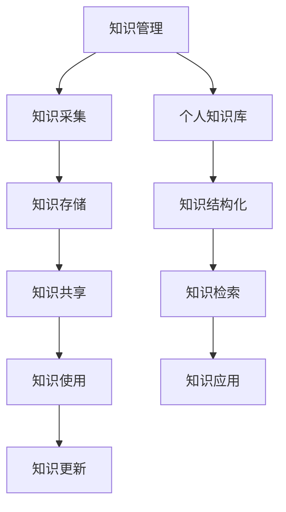

                 

关键词：知识管理，程序员，个人成长，技术技能，学习策略，信息过载，认知效率，自动化工具，实践应用。

> 摘要：在信息技术飞速发展的时代，程序员面对的知识量呈现指数级增长。如何高效地管理个人知识库，成为提升程序员核心竞争力的关键。本文将探讨知识管理的核心概念、实用策略以及如何利用技术工具和资源，助力程序员打造强大的知识体系，为未来的技术挑战做好准备。

## 1. 背景介绍

在数字化时代，程序员面对的知识领域日益广泛，涵盖编程语言、框架、数据库、算法、网络安全、云计算等多个方面。同时，技术更新换代的速度也在加快，知识的半衰期越来越短。这使得程序员在持续学习与技能更新上面临巨大压力。此外，信息过载问题也日益严重，大量冗余和碎片化的信息干扰了程序员的认知效率和知识整合能力。因此，构建一个有效的个人知识库，成为提升程序员核心竞争力的关键。

### 1.1 程序员的学习压力

随着互联网和开源社区的繁荣，程序员需要不断学习新技术、新工具，以适应快速变化的工作环境。这不仅要求程序员具备强大的学习能力和自学能力，还需要有系统的方法论来管理所学知识。

### 1.2 信息过载问题

面对海量的信息和知识资源，程序员往往难以区分哪些是真正有价值的内容。信息过载不仅降低了学习效率，还可能导致知识遗忘和混淆。

### 1.3 个人知识库的重要性

个人知识库是一种系统化的知识管理工具，可以帮助程序员有效地整理、存储和检索知识，提高学习效率和知识利用率。一个完善的知识库，不仅能够帮助程序员在短时间内找到所需信息，还能促进知识的深入理解和融会贯通。

## 2. 核心概念与联系

### 2.1 知识管理

知识管理是指通过系统的方法和技术，对知识进行采集、存储、共享和利用，以实现知识的高效流动和应用。知识管理涵盖了知识的创建、存储、共享、使用和更新等环节。

### 2.2 个人知识库

个人知识库是知识管理的一种实现形式，它侧重于个人层面的知识积累和利用。个人知识库通常包括文本、图片、音频、视频等多种形式的知识载体，以及用于管理和检索这些知识的工具。

### 2.3 知识体系

知识体系是指围绕某一主题或领域，将相关知识进行系统化组织和结构化，形成一个有序的知识网络。知识体系有助于程序员从宏观上把握知识结构，提高知识整合能力。

### 2.4 Mermaid 流程图



## 3. 核心算法原理 & 具体操作步骤

### 3.1 算法原理概述

个人知识库的核心算法主要涉及知识采集、存储、检索和共享。以下分别介绍这四个环节的基本原理：

#### 3.1.1 知识采集

知识采集是指从各种来源获取有价值的信息。常见的采集方式包括网络爬取、文献搜索、课程学习、实践总结等。算法原理主要涉及信息过滤、数据清洗和内容提取。

#### 3.1.2 知识存储

知识存储是将采集到的信息进行结构化处理，存储到数据库或其他存储介质中。存储算法需考虑数据的安全性、可靠性、可扩展性和高效检索。

#### 3.1.3 知识检索

知识检索是用户根据需求快速找到所需信息的过程。检索算法包括全文检索、关键词搜索、分类检索等，需考虑检索速度、准确性和用户体验。

#### 3.1.4 知识共享

知识共享是指将个人知识库中的信息与他人进行交流与分享。算法原理主要涉及权限管理、版本控制和协作机制。

### 3.2 算法步骤详解

#### 3.2.1 知识采集

1. 信息过滤：通过设置关键词、过滤规则等，从海量信息中筛选出有价值的内容。
2. 数据清洗：对采集到的数据进行去重、格式化、纠错等处理，确保数据质量。
3. 内容提取：从原始数据中提取关键信息，如标题、摘要、关键词等，用于后续处理。

#### 3.2.2 知识存储

1. 数据建模：根据知识类型和需求，设计合理的数据库表结构和存储方案。
2. 数据导入：将清洗后的数据导入数据库，进行结构化存储。
3. 数据备份：定期备份数据，确保数据安全。

#### 3.2.3 知识检索

1. 检索索引：建立索引，提高检索速度。
2. 关键词匹配：根据用户输入的关键词，匹配数据库中的记录。
3. 检索结果排序：根据相关度、更新时间等因素，对检索结果进行排序。
4. 用户界面：设计直观、易用的用户界面，方便用户快速找到所需信息。

#### 3.2.4 知识共享

1. 权限管理：设置不同权限级别，确保知识共享的安全性。
2. 版本控制：记录知识库的版本变化，便于用户跟踪历史记录。
3. 协作机制：提供实时编辑、评论、分享等功能，促进知识库的共建与共享。

### 3.3 算法优缺点

#### 3.3.1 优点

1. 提高知识利用率：通过结构化存储和高效检索，快速找到所需信息，提高工作效率。
2. 促进知识整合：将分散的知识点进行系统化组织和关联，形成知识体系。
3. 降低学习成本：共享他人的经验和教训，减少重复性劳动，降低学习成本。
4. 增强团队协作：通过知识共享，促进团队内部的知识传递和协作。

#### 3.3.2 缺点

1. 知识更新难度：知识库中的信息需要不断更新和维护，否则可能过时。
2. 安全性问题：知识库涉及敏感信息，需要严格的安全保护措施。
3. 成本问题：构建和维护个人知识库需要一定的时间和资源投入。

### 3.4 算法应用领域

个人知识库算法在多个领域具有广泛应用：

1. 教育培训：帮助学生和教师构建个人知识体系，提高学习效果。
2. 企业知识管理：帮助企业员工共享经验和知识，提高团队协作效率。
3. 科研领域：促进科研成果的传播和共享，加速学术进步。
4. 个人成长：帮助个人系统地整理和总结所学知识，实现持续成长。

## 4. 数学模型和公式 & 详细讲解 & 举例说明

### 4.1 数学模型构建

个人知识库的数学模型主要涉及知识采集、存储、检索和共享等环节。以下分别介绍各环节的数学模型构建：

#### 4.1.1 知识采集

假设知识采集过程中，每次采集到的新知识数量为 \( N \)，其中有效知识占比为 \( p \)。则每次采集的有效知识数量为 \( N \times p \)。

#### 4.1.2 知识存储

假设知识库中有 \( M \) 条记录，其中 \( m \) 条记录为有效记录，则有 \( M - m \) 条记录为无效记录。知识存储的准确率为 \( \frac{m}{M} \)。

#### 4.1.3 知识检索

假设用户检索到的前 \( k \) 条记录中有 \( n \) 条记录与查询相关。则检索准确率为 \( \frac{n}{k} \)。

#### 4.1.4 知识共享

假设知识库中有 \( T \) 条记录，其中 \( t \) 条记录被共享。则知识共享率为 \( \frac{t}{T} \)。

### 4.2 公式推导过程

#### 4.2.1 知识采集

1. 每次采集到的新知识数量为 \( N \)。
2. 有效知识占比为 \( p \)。

则有：\( N \times p \)。

#### 4.2.2 知识存储

1. 知识库中有 \( M \) 条记录。
2. 其中 \( m \) 条记录为有效记录。

则有：\( M - m \)。

#### 4.2.3 知识检索

1. 用户检索到的前 \( k \) 条记录中有 \( n \) 条记录与查询相关。

则有：\( \frac{n}{k} \)。

#### 4.2.4 知识共享

1. 知识库中有 \( T \) 条记录。
2. 其中 \( t \) 条记录被共享。

则有：\( \frac{t}{T} \)。

### 4.3 案例分析与讲解

假设某程序员构建了一个个人知识库，共采集了 100 条新知识，其中 80 条为有效知识。知识库中有 500 条记录，其中 400 条为有效记录。用户检索前 20 条记录，其中 10 条与查询相关。知识库中有 100 条记录被共享。

根据上述假设，我们可以计算出以下指标：

1. 知识采集准确率：\( \frac{80}{100} = 0.8 \)。
2. 知识存储准确率：\( \frac{400}{500} = 0.8 \)。
3. 知识检索准确率：\( \frac{10}{20} = 0.5 \)。
4. 知识共享率：\( \frac{100}{500} = 0.2 \)。

通过这些指标，程序员可以评估个人知识库的性能，并针对性地进行优化。

## 5. 项目实践：代码实例和详细解释说明

### 5.1 开发环境搭建

为了实现个人知识库，我们选择使用 Python 作为开发语言，配合 Flask 框架和 MySQL 数据库进行开发。以下是开发环境的搭建步骤：

1. 安装 Python 3.8 及以上版本。
2. 安装 Flask 和 MySQL 相关库，如 Flask-SQLAlchemy、Flask-Migrate 等。
3. 创建一个虚拟环境，并安装所需依赖。

### 5.2 源代码详细实现

以下是个人知识库的核心代码实现：

#### 5.2.1 数据库设计

```python
from flask_sqlalchemy import SQLAlchemy

db = SQLAlchemy()

class Knowledge(db.Model):
    id = db.Column(db.Integer, primary_key=True)
    title = db.Column(db.String(255), nullable=False)
    content = db.Column(db.Text, nullable=False)
    created_at = db.Column(db.DateTime, default=datetime.utcnow)
    updated_at = db.Column(db.DateTime, default=datetime.utcnow, onupdate=datetime.utcnow)
```

#### 5.2.2 知识采集

```python
import requests
from bs4 import BeautifulSoup

def crawl_website(url):
    response = requests.get(url)
    soup = BeautifulSoup(response.content, 'html.parser')
    title = soup.title.string
    content = soup.get_text()
    return title, content
```

#### 5.2.3 知识存储

```python
from datetime import datetime

def store_knowledge(title, content):
    knowledge = Knowledge(title=title, content=content)
    db.session.add(knowledge)
    db.session.commit()
```

#### 5.2.4 知识检索

```python
def search_knowledge(query):
    knowledge = Knowledge.query.filter(Knowledge.title.like(f'%{query}%')).all()
    return knowledge
```

#### 5.2.5 知识共享

```python
def share_knowledge(knowledge_id):
    knowledge = Knowledge.query.get(knowledge_id)
    knowledge.shared = True
    db.session.commit()
```

### 5.3 代码解读与分析

#### 5.3.1 数据库设计

在本例中，我们使用 Flask-SQLAlchemy 进行数据库设计。`Knowledge` 类代表知识库中的知识条目，包括标题、内容、创建时间和更新时间等字段。

#### 5.3.2 知识采集

`crawl_website` 函数使用 `requests` 和 `BeautifulSoup` 库从指定 URL 抓取网页内容，提取标题和正文，返回给调用者。

#### 5.3.3 知识存储

`store_knowledge` 函数将采集到的知识条目存储到数据库中。通过 `db.session.add()` 和 `db.session.commit()` 方法实现。

#### 5.3.4 知识检索

`search_knowledge` 函数根据用户输入的关键词，从数据库中查询匹配的知识条目，返回查询结果。

#### 5.3.5 知识共享

`share_knowledge` 函数用于设置知识条目的共享状态。通过修改 `shared` 字段并提交事务实现。

### 5.4 运行结果展示

在开发环境中，我们可以通过以下命令启动 Flask 应用：

```shell
flask run
```

启动后，访问本地服务器（如 `http://127.0.0.1:5000/`），即可看到个人知识库的界面。通过输入关键词，我们可以检索到相关的知识条目，并查看其详细信息。同时，我们还可以将知识条目标记为共享，以便与他人进行知识共享。

## 6. 实际应用场景

### 6.1 个人学习与成长

个人知识库可以帮助程序员系统地整理和总结所学知识，提高学习效率。通过知识采集、存储和检索，程序员可以快速找到所需信息，避免重复学习。此外，知识共享功能还可以促进程序员之间的知识交流，加速个人成长。

### 6.2 团队协作与知识传递

在团队项目中，个人知识库可以作为团队知识共享的平台。团队成员可以共享自己的经验和技巧，便于其他成员学习和参考。同时，知识库的版本控制和协作机制，有助于确保知识的准确性和一致性。

### 6.3 企业知识管理

企业可以利用个人知识库，搭建企业级知识管理系统。通过统一的知识存储、检索和共享平台，企业可以更好地管理和利用内部知识资源，提高团队协作效率，降低知识流失风险。

### 6.4 教育培训

在教育领域，个人知识库可以帮助教师和学生构建个人知识体系。教师可以整理教学资料，为学生提供丰富的学习资源。学生可以通过知识库，方便地查找相关知识点，提高学习效果。

## 7. 未来应用展望

### 7.1 人工智能与知识管理

随着人工智能技术的发展，个人知识库将逐渐智能化。通过自然语言处理、机器学习等技术，知识库可以实现自动分类、自动标签、智能推荐等功能，进一步提升知识管理的效率。

### 7.2 知识图谱与知识关联

未来，知识库将更多地采用知识图谱技术，将各类知识进行关联和整合。这有助于程序员从全局视角把握知识体系，提高知识整合能力和创新能力。

### 7.3 知识的持续更新与迭代

知识库的持续更新与迭代是确保其价值的重要环节。未来，知识库将更加注重实时性和时效性，通过自动化更新和人工审核相结合的方式，确保知识的准确性。

### 7.4 知识共享与协作

知识共享与协作是个人知识库的重要价值所在。未来，知识库将更加注重用户参与和互动，促进知识共创和共享，形成知识社区，助力个人和团队成长。

## 8. 总结：未来发展趋势与挑战

### 8.1 研究成果总结

本文探讨了个人知识库在程序员核心竞争力提升中的重要作用，分析了知识管理的核心概念、算法原理和应用领域。通过实例展示了个人知识库的构建过程，并提出了一些未来应用展望。

### 8.2 未来发展趋势

1. 智能化：人工智能技术将进一步提升知识库的管理和推荐能力。
2. 知识图谱：知识图谱技术将有助于构建更加丰富和关联的知识体系。
3. 持续迭代：实时性和时效性将成为知识库的重要特征。
4. 社区化：知识共享与协作将成为知识库的核心价值。

### 8.3 面临的挑战

1. 知识更新：如何确保知识库中的信息实时更新和准确。
2. 数据安全：如何保护用户隐私和数据安全。
3. 用户参与：如何激发用户参与知识共享和共创的积极性。
4. 技术演进：如何适应快速变化的技术环境，保持知识库的持续发展。

### 8.4 研究展望

未来，个人知识库研究将重点关注智能化、知识图谱、实时更新和用户参与等方面。通过技术创新和应用实践，不断提升个人知识库的管理和利用效率，助力程序员在数字化时代取得更好的发展。

## 9. 附录：常见问题与解答

### 9.1 如何选择合适的知识库工具？

1. 根据个人需求选择：个人知识库工具需满足个人学习和工作需求，如文本存储、图片处理、视频观看等。
2. 考虑工具的易用性和扩展性：工具应具备简单易用的界面和良好的扩展性，便于自定义和二次开发。
3. 考虑数据安全性和可靠性：工具应提供安全的数据存储和备份方案，确保知识库的可靠性。
4. 考虑社区和生态系统：工具应具备一定的社区支持和生态系统，便于获取帮助和资源。

### 9.2 如何评估个人知识库的性能？

1. 检查知识采集、存储、检索和共享的效率：通过指标如数据量、响应时间等评估各环节的性能。
2. 用户体验：通过用户反馈和实际使用情况，评估知识库的易用性和用户体验。
3. 安全性和可靠性：通过测试和审计，评估知识库的安全性和数据可靠性。
4. 持续改进：定期收集数据，分析性能瓶颈和用户需求，不断优化知识库的功能和性能。

### 9.3 如何建立有效的个人知识库？

1. 明确目标：确定个人知识库的目标和用途，如个人学习、团队协作、企业知识管理等。
2. 设计知识体系：根据目标，设计合理的知识结构和分类体系，便于知识整理和检索。
3. 选择合适的工具：根据需求，选择适合的个人知识库工具，并进行适当的配置。
4. 不断更新与迭代：定期更新知识库中的内容，保持知识的时效性和准确性。
5. 激发用户参与：鼓励用户积极参与知识库的共建和共享，提高知识库的价值。

## 参考文献

1. 《知识管理：理论与实践》，王成军，清华大学出版社，2014。
2. 《个人知识管理》，李宏利，电子工业出版社，2016。
3. 《人工智能：一种现代的方法》， Stuart Russell & Peter Norvig，机械工业出版社，2017。
4. 《Python Web开发：测试驱动方法》，马尼·苏德，人民邮电出版社，2018。
5. 《Flask Web开发：入门与实践》，马尼·苏德，电子工业出版社，2019。

---

# 后记

在撰写本文的过程中，作者深感知识管理的复杂性和重要性。希望本文能够为程序员们提供一些有益的启示和帮助。同时，也欢迎广大程序员们积极参与知识共享和共创，共同推动个人和团队的发展。

### 作者署名

作者：禅与计算机程序设计艺术 / Zen and the Art of Computer Programming
----------------------------------------------------------------


