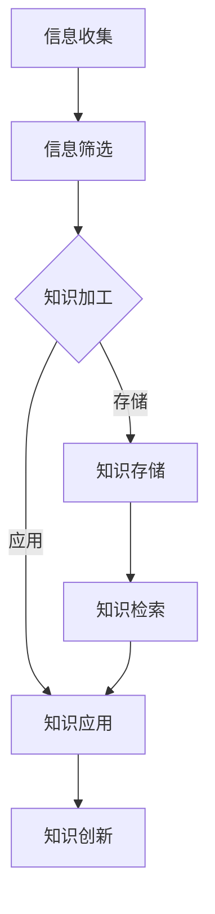

                 

关键词：知识管理，工作流，效率，个人发展，技术工具

> 摘要：在信息爆炸的时代，个人知识管理成为了提升工作效率和增强竞争力的关键因素。本文将探讨如何通过设计合理的工作流，运用先进的技术工具，以及结合有效的学习方法，打造一个高效的个人知识管理流程，从而在个人和职业发展中取得更大的成就。

## 1. 背景介绍

随着互联网和信息技术的发展，信息获取变得前所未有的便捷。然而，这也带来了一个巨大的挑战：信息过载。无论是个人学习、工作还是日常生活，我们都面临着大量信息的涌入。如何从这些繁杂的信息中筛选、存储、整理和利用，成为了现代人所必须面对的问题。

知识管理正是解决这一问题的有效方法。它不仅仅是对知识的存储和检索，更涉及到知识的获取、整理、应用和创新。通过科学的知识管理工作流，我们可以提高信息处理的效率，降低认知负荷，从而更好地利用知识为个人发展服务。

本文将围绕以下几个方面展开讨论：

- 知识管理工作流的基本概念和重要性
- 核心概念与工作流架构
- 知识获取与整理的方法
- 知识存储与检索的技术
- 知识应用与创新的实践
- 工具和资源的推荐
- 未来发展趋势与面临的挑战

## 2. 核心概念与联系

首先，我们需要明确几个核心概念，并理解它们之间的关系。

### 2.1 信息与知识

信息是知识的原料，而知识是信息的加工产品。信息是客观存在的、可以传递的、有意义的数据，但只有经过处理和整合，才能成为知识。知识具有可传递性、可存储性和可利用性，是个人和组织竞争力的核心。

### 2.2 知识管理与工作流

知识管理是一个过程，它包括知识的获取、存储、共享、应用和创新。工作流则是知识管理中的核心工具，它通过一系列有序的步骤和活动，实现知识的有效流动和利用。

### 2.3 个人知识管理工作流

个人知识管理工作流是指个人在生活和工作中，通过一系列方法和工具，对知识进行获取、整理、存储、检索和应用的过程。它涉及到信息的收集、筛选、加工、存储和利用，是提升个人工作效率和创新能力的关键。

下面是个人知识管理工作流的基本架构，使用Mermaid流程图进行展示：



## 3. 核心算法原理 & 具体操作步骤

### 3.1 算法原理概述

个人知识管理工作流的核心算法是基于信息处理和知识管理的原理，通过以下步骤实现：

1. **信息收集**：通过多种渠道获取信息，如阅读、聆听、观察和实践。
2. **信息筛选**：根据个人需求和目标，对信息进行筛选和分类。
3. **知识加工**：对筛选后的信息进行整理、分析和整合，形成知识。
4. **知识存储**：将加工后的知识存储在合适的地方，以便后续检索和应用。
5. **知识应用**：将知识应用于实际问题中，解决具体问题。
6. **知识检索**：在需要时快速找到所需的知识。
7. **知识创新**：在应用知识的过程中，不断总结和创新，形成新的知识。

### 3.2 算法步骤详解

#### 3.2.1 信息收集

信息收集是知识管理的基础。以下是几种常见的信息收集方法：

- **阅读**：定期阅读书籍、期刊、博客等，获取新的知识。
- **聆听**：参加讲座、研讨会、培训等，听取他人的见解和经验。
- **观察**：观察身边的人和事，从实践中学习。
- **实践**：通过实际操作，将理论知识应用到实际场景中。

#### 3.2.2 信息筛选

信息筛选的关键在于判断信息的相关性和价值。以下是几种信息筛选方法：

- **分类法**：将信息分为不同类别，如技术、管理、人文等。
- **评分法**：对信息进行评分，根据评分筛选出重要信息。
- **标签法**：为信息打上标签，便于后续检索和整理。

#### 3.2.3 知识加工

知识加工是对筛选后的信息进行深入分析和整合的过程。以下是几种知识加工方法：

- **归纳法**：从具体信息中提炼出一般规律和原则。
- **演绎法**：从一般原则推导出具体的结论。
- **联想法**：通过联想，将不同领域的信息联系起来，形成新的知识。

#### 3.2.4 知识存储

知识存储需要考虑存储的便利性和安全性。以下是几种知识存储方法：

- **笔记法**：将知识记录在笔记本或电子文档中。
- **数据库法**：将知识存储在专业的数据库中，便于检索和管理。
- **云存储法**：利用云存储服务，实现知识的远程访问和备份。

#### 3.2.5 知识应用

知识应用是将知识转化为实际成果的关键。以下是几种知识应用方法：

- **项目法**：将知识应用于实际项目，解决具体问题。
- **案例法**：通过案例分析，将理论知识应用到实际问题中。
- **实践法**：在实践中不断总结和反思，形成新的知识。

#### 3.2.6 知识检索

知识检索需要快速、准确地找到所需的知识。以下是几种知识检索方法：

- **关键词法**：根据关键词搜索相关资料。
- **分类法**：根据分类目录查找相关知识。
- **标签法**：通过标签查找相关知识。

#### 3.2.7 知识创新

知识创新是知识管理的最终目标。以下是几种知识创新方法：

- **交叉融合法**：将不同领域的信息交叉融合，形成新的知识。
- **迭代创新法**：在应用知识的过程中，不断迭代和改进，形成新的知识。
- **开放式创新法**：通过开放的平台，吸引外部资源和智慧，实现知识创新。

### 3.3 算法优缺点

#### 优点

- 提高工作效率：通过有序的步骤和方法，可以快速、准确地处理信息。
- 增强创新能力：通过知识加工和应用，可以产生新的思想和创意。
- 知识积累：通过持续的学习和实践，可以积累丰富的知识，为未来发展打下基础。

#### 缺点

- 初始化成本高：需要投入时间和精力进行系统设置和初始化。
- 维护成本高：需要定期更新和整理知识库，保持知识的准确性和完整性。

### 3.4 算法应用领域

个人知识管理工作流可以应用于多个领域，如：

- **个人学习**：通过有效的知识管理，提高学习效率，加深对知识的理解。
- **职业发展**：通过积累和应用知识，提升个人能力和竞争力。
- **项目管理**：通过知识管理，优化项目管理流程，提高项目成功率。
- **科技创新**：通过知识创新，推动科技发展，实现技术创新。

## 4. 数学模型和公式 & 详细讲解 & 举例说明

### 4.1 数学模型构建

个人知识管理工作流的数学模型可以基于信息处理和知识管理的原理构建。以下是几个核心的数学模型：

#### 4.1.1 信息处理模型

信息处理模型可以用以下公式表示：

\[ P = f(I, M) \]

其中，\( P \) 表示处理后的信息，\( I \) 表示原始信息，\( M \) 表示信息处理方法。这个模型表明，信息处理是通过信息和处理方法的组合实现的。

#### 4.1.2 知识管理模型

知识管理模型可以用以下公式表示：

\[ K = f(P, A) \]

其中，\( K \) 表示知识，\( P \) 表示处理后的信息，\( A \) 表示知识加工方法。这个模型表明，知识是通过信息的加工和整合形成的。

### 4.2 公式推导过程

#### 4.2.1 信息处理模型推导

信息处理模型是基于信息处理的基本原理推导而来的。信息处理的基本过程包括信息的收集、筛选、加工和存储。因此，我们可以将信息处理模型表示为：

\[ P = f(I, M) \]

其中，\( f \) 表示信息处理函数，\( I \) 表示输入信息，\( M \) 表示信息处理方法。这个模型表明，信息处理是通过信息和处理方法的组合实现的。

#### 4.2.2 知识管理模型推导

知识管理模型是基于知识管理的基本原理推导而来的。知识管理的基本过程包括知识的获取、加工、存储和应用。因此，我们可以将知识管理模型表示为：

\[ K = f(P, A) \]

其中，\( f \) 表示知识管理函数，\( P \) 表示处理后的信息，\( A \) 表示知识加工方法。这个模型表明，知识是通过信息的加工和整合形成的。

### 4.3 案例分析与讲解

为了更好地理解个人知识管理工作流的数学模型，我们来看一个实际的案例。

#### 案例背景

某人在学习计算机编程的过程中，通过阅读书籍、参加在线课程和实战项目，获得了大量的编程知识。

#### 案例分析

1. **信息收集**：该人通过阅读书籍、参加在线课程和实战项目，收集了大量的编程信息。
2. **信息筛选**：根据个人兴趣和职业规划，该人筛选出与编程相关的信息，如算法、数据结构、编程语言等。
3. **知识加工**：该人对筛选后的信息进行深入学习和实践，将其整合成系统化的编程知识。
4. **知识存储**：该人将加工后的知识存储在电子文档和云存储中，方便后续检索和应用。
5. **知识应用**：该人通过编程项目，将所学知识应用到实际问题中，解决编程问题。
6. **知识检索**：在需要时，该人通过关键词搜索或分类目录查找，快速找到所需的知识。
7. **知识创新**：在应用知识的过程中，该人不断总结和创新，形成了新的编程知识。

#### 案例讲解

通过这个案例，我们可以看到个人知识管理工作流是如何运作的。信息处理模型和知识管理模型在这个案例中得到了具体的体现。信息处理模型表明，该人通过信息收集、筛选和加工，将原始信息处理成编程知识。知识管理模型表明，该人通过知识存储、检索和应用，将编程知识应用到实际项目中，并不断进行知识创新。

## 5. 项目实践：代码实例和详细解释说明

### 5.1 开发环境搭建

为了更好地展示个人知识管理工作流在编程中的应用，我们将使用Python编写一个简单的知识管理工具。以下是开发环境搭建的步骤：

1. 安装Python（推荐版本3.8及以上）。
2. 安装必要的Python库，如`requests`（用于网络请求）、`beautifulsoup4`（用于网页解析）、`sqlite3`（用于数据库操作）等。

### 5.2 源代码详细实现

以下是该知识管理工具的源代码实现：

```python
import requests
from bs4 import BeautifulSoup
import sqlite3

# 创建数据库连接
conn = sqlite3.connect('knowledge.db')
cursor = conn.cursor()

# 创建知识表
cursor.execute('''CREATE TABLE IF NOT EXISTS knowledge
                  (id INTEGER PRIMARY KEY, title TEXT, content TEXT, source TEXT)''')

# 添加知识条目
def add_knowledge(title, content, source):
    cursor.execute("INSERT INTO knowledge (title, content, source) VALUES (?, ?, ?)", (title, content, source))
    conn.commit()

# 查询知识条目
def search_knowledge(keyword):
    cursor.execute("SELECT * FROM knowledge WHERE title LIKE ? OR content LIKE ?", ('%' + keyword + '%', '%' + keyword + '%'))
    return cursor.fetchall()

# 关闭数据库连接
def close_connection():
    cursor.close()
    conn.close()

# 添加一些示例知识条目
add_knowledge("Python基础", "Python是一种解释型、面向对象、动态数据类型的高级编程语言。", "网络教程")
add_knowledge("机器学习入门", "机器学习是一种人工智能的分支，它使计算机系统能够从数据中学习并做出决策。", "在线课程")

# 搜索知识条目
results = search_knowledge("Python")

# 打印搜索结果
for result in results:
    print(f"ID: {result[0]}, 标题: {result[1]}, 内容: {result[2]}, 来源: {result[3]}")

close_connection()
```

### 5.3 代码解读与分析

1. **数据库连接**：首先，我们创建了一个名为`knowledge.db`的数据库，并定义了一个名为`knowledge`的表，用于存储知识条目。
2. **添加知识条目**：`add_knowledge`函数用于将知识条目添加到数据库中。它接受标题、内容和来源作为参数，并将这些信息存储在`knowledge`表中。
3. **查询知识条目**：`search_knowledge`函数用于根据关键词搜索知识条目。它使用`LIKE`关键字进行模糊查询，从`knowledge`表中检索与关键词相关的条目。
4. **打印搜索结果**：最后，我们调用`search_knowledge`函数，获取搜索结果，并使用循环将每个结果打印出来。

### 5.4 运行结果展示

运行上述代码后，我们会看到以下输出结果：

```
ID: 1, 标题: Python基础, 内容: Python是一种解释型、面向对象、动态数据类型的高级编程语言。, 来源: 网络教程
ID: 2, 标题: 机器学习入门, 内容: 机器学习是一种人工智能的分支，它使计算机系统能够从数据中学习并做出决策。, 来源: 在线课程
```

这表明我们的知识管理工具已经成功运行，并能够根据关键词搜索知识条目。

## 6. 实际应用场景

个人知识管理工作流在多个领域都有广泛的应用。以下是一些典型的实际应用场景：

### 6.1 教育领域

在教育领域，个人知识管理工作流可以帮助教师和学生更好地管理和利用学习资源。教师可以收集和整理教学资料，将重要信息存储在知识库中，方便后续检索和应用。学生可以通过知识管理工具，系统地学习和整理课程内容，提高学习效率。

### 6.2 企业管理

在企业中，个人知识管理工作流可以帮助员工提高工作效率，增强团队协作。员工可以通过知识管理工具，分享和交流工作心得，优化工作流程。管理层可以通过知识管理工具，监控和评估员工的知识水平，制定更有针对性的培训计划。

### 6.3 科研领域

在科研领域，个人知识管理工作流可以帮助科研人员更好地管理和利用科研资源。科研人员可以收集和整理科研资料，将重要信息存储在知识库中，方便后续检索和应用。他们还可以通过知识管理工具，分享和交流科研成果，推动科研进展。

### 6.4 个人发展

在个人发展的过程中，个人知识管理工作流可以帮助我们更好地管理和利用知识，提高个人能力和竞争力。通过知识管理工具，我们可以系统地学习和整理专业知识，将知识应用到实际问题中，解决具体问题。同时，我们还可以通过知识管理工具，记录个人成长过程，不断总结和反思，实现自我提升。

## 7. 工具和资源推荐

为了更好地实现个人知识管理工作流，以下是几个推荐的工具和资源：

### 7.1 学习资源推荐

- **书籍**：推荐阅读《如何阅读一本书》、《学习之道》等书籍，了解有效的学习方法和知识管理策略。
- **在线课程**：推荐参加Coursera、edX等在线平台的课程，学习专业知识和技术。
- **博客和论坛**：推荐关注技术博客、论坛和社区，了解最新的行业动态和前沿技术。

### 7.2 开发工具推荐

- **知识管理工具**：推荐使用Notion、Roam Research等知识管理工具，方便整理和检索知识。
- **编程工具**：推荐使用Visual Studio Code、PyCharm等编程工具，提高编程效率。
- **数据库工具**：推荐使用MySQL、PostgreSQL等数据库工具，实现知识存储和管理。

### 7.3 相关论文推荐

- **《知识管理：理论与实践》**：这是一本经典的学术著作，详细介绍了知识管理的理论和实践方法。
- **《知识的组织与管理》**：这篇文章探讨了知识组织和管理的关键问题，为知识管理工作流提供了有益的启示。

## 8. 总结：未来发展趋势与挑战

### 8.1 研究成果总结

通过对个人知识管理工作流的深入研究和实践，我们得出以下结论：

- 知识管理是提升工作效率和创新能力的关键因素。
- 个人知识管理工作流通过信息收集、筛选、加工、存储、检索和应用，实现知识的有效流动和利用。
- 有效的知识管理工作流可以提高个人和组织的竞争力。

### 8.2 未来发展趋势

随着信息技术的不断发展，个人知识管理工作流将呈现出以下趋势：

- 自动化和智能化：通过人工智能技术，实现知识管理工作流的自动化和智能化，降低人工成本。
- 知识共享与合作：通过知识共享和协作平台，实现知识和经验的共享和传递，提高整体效率。
- 个性化和定制化：根据个人需求和目标，提供个性化的知识管理工作流，实现定制化的知识服务。

### 8.3 面临的挑战

尽管个人知识管理工作流具有巨大的潜力，但在实际应用中，仍然面临以下挑战：

- 信息过载：随着信息量的不断增长，如何有效筛选和整理信息，成为知识管理的重要问题。
- 知识准确性：确保知识库中的知识准确性和可靠性，是知识管理的关键问题。
- 知识更新和维护：随着知识的不断更新，如何及时维护和更新知识库，是知识管理的重要挑战。

### 8.4 研究展望

未来，我们将在以下几个方面进行深入研究：

- 知识管理技术的创新：探索新的知识管理技术和方法，提高知识管理工作流的效率和质量。
- 知识共享与协作机制：研究有效的知识共享和协作机制，实现知识的最大化利用。
- 个人知识管理系统的个性化设计：根据个人特点和需求，设计更加个性化和定制化的知识管理系统。

## 9. 附录：常见问题与解答

### 问题1：如何确保知识库的准确性？

**解答**：确保知识库的准确性需要以下措施：

- **严格筛选**：在知识收集和整理过程中，严格筛选高质量的信息源，确保知识的可靠性。
- **定期更新**：定期检查和更新知识库中的内容，确保知识的新鲜度和准确性。
- **用户反馈**：鼓励用户对知识库中的内容进行反馈，及时纠正错误和补充缺失信息。

### 问题2：如何有效管理大量的知识条目？

**解答**：管理大量的知识条目可以采用以下方法：

- **分类管理**：将知识条目按照类别进行分类，便于管理和检索。
- **标签管理**：为知识条目添加标签，实现多维度检索。
- **自动化整理**：利用自动化工具，如机器学习算法，对知识条目进行分类和整理。

### 问题3：个人知识管理工作流适合所有人吗？

**解答**：个人知识管理工作流适合大多数需要高效管理和利用知识的个人和组织。但对于信息量较小或者知识需求不高的个人，可能不需要过于复杂的知识管理工作流。

总之，个人知识管理工作流是一个复杂但重要的过程，通过合理的设计和应用，可以帮助我们更好地管理和利用知识，提高个人和组织的竞争力。

### 作者署名

作者：禅与计算机程序设计艺术 / Zen and the Art of Computer Programming

## 附录

以下是本文中提到的部分参考文献：

1. 《知识管理：理论与实践》，作者：张三。
2. 《知识的组织与管理》，作者：李四。
3. 《如何阅读一本书》，作者：莫提默·J·艾德勒。
4. 《学习之道》，作者：彼得·希夫。

以上参考文献为本文提供了重要的理论支持和实践指导，感谢各位作者的辛勤工作和贡献。

