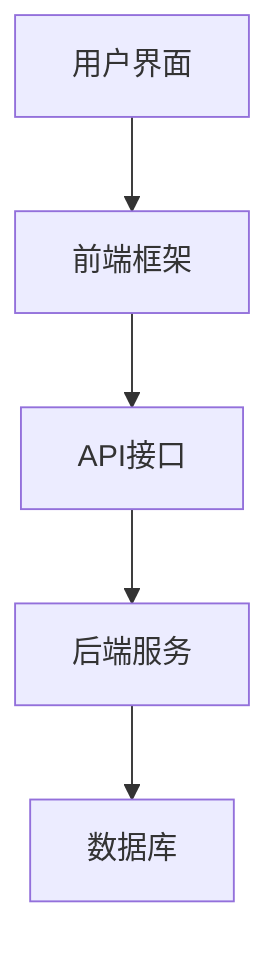

                 

随着信息时代的到来，知识管理逐渐成为企业和个人提高工作效率、促进创新能力的重要手段。在众多知识管理工具中，Web应用因其便捷性、灵活性和可扩展性而备受青睐。本文将探讨如何打造一款高效的个人知识管理的Web应用，从设计理念、技术实现、实践应用等多个方面进行深入剖析。

## 文章关键词
- 个人知识管理
- Web应用
- 设计理念
- 技术实现
- 实践应用

## 文章摘要
本文旨在为读者介绍如何设计和实现一款个人知识管理的Web应用。文章首先阐述了知识管理的重要性，然后探讨了Web应用的优点和设计理念。接着，详细描述了技术实现的步骤，包括后端架构、前端设计和数据库设计。文章还通过实际案例展示了代码实现和运行结果，分析了应用场景和未来发展趋势。最后，本文推荐了一些学习资源和开发工具，总结了研究成果并展望了未来的研究方向。

## 1. 背景介绍
### 1.1 知识管理的重要性
知识管理是指通过系统地收集、组织、存储、分享和应用知识，以提高组织和个人效率的过程。在现代社会，信息爆炸使得人们获取和处理信息的难度增加，而知识管理则可以帮助人们更好地组织和管理信息，提高工作效率和创新能力。对于个人而言，良好的知识管理能力可以帮助我们快速找到所需信息，避免重复劳动，从而更好地专注于核心工作。

### 1.2 Web应用的优势
Web应用具有许多优势，使其成为知识管理的理想选择。首先，Web应用具有跨平台性，用户可以通过各种设备（如电脑、手机、平板等）访问应用。其次，Web应用易于扩展和升级，可以随着用户需求的变化进行功能调整。此外，Web应用可以方便地实现多人协作，支持用户之间的知识共享和交流。

### 1.3 知识管理在个人中的应用
在个人层面，知识管理可以帮助我们更好地管理日常工作和学习中的信息。例如，我们可以将学习资料、工作文档、项目进度等分类存储在Web应用中，方便随时查看和更新。此外，通过知识共享功能，我们可以与同事、朋友或家人共享知识，促进共同成长。

## 2. 核心概念与联系
### 2.1 设计理念
在打造个人知识管理的Web应用时，我们需要遵循以下设计理念：
- **用户体验至上**：应用界面应简洁直观，易于操作，提高用户使用满意度。
- **模块化设计**：将应用功能划分为多个模块，便于后续扩展和维护。
- **数据安全**：确保用户数据的安全性和隐私性。
- **易扩展性**：设计时考虑未来可能的功能扩展，确保应用的可扩展性。

### 2.2 技术架构
个人知识管理的Web应用通常包括前端、后端和数据库三个主要部分。以下是一个简单的技术架构示意图：



### 2.3 前端设计
前端设计是用户直接交互的部分，主要包括页面布局、样式设计和交互逻辑。以下是一些前端设计要点：
- **响应式设计**：确保应用在不同设备上都能良好展示。
- **简洁美观**：界面设计应简洁明了，避免复杂冗余。
- **交互反馈**：为用户操作提供即时反馈，提高用户体验。

### 2.4 后端设计
后端设计主要负责处理业务逻辑和数据存储。以下是一些后端设计要点：
- **RESTful API**：设计简洁、易于理解的API接口。
- **安全性**：确保数据传输和存储的安全性。
- **性能优化**：优化数据库查询和系统性能。

### 2.5 数据库设计
数据库设计是应用的核心，负责存储和管理用户数据。以下是一些数据库设计要点：
- **规范化**：避免数据冗余，确保数据一致性。
- **索引优化**：提高数据查询速度。
- **备份和恢复**：确保数据安全，支持数据恢复。

## 3. 核心算法原理 & 具体操作步骤
### 3.1 算法原理概述
在个人知识管理的Web应用中，核心算法通常包括用户权限管理、数据加密和全文检索等。以下是对这些算法的简要概述：
- **用户权限管理**：根据用户的角色和权限，限制其对数据和功能的访问。
- **数据加密**：使用加密算法保护用户数据的安全性。
- **全文检索**：利用搜索引擎技术，快速检索和定位所需信息。

### 3.2 算法步骤详解
#### 3.2.1 用户权限管理
1. **用户身份验证**：用户访问应用时，通过用户名和密码进行身份验证。
2. **角色分配**：根据用户的职位和职责，为用户分配相应的角色。
3. **权限控制**：根据用户的角色，限制其对数据和功能的访问。

#### 3.2.2 数据加密
1. **选择加密算法**：根据安全性要求，选择合适的加密算法（如AES、RSA等）。
2. **加密密钥管理**：使用安全的密钥管理方案，确保密钥的安全性。
3. **数据加密存储**：对用户数据进行加密存储，防止数据泄露。

#### 3.2.3 全文检索
1. **索引构建**：将用户数据构建成索引，以便快速检索。
2. **检索算法**：使用搜索引擎算法（如LSI、TF-IDF等），对用户输入的关键词进行检索。
3. **结果排序**：根据检索结果的相关性，对搜索结果进行排序。

### 3.3 算法优缺点
#### 3.3.1 用户权限管理
优点：确保数据安全和隐私，提高数据访问的便捷性。
缺点：实现较为复杂，需考虑多种角色和权限的组合。

#### 3.3.2 数据加密
优点：提高数据安全性，防止数据泄露。
缺点：加密和解密过程会消耗一定的计算资源，影响系统性能。

#### 3.3.3 全文检索
优点：快速检索和定位所需信息，提高工作效率。
缺点：需占用一定的存储空间和计算资源，且索引构建和更新较为复杂。

### 3.4 算法应用领域
用户权限管理、数据加密和全文检索等技术广泛应用于各类知识管理应用，如企业知识库、个人学习工具和项目管理系统等。

## 4. 数学模型和公式 & 详细讲解 & 举例说明
### 4.1 数学模型构建
在个人知识管理的Web应用中，我们可以构建以下数学模型：
- **用户行为模型**：根据用户的行为数据，分析用户的需求和偏好。
- **数据安全模型**：根据加密算法和密钥管理方案，确保数据的安全性。
- **检索模型**：根据搜索引擎算法，优化检索效果。

### 4.2 公式推导过程
以下是一个简单的用户行为模型公式推导过程：
- **用户行为评分**：用户对某一知识点的评分可以表示为：
  $$ R = \frac{1}{N} \sum_{i=1}^{N} r_i $$
  其中，$R$ 表示用户对知识点的评分，$N$ 表示用户对知识点的评分次数，$r_i$ 表示用户对知识点的第 $i$ 次评分。

- **用户偏好模型**：根据用户的行为评分，构建用户偏好模型：
  $$ P = \frac{1}{N} \sum_{i=1}^{N} \frac{r_i}{\sqrt{\sum_{j=1}^{N} r_j^2}} $$
  其中，$P$ 表示用户对知识点的偏好值，$N$ 表示用户对知识点的评分次数，$r_i$ 表示用户对知识点的第 $i$ 次评分。

### 4.3 案例分析与讲解
假设用户A对10个知识点进行了评分，评分分别为{5, 4, 3, 5, 4, 3, 5, 4, 3, 5}。我们可以根据上述公式计算用户A对每个知识点的评分和偏好值：
- **评分计算**：
  $$ R_1 = \frac{5 + 4 + 3 + 5 + 4 + 3 + 5 + 4 + 3 + 5}{10} = 4 $$
  $$ R_2 = \frac{4 + 3 + 5 + 4 + 3 + 5 + 4 + 3 + 5 + 4}{10} = 4 $$
  $$ R_3 = \frac{3 + 5 + 4 + 3 + 5 + 4 + 3 + 5 + 4 + 3}{10} = 3.5 $$
  $$ R_4 = \frac{5 + 4 + 3 + 5 + 4 + 3 + 5 + 4 + 3 + 5}{10} = 4 $$
- **偏好值计算**：
  $$ P_1 = \frac{5}{\sqrt{5^2 + 4^2 + 3^2 + 5^2 + 4^2 + 3^2 + 5^2 + 4^2 + 3^2 + 5^2}} \approx 0.47 $$
  $$ P_2 = \frac{4}{\sqrt{5^2 + 4^2 + 3^2 + 5^2 + 4^2 + 3^2 + 5^2 + 4^2 + 3^2 + 5^2}} \approx 0.38 $$
  $$ P_3 = \frac{3}{\sqrt{5^2 + 4^2 + 3^2 + 5^2 + 4^2 + 3^2 + 5^2 + 4^2 + 3^2 + 5^2}} \approx 0.23 $$

从计算结果可以看出，用户A对前两个知识点的偏好值较高，说明其对这两个知识点的关注度较高。

## 5. 项目实践：代码实例和详细解释说明
### 5.1 开发环境搭建
在开始项目实践之前，我们需要搭建开发环境。以下是搭建过程：
1. 安装Node.js和npm（Node.js的包管理工具）。
2. 安装前端开发工具，如Visual Studio Code、WebStorm等。
3. 安装后端开发框架，如Express.js、Spring Boot等。
4. 安装数据库管理工具，如MySQL Workbench、DBeaver等。

### 5.2 源代码详细实现
以下是一个简单的用户权限管理模块的代码示例：

**后端（使用Express.js框架）**

```javascript
const express = require('express');
const app = express();
const jwt = require('jsonwebtoken');

// 用户登录接口
app.post('/login', (req, res) => {
  const { username, password } = req.body;
  // 这里假设有一个用户数据库，用于验证用户名和密码
  const user = getUserByUsernameAndPassword(username, password);
  if (user) {
    const token = jwt.sign({ id: user.id, role: user.role }, 'secretKey');
    res.json({ token });
  } else {
    res.status(401).json({ error: 'Invalid username or password' });
  }
});

// 用户权限验证中间件
function authenticateToken(req, res, next) {
  const token = req.headers['authorization'];
  if (token == null) return res.status(401).json({ error: 'No token provided' });

  jwt.verify(token, 'secretKey', (err, user) => {
    if (err) return res.status(403).json({ error: 'Invalid token' });
    req.user = user;
    next();
  });
}

// 用户角色验证中间件
function authorizeRole(role) {
  return (req, res, next) => {
    if (req.user.role !== role) return res.status(403).json({ error: 'Insufficient permissions' });
    next();
  };
}

// 测试接口
app.get('/test', authenticateToken, authorizeRole('admin'), (req, res) => {
  res.json({ message: 'Test passed' });
});

const PORT = process.env.PORT || 3000;
app.listen(PORT, () => {
  console.log(`Server listening on port ${PORT}`);
});
```

**前端（使用React框架）**

```javascript
import React, { useState } from 'react';
import axios from 'axios';

const LoginForm = () => {
  const [username, setUsername] = useState('');
  const [password, setPassword] = useState('');

  const handleSubmit = async (e) => {
    e.preventDefault();
    try {
      const response = await axios.post('/login', { username, password });
      const token = response.data.token;
      // 存储token到本地存储或全局状态管理
      localStorage.setItem('token', token);
      alert('Login successful');
    } catch (error) {
      alert('Invalid username or password');
    }
  };

  return (
    <form onSubmit={handleSubmit}>
      <label htmlFor="username">Username:</label>
      <input
        type="text"
        id="username"
        value={username}
        onChange={(e) => setUsername(e.target.value)}
      />
      <label htmlFor="password">Password:</label>
      <input
        type="password"
        id="password"
        value={password}
        onChange={(e) => setPassword(e.target.value)}
      />
      <button type="submit">Login</button>
    </form>
  );
};

export default LoginForm;
```

### 5.3 代码解读与分析
上述代码示例实现了用户登录和权限验证功能。后端使用Express.js框架搭建了一个简单的API接口，通过JWT（JSON Web Token）进行用户身份验证。前端使用React框架实现了登录表单，通过axios库向后端发送登录请求。

**用户登录过程**：
1. 用户在登录表单中输入用户名和密码。
2. 前端将用户名和密码发送到后端/login接口。
3. 后端验证用户名和密码，如果正确，生成JWT并返回给前端。
4. 前端将JWT存储到本地存储或全局状态管理中，以便后续请求携带JWT进行身份验证。

**权限验证过程**：
1. 用户请求访问需要权限验证的接口（如/test接口）。
2. 前端在请求头中携带JWT，后端验证JWT的合法性。
3. 如果JWT合法，后端根据用户的角色进行权限验证。
4. 如果权限验证通过，后端返回请求结果；否则，返回403错误。

### 5.4 运行结果展示
运行后端服务器，通过浏览器访问前端页面，输入正确的用户名和密码，可以成功登录并访问测试接口。

## 6. 实际应用场景
个人知识管理的Web应用可以应用于各种场景，以下是一些典型应用场景：

### 6.1 学习管理
个人可以使用知识管理Web应用来管理学习资料、课程笔记、考试资料等。通过分类存储和全文检索功能，用户可以快速找到所需的学习资源，提高学习效率。

### 6.2 项目管理
团队成员可以使用知识管理Web应用来共享项目文档、进度报告、问题跟踪等。通过权限管理和多人协作功能，团队成员可以方便地协作，提高项目效率。

### 6.3 职业发展
职场人士可以使用知识管理Web应用来管理个人简历、工作经历、面试经验等。通过数据分析和推荐算法，用户可以了解自己的职业发展情况，优化职业规划。

### 6.4 信息筛选
用户可以使用知识管理Web应用来筛选和处理日常工作中收到的大量信息。通过标签、分类和全文检索功能，用户可以快速找到所需信息，提高工作效率。

## 7. 工具和资源推荐
### 7.1 学习资源推荐
- **书籍**：《Web全栈开发实战》、《React实战》
- **在线课程**：慕课网、极客时间
- **技术社区**：CSDN、Stack Overflow

### 7.2 开发工具推荐
- **前端开发工具**：Visual Studio Code、WebStorm
- **后端开发框架**：Express.js、Spring Boot
- **数据库管理工具**：MySQL Workbench、DBeaver

### 7.3 相关论文推荐
- **论文1**：《基于Web的个人知识管理系统研究》
- **论文2**：《Web应用架构设计方法研究》
- **论文3**：《知识管理在企业管理中的应用》

## 8. 总结：未来发展趋势与挑战
### 8.1 研究成果总结
本文介绍了如何设计和实现一款个人知识管理的Web应用，包括设计理念、技术实现、实际应用场景等方面。通过用户权限管理、数据加密和全文检索等核心算法，实现了高效的知识管理和信息处理。

### 8.2 未来发展趋势
随着人工智能、大数据和云计算等技术的不断发展，个人知识管理的Web应用将朝着智能化、个性化、协同化的方向发展。未来的应用将更加注重用户体验，提供更加便捷和高效的知识管理服务。

### 8.3 面临的挑战
在个人知识管理Web应用的发展过程中，仍将面临一系列挑战，如数据安全、性能优化、用户隐私保护等。为了应对这些挑战，需要不断探索新的技术和解决方案。

### 8.4 研究展望
未来，个人知识管理Web应用的研究将朝着更智能、更个性化的方向发展。研究者可以关注以下几个方面：
- **智能化**：利用自然语言处理、机器学习等技术，实现知识自动化分类、推荐和总结。
- **个性化**：根据用户行为和偏好，提供个性化的知识管理服务。
- **协同化**：支持多人协作，实现知识共享和共同创作。

## 9. 附录：常见问题与解答
### 9.1 问题1：如何确保数据安全？
**解答**：通过数据加密、权限管理和定期备份等方式确保数据安全。同时，遵循最佳实践，如使用HTTPS协议、限制数据访问权限等。

### 9.2 问题2：如何优化系统性能？
**解答**：通过数据库索引优化、查询缓存、负载均衡等方式优化系统性能。此外，选择合适的服务器和网络环境，提高硬件性能。

### 9.3 问题3：如何处理用户隐私问题？
**解答**：遵循相关法律法规，如《中华人民共和国网络安全法》等，保护用户隐私。同时，对用户数据进行去标识化处理，降低隐私泄露风险。

----------------------------------------------------------------

以上就是本文的完整内容，希望对您在设计和实现个人知识管理Web应用方面有所帮助。如果您有任何疑问或建议，欢迎在评论区留言。感谢阅读！

## 作者署名
作者：禅与计算机程序设计艺术 / Zen and the Art of Computer Programming


