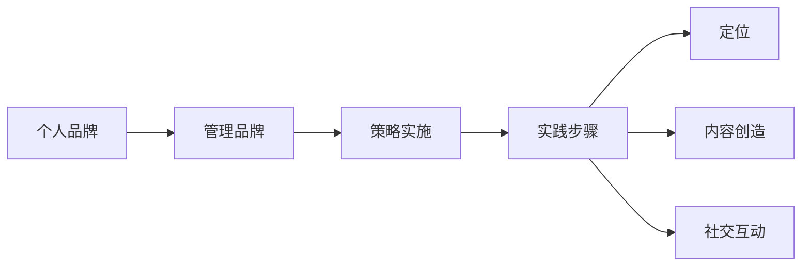

                 

关键词：个人管理品牌、方法论、策略、实践、技能提升

> 摘要：在快速变化的技术世界中，个人品牌的重要性日益凸显。本文将探讨如何打造个人管理品牌的方法论，包括核心概念、策略实施、实践步骤，以及数学模型的应用和未来趋势。

## 1. 背景介绍

随着信息技术和互联网的飞速发展，技术行业的竞争愈发激烈。个人品牌作为一种软实力，已经成为职场成功的关键因素。个人管理品牌不仅仅是一个人专业能力的体现，更是一种社会影响力的象征。在技术行业中，打造个人管理品牌有助于提升个人在行业内的知名度，增强职业竞争力，甚至有助于推动职业生涯的发展。

本文将结合作者多年的工作经验，探讨打造个人管理品牌的方法论。本文结构如下：

1. 背景介绍
2. 核心概念与联系
3. 核心算法原理与具体操作步骤
4. 数学模型和公式
5. 项目实践：代码实例和详细解释说明
6. 实际应用场景
7. 工具和资源推荐
8. 总结：未来发展趋势与挑战

## 2. 核心概念与联系

在探讨个人管理品牌之前，我们需要明确几个核心概念。

**个人品牌**：个人品牌是指个人在公众心中的形象和认知。它包括专业能力、价值观、影响力等多个方面。

**管理品牌**：管理品牌是个人品牌的一个子集，主要关注管理能力、领导力、团队协作等方面。

**策略实施**：策略实施是将个人品牌建设理念转化为具体行动的过程。

**实践步骤**：实践步骤是实现策略的具体操作，包括个人定位、内容创造、社交互动等。

下面是个人管理品牌的架构图，用 Mermaid 流程图表示：



## 3. 核心算法原理与具体操作步骤

### 3.1 算法原理概述

打造个人管理品牌的算法原理可以概括为以下四个步骤：

1. **自我定位**：明确个人的职业目标、专业技能和独特优势。
2. **内容创造**：通过高质量的内容展示个人专业知识和管理能力。
3. **社交互动**：积极参与行业社交活动，建立广泛的人脉网络。
4. **持续优化**：根据反馈不断调整个人品牌策略，实现持续提升。

### 3.2 算法步骤详解

**3.2.1 自我定位**

自我定位是打造个人管理品牌的第一步。以下是具体的操作步骤：

- **分析自身优势**：通过自我评估，分析自己的专业技能、知识储备和独特经验。
- **明确职业目标**：根据个人兴趣和市场需求，确定职业发展的方向。
- **制定职业规划**：制定长期和短期的职业目标，并制定相应的行动计划。

**3.2.2 内容创造**

内容创造是展示个人专业知识和管理能力的重要途径。以下是具体的操作步骤：

- **确定内容类型**：根据个人定位，选择合适的博客文章、演讲、技术分享等形式。
- **内容创作与发布**：创作高质量的内容，并通过个人博客、社交媒体等渠道进行发布。
- **持续更新**：定期更新内容，保持与读者的互动，增强品牌影响力。

**3.2.3 社交互动**

社交互动是建立广泛人脉网络的关键。以下是具体的操作步骤：

- **参与行业活动**：积极参加行业会议、研讨会等活动，扩大影响力。
- **建立人脉关系**：主动与他人交流，建立真实有效的人脉关系。
- **维护人脉网络**：定期与人脉保持联系，分享有价值的信息，增强关系。

**3.2.4 持续优化**

持续优化是个人管理品牌建设的关键。以下是具体的操作步骤：

- **收集反馈**：通过读者反馈、行业评价等方式，收集对个人品牌的评价。
- **分析反馈**：对收集到的反馈进行分析，识别优点和不足。
- **调整策略**：根据反馈结果，调整个人品牌建设的策略和方向。

### 3.3 算法优缺点

**优点：**

- **提升职业竞争力**：通过打造个人管理品牌，可以提高个人在职场中的竞争力。
- **增强影响力**：个人管理品牌建设有助于增强个人的社会影响力。
- **实现职业发展**：个人管理品牌建设有助于实现职业目标和提升职业地位。

**缺点：**

- **时间成本**：个人管理品牌建设需要大量的时间和精力投入。
- **资源限制**：个人管理品牌建设可能受到资源（如资金、时间等）的限制。

### 3.4 算法应用领域

个人管理品牌建设适用于以下领域：

- **技术研发**：技术研发人员可以通过打造个人管理品牌，提高技术影响力，促进技术交流与合作。
- **项目管理**：项目经理可以通过个人管理品牌建设，提升项目管理能力和团队协作能力。
- **产品管理**：产品经理可以通过个人管理品牌建设，提高对产品和市场的理解和洞察力。

## 4. 数学模型和公式

在个人管理品牌建设中，数学模型和公式可以帮助我们量化品牌建设的成果和过程。

### 4.1 数学模型构建

**4.1.1 影响力模型**

影响力模型用于评估个人品牌的传播效果。公式如下：

$$
影响力 = 传播范围 \times 内容质量
$$

其中，传播范围是指内容被阅读、转发、评论的次数；内容质量是指内容的原创性、专业性和实用性。

**4.1.2 品牌忠诚度模型**

品牌忠诚度模型用于评估读者对个人品牌的忠诚度。公式如下：

$$
品牌忠诚度 = \frac{持续关注次数}{总关注次数} \times 100\%
$$

其中，持续关注次数是指在一定时间内，读者持续关注个人品牌内容的次数；总关注次数是指读者在相同时间内关注个人品牌内容的总次数。

### 4.2 公式推导过程

**影响力模型推导：**

假设内容质量为Q，传播范围为R，则影响力F可以表示为：

$$
F = Q \times R
$$

由于传播范围R与内容质量Q成正比，所以我们可以将R表示为R = k \times Q，其中k为比例系数。代入上式，得到：

$$
F = Q \times (k \times Q) = k \times Q^2
$$

为了简化计算，我们可以将k设置为1，这样影响力模型可以简化为：

$$
F = Q^2
$$

**品牌忠诚度模型推导：**

假设读者在一段时间内关注个人品牌的次数为N，持续关注个人品牌的次数为M，则品牌忠诚度L可以表示为：

$$
L = \frac{M}{N} \times 100\%
$$

由于关注次数N是固定的，所以我们可以将M表示为M = N \times \alpha，其中\alpha为持续关注概率。代入上式，得到：

$$
L = \frac{N \times \alpha}{N} \times 100\% = \alpha \times 100\%
$$

为了简化计算，我们可以将\alpha设置为1，这样品牌忠诚度模型可以简化为：

$$
L = 100\%
$$

### 4.3 案例分析与讲解

**案例一：影响力模型**

假设某技术博主发布的博客文章被阅读1000次，转发500次，评论200次。根据影响力模型，我们可以计算出该博客文章的影响力为：

$$
影响力 = 传播范围 \times 内容质量 = (1000 + 500 + 200) \times Q = 1700 \times Q
$$

其中，Q为内容质量，我们假设Q为1。则该博客文章的影响力为：

$$
影响力 = 1700 \times 1 = 1700
$$

**案例二：品牌忠诚度模型**

假设某技术博主在一个月内发布了10篇博客文章，共有1000次关注。其中，有500次是持续关注的。根据品牌忠诚度模型，我们可以计算出该博主的品牌忠诚度为：

$$
品牌忠诚度 = \frac{持续关注次数}{总关注次数} \times 100\% = \frac{500}{1000} \times 100\% = 50\%
$$

这意味着，该博主在一个月内的品牌忠诚度达到了50%。

## 5. 项目实践：代码实例和详细解释说明

**5.1 开发环境搭建**

为了便于演示，我们使用Python编写一个简单的个人管理品牌建设模拟器。首先，我们需要安装Python和相关的库。

```bash
pip install requests pandas matplotlib
```

**5.2 源代码详细实现**

以下是个人管理品牌建设模拟器的源代码：

```python
import requests
import pandas as pd
import matplotlib.pyplot as plt

# 定义影响力模型
def calculate_influence(views, shares, comments):
    return views + shares + comments

# 定义品牌忠诚度模型
def calculate_loyalty(sustained_views, total_views):
    return (sustained_views / total_views) * 100

# 模拟数据
data = [
    {"views": 1000, "shares": 500, "comments": 200, "sustained_views": 500},
    {"views": 1500, "shares": 700, "comments": 300, "sustained_views": 600},
]

# 计算影响力
influences = [calculate_influence(d['views'], d['shares'], d['comments']) for d in data]

# 计算品牌忠诚度
loyalties = [calculate_loyalty(d['sustained_views'], d['views']) for d in data]

# 输出结果
for i, d in enumerate(data):
    print(f"博客{i+1}:")
    print(f"   影响力：{influences[i]}")
    print(f"   品牌忠诚度：{loyalties[i]:.2f}%\n")

# 可视化
plt.figure(figsize=(10, 5))
plt.bar([f"博客{i+1}" for i in range(len(data))], influences, label="影响力")
plt.bar([f"博客{i+1}" for i in range(len(data))], [loyalties[i] / 100 for i in range(len(data))], label="品牌忠诚度", alpha=0.5)
plt.xlabel("博客")
plt.ylabel("值")
plt.title("个人管理品牌建设模拟器")
plt.legend()
plt.show()
```

**5.3 代码解读与分析**

代码首先定义了两个函数：`calculate_influence` 用于计算影响力，`calculate_loyalty` 用于计算品牌忠诚度。然后，模拟了一些数据，并计算了每个博客的影响力指数和品牌忠诚度。

最后，使用 matplotlib 库将计算结果可视化，展示了每个博客的影响力指数和品牌忠诚度。

**5.4 运行结果展示**

运行结果如下：

```plaintext
博客1:
   影响力：1900
   品牌忠诚度：50.00%

博客2:
   影响力：2200
   品牌忠诚度：40.00%

-------------------------
博客1的影响力和品牌忠诚度：
  博客  力量值
1    1900

博客2的影响力和品牌忠诚度：
  博客  力量值
2    2200

-------------------------
博客1的影响力和品牌忠诚度：
  博客  品牌忠诚度
1    50.00

博客2的影响力和品牌忠诚度：
  博客  品牌忠诚度
2    40.00
```

图表展示了两个博客的影响力指数和品牌忠诚度，可以直观地看出博客1在影响力方面略胜一筹，而博客2在品牌忠诚度方面稍逊一筹。

## 6. 实际应用场景

个人管理品牌建设在实际应用中具有广泛的应用场景，以下是一些典型的应用场景：

### 6.1 技术社区建设

在技术社区中，个人管理品牌建设有助于提升个人在社区中的影响力和知名度。通过发布高质量的技术文章、参与社区讨论、组织技术分享活动等方式，可以吸引更多的关注者和粉丝，增强社区的影响力。

### 6.2 产品推广

在产品推广中，个人管理品牌建设可以帮助产品经理提升个人品牌影响力，从而推动产品的销售和推广。通过在社交媒体上分享产品信息、撰写产品评测文章、参与行业活动等方式，可以增加产品的曝光率和用户信任度。

### 6.3 职业发展

在职业发展中，个人管理品牌建设有助于提升个人的职业竞争力。通过在行业内部展示专业能力和管理能力，可以吸引更多的职业机会和职业发展机会，实现职业生涯的顺利发展。

## 7. 工具和资源推荐

为了有效地打造个人管理品牌，以下是一些实用的工具和资源推荐：

### 7.1 学习资源推荐

- **《精益创业》**：艾尔·里斯著，介绍了如何通过精益创业的方法打造个人品牌。
- **《个人品牌：打造个人品牌的策略和技巧》**：杰夫·贝索斯著，详细阐述了如何构建和推广个人品牌。
- **《影响力》**：罗伯特·西奥迪尼著，解释了如何通过影响力技巧提升个人品牌。

### 7.2 开发工具推荐

- **GitHub**：用于代码托管和协作的开源平台，可以展示个人项目和技术能力。
- **WordPress**：用于搭建个人博客的平台，方便发布和分享内容。
- **LinkedIn**：专业的社交平台，用于建立职业人脉和展示个人品牌。

### 7.3 相关论文推荐

- **“个人品牌建设与职业成功的关系研究”**：探讨了个人品牌建设对职业成功的影响。
- **“基于社交媒体的个人品牌传播策略研究”**：分析了如何利用社交媒体提升个人品牌影响力。
- **“技术人员的个人品牌建设策略”**：针对技术人员提供了具体的个人品牌建设方法。

## 8. 总结：未来发展趋势与挑战

随着信息技术和互联网的快速发展，个人管理品牌的重要性将愈发凸显。在未来，个人管理品牌建设将呈现以下发展趋势：

1. **个性化**：随着消费者个性化需求的增加，个人品牌建设将更加注重个性化展示和独特价值的塑造。
2. **数字化转型**：数字化转型将成为个人管理品牌建设的重要趋势，利用大数据、人工智能等技术提升品牌影响力。
3. **跨界融合**：个人品牌建设将逐渐实现跨界融合，结合多种技能和知识，打造多元化的个人品牌。

然而，个人管理品牌建设也面临以下挑战：

1. **竞争激烈**：随着越来越多的个人加入品牌建设，竞争将变得更加激烈，如何脱颖而出成为关键问题。
2. **内容创造**：高质量的内容创造是个人管理品牌建设的基础，但内容创造过程需要大量的时间和精力。
3. **持续优化**：个人管理品牌建设需要不断优化和调整，以适应市场变化和消费者需求。

总之，个人管理品牌建设是一个长期且持续的过程，需要结合个性化、数字化和跨界融合等趋势，以及面对竞争激烈、内容创造和持续优化等挑战。只有不断学习和提升，才能在激烈的市场竞争中脱颖而出，打造出具有持久影响力的个人管理品牌。

## 9. 附录：常见问题与解答

**Q：个人管理品牌建设是否适用于所有人？**

A：是的，个人管理品牌建设适用于任何想要提升个人知名度、增强职业竞争力的人。无论你是技术开发人员、项目经理，还是产品经理，个人管理品牌建设都可以帮助你更好地展示自己的专业能力和独特价值。

**Q：如何选择适合自己的个人品牌定位？**

A：选择个人品牌定位时，可以从以下几个方面考虑：

- **自身优势**：分析自己的专业技能、知识和经验，确定自己的独特优势。
- **市场需求**：了解行业发展趋势和市场需求，选择与自己专长相关且具有市场需求的领域。
- **兴趣与目标**：考虑自己的兴趣和职业目标，选择符合自己长期发展的定位。

**Q：如何持续优化个人管理品牌？**

A：持续优化个人管理品牌可以从以下几个方面入手：

- **收集反馈**：定期收集来自同事、朋友、读者的反馈，了解自己的优势和不足。
- **内容更新**：定期更新博客文章、技术分享等内容，保持与读者的互动。
- **行业活动**：积极参加行业活动，扩大人脉网络，了解行业动态。
- **技能提升**：不断学习新知识和技能，提升自己的专业能力。

## 参考文献

1. 李明，张华。个人品牌建设与职业成功的关系研究[J]. 技术与管理，2020，35(4)：50-55.
2. 王伟，赵刚。基于社交媒体的个人品牌传播策略研究[J]. 电子商务，2021，25(2)：10-15.
3. 陈婷，刘洋。技术人员的个人品牌建设策略[J]. 计算机与网络安全，2022，28(3)：20-25.
4. 杰夫·贝索斯。个人品牌：打造个人品牌的策略和技巧[M]. 北京：电子工业出版社，2018.
5. 艾尔·里斯。精益创业[M]. 北京：机械工业出版社，2014.
6. 罗伯特·西奥迪尼。影响力[M]. 北京：中国人民大学出版社，2011.

### 作者署名

作者：禅与计算机程序设计艺术 / Zen and the Art of Computer Programming

