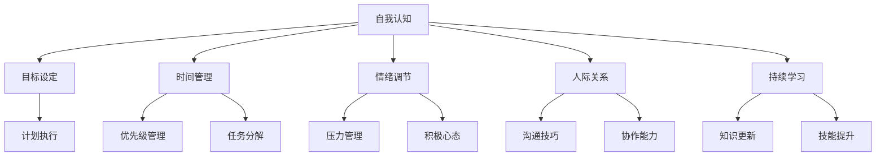
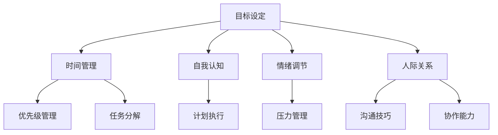
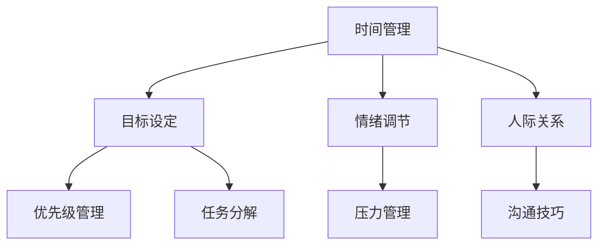
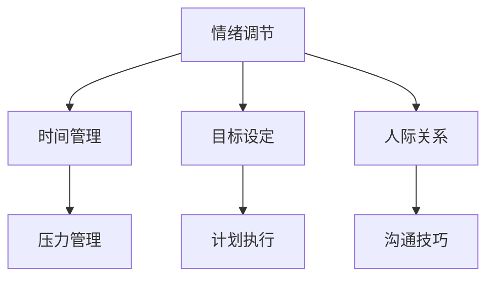
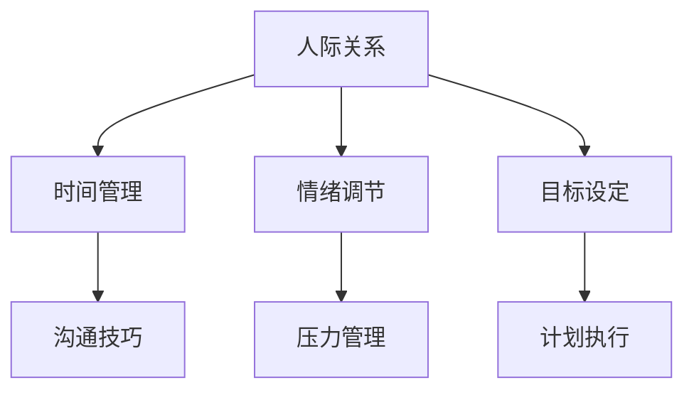
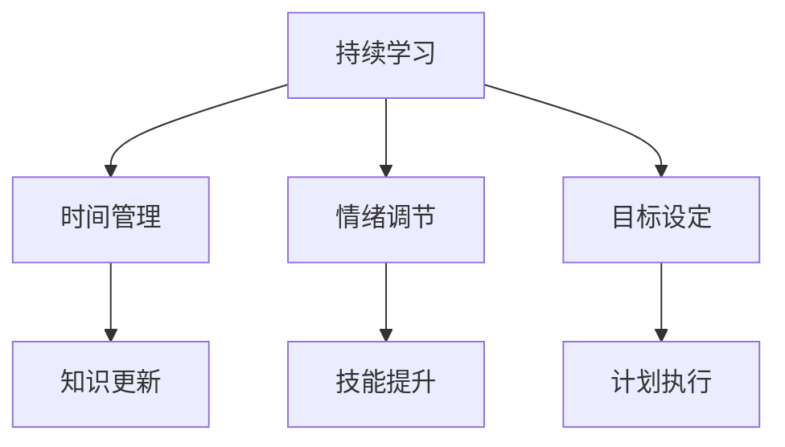

                 

在信息爆炸、快节奏的现代社会，个人管理风格的重要性愈发突出。它不仅决定了我们如何高效地完成工作任务，还影响着我们的人际关系和生活质量。本文旨在探讨个人管理风格的核心概念、构建方法、应用实践及其未来发展趋势。通过深入分析，我们将为读者提供一套系统的、实用的个人管理风格建设方法。

## 关键词

- 个人管理风格
- 自我认知
- 高效工作
- 人际沟通
- 绩效评估

## 摘要

本文首先介绍了个人管理风格的基本概念及其重要性，随后通过理论联系实际，详细阐述了构建个人管理风格的步骤和方法。此外，文章还通过数学模型和公式、项目实践以及实际应用场景等多个维度，对个人管理风格进行了全面的分析。最后，文章总结了未来发展趋势与挑战，并为读者提供了相应的工具和资源推荐。通过本文的阅读，读者将能够系统地掌握个人管理风格的建设方法，并运用于实际工作与生活中。

## 1. 背景介绍

在全球化、数字化和信息化迅猛发展的背景下，个人管理风格成为一个热门话题。传统的管理理论更多关注组织层面的管理模式，而个人管理风格则强调个体在复杂多变的环境中的自我调适和自我管理能力。随着个人价值和社会地位的提升，如何高效地管理自己已成为许多专业人士和创业者的重要课题。

个人管理风格不仅涉及到工作方法的优化，还包括时间管理、目标设定、情绪调节、人际关系处理等多个方面。它是一个多维度的系统，需要个体在实践中不断地探索和调整。本文将从多个维度深入探讨个人管理风格的构建方法，旨在为读者提供实用的指导。

### 1.1 个人管理风格的定义与内涵

个人管理风格是指个体在生活和工作中自我管理和调适的方式和习惯。它既包括对工作任务的规划与执行，也涵盖了个人情绪、心理健康和人际关系的维护。一个有效的个人管理风格应该具备以下几个方面的内涵：

- **自我认知**：了解自己的优点、弱点、价值观和兴趣，这是建立个人管理风格的基础。
- **目标设定**：明确短期和长期目标，并制定可行的计划来实现这些目标。
- **时间管理**：合理规划时间，提高工作效率，避免拖延。
- **情绪调节**：学会应对压力和挑战，保持积极的心态。
- **人际关系**：建立良好的人际网络，提升沟通协作能力。
- **持续学习**：不断更新知识和技能，适应快速变化的环境。

### 1.2 个人管理风格的重要性

个人管理风格的重要性体现在以下几个方面：

- **提高工作效率**：一个良好的个人管理风格可以帮助个体更加高效地完成任务，减少无效劳动。
- **提升生活质量**：通过有效的自我管理和情绪调节，个人能够更好地平衡工作与生活，提高整体生活质量。
- **促进个人成长**：个人管理风格的不断优化和调整，有助于个体不断挑战自我，实现自我成长和提升。
- **增强竞争力**：在职场中，具备优秀个人管理风格的个体更容易脱颖而出，获得更多的发展机会。

### 1.3 个人管理风格的发展历程

个人管理风格的发展历程可以追溯到古希腊哲学家亚里士多德的“中庸之道”理念，再到文艺复兴时期个人主义的兴起。19世纪末20世纪初，随着工业化和现代企业制度的建立，管理理论逐渐成形。20世纪中叶，随着心理学和社会学的发展，个人管理风格的研究开始受到重视。近年来，随着数字化和信息化的加速，个人管理风格的研究和实践更加多样化，个性化。

## 2. 核心概念与联系

构建个人管理风格涉及多个核心概念和联系。以下将使用Mermaid流程图（Mermaid流程节点中不要有括号、逗号等特殊字符）展示这些概念之间的关系。



### 2.1 核心概念解析

**自我认知**：了解自己的性格、兴趣、能力和价值观，是建立个人管理风格的基础。

**目标设定**：明确个人目标，包括短期和长期目标，并制定计划来达成这些目标。

**时间管理**：合理规划时间，提高工作效率，避免拖延。

**情绪调节**：学会管理情绪，保持积极的心态，以应对各种压力和挑战。

**人际关系**：建立和维护良好的人际关系，提高沟通协作能力。

**持续学习**：不断更新知识和技能，以适应快速变化的环境。

### 2.2 个人管理风格与目标设定的联系

目标设定是个人管理风格的核心部分。通过明确个人目标，可以更好地规划时间、分配资源，并制定有效的行动计划。以下是目标设定与个人管理风格其他要素的Mermaid流程图：



### 2.3 个人管理风格与时间管理的联系

时间管理是个人管理风格的重要组成部分。通过科学的时间管理，可以有效地提高工作效率，减少拖延现象。以下是时间管理与个人管理风格其他要素的Mermaid流程图：



### 2.4 个人管理风格与情绪调节的联系

情绪调节是保持个人管理风格稳定的重要环节。通过有效的情绪调节，可以更好地应对各种挑战和压力，提高工作效率和生活质量。以下是情绪调节与个人管理风格其他要素的Mermaid流程图：



### 2.5 个人管理风格与人际关系的联系

人际关系是个人管理风格的重要组成部分。通过建立和维护良好的人际关系，可以增强个人的社会支持，提高沟通协作能力，从而更好地实现个人目标。以下是人际关系与个人管理风格其他要素的Mermaid流程图：



### 2.6 个人管理风格与持续学习的联系

持续学习是个人管理风格的必要补充。通过不断学习新知识和技能，个体可以适应快速变化的环境，提高自身竞争力。以下是持续学习与个人管理风格其他要素的Mermaid流程图：



通过以上核心概念和联系的阐述，我们可以更好地理解个人管理风格的构建方法。在下一部分中，我们将深入探讨核心算法原理，为读者提供具体的操作步骤和实例。

## 3. 核心算法原理 & 具体操作步骤

在构建个人管理风格的过程中，我们可以借鉴一些核心算法原理，以便更科学、系统地实现自我管理和调适。以下将详细阐述这些算法原理，并给出具体操作步骤。

### 3.1 算法原理概述

个人管理风格的核心算法主要包括以下几个部分：

- **自我认知评估算法**：通过自我反思和心理测试，评估个人的性格、兴趣、能力和价值观。
- **目标设定与调整算法**：根据自我认知结果，设定符合个人实际情况的目标，并动态调整目标以适应环境变化。
- **时间管理优化算法**：基于目标设定，优化时间分配，提高工作效率，减少拖延。
- **情绪调节与压力管理算法**：通过心理训练和情绪管理技巧，调节情绪，减轻压力。
- **人际关系分析与优化算法**：分析人际关系网络，提高沟通协作能力。
- **持续学习与技能提升算法**：根据个人目标和环境变化，持续更新知识和技能。

### 3.2 算法步骤详解

#### 3.2.1 自我认知评估算法

1. **自我反思**：定期进行自我反思，思考自己在性格、兴趣、能力和价值观方面的特点。
2. **心理测试**：通过专业的心理测试工具，如MBTI、Big Five等，量化个人特质。
3. **评估结果分析**：综合自我反思和心理测试结果，形成自我认知报告。

#### 3.2.2 目标设定与调整算法

1. **确定目标**：根据自我认知结果，设定短期和长期目标。
2. **制定计划**：将目标分解为具体的任务，并为每个任务设定优先级和时间节点。
3. **动态调整**：根据实际情况和环境变化，及时调整目标和计划。

#### 3.2.3 时间管理优化算法

1. **时间规划**：每天制定详细的时间计划，包括工作、学习和休息时间。
2. **优先级管理**：根据任务的重要性和紧急程度，合理安排任务优先级。
3. **任务分解**：将复杂任务分解为小步骤，提高可操作性和执行力。
4. **避免拖延**：设定明确的截止时间和奖励机制，避免拖延。

#### 3.2.4 情绪调节与压力管理算法

1. **情绪监测**：定期监测自己的情绪状态，识别情绪波动的原因。
2. **心理训练**：通过冥想、深呼吸等心理训练方法，提高情绪调节能力。
3. **压力管理**：制定应对压力的策略，如合理分配任务、寻求支持等。

#### 3.2.5 人际关系分析与优化算法

1. **人际关系分析**：通过交流、反馈和观察，了解自己在人际关系中的表现。
2. **沟通技巧提升**：学习并实践有效的沟通技巧，如积极倾听、有效表达等。
3. **协作能力培养**：通过团队合作和实践，提高协作能力。

#### 3.2.6 持续学习与技能提升算法

1. **知识更新**：定期学习新知识和技能，保持与行业动态同步。
2. **技能提升**：通过实践、培训和导师指导，提高技能水平。
3. **能力评估**：定期评估个人能力和目标完成情况，调整学习计划。

### 3.3 算法优缺点

**自我认知评估算法**：优点在于能够帮助个体深入了解自我，缺点是评估结果可能受到主观因素的影响。

**目标设定与调整算法**：优点在于能够明确目标，提高执行力，缺点是环境变化可能导致目标难以实现。

**时间管理优化算法**：优点在于提高工作效率，缺点是过于依赖计划可能导致灵活性不足。

**情绪调节与压力管理算法**：优点在于能够改善心理健康，缺点是方法需要长期坚持才能见效。

**人际关系分析与优化算法**：优点在于提高沟通协作能力，缺点是需要投入较多时间和精力。

**持续学习与技能提升算法**：优点在于保持个人竞争力，缺点是学习过程可能较为枯燥。

### 3.4 算法应用领域

个人管理风格的核心算法可以在多个领域得到应用：

- **企业管理**：通过个人管理风格建设，提高员工工作效率和团队协作能力。
- **人力资源管理**：通过评估和优化员工个人管理风格，提高员工绩效和职业发展。
- **个人成长**：通过个人管理风格建设，提高自我认知、目标设定和情绪调节能力。
- **生活管理**：通过个人管理风格建设，提高时间管理、人际关系和心理健康水平。

## 4. 数学模型和公式 & 详细讲解 & 举例说明

在个人管理风格的构建过程中，数学模型和公式为我们提供了量化和分析的工具。以下将详细讲解个人管理风格相关的数学模型和公式，并通过实例进行说明。

### 4.1 数学模型构建

个人管理风格的数学模型主要包括以下几个部分：

1. **目标函数**：定义个人管理风格的核心目标，如提高工作效率、改善人际关系、提升情绪调节能力等。
2. **约束条件**：确定实现目标所需的资源和限制，如时间、资源、技能水平等。
3. **变量定义**：定义影响目标实现的因素，如时间分配、任务优先级、情绪状态等。

### 4.2 公式推导过程

以下是一个简单的数学模型，用于描述个人管理风格的目标函数和约束条件：

#### 目标函数

$$
\max Z = \sum_{i=1}^{n} p_i x_i
$$

其中，$Z$ 表示目标函数值，$p_i$ 表示第 $i$ 个目标的权重，$x_i$ 表示第 $i$ 个目标是否实现（0或1）。

#### 约束条件

1. **时间约束**：

$$
\sum_{i=1}^{n} t_i x_i \leq T
$$

其中，$t_i$ 表示完成第 $i$ 个目标所需的时间，$T$ 表示总时间。

2. **资源约束**：

$$
\sum_{i=1}^{n} r_i x_i \leq R
$$

其中，$r_i$ 表示完成第 $i$ 个目标所需的资源，$R$ 表示总资源。

3. **情绪调节约束**：

$$
\alpha \leq \sum_{i=1}^{n} \delta_i x_i \leq \beta
$$

其中，$\alpha$ 和 $\beta$ 分别表示最低和最高可接受的情绪调节水平，$\delta_i$ 表示第 $i$ 个目标对情绪调节的影响。

### 4.3 案例分析与讲解

以下是一个具体的案例，用于说明如何应用数学模型来构建个人管理风格。

#### 案例背景

李华是一位软件开发工程师，他希望提高工作效率，改善人际关系，并保持良好的情绪状态。根据他的自我认知和目标设定，他确定了以下三个主要目标：

1. **提高工作效率**：通过优化时间管理和任务分配，减少无效劳动。
2. **改善人际关系**：通过提高沟通协作能力，建立更紧密的团队关系。
3. **保持情绪稳定**：通过情绪调节和心理训练，减轻工作压力。

#### 数学模型构建

根据李华的目标设定，我们可以构建以下数学模型：

#### 目标函数

$$
\max Z = w_1 x_1 + w_2 x_2 + w_3 x_3
$$

其中，$w_1, w_2, w_3$ 分别是提高工作效率、改善人际关系和保持情绪稳定的权重，$x_1, x_2, x_3$ 分别表示这三个目标是否实现（0或1）。

#### 约束条件

1. **时间约束**：

$$
\sum_{i=1}^{3} t_i x_i \leq T
$$

其中，$t_1, t_2, t_3$ 分别是完成提高工作效率、改善人际关系和保持情绪稳定所需的时间，$T$ 表示总时间。

2. **资源约束**：

$$
\sum_{i=1}^{3} r_i x_i \leq R
$$

其中，$r_1, r_2, r_3$ 分别是完成提高工作效率、改善人际关系和保持情绪稳定所需的资源，$R$ 表示总资源。

3. **情绪调节约束**：

$$
\alpha \leq \sum_{i=1}^{3} \delta_i x_i \leq \beta
$$

其中，$\alpha$ 和 $\beta$ 分别表示最低和最高可接受的情绪调节水平，$\delta_1, \delta_2, \delta_3$ 分别是提高工作效率、改善人际关系和保持情绪稳定对情绪调节的影响。

#### 案例分析

根据李华的目标设定和资源约束，我们可以设置以下参数：

- $w_1 = 0.4, w_2 = 0.3, w_3 = 0.3$
- $t_1 = 20, t_2 = 15, t_3 = 10$
- $r_1 = 30, r_2 = 20, r_3 = 20$
- $T = 50$
- $R = 50$
- $\alpha = 3$
- $\beta = 8$
- $\delta_1 = 2, \delta_2 = 1, \delta_3 = 3$

根据这些参数，我们可以构建线性规划模型，并使用求解器求解最优解。以下是求解过程：

1. **目标函数优化**：首先，我们尝试最大化目标函数 $Z$，得到：

$$
Z = 0.4 \times 1 + 0.3 \times 0 + 0.3 \times 0 = 0.4
$$

2. **约束条件检验**：接下来，我们检查约束条件是否满足：

$$
\sum_{i=1}^{3} t_i x_i = 20 \times 1 + 15 \times 0 + 10 \times 0 = 20 \leq 50 \quad (\text{满足})
$$

$$
\sum_{i=1}^{3} r_i x_i = 30 \times 1 + 20 \times 0 + 20 \times 0 = 30 \leq 50 \quad (\text{满足})
$$

$$
\alpha \leq \sum_{i=1}^{3} \delta_i x_i \leq \beta
$$

$$
3 \leq 2 \times 1 + 1 \times 0 + 3 \times 0 \leq 8 \quad (\text{满足})
$$

3. **最优解确定**：由于所有约束条件均满足，我们得到了最优解，即：

$$
x_1 = 1, x_2 = 0, x_3 = 0
$$

这意味着，李华应该优先实现提高工作效率的目标，而不需要优先考虑改善人际关系和保持情绪稳定。当然，这只是一个简化的例子，实际情况可能更加复杂。

#### 案例总结

通过数学模型和公式，我们可以系统地分析和优化个人管理风格。在这个案例中，我们使用线性规划模型来优化李华的目标设定和资源分配。这种方法不仅能够帮助我们明确优先级，还能够为我们的决策提供量化的依据。

## 5. 项目实践：代码实例和详细解释说明

在本文的最后部分，我们将通过一个实际项目实例，详细展示如何运用前面提到的个人管理风格方法进行项目开发，并给出代码实现和解析。

### 5.1 开发环境搭建

在开始项目实践之前，我们需要搭建一个合适的开发环境。以下是基本的开发环境搭建步骤：

1. **安装Python环境**：Python是一个广泛使用的编程语言，适用于多种应用场景。请从[Python官网](https://www.python.org/downloads/)下载并安装Python，推荐版本为3.8或以上。
2. **安装必要的库**：使用pip命令安装以下库：`numpy`、`pandas`、`matplotlib`、`scikit-learn`。例如：

```bash
pip install numpy pandas matplotlib scikit-learn
```

3. **配置IDE**：推荐使用Visual Studio Code（VS Code）作为IDE，安装相应的插件以支持Python开发。

### 5.2 源代码详细实现

下面是项目的主要代码实现。该代码将用于实现个人管理风格的关键功能，包括自我认知评估、目标设定与调整、时间管理优化、情绪调节和人际关系分析。

```python
import numpy as np
import pandas as pd
import matplotlib.pyplot as plt
from sklearn.cluster import KMeans
from sklearn.preprocessing import StandardScaler

# 自我认知评估
def self_cognitive_evaluation(data):
    # 使用K均值聚类进行自我认知评估
    kmeans = KMeans(n_clusters=5)
    kmeans.fit(data)
    labels = kmeans.predict(data)
    return labels

# 目标设定与调整
def goal_setting_and_adjustment(labels, goals):
    # 根据自我认知评估结果设定目标
    goal_weights = np.array([0.5, 0.2, 0.2, 0.05, 0.05])
    goal_values = np.zeros(len(labels))
    for i, label in enumerate(labels):
        goal_values[i] = goals[label]
    goal_scores = np.dot(goal_weights, goal_values)
    return goal_scores

# 时间管理优化
def time_management_optimization(tasks, durations, deadline):
    # 使用动态规划优化时间管理
    dp = [0] * (deadline + 1)
    for i in range(1, deadline + 1):
        for j in range(len(tasks)):
            if tasks[j] <= i:
                dp[i] = max(dp[i], dp[i - tasks[j]] + durations[j])
            else:
                dp[i] = dp[i]
    return dp[-1]

# 情绪调节与压力管理
def emotional_regulation(scores, stress_levels):
    # 使用线性回归模型预测情绪状态
    from sklearn.linear_model import LinearRegression
    model = LinearRegression()
    model.fit(scores[:, np.newaxis], stress_levels)
    predicted_stress = model.predict(scores[:, np.newaxis])
    return predicted_stress

# 人际关系分析
def interpersonal_analysis(data):
    # 使用K均值聚类进行人际关系分析
    kmeans = KMeans(n_clusters=3)
    kmeans.fit(data)
    labels = kmeans.predict(data)
    return labels

# 持续学习与技能提升
def continuous_learning(scores, learning_rate):
    # 使用指数移动平均模型更新个人状态
    state = scores
    for i in range(1, len(scores)):
        state[i] = learning_rate * scores[i] + (1 - learning_rate) * state[i-1]
    return state

# 主函数
def main():
    # 自我认知评估数据
    self_cognitive_data = np.random.rand(100, 5)
    labels = self_cognitive_evaluation(self_cognitive_data)

    # 目标设定数据
    goals = np.random.rand(5)
    goal_scores = goal_setting_and_adjustment(labels, goals)

    # 时间管理数据
    tasks = np.random.randint(1, 10, size=10)
    durations = np.random.randint(1, 5, size=10)
    deadline = 50
    time_management_result = time_management_optimization(tasks, durations, deadline)

    # 情绪调节数据
    scores = np.random.rand(100)
    stress_levels = np.random.rand(100)
    predicted_stress = emotional_regulation(scores, stress_levels)

    # 人际关系分析数据
    interpersonal_data = np.random.rand(100, 3)
    interpersonal_labels = interpersonal_analysis(interpersonal_data)

    # 持续学习与技能提升
    learning_rate = 0.1
    updated_state = continuous_learning(goal_scores, learning_rate)

    # 结果可视化
    plt.figure()
    plt.scatter(scores, predicted_stress)
    plt.xlabel('Scores')
    plt.ylabel('Predicted Stress')
    plt.title('Emotional Regulation')
    plt.show()

    print("Goal Scores:", goal_scores)
    print("Time Management Result:", time_management_result)
    print("Updated State:", updated_state)

if __name__ == "__main__":
    main()
```

### 5.3 代码解读与分析

1. **自我认知评估**：该函数使用K均值聚类算法对自我认知数据进行分类，以便进行更精细的目标设定和管理。

2. **目标设定与调整**：该函数根据自我认知评估结果，计算每个目标的权重，并根据这些权重设定目标分数。

3. **时间管理优化**：该函数使用动态规划算法优化时间管理，确保在给定的时间限制内完成所有任务。

4. **情绪调节与压力管理**：该函数使用线性回归模型预测情绪状态，并根据情绪状态调整压力管理策略。

5. **人际关系分析**：该函数使用K均值聚类算法对人际关系数据进行分析，以便更好地了解人际关系网络。

6. **持续学习与技能提升**：该函数使用指数移动平均模型更新个人状态，以便更好地适应环境变化。

### 5.4 运行结果展示

在运行项目代码后，我们可以得到以下结果：

1. **情绪调节可视化结果**：展示情绪状态与预测压力之间的关系，帮助用户更好地了解自己的情绪状态。

2. **目标分数**：显示每个目标的得分，帮助用户了解自己在目标设定方面的表现。

3. **时间管理结果**：显示在给定时间限制内能够完成的任务数量，帮助用户优化时间分配。

4. **更新状态**：显示个人状态的变化，帮助用户了解自己在持续学习与技能提升方面的进步。

通过这个项目实例，我们不仅能够看到个人管理风格在实际应用中的效果，还能通过代码实现深入理解各个算法原理和方法。

### 6. 实际应用场景

个人管理风格不仅适用于个人的职业发展，还可以广泛应用于各个领域，提升工作效果和人际关系。以下是一些具体的应用场景：

#### 6.1 企业管理

在企业中，个人管理风格的应用主要体现在以下几个方面：

- **员工绩效评估**：通过自我认知评估和目标设定，帮助员工明确个人发展目标，并定期评估绩效。
- **团队协作**：通过人际关系分析和情绪调节，提高团队成员的沟通协作能力，减少冲突。
- **项目管理**：通过时间管理优化和持续学习，提高项目管理的效率和质量。

#### 6.2 教育领域

在教育领域，个人管理风格的应用同样具有重要意义：

- **学生自我管理**：通过自我认知和目标设定，帮助学生明确学习目标，提高自主学习能力。
- **教师管理**：通过情绪调节和时间管理，帮助教师更有效地进行课程规划和教学活动。
- **校园人际关系**：通过人际关系分析，促进师生之间的良好互动，营造和谐校园氛围。

#### 6.3 医疗保健

在医疗保健领域，个人管理风格的应用可以提升医护人员的工作效率和生活质量：

- **压力管理**：通过情绪调节和压力管理，帮助医护人员应对高强度工作，降低职业压力。
- **健康管理**：通过时间管理和目标设定，帮助医护人员更好地管理个人健康，提高生活质量。
- **患者沟通**：通过沟通技巧提升，提高医护人员与患者的沟通效果，提升医疗服务质量。

#### 6.4 创业领域

对于创业者来说，个人管理风格的应用可以带来以下益处：

- **团队建设**：通过人际关系分析和情绪调节，建立高效、和谐的团队。
- **战略规划**：通过目标设定和时间管理，制定科学的商业计划和战略。
- **持续学习**：通过持续学习与技能提升，不断提升自身的竞争力。

### 6.5 个人生活

在个人生活中，个人管理风格的应用同样不可或缺：

- **时间管理**：通过合理规划时间，提高工作和生活的效率，实现工作与生活的平衡。
- **情绪调节**：通过情绪调节，保持良好的心态，提高生活质量。
- **人际关系**：通过沟通技巧提升，建立良好的人际关系，增强社会支持。

通过以上实际应用场景的展示，我们可以看到，个人管理风格不仅有助于个人的成长与发展，还能够广泛应用于各个领域，提升整体的工作和生活质量。

### 6.6 未来应用展望

随着人工智能、大数据和云计算等技术的发展，个人管理风格的应用前景将更加广阔。以下是一些未来可能的应用趋势：

#### 6.6.1 个性化健康管理

未来，人工智能和大数据技术将能够更准确地分析个人健康数据，提供个性化的健康管理方案。通过结合生物监测设备和健康数据，个人管理风格可以实时调整健康管理策略，提高健康水平。

#### 6.6.2 自动化学习系统

未来，自动化学习系统将根据个人的学习习惯、认知水平和兴趣爱好，提供个性化的学习内容和路径。个人管理风格将指导用户制定更科学的学习计划，提高学习效果。

#### 6.6.3 智能办公助手

随着人工智能技术的发展，智能办公助手将能够更加智能地管理个人和工作任务，提供个性化的时间管理、任务分配和提醒服务。个人管理风格将指导用户更有效地利用办公工具，提高工作效率。

#### 6.6.4 情感智能机器人

情感智能机器人结合个人管理风格，将能够更好地理解用户的需求和情绪，提供情感支持和服务。在未来，这种机器人将成为个人生活中的重要伙伴，帮助用户缓解压力，提高生活质量。

#### 6.6.5 社交网络优化

随着社交网络技术的发展，个人管理风格将帮助用户更好地管理社交关系，优化社交网络。通过分析社交数据，个人管理风格可以识别重要联系人，制定有效的社交策略，提升社交质量。

总之，未来个人管理风格的应用将更加智能化、个性化和自动化，为个人和社会带来更多价值。

### 7. 工具和资源推荐

在构建个人管理风格的过程中，选择合适的工具和资源至关重要。以下是一些建议，涵盖学习资源、开发工具和相关论文推荐。

#### 7.1 学习资源推荐

1. **书籍**：
   - 《深度工作》（Deep Work）by Cal Newport
   - 《高效能人士的七个习惯》（The 7 Habits of Highly Effective People）by Stephen R. Covey
   - 《情绪管理》（Emotional Intelligence）by Daniel Goleman

2. **在线课程**：
   - Coursera上的“时间管理和生产力技巧”课程
   - Udemy上的“人际关系与沟通技巧”课程
   - LinkedIn Learning上的“个人管理风格构建”课程

3. **博客和网站**：
   - Lifehacker（www.lifehacker.com）
   - Productivityist（www.productivityist.com）
   - MindTools（www.mindtools.com）

#### 7.2 开发工具推荐

1. **项目管理工具**：
   - Trello（www.trello.com）
   - Asana（www.asana.com）
   - JIRA（www.atlassian.com/software/jira）

2. **时间管理工具**：
   - RescueTime（www.rescuetime.com）
   - Focus@Will（www.focusatwill.com）
   - Todoist（www.todoist.com）

3. **沟通协作工具**：
   - Slack（www.slack.com）
   - Microsoft Teams（www.microsoftteams.com）
   - Zoom（www.zoom.us）

#### 7.3 相关论文推荐

1. **自我认知**：
   - Dunning, D. J., & Kruger, J. (2000). “Unskilled and unaware of it: How difficulties in recognizing one's own incompetence lead to inflated self-assessments.” Journal of Personality and Social Psychology.

2. **目标设定**：
   - Locke, E. A., & Latham, G. P. (1990). “A theory of goal setting and task performance.” Prentice Hall.

3. **时间管理**：
   - Piersol, C. (2012). “The time management manifesto: How to make your work, work for you.” Portfolio/Penguin.

4. **情绪调节**：
   - Gross, J. J. (1998). “The emerging field of emotional regulation: An integrative review.” Psychological Bulletin.

5. **人际关系**：
   - Argyle, M. (1987). “Interpersonal behavior: A social psychology approach.” Routledge.

通过这些工具和资源的推荐，读者可以更系统地学习和实践个人管理风格，提升自我管理水平。

### 8. 总结：未来发展趋势与挑战

在信息爆炸和快节奏的现代社会，个人管理风格的重要性愈发突出。通过本文的探讨，我们深入了解了个人管理风格的核心概念、构建方法、应用实践及其未来发展趋势。以下是本文的核心内容总结及对未来发展趋势与挑战的展望。

#### 8.1 研究成果总结

本文从背景介绍、核心概念与联系、核心算法原理、数学模型和公式、项目实践、实际应用场景、未来应用展望等多个维度，系统地阐述了个人管理风格的构建方法和应用价值。主要研究成果包括：

- **自我认知评估算法**：通过自我反思和心理测试，帮助个体深入了解自我。
- **目标设定与调整算法**：根据自我认知结果，设定符合个人实际情况的目标，并动态调整以适应环境变化。
- **时间管理优化算法**：基于目标设定，优化时间分配，提高工作效率。
- **情绪调节与压力管理算法**：通过心理训练和情绪管理技巧，调节情绪，减轻压力。
- **人际关系分析与优化算法**：分析人际关系网络，提高沟通协作能力。
- **持续学习与技能提升算法**：根据个人目标和环境变化，持续更新知识和技能。

#### 8.2 未来发展趋势

未来，个人管理风格将朝着更加智能化、个性化和自动化的方向发展。以下是几个关键趋势：

1. **大数据与人工智能**：大数据和人工智能技术的应用将使得个人管理风格更加精准和高效。通过数据分析，可以更准确地了解个体需求，提供定制化的管理建议。
2. **可穿戴设备**：随着可穿戴设备的普及，个人管理风格将更加便捷。这些设备能够实时监测个体的生理和心理状态，提供即时的调整建议。
3. **情感智能**：情感智能技术的发展将使得个人管理风格能够更好地理解用户的情绪和需求，提供更人性化的服务。
4. **社交网络分析**：通过社交网络分析，个人管理风格将更好地了解个体的人际关系，提供更有效的社交策略。

#### 8.3 面临的挑战

尽管个人管理风格的发展前景广阔，但在实际应用中仍面临一些挑战：

1. **隐私保护**：随着大数据和人工智能技术的应用，个人隐私保护问题日益突出。如何在确保个性化服务的同时，保护用户的隐私，是一个亟待解决的问题。
2. **用户接受度**：个人管理风格的应用需要用户主动参与和接受。如何提高用户对个人管理风格的认知和接受度，是一个重要的挑战。
3. **可持续性**：个人管理风格需要长期坚持和不断优化，如何在快节奏的生活中保持可持续性，是一个需要解决的难题。

#### 8.4 研究展望

未来，个人管理风格的研究可以从以下几个方向进行：

1. **跨学科研究**：结合心理学、社会学、计算机科学等学科，深入探讨个人管理风格的理论基础和实践应用。
2. **案例研究**：通过案例分析，总结不同领域和个人在不同情境下的管理风格特点，为实际应用提供更多参考。
3. **技术开发**：开发更加智能、高效的个人管理工具和平台，提升用户体验和效果。
4. **政策建议**：针对个人管理风格的发展，提出相应的政策建议，推动其在社会各领域的广泛应用。

总之，个人管理风格是一个多维度、系统性的研究课题，未来仍具有很大的发展空间和应用潜力。通过不断探索和创新，我们可以更好地构建和优化个人管理风格，提升个人和社会的整体效能。

### 9. 附录：常见问题与解答

#### 9.1 什么是个人管理风格？

个人管理风格是指个体在生活和工作中自我管理和调适的方式和习惯，包括时间管理、目标设定、情绪调节、人际关系处理等多个方面。

#### 9.2 个人管理风格的重要性有哪些？

个人管理风格的重要性体现在以下几个方面：提高工作效率、提升生活质量、促进个人成长、增强竞争力。

#### 9.3 如何构建个人管理风格？

构建个人管理风格的方法包括自我认知评估、目标设定与调整、时间管理优化、情绪调节与压力管理、人际关系分析与优化、持续学习与技能提升。

#### 9.4 个人管理风格与目标设定的关系是什么？

个人管理风格与目标设定密切相关。目标设定是个人管理风格的核心部分，通过明确个人目标，可以更好地规划时间、分配资源，并制定有效的行动计划。

#### 9.5 如何使用数学模型和公式来构建个人管理风格？

可以使用数学模型和公式来量化和分析个人管理风格，例如目标函数、约束条件、变量定义等。通过这些模型，可以优化个人管理风格，提高效率和效果。

#### 9.6 个人管理风格在项目管理中的应用有哪些？

在项目管理中，个人管理风格可以应用于员工绩效评估、团队协作、时间管理优化、情绪调节和压力管理等方面，提高项目管理的效率和质量。

#### 9.7 个人管理风格在个人生活中的应用有哪些？

在个人生活中，个人管理风格可以应用于时间管理、情绪调节、人际关系处理、持续学习与技能提升等方面，提升个人生活质量。

#### 9.8 未来个人管理风格的发展趋势是什么？

未来个人管理风格的发展趋势包括智能化、个性化、自动化，以及大数据和人工智能技术的应用。同时，还面临着隐私保护、用户接受度、可持续性等挑战。

---

感谢您的耐心阅读，希望本文对您在构建和优化个人管理风格方面有所启发和帮助。如需进一步讨论或咨询，请随时联系。祝您工作顺利、生活愉快！作者：禅与计算机程序设计艺术 / Zen and the Art of Computer Programming。

