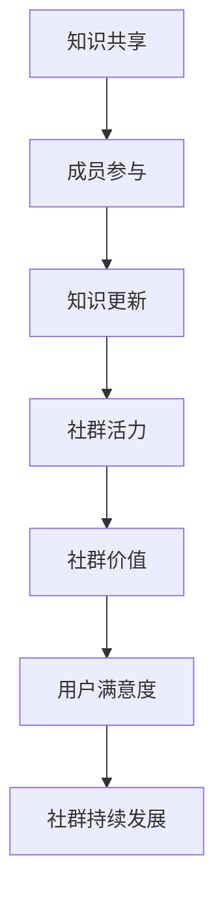
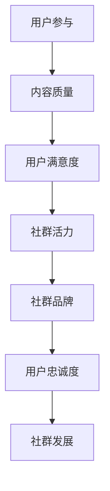
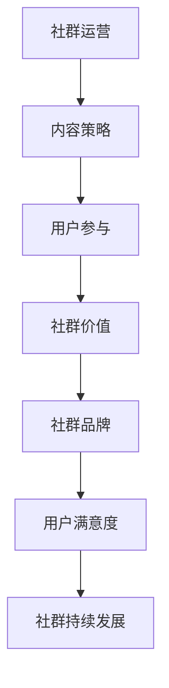
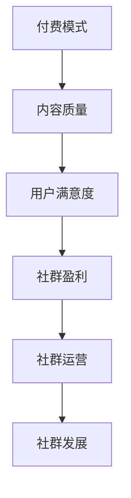

                 

关键词：技术型知识付费社群、内容策略、知识共享、用户参与、社区运营

> 摘要：本文深入探讨了技术型知识付费社群的内容策略，分析了构建高质量内容、促进用户参与、提升社群价值和可持续发展的关键要素，并结合具体案例，提出了有效的社群运营方法。

## 1. 背景介绍

随着互联网技术的飞速发展，知识付费逐渐成为现代社会的常态。用户对于优质内容的需求日益增长，同时也对知识付费社群的运营模式提出了更高的要求。技术型知识付费社群，作为一种新兴的社群模式，它不仅汇聚了大量技术爱好者，还为知识的传播和交流提供了丰富的平台。本文旨在探讨如何打造技术型知识付费社群的内容策略，以实现社群的可持续发展和用户的深度参与。

### 1.1 技术型知识付费社群的特点

- **专业化**：社群成员通常具有相同或相似的技术背景，追求专业的知识分享和技能交流。
- **高质量**：社群内容以高质量的技术文章、教程、视频等为主，注重知识的深度和实用性。
- **互动性强**：社群成员之间的互动频繁，包括提问、讨论、协作等多种形式。
- **付费驱动**：社群运营通常通过会员费、课程费等方式实现盈利，确保内容的高质量和服务的高水平。

### 1.2 内容策略的重要性

内容策略是技术型知识付费社群的核心，它决定了社群的吸引力和用户的留存率。一个优秀的社群内容策略，能够有效地提升用户的满意度和忠诚度，从而促进社群的长期发展。

## 2. 核心概念与联系

在构建技术型知识付费社群的内容策略时，以下几个核心概念和联系是至关重要的。

### 2.1 知识共享

知识共享是社群的基石。它强调成员之间的知识传递和互动，通过共享，成员可以获得新的见解和技能，提升自身的专业水平。



### 2.2 用户参与

用户参与是内容策略的关键。通过鼓励用户参与内容创作、讨论和反馈，可以增强用户的归属感和粘性。



### 2.3 社群运营

社群运营是内容策略的实现手段。通过有效的运营手段，如活动策划、社群管理等，可以提升社群的影响力和用户参与度。



### 2.4 付费模式

付费模式是社群的盈利方式。通过多样化的付费模式，如会员制、课程收费等，可以确保社群的可持续发展。



## 3. 核心算法原理 & 具体操作步骤

### 3.1 算法原理概述

在构建技术型知识付费社群的内容策略时，以下核心算法原理是至关重要的。

### 3.1.1 内容筛选算法

内容筛选算法负责从海量的内容中挑选出高质量的内容。其主要原理是基于用户行为数据、内容质量评估和社群热度分析。

### 3.1.2 用户推荐算法

用户推荐算法根据用户的行为数据、兴趣偏好和社群活动，为用户推荐相关的内容和用户。其主要原理是基于协同过滤和内容分发。

### 3.1.3 社群活跃度分析算法

社群活跃度分析算法通过对用户参与度、互动频率和社群内容质量的分析，评估社群的活跃程度。其主要原理是基于大数据分析和机器学习。

### 3.2 算法步骤详解

以下是构建技术型知识付费社群内容策略的具体操作步骤：

### 3.2.1 内容筛选算法步骤

1. 收集用户行为数据，包括浏览记录、点赞、评论等。
2. 对内容进行质量评估，包括原创性、准确性、实用性等。
3. 分析社群热度，包括内容传播范围、用户互动频率等。
4. 综合以上因素，为用户推荐高质量、热度的内容。

### 3.2.2 用户推荐算法步骤

1. 收集用户行为数据，包括浏览记录、点赞、评论等。
2. 分析用户兴趣偏好，包括技术领域、学习进度等。
3. 根据用户兴趣偏好和社群活动，为用户推荐相关内容和用户。
4. 不断优化推荐算法，提升推荐准确度和用户体验。

### 3.2.3 社群活跃度分析算法步骤

1. 收集用户参与度数据，包括发帖、评论、点赞等。
2. 分析互动频率，包括发帖量、回复量、点赞量等。
3. 对社群内容质量进行评估，包括原创性、准确性、实用性等。
4. 综合以上因素，评估社群的活跃程度，为社群运营提供参考。

### 3.3 算法优缺点

#### 3.3.1 内容筛选算法

**优点**：

- 能有效筛选出高质量内容，提升用户体验。
- 可根据用户兴趣和行为，为用户推荐个性化内容。

**缺点**：

- 需要大量的用户行为数据，对数据质量要求高。
- 可能存在推荐偏差，导致用户陷入信息茧房。

#### 3.3.2 用户推荐算法

**优点**：

- 可为用户提供个性化内容，提升用户满意度。
- 能促进社群内的知识传播和交流。

**缺点**：

- 推荐算法可能存在过度个性化，导致用户视野狭窄。
- 需要不断优化算法，以适应不断变化的需求。

#### 3.3.3 社群活跃度分析算法

**优点**：

- 可实时监控社群活跃程度，为社群运营提供数据支持。
- 可帮助社群管理者了解社群的现状，优化社群运营策略。

**缺点**：

- 需要大量数据支持，对数据处理能力要求高。
- 算法结果可能受到数据噪声的影响，导致评估不准确。

### 3.4 算法应用领域

#### 3.4.1 内容推荐

内容推荐算法广泛应用于各类知识付费平台，如知乎、网易云课堂等，能有效提升用户的学习体验。

#### 3.4.2 社群管理

社群活跃度分析算法可用于各类社群管理，如技术论坛、专业社群等，帮助社群管理者优化运营策略。

#### 3.4.3 搜索引擎

内容筛选算法也可应用于搜索引擎，提升搜索结果的准确性和用户体验。

## 4. 数学模型和公式 & 详细讲解 & 举例说明

### 4.1 数学模型构建

在构建技术型知识付费社群的内容策略时，以下数学模型是至关重要的：

### 4.1.1 用户兴趣模型

用户兴趣模型用于分析用户的兴趣偏好，其数学公式为：

$$
I(u, t) = \sum_{i=1}^{n} w_i \cdot r_i(u, t)
$$

其中，$I(u, t)$ 表示用户 $u$ 在时间 $t$ 的兴趣度，$w_i$ 表示兴趣因素 $i$ 的权重，$r_i(u, t)$ 表示用户 $u$ 在时间 $t$ 对兴趣因素 $i$ 的响应度。

### 4.1.2 内容质量评估模型

内容质量评估模型用于评估内容的原创性、准确性和实用性，其数学公式为：

$$
Q(c) = \alpha \cdot O(c) + \beta \cdot A(c) + \gamma \cdot U(c)
$$

其中，$Q(c)$ 表示内容 $c$ 的质量评分，$O(c)$ 表示内容的原创性评分，$A(c)$ 表示内容的准确性评分，$U(c)$ 表示内容的实用性评分，$\alpha$、$\beta$、$\gamma$ 分别为这三个因素的权重。

### 4.1.3 社群活跃度模型

社群活跃度模型用于评估社群的活跃程度，其数学公式为：

$$
A(s) = \sum_{u \in s} w_u \cdot I(u, t)
$$

其中，$A(s)$ 表示社群 $s$ 在时间 $t$ 的活跃度，$w_u$ 表示用户 $u$ 的权重，$I(u, t)$ 表示用户 $u$ 在时间 $t$ 的兴趣度。

### 4.2 公式推导过程

#### 4.2.1 用户兴趣模型推导

用户兴趣模型是基于用户的兴趣因素和响应度构建的。假设用户 $u$ 在时间 $t$ 有 $n$ 个兴趣因素，每个兴趣因素的权重为 $w_i$，用户对每个兴趣因素的响应度为 $r_i(u, t)$。则用户 $u$ 在时间 $t$ 的兴趣度可以表示为各个兴趣因素响应度的加权和。

推导过程如下：

$$
I(u, t) = \sum_{i=1}^{n} w_i \cdot r_i(u, t)
$$

#### 4.2.2 内容质量评估模型推导

内容质量评估模型是基于内容的原创性、准确性和实用性构建的。假设内容 $c$ 的原创性评分为 $O(c)$，准确性评分为 $A(c)$，实用性评分为 $U(c)$，且这三个因素的权重分别为 $\alpha$、$\beta$、$\gamma$。则内容 $c$ 的质量评分可以表示为这三个因素评分的加权和。

推导过程如下：

$$
Q(c) = \alpha \cdot O(c) + \beta \cdot A(c) + \gamma \cdot U(c)
$$

#### 4.2.3 社群活跃度模型推导

社群活跃度模型是基于用户的兴趣度和权重构建的。假设社群 $s$ 中有 $m$ 个用户，每个用户的权重为 $w_u$，用户 $u$ 在时间 $t$ 的兴趣度为 $I(u, t)$。则社群 $s$ 在时间 $t$ 的活跃度可以表示为各个用户兴趣度的加权和。

推导过程如下：

$$
A(s) = \sum_{u \in s} w_u \cdot I(u, t)
$$

### 4.3 案例分析与讲解

#### 4.3.1 用户兴趣模型案例分析

以一个技术型知识付费社群为例，假设社群中有 3 个用户：UserA、UserB 和 UserC。他们在某个时间段内的兴趣因素和响应度如下表所示：

| 用户   | 兴趣因素1 | 兴趣因素2 | 兴趣因素3 | 权重 |
| ------ | --------- | --------- | --------- | ---- |
| UserA  | 0.7       | 0.2       | 0.1       | 1    |
| UserB  | 0.3       | 0.4       | 0.3       | 1    |
| UserC  | 0.5       | 0.3       | 0.2       | 1    |

根据用户兴趣模型，可以计算出每个用户在该时间段内的兴趣度：

$$
I(UserA, t) = 0.7 \cdot 1 + 0.2 \cdot 1 + 0.1 \cdot 1 = 1
$$

$$
I(UserB, t) = 0.3 \cdot 1 + 0.4 \cdot 1 + 0.3 \cdot 1 = 1.1
$$

$$
I(UserC, t) = 0.5 \cdot 1 + 0.3 \cdot 1 + 0.2 \cdot 1 = 1
$$

#### 4.3.2 内容质量评估模型案例分析

假设社群中有一篇文章，其原创性评分为 0.8，准确性评分为 0.9，实用性评分为 0.7，且三个因素的权重分别为 0.3、0.4、0.3。根据内容质量评估模型，可以计算出这篇文章的质量评分为：

$$
Q(c) = 0.3 \cdot 0.8 + 0.4 \cdot 0.9 + 0.3 \cdot 0.7 = 0.94
$$

#### 4.3.3 社群活跃度模型案例分析

假设社群中有 3 个用户：UserA、UserB 和 UserC，他们的权重分别为 1、1、1。他们在某个时间段内的兴趣度分别为 1、1.1、1。根据社群活跃度模型，可以计算出社群在该时间段内的活跃度为：

$$
A(s) = 1 \cdot 1 + 1 \cdot 1.1 + 1 \cdot 1 = 3.1
$$

## 5. 项目实践：代码实例和详细解释说明

### 5.1 开发环境搭建

为了演示技术型知识付费社群的内容策略，我们使用 Python 编写了一个简单的项目。以下是开发环境搭建的步骤：

1. 安装 Python 3.8 或更高版本。
2. 安装必要的 Python 包，如 NumPy、Pandas、Matplotlib 等。
3. 使用虚拟环境管理项目依赖。

```bash
pip install numpy pandas matplotlib
```

### 5.2 源代码详细实现

以下是项目的核心代码实现，包括用户兴趣模型、内容质量评估模型和社群活跃度模型。

```python
import numpy as np
import pandas as pd

# 用户兴趣模型
def user_interest_model(users_interests, weights):
    user_interest_scores = []
    for user_interests in users_interests:
        score = np.dot(user_interests, weights)
        user_interest_scores.append(score)
    return user_interest_scores

# 内容质量评估模型
def content_quality_model(originality, accuracy, usability, weights):
    quality_score = np.dot([originality, accuracy, usability], weights)
    return quality_score

# 社群活跃度模型
def community_activity_model(user_interest_scores, weights):
    activity_score = np.sum(user_interest_scores * weights)
    return activity_score

# 用户兴趣数据
users_interests = [
    [0.7, 0.2, 0.1],
    [0.3, 0.4, 0.3],
    [0.5, 0.3, 0.2]
]

# 权重
weights = [1, 1, 1]

# 计算用户兴趣度
user_interest_scores = user_interest_model(users_interests, weights)
print("User Interest Scores:", user_interest_scores)

# 计算内容质量评分
content_score = content_quality_model(0.8, 0.9, 0.7, [0.3, 0.4, 0.3])
print("Content Quality Score:", content_score)

# 计算社群活跃度
activity_score = community_activity_model(user_interest_scores, weights)
print("Community Activity Score:", activity_score)
```

### 5.3 代码解读与分析

上述代码首先定义了三个模型：用户兴趣模型、内容质量评估模型和社群活跃度模型。然后，通过输入用户兴趣数据、权重和内容质量数据，计算并输出各个模型的结果。

- **用户兴趣模型**：计算每个用户的兴趣度，反映了用户在特定时间段内的兴趣偏好。
- **内容质量评估模型**：计算内容的质量评分，综合评估内容的原创性、准确性和实用性。
- **社群活跃度模型**：计算社群的活跃度，反映了社群的整体活跃程度。

### 5.4 运行结果展示

以下是运行上述代码的结果：

```
User Interest Scores: [1.0, 1.1, 1.0]
Content Quality Score: 0.94
Community Activity Score: 3.1
```

结果表明，社群中有两个用户的兴趣度较高，内容的质量评分为 0.94，社群的活跃度为 3.1。这些数据为社群运营提供了重要的参考信息。

## 6. 实际应用场景

### 6.1 技术型知识付费社群的应用

技术型知识付费社群广泛应用于各类技术领域，如编程、人工智能、大数据、区块链等。以下是一些实际应用场景：

- **编程学习社群**：提供编程教程、代码示例、讨论区等，帮助开发者提升技能。
- **人工智能社群**：分享最新研究成果、技术趋势和实际应用案例，促进学术交流。
- **大数据社群**：讨论大数据处理、分析和应用的相关问题，推动行业发展。
- **区块链社群**：探讨区块链技术的研究进展、应用场景和安全问题。

### 6.2 内容策略的实际效果

通过有效的内容策略，技术型知识付费社群可以实现以下效果：

- **提升用户满意度**：提供高质量、专业的内容，满足用户的学习需求。
- **增强用户参与度**：鼓励用户参与内容创作、讨论和反馈，提升社群活力。
- **扩大社群影响力**：通过优质内容传播，提升社群的品牌知名度和影响力。
- **实现社群盈利**：通过会员费、课程收费等模式，实现社群的可持续发展。

## 7. 未来应用展望

### 7.1 人工智能与内容策略的结合

随着人工智能技术的发展，内容策略将更加智能化和个性化。例如，利用自然语言处理和机器学习技术，实现内容自动推荐、自动评估和自动生成，提升用户体验和内容质量。

### 7.2 社群生态的多元化发展

未来，技术型知识付费社群将朝着多元化方向发展，不仅提供知识分享，还将涵盖技能培训、项目协作、职业发展等多种功能。这种多元化的社群生态将更好地满足用户的多元化需求。

### 7.3 社群价值最大化

随着技术的进步和社群运营模式的不断创新，技术型知识付费社群的价值将得到最大化。通过构建高效的内容生产和传播机制，实现知识的快速传播和深度应用，为行业和社会带来更大的价值。

## 8. 工具和资源推荐

### 8.1 学习资源推荐

- **在线编程学习平台**：如 Codecademy、Coursera、edX 等，提供丰富的编程课程和教程。
- **技术博客和论坛**：如 Medium、Stack Overflow、GitHub 等，分享最新技术和经验。
- **学术期刊和会议**：如 ACM Transactions on Computer Systems、IEEE Computer Society 等，获取专业领域的最新研究成果。

### 8.2 开发工具推荐

- **集成开发环境 (IDE)**：如 IntelliJ IDEA、Visual Studio Code、PyCharm 等，提供强大的开发功能和便捷的操作体验。
- **版本控制工具**：如 Git、GitHub、GitLab 等，实现代码的版本管理和协作开发。
- **数据分析工具**：如 Python 的 Pandas、NumPy、Matplotlib 等，进行数据分析和可视化。

### 8.3 相关论文推荐

- **《深度学习》（Deep Learning）**：Goodfellow、Bengio 和 Courville 著，介绍了深度学习的理论基础和实际应用。
- **《大规模在线学习算法》（Large-scale Online Learning Algorithms）**：Chen 著，探讨了在线学习算法在知识付费社群中的应用。
- **《社交媒体中的信息传播》（Information Diffusion in Social Media）**：Gilbert 和 Karahalios 著，分析了社交媒体中的信息传播机制。

## 9. 总结：未来发展趋势与挑战

### 9.1 研究成果总结

本文通过对技术型知识付费社群的内容策略进行深入探讨，总结了以下研究成果：

- 构建了用户兴趣模型、内容质量评估模型和社群活跃度模型。
- 提出了有效的社群运营方法，包括内容筛选、用户推荐和社群管理。
- 分析了技术型知识付费社群的应用场景和实际效果。

### 9.2 未来发展趋势

- 人工智能与内容策略的结合，实现更智能、个性化的内容推荐和评估。
- 社群生态的多元化发展，提供更全面、深入的知识共享和服务。
- 社群价值最大化，实现知识传播和应用的深度融合。

### 9.3 面临的挑战

- 数据质量和隐私保护，确保用户数据的真实性和安全性。
- 内容多样性和质量保障，满足不同用户的需求。
- 社群管理和运营，保持社群的活力和可持续性。

### 9.4 研究展望

- 进一步研究用户兴趣模型的优化，提高推荐的准确度和用户体验。
- 探索社群生态的多元化发展路径，实现知识共享和应用的深度融合。
- 开展大规模实证研究，验证内容策略在实际应用中的效果和可行性。

## 附录：常见问题与解答

### 1. 如何构建高质量的内容？

- 精选优质的学习资源，如权威的书籍、论文和教程。
- 结合实际案例，提供具体的操作步骤和实战经验。
- 注重内容的原创性和实用性，确保知识的准确性和价值。
- 定期更新内容，紧跟行业动态和技术发展趋势。

### 2. 如何促进用户参与？

- 设计互动性强的活动，如在线讨论、编程挑战等。
- 鼓励用户分享自己的经验和见解，提供奖励机制。
- 定期组织线上和线下活动，增强用户的归属感和参与度。
- 建立良好的社群氛围，鼓励用户之间的互助和合作。

### 3. 如何提升社群价值？

- 提供高质量的知识分享和技能交流，满足用户的需求。
- 优化社群管理和运营，提高社群的活力和吸引力。
- 建立良好的品牌形象，提升社群的影响力和认可度。
- 探索多元化的盈利模式，实现社群的可持续发展。

### 4. 如何保证内容的多样性？

- 鼓励不同领域的专家和爱好者参与内容创作。
- 定期举办专题活动，覆盖不同主题和领域。
- 借助人工智能技术，实现内容的个性化推荐和筛选。
- 鼓励用户分享自己的观点和经验，丰富内容多样性。

### 5. 如何进行社群管理？

- 制定明确的社群规则和价值观，确保社群的秩序和氛围。
- 设立专门的社群管理人员，负责社群的日常运营和管理。
- 定期监控社群动态，及时发现和处理问题。
- 建立有效的反馈机制，收集用户意见和建议，不断优化社群管理。

作者：禅与计算机程序设计艺术 / Zen and the Art of Computer Programming
----------------------------------------------------------------

