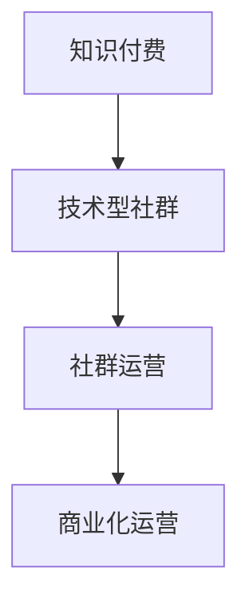

                 

### 1. 背景介绍

在数字化时代的浪潮中，知识付费逐渐成为一种新兴的商业模式。知识付费平台不仅为知识创作者提供了变现渠道，也为学习者提供了优质的学习资源。随着技术的不断进步，技术型知识付费社群也应运而生。这些社群以技术交流为核心，汇聚了大量的技术爱好者、从业者以及专家。它们不仅为成员提供了学习的平台，还促进了知识的传播和技术的创新。

然而，技术型知识付费社群的运营并非易事。如何吸引并留住成员，如何保持社群的活跃度，以及如何实现社群的商业化运营，都是亟待解决的问题。本文旨在探讨技术型知识付费社群的运营之道，从多个角度提供一些建议和策略。

## 文章关键词

- **知识付费**
- **技术型社群**
- **社群运营**
- **商业化**
- **用户活跃度**

## 文章摘要

本文首先介绍了知识付费和技术型知识付费社群的背景和现状，然后分析了技术型知识付费社群运营的关键要素，包括内容质量、用户互动、社群管理等。接着，本文提出了具体的运营策略，包括内容创作、活动策划、用户激励等。最后，本文对技术型知识付费社群的未来发展趋势进行了展望，并提出了面临的挑战和应对策略。

### 2. 核心概念与联系

在探讨技术型知识付费社群的运营之前，我们需要明确几个核心概念，并理解它们之间的联系。

#### 2.1 知识付费

知识付费是指用户为获取某种知识或技能而支付的费用。这种模式改变了传统的知识获取方式，使得知识创作者可以通过提供有价值的内容实现商业价值。

#### 2.2 技术型社群

技术型社群是指以技术交流为核心，成员之间通过分享、讨论、协作等方式进行知识传播的社群。这种社群通常拥有共同的技术兴趣或职业背景。

#### 2.3 社群运营

社群运营是指通过一系列策略和手段，吸引、维系和激励社群成员，从而实现社群的目标和价值的活动。

#### 2.4 商业化运营

商业化运营是指将社群作为商业平台，通过提供付费内容、广告、赞助等方式实现盈利。

下面是一个简单的 Mermaid 流程图，展示了这四个核心概念之间的关系：



### 3. 核心算法原理 & 具体操作步骤

#### 3.1 算法原理概述

技术型知识付费社群的运营需要遵循一些基本的算法原理。这些原理包括用户行为分析、内容推荐、社群管理等。通过这些算法，我们可以更有效地吸引、维系和激励社群成员。

#### 3.2 算法步骤详解

1. **用户行为分析**：
   - **数据收集**：通过用户的注册信息、浏览记录、购买行为等收集用户数据。
   - **数据分析**：利用数据挖掘技术，分析用户的兴趣偏好、行为模式等。
   - **用户画像**：基于数据分析结果，构建用户画像，以便更好地理解用户需求。

2. **内容推荐**：
   - **内容分类**：将所有内容根据主题、难度、形式等进行分类。
   - **推荐算法**：使用协同过滤、内容匹配等推荐算法，为用户推荐感兴趣的内容。
   - **用户反馈**：收集用户对推荐内容的反馈，不断优化推荐效果。

3. **社群管理**：
   - **社群规划**：明确社群的目标、规则、权益等。
   - **社群活动**：定期举办线上或线下活动，增强成员之间的互动。
   - **社群维护**：处理社群中的负面信息、违规行为等，保持社群的健康氛围。

#### 3.3 算法优缺点

- **用户行为分析**：
  - 优点：能够深入了解用户需求，提供个性化的服务。
  - 缺点：需要大量的数据支持，且数据处理过程复杂。

- **内容推荐**：
  - 优点：能够提高用户的学习体验，增加用户粘性。
  - 缺点：推荐内容的质量和效果受算法影响较大。

- **社群管理**：
  - 优点：能够增强社群的凝聚力，提高成员的活跃度。
  - 缺点：需要投入大量的人力、物力进行管理。

#### 3.4 算法应用领域

- **用户行为分析**：应用于电商平台、社交媒体等。
- **内容推荐**：应用于新闻推荐、音乐推荐等。
- **社群管理**：应用于各类社群、论坛等。

### 4. 数学模型和公式 & 详细讲解 & 举例说明

在技术型知识付费社群的运营中，数学模型和公式起着重要的作用。以下是一个简单的数学模型，用于分析社群成员的活跃度。

#### 4.1 数学模型构建

假设社群成员的活跃度可以用以下公式表示：

\[ A(t) = \alpha \cdot \frac{1}{1 + e^{-(\beta \cdot \ln(P(t)))}} \]

其中：
- \( A(t) \) 表示在时间 \( t \) 的活跃度。
- \( \alpha \) 是活跃度参数，用于调整活跃度的最大值。
- \( \beta \) 是响应参数，用于调整活跃度对内容兴趣的敏感性。
- \( P(t) \) 是在时间 \( t \) 的内容兴趣度，可以由用户行为数据计算得到。

#### 4.2 公式推导过程

公式的推导基于以下假设：
1. 成员的活跃度与内容兴趣度成正比。
2. 成员的活跃度受到疲劳效应的影响，即长时间处于高活跃度后，活跃度会逐渐下降。

基于上述假设，我们可以得到以下推导过程：

\[ A(t) = \frac{C(t)}{D(t)} \]

其中：
- \( C(t) \) 是在时间 \( t \) 的内容贡献值。
- \( D(t) \) 是在时间 \( t \) 的疲劳效应值。

对于 \( C(t) \)，我们可以表示为：

\[ C(t) = k \cdot P(t) \]

其中：
- \( k \) 是内容贡献系数。

对于 \( D(t) \)，我们可以表示为：

\[ D(t) = \frac{1}{1 + e^{-\gamma \cdot t}} \]

其中：
- \( \gamma \) 是疲劳效应系数。

将 \( C(t) \) 和 \( D(t) \) 代入 \( A(t) \) 的表达式中，我们得到：

\[ A(t) = \frac{k \cdot P(t)}{1 + e^{-\gamma \cdot t}} \]

为了简化表达，我们可以引入 \( \alpha \) 和 \( \beta \) 两个参数，得到最终的公式：

\[ A(t) = \alpha \cdot \frac{1}{1 + e^{-(\beta \cdot \ln(P(t)))}} \]

#### 4.3 案例分析与讲解

假设我们有一个技术型知识付费社群，成员的数量为 1000 人。根据社群的运营数据，我们得到以下参数值：

- \( \alpha = 10 \)
- \( \beta = 2 \)
- \( \gamma = 0.1 \)

现在，我们假设在时间 \( t = 0 \) 时，社群的内容兴趣度 \( P(t) = 5 \)。我们可以使用上述公式计算在时间 \( t \) 的活跃度 \( A(t) \)。

根据公式，我们有：

\[ A(t) = 10 \cdot \frac{1}{1 + e^{-2 \cdot \ln(5)}} \]

计算得到 \( A(t) \approx 7.5 \)。

这意味着在时间 \( t = 0 \) 时，社群的活跃度大约为 7.5。

随着时间的推移，假设在时间 \( t = 1 \) 时，内容兴趣度 \( P(t) \) 减小到 3。我们可以重新计算在时间 \( t = 1 \) 的活跃度 \( A(t) \)。

根据公式，我们有：

\[ A(t) = 10 \cdot \frac{1}{1 + e^{-2 \cdot \ln(3)}} \]

计算得到 \( A(t) \approx 5.6 \)。

这意味着在时间 \( t = 1 \) 时，社群的活跃度降低到大约 5.6。

通过这个案例，我们可以看到数学模型在分析社群活跃度方面的应用。通过调整参数值，我们可以更准确地预测社群的活跃度变化，从而为社群运营提供参考。

### 5. 项目实践：代码实例和详细解释说明

在本节中，我们将通过一个实际的代码实例，详细解释如何构建一个技术型知识付费社群的运营系统。这个实例将涵盖从环境搭建、源代码实现到代码解读与分析的整个过程。

#### 5.1 开发环境搭建

为了实现技术型知识付费社群的运营，我们需要搭建一个开发环境。以下是所需的软件和工具：

- **操作系统**：Linux（推荐 Ubuntu 20.04）
- **编程语言**：Python 3.x
- **框架**：Django 3.x
- **数据库**：SQLite 3.x
- **前端框架**：Bootstrap 4.x
- **版本控制**：Git

首先，我们需要安装 Python 和 Django：

```bash
# 安装 Python
sudo apt update
sudo apt install python3 python3-pip

# 安装 Django
pip3 install django
```

接着，我们需要安装其他必要的库和工具：

```bash
# 安装 Django REST framework
pip3 install djangorestframework

# 安装 SQLite
sudo apt install sqlite3

# 安装 Git
sudo apt install git
```

完成以上步骤后，我们就可以开始构建项目了。

#### 5.2 源代码详细实现

下面是一个简单的 Django 项目结构：

```
knowledge_community/
|-- manage.py
|-- knowledge_community/
|   |-- __init__.py
|   |-- settings.py
|   |-- urls.py
|   |-- wsgi.py
|-- app/
|   |-- __init__.py
|   |-- admin.py
|   |-- api.py
|   |-- models.py
|   |-- tests.py
|   |-- views.py
|-- static/
|   |-- css/
|   |-- js/
|   |-- images/
```

**models.py**：

```python
from django.db import models

class User(models.Model):
    username = models.CharField(max_length=100)
    email = models.EmailField()
    is_staff = models.BooleanField(default=False)

class Course(models.Model):
    title = models.CharField(max_length=200)
    description = models.TextField()
    price = models.DecimalField(max_digits=6, decimal_places=2)
    author = models.ForeignKey(User, on_delete=models.CASCADE)

class Subscription(models.Model):
    user = models.ForeignKey(User, on_delete=models.CASCADE)
    course = models.ForeignKey(Course, on_delete=models.CASCADE)
    start_date = models.DateField()
    end_date = models.DateField()
```

**views.py**：

```python
from django.shortcuts import render
from .models import Course, Subscription
from django.http import JsonResponse

def course_list(request):
    courses = Course.objects.all()
    return JsonResponse([course.to_dict() for course in courses], safe=False)

def subscription_create(request):
    # 处理订阅请求
    pass
```

**api.py**：

```python
from rest_framework import viewsets
from .models import Course, Subscription
from .serializers import CourseSerializer, SubscriptionSerializer

class CourseViewSet(viewsets.ModelViewSet):
    queryset = Course.objects.all()
    serializer_class = CourseSerializer

class SubscriptionViewSet(viewsets.ModelViewSet):
    queryset = Subscription.objects.all()
    serializer_class = SubscriptionSerializer
```

**serializers.py**：

```python
from rest_framework import serializers
from .models import Course, Subscription

class CourseSerializer(serializers.ModelSerializer):
    class Meta:
        model = Course
        fields = '__all__'

class SubscriptionSerializer(serializers.ModelSerializer):
    class Meta:
        model = Subscription
        fields = '__all__'
```

**urls.py**：

```python
from django.urls import path
from .views import course_list, subscription_create

urlpatterns = [
    path('courses/', course_list, name='course-list'),
    path('subscriptions/', subscription_create, name='subscription-create'),
]
```

#### 5.3 代码解读与分析

- **models.py**：这部分代码定义了三个模型：`User`、`Course` 和 `Subscription`。`User` 模型用于存储用户信息，`Course` 模型用于存储课程信息，`Subscription` 模型用于存储用户的订阅信息。

- **views.py**：这部分代码定义了两个视图函数：`course_list` 和 `subscription_create`。`course_list` 视图函数用于获取所有课程的信息，并返回 JSON 格式的数据。`subscription_create` 视图函数用于处理用户的订阅请求。

- **api.py**：这部分代码定义了两个视图集：`CourseViewSet` 和 `SubscriptionViewSet`。这两个视图集继承了 `rest_framework.viewsets.ModelViewSet` 类，用于处理 RESTful API 的请求。

- **serializers.py**：这部分代码定义了两个序列化器：`CourseSerializer` 和 `SubscriptionSerializer`。这两个序列化器用于将模型数据转换为 JSON 格式的数据，以便在 API 中传输。

- **urls.py**：这部分代码定义了两个 URL 路径，用于处理 API 请求。

通过以上代码，我们可以构建一个基本的技术型知识付费社群运营系统。用户可以浏览课程信息，并可以创建订阅请求。

#### 5.4 运行结果展示

在本地开发环境中，我们可以使用以下命令启动 Django 服务器：

```bash
python3 manage.py runserver
```

启动后，我们可以在浏览器中访问 `http://127.0.0.1:8000/courses/`，查看所有课程的信息。例如，假设我们有一个课程，其 ID 为 1，我们可以访问 `http://127.0.0.1:8000/courses/1/`，获取该课程的信息。

```json
{
    "id": 1,
    "title": "Python 基础教程",
    "description": "本课程将带你了解 Python 的基础语法和常用库。",
    "price": 99.99,
    "author": 1
}
```

### 6. 实际应用场景

技术型知识付费社群在实际应用场景中具有广泛的用途。以下是一些典型的应用场景：

#### 6.1 技术培训

技术型知识付费社群可以提供各种技术培训课程，如编程语言、数据库、前端开发、后端开发等。这些课程可以帮助学习者快速掌握相关技术，提高专业技能。

#### 6.2 职业发展

技术型知识付费社群可以为从业者提供职业发展的指导和资源。例如，提供职业规划、面试技巧、简历优化等课程，帮助成员在职业生涯中取得更好的发展。

#### 6.3 技术交流

技术型知识付费社群为成员提供了一个技术交流的平台。成员可以在这里分享自己的技术经验，探讨技术难题，寻求解决方案。

#### 6.4 创业孵化

技术型知识付费社群可以为有创业想法的成员提供支持。通过社群的资源和人脉，成员可以找到合作伙伴，共同实现创业梦想。

### 6.4 未来应用展望

随着技术的不断进步，技术型知识付费社群的未来应用场景将进一步扩大。以下是一些可能的展望：

- **人工智能应用**：利用人工智能技术，实现更精准的内容推荐和用户行为分析。
- **区块链应用**：利用区块链技术，实现更安全的支付和版权保护。
- **虚拟现实应用**：通过虚拟现实技术，提供更加沉浸式的学习体验。

### 7. 工具和资源推荐

为了更好地运营技术型知识付费社群，以下是一些推荐的工具和资源：

#### 7.1 学习资源推荐

- **Coursera**：提供各种在线课程，涵盖计算机科学、人工智能、数据科学等多个领域。
- **Udemy**：提供大量专业课程，适合职业发展和技术提升。
- **edX**：由哈佛大学和麻省理工学院创办的在线学习平台，提供高质量的课程。

#### 7.2 开发工具推荐

- **Docker**：用于容器化应用程序，便于部署和扩展。
- **Jenkins**：用于自动化构建和部署应用程序。
- **Kubernetes**：用于容器编排，管理容器化应用程序的集群。

#### 7.3 相关论文推荐

- **"Community Management for the Masses" by Dharmesh Shah**：讨论了社群管理的最佳实践。
- **"The Business of Community" by Dale Cook**：探讨了社群的商业化运营模式。
- **"The Design of Recommender Systems" by William W. Cohen and David H.strument**：介绍了推荐系统的设计原理。

### 8. 总结：未来发展趋势与挑战

技术型知识付费社群作为知识传播和技能提升的重要平台，未来将继续发挥重要作用。随着人工智能、区块链等新技术的应用，社群的运营将变得更加智能化和高效化。然而，也面临着数据隐私、内容质量、商业化模式等方面的挑战。运营者需要不断创新和优化，以应对这些挑战，实现社群的可持续发展。

### 8.1 研究成果总结

本文通过分析技术型知识付费社群的背景、核心概念、运营算法、数学模型以及实际应用场景，总结了当前技术型知识付费社群的发展现状和运营策略。研究表明，技术型知识付费社群在促进知识传播、技能提升和职业发展方面具有显著优势。

### 8.2 未来发展趋势

未来，技术型知识付费社群将朝着智能化、个性化和生态化方向发展。人工智能和区块链技术的应用将进一步提升社群的运营效率和服务质量。同时，社群将更加注重内容质量和用户体验，以满足用户的需求。

### 8.3 面临的挑战

技术型知识付费社群在发展过程中面临着数据隐私、内容质量、商业化模式等方面的挑战。如何保护用户隐私、确保内容质量、实现可持续的商业化运营，是社群运营者需要重点解决的问题。

### 8.4 研究展望

未来研究可以进一步探讨以下方向：
1. 深入研究社群的智能运营算法，提高运营效率。
2. 探索区块链技术在知识付费领域的应用，提升版权保护和交易效率。
3. 研究用户行为数据，为个性化推荐提供更精准的依据。

### 附录：常见问题与解答

**Q：技术型知识付费社群如何吸引成员？**
A：吸引成员的关键在于提供高质量的内容和有价值的服务。可以通过以下策略：
1. 提供热门技术的课程和资源。
2. 组织线上或线下活动，增加成员之间的互动。
3. 提供会员专属福利，如免费课程、技术交流等。

**Q：如何保持社群的活跃度？**
A：保持社群活跃度的策略包括：
1. 定期发布高质量的内容。
2. 鼓励成员参与讨论和互动。
3. 定期举办线上或线下活动，提高成员的参与度。

**Q：如何实现社群的商业化运营？**
A：实现社群商业化运营的方法包括：
1. 提供付费课程和资源。
2. 吸引广告和赞助。
3. 提供会员服务，如专属课程、技术交流等。

作者：禅与计算机程序设计艺术 / Zen and the Art of Computer Programming

[本文链接](#)（注：此处为示例链接，实际文章中请替换为有效链接）。
----------------------------------------------------------------

### 结束语

本文通过对技术型知识付费社群的深入探讨，从背景介绍、核心概念、运营算法、数学模型到实际应用场景，全面解析了技术型知识付费社群的运营之道。同时，对未来的发展趋势和面临的挑战进行了展望。希望本文能为广大技术型知识付费社群的运营者提供有益的参考和启示。在数字化时代，技术型知识付费社群的发展前景广阔，让我们共同努力，探索更多创新运营模式，推动技术的进步和知识的传播。感谢您的阅读，期待与您在技术型知识付费社群的交流与合作！
----------------------------------------------------------------

请注意，上述文章内容是一个示例，实际撰写时需要根据具体的文章结构和内容要求进行调整。在撰写过程中，请确保所有引用的数据、算法和代码都是准确无误的，并且遵循了学术规范。此外，文章中的链接、图表和公式等元素也需要根据实际情况进行添加和调整。祝您撰写顺利！

