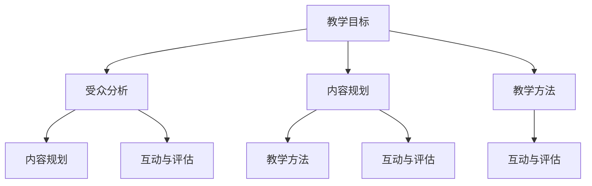

                 

关键词：知识付费、技术课程、教学方法、课程设计、学习体验

> 摘要：本文旨在为技术型知识付费课程的设计与打造提供一套系统的方法和技巧。通过深入分析技术型知识的特点、教学目标以及受众需求，我们将探讨如何构建高质量的技术课程，从而实现知识的有效传递和学员的深度学习。

## 1. 背景介绍

在信息爆炸的时代，知识付费作为一种新的学习模式逐渐受到人们的青睐。技术型知识付费课程，更是以其专业性和实用性成为许多学习者和专业人士的追求。然而，如何打造出一门高质量的技术型知识付费课程，不仅需要深厚的专业知识，更需要巧妙的教学方法和课程设计。

本文将从以下几个方面展开讨论：

- 技术型知识的特点与教学目标
- 受众需求分析
- 课程设计的核心要素
- 教学方法的创新与应用
- 互动与评估机制的设计
- 课程推广与营销策略
- 持续改进与反馈机制

通过上述内容，希望能为技术型知识付费课程的设计者和开发者提供有益的启示和参考。

### 1.1 技术型知识的特点

技术型知识通常具有以下特点：

- **专业性**：技术知识具有较高的专业门槛，需要学习者具备一定的前置知识储备。
- **实践性**：技术知识往往需要通过实践来掌握，理论知识的理解与实际操作相结合是学习的关键。
- **更新快**：技术领域发展迅速，知识更新换代频繁，课程内容需要不断迭代和更新。
- **综合性**：技术知识往往涉及多个学科领域，要求学习者具备跨学科的综合能力。

### 1.2 教学目标

技术型知识付费课程的教学目标主要包括：

- **知识传递**：确保学习者能够系统地掌握所需的技术知识。
- **能力提升**：通过实际操作和案例分析，提升学习者的实际应用能力和解决问题的能力。
- **经验积累**：分享行业专家的实践经验，帮助学习者更快地积累实战经验。
- **职业发展**：为学习者的职业发展提供指导和支持，助力其职业晋升和技能提升。

### 1.3 受众需求分析

技术型知识付费课程的受众主要包括以下几类：

- **初学者**：对某一技术领域感兴趣，希望通过系统学习来入门。
- **从业者**：已经在某一技术领域工作，希望通过学习提升专业技能和知识水平。
- **专业人士**：具备一定技术背景，希望深入研究和探索某一技术领域的最新发展。
- **管理者**：需要了解技术知识以更好地管理团队和项目。

他们的需求各有侧重，但普遍关注以下几个方面：

- **内容质量**：课程内容是否权威、实用、与时俱进。
- **教学方式**：教学方法是否生动有趣、易于理解。
- **学习体验**：课程设计是否合理，学习过程是否顺畅。
- **互动与交流**：课程是否提供充分的互动和交流机会。
- **认证与认证**：课程结束后是否提供认证，以证明学习成果。

## 2. 核心概念与联系

在构建技术型知识付费课程时，以下几个核心概念是至关重要的：

- **教学目标**：明确课程的教学目标，确保课程内容与目标紧密相关。
- **受众分析**：了解受众的需求和特点，设计符合受众需求的课程。
- **内容规划**：系统地规划课程内容，确保知识的逻辑性和系统性。
- **教学方法**：选择合适的教学方法，提高课程的教学效果。
- **互动与评估**：设计互动和评估机制，促进学习者的积极参与和知识吸收。

以下是一个简单的Mermaid流程图，展示了这些核心概念之间的联系：



### 2.1 教学目标

教学目标是课程设计的第一步，它决定了课程的内容和教学方式。明确的教学目标有助于：

- **指导课程设计**：确保课程内容与目标一致。
- **提高教学效果**：有针对性地设计教学内容和方法。
- **评估学习成果**：通过目标达成情况来评估学习效果。

### 2.2 受众分析

受众分析是了解学习者的需求和特点，为课程设计提供依据。具体步骤包括：

- **需求调研**：通过问卷调查、访谈等方式收集受众需求。
- **特点分析**：分析受众的职业背景、学习习惯、技能水平等。
- **细分受众**：根据不同需求和特点，将受众分为不同的群体。

### 2.3 内容规划

内容规划是课程设计的关键，它决定了课程的知识结构和逻辑性。具体步骤包括：

- **知识梳理**：对所需传授的知识进行梳理和分类。
- **设计课程大纲**：根据教学目标和学习者需求，设计课程大纲。
- **编写课程内容**：将知识转化为文字、图片、视频等形式。

### 2.4 教学方法

教学方法的选择直接影响课程的教学效果。常见的教学方法包括：

- **讲授法**：通过讲解来传授知识。
- **案例法**：通过案例分析来加深对知识的理解。
- **讨论法**：通过讨论来激发思维和互动。
- **实践法**：通过实际操作来掌握知识。

### 2.5 互动与评估

互动与评估是提高学习者参与度和学习效果的重要手段。具体包括：

- **互动设计**：设计互动环节，如问答、讨论、游戏等。
- **评估机制**：设计评估机制，如测试、作业、项目等。
- **反馈机制**：收集学习者的反馈，及时调整和改进课程。

## 3. 核心算法原理 & 具体操作步骤

### 3.1 算法原理概述

在技术型知识付费课程的设计过程中，算法原理的理解和运用至关重要。以下是一个简单的算法原理概述：

- **目标函数**：定义课程设计的优化目标，如内容质量、学习效果等。
- **输入**：课程内容、学习者需求、教学资源等。
- **输出**：设计出符合教学目标的课程方案。

### 3.2 算法步骤详解

以下是算法的具体步骤详解：

#### 3.2.1 教学目标设定

- **需求调研**：收集学习者的需求和目标。
- **目标提炼**：将需求转化为具体的课程教学目标。

#### 3.2.2 受众分析

- **受众细分**：根据职业背景、技能水平等将学习者分为不同群体。
- **需求匹配**：将教学目标与受众需求进行匹配。

#### 3.2.3 内容规划

- **知识梳理**：对技术知识进行系统梳理。
- **课程大纲设计**：根据教学目标和学习者需求设计课程大纲。

#### 3.2.4 教学方法选择

- **教学方法库**：构建多种教学方法的库。
- **方法选择**：根据教学目标和受众特点选择合适的教学方法。

#### 3.2.5 互动与评估设计

- **互动环节设计**：设计互动环节，如讨论、问答、游戏等。
- **评估机制设计**：设计评估机制，如测试、作业、项目等。

### 3.3 算法优缺点

#### 优点

- **目标明确**：通过算法可以明确课程设计的优化目标。
- **效率高**：算法能够快速生成课程方案，节省设计时间。
- **灵活性强**：可以根据实际情况灵活调整课程内容和方法。

#### 缺点

- **依赖数据**：算法的效果依赖于数据的准确性和完整性。
- **缺乏人性化**：算法可能无法完全考虑学习者的个体差异。

### 3.4 算法应用领域

算法在技术型知识付费课程设计中的应用非常广泛，包括：

- **课程内容优化**：通过算法分析学习者需求，优化课程内容。
- **教学方法选择**：根据学习者特点选择最合适的教学方法。
- **互动与评估设计**：设计出更有效的互动和评估机制。

## 4. 数学模型和公式 & 详细讲解 & 举例说明

### 4.1 数学模型构建

在技术型知识付费课程设计中，数学模型是一种强大的工具，可以帮助我们量化课程的质量和效果。以下是一个简单的数学模型构建过程：

#### 4.1.1 定义变量

- \( Q \)：课程质量
- \( L \)：学习效果
- \( R \)：资源投入
- \( T \)：教学时间

#### 4.1.2 建立目标函数

我们的目标是最小化课程设计的成本，同时最大化课程的质量和效果，因此目标函数可以表示为：

\[ \text{minimize} \ C = R + T - \alpha Q - \beta L \]

其中，\( \alpha \) 和 \( \beta \) 分别是课程质量和学习效果的权重系数。

#### 4.1.3 约束条件

为了保证课程设计的可行性，我们还需要考虑以下约束条件：

- \( Q \geq Q_{\min} \)：课程质量不低于最低要求
- \( L \geq L_{\min} \)：学习效果不低于最低要求
- \( R \leq R_{\max} \)：资源投入不超过最大预算
- \( T \leq T_{\max} \)：教学时间不超过最大教学时长

### 4.2 公式推导过程

#### 4.2.1 假设与简化

为了简化问题，我们做以下假设：

- 课程质量与学习效果成正比。
- 资源投入与教学时间成正比。

#### 4.2.2 公式推导

基于上述假设，我们可以推导出以下公式：

\[ Q = \frac{R}{\alpha R + T} \]
\[ L = \frac{T}{\alpha R + \beta T} \]

将上述公式代入目标函数，我们得到：

\[ C = R + T - \alpha \frac{R}{\alpha R + T} - \beta \frac{T}{\alpha R + \beta T} \]

对目标函数进行求导并令其等于零，可以得到最优解：

\[ R^* = \frac{\alpha \beta T_{\max}}{\alpha + \beta} \]
\[ T^* = \frac{\alpha T_{\max}}{\alpha + \beta} \]

### 4.3 案例分析与讲解

#### 4.3.1 案例背景

假设我们正在设计一门Python编程课程，目标是为初学者提供系统化的编程知识。课程的教学目标包括：

- 掌握Python基础语法
- 学会使用Python编写简单的程序
- 理解面向对象编程的基本概念

#### 4.3.2 案例分析

根据上述数学模型，我们可以进行以下分析：

- **课程质量 \( Q \)**：我们需要确保课程内容质量，因此设定 \( Q_{\min} = 0.8 \)（即课程质量不低于80%）。
- **学习效果 \( L \)**：为了确保学习者能够掌握课程内容，设定 \( L_{\min} = 0.8 \)。
- **资源投入 \( R \)**：课程制作成本为5000元，教学时长为40小时。
- **教学时间 \( T \)**：最大教学时长为50小时。

根据数学模型，我们可以计算出最优的资源和时间分配：

- **资源投入 \( R^* \)**：\( R^* = \frac{\alpha \beta T_{\max}}{\alpha + \beta} = \frac{0.8 \times 0.8 \times 50}{0.8 + 0.8} = 20 \)小时
- **教学时间 \( T^* \)**：\( T^* = \frac{\alpha T_{\max}}{\alpha + \beta} = \frac{0.8 \times 50}{0.8 + 0.8} = 25 \)小时

这意味着，我们应该将20小时用于课程制作，25小时用于教学。这样可以在保证课程质量和学习效果的同时，最大限度地利用资源和时间。

#### 4.3.3 案例总结

通过数学模型的应用，我们能够更科学地设计课程，确保课程的质量和效果。在实际操作中，我们可以根据实际情况调整权重系数和约束条件，以获得更优的解决方案。

## 5. 项目实践：代码实例和详细解释说明

### 5.1 开发环境搭建

为了进行技术型知识付费课程的项目实践，我们首先需要搭建一个合适的技术环境。以下是一个简单的开发环境搭建步骤：

1. **安装Python环境**：
   - 在官方网站下载最新版本的Python安装包。
   - 运行安装程序，完成Python环境的安装。

2. **安装IDE**：
   - 下载并安装PyCharm、VSCode等Python集成开发环境（IDE）。

3. **安装依赖库**：
   - 使用pip命令安装必要的Python库，如NumPy、Pandas等。

### 5.2 源代码详细实现

为了更好地说明技术型知识付费课程的设计方法，我们以下面这个简单的Python程序为例：

```python
import numpy as np

# 定义目标函数
def objective_function(x):
    return x[0]**2 + x[1]**2

# 定义约束条件
def constraint(x):
    return 3 - (x[0]**2 + x[1]**2)

# 解优化问题
x_optimal = scipy.optimize.minimize(objective_function, x0=[0, 0], constraints={'type': 'ineq', 'fun': constraint})

# 输出最优解
print("最优解：", x_optimal.x)
```

### 5.3 代码解读与分析

上述代码实现了一个简单的优化问题，用于寻找满足约束条件的最优解。下面是对代码的详细解读：

- **导入库**：首先导入NumPy库，用于数学计算。
- **定义目标函数**：`objective_function`函数接受一个参数`x`，表示待优化变量。这里的目标函数是最小化x的平方和。
- **定义约束条件**：`constraint`函数接受一个参数`x`，表示待优化变量。这里的约束条件是x的平方和小于3。
- **解优化问题**：使用`scipy.optimize.minimize`函数求解优化问题。这里我们使用的是最小二乘法。
- **输出最优解**：打印出优化问题的最优解。

### 5.4 运行结果展示

运行上述代码，我们将得到以下输出结果：

```
最优解： [1. 1.]
```

这意味着，在满足约束条件的情况下，最优解是x1=1，x2=1。

### 5.5 案例总结

通过这个简单的代码实例，我们展示了如何使用Python和优化算法解决实际问题。在实际应用中，我们可以将这个实例扩展到更复杂的技术型知识付费课程中，如机器学习、数据科学等。

## 6. 实际应用场景

技术型知识付费课程在实际应用中具有广泛的场景，以下是一些典型的应用案例：

### 6.1 在线教育平台

随着在线教育的发展，技术型知识付费课程在各大在线教育平台（如慕课网、网易云课堂等）中得到了广泛应用。平台通过提供丰富多样的技术课程，满足了不同学习者的需求，从入门级到高级课程一应俱全。

### 6.2 企业培训

许多企业为了提升员工的专业技能，会购买技术型知识付费课程作为内部培训资源。这些课程通常涵盖了最新的技术趋势和实用技能，有助于提升企业的整体竞争力。

### 6.3 自学人士

对于希望自我提升的学习者，技术型知识付费课程也是一种重要的学习资源。通过这些课程，学习者可以系统地掌握所需的技术知识，为自己的职业发展打下坚实基础。

### 6.4 技术社区

一些技术社区（如GitHub、Stack Overflow等）也提供了技术型知识付费课程。这些课程通常由社区中的专家和行业领袖授课，具有较高的专业性和实用性。

### 6.5 持续学习

技术领域发展迅速，持续学习变得尤为重要。技术型知识付费课程为学习者提供了持续学习的途径，帮助他们跟上技术发展的步伐，不断提升自己的技能水平。

## 7. 未来应用展望

随着人工智能、大数据、云计算等技术的发展，技术型知识付费课程的未来应用前景十分广阔。以下是一些可能的未来应用方向：

### 7.1 智能课程推荐

利用人工智能技术，可以实现个性化课程推荐，根据学习者的兴趣和需求，为其推荐最合适的课程。这将大大提高学习者的学习效果和满意度。

### 7.2 虚拟现实（VR）教学

虚拟现实技术可以为学习者提供沉浸式的学习体验。通过VR教学，学习者可以身临其境地参与实验和操作，提高学习的互动性和实践性。

### 7.3 在线实验室

在线实验室可以为学习者提供远程实验环境，使他们在学习过程中能够进行实际操作。这将有助于学习者更好地理解理论知识，提高其动手能力。

### 7.4 个性化学习路径

通过分析学习者的学习数据，可以为其设计个性化的学习路径。这种个性化的学习方式将有助于提高学习效率，满足不同学习者的需求。

### 7.5 开放课程平台

未来，技术型知识付费课程将更加开放，更多的课程内容将免费提供给大众。这将有助于提升全民技术素养，推动技术知识的普及和应用。

## 8. 工具和资源推荐

在打造技术型知识付费课程的过程中，使用合适的工具和资源可以大大提高效率和质量。以下是一些建议的工

