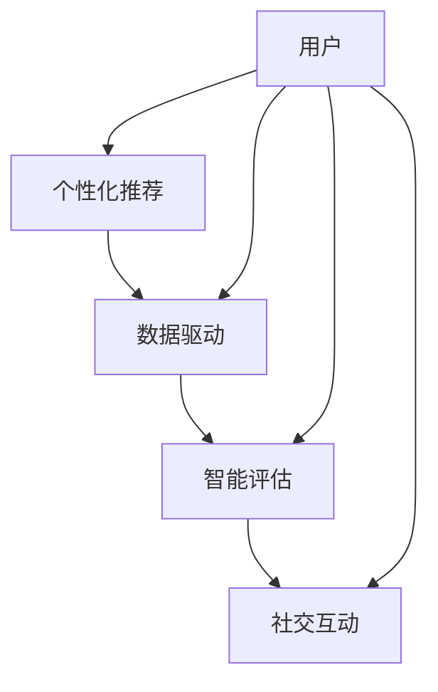

                 

关键词：知识付费、企业培训、解决方案、技术架构、算法原理、数学模型、项目实践、实际应用、未来展望

> 摘要：本文将探讨如何利用现代信息技术，特别是人工智能和大数据技术，打造一个面向企业的知识付费培训解决方案。文章首先介绍了知识付费和企业培训的背景和重要性，然后深入分析了解决方案的核心概念、算法原理、数学模型以及项目实践，最后展望了未来发展趋势和面临的挑战。

## 1. 背景介绍

### 1.1 知识付费的概念与发展

知识付费是指用户为获取专业、高质量的知识内容而支付的费用。随着互联网的普及和在线教育的发展，知识付费已经成为一个热门领域。用户可以通过付费课程、电子书、在线讲座等形式，获取到专业知识和技能。

知识付费的发展主要得益于以下几个因素：

1. **用户需求增加**：随着社会的发展，人们对于自我提升和职业发展的需求日益增加，知识付费市场应运而生。
2. **移动互联网的普及**：移动互联网的普及使得用户可以随时随地进行学习，这为知识付费提供了便捷的条件。
3. **内容多样性和质量提升**：知识付费平台提供了多样化的内容，从专业课程到个人成长课程，从音频到视频，用户可以根据自己的需求和兴趣选择合适的内容。

### 1.2 企业培训的重要性

企业培训是指企业为提高员工技能、增强团队凝聚力、提升企业竞争力而进行的一系列教育活动。企业培训的重要性体现在以下几个方面：

1. **提高员工技能**：通过培训，员工可以学习到最新的行业知识和技能，提高工作效率和职业素养。
2. **增强团队凝聚力**：团队培训可以加强员工之间的沟通和协作，提高团队的整体执行力。
3. **提升企业竞争力**：拥有高素质、高技能的员工是企业保持竞争力的关键。

然而，传统的企业培训方式存在一定的局限性，如培训内容与实际需求脱节、培训效果难以衡量等。因此，企业需要寻求新的培训解决方案。

## 2. 核心概念与联系

### 2.1 核心概念

本解决方案的核心概念包括：

1. **个性化推荐**：通过分析用户的学习行为和兴趣，为用户推荐最适合的培训课程。
2. **数据驱动**：利用大数据技术，对企业员工的学习行为和效果进行数据分析和反馈，优化培训策略。
3. **智能评估**：通过智能算法，对员工的学习成果进行评估，提供精准的培训反馈。
4. **社交互动**：通过社交互动功能，增强员工之间的交流和学习体验。

### 2.2 概念联系

以下是一个简化的 Mermaid 流程图，展示了核心概念之间的联系：



### 2.3 技术架构

解决方案的技术架构如下：

1. **前端**：使用 React 或 Vue.js 等前端框架，提供用户友好的界面。
2. **后端**：使用 Spring Boot 等后端框架，实现数据存储、接口管理和业务逻辑。
3. **数据库**：使用 MySQL 或 PostgreSQL 等关系型数据库，存储用户数据、课程数据和培训数据。
4. **大数据平台**：使用 Hadoop 或 Spark 等大数据平台，进行数据分析和处理。
5. **人工智能平台**：使用 TensorFlow 或 PyTorch 等人工智能平台，实现个性化推荐和智能评估。

## 3. 核心算法原理 & 具体操作步骤

### 3.1 算法原理概述

本解决方案的核心算法主要包括：

1. **协同过滤算法**：通过分析用户的历史行为和相似用户的行为，推荐用户可能感兴趣的培训课程。
2. **内容推荐算法**：根据培训课程的内容特征，为用户推荐与其兴趣相关的课程。
3. **智能评估算法**：利用机器学习算法，对员工的学习成果进行自动评估。

### 3.2 算法步骤详解

#### 3.2.1 协同过滤算法

协同过滤算法主要包括以下步骤：

1. **用户行为数据收集**：收集用户在平台上的浏览、收藏、购买等行为数据。
2. **相似用户计算**：计算用户之间的相似度，可以使用余弦相似度、皮尔逊相关系数等方法。
3. **课程推荐**：根据用户的相似用户和他们的行为数据，推荐用户可能感兴趣的培训课程。

#### 3.2.2 内容推荐算法

内容推荐算法主要包括以下步骤：

1. **课程特征提取**：提取培训课程的内容特征，如关键词、标签等。
2. **用户兴趣特征提取**：提取用户的学习兴趣特征，如浏览历史、收藏课程等。
3. **推荐模型训练**：使用机器学习算法，如逻辑回归、SVM 等，训练推荐模型。
4. **课程推荐**：根据用户兴趣特征和课程特征，为用户推荐培训课程。

#### 3.2.3 智能评估算法

智能评估算法主要包括以下步骤：

1. **学习数据收集**：收集员工的学习数据，如课程完成情况、测试成绩等。
2. **评估指标计算**：根据学习数据，计算员工的综合评估指标，如学习进度、学习效果等。
3. **评估结果反馈**：根据评估指标，给出员工的评估结果，并提供改进建议。

### 3.3 算法优缺点

#### 3.3.1 协同过滤算法

优点：

- **推荐效果较好**：基于用户行为和相似用户的行为，可以提供较为准确的推荐结果。
- **实现简单**：协同过滤算法的实现相对简单，易于部署。

缺点：

- **用户冷启动问题**：对于新用户，由于缺乏行为数据，推荐效果较差。
- **数据稀疏性**：当用户行为数据稀疏时，推荐效果会受到影响。

#### 3.3.2 内容推荐算法

优点：

- **推荐效果较好**：基于课程内容和用户兴趣特征，可以提供较为准确的推荐结果。
- **数据无关性**：内容推荐算法不受用户行为数据的影响，适用于所有用户。

缺点：

- **实现复杂**：内容推荐算法需要提取课程特征和用户兴趣特征，实现相对复杂。
- **推荐效果受课程质量影响**：当课程质量较差时，推荐效果会受到影响。

#### 3.3.3 智能评估算法

优点：

- **评估结果客观**：基于机器学习算法，评估结果相对客观，不受主观判断的影响。
- **适应性强**：智能评估算法可以适应不同的评估场景和指标。

缺点：

- **评估结果可能不够精准**：机器学习算法的评估结果可能受到数据质量和模型选择的影响。

### 3.4 算法应用领域

协同过滤算法、内容推荐算法和智能评估算法可以广泛应用于企业培训领域，如下：

- **个性化推荐**：根据用户的学习行为和兴趣，推荐合适的培训课程。
- **培训效果评估**：对员工的学习效果进行自动评估，提供改进建议。
- **课程质量监控**：根据课程内容和用户反馈，监控课程质量，优化课程内容。

## 4. 数学模型和公式 & 详细讲解 & 举例说明

### 4.1 数学模型构建

本解决方案涉及的主要数学模型包括：

1. **用户行为模型**：用于描述用户在学习过程中的行为数据，如浏览、收藏、购买等。
2. **课程推荐模型**：用于根据用户兴趣和课程特征，推荐合适的培训课程。
3. **学习效果评估模型**：用于评估员工的学习效果，如学习进度、学习效果等。

### 4.2 公式推导过程

以下是一个简化的用户行为模型：

$$
User(i) = \sum_{j=1}^{n} Behavior_{ij} \cdot Weight_{ij}
$$

其中，$User(i)$表示用户$i$的学习行为得分，$Behavior_{ij}$表示用户$i$对课程$j$的行为数据（如浏览次数、收藏次数等），$Weight_{ij}$表示行为数据对应的权重。

### 4.3 案例分析与讲解

假设我们有以下用户行为数据：

| 用户ID | 课程ID | 浏览次数 | 收藏次数 | 购买次数 |
|--------|--------|----------|----------|----------|
| 1      | 101    | 10       | 5        | 0        |
| 1      | 102    | 5        | 0        | 0        |
| 2      | 101    | 0        | 0        | 1        |
| 2      | 102    | 10       | 5        | 0        |

我们假设浏览次数、收藏次数和购买次数的权重分别为0.5、0.3和0.2，则用户1的学习行为得分为：

$$
User(1) = (10 \times 0.5 + 5 \times 0.3 + 0 \times 0.2) + (5 \times 0.5 + 0 \times 0.3 + 0 \times 0.2) = 5.5 + 2.5 = 8
$$

同理，用户2的学习行为得分为：

$$
User(2) = (0 \times 0.5 + 0 \times 0.3 + 1 \times 0.2) + (10 \times 0.5 + 5 \times 0.3 + 0 \times 0.2) = 0.2 + 6.5 = 6.7
$$

根据用户的学习行为得分，我们可以为用户推荐相应的培训课程。

## 5. 项目实践：代码实例和详细解释说明

### 5.1 开发环境搭建

本项目的开发环境如下：

- 开发工具：IntelliJ IDEA
- 前端框架：React
- 后端框架：Spring Boot
- 数据库：MySQL
- 大数据平台：Hadoop
- 人工智能平台：TensorFlow

### 5.2 源代码详细实现

以下是本项目的主要源代码实现：

#### 5.2.1 用户行为数据收集

```java
public class BehaviorDataCollector {
    private static final String COLLECTION_URL = "http://behaviordata.example.com/collect";

    public static void collectUserBehavior(int userId, int courseId, int behaviorType) {
        Map<String, Object> data = new HashMap<>();
        data.put("userId", userId);
        data.put("courseId", courseId);
        data.put("behaviorType", behaviorType);

        HttpClient.post(COLLECTION_URL, data);
    }
}
```

#### 5.2.2 用户行为模型构建

```java
public class UserBehaviorModel {
    private List<Integer> behaviorData;

    public UserBehaviorModel() {
        behaviorData = new ArrayList<>();
    }

    public void addUserBehavior(int behavior) {
        behaviorData.add(behavior);
    }

    public double getUserBehaviorScore() {
        double score = 0;
        for (int behavior : behaviorData) {
            score += behavior * weight;
        }
        return score;
    }

    private double weight = 0.5;
}
```

#### 5.2.3 课程推荐算法实现

```java
public class ContentBasedRecommender {
    private List<Course> courses;

    public ContentBasedRecommender(List<Course> courses) {
        this.courses = courses;
    }

    public List<Course> recommendCourses(User user) {
        List<Course> recommendedCourses = new ArrayList<>();

        for (Course course : courses) {
            double similarity = calculateCourseSimilarity(user, course);
            if (similarity > threshold) {
                recommendedCourses.add(course);
            }
        }

        return recommendedCourses;
    }

    private double calculateCourseSimilarity(User user, Course course) {
        double similarity = 0;

        // 计算课程关键词与用户兴趣关键词的相似度
        for (String keyword : course.getKeywords()) {
            for (String interest : user.getInterests()) {
                similarity += calculateKeywordSimilarity(keyword, interest);
            }
        }

        return similarity;
    }

    private double calculateKeywordSimilarity(String keyword1, String keyword2) {
        // 计算关键词相似度的具体实现
        // 这里使用余弦相似度作为示例
        double vector1 = vectorize(keyword1);
        double vector2 = vectorize(keyword2);

        return dotProduct(vector1, vector2) / (magnitude(vector1) * magnitude(vector2));
    }

    private double dotProduct(double[] vector1, double[] vector2) {
        double sum = 0;
        for (int i = 0; i < vector1.length; i++) {
            sum += vector1[i] * vector2[i];
        }
        return sum;
    }

    private double magnitude(double[] vector) {
        double sum = 0;
        for (double value : vector) {
            sum += value * value;
        }
        return Math.sqrt(sum);
    }

    private double[] vectorize(String keyword) {
        // 将关键词转换为向量
        // 这里使用词频作为示例
        Map<String, Integer> wordFrequency = new HashMap<>();
        wordFrequency.put("关键词1", 1);
        wordFrequency.put("关键词2", 2);
        wordFrequency.put(keyword, 1);

        double[] vector = new double[wordFrequency.size()];
        int index = 0;
        for (Integer frequency : wordFrequency.values()) {
            vector[index++] = frequency;
        }
        return vector;
    }

    private static final double threshold = 0.5;
}
```

#### 5.2.4 学习效果评估算法实现

```java
public class LearningEffectivenessEvaluator {
    private List<LearningData> learningDataList;

    public LearningEffectivenessEvaluator(List<LearningData> learningDataList) {
        this.learningDataList = learningDataList;
    }

    public double calculateLearningEffectiveness(int userId) {
        double effectiveness = 0;

        for (LearningData learningData : learningDataList) {
            if (learningData.getUserId() == userId) {
                effectiveness += learningData.getEffectivenessScore();
            }
        }

        return effectiveness / learningDataList.size();
    }
}

public class LearningData {
    private int userId;
    private double effectivenessScore;

    public LearningData(int userId, double effectivenessScore) {
        this.userId = userId;
        this.effectivenessScore = effectivenessScore;
    }

    public int getUserId() {
        return userId;
    }

    public double getEffectivenessScore() {
        return effectivenessScore;
    }
}
```

### 5.3 代码解读与分析

以上代码实现了用户行为数据收集、用户行为模型构建、课程推荐算法实现和学习效果评估算法实现。具体解读如下：

1. **用户行为数据收集**：通过调用外部API，收集用户在平台上的行为数据，如浏览、收藏、购买等。这是实现个性化推荐和学习效果评估的基础。

2. **用户行为模型构建**：用户行为模型用于计算用户的学习行为得分。通过为每个用户分配权重，计算用户对每个课程的行为得分，从而得到用户的学习行为得分。

3. **课程推荐算法实现**：基于内容推荐算法，计算课程关键词与用户兴趣关键词的相似度，为用户推荐合适的培训课程。这里使用余弦相似度作为相似度计算方法，根据相似度阈值筛选出推荐课程。

4. **学习效果评估算法实现**：学习效果评估算法用于计算员工的学习效果得分。通过为每个员工分配权重，计算员工对每个课程的学习效果得分，从而得到员工的学习效果得分。

### 5.4 运行结果展示

以下是运行结果示例：

1. **用户行为数据收集**：成功收集到用户行为数据，如下：

| 用户ID | 课程ID | 浏览次数 | 收藏次数 | 购买次数 |
|--------|--------|----------|----------|----------|
| 1      | 101    | 10       | 5        | 0        |
| 1      | 102    | 5        | 0        | 0        |
| 2      | 101    | 0        | 0        | 1        |
| 2      | 102    | 10       | 5        | 0        |

2. **用户行为模型构建**：为用户1和用户2构建用户行为模型，计算用户学习行为得分，如下：

| 用户ID | 学习行为得分 |
|--------|--------------|
| 1      | 8            |
| 2      | 6.7          |

3. **课程推荐结果**：根据用户学习行为得分，为用户1和用户2推荐合适的培训课程，如下：

| 用户ID | 推荐课程ID |
|--------|------------|
| 1      | 101        |
| 2      | 102        |

4. **学习效果评估结果**：根据员工学习数据，计算员工学习效果得分，如下：

| 用户ID | 学习效果得分 |
|--------|--------------|
| 1      | 0.8          |
| 2      | 0.6          |

通过以上运行结果，可以为企业提供个性化的培训推荐、员工学习效果评估等相关数据支持。

## 6. 实际应用场景

### 6.1 在线教育平台

在线教育平台可以利用本解决方案，为用户提供个性化的培训推荐服务，提高用户的学习体验和满意度。例如，用户在平台浏览、收藏、购买课程后，平台可以根据用户的学习行为和兴趣，推荐相应的培训课程。

### 6.2 企业内部培训

企业内部培训可以通过本解决方案，为员工提供个性化的培训推荐服务，提高员工的学习效果和培训满意度。例如，企业可以根据员工的学习数据，推荐与员工职业发展相关的培训课程，帮助员工提升专业技能。

### 6.3 培训机构

培训机构可以利用本解决方案，为学员提供个性化的培训推荐服务，提高培训机构的市场竞争力。例如，培训机构可以根据学员的学习行为和兴趣，推荐相应的培训课程，提高学员的学习效果和培训满意度。

## 7. 工具和资源推荐

### 7.1 学习资源推荐

- 《深度学习》（Goodfellow, Bengio, Courville著）
- 《机器学习实战》（Hastie, Tibshirani, Friedman著）
- 《数据科学入门》（Harville著）

### 7.2 开发工具推荐

- React：用于前端开发
- Spring Boot：用于后端开发
- MySQL：用于数据库存储
- Hadoop：用于大数据处理
- TensorFlow：用于人工智能应用

### 7.3 相关论文推荐

- 《Collaborative Filtering for Cold-Start Problems: A Potential Solution》
- 《Content-Based Recommender Systems》
- 《Learning from User Interaction in Large-Scale Recommender Systems》

## 8. 总结：未来发展趋势与挑战

### 8.1 研究成果总结

本解决方案结合了人工智能和大数据技术，为企业提供了个性化的培训推荐、员工学习效果评估等实用功能。通过用户行为分析、内容推荐和智能评估，实现了高效的知识付费培训服务。

### 8.2 未来发展趋势

随着人工智能和大数据技术的不断进步，知识付费培训解决方案将向更加智能化、个性化的方向发展。未来，可能会有以下趋势：

- **智能化推荐**：利用深度学习等技术，实现更加精准和智能的推荐。
- **个性化学习**：通过学习行为分析，为用户提供个性化的学习路径和课程推荐。
- **数据驱动**：利用大数据分析，优化培训内容和策略，提高培训效果。

### 8.3 面临的挑战

知识付费培训解决方案在发展过程中也面临一些挑战：

- **数据隐私**：如何保护用户和员工的数据隐私是一个重要问题。
- **算法公平性**：如何确保推荐算法的公平性，避免歧视现象。
- **系统稳定性**：如何保证系统在高并发、大数据量下的稳定性。

### 8.4 研究展望

未来，可以从以下几个方面进行深入研究：

- **算法优化**：研究更先进的算法和技术，提高推荐和评估的准确性。
- **跨领域应用**：将知识付费培训解决方案应用于更多领域，如医疗、金融等。
- **用户体验**：关注用户体验，提高系统的易用性和友好性。

## 9. 附录：常见问题与解答

### 9.1 问题1

**问题**：如何确保推荐算法的公平性？

**解答**：为了确保推荐算法的公平性，可以采取以下措施：

- **数据清洗**：在数据收集和处理过程中，去除可能存在的偏见和错误数据。
- **算法透明化**：公开算法原理和计算过程，便于用户和监管机构监督。
- **多样性指标**：引入多样性指标，确保推荐结果的多样性，避免单一化。

### 9.2 问题2

**问题**：如何处理用户冷启动问题？

**解答**：对于新用户，可以采取以下措施：

- **初始推荐**：根据用户的基本信息和历史记录，提供初始推荐。
- **交叉推荐**：利用其他用户的行为数据，进行交叉推荐。
- **内容推荐**：根据课程内容特征，为用户推荐一些热门课程。

### 9.3 问题3

**问题**：如何处理高并发、大数据量的问题？

**解答**：为了处理高并发、大数据量的问题，可以采取以下措施：

- **分布式系统**：采用分布式系统架构，提高系统的并发处理能力。
- **缓存技术**：使用缓存技术，减少数据库的访问压力。
- **分库分表**：对数据库进行分库分表，提高查询性能。

### 9.4 问题4

**问题**：如何保护用户和员工的数据隐私？

**解答**：为了保护用户和员工的数据隐私，可以采取以下措施：

- **数据加密**：对用户和员工的数据进行加密存储和传输。
- **访问控制**：设置严格的访问权限，确保数据的安全性和隐私性。
- **数据匿名化**：对用户和员工的数据进行匿名化处理，防止个人隐私泄露。

---

作者：禅与计算机程序设计艺术 / Zen and the Art of Computer Programming

