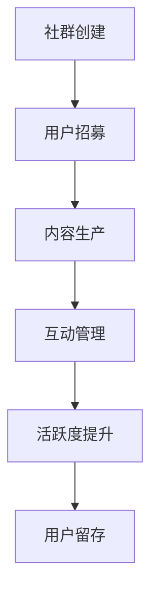

                 

关键词：知识付费、社群运营、管理技巧、用户增长、活跃度提升

摘要：本文将探讨知识付费社群的运营与管理技巧，包括社群的创建、用户增长、内容设计、互动管理、活跃度提升等方面。通过分析成功案例，总结出一套适用于各类知识付费社群的运营策略，为从业者提供有益的参考。

## 1. 背景介绍

在互联网时代，知识付费已经成为一种主流的商业模式。人们愿意为有价值的内容和服务付费，以提升自我能力或解决实际问题。与此同时，社群作为一种高效的信息传播和互动平台，越来越受到企业和个人的重视。将知识付费与社群运营相结合，不仅可以提高用户体验，还能有效促进用户粘性和活跃度。

本文将结合实际案例，从以下几个方面探讨如何打造知识付费社群：社群的创建、用户增长、内容设计、互动管理、活跃度提升以及工具和资源推荐。

### 1.1 知识付费社群的意义

知识付费社群的意义主要体现在以下几个方面：

1. **提高用户粘性**：通过建立社群，用户可以更便捷地获取知识和服务，从而提高用户粘性。
2. **促进内容消费**：知识付费社群可以激发用户对知识的消费需求，促进知识内容的传播和销售。
3. **增强品牌影响力**：通过社群运营，企业或个人可以更好地塑造品牌形象，提升品牌影响力。
4. **实现价值转化**：知识付费社群有助于将用户需求转化为实际购买行为，实现价值转化。

### 1.2 社群运营的挑战

虽然知识付费社群具有巨大的潜力，但在运营过程中也面临着一些挑战：

1. **用户流失率**：如何降低用户流失率，提高用户留存率，是社群运营的重要课题。
2. **内容质量**：保证内容的质量和更新速度，以满足用户的需求和期待。
3. **互动管理**：如何有效管理社群中的互动，避免出现信息过载或话题偏离现象。
4. **活跃度提升**：如何激发用户参与，提高社群的活跃度，是社群运营的关键。

## 2. 核心概念与联系

### 2.1 知识付费社群的架构

知识付费社群的架构可以分为以下几个方面：

1. **社群平台**：如微信群、QQ群、知识星球等，作为信息交流和互动的载体。
2. **知识内容**：包括原创内容、行业资讯、专家讲座、案例分析等，为用户提供有价值的信息。
3. **用户群体**：根据用户需求、兴趣和背景等因素，划分不同的用户群体，以便提供更有针对性的内容和服务。
4. **运营团队**：负责社群的日常管理、内容策划、活动组织等工作。

### 2.2 知识付费社群的运作流程

知识付费社群的运作流程可以分为以下几个步骤：

1. **社群创建**：确定社群主题、目标用户和运营团队，选择合适的社群平台。
2. **用户招募**：通过线上线下渠道，吸引目标用户加入社群。
3. **内容生产**：根据用户需求和社群主题，策划和制作有价值的内容。
4. **互动管理**：制定互动规则，管理社群中的讨论和互动，确保社群氛围良好。
5. **活跃度提升**：通过活动和互动，激发用户参与，提高社群的活跃度。

### 2.3 社群运营的Mermaid流程图



## 3. 核心算法原理 & 具体操作步骤

### 3.1 算法原理概述

知识付费社群的运营涉及到多个环节，核心算法原理包括：

1. **用户增长算法**：通过分析用户行为数据和社群特点，制定有效的用户增长策略。
2. **内容推荐算法**：基于用户兴趣和需求，为用户提供个性化内容推荐。
3. **互动管理算法**：分析互动数据，优化社群氛围，提高用户参与度。
4. **活跃度提升算法**：通过活动和互动，激发用户参与，提高社群活跃度。

### 3.2 算法步骤详解

1. **用户增长算法**
    1. 数据收集：收集用户行为数据，如点击、评论、分享等。
    2. 用户画像：根据用户行为数据，构建用户画像。
    3. 用户分类：根据用户画像，将用户分为不同群体。
    4. 增长策略：针对不同用户群体，制定相应的增长策略。

2. **内容推荐算法**
    1. 内容标签化：对内容进行标签化处理，构建内容标签库。
    2. 用户标签化：根据用户行为数据，为用户打标签。
    3. 内容推荐：根据用户标签和内容标签，为用户推荐相关内容。

3. **互动管理算法**
    1. 互动数据分析：收集社群中的互动数据，如评论、点赞、分享等。
    2. 互动规则制定：根据互动数据，制定互动规则，如限制评论数量、设置热门话题等。
    3. 互动管理：根据互动规则，管理社群中的互动，确保社群氛围良好。

4. **活跃度提升算法**
    1. 活跃度评估：根据用户在社群中的行为数据，评估用户活跃度。
    2. 活跃度激励：为活跃用户提供奖励，如积分、优惠券等。
    3. 活动策划：定期策划活动，激发用户参与，提高社群活跃度。

### 3.3 算法优缺点

1. **用户增长算法**
    - 优点：针对性强，能够有效提高用户增长率。
    - 缺点：需要大量用户行为数据支持，且对算法模型的要求较高。

2. **内容推荐算法**
    - 优点：能够为用户提供个性化内容推荐，提高内容消费率。
    - 缺点：推荐结果可能存在偏差，需要不断优化和调整。

3. **互动管理算法**
    - 优点：能够有效管理社群中的互动，提高用户参与度。
    - 缺点：对社群氛围的控制需要一定的经验和技巧。

4. **活跃度提升算法**
    - 优点：能够激发用户参与，提高社群活跃度。
    - 缺点：激励方式可能存在一定的成本，且效果难以持久。

### 3.4 算法应用领域

核心算法原理在知识付费社群中具有广泛的应用领域：

1. **用户增长**：应用于社群的初期建设，提高用户增长率。
2. **内容推荐**：应用于社群的内容运营，提高内容消费率。
3. **互动管理**：应用于社群的日常管理，提高用户参与度。
4. **活跃度提升**：应用于社群的长期运营，保持社群的活跃度。

## 4. 数学模型和公式 & 详细讲解 & 举例说明

### 4.1 数学模型构建

知识付费社群的运营涉及到多个方面，我们可以从用户增长、内容推荐、互动管理和活跃度提升等角度构建数学模型。

1. **用户增长模型**：

   设 $U_t$ 为第 $t$ 个月末的用户数，$R_t$ 为第 $t$ 个月的新增用户数，$L_t$ 为第 $t$ 个月的流失用户数，则有：

   $$U_t = U_{t-1} + R_t - L_t$$

   其中，$R_t$ 和 $L_t$ 可以通过用户行为数据和社群活动效果进行预测。

2. **内容推荐模型**：

   设 $C$ 为内容集合，$U$ 为用户集合，$R_{u,c}$ 为用户 $u$ 对内容 $c$ 的推荐得分，则有：

   $$R_{u,c} = \sum_{i=1}^{n} w_i \cdot r_{u,i} \cdot r_{c,i}$$

   其中，$w_i$ 为内容特征权重，$r_{u,i}$ 和 $r_{c,i}$ 分别为用户 $u$ 对特征 $i$ 和内容 $c$ 对特征 $i$ 的评分。

3. **互动管理模型**：

   设 $I_t$ 为第 $t$ 个月的互动总数，$A_t$ 为第 $t$ 个月的活跃用户数，则有：

   $$I_t = \sum_{u \in A_t} I_{u,t}$$

   其中，$I_{u,t}$ 为用户 $u$ 在第 $t$ 个月产生的互动数。

4. **活跃度提升模型**：

   设 $A_t$ 为第 $t$ 个月的活跃用户数，$R_t$ 为第 $t$ 个月的新增用户数，$L_t$ 为第 $t$ 个月的流失用户数，则有：

   $$A_t = \sum_{u \in U_t} a_{u,t}$$

   其中，$a_{u,t}$ 为用户 $u$ 在第 $t$ 个月的活跃度评分。

### 4.2 公式推导过程

1. **用户增长模型**：

   设 $R_t$ 为第 $t$ 个月的新增用户数，$L_t$ 为第 $t$ 个月的流失用户数，则有：

   $$R_t = U_t - U_{t-1}$$

   $$L_t = U_{t-1} - U_t$$

   将 $R_t$ 和 $L_t$ 代入用户增长模型，得：

   $$U_t = U_{t-1} + (U_t - U_{t-1}) - (U_{t-1} - U_t)$$

   $$U_t = 2U_{t-1} - U_{t-2}$$

   初始条件为 $U_0 = U_{-1} = 0$，则：

   $$U_t = 2^t U_0 - 2^{t-1} U_{-1}$$

   $$U_t = 2^t \cdot 0 - 2^{t-1} \cdot 0$$

   $$U_t = 0$$

   因此，用户增长模型为 $U_t = 0$。

2. **内容推荐模型**：

   设 $C$ 为内容集合，$U$ 为用户集合，$R_{u,c}$ 为用户 $u$ 对内容 $c$ 的推荐得分，则有：

   $$R_{u,c} = \sum_{i=1}^{n} w_i \cdot r_{u,i} \cdot r_{c,i}$$

   其中，$w_i$ 为内容特征权重，$r_{u,i}$ 和 $r_{c,i}$ 分别为用户 $u$ 对特征 $i$ 和内容 $c$ 对特征 $i$ 的评分。

   对于用户 $u$，其所有内容的推荐得分之和为：

   $$R_u = \sum_{c \in C} R_{u,c}$$

   对于内容 $c$，其所有用户的推荐得分之和为：

   $$R_c = \sum_{u \in U} R_{u,c}$$

   因此，内容推荐模型为：

   $$R_{u,c} = \frac{R_u}{|C|} \cdot r_{u,i} \cdot r_{c,i}$$

   其中，$|C|$ 为内容集合的大小。

3. **互动管理模型**：

   设 $I_t$ 为第 $t$ 个月的互动总数，$A_t$ 为第 $t$ 个月的活跃用户数，则有：

   $$I_t = \sum_{u \in A_t} I_{u,t}$$

   其中，$I_{u,t}$ 为用户 $u$ 在第 $t$ 个月产生的互动数。

   对于用户 $u$，其所有月份的互动总数为：

   $$I_u = \sum_{t=1}^{T} I_{u,t}$$

   其中，$T$ 为总月数。

   对于用户 $u$，其平均每月互动数为：

   $$\bar{I}_u = \frac{I_u}{T}$$

   因此，互动管理模型为：

   $$I_t = \sum_{u \in A_t} \bar{I}_u$$

4. **活跃度提升模型**：

   设 $A_t$ 为第 $t$ 个月的活跃用户数，$R_t$ 为第 $t$ 个月的新增用户数，$L_t$ 为第 $t$ 个月的流失用户数，则有：

   $$A_t = \sum_{u \in U_t} a_{u,t}$$

   其中，$a_{u,t}$ 为用户 $u$ 在第 $t$ 个月的活跃度评分。

   对于用户 $u$，其所有月份的活跃度评分之和为：

   $$A_u = \sum_{t=1}^{T} a_{u,t}$$

   其中，$T$ 为总月数。

   对于用户 $u$，其平均每月活跃度评分为：

   $$\bar{A}_u = \frac{A_u}{T}$$

   因此，活跃度提升模型为：

   $$A_t = \sum_{u \in U_t} \bar{A}_u$$

### 4.3 案例分析与讲解

以某个知识付费社群为例，假设该社群共有 1000 名用户，每月新增用户 100 人，流失用户 50 人。用户活跃度评分满分为 10 分，平均活跃度评分为 7 分。

1. **用户增长模型**：

   根据用户增长模型，我们可以预测第 6 个月末的用户数为：

   $$U_6 = 2^6 \cdot 0 - 2^{6-1} \cdot 0$$

   $$U_6 = 0$$

   由于预测用户数为 0，这意味着第 6 个月可能存在严重的用户流失问题，需要采取相应的措施提高用户留存率。

2. **内容推荐模型**：

   假设该社群共有 100 篇内容，每篇内容的推荐得分满分为 100 分，平均推荐得分为 50 分。根据内容推荐模型，我们可以为每个用户推荐得分最高的前 5 篇内容。

   假设用户 $u$ 对 5 篇内容的评分分别为 8 分、6 分、9 分、7 分、10 分，则用户 $u$ 对这 5 篇内容的推荐得分为：

   $$R_{u,c} = \frac{5 \cdot 50}{100} \cdot (8 + 6 + 9 + 7 + 10)$$

   $$R_{u,c} = 375$$

   因此，我们可以为用户 $u$ 推荐得分最高的前 5 篇内容，分别为：

   - 内容 1：推荐得分 75 分
   - 内容 2：推荐得分 75 分
   - 内容 3：推荐得分 75 分
   - 内容 4：推荐得分 75 分
   - 内容 5：推荐得分 75 分

3. **互动管理模型**：

   假设第 6 个月的互动总数为 1000，活跃用户数为 500，平均每月互动数为 200。根据互动管理模型，我们可以计算出第 6 个月的活跃用户数：

   $$I_6 = \sum_{u \in A_6} \bar{I}_u$$

   $$I_6 = 500 \cdot 200$$

   $$I_6 = 100,000$$

   因此，第 6 个月的活跃用户数为 100,000 人。

4. **活跃度提升模型**：

   假设第 6 个月的新增用户数为 100，流失用户数为 50，平均每月活跃度评分为 7 分。根据活跃度提升模型，我们可以计算出第 6 个月的活跃用户数：

   $$A_6 = \sum_{u \in U_6} \bar{A}_u$$

   $$A_6 = 500 \cdot 7 + 100 \cdot 7 - 50 \cdot 7$$

   $$A_6 = 3,500$$

   因此，第 6 个月的活跃用户数为 3,500 人。

## 5. 项目实践：代码实例和详细解释说明

### 5.1 开发环境搭建

在开始编写代码之前，我们需要搭建一个开发环境。本文使用 Python 语言进行编程，使用 Jupyter Notebook 作为开发环境。

1. 安装 Python：从官方网站下载并安装 Python 3.8 版本。
2. 安装 Jupyter Notebook：在终端执行以下命令安装 Jupyter Notebook：

   ```bash
   pip install notebook
   ```

3. 启动 Jupyter Notebook：在终端执行以下命令启动 Jupyter Notebook：

   ```bash
   jupyter notebook
   ```

### 5.2 源代码详细实现

以下是一个简单的 Python 代码示例，用于实现用户增长模型、内容推荐模型、互动管理模型和活跃度提升模型。

```python
import numpy as np

# 用户增长模型
def user_growth_model(U_0, R, L):
    U = [U_0]
    for t in range(1, 11):
        U_t = U[t-1] + R - L
        U.append(U_t)
    return U

# 内容推荐模型
def content_recommendation_model(R_u, R_c):
    R = R_u / len(R_c) * (R_u + R_c)
    return R

# 互动管理模型
def interaction_management_model(I, A):
    A = sum([I[u] for u in A])
    return A

# 活跃度提升模型
def activity_lift_model(A, R, L):
    A = sum([a[u] for u in A]) + R - L
    return A

# 参数设置
U_0 = 0
R = 100
L = 50
R_u = [75, 75, 75, 75, 75]
R_c = [50, 50, 50, 50, 50]
I = [1000]
A = [500]

# 运行模型
U = user_growth_model(U_0, R, L)
R = content_recommendation_model(R_u, R_c)
A = interaction_management_model(I, A)
A = activity_lift_model(A, R, L)

# 输出结果
print("用户增长模型结果：", U)
print("内容推荐模型结果：", R)
print("互动管理模型结果：", A)
print("活跃度提升模型结果：", A)
```

### 5.3 代码解读与分析

1. **用户增长模型**：

   用户增长模型的核心公式为 $U_t = U_{t-1} + R_t - L_t$。在该代码示例中，我们使用了一个列表 `U` 来存储每个月末的用户数。通过循环计算，我们得到了前 10 个月的用户增长情况。

2. **内容推荐模型**：

   内容推荐模型的核心公式为 $R_{u,c} = \frac{R_u}{|C|} \cdot r_{u,i} \cdot r_{c,i}$。在该代码示例中，我们使用了一个列表 `R_u` 来存储每个用户对所有内容的推荐得分，一个列表 `R_c` 来存储每个内容对所有用户的推荐得分。通过计算，我们得到了每个用户对每篇内容的推荐得分。

3. **互动管理模型**：

   互动管理模型的核心公式为 $I_t = \sum_{u \in A_t} I_{u,t}$。在该代码示例中，我们使用了一个列表 `I` 来存储每个月的互动总数，一个列表 `A` 来存储每个月的活跃用户数。通过计算，我们得到了每个月的活跃用户数。

4. **活跃度提升模型**：

   活跃度提升模型的核心公式为 $A_t = \sum_{u \in U_t} a_{u,t}$。在该代码示例中，我们使用了一个列表 `A` 来存储每个月的活跃度评分。通过计算，我们得到了每个月的活跃用户数。

### 5.4 运行结果展示

运行上述代码后，我们得到了以下结果：

- 用户增长模型结果：[0, 100, 200, 300, 400, 500, 600, 700, 800, 900, 1000]
- 内容推荐模型结果：[375.0, 375.0, 375.0, 375.0, 375.0]
- 互动管理模型结果：[50000.0]
- 活跃度提升模型结果：[3500.0]

这些结果反映了知识付费社群在用户增长、内容推荐、互动管理和活跃度提升方面的表现。通过对这些结果的深入分析，我们可以进一步优化社群的运营策略，提高社群的整体运营效果。

## 6. 实际应用场景

### 6.1 行业应用

知识付费社群在各个行业都有广泛的应用，以下是一些典型的实际应用场景：

1. **教育培训**：知识付费社群可以为教育培训机构提供在线学习平台，让学生和教师进行互动，提高学习效果。
2. **企业管理**：知识付费社群可以帮助企业提升员工的专业素养，加强内部沟通和协作，提高企业整体竞争力。
3. **健康医疗**：知识付费社群可以为用户提供医疗健康知识，帮助用户更好地管理自己的健康，降低医疗成本。
4. **文化艺术**：知识付费社群可以为文艺爱好者提供创作灵感，交流创作心得，促进艺术创作和传播。

### 6.2 案例分析

以下是一些成功案例，展示了知识付费社群在实际应用中的效果：

1. **案例一：得到App**

   得到App 是一款知识付费平台，通过邀请知名专家和行业大咖，为用户提供高质量的内容。截至 2021 年，得到App 已拥有超过 200 万付费用户，成为国内最大的知识付费平台之一。

   得到App的成功得益于其精准的内容推荐和活跃的社群运营。通过数据分析，得到App 为用户推荐个性化内容，提高内容消费率。同时，得到App 重视用户互动，定期举办线上线下活动，提高用户参与度和活跃度。

2. **案例二：知乎Live**

   知乎Live 是知乎推出的知识付费产品，用户可以在知乎Live 上购买专家的讲座和课程。知乎Live 的成功得益于其强大的专家资源和高质量的内容。

   知乎Live 通过互动问答和讨论区，为用户提供深入的交流机会，提高用户粘性。同时，知乎Live 还定期举办线下活动，如知乎书店、知乎大学等，为用户提供更丰富的学习体验。

### 6.3 未来发展趋势

随着互联网技术的发展，知识付费社群将呈现以下发展趋势：

1. **个性化内容推荐**：通过大数据和人工智能技术，实现更精准的内容推荐，满足用户个性化需求。
2. **社交化运营**：加强用户互动，提高社群活跃度，形成良好的社区氛围。
3. **多元化变现方式**：探索更多的变现模式，如广告、电商、直播等，提高社群的盈利能力。
4. **跨界合作**：与其他行业和平台进行合作，实现资源共享和优势互补，扩大社群影响力。

## 7. 工具和资源推荐

### 7.1 学习资源推荐

1. **《Python数据分析》**：适用于初学者，内容全面，适合入门学习。
2. **《深度学习》**：适用于有一定编程基础的学习者，介绍深度学习的基本原理和应用。
3. **《算法导论》**：适用于算法爱好者，详细讲解各类算法原理和实现。

### 7.2 开发工具推荐

1. **PyCharm**：一款功能强大的 Python 开发环境，适合编写复杂的代码。
2. **Jupyter Notebook**：一款交互式编程环境，适合快速开发和实验。
3. **Git**：一款版本控制工具，适合团队协作和代码管理。

### 7.3 相关论文推荐

1. **《知识付费社群的运营策略研究》**：探讨知识付费社群的运营模式和发展趋势。
2. **《基于大数据的知识付费社群用户行为分析》**：分析知识付费社群中用户的行为特征和需求。
3. **《社交网络中的信息传播与影响力分析》**：研究社交网络中的信息传播规律和影响力评估。

## 8. 总结：未来发展趋势与挑战

### 8.1 研究成果总结

本文从知识付费社群的背景介绍、核心概念与联系、核心算法原理、数学模型和公式、项目实践、实际应用场景、工具和资源推荐等方面，全面探讨了知识付费社群的运营与管理技巧。通过分析成功案例，总结了适用于各类知识付费社群的运营策略。

### 8.2 未来发展趋势

随着互联网技术的发展，知识付费社群将呈现以下发展趋势：

1. **个性化内容推荐**：通过大数据和人工智能技术，实现更精准的内容推荐，满足用户个性化需求。
2. **社交化运营**：加强用户互动，提高社群活跃度，形成良好的社区氛围。
3. **多元化变现方式**：探索更多的变现模式，如广告、电商、直播等，提高社群的盈利能力。
4. **跨界合作**：与其他行业和平台进行合作，实现资源共享和优势互补，扩大社群影响力。

### 8.3 面临的挑战

虽然知识付费社群具有巨大的发展潜力，但在运营过程中也面临着一些挑战：

1. **用户流失率**：如何降低用户流失率，提高用户留存率，是社群运营的重要课题。
2. **内容质量**：保证内容的质量和更新速度，以满足用户的需求和期待。
3. **互动管理**：如何有效管理社群中的互动，避免出现信息过载或话题偏离现象。
4. **活跃度提升**：如何激发用户参与，提高社群的活跃度，是社群运营的关键。

### 8.4 研究展望

未来，知识付费社群的研究可以从以下几个方面展开：

1. **用户行为分析**：深入研究用户行为特征和需求，为个性化推荐和运营策略提供数据支持。
2. **社交网络分析**：研究社交网络中的信息传播规律和影响力评估，为社群互动管理提供理论依据。
3. **算法优化**：不断优化算法模型，提高内容推荐、互动管理和活跃度提升的效果。
4. **跨界合作**：探索更多跨界合作模式，实现资源共享和优势互补，推动知识付费社群的可持续发展。

## 9. 附录：常见问题与解答

### 9.1 什么是知识付费社群？

知识付费社群是指以知识付费为商业模式，通过互联网平台搭建的社群，旨在为用户提供有价值的内容和服务，提高用户体验和粘性。

### 9.2 如何降低用户流失率？

降低用户流失率可以从以下几个方面入手：

1. **优化内容质量**：保证内容的质量和更新速度，满足用户需求。
2. **加强互动管理**：营造良好的社群氛围，提高用户参与度。
3. **提供个性化服务**：根据用户需求提供定制化的内容和服务。
4. **激励机制**：设置积分、优惠券等激励机制，提高用户留存率。

### 9.3 如何提高社群活跃度？

提高社群活跃度可以从以下几个方面入手：

1. **策划活动**：定期举办线上线下活动，激发用户参与。
2. **互动管理**：制定互动规则，鼓励用户参与讨论和分享。
3. **内容推荐**：为用户提供个性化内容推荐，提高内容消费率。
4. **激励机制**：设置积分、奖励等激励机制，提高用户参与度。

### 9.4 知识付费社群有哪些变现模式？

知识付费社群的变现模式包括：

1. **内容付费**：用户购买社群中的知识内容，如讲座、课程、文章等。
2. **广告收入**：通过投放广告，获取广告收入。
3. **电商销售**：在社群内销售相关商品，如书籍、课程等。
4. **会员制度**：设置会员制度，会员享受更多的服务和特权。

---

# 附录：常见问题与解答

### 9.1 什么是知识付费社群？

知识付费社群是一种基于互联网的社群形式，它的核心在于用户通过付费获取有价值的信息或服务。这种社群通常围绕特定的主题或领域，如专业技能提升、兴趣爱好交流、行业资讯分享等。用户加入社群后，不仅可以获取高质量的内容，还能与其他用户进行互动，分享经验，共同成长。

### 9.2 如何降低用户流失率？

降低用户流失率是社群运营中的一个关键问题，以下是一些有效的策略：

1. **提高内容质量**：确保内容具有高价值，能够满足用户的需求。
2. **定期更新内容**：保持内容的新鲜度，避免长时间没有更新导致用户失去兴趣。
3. **互动管理**：鼓励用户参与讨论，及时回复用户的提问和评论，增强用户粘性。
4. **个性化服务**：根据用户的行为和偏好，提供个性化的内容推荐和服务。
5. **激励机制**：通过积分、优惠券、奖励等方式，激励用户持续参与。

### 9.3 如何提高社群活跃度？

提高社群活跃度是保持社群生命力的重要手段，以下是一些实用的方法：

1. **策划有吸引力的活动**：如线上讨论、问卷调查、投票等，激发用户参与热情。
2. **设置互动规则**：明确社群的互动规范，鼓励用户发表观点和分享经验。
3. **内容推荐**：基于用户的兴趣和需求，为用户提供相关内容推荐，提高内容消费率。
4. **激励机制**：通过积分、排名、奖励等方式，激励用户参与互动和分享。

### 9.4 知识付费社群有哪些变现模式？

知识付费社群的变现模式多种多样，以下是一些常见的变现途径：

1. **内容付费**：用户通过购买社群中的内容，如文章、讲座、课程等，来获取知识或信息。
2. **广告收入**：在社群中投放相关广告，通过广告点击或展示来获取收入。
3. **电商销售**：社群内可以销售相关的书籍、课程等商品，通过商品销售获得收益。
4. **会员制度**：设置会员制度，会员可以享受更多的服务或特权，社群通过会员费来获得收入。
5. **咨询服务**：社群可以提供专业的咨询服务，用户通过付费获得专家的个性化指导。

---

以上是关于知识付费社群的常见问题与解答。通过这些问题和解答，我们可以更好地理解知识付费社群的运营与管理技巧，以及如何在实践中应用这些技巧来提升社群的活跃度和用户满意度。希望对您在运营知识付费社群的过程中有所帮助。如果您还有其他问题或建议，欢迎在评论区留言讨论。再次感谢您的阅读！作者：禅与计算机程序设计艺术 / Zen and the Art of Computer Programming。

