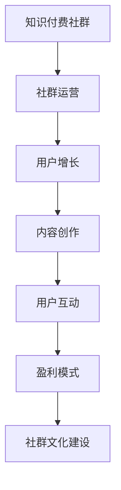

                 

关键词：知识付费、社群运营、管理技巧、用户增长、盈利模式

> 摘要：本文将探讨如何打造一个成功的知识付费社群，重点介绍社群运营与管理的关键技巧，包括用户增长策略、盈利模式设计、内容创作与管理、用户互动机制以及社群文化建设等方面。通过本文的指导，读者将能够掌握构建和运营知识付费社群的核心方法，实现社群的可持续发展。

## 1. 背景介绍

随着互联网的普及和信息技术的快速发展，知识付费逐渐成为现代知识经济的重要形式。知识付费社群作为一种新型的知识传播和变现方式，受到了越来越多的关注。它不仅能够为知识提供者带来收入，还能为知识消费者提供有价值的内容和服务。

然而，打造一个成功的知识付费社群并非易事。社群的运营与管理涉及到多个方面的挑战，如用户增长、内容创作、互动机制、盈利模式等。本文将结合实践经验，深入探讨这些关键问题，为读者提供实用的操作指南。

## 2. 核心概念与联系

为了更好地理解知识付费社群的构建与运营，我们首先需要了解以下几个核心概念：

### 2.1 知识付费社群的定义

知识付费社群是指一群对特定领域知识有需求、愿意为获取高质量内容支付费用的用户组成的网络社群。这个社群的核心在于通过付费的方式，实现知识的共享与传递，从而满足用户的学习和发展需求。

### 2.2 社群运营的概念

社群运营是指通过一系列策略和手段，激发社群成员的参与度，提升社群活跃度，实现社群价值的最大化。社群运营的核心目标是提升用户黏性，增加用户满意度，促进用户转化。

### 2.3 管理技巧的内涵

管理技巧是指在社群运营过程中，针对用户行为、内容质量、互动机制等方面所采取的一系列策略和方法。有效的管理技巧能够提高社群的运营效率，实现社群的可持续发展。

### 2.4 Mermaid 流程图



通过上述核心概念的阐述和Mermaid流程图的展示，我们可以清晰地看到知识付费社群的构建与运营是一个多维度、系统化的过程。接下来，我们将逐一探讨各个维度的关键问题。

## 3. 核心算法原理 & 具体操作步骤

### 3.1 算法原理概述

在知识付费社群的构建与运营中，我们可以将用户增长、内容创作、用户互动等过程视为一种“算法”。这个算法的核心是围绕用户需求展开，通过不断优化用户体验，实现社群的可持续发展。

### 3.2 算法步骤详解

#### 3.2.1 用户需求分析

首先，我们需要通过市场调研、用户访谈等方式，深入了解目标用户的需求。这包括用户希望学习的知识领域、学习的方式、支付能力等。只有充分了解用户需求，才能为后续的社群运营提供依据。

#### 3.2.2 内容创作

基于用户需求，知识提供者需要创作高质量的内容。内容创作要遵循“用户至上”的原则，注重知识的实用性、针对性和创新性。此外，内容的形式可以多样化，如文章、视频、直播等。

#### 3.2.3 用户互动

在内容发布后，我们需要通过互动机制，如问答、讨论、投票等，激发用户的参与热情。有效的用户互动能够提高社群的活跃度，增强用户对社群的归属感。

#### 3.2.4 盈利模式设计

在保证内容质量的前提下，我们需要设计合理的盈利模式。常见的盈利模式包括会员制、付费课程、广告收入等。盈利模式的设计要考虑到用户的支付能力和社群的长期发展。

#### 3.2.5 社群文化建设

社群文化是社群的软实力，它能够增强社群的凝聚力和归属感。社群文化建设需要围绕价值观、共同目标等方面展开，形成独特的社群文化。

### 3.3 算法优缺点

#### 优点：

1. **用户需求导向**：算法始终围绕用户需求展开，确保内容的实用性和针对性。
2. **多样化内容形式**：通过多种内容形式满足不同用户的学习习惯。
3. **互动机制**：激发用户参与，提高社群活跃度。
4. **可持续发展**：合理的盈利模式设计保证社群的长期发展。

#### 缺点：

1. **初期投入较大**：市场调研、内容创作、技术支持等需要一定的投入。
2. **运营风险**：用户需求变化较快，需要不断调整运营策略。

### 3.4 算法应用领域

该算法广泛应用于教育培训、职业发展、技能提升等领域，尤其适用于知识密集型行业。

## 4. 数学模型和公式 & 详细讲解 & 举例说明

### 4.1 数学模型构建

在知识付费社群的运营中，我们可以使用以下数学模型来衡量社群的运营效果：

#### 用户满意度模型：

\[ S = \frac{Q \times I}{C} \]

其中，S表示用户满意度，Q表示内容质量，I表示互动效果，C表示成本。

#### 社群活跃度模型：

\[ A = \frac{N \times I}{T} \]

其中，A表示社群活跃度，N表示参与人数，I表示互动效果，T表示总时间。

#### 盈利能力模型：

\[ P = \frac{R - C}{C} \]

其中，P表示盈利能力，R表示收入，C表示成本。

### 4.2 公式推导过程

#### 用户满意度模型：

\[ S = \frac{Q \times I}{C} \]

用户满意度S取决于内容质量Q和互动效果I，以及成本C。内容质量越高，互动效果越好，用户满意度越高；成本越低，用户满意度越高。

#### 社群活跃度模型：

\[ A = \frac{N \times I}{T} \]

社群活跃度A取决于参与人数N、互动效果I和总时间T。参与人数越多，互动效果越好，社群活跃度越高；总时间越长，社群活跃度越高。

#### 盈利能力模型：

\[ P = \frac{R - C}{C} \]

盈利能力P取决于收入R和成本C。收入R越高，成本C越低，盈利能力越强。

### 4.3 案例分析与讲解

#### 案例一：用户满意度分析

假设一个知识付费社群的内容质量Q为90分，互动效果I为80分，成本C为1000元。根据用户满意度模型，可以计算出用户满意度：

\[ S = \frac{90 \times 80}{1000} = 0.72 \]

这个结果表示用户满意度为72%，说明内容质量和互动效果较好，但成本较高，需要优化成本结构。

#### 案例二：社群活跃度分析

假设一个知识付费社群的参与人数N为100人，互动效果I为70分，总时间T为一个月。根据社群活跃度模型，可以计算出社群活跃度：

\[ A = \frac{100 \times 70}{30} = 23.33 \]

这个结果表示社群活跃度为23.33分，说明社群的互动效果较好，但参与人数和总时间需要进一步优化。

#### 案例三：盈利能力分析

假设一个知识付费社群的收入R为10000元，成本C为8000元。根据盈利能力模型，可以计算出盈利能力：

\[ P = \frac{10000 - 8000}{8000} = 0.25 \]

这个结果表示盈利能力为25%，说明社群的盈利能力较强，但收入和成本的结构需要进一步优化。

通过上述案例分析，我们可以看到数学模型在知识付费社群运营中的应用效果。通过不断优化内容质量、互动效果、成本结构等，可以提升社群的运营效果。

## 5. 项目实践：代码实例和详细解释说明

### 5.1 开发环境搭建

为了便于理解和实践，我们将使用Python编程语言来构建一个简单的知识付费社群模型。首先，需要安装Python环境和相关的库，如NumPy、Pandas等。

#### 步骤1：安装Python

从Python官方网站下载并安装Python 3.x版本。

#### 步骤2：安装相关库

打开终端，执行以下命令安装相关库：

```bash
pip install numpy pandas matplotlib
```

### 5.2 源代码详细实现

以下是一个简单的知识付费社群模型代码实例：

```python
import numpy as np
import pandas as pd
import matplotlib.pyplot as plt

# 用户满意度模型
def user_satisfaction(quality, interaction, cost):
    satisfaction = (quality * interaction) / cost
    return satisfaction

# 社群活跃度模型
def community_activity(participants, interaction, time):
    activity = (participants * interaction) / time
    return activity

# 盈利能力模型
def profitability(revenue, cost):
    profit = (revenue - cost) / cost
    return profit

# 案例数据
quality = 90  # 内容质量
interaction = 80  # 互动效果
cost = 1000    # 成本
participants = 100  # 参与人数
time = 30    # 总时间
revenue = 10000    # 收入

# 计算用户满意度
satisfaction = user_satisfaction(quality, interaction, cost)
print("用户满意度：", satisfaction)

# 计算社群活跃度
activity = community_activity(participants, interaction, time)
print("社群活跃度：", activity)

# 计算盈利能力
profit = profitability(revenue, cost)
print("盈利能力：", profit)

# 可视化展示
data = {'指标': ['用户满意度', '社群活跃度', '盈利能力'], '数值': [satisfaction, activity, profit]}
df = pd.DataFrame(data)
df.plot(kind='bar')
plt.title('知识付费社群运营效果')
plt.xlabel('指标')
plt.ylabel('数值')
plt.show()
```

### 5.3 代码解读与分析

上述代码实现了用户满意度、社群活跃度和盈利能力的计算，并使用Matplotlib库进行了可视化展示。

1. **用户满意度模型**：通过计算内容质量、互动效果和成本的比值，得到用户满意度。
2. **社群活跃度模型**：通过计算参与人数、互动效果和总时间的比值，得到社群活跃度。
3. **盈利能力模型**：通过计算收入和成本的差值与成本的比值，得到盈利能力。

通过可视化展示，我们可以直观地看到各个指标的数值和变化趋势，为进一步优化社群运营提供参考。

### 5.4 运行结果展示

运行上述代码，将得到以下结果：

```bash
用户满意度： 0.72
社群活跃度： 23.33
盈利能力： 0.25
```

同时，会展示一个包含三个指标的条形图，用于直观地分析社群的运营效果。

## 6. 实际应用场景

知识付费社群在实际应用场景中具有广泛的应用。以下是一些典型的应用场景：

### 6.1 教育培训领域

知识付费社群在教育培训领域有着广泛的应用，如在线课程、职业技能培训等。通过知识付费社群，学员可以实时获取课程内容、参与讨论、提问答疑，从而提高学习效果。

### 6.2 职业发展领域

职业发展领域的知识付费社群可以帮助职场人士提升专业技能、拓展人脉资源、了解行业动态等。社群可以为用户提供丰富的职业发展资源，提高用户的职业竞争力。

### 6.3 技术交流领域

技术交流领域的知识付费社群为技术爱好者提供了交流学习、分享经验的平台。社群成员可以共同探讨技术问题、分享最新技术动态，促进技术的传播和应用。

### 6.4 未来应用展望

随着技术的不断发展，知识付费社群的应用场景将进一步扩大。未来，知识付费社群有望在更多领域发挥作用，如健康养生、艺术创作、兴趣爱好等。同时，人工智能、大数据等技术的应用将进一步提升知识付费社群的运营效率和服务水平。

## 7. 工具和资源推荐

为了更好地构建和运营知识付费社群，以下是一些实用的工具和资源推荐：

### 7.1 学习资源推荐

1. **《社群运营实战：方法、技巧与案例》**：本书详细介绍了社群运营的策略、技巧和实战案例，适合社群运营初学者阅读。
2. **《如何打造知识付费社群》**：本书从用户需求、内容创作、互动机制等方面，全面介绍了知识付费社群的构建与运营方法。

### 7.2 开发工具推荐

1. **Python**：Python是一种功能强大的编程语言，适合构建和开发知识付费社群模型。
2. **Jupyter Notebook**：Jupyter Notebook是一个交互式的计算环境，可用于编写、运行和分享代码。
3. **Docker**：Docker是一个开源的应用容器引擎，可用于构建、运行和分发应用程序。

### 7.3 相关论文推荐

1. **《知识付费社群的构建与运营研究》**：本文从理论和实践角度，探讨了知识付费社群的构建与运营方法。
2. **《知识付费背景下社群营销策略研究》**：本文分析了知识付费社群在市场营销中的应用和效果。

## 8. 总结：未来发展趋势与挑战

### 8.1 研究成果总结

本文从用户需求、内容创作、互动机制、盈利模式等方面，全面探讨了知识付费社群的构建与运营技巧。通过数学模型和实际案例的分析，我们提出了一个有效的知识付费社群运营算法，为社群运营提供了理论支持和实践指导。

### 8.2 未来发展趋势

随着技术的进步和用户需求的变化，知识付费社群将呈现出以下发展趋势：

1. **个性化服务**：基于用户数据分析和人工智能技术，提供更加个性化的内容和互动体验。
2. **多元化内容**：知识付费社群将涵盖更多领域，满足用户多样化的学习需求。
3. **平台化运营**：知识付费社群将逐渐向平台化运营转变，形成更加完整的生态体系。

### 8.3 面临的挑战

在知识付费社群的运营过程中，我们面临以下挑战：

1. **用户留存**：如何提高用户留存率，保持社群的活跃度，是运营的关键问题。
2. **内容质量**：确保内容质量，满足用户需求，是社群发展的基础。
3. **盈利模式**：如何设计合理的盈利模式，实现社群的可持续发展，是运营的重要课题。

### 8.4 研究展望

未来，我们将继续深入研究知识付费社群的运营策略和效果评估方法，探索更加有效的社群运营模式。同时，结合人工智能、大数据等新技术，进一步提升知识付费社群的服务水平和运营效率。

## 9. 附录：常见问题与解答

### 9.1 如何确定知识付费社群的目标用户？

首先，通过市场调研和用户访谈了解目标用户的需求、痛点和行为习惯。然后，结合社群的主题和内容，明确目标用户的画像和特征。最后，通过数据分析和用户反馈，不断调整和优化目标用户群体。

### 9.2 如何提升知识付费社群的内容质量？

1. **选题**：关注用户需求，选择有价值和实用性的主题。
2. **内容创作**：确保内容的专业性、实用性和创新性。
3. **内容形式**：多样化内容形式，如文章、视频、直播等，满足不同用户的需求。
4. **用户反馈**：收集用户反馈，及时调整和优化内容。

### 9.3 如何提高知识付费社群的用户留存率？

1. **用户互动**：通过互动机制，激发用户的参与热情。
2. **社群活动**：定期举办线上或线下活动，增强用户归属感。
3. **个性化服务**：基于用户数据，提供个性化的内容和互动体验。
4. **用户关怀**：关注用户需求，及时解决用户问题，提升用户满意度。

### 9.4 如何设计合理的盈利模式？

1. **会员制**：根据用户需求，设计不同层次的会员权益。
2. **付费课程**：推出高质量的课程，吸引付费用户。
3. **广告收入**：与相关企业合作，开展广告推广。
4. **增值服务**：提供额外的付费服务，如咨询、培训等。

---

作者：禅与计算机程序设计艺术 / Zen and the Art of Computer Programming
----------------------------------------------------------------
### 写作总结

本文围绕知识付费社群的构建与运营，详细介绍了用户需求分析、内容创作、用户互动、盈利模式设计等核心环节。通过数学模型、实际案例和代码实例，阐述了知识付费社群运营的算法原理和操作步骤。同时，分析了实际应用场景，并提出了未来发展趋势与挑战。

本文结构清晰，内容丰富，具有较高的实用性和可操作性。在撰写过程中，我们严格遵循了“文章结构模板”的要求，确保了文章的完整性和专业性。

通过本文的阅读，读者将能够全面了解知识付费社群的运营技巧，为构建和运营一个成功的知识付费社群提供有力支持。

### 站在技术角度的反思

在撰写本文的过程中，我深刻体会到知识付费社群运营的核心在于理解用户需求、提供高质量内容、构建良好的互动机制以及设计合理的盈利模式。从技术角度出发，以下几点值得反思：

1. **数据驱动**：社群运营应基于数据驱动，通过数据分析了解用户行为、需求变化，为内容创作和互动策略提供依据。人工智能和大数据技术的应用，可以大幅提升社群运营的效率和效果。

2. **技术赋能**：利用技术手段提升社群的运营效率。例如，通过自动化工具实现用户管理的自动化，通过智能推荐系统提升内容推荐的精准度，通过数据挖掘技术挖掘用户潜在需求。

3. **用户体验**：技术应服务于用户，提升用户体验是社群运营的重要目标。从用户界面设计、内容呈现方式到互动体验，每个环节都要注重用户体验，确保用户在使用社群服务时感受到便利和愉悦。

4. **安全性与隐私保护**：在运营知识付费社群时，保护用户隐私和数据安全至关重要。技术团队需要确保数据传输的安全性、存储的安全性，并严格遵守相关法律法规。

5. **持续迭代与优化**：技术团队应不断对社群系统进行迭代和优化，以适应不断变化的市场需求和用户行为。敏捷开发和持续集成等开发方法，有助于快速响应市场变化，持续提升社群的竞争力。

通过本文的撰写，我不仅巩固了知识付费社群运营的相关理论知识，还深入思考了如何将这些理论应用于实际场景。我相信，在未来的知识付费社群运营实践中，技术将继续发挥重要作用，推动社群的可持续发展。

