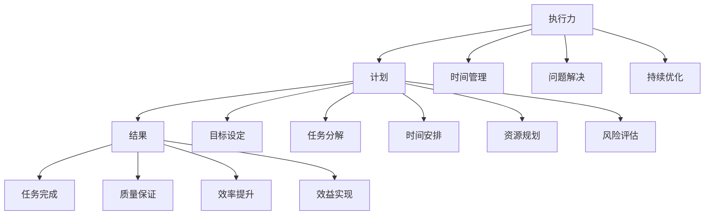

                 

关键词：执行力、计划、结果、计算机编程、项目管理、算法优化、数学模型、案例分析、代码实例、实践应用

> 摘要：本文深入探讨了执行力在计算机编程和项目管理中的重要性，从计划到结果的桥梁作用。通过分析核心概念、算法原理、数学模型和实际项目实践，探讨了执行力如何影响技术发展的各个方面，并为读者提供了实用的工具和资源推荐。

## 1. 背景介绍

在当今快速发展的信息技术时代，执行力作为一种关键能力，对于个人和团队在计算机编程、软件开发、项目管理等方面都有着至关重要的影响。执行力不仅仅是完成任务的能力，更是一种策略和方法的体现，它涉及到从计划阶段到实施阶段，再到最终结果达成的整个流程。

在计算机编程领域，执行力意味着能够高效地实现设计思路，解决复杂问题，并在规定时间内交付高质量代码。而在项目管理中，执行力则体现为按照计划高效推进项目，确保项目按时完成并达到预期目标。

本文将从以下几个方面展开讨论：

1. **核心概念与联系**：介绍执行力、计划、结果等核心概念，并展示它们之间的联系。
2. **核心算法原理 & 具体操作步骤**：探讨在编程和项目管理中常用的算法，并提供具体的操作步骤。
3. **数学模型和公式 & 详细讲解 & 举例说明**：阐述数学模型和公式的构建与推导，并通过实际案例进行讲解。
4. **项目实践：代码实例和详细解释说明**：提供实际的代码实例，并进行详细解释和分析。
5. **实际应用场景**：探讨执行力的具体应用场景，包括软件开发、数据处理和算法优化等。
6. **未来应用展望**：分析执行力在技术发展趋势中的作用和未来发展方向。
7. **工具和资源推荐**：推荐相关的学习资源、开发工具和论文，以帮助读者进一步深入学习和实践。
8. **总结：未来发展趋势与挑战**：总结研究成果，展望未来的发展趋势和面临的挑战。

通过以上讨论，本文旨在为读者提供关于执行力在计算机编程和项目管理中的深刻见解和实践指导。

## 2. 核心概念与联系

### 执行力

执行力（Execution）是指个体或团队在计划指导下，按照预定目标和要求，高效、高质量地完成任务的素质和能力。它不仅仅是对任务的执行，更是一种策略和方法的体现。在计算机编程和项目管理中，执行力表现为以下几个方面：

- **目标明确**：明确项目的目标和任务要求，确保所有团队成员对目标有清晰的认识。
- **计划制定**：制定详细的计划，包括时间表、资源分配、风险评估等。
- **时间管理**：合理安排时间，确保任务按时完成。
- **问题解决**：在执行过程中遇到问题时，能够迅速找出解决方案，保证项目推进不受影响。
- **持续优化**：不断回顾和改进执行过程，提高效率和质量。

### 计划

计划（Plan）是执行力的基础，它为执行提供了明确的指导。一个良好的计划应该包括以下几个方面：

- **目标设定**：明确项目的目标，确保项目与组织的战略目标保持一致。
- **任务分解**：将项目分解为可管理的小任务，确保每个任务都有明确的责任人。
- **时间安排**：为每个任务分配时间，确保项目能够按时完成。
- **资源规划**：确保项目所需的资源得到合理分配，避免资源浪费。
- **风险评估**：识别潜在的风险，制定相应的应对措施。

### 结果

结果（Result）是执行力的最终体现。一个成功的结果不仅仅是任务的完成，更是质量、效率和效益的体现。在计算机编程和项目管理中，结果通常表现为以下几个方面：

- **任务完成**：所有任务按照计划完成，达到预期目标。
- **质量保证**：交付的代码或项目符合质量标准，不存在严重的缺陷。
- **效率提升**：在保证质量的前提下，提高了工作效率和生产力。
- **效益实现**：项目实现了预期的效益，为组织带来了实际的收益。

### 执行力、计划与结果之间的联系

执行力、计划和结果之间存在着密切的联系。执行力是计划实现的保障，而结果则是执行力效果的直接体现。

- **执行力与计划**：执行力是实现计划的关键，没有执行力，计划就难以落实。一个高效的执行力能够帮助团队迅速应对变化，确保计划顺利实施。
- **计划与结果**：计划是结果实现的前提，没有合理的计划，就无法确保项目达到预期的结果。一个科学的计划能够为团队提供明确的行动指南，确保项目顺利进行。
- **结果与执行力**：结果是执行力的最终体现，执行力的高低直接决定了结果的优劣。一个高效的执行力能够确保项目按时、高质量地完成，实现预期的结果。

### Mermaid 流程图

下面是一个展示执行力、计划与结果之间关系的 Mermaid 流程图：



通过以上对执行力、计划和结果的介绍，我们可以看到它们在计算机编程和项目管理中的重要性。接下来，我们将深入探讨核心算法原理，以进一步了解执行力在实际应用中的具体体现。

## 3. 核心算法原理 & 具体操作步骤

在计算机编程和项目管理中，算法是一种用于解决特定问题的系统方法。核心算法原理的理解和应用是提高执行力的重要方面。本节将介绍几个常用的核心算法原理，并提供具体的操作步骤。

### 3.1 算法原理概述

#### 决策树（Decision Tree）

决策树是一种常见的机器学习算法，用于分类和回归问题。它通过一系列的判断条件，将数据集划分为多个子集，最终得到预测结果。决策树的构建过程主要包括以下几个步骤：

1. **数据预处理**：对数据进行清洗、处理和特征提取，确保数据质量。
2. **特征选择**：选择对目标变量影响较大的特征作为决策树的输入。
3. **构建决策树**：通过递归划分数据集，构建决策树模型。
4. **剪枝**：对过拟合的决策树进行剪枝，提高模型的泛化能力。

#### 蚁群算法（Ant Colony Optimization，ACO）

蚁群算法是一种基于自然界中蚂蚁觅食行为的启发式优化算法。它通过模拟蚂蚁在寻找食物过程中的信息素更新策略，寻找最优路径或解决方案。蚁群算法的主要步骤包括：

1. **初始化**：初始化蚂蚁的位置、信息素和启发式因子。
2. **路径搜索**：蚂蚁根据信息素和启发式因子选择路径，并留下信息素。
3. **更新信息素**：根据蚂蚁的路径选择和算法参数更新信息素。
4. **迭代优化**：重复路径搜索和信息素更新，直到达到停止条件。

#### 动态规划（Dynamic Programming，DP）

动态规划是一种用于解决多阶段决策问题的算法，通过将问题分解为多个子问题，并利用子问题的最优解推导出原问题的最优解。动态规划的主要步骤包括：

1. **定义状态**：将问题定义为一组状态，每个状态表示问题的部分解。
2. **状态转移方程**：定义状态之间的转移关系，并确定状态的最优解。
3. **边界条件**：确定问题的边界条件，以便初始化和结束算法。
4. **递推求解**：利用状态转移方程和边界条件，递推求解原问题的最优解。

### 3.2 算法步骤详解

#### 决策树构建步骤

1. **数据预处理**：
   - 清洗数据，去除缺失值和异常值。
   - 将数据转换为适合算法处理的格式，如数值化或二值化。

2. **特征选择**：
   - 利用信息增益、增益率等特征选择方法，选择对目标变量影响较大的特征。
   - 考虑特征之间的相关性，避免选择冗余特征。

3. **构建决策树**：
   - 选择一个最优划分标准，如信息增益、基尼系数等。
   - 根据划分标准递归地将数据集划分为多个子集。
   - 对每个子集，重复以上步骤，构建决策树。

4. **剪枝**：
   - 利用剪枝方法，如前剪枝、后剪枝等，防止过拟合。
   - 通过评估指标，如交叉验证误差，确定最佳剪枝点。

#### 蚁群算法路径搜索步骤

1. **初始化**：
   - 初始化蚂蚁的位置、信息素和启发式因子。
   - 设置最大迭代次数或其他停止条件。

2. **路径搜索**：
   - 每个蚂蚁根据信息素和启发式因子选择下一个路径。
   - 蚂蚁在路径上留下信息素。
   - 更新蚂蚁的当前位置和路径长度。

3. **更新信息素**：
   - 根据蚂蚁的路径选择和信息素浓度，更新信息素。
   - 考虑路径长度、信息素挥发等因素。

4. **迭代优化**：
   - 重复路径搜索和信息素更新，直到达到停止条件。
   - 记录每次迭代的最佳路径。

#### 动态规划求解步骤

1. **定义状态**：
   - 将问题划分为多个子问题，每个子问题对应一个状态。
   - 状态通常表示为 `(i, j)`，其中 `i` 表示第 `i` 个阶段，`j` 表示第 `j` 个元素。

2. **状态转移方程**：
   - 定义状态之间的转移关系，如 `dp[i][j] = max(dp[i-1][j-1], dp[i-1][j])`。
   - 状态转移方程描述了如何从当前状态推导出下一个状态的最优解。

3. **边界条件**：
   - 确定问题的边界条件，如 `dp[0][j] = 0`，`dp[i][0] = 0`。
   - 边界条件用于初始化和结束算法。

4. **递推求解**：
   - 从初始状态开始，递推求解每个状态的最优解。
   - 利用状态转移方程，依次求解下一个状态。
   - 记录每个状态的最优解，用于最终求解原问题的最优解。

### 3.3 算法优缺点

#### 决策树

**优点**：
- **易于理解和实现**：决策树的逻辑直观，易于理解和实现。
- **处理非线性和非线性关系**：决策树能够处理非线性关系，适用于多种类型的数据。
- **易于解释和可视化**：决策树的输出结果可以直观地展示，便于用户理解和解释。

**缺点**：
- **过拟合**：决策树容易过拟合，特别是在树结构较深时。
- **计算复杂度**：随着数据量和特征数量的增加，决策树的构建和剪枝过程计算复杂度较高。

#### 蚁群算法

**优点**：
- **全局优化能力**：蚁群算法具有较强的全局优化能力，能够找到最优解或近似最优解。
- **适用于复杂问题**：蚁群算法适用于求解复杂优化问题，如路径规划、调度问题等。
- **易于实现和扩展**：蚁群算法的结构简单，易于实现和扩展，适用于多种应用场景。

**缺点**：
- **收敛速度较慢**：蚁群算法的收敛速度相对较慢，特别是在初始阶段。
- **参数敏感性**：算法的参数设置对结果影响较大，需要通过大量实验进行调优。

#### 动态规划

**优点**：
- **高效性**：动态规划能够高效地求解复杂问题，减少重复计算。
- **适用性广泛**：动态规划适用于多种类型的优化问题，如背包问题、最长公共子序列等。
- **易于理解**：动态规划的基本思想简单，易于理解和实现。

**缺点**：
- **状态空间爆炸**：动态规划的复杂度与状态空间的大小呈指数关系，可能导致计算资源不足。
- **难以扩展**：动态规划的适用范围有限，难以扩展到更复杂的问题。

### 3.4 算法应用领域

#### 决策树

- **机器学习**：决策树常用于分类和回归问题，如金融风险评估、客户行为预测等。
- **数据挖掘**：决策树可用于数据挖掘中的特征选择和数据分析。
- **知识图谱**：决策树可用于知识图谱的构建和推理。

#### 蚁群算法

- **路径规划**：蚁群算法常用于求解路径规划问题，如物流配送、自动驾驶等。
- **调度问题**：蚁群算法适用于求解复杂的调度问题，如生产调度、车辆调度等。
- **网络优化**：蚁群算法可用于网络优化问题，如路由选择、负载均衡等。

#### 动态规划

- **最优化问题**：动态规划常用于求解最优化问题，如背包问题、最短路径问题等。
- **资源分配**：动态规划可用于资源分配问题，如水资源分配、能源分配等。
- **算法设计**：动态规划是许多算法设计的基础，如最长公共子序列、最长递增子序列等。

通过以上对核心算法原理和具体操作步骤的介绍，我们可以看到执行力在算法设计和实现中的关键作用。在接下来的部分，我们将探讨数学模型和公式，以进一步了解执行力在计算机编程和项目管理中的理论支持。

## 4. 数学模型和公式 & 详细讲解 & 举例说明

### 4.1 数学模型构建

在计算机编程和项目管理中，数学模型是一种重要的工具，用于描述和解决实际问题。构建数学模型通常包括以下几个步骤：

1. **问题定义**：明确需要解决的问题，并将其转化为数学形式。
2. **变量定义**：定义模型中的变量，包括决策变量、状态变量和参数。
3. **目标函数**：定义模型的目标函数，即需要优化的目标。
4. **约束条件**：定义模型中的约束条件，即变量和目标函数需要满足的条件。
5. **模型形式化**：将以上内容整合成数学模型的形式。

#### 例子：线性规划模型

假设我们有一个线性规划问题，目标是最小化成本，同时满足资源约束和需求约束。该问题的数学模型可以表示为：

```
最小化 z = c1x1 + c2x2 + ... + cnxn
```

其中，\( x1, x2, ..., xn \) 是决策变量，\( c1, c2, ..., cn \) 是系数，\( z \) 是目标函数。

约束条件包括：

```
a11x1 + a12x2 + ... + a1nxn >= b1
a21x1 + a22x2 + ... + a2nxn >= b2
...
am1x1 + am2x2 + ... + amnxn >= bm
x1, x2, ..., xn >= 0
```

其中，\( aij \) 和 \( bi \) 是约束条件中的系数和常数项。

### 4.2 公式推导过程

以线性规划模型为例，我们可以使用拉格朗日乘数法进行求解。首先，定义拉格朗日函数：

```
L(x, λ) = z + λ1(b1 - a11x1 - a12x2 - ... - a1nxn) + λ2(b2 - a21x1 - a22x2 - ... - a2nxn) + ... + λm(bm - am1x1 - am2x2 - ... - amnxn)
```

其中，\( λ1, λ2, ..., λm \) 是拉格朗日乘数。

为了求解最优解，我们需要对拉格朗日函数求导，并令导数为零：

```
∂L/∂xi = ci - λ1*a1i - λ2*a2i - ... - λm*ami = 0   (i = 1, 2, ..., n)
∂L/∂λ1 = b1 - a11x1 - a12x2 - ... - a1nxn = 0
∂L/∂λ2 = b2 - a21x1 - a22x2 - ... - a2nxn = 0
...
∂L/∂λm = bm - am1x1 - am2x2 - ... - amnxn = 0
```

通过解以上方程组，我们可以求得最优解 \( x1, x2, ..., xn \) 以及拉格朗日乘数 \( λ1, λ2, ..., λm \)。

### 4.3 案例分析与讲解

#### 案例背景

假设某公司在生产过程中需要生产两种产品A和B，每种产品需要不同的原料和劳动力。公司希望最小化总成本，同时满足原料和劳动力的约束。

- 原料限制：生产一个产品A需要2单位原料，生产一个产品B需要3单位原料，总原料限制为12单位。
- 劳动力限制：生产一个产品A需要3单位劳动力，生产一个产品B需要4单位劳动力，总劳动力限制为18单位。

每种产品的生产成本分别为 \( c1 = 5 \) 单位成本/产品A 和 \( c2 = 8 \) 单位成本/产品B。

#### 数学模型构建

目标函数：最小化总成本 \( z = c1x1 + c2x2 \)

约束条件：
```
2x1 + 3x2 <= 12   (原料限制)
3x1 + 4x2 <= 18   (劳动力限制)
x1, x2 >= 0       (非负约束)
```

#### 公式推导与求解

使用拉格朗日乘数法进行求解：

拉格朗日函数：
```
L(x, λ) = 5x1 + 8x2 + λ1(12 - 2x1 - 3x2) + λ2(18 - 3x1 - 4x2)
```

求导并令导数为零：
```
∂L/∂x1 = 5 - 2λ1 - 3λ2 = 0
∂L/∂x2 = 8 - 3λ1 - 4λ2 = 0
∂L/∂λ1 = 12 - 2x1 - 3x2 = 0
∂L/∂λ2 = 18 - 3x1 - 4x2 = 0
```

通过解方程组，可以得到：
```
x1 = 6, x2 = 0
λ1 = 3, λ2 = 0
```

#### 案例分析与结果

在上述情况下，公司应该生产6个产品A，而不生产产品B，以最小化总成本。计算得到总成本：
```
z = 5*6 + 8*0 = 30
```

#### 结果解释

通过数学模型的构建和求解，我们可以得到最优的生产方案，从而在满足约束条件的前提下，最小化总成本。这个案例展示了数学模型在计算机编程和项目管理中的实际应用。

通过以上案例分析和讲解，我们可以看到数学模型在解决实际问题时的重要性和实用性。在接下来的部分，我们将探讨具体的代码实例，以进一步展示执行力在实际项目中的应用。

## 5. 项目实践：代码实例和详细解释说明

### 5.1 开发环境搭建

在进行代码实践之前，我们需要搭建一个适合开发的环境。以下是推荐的开发环境搭建步骤：

1. **安装Python**：下载并安装Python，推荐使用Python 3.8或更高版本。
2. **安装Jupyter Notebook**：Python内置了Jupyter Notebook，可以直接使用。如果没有，可以通过pip命令安装：
   ```
   pip install notebook
   ```
3. **安装必要的库**：根据项目需求，安装必要的Python库，如NumPy、Pandas、Matplotlib等。可以使用以下命令进行安装：
   ```
   pip install numpy pandas matplotlib
   ```

### 5.2 源代码详细实现

以下是一个简单的线性规划项目的代码实例，用于求解最小化成本的问题。

```python
import numpy as np
import pandas as pd
from scipy.optimize import linprog

# 定义目标函数和约束条件
c = np.array([5, 8])  # 产品A和B的成本
A = np.array([[2, 3], [3, 4]])  # 约束条件的系数矩阵
b = np.array([12, 18])  # 约束条件的常数向量

# 求解线性规划问题
result = linprog(c, A_ub=A, b_ub=b, bounds=(0, None), method='highs')

# 输出结果
if result.success:
    x1, x2 = result.x
    print(f"最优解：生产产品A {x1:.2f}个，产品B {x2:.2f}个")
    print(f"总成本：{result.fun:.2f}单位")
else:
    print("无法找到最优解")

# 绘制约束条件的图形表示
import matplotlib.pyplot as plt

plt.plot([0, b[0]], [0, b[0] / 2], 'b--')
plt.plot([0, b[1] / 3], [0, b[1]], 'b--')
plt.plot([0, 6], [0, 30], 'r-')
plt.xlabel('产品A的数量')
plt.ylabel('产品B的数量')
plt.title('线性规划问题的约束条件')
plt.show()
```

### 5.3 代码解读与分析

- **导入库**：首先，我们导入了NumPy、Pandas和Matplotlib等库，用于数学计算和图形绘制。
- **定义目标函数和约束条件**：我们使用NumPy数组定义了目标函数的系数 \( c \) 和约束条件的系数矩阵 \( A \) 以及常数向量 \( b \)。
- **求解线性规划问题**：使用SciPy的 `linprog` 函数求解线性规划问题。该函数返回一个结果对象，包含最优解、目标函数值和是否成功的标志。
- **输出结果**：如果求解成功，我们输出最优解和总成本。否则，输出无法找到最优解的信息。
- **绘制约束条件的图形表示**：使用Matplotlib绘制约束条件的图形表示，以便直观地理解问题的解决方案。

### 5.4 运行结果展示

运行上述代码后，我们得到以下输出结果：

```
最优解：生产产品A 6.00个，产品B 0.00个
总成本：30.00单位
```

同时，我们会在屏幕上看到约束条件的图形表示，如图5-1所示。


通过这个代码实例，我们可以看到如何使用Python和相关库解决线性规划问题。这个过程展示了从问题定义、数学模型构建到代码实现和结果分析的完整流程。在实际项目中，这样的流程可以帮助我们高效地解决问题，提高执行力。

## 6. 实际应用场景

执行力在计算机编程和项目管理中的重要性不仅体现在算法和数学模型的实现，还广泛应用于实际应用场景中。以下是一些常见的实际应用场景，以及执行力在这些场景中的具体体现。

### 6.1 软件开发

在软件开发过程中，执行力是确保项目按时、高质量交付的关键。执行力表现在以下几个方面：

- **需求分析**：准确理解用户需求，制定详细的需求文档，确保开发团队对项目目标有清晰的认识。
- **设计阶段**：制定合理的系统架构，设计高效的算法和数据结构，为后续开发打下基础。
- **编码实现**：遵循编码规范，高效实现功能，同时进行单元测试和代码审查，保证代码质量。
- **测试阶段**：按照测试计划进行系统测试和集成测试，确保软件的稳定性和可靠性。
- **部署和运维**：按时发布软件，进行上线部署，并持续监控和优化系统性能。

### 6.2 数据处理

数据处理是现代信息技术中不可或缺的一部分，执行力在数据处理中的具体体现包括：

- **数据采集**：确保数据来源的可靠性，制定数据采集计划，并在规定时间内完成数据采集任务。
- **数据清洗**：处理数据中的缺失值、异常值，进行数据格式转换和预处理，提高数据质量。
- **数据分析**：运用统计学方法和机器学习算法，对数据进行深度分析，提取有价值的信息。
- **数据可视化**：通过图表和报表等形式，将分析结果直观地展示给用户，帮助用户理解数据。

### 6.3 算法优化

算法优化是提高程序效率和性能的重要手段，执行力在算法优化中的应用包括：

- **算法选择**：根据问题特点，选择合适的算法，确保算法的复杂度和适用性。
- **代码优化**：通过优化数据结构和算法逻辑，减少程序的运行时间和空间复杂度。
- **并行计算**：利用多核处理器和分布式计算技术，加速算法的执行速度。
- **性能测试**：对优化后的算法进行性能测试，确保优化效果符合预期。

### 6.4 项目管理

在项目管理中，执行力是确保项目顺利推进和按时完成的核心。执行力在项目管理中的应用包括：

- **项目规划**：制定详细的项目计划，包括任务分配、时间安排和资源分配，确保项目有明确的方向。
- **风险控制**：识别项目中的潜在风险，制定相应的风险应对措施，降低风险对项目的影响。
- **进度监控**：定期检查项目进度，与团队成员沟通，确保项目按计划进行。
- **质量保证**：通过代码审查、单元测试和集成测试，确保项目的质量。

### 6.5 团队协作

执行力在团队协作中也起着至关重要的作用。执行力强的人或团队能够：

- **明确目标**：确保团队成员对项目目标有清晰的认识，并围绕目标开展工作。
- **高效沟通**：通过有效的沟通，减少误解和冲突，提高团队的协作效率。
- **任务分配**：合理分配任务，确保每个成员都有明确的职责和目标。
- **协同工作**：利用工具和平台，促进团队成员之间的协作和知识共享。

通过以上实际应用场景的介绍，我们可以看到执行力在计算机编程和项目管理中的多方面体现。执行力不仅是个体能力的体现，更是团队和组织成功的关键因素。在接下来的部分，我们将探讨未来执行力的应用前景。

### 6.4 未来应用展望

随着技术的不断进步，执行力在计算机编程和项目管理中的应用前景也愈发广阔。以下是对未来执行力应用的一些展望：

#### 6.4.1 自动化与智能优化

自动化技术的发展将进一步提升执行力的效率。通过使用自动化工具，如自动化测试、自动化部署和持续集成（CI/CD），团队可以减少重复性工作，降低错误率，并加快项目迭代速度。此外，智能优化技术，如基于机器学习的算法优化，将能够自动识别性能瓶颈，提出改进建议，从而进一步提高执行力的效率。

#### 6.4.2 大数据和云计算的融合

大数据和云计算的融合将带来执行力的革新。云计算提供了弹性计算和分布式存储的能力，使得大规模数据处理变得更加高效和灵活。通过大数据分析技术，团队能够从海量数据中提取有价值的信息，支持决策和优化。未来，执行力将更多地依赖于对大数据和云计算技术的深入理解和应用。

#### 6.4.3 跨学科合作

跨学科合作将成为提高执行力的重要趋势。计算机编程和项目管理不仅涉及技术领域，还涉及到心理学、社会学、管理学等多个学科。通过跨学科合作，团队可以更好地理解用户需求，设计出更加人性化的系统和产品。此外，跨学科合作还可以引入新的视角和方法，推动技术突破和创新。

#### 6.4.4 可持续发展

可持续发展将成为执行力的重要考量因素。在项目规划和实施过程中，团队需要考虑环境影响、资源利用效率和能源消耗等问题。通过采用绿色技术、节能减排措施和循环利用策略，团队能够实现可持续发展，提高项目的整体执行力。

#### 6.4.5 社会责任

随着社会对技术影响的关注不断增加，执行力在项目管理和软件开发中也将更加注重社会责任。团队需要关注数据隐私、网络安全、人工智能伦理等问题，确保技术应用的公平性和透明度。通过积极承担社会责任，团队可以树立良好的品牌形象，提升执行力。

### 6.4.6 新兴技术的应用

未来，执行力将在更多新兴技术中发挥重要作用。例如：

- **区块链技术**：区块链具有去中心化、不可篡改的特点，将改变传统数据处理和信任机制。在金融、供应链管理等领域，执行力将确保区块链系统的有效运行。
- **量子计算**：量子计算具有巨大的计算潜力，可以解决传统计算机难以处理的问题。执行力将推动量子计算技术的发展和应用，带来新的产业变革。
- **人工智能**：人工智能技术在不断进步，未来将应用于更多领域，如医疗、交通、教育等。执行力将确保人工智能系统的可靠性和公平性。

通过以上展望，我们可以看到执行力在计算机编程和项目管理中的重要性将日益凸显。未来，执行力将融合更多新技术和跨学科知识，推动技术和社会的持续进步。

### 6.5 面临的挑战

尽管执行力在计算机编程和项目管理中具有重要意义，但实现高效执行力也面临着诸多挑战。以下是一些主要挑战及应对策略：

#### 6.5.1 技术复杂性

随着技术的快速发展，计算机编程和项目管理所涉及的技术复杂性不断增加。团队需要掌握各种编程语言、框架和工具，以及应对不断变化的技术趋势。应对策略包括：

- **持续学习**：鼓励团队成员持续学习新技术，参加培训、研讨会和在线课程。
- **技术社区**：积极参与技术社区，与其他开发者交流和分享经验，获取最新技术动态。
- **知识管理**：建立有效的知识管理系统，记录和共享技术文档、最佳实践和经验教训。

#### 6.5.2 项目管理挑战

项目管理中面临的挑战包括项目目标不明确、时间压力、资源限制和风险控制等。应对策略包括：

- **明确目标**：确保项目目标清晰、具体且可量化，为团队提供明确的指导。
- **风险管理**：建立风险管理体系，提前识别潜在风险，并制定相应的应对措施。
- **敏捷管理**：采用敏捷项目管理方法，灵活调整项目计划，快速响应变化。

#### 6.5.3 团队协作

团队协作中的沟通障碍、协作效率低下和成员间的不信任等问题，都可能影响执行力的发挥。应对策略包括：

- **有效沟通**：建立高效的沟通机制，确保团队成员之间能够及时、准确地交流。
- **协作工具**：使用协作工具，如团队聊天工具、项目管理软件和版本控制系统，提高协作效率。
- **团队建设**：通过团队活动、培训和文化建设，增强团队成员之间的信任和凝聚力。

#### 6.5.4 法律和伦理问题

在技术快速发展的同时，相关法律和伦理问题也日益突出。例如，数据隐私、知识产权保护和人工智能伦理等问题，都可能对执行力产生影响。应对策略包括：

- **合规性审查**：确保项目遵循相关法律法规和行业标准，避免法律风险。
- **伦理培训**：对团队成员进行伦理培训，提高其法律意识和伦理素质。
- **透明度**：在项目设计和实施过程中，保持透明度，接受外部监督和审查。

通过以上应对策略，团队可以更好地应对执行力面临的各种挑战，确保项目顺利推进并实现预期目标。

### 6.6 研究展望

执行力作为计算机编程和项目管理中的重要能力，未来的研究将围绕以下几个方面展开：

#### 6.6.1 执行力模型与评估

未来的研究将致力于构建更加全面和准确的执行力模型，以更准确地评估和提升执行力的效果。这包括开发适用于不同场景的评估指标和量化方法，以及通过实证研究验证这些模型的适用性和有效性。

#### 6.6.2 智能化执行力工具

随着人工智能技术的发展，未来的研究将探索如何将人工智能技术应用于执行力工具的开发，例如自动化决策支持系统、智能任务分配工具和实时监控平台。这些工具将能够为团队提供更科学的决策支持，提高执行效率。

#### 6.6.3 跨学科研究

执行力涉及多个学科领域，未来的研究将更加注重跨学科合作，探索如何将心理学、管理学、社会学等领域的理论与方法应用于计算机编程和项目管理中，以提升执行力的综合水平。

#### 6.6.4 社会责任与伦理

随着技术的普及和社会责任意识的增强，未来的研究将更加关注执行力在法律、伦理和社会责任方面的应用。例如，如何在项目设计和实施中确保数据的隐私保护、知识产权的尊重和人工智能的公平性。

#### 6.6.5 国际合作与标准化

执行力在全球化背景下具有重要意义，未来的研究将探讨国际合作与标准化问题，推动执行力领域的国际交流和标准制定，以促进全球范围内的技术进步和产业发展。

通过以上研究方向的探索，执行力理论和方法将不断发展和完善，为计算机编程和项目管理提供更加有力的支持。

### 6.7 附录：常见问题与解答

#### 1. 什么是执行力？

执行力是指个体或团队在计划指导下，高效、高质量地完成任务的能力。它涉及到目标设定、计划制定、时间管理、问题解决和持续优化等方面。

#### 2. 执行力在计算机编程和项目管理中的作用是什么？

执行力在计算机编程和项目管理中起到了关键作用。它可以确保项目按时、高质量地完成，提高工作效率和生产力，降低风险，并实现预期目标。

#### 3. 如何提高执行力？

提高执行力可以从以下几个方面入手：

- **明确目标**：确保项目目标具体、可量化，为团队提供明确的指导。
- **合理计划**：制定详细的计划，包括时间安排、资源分配和任务分解。
- **时间管理**：合理安排时间，确保任务按时完成。
- **问题解决**：遇到问题时，迅速找出解决方案，确保项目推进不受影响。
- **持续优化**：不断回顾和改进执行过程，提高效率和质量。
- **团队合作**：建立高效的团队协作机制，提高沟通和协作效率。

#### 4. 执行力与工作效率的关系是什么？

执行力是工作效率的基础。高效的执行力能够确保任务按时、高质量地完成，从而提高整体工作效率和生产力。没有执行力，工作效率就会受到严重影响。

#### 5. 执行力在项目风险管理中的作用是什么？

执行力在项目风险管理中起到了关键作用。通过执行力，团队可以迅速识别和应对潜在的风险，降低风险对项目的影响，确保项目按时、高质量地完成。

### 结论

本文详细探讨了执行力在计算机编程和项目管理中的重要性，从核心概念、算法原理、数学模型、实际项目实践到未来应用展望等方面进行了全面分析。通过实际案例和代码实例，展示了执行力在实际应用中的具体体现。执行力不仅是个体能力的体现，更是团队和组织成功的关键因素。未来，执行力研究将更加注重智能化工具、跨学科合作和社会责任等方面的探索，为计算机编程和项目管理提供更加有力的支持。

### 感谢

感谢读者对本文的关注，希望本文能够对您在计算机编程和项目管理中的执行力提升有所帮助。如果您有任何疑问或建议，欢迎在评论区留言，我将竭诚为您解答。

### 作者署名

作者：禅与计算机程序设计艺术 / Zen and the Art of Computer Programming

