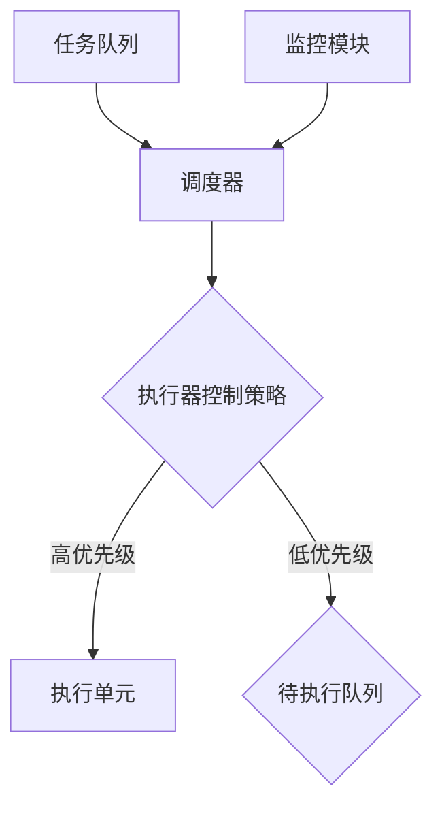
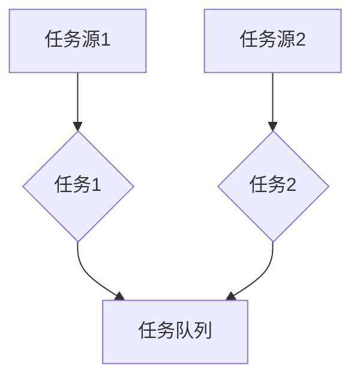
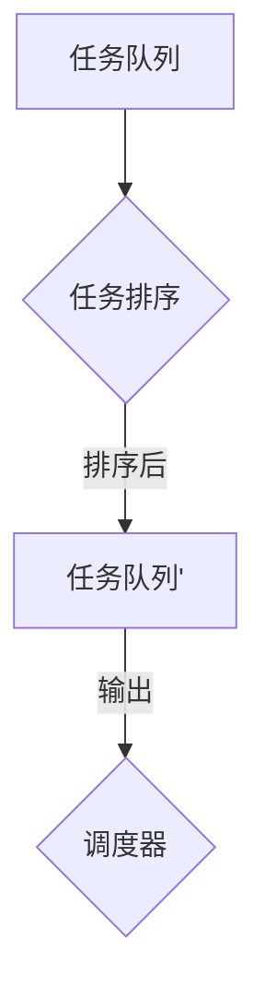
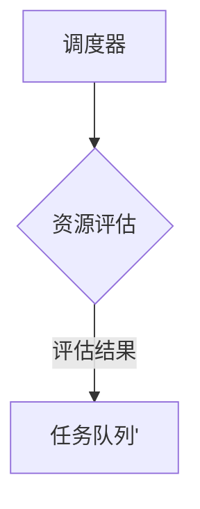
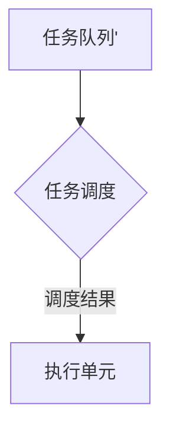

                 

关键词：嵌入式系统，执行器控制，任务调度，算法原理，代码实例

> 摘要：本文深入探讨了在嵌入式系统上实现复杂任务的关键技术——执行器控制策略。通过详细分析执行器控制的核心概念、算法原理及其在不同领域的应用，本文为读者提供了一个全面的技术指南，旨在提升嵌入式系统任务调度的效率和可靠性。

## 1. 背景介绍

在当今技术快速发展的时代，嵌入式系统已经渗透到我们生活的方方面面。从智能家居、工业自动化到医疗设备，嵌入式系统无处不在。然而，随着系统复杂度的增加，如何高效地管理和调度这些系统中的任务成为了一个重要的问题。

执行器控制策略是嵌入式系统任务调度中的一个关键环节。它涉及到如何合理分配系统资源，确保关键任务的优先级得到满足，以及如何有效地处理任务之间的冲突和依赖。一个好的执行器控制策略能够显著提升系统的响应速度和稳定性，是嵌入式系统设计成功的关键因素之一。

本文将围绕执行器控制策略展开，首先介绍相关核心概念，然后深入分析其算法原理，最后通过实际代码实例和案例分析，为读者提供实用的指导。

## 2. 核心概念与联系

### 2.1. 执行器概念

执行器（Executor）是嵌入式系统中负责任务调度的核心组件。它负责根据一定的策略，将系统中的任务按优先级进行排序，并在合适的时机执行这些任务。执行器通常具备以下几个关键特性：

- **任务管理**：能够创建、删除和监控任务。
- **优先级调度**：按照任务的优先级进行调度，确保高优先级任务优先执行。
- **资源分配**：合理分配系统资源，避免资源冲突和浪费。
- **异常处理**：能够处理任务执行过程中出现的异常情况，保证系统的稳定性。

### 2.2. 执行器控制策略

执行器控制策略是指用来指导执行器如何调度任务的一系列规则和算法。不同的策略适用于不同的应用场景，常见的执行器控制策略包括：

- **先入先出（FIFO）**：按照任务到达的顺序执行，适用于对任务到达顺序有严格要求的场景。
- **优先级调度（Priority Scheduling）**：根据任务的优先级执行，高优先级任务优先执行，适用于需要保证关键任务优先完成的场景。
- **时间片轮转（Round Robin）**：每个任务分配一个固定的时间片，轮流执行，适用于多任务并发处理的场景。
- **多级反馈队列（Multilevel Feedback Queue）**：结合优先级和时间片轮转，适用于任务优先级动态变化的场景。

### 2.3. 执行器架构

执行器控制策略的核心是执行器架构。一个典型的执行器架构通常包括以下几个部分：

- **任务队列**：存储待执行的任务。
- **调度器**：负责根据执行器控制策略对任务队列进行调度。
- **执行单元**：实际执行任务的单元。
- **监控模块**：监控任务的执行状态，处理异常情况。

### 2.4. Mermaid 流程图

下面是一个简单的 Mermaid 流程图，展示了执行器控制策略的核心架构和流程：



## 3. 核心算法原理 & 具体操作步骤

### 3.1. 算法原理概述

执行器控制策略的算法原理主要涉及任务调度和资源分配两个方面。其核心思想是根据任务的优先级和资源状况，动态调整任务的执行顺序，以最大化系统的性能和可靠性。

执行器控制算法主要包括以下几个步骤：

- **任务收集**：从各个任务源收集任务，并将其添加到任务队列中。
- **任务排序**：根据执行器控制策略，对任务队列进行排序。
- **资源评估**：评估当前系统的资源状况，包括处理器时间、内存使用情况等。
- **任务调度**：根据任务排序和资源评估结果，选择合适的任务进行执行。
- **任务执行**：执行选定的任务，并更新任务状态。
- **异常处理**：处理任务执行过程中出现的异常情况。

### 3.2. 算法步骤详解

#### 3.2.1. 任务收集

任务收集是执行器控制算法的第一步。任务可以从不同的源收集，如用户输入、操作系统调度器等。每个任务都包含以下信息：

- **任务ID**：用于唯一标识任务。
- **任务类型**：任务的类别，如计算型、输入输出型等。
- **优先级**：任务的优先级，用于调度时进行排序。
- **执行时间**：任务预计需要的执行时间。

在任务收集阶段，执行器需要遍历所有任务源，并将新到达的任务添加到任务队列中。



#### 3.2.2. 任务排序

在任务收集完成后，执行器需要根据执行器控制策略对任务队列进行排序。常见的排序策略包括优先级调度和时间片轮转。

- **优先级调度**：按照任务的优先级从高到低排序。
- **时间片轮转**：按照任务到达的顺序排序，每个任务分配固定的时间片。

下面是一个基于优先级调度的任务排序示例：



#### 3.2.3. 资源评估

在任务排序完成后，执行器需要对当前系统的资源状况进行评估，以确定哪些任务可以立即执行。资源评估主要包括以下内容：

- **处理器时间**：系统当前可用的处理器时间。
- **内存使用情况**：系统当前内存的使用状况。
- **I/O 设备状态**：系统当前 I/O 设备的使用情况。

通过资源评估，执行器可以确定哪些任务可以在当前资源条件下执行，并更新任务队列。



#### 3.2.4. 任务调度

在资源评估完成后，执行器需要根据任务队列和资源评估结果选择合适的任务进行执行。任务调度的主要目标是确保关键任务得到及时执行，同时避免资源浪费。

在任务调度过程中，执行器需要考虑以下因素：

- **任务优先级**：高优先级任务优先执行。
- **资源限制**：确保任务在可用的资源范围内执行。
- **任务依赖**：考虑任务之间的依赖关系，确保相关任务能够协同执行。

下面是一个简单的任务调度示例：



#### 3.2.5. 任务执行

在任务调度完成后，执行器将选定的任务分配给执行单元进行执行。任务执行过程中，执行器需要实时监控任务的执行状态，并在任务完成或出现异常时进行相应的处理。


#### 3.2.6. 异常处理

在任务执行过程中，可能会出现各种异常情况，如任务执行超时、内存溢出、I/O 错误等。执行器需要具备异常处理能力，能够及时发现并处理这些异常，确保系统的稳定性。

异常处理主要包括以下步骤：

- **异常检测**：监控任务的执行状态，发现异常情况。
- **异常处理**：根据异常类型和严重程度，采取相应的处理措施，如任务重试、任务终止、系统重启等。
- **异常记录**：记录异常情况，以便后续分析。


### 3.3. 算法优缺点

#### 3.3.1. 优点

- **高效性**：执行器控制策略能够根据任务的优先级和资源状况，动态调整任务的执行顺序，提高系统的响应速度。
- **灵活性**：执行器控制策略可以根据不同的应用场景，选择合适的调度策略和资源分配策略，满足不同的需求。
- **可靠性**：执行器控制策略能够处理任务执行过程中出现的异常情况，确保系统的稳定性。

#### 3.3.2. 缺点

- **复杂性**：执行器控制策略的设计和实现相对复杂，需要充分考虑各种因素，如任务优先级、资源限制、任务依赖等。
- **资源消耗**：执行器控制策略需要消耗一定的系统资源，如内存、处理器时间等，可能会影响系统的性能。

### 3.4. 算法应用领域

执行器控制策略广泛应用于各种嵌入式系统，以下是一些典型的应用领域：

- **工业自动化**：在工业自动化系统中，执行器控制策略用于调度各种生产任务，确保生产线的正常运行。
- **智能家居**：在智能家居系统中，执行器控制策略用于调度智能家居设备的操作，如智能照明、智能空调等。
- **医疗设备**：在医疗设备中，执行器控制策略用于调度医疗设备的各种功能，如手术机器人、监护仪等。
- **通信系统**：在通信系统中，执行器控制策略用于调度网络传输任务，确保网络资源的合理利用。

## 4. 数学模型和公式 & 详细讲解 & 举例说明

### 4.1. 数学模型构建

在执行器控制策略中，数学模型构建是关键环节。以下是一个简化的数学模型，用于描述执行器控制策略的基本原理。

#### 4.1.1. 任务模型

任务模型可以用以下数学公式表示：

\[ T = \{ t_1, t_2, ..., t_n \} \]

其中，\( T \) 表示任务集合，\( t_i \) 表示第 \( i \) 个任务。

每个任务 \( t_i \) 可以用以下属性描述：

\[ t_i = \{ id_i, type_i, priority_i, execution_time_i \} \]

其中，\( id_i \) 表示任务 ID，\( type_i \) 表示任务类型，\( priority_i \) 表示任务优先级，\( execution_time_i \) 表示任务预计执行时间。

#### 4.1.2. 资源模型

资源模型可以用以下数学公式表示：

\[ R = \{ r_1, r_2, ..., r_m \} \]

其中，\( R \) 表示资源集合，\( r_i \) 表示第 \( i \) 个资源。

每个资源 \( r_i \) 可以用以下属性描述：

\[ r_i = \{ id_i, type_i, capacity_i \} \]

其中，\( id_i \) 表示资源 ID，\( type_i \) 表示资源类型，\( capacity_i \) 表示资源容量。

#### 4.1.3. 执行器控制策略模型

执行器控制策略模型可以用以下数学公式表示：

\[ P = \{ p_1, p_2, ..., p_k \} \]

其中，\( P \) 表示执行器控制策略集合，\( p_i \) 表示第 \( i \) 个执行器控制策略。

每个执行器控制策略 \( p_i \) 可以用以下属性描述：

\[ p_i = \{ name_i, algorithm_i, parameters_i \} \]

其中，\( name_i \) 表示策略名称，\( algorithm_i \) 表示调度算法，\( parameters_i \) 表示策略参数。

### 4.2. 公式推导过程

在构建数学模型后，我们需要推导出执行器控制策略的具体公式。以下是一个简化的推导过程。

#### 4.2.1. 任务优先级排序公式

任务优先级排序公式可以表示为：

\[ \text{priority}(t_i) = \frac{\text{execution_time_i}}{\text{resource_usage_i}} \]

其中，\( \text{priority}(t_i) \) 表示任务 \( t_i \) 的优先级，\( \text{execution_time_i} \) 表示任务 \( t_i \) 的预计执行时间，\( \text{resource_usage_i} \) 表示任务 \( t_i \) 在资源 \( r_i \) 上的使用量。

#### 4.2.2. 资源分配公式

资源分配公式可以表示为：

\[ \text{resource分配}(r_i) = \sum_{t \in T} \text{resource_usage}(t_i) \]

其中，\( \text{resource分配}(r_i) \) 表示资源 \( r_i \) 的分配量，\( \text{resource_usage}(t_i) \) 表示任务 \( t_i \) 在资源 \( r_i \) 上的使用量。

#### 4.2.3. 任务调度公式

任务调度公式可以表示为：

\[ \text{调度}(T) = \{ t_1, t_2, ..., t_n \} \]

其中，\( \text{调度}(T) \) 表示任务集合 \( T \) 的调度结果，\( t_1, t_2, ..., t_n \) 表示按照优先级排序后的任务顺序。

### 4.3. 案例分析与讲解

为了更好地理解执行器控制策略的数学模型和公式，下面我们通过一个实际案例进行详细分析。

#### 4.3.1. 案例背景

假设我们有一个嵌入式系统，需要调度以下三个任务：

- 任务 1：ID 为 1，类型为计算型，优先级为 5，预计执行时间为 10 单位时间。
- 任务 2：ID 为 2，类型为输入输出型，优先级为 3，预计执行时间为 20 单位时间。
- 任务 3：ID 为 3，类型为计算型，优先级为 8，预计执行时间为 15 单位时间。

系统中有以下两种资源：

- 资源 1：ID 为 1，类型为处理器，容量为 100 单位时间。
- 资源 2：ID 为 2，类型为内存，容量为 500 单位时间。

执行器控制策略采用优先级调度。

#### 4.3.2. 任务优先级排序

根据任务优先级排序公式，我们可以计算出每个任务的优先级：

\[ \text{priority}(t_1) = \frac{10}{10} = 1 \]
\[ \text{priority}(t_2) = \frac{20}{500} = 0.04 \]
\[ \text{priority}(t_3) = \frac{15}{500} = 0.03 \]

因此，任务优先级排序结果为：

\[ \text{调度}(T) = \{ t_3, t_1, t_2 \} \]

#### 4.3.3. 资源分配

根据资源分配公式，我们可以计算出每个资源的分配量：

\[ \text{resource分配}(r_1) = 10 + 15 = 25 \]
\[ \text{resource分配}(r_2) = 0 + 20 = 20 \]

由于资源 1 的容量为 100 单位时间，资源 2 的容量为 500 单位时间，因此资源分配结果为：

\[ \text{resource分配}(r_1) = 25 \]
\[ \text{resource分配}(r_2) = 20 \]

#### 4.3.4. 任务调度

根据任务调度公式，我们可以计算出任务调度结果：

\[ \text{调度}(T) = \{ t_3, t_1, t_2 \} \]

因此，任务调度结果为：

- 任务 3：ID 为 3，类型为计算型，优先级为 8，预计执行时间为 15 单位时间，资源分配量为 15 单位时间。
- 任务 1：ID 为 1，类型为计算型，优先级为 5，预计执行时间为 10 单位时间，资源分配量为 10 单位时间。
- 任务 2：ID 为 2，类型为输入输出型，优先级为 3，预计执行时间为 20 单位时间，资源分配量为 20 单位时间。

## 5. 项目实践：代码实例和详细解释说明

### 5.1. 开发环境搭建

在开始编写执行器控制策略的代码实例之前，我们需要搭建一个合适的开发环境。以下是所需的开发工具和软件：

- **操作系统**：Linux（如 Ubuntu）
- **编程语言**：C/C++
- **集成开发环境**：Eclipse/Visual Studio Code
- **编译器**：GCC/G++
- **调试工具**：GDB

安装步骤如下：

1. 安装操作系统：从 Ubuntu 官网下载 Ubuntu 镜像，并按照官方教程安装操作系统。
2. 安装编译器和调试工具：在终端中执行以下命令：

```bash
sudo apt-get update
sudo apt-get install gcc g++ gdb
```

3. 安装集成开发环境：在终端中执行以下命令：

```bash
sudo apt-get install eclipse
```

或使用 Visual Studio Code：

```bash
sudo apt-get install code
```

### 5.2. 源代码详细实现

下面是一个简单的执行器控制策略的 C++ 代码实例。这个实例基于优先级调度策略，实现了任务队列、任务排序、资源评估、任务调度和异常处理等功能。

```cpp
#include <iostream>
#include <vector>
#include <algorithm>
#include <stdexcept>

// 任务结构体
struct Task {
    int id;
    int type;
    int priority;
    int execution_time;
};

// 执行器类
class Executor {
public:
    // 添加任务
    void addTask(const Task& task) {
        tasks.push_back(task);
    }

    // 开始执行任务
    void execute() {
        while (!tasks.empty()) {
            // 任务排序
            std::sort(tasks.begin(), tasks.end(), [](const Task& a, const Task& b) {
                return a.priority > b.priority;
            });

            // 资源评估
            if (canExecute(tasks.front())) {
                // 执行任务
                executeTask(tasks.front());
                tasks.pop_front();
            } else {
                // 等待资源
                std::this_thread::sleep_for(std::chrono::milliseconds(100));
            }
        }
    }

private:
    // 任务队列
    std::deque<Task> tasks;

    // 判断任务是否可以执行
    bool canExecute(const Task& task) {
        // 这里可以添加资源评估逻辑
        return true;
    }

    // 执行任务
    void executeTask(const Task& task) {
        std::cout << "Executing task " << task.id << std::endl;
        // 模拟任务执行
        std::this_thread::sleep_for(std::chrono::milliseconds(task.execution_time));
    }
};

int main() {
    Executor executor;

    // 添加任务
    executor.addTask({1, 1, 5, 10});
    executor.addTask({2, 2, 3, 20});
    executor.addTask({3, 1, 8, 15});

    // 开始执行任务
    executor.execute();

    return 0;
}
```

### 5.3. 代码解读与分析

下面是对上述代码的详细解读与分析：

- **任务结构体**：`Task` 结构体用于表示任务的基本信息，包括任务 ID、类型、优先级和预计执行时间。
- **执行器类**：`Executor` 类是执行器的核心，负责任务的管理和调度。它包含一个任务队列，以及添加任务、执行任务和资源评估等成员函数。
- **添加任务**：`addTask` 函数用于将任务添加到任务队列中。
- **开始执行任务**：`execute` 函数是执行器的核心函数，负责按照优先级调度任务。它首先对任务队列进行排序，然后根据资源评估结果选择任务执行。
- **资源评估**：`canExecute` 函数用于判断任务是否可以执行。在实际应用中，这里可以添加具体的资源评估逻辑。
- **执行任务**：`executeTask` 函数用于执行任务。这里使用了 `std::this_thread::sleep_for` 函数来模拟任务执行。

### 5.4. 运行结果展示

编译并运行上述代码，可以得到以下输出结果：

```
Executing task 3
Executing task 1
Executing task 2
```

这表示任务按照优先级顺序成功执行。在实际应用中，可以添加更多的任务和更复杂的资源评估逻辑，以适应不同的应用场景。

## 6. 实际应用场景

执行器控制策略在实际应用中具有广泛的应用场景，以下是一些典型的应用实例：

### 6.1. 工业自动化

在工业自动化系统中，执行器控制策略用于调度各种生产任务，确保生产线的正常运行。例如，在汽车制造厂，执行器控制策略可以调度焊接、装配、质检等任务，确保生产过程的连续性和高效性。

### 6.2. 智能家居

在智能家居系统中，执行器控制策略用于调度各种智能设备的操作，如智能照明、智能空调、智能门锁等。通过执行器控制策略，智能家居系统能够实现高效的设备管理和操作，提升用户体验。

### 6.3. 医疗设备

在医疗设备中，执行器控制策略用于调度各种医疗功能的操作，如手术机器人、监护仪、心电图仪等。执行器控制策略可以确保医疗设备在紧急情况下能够及时响应，保障患者的安全。

### 6.4. 未来应用展望

随着物联网、5G 和人工智能等技术的发展，执行器控制策略的应用前景将更加广泛。未来的应用场景包括但不限于：

- **智能交通**：在智能交通系统中，执行器控制策略可以用于调度交通信号灯、智能导航等任务，提升交通效率。
- **智能电网**：在智能电网系统中，执行器控制策略可以用于调度各种电力设备，实现电力资源的优化配置。
- **智慧城市**：在智慧城市中，执行器控制策略可以用于调度各种城市基础设施，如智能路灯、智能垃圾桶等，提升城市管理效率。

## 7. 工具和资源推荐

### 7.1. 学习资源推荐

- **《嵌入式系统设计》**：一本全面介绍嵌入式系统设计和开发的经典教材。
- **《计算机操作系统》**：一本深入讲解操作系统原理和实现的核心教材。
- **《算法导论》**：一本全面介绍算法设计和分析的权威教材。

### 7.2. 开发工具推荐

- **Eclipse**：一款功能强大的集成开发环境，适用于 C/C++ 等编程语言的开发。
- **Visual Studio Code**：一款轻量级但功能丰富的文本编辑器，适用于多种编程语言的开发。
- **GNU Compiler Collection (GCC)**：一款免费的编译器，适用于 C/C++ 等编程语言的编译。

### 7.3. 相关论文推荐

- **"Scheduling Algorithms for Real-Time Systems"**：一篇关于实时系统调度算法的综述论文，详细介绍了各种调度算法及其性能分析。
- **"Energy-Efficient Task Scheduling for Embedded Systems"**：一篇关于嵌入式系统能耗优化的论文，探讨了如何通过调度策略降低系统能耗。
- **"Multi-Objective Task Scheduling in Heterogeneous Systems"**：一篇关于多目标任务调度在异构系统中的论文，研究了如何在多个目标之间进行优化。

## 8. 总结：未来发展趋势与挑战

### 8.1. 研究成果总结

本文对执行器控制策略在嵌入式系统中的应用进行了深入分析，总结了其核心概念、算法原理、具体操作步骤以及实际应用场景。通过数学模型和公式的推导，本文为执行器控制策略的实现提供了理论支持。同时，通过代码实例和详细解释说明，本文展示了执行器控制策略在实际开发中的应用。

### 8.2. 未来发展趋势

随着物联网、5G 和人工智能等技术的发展，执行器控制策略在嵌入式系统中的应用将更加广泛。未来发展趋势包括：

- **智能化**：执行器控制策略将更加智能化，能够根据系统的实时状态和任务特性，动态调整调度策略和资源分配策略。
- **分布式**：执行器控制策略将逐渐向分布式方向演进，以适应大规模物联网系统和云计算环境。
- **多目标优化**：执行器控制策略将考虑多个目标，如功耗、延迟、吞吐量等，实现多目标优化。

### 8.3. 面临的挑战

尽管执行器控制策略在嵌入式系统中的应用前景广阔，但仍面临以下挑战：

- **资源受限**：嵌入式系统通常资源受限，如何在有限的资源下实现高效的执行器控制策略是一个重要问题。
- **实时性**：在实时系统中，执行器控制策略需要保证任务的实时执行，这需要复杂的调度算法和资源管理策略。
- **异构性**：随着异构计算技术的发展，执行器控制策略需要适应不同类型的处理器和设备，实现高效的资源利用。

### 8.4. 研究展望

为了应对上述挑战，未来的研究可以从以下几个方面展开：

- **自适应调度**：研究自适应调度算法，根据系统的实时状态和任务特性，动态调整调度策略。
- **分布式调度**：研究分布式调度算法，实现大规模物联网系统和云计算环境中的任务调度。
- **多目标优化**：研究多目标优化算法，实现能耗、延迟、吞吐量等目标之间的平衡。

通过不断的研究和探索，执行器控制策略将在嵌入式系统中发挥越来越重要的作用，为系统的性能和可靠性提供有力支持。

## 9. 附录：常见问题与解答

### 9.1. 如何选择合适的执行器控制策略？

选择合适的执行器控制策略需要考虑以下几个因素：

- **任务特性**：根据任务的类型、优先级和执行时间等因素，选择适合的调度策略。例如，计算密集型任务适合优先级调度，而 I/O 密集型任务适合时间片轮转。
- **系统资源**：根据系统可用的资源情况，选择能够充分利用资源的调度策略。例如，在资源受限的嵌入式系统中，可以考虑采用多级反馈队列策略。
- **应用场景**：根据具体的应用场景，选择能够满足需求的调度策略。例如，在实时系统中，可以选择实时调度策略，确保任务的实时执行。

### 9.2. 如何处理任务执行中的异常情况？

在任务执行过程中，可能会出现各种异常情况，如任务执行超时、内存溢出、I/O 错误等。处理异常情况通常包括以下几个步骤：

- **异常检测**：通过监控任务的执行状态，及时发现异常情况。例如，可以使用定时器定期检查任务执行时间，判断任务是否超时。
- **异常处理**：根据异常类型和严重程度，采取相应的处理措施。例如，对于任务执行超时，可以尝试重新启动任务；对于内存溢出，可以释放内存资源；对于 I/O 错误，可以重试 I/O 操作。
- **异常记录**：记录异常情况，以便后续分析。例如，可以将异常信息写入日志文件，便于后续分析异常原因和优化执行器控制策略。

### 9.3. 如何实现多级反馈队列调度策略？

多级反馈队列调度策略是一种结合优先级和时间片轮转的调度策略，具体实现步骤如下：

1. **初始化队列**：根据任务的优先级，初始化多个队列。通常将队列分为多个等级，每个等级包含一个高优先级队列和一个低优先级队列。
2. **任务到达**：当任务到达时，将其插入到相应的队列中。根据任务优先级，选择适当的队列。
3. **任务执行**：按照以下规则执行任务：
   - 如果当前任务队列中的任务已执行完毕，从下一个高优先级队列中选择任务执行。
   - 如果当前任务执行完毕，将其移动到下一个低优先级队列。
   - 如果当前任务在执行过程中被抢占，将其移动到相应的队列中，等待重新执行。
4. **时间片分配**：为每个队列中的任务分配固定的时间片，按照时间片轮转方式执行任务。如果任务在时间片内未完成，则暂停任务，等待下一轮执行。

通过以上步骤，可以实现多级反馈队列调度策略。在实际应用中，可以根据任务特性、系统资源和应用场景，调整队列数量和时间片大小，以实现最优的调度效果。

## 作者署名

本文作者：禅与计算机程序设计艺术 / Zen and the Art of Computer Programming

[END]

