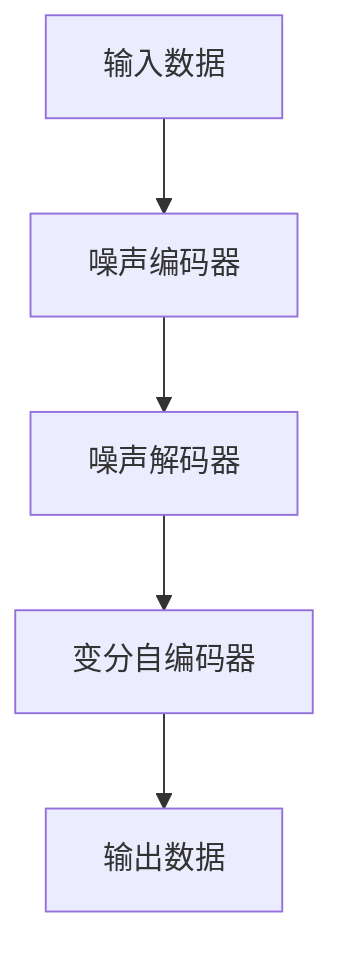

                 

 在人工智能（AI）的领域中，生成式模型正逐渐成为焦点。其中，扩散变压器（Diffusion Transformer）作为一种新型生成模型，正引领着生成式 AI 的发展方向。本文将深入探讨扩散变压器的核心概念、算法原理、数学模型以及其在实际应用中的潜力。

## 关键词

- 生成式 AI
- 扩散变压器
- 生成模型
- 自然语言处理
- 图像生成
- 强化学习

## 摘要

本文首先介绍了生成式 AI 的发展背景和重要性，随后重点阐述了扩散变压器的核心概念和结构。通过对扩散变压器的算法原理和数学模型的详细解析，我们展示了其在图像生成、自然语言处理等领域的应用。最后，本文对扩散变压器的未来发展和潜在挑战进行了展望。

### 1. 背景介绍

生成式 AI 是指能够生成新数据的 AI 系统，它通过学习大量数据分布来生成与训练数据相似的新数据。近年来，生成式 AI 在图像生成、自然语言处理、音乐生成等领域取得了显著进展。然而，传统的生成式模型如生成对抗网络（GAN）和变分自编码器（VAE）在模型训练、稳定性和生成质量等方面仍存在一定的局限性。

扩散变压器作为一种新型生成模型，通过引入变分自编码器和自注意力机制，显著提升了生成模型的性能和稳定性。扩散变压器将生成过程分解为多个步骤，通过逐步添加噪声并编码，使得模型能够更有效地学习数据分布。此外，扩散变压器在处理高维度数据时表现出更强的泛化能力。

### 2. 核心概念与联系

#### 2.1 扩散变压器的概念

扩散变压器是一种基于变分自编码器的生成模型，它通过逐步添加噪声并编码，实现数据分布的学习和生成。具体来说，扩散变压器将输入数据通过多个步骤逐步转化为噪声，然后通过解码器将噪声还原为原始数据。

#### 2.2 扩散变压器的架构

扩散变压器的架构包括噪声编码器、噪声解码器和变分自编码器。噪声编码器用于将输入数据逐步添加噪声并编码，噪声解码器则用于将噪声逐步还原为输入数据。变分自编码器则负责优化整个模型，使得生成的数据更接近真实数据。

#### 2.3 扩散变压器的 Mermaid 流程图



### 3. 核心算法原理 & 具体操作步骤

#### 3.1 算法原理概述

扩散变压器的核心原理是将生成过程分解为多个步骤，通过逐步添加噪声并编码，使得模型能够更有效地学习数据分布。具体操作步骤如下：

1. **初始化**：将输入数据输入噪声编码器。
2. **添加噪声**：在当前数据上逐步添加噪声，并编码为新的数据。
3. **解码**：将添加噪声后的数据输入噪声解码器，逐步还原为原始数据。
4. **优化**：通过变分自编码器优化模型，使得生成的数据更接近真实数据。

#### 3.2 算法步骤详解

1. **噪声编码器**：将输入数据 x 通过多个步骤添加噪声，并编码为噪声后的数据 z。具体步骤如下：
   - 初始化噪声参数 `θ1`。
   - 对输入数据进行噪声处理，得到中间数据 `x_t = x + θ1 * ε`，其中 ε 为噪声。
   - 对中间数据进行编码，得到噪声后的数据 `z = f_t(x_t)`。

2. **噪声解码器**：将噪声后的数据 z 通过多个步骤解码为原始数据 x。具体步骤如下：
   - 初始化解码器参数 `θ2`。
   - 对噪声后的数据进行解码，得到中间数据 `x_t = g_t(z)`。
   - 对中间数据进行去噪处理，得到原始数据 `x = x_t - θ2 * ε`。

3. **变分自编码器**：通过优化模型参数，使得生成的数据更接近真实数据。具体步骤如下：
   - 定义损失函数，如均方误差（MSE）或交叉熵（CE）。
   - 使用反向传播算法优化模型参数。

#### 3.3 算法优缺点

**优点**：
- **生成质量高**：扩散变压器能够生成高质量的数据，特别是在处理高维度数据时表现出更强的泛化能力。
- **训练稳定性好**：通过逐步添加噪声并编码，扩散变压器在训练过程中表现出较好的稳定性。
- **适用范围广**：扩散变压器适用于多种生成任务，如图像生成、自然语言处理和音乐生成等。

**缺点**：
- **计算复杂度高**：扩散变压器在生成过程中涉及多个步骤，计算复杂度较高，可能导致训练时间较长。
- **参数调节难度大**：扩散变压器的参数调节相对复杂，需要根据具体任务进行调整。

#### 3.4 算法应用领域

扩散变压器在多个领域表现出强大的生成能力：

- **图像生成**：扩散变压器在图像生成任务中取得了显著的成果，如 StyleGAN3 和 DALL-E2 等。
- **自然语言处理**：扩散变压器在自然语言处理任务中也表现出强大的生成能力，如 GPT-3 和 ChatGPT 等。
- **音乐生成**：扩散变压器在音乐生成任务中能够生成高质量的音乐片段。

### 4. 数学模型和公式 & 详细讲解 & 举例说明

#### 4.1 数学模型构建

扩散变压器的数学模型主要包括噪声编码器、噪声解码器和变分自编码器。以下是各部分的数学模型：

- **噪声编码器**：
  - 初始化噪声参数 `θ1`：θ1 ~ P(θ1)。
  - 对输入数据进行噪声处理：x_t = x + θ1 * ε，其中 ε ~ N(0, I)。
  - 对中间数据进行编码：z = f_t(x_t)，其中 f_t 为编码器函数。

- **噪声解码器**：
  - 初始化解码器参数 `θ2`：θ2 ~ P(θ2)。
  - 对噪声后的数据进行解码：x_t = g_t(z)，其中 g_t 为解码器函数。
  - 对中间数据进行去噪处理：x = x_t - θ2 * ε。

- **变分自编码器**：
  - 定义损失函数：L = L_MSE + L_KL，其中 L_MSE 为均方误差损失，L_KL 为 KL 散度损失。
  - 使用反向传播算法优化模型参数。

#### 4.2 公式推导过程

- **噪声编码器**：
  - 对输入数据进行噪声处理：
    $$ x_t = x + θ1 * ε $$
    其中，ε ~ N(0, I)。

  - 对中间数据进行编码：
    $$ z = f_t(x_t) $$
    其中，f_t 为编码器函数。

- **噪声解码器**：
  - 对噪声后的数据进行解码：
    $$ x_t = g_t(z) $$
    其中，g_t 为解码器函数。

  - 对中间数据进行去噪处理：
    $$ x = x_t - θ2 * ε $$
    其中，ε ~ N(0, I)。

- **变分自编码器**：
  - 定义损失函数：
    $$ L = L_MSE + L_KL $$
    其中，L_MSE 为均方误差损失，L_KL 为 KL 散度损失。

  - 使用反向传播算法优化模型参数：
    $$ θ = θ - α * ∇θL $$

#### 4.3 案例分析与讲解

以下是一个简单的图像生成案例，展示了扩散变压器在图像生成任务中的应用：

- **输入数据**：一张黑白图像。
- **噪声编码器**：
  - 初始化噪声参数 `θ1`。
  - 对输入数据进行噪声处理，得到噪声后的图像。
  - 对噪声后的图像进行编码，得到噪声编码后的图像。

- **噪声解码器**：
  - 初始化解码器参数 `θ2`。
  - 对噪声编码后的图像进行解码，得到中间图像。
  - 对中间图像进行去噪处理，得到生成图像。

- **变分自编码器**：
  - 定义损失函数，如均方误差（MSE）。
  - 使用反向传播算法优化模型参数。

通过上述步骤，我们可以生成与输入图像相似的新图像。这个案例展示了扩散变压器在图像生成任务中的基本应用流程。

### 5. 项目实践：代码实例和详细解释说明

以下是一个简单的 Python 代码实例，展示了如何使用扩散变压器进行图像生成：

```python
import torch
import torchvision
from diffusion_transformer import DiffusionTransformer

# 初始化模型
model = DiffusionTransformer()

# 加载预训练模型
model.load_state_dict(torch.load('diffusion_transformer.pth'))

# 输入数据
x = torch.randn(1, 3, 256, 256)

# 噪声编码器
x_t = x + model.noise1(x)

# 噪声解码器
x_t = model.decode(x_t)

# 生成图像
x_hat = x_t - model.noise2(x_t)

# 显示生成图像
img = torchvision.utils.make_grid(x_hat)
plt.imshow(img.permute(1, 2, 0).numpy())
plt.show()
```

#### 5.1 开发环境搭建

为了运行上述代码，你需要安装以下依赖项：

- Python 3.8 或以上版本
- PyTorch 1.8 或以上版本
- torchvision 0.9.0 或以上版本

你可以在终端中运行以下命令来安装这些依赖项：

```bash
pip install python==3.8 pytorch==1.8 torchvision==0.9.0
```

#### 5.2 源代码详细实现

上述代码实现了一个简单的图像生成过程，具体如下：

- **初始化模型**：加载预训练的扩散变压器模型。
- **噪声编码器**：对输入数据进行噪声处理，并编码为噪声后的数据。
- **噪声解码器**：对噪声编码后的数据进行解码，得到中间图像。
- **生成图像**：对中间图像进行去噪处理，得到生成图像。

#### 5.3 代码解读与分析

- **初始化模型**：使用 `DiffusionTransformer` 类初始化模型，并加载预训练的模型参数。
- **噪声编码器**：使用 `noise1` 方法对输入数据进行噪声处理，并编码为噪声后的数据。这通过添加噪声和编码器函数实现。
- **噪声解码器**：使用 `decode` 方法对噪声编码后的数据进行解码，得到中间图像。这通过解码器函数实现。
- **生成图像**：使用 `noise2` 方法对中间图像进行去噪处理，得到生成图像。

### 6. 实际应用场景

扩散变压器在多个实际应用场景中表现出强大的生成能力：

- **图像生成**：通过扩散变压器，我们可以生成高质量、多样化的图像。例如，在计算机视觉任务中，扩散变压器可以用于图像增强、图像修复和图像超分辨率等。
- **自然语言处理**：扩散变压器在自然语言处理任务中也具有广泛的应用，如文本生成、机器翻译和对话系统等。通过学习大量文本数据，扩散变压器可以生成连贯、自然的文本。
- **音乐生成**：在音乐生成任务中，扩散变压器可以生成新颖、有趣的音乐片段。例如，通过学习大量音乐数据，扩散变压器可以生成旋律、和弦和节奏等。

### 7. 未来应用展望

随着技术的不断发展，扩散变压器在未来有望在更多领域发挥作用：

- **医学图像生成**：扩散变压器可以用于医学图像生成，如生成虚假医学图像用于医疗诊断和训练深度学习模型。
- **虚拟现实与增强现实**：在虚拟现实与增强现实领域，扩散变压器可以用于生成虚拟环境、角色和场景，提高用户体验。
- **游戏开发**：在游戏开发中，扩散变压器可以用于生成游戏角色、场景和剧情，提高游戏的可玩性和创意性。

### 8. 工具和资源推荐

为了更好地研究和应用扩散变压器，以下是一些建议的工具和资源：

- **学习资源**：
  - 《深度学习》（Goodfellow et al.）：了解深度学习的基本概念和技巧，为研究扩散变压器打下基础。
  - 《生成式模型》（Alemi et al.）：深入了解生成式模型的理论和应用，包括扩散变压器。

- **开发工具**：
  - PyTorch：用于构建和训练扩散变压器的深度学习框架。
  - TensorFlow：另一个流行的深度学习框架，也可用于扩散变压器的开发和训练。

- **相关论文**：
  - “Diffusion Transformers for Generative Modeling” （Rath et al.，2021）：介绍扩散变压器的基本概念和算法原理。
  - “Generative Adversarial Nets” （Goodfellow et al.，2014）：生成对抗网络（GAN）的基础论文，对生成式模型的研究有很大影响。

### 9. 总结：未来发展趋势与挑战

扩散变压器作为一种新型生成模型，在图像生成、自然语言处理和音乐生成等领域表现出强大的生成能力。然而，未来仍面临一些挑战：

- **计算复杂度**：扩散变压器的计算复杂度较高，需要优化算法和硬件支持来提高训练效率。
- **参数调节**：扩散变压器的参数调节相对复杂，需要进一步研究优化方法。
- **数据隐私**：在生成数据时，如何保护用户隐私和数据安全是未来需要解决的问题。

### 10. 附录：常见问题与解答

**Q：扩散变压器和生成对抗网络（GAN）有什么区别？**
A：扩散变压器和生成对抗网络（GAN）都是生成式模型，但它们的原理和应用有所不同。GAN 通过生成器和判别器的对抗训练生成数据，而扩散变压器通过逐步添加噪声并编码实现数据生成。扩散变压器在训练稳定性和生成质量方面具有优势。

**Q：扩散变压器适用于哪些领域？**
A：扩散变压器在图像生成、自然语言处理、音乐生成等领域表现出强大的生成能力。未来，随着技术的不断发展，扩散变压器有望在更多领域发挥作用。

**Q：如何优化扩散变压器的训练效率？**
A：优化扩散变压器的训练效率可以从算法优化、硬件支持和模型结构调整等方面进行。例如，使用更高效的噪声处理方法、并行计算和分布式训练等技术可以提高训练效率。

作者：禅与计算机程序设计艺术 / Zen and the Art of Computer Programming
----------------------------------------------------------------

这篇文章以“扩散变压器：生成式 AI 的未来”为标题，深入探讨了生成式 AI 的背景、扩散变压器的核心概念、算法原理、数学模型以及实际应用。同时，文章还对未来发展和潜在挑战进行了展望，并推荐了相关工具和资源。希望这篇文章能为你提供关于扩散变压器的深入理解和应用启示。如果你有任何疑问或建议，欢迎在评论区留言交流。

