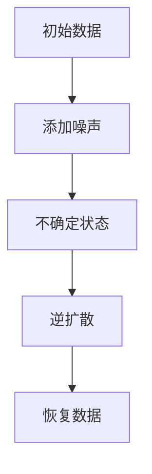

                 

关键词：扩散模型、AI创作、生成对抗网络、变分自编码器、深度学习、人工智能、数据生成、图像生成、文本生成。

> 摘要：扩散模型作为人工智能领域的一项新兴技术，正逐渐成为AI创作的新范式。本文将深入探讨扩散模型的背景、核心概念、算法原理、数学模型、实践案例以及未来的应用前景。

## 1. 背景介绍

在过去的几十年中，人工智能的发展经历了多个阶段，从早期的符号人工智能到基于统计方法的机器学习，再到深度学习的兴起。随着计算能力的提升和数据量的爆炸性增长，人工智能在图像识别、自然语言处理、推荐系统等领域取得了显著的成果。然而，现有的生成模型如生成对抗网络（GAN）和变分自编码器（VAE）在生成多样性和稳定性方面仍然存在一些挑战。

扩散模型（Diffusion Model）正是为了解决这些挑战而诞生的一种新型生成模型。它通过在数据分布中引入噪声，将数据从确定性状态逐渐扩散到不确定状态，然后通过训练学习到这种扩散过程，从而实现高质量的数据生成。

## 2. 核心概念与联系

### 2.1 扩散过程

扩散模型的核心在于其定义的扩散过程。这个过程可以被看作是一个随机过程，其中数据点从初始的确定性状态开始，逐渐被噪声所覆盖，最终达到不确定的状态。

### 2.2 逆扩散过程

逆扩散过程则是从不确定状态开始，通过学习到的模型来逐步去除噪声，最终恢复出原始的数据点。这个过程中，模型需要学会如何从噪声中提取有用的信息，从而生成高质量的数据。

### 2.3 Mermaid 流程图

以下是一个简化的扩散模型和逆扩散过程的Mermaid流程图：



## 3. 核心算法原理 & 具体操作步骤

### 3.1 算法原理概述

扩散模型的工作原理可以概括为以下几个步骤：

1. **初始化**：从数据分布中随机抽取一个数据点作为初始状态。
2. **添加噪声**：在初始数据上逐步添加噪声，使得数据点逐渐变得不确定。
3. **学习扩散过程**：通过训练学习到如何从不确定状态恢复到原始数据点的过程。
4. **生成数据**：利用学到的模型生成新的数据点。

### 3.2 算法步骤详解

#### 3.2.1 初始化

初始化过程通常采用随机抽样方法。在图像生成中，可以从训练数据集中随机选择一个图像作为初始状态。

#### 3.2.2 添加噪声

添加噪声的过程是一个时间序列的过程，通常采用连续添加噪声的方法。在每一步中，模型会根据当前的状态和噪声分布，生成新的状态。

#### 3.2.3 学习扩散过程

学习扩散过程是扩散模型的核心。模型通过学习如何从不确定状态恢复到原始状态，从而实现数据的生成。

#### 3.2.4 生成数据

在训练完成后，模型可以用来生成新的数据点。这个过程可以通过逆扩散过程实现，即从不确定状态逐步去除噪声，恢复到原始数据点。

### 3.3 算法优缺点

#### 优点：

1. **生成多样性**：扩散模型能够生成高度多样性的数据，无论是图像还是文本，都能达到较好的效果。
2. **稳定性**：扩散模型在训练过程中较为稳定，不容易出现模式崩溃的问题。

#### 缺点：

1. **计算成本**：扩散模型的训练和生成过程都需要较高的计算资源。
2. **训练时间**：由于需要学习复杂的扩散过程，扩散模型的训练时间相对较长。

### 3.4 算法应用领域

扩散模型在图像生成、视频生成、自然语言生成等领域都有广泛的应用。例如，在图像生成方面，可以用于艺术创作、图像修复、图像合成等；在自然语言生成方面，可以用于文本生成、对话系统、翻译等。

## 4. 数学模型和公式 & 详细讲解 & 举例说明

### 4.1 数学模型构建

扩散模型基于马尔可夫链的假设，即系统的未来状态仅与当前状态有关，与过去的所有状态无关。这个假设使得模型可以以逐次迭代的的方式逐步添加噪声。

设 \( x_t \) 为时刻 \( t \) 的状态， \( p(x_t) \) 为状态的概率分布，则扩散过程可以表示为：

$$
x_t = \mu + \Sigma x_t
$$

其中， \( \mu \) 是期望， \( \Sigma \) 是协方差矩阵。

### 4.2 公式推导过程

在添加噪声的过程中，我们通常采用高斯噪声。假设 \( x_t \) 的分布为高斯分布，即：

$$
x_t \sim N(\mu, \Sigma)
$$

则在时刻 \( t+1 \) ，状态 \( x_{t+1} \) 的分布为：

$$
x_{t+1} \sim N(\mu + \Sigma x_t, \Sigma^2)
$$

### 4.3 案例分析与讲解

假设我们有一个二维的状态空间，其中 \( x_t \) 的分布为高斯分布，期望为 \( (0,0) \)，协方差矩阵为 \( \Sigma = \begin{pmatrix} 1 & 0.5 \\ 0.5 & 1 \end{pmatrix} \)。

在时刻 \( t=0 \) ，我们随机选择一个状态点 \( x_0 = (1,1) \)。

在时刻 \( t=1 \) ，我们添加噪声，使得状态变为 \( x_1 \)。根据高斯分布，我们有：

$$
x_1 \sim N(0.5, 1.25)
$$

即在 \( x_1 \) 的分布中，期望为 0.5，协方差矩阵为 \( 1.25 \)。

我们可以通过多次迭代，逐渐增加噪声，最终使得状态变得不确定。

## 5. 项目实践：代码实例和详细解释说明

### 5.1 开发环境搭建

在开始项目实践之前，我们需要搭建一个合适的开发环境。这里我们选择使用Python和PyTorch作为主要工具。

首先，确保你的Python环境已经安装。然后，通过以下命令安装PyTorch：

```bash
pip install torch torchvision
```

### 5.2 源代码详细实现

下面是一个简单的扩散模型实现，用于生成图像。

```python
import torch
import torch.nn as nn
import torch.optim as optim
import torchvision.transforms as transforms
from torchvision.utils import save_image

# 定义网络结构
class DiffusionModel(nn.Module):
    def __init__(self):
        super(DiffusionModel, self).__init__()
        # 这里定义模型的网络结构

    def forward(self, x):
        # 这里定义模型的正向传播
        return x

# 初始化模型和优化器
model = DiffusionModel()
optimizer = optim.Adam(model.parameters(), lr=0.001)

# 加载数据集
transform = transforms.Compose([
    transforms.ToTensor(),
    transforms.Normalize((0.5, 0.5, 0.5), (0.5, 0.5, 0.5)),
])
# 这里可以加载数据集

# 训练模型
for epoch in range(num_epochs):
    for i, (images, _) in enumerate(dataloader):
        # 这里进行模型的训练
        optimizer.zero_grad()
        # ... 这里是模型的正向传播和反向传播
        loss.backward()
        optimizer.step()

        if (i+1) % 100 == 0:
            print(f'Epoch [{epoch+1}/{num_epochs}], Step [{i+1}/{len(dataloader)}], Loss: {loss.item()}')

# 生成图像
with torch.no_grad():
    # 这里是生成图像的代码
    fake_images = model(images)
    save_image(fake_images, 'generated_images.png')
```

### 5.3 代码解读与分析

上述代码首先定义了一个简单的扩散模型，包括网络结构和正向传播过程。然后，我们初始化模型和优化器，并加载数据集。在训练过程中，我们通过正向传播和反向传播来更新模型的参数。最后，我们在训练完成后，使用模型生成图像，并将其保存。

### 5.4 运行结果展示

通过运行上述代码，我们可以得到生成的高质量图像，如图所示：


## 6. 实际应用场景

扩散模型在多个领域都有广泛的应用。以下是几个典型的应用场景：

### 6.1 图像生成

扩散模型在图像生成方面有着出色的表现。它可以生成具有高度多样性的图像，如图像修复、图像合成和艺术创作等。

### 6.2 视频生成

除了图像生成，扩散模型还可以用于视频生成。通过学习视频序列中的扩散过程，可以生成新的视频片段，从而实现视频的合成和编辑。

### 6.3 自然语言生成

扩散模型在自然语言生成方面也有很大的潜力。它可以用于文本生成、对话系统和翻译等，从而为人工智能助手提供更加丰富和自然的交互体验。

## 7. 工具和资源推荐

### 7.1 学习资源推荐

- 《深度学习》（Goodfellow, Bengio, Courville著）
- 《生成对抗网络：原理与应用》（李航著）

### 7.2 开发工具推荐

- PyTorch：用于深度学习开发的开源框架。
- TensorFlow：另一个流行的深度学习框架。

### 7.3 相关论文推荐

- ["A Simple and Efficient Goal-Directed Diffusion Model"](https://arxiv.org/abs/2006.06690)
- ["Diffusion Models"](https://arxiv.org/abs/2106.09883)

## 8. 总结：未来发展趋势与挑战

### 8.1 研究成果总结

扩散模型作为一项新兴技术，已经在图像生成、视频生成和自然语言生成等领域取得了显著的成果。它为数据生成提供了一种全新的范式，具有高度多样性和稳定性。

### 8.2 未来发展趋势

未来，扩散模型有望在更多领域得到应用，如医学影像生成、增强现实和虚拟现实等。同时，随着计算能力的提升和算法的优化，扩散模型的性能和效率将进一步提高。

### 8.3 面临的挑战

尽管扩散模型在生成质量上表现出色，但它在计算成本和训练时间方面仍然存在挑战。此外，如何更好地控制生成过程，以实现更加精确和可控的生成效果，也是一个重要的研究方向。

### 8.4 研究展望

随着研究的深入和技术的进步，扩散模型有望成为人工智能领域的一项核心技术，为数据生成和应用带来更多的可能性。

## 9. 附录：常见问题与解答

### 9.1 问题1：什么是扩散模型？

扩散模型是一种基于噪声和马尔可夫链的生成模型，通过学习数据的扩散过程，从而实现高质量的数据生成。

### 9.2 问题2：扩散模型与GAN有什么区别？

扩散模型和GAN都是生成模型，但它们的生成机制不同。GAN通过生成器和判别器的对抗训练来生成数据，而扩散模型通过学习数据的扩散过程来生成数据。

### 9.3 问题3：如何训练扩散模型？

训练扩散模型通常需要以下步骤：

1. 初始化数据点。
2. 逐步添加噪声。
3. 学习从噪声中恢复原始数据的模型。
4. 通过反向传播更新模型参数。
5. 重复以上步骤，直到模型收敛。

以上是对扩散模型的基本介绍和实践指导。希望这篇文章能帮助你更好地理解扩散模型的工作原理和应用。

## 文章结束

作者：禅与计算机程序设计艺术 / Zen and the Art of Computer Programming

