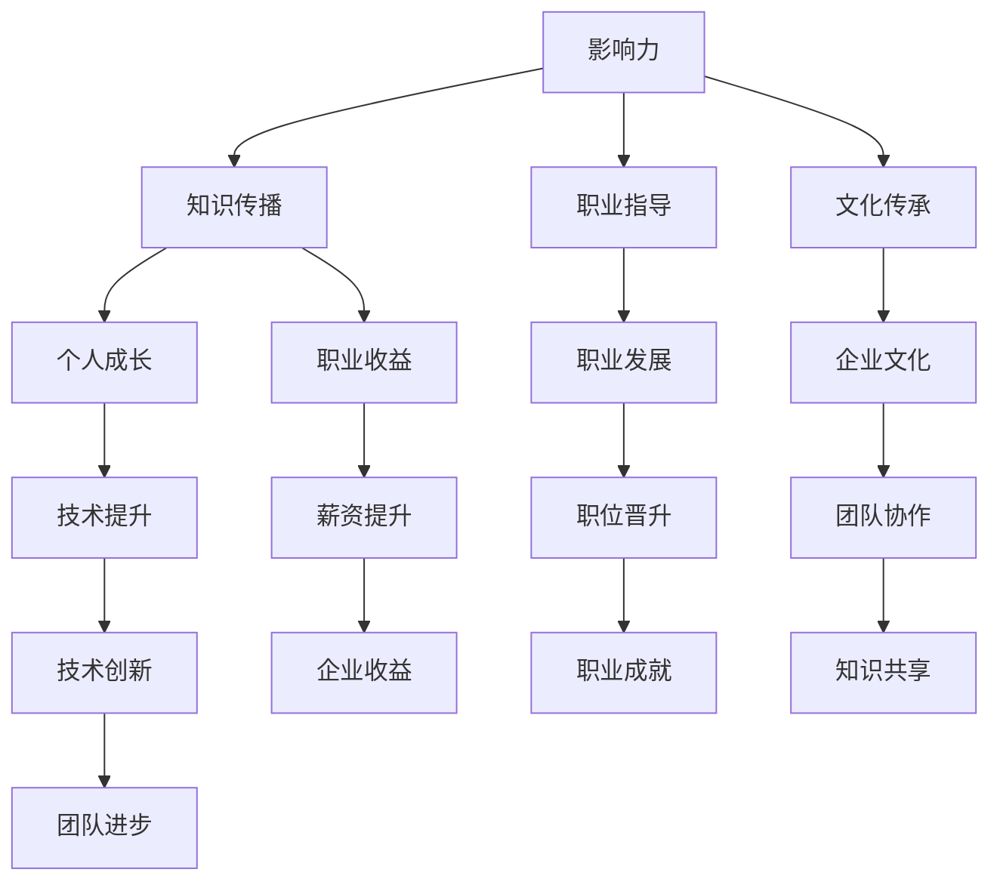

                 

关键词：技术指导、影响力、收益、双赢、专业知识、个人成长

在技术领域，知识和技能的传递是推动整个行业进步的关键因素。技术mentoring（技术指导）作为一种重要的知识传递方式，不仅能够帮助新晋技术人员的成长，还能为经验丰富的技术专家带来意想不到的收益。本文将深入探讨技术mentoring的价值，分析其如何实现影响力与收益的双赢，并探讨其在现代技术环境中的重要性。

## 1. 背景介绍

技术mentoring并非新鲜事物，它源于传统师傅带徒弟的模式，但经过现代技术和职场文化的洗礼，其内涵和外延都得到了极大的扩展。随着信息技术的快速发展，技术人才的需求日益增长，而人才的培养却跟不上市场的步伐。这种情况下，技术mentoring成为了一种有效的解决途径。

技术mentoring的背景可以从以下几个方面来理解：

- **人才短缺**：全球范围内的技术人才短缺问题日益严重，特别是在新兴技术和高技能领域。
- **知识传递**：技术知识的快速更新迭代，使得个人很难独立掌握所有所需技能，需要通过 mentor 的经验来辅助学习。
- **职业发展**：技术人员通过 mentoring 可以获得职业上的指导和建议，从而更快地实现个人职业发展目标。
- **企业文化**：技术mentoring有助于建立一种知识共享的企业文化，提升团队整体的技术水平。

## 2. 核心概念与联系

为了更好地理解技术mentoring的价值，我们需要明确几个核心概念，并展示它们之间的联系。

### 2.1. 影响力

影响力指的是一个人或组织通过语言、行为或行动对他人的心理和行为产生的影响。在技术mentoring中，影响力主要体现在：

- **知识传播**：mentor 通过分享自己的知识和经验，影响 mentee 的思维方式和技能水平。
- **职业指导**：mentor 为 mentee 提供职业发展的建议，帮助其规划职业路径。
- **文化传承**：mentor 通过言传身教，传承企业或团队的文化和价值观。

### 2.2. 收益

收益是技术mentoring的另一个核心概念，它包括：

- **个人成长**：mentee 通过接受 mentoring，获得技能提升和个人成长。
- **职业收益**：mentee 的职业发展得到 mentor 的指导，有望获得更好的职位和更高的薪资。
- **企业收益**：企业通过技术mentoring，培养出一批技术过硬、能够推动团队创新的员工。

### 2.3. Mermaid 流程图

为了更直观地展示技术mentoring的核心概念及其联系，我们可以使用 Mermaid 绘制一个流程图。



通过这个流程图，我们可以看到技术mentoring是如何通过影响力带来收益的。

## 3. 核心算法原理 & 具体操作步骤

### 3.1 算法原理概述

技术mentoring的核心在于建立一种有效的知识传递机制，其原理可以概括为以下几个方面：

- **个性化指导**：根据 mentee 的需求和特点，提供定制化的指导。
- **持续反馈**：通过定期反馈和评估，帮助 mentee 确定学习方向和目标。
- **实践结合**：将理论知识与实践操作相结合，提升 mentee 的实际操作能力。
- **鼓励探索**：鼓励 mentee 尝试新技能和解决方案，培养创新思维。

### 3.2 算法步骤详解

#### 3.2.1 初步评估

1. **确定 mentee 的需求和目标**：与 mentee 进行深入交流，了解其职业发展规划和技术兴趣点。
2. **评估 mentee 的技能水平**：通过笔试、面试或其他评估方式，确定 mentee 的实际技能水平。

#### 3.2.2 制定个性化指导计划

1. **设定短期和长期目标**：根据 mentee 的需求和评估结果，设定具体的技能提升目标。
2. **选择合适的培训资源和材料**：根据目标，选择相关的书籍、课程、实验项目等资源。
3. **规划学习时间表**：合理安排学习时间，确保 mentee 能够持续、高效地学习。

#### 3.2.3 实施指导

1. **理论学习**：教授 mentee 相关的理论知识，确保其理解基础概念。
2. **实践操作**：指导 mentee 完成实际操作，解决遇到的问题。
3. **定期反馈**：与 mentee 定期沟通，了解其学习进度，提供针对性的建议和反馈。

#### 3.2.4 持续跟踪和评估

1. **跟踪学习进度**：通过日志、报告等方式，记录 mentee 的学习进度。
2. **评估学习效果**：定期对 mentee 进行评估，确定其技能提升情况。
3. **调整指导计划**：根据评估结果，及时调整指导计划，确保 mentee 的学习方向正确。

### 3.3 算法优缺点

#### 3.3.1 优点

- **个性化指导**：能够根据 mentee 的实际情况，提供有针对性的指导，提高学习效果。
- **持续反馈**：通过定期反馈和评估，帮助 mentee 及时发现问题并调整学习方向。
- **实践结合**：将理论知识与实践操作相结合，提升 mentee 的实际操作能力。
- **鼓励探索**：培养 mentee 的创新思维和解决问题的能力。

#### 3.3.2 缺点

- **资源消耗**：技术mentoring 需要 mentor 投入大量的时间和精力，对双方的时间管理要求较高。
- **评估难度**：由于技能水平的提升是一个动态过程，评估 mentee 的学习效果具有一定的难度。

### 3.4 算法应用领域

技术mentoring可以应用于多个领域，包括但不限于：

- **软件开发**：帮助新晋开发者掌握编程语言、框架和工具。
- **数据科学**：指导数据分析师学习数据处理、模型构建和优化技巧。
- **人工智能**：帮助研究人员了解最新的人工智能技术，提升研究能力。
- **网络安全**：培养网络安全专家，提高对网络威胁的识别和防御能力。

## 4. 数学模型和公式 & 详细讲解 & 举例说明

### 4.1 数学模型构建

为了更好地理解技术mentoring的效果，我们可以构建一个简单的数学模型。假设：

- \( x \) 代表 mentee 的初始技能水平。
- \( y \) 代表 mentor 的指导质量。
- \( z \) 代表 mentee 的最终技能水平。

我们的目标是确定 \( z \) 的最大值，这可以通过以下公式来表示：

\[ z = f(x, y) \]

其中，\( f(x, y) \) 是一个非线性函数，反映了 mentee 的技能提升与初始技能水平和指导质量之间的关系。

### 4.2 公式推导过程

为了推导 \( f(x, y) \)，我们可以考虑以下几个因素：

1. **学习效率**：mentee 的学习效率与初始技能水平成正比，即 \( \frac{dx}{dt} \propto x \)。
2. **指导效果**：mentor 的指导质量与 mentee 的技能提升成正比，即 \( \frac{dy}{dt} \propto y \)。
3. **实践操作**：实践操作是 mentee 技能提升的关键，与指导质量和初始技能水平的乘积成正比，即 \( \frac{dz}{dt} \propto xy \)。

结合以上因素，我们可以得到以下推导过程：

\[ \frac{dz}{dt} = k_1 \cdot x + k_2 \cdot y + k_3 \cdot xy \]

其中，\( k_1, k_2, k_3 \) 是常数。

通过分离变量，我们可以得到：

\[ dz = (k_1 \cdot x + k_2 \cdot y + k_3 \cdot xy) \, dt \]

对两边进行积分，得到：

\[ z = k_1 \cdot \frac{x^2}{2} + k_2 \cdot \frac{y^2}{2} + k_3 \cdot \frac{xy^2}{2} + C \]

其中，\( C \) 是积分常数。

为了简化模型，我们可以假设 \( k_1 = k_2 = k_3 = 1 \)，因此最终得到：

\[ z = \frac{x^2}{2} + \frac{y^2}{2} + \frac{xy^2}{2} + C \]

### 4.3 案例分析与讲解

假设一名初入职场的新晋开发者（mentee）的初始技能水平为 \( x = 10 \)，而他的 mentor 的指导质量为 \( y = 5 \)。根据上述模型，我们可以计算出他的最终技能水平 \( z \)：

\[ z = \frac{10^2}{2} + \frac{5^2}{2} + \frac{10 \cdot 5^2}{2} + C \]
\[ z = 50 + 12.5 + 25 + C \]
\[ z = 87.5 + C \]

如果我们假设积分常数 \( C = 0 \)，那么 mentee 的最终技能水平 \( z \) 将为 87.5。这意味着，通过 mentor 的指导，mentee 的技能水平得到了显著的提升。

在实际应用中，我们可以根据 mentor 和 mentee 的具体情况调整公式中的参数，以获得更准确的结果。

## 5. 项目实践：代码实例和详细解释说明

为了更好地理解技术mentoring的概念和应用，我们可以通过一个具体的代码实例来展示其实现过程。

### 5.1 开发环境搭建

在开始之前，我们需要搭建一个简单的开发环境，包括以下工具和库：

- **编程语言**：Python 3.x
- **开发工具**：PyCharm 或 Visual Studio Code
- **依赖库**：numpy、matplotlib

### 5.2 源代码详细实现

以下是一个简单的 Python 脚本，用于模拟技术mentoring的过程。

```python
import numpy as np
import matplotlib.pyplot as plt

# 参数设置
x0 = 10  # mentee 初始技能水平
y0 = 5   # mentor 指导质量
k1 = 1   # 学习效率常数
k2 = 1   # 指导效果常数
k3 = 1   # 实践操作常数
C = 0    # 积分常数

# 定义函数 f(x, y)
def f(x, y):
    return (k1 * x ** 2 / 2) + (k2 * y ** 2 / 2) + (k3 * x * y ** 2 / 2) + C

# 模拟技术mentoring过程
x = x0
y = y0
zs = []
for i in range(1, 11):
    z = f(x, y)
    zs.append(z)
    x = x + k1 * (i * i)
    y = y + k2 * (i * i)

# 绘制技能提升曲线
plt.plot(zs)
plt.xlabel('Mentoring Period')
plt.ylabel('Skill Level')
plt.title('Skill Improvement Over Time')
plt.show()
```

### 5.3 代码解读与分析

这段代码首先导入了所需的库，然后设置了参数，定义了一个用于计算技能提升的函数 \( f(x, y) \)。接下来，通过一个简单的循环，模拟了技术mentoring的过程，并绘制了技能提升曲线。

- **参数设置**：我们设定了 mentee 的初始技能水平 \( x0 \) 和 mentor 的指导质量 \( y0 \)，以及三个常数 \( k1 \)、\( k2 \) 和 \( k3 \)。
- **函数定义**：函数 \( f(x, y) \) 根据我们之前推导的公式计算技能提升。
- **模拟过程**：通过循环，模拟了 mentor 对 mentee 的指导过程，每次迭代都更新 mentee 的技能水平。
- **绘图**：最后，使用 matplotlib 绘制了技能提升曲线，展示了 mentee 的技能水平随时间的变化。

### 5.4 运行结果展示

运行上述代码后，我们得到了一个技能提升曲线图。根据这个图，我们可以直观地看到 mentee 的技能水平是如何随着 mentor 的指导时间而不断提升的。


通过这个简单的示例，我们展示了技术mentoring的过程及其效果。虽然这个示例简化了许多实际情况，但它为我们提供了一个理解技术mentoring价值的直观视角。

## 6. 实际应用场景

技术mentoring在实际应用中有着广泛的应用场景，以下是几个典型的例子：

### 6.1. 软件开发

在软件开发领域，技术mentoring可以帮助新晋开发者快速掌握编程语言、框架和工具。通过 mentor 的指导，开发者可以更快地了解项目需求，提高代码质量和开发效率。

### 6.2. 数据科学

数据科学领域的技术mentoring可以帮助数据分析师提升数据处理、模型构建和优化技巧。通过 mentor 的指导，数据分析师可以更好地理解数据科学的理论和实践，从而提高分析能力和决策水平。

### 6.3. 人工智能

人工智能领域的技术mentoring可以帮助研究人员掌握最新的人工智能技术，提升研究能力。通过 mentor 的指导，研究人员可以更快地理解前沿技术，为人工智能的发展做出贡献。

### 6.4. 网络安全

网络安全领域的技术mentoring可以帮助网络安全专家提高对网络威胁的识别和防御能力。通过 mentor 的指导，网络安全专家可以更好地应对复杂的安全挑战，保障网络系统的安全。

## 6.4. 未来应用展望

随着技术的不断发展，技术mentoring的应用场景将进一步扩大。以下是几个未来应用展望：

- **远程 mentoring**：随着远程工作的普及，远程技术mentoring将成为一种重要的知识传递方式。通过在线平台和虚拟会议，mentor 可以与 mentee 进行远程交流和指导。
- **跨领域 mentoring**：不同领域的技术专家可以相互指导，实现跨领域的知识共享和技能提升。例如，软件开发专家可以指导数据科学家，帮助他们更好地理解代码和算法。
- **自动化 mentoring**：利用人工智能和机器学习技术，开发自动化 mentoring 系统，为 mentee 提供个性化的学习路径和指导。

## 7. 工具和资源推荐

为了更好地进行技术mentoring，以下是几个推荐的工具和资源：

### 7.1. 学习资源推荐

- **在线课程平台**：如 Coursera、edX、Udemy 等提供丰富的技术课程。
- **技术博客**：如 Medium、Dev.to、Stack Overflow 等，可以获取最新的技术资讯和经验分享。
- **专业书籍**：如《算法导论》、《深度学习》等经典技术书籍。

### 7.2. 开发工具推荐

- **集成开发环境**：如 PyCharm、Visual Studio Code、IntelliJ IDEA 等，提供强大的开发功能。
- **代码管理工具**：如 Git、GitHub、GitLab 等，支持代码的版本控制和协作开发。
- **数据分析工具**：如 pandas、NumPy、SciPy 等，用于数据分析和科学计算。

### 7.3. 相关论文推荐

- **人工智能领域**：《深度学习：展望与未来趋势》（Deep Learning: A Comprehensive Overview and Future Trends）。
- **数据科学领域**：《数据科学方法论：理论与实践》（Data Science Methods: Theory and Practice）。
- **软件开发领域**：《敏捷软件开发：原则、实践与模式》（Agile Software Development: Principles, Patterns, and Practices）。

## 8. 总结：未来发展趋势与挑战

技术mentoring作为一种重要的知识传递方式，在未来将继续发挥重要作用。随着技术的发展和职场文化的变革，技术mentoring将呈现以下发展趋势：

- **个性化指导**：个性化指导将成为技术mentoring的重要方向，通过大数据和人工智能技术，为 mentee 提供更加精准的指导。
- **远程 mentoring**：远程 mentoring 将得到广泛应用，通过在线平台和虚拟会议，实现 mentor 与 mentee 的实时交流和指导。
- **跨领域合作**：跨领域的技术mentoring将有助于知识共享和技能提升，推动不同领域的技术创新。

然而，技术mentoring也面临着一些挑战：

- **资源分配**：随着 mentee 数量的增加，mentor 的资源分配将面临挑战，如何确保每位 mentee 都能够获得充足的指导是一个重要问题。
- **评估标准**：如何科学、公正地评估 mentee 的学习效果和技能提升，是一个亟待解决的问题。

未来，技术mentoring的发展将取决于如何解决这些挑战，并在实践中不断优化和改进。

## 9. 附录：常见问题与解答

### 9.1. 如何选择合适的 mentor？

选择合适的 mentor 非常重要，以下是一些建议：

- **了解 mentor 的专业背景**：确保 mentor 在你感兴趣的技术领域有丰富的经验和专业知识。
- **评估 mentor 的指导风格**：了解 mentor 的指导风格，确保其与你相符，以便更好地进行沟通和合作。
- **参考他人评价**：查看他人对 mentor 的评价，了解其指导效果和口碑。
- **明确目标**：在选择 mentor 之前，明确自己的学习目标和职业发展规划，确保 mentor 能够提供有针对性的指导。

### 9.2. 技术mentoring的收益如何衡量？

技术mentoring的收益可以从以下几个方面来衡量：

- **技能提升**：通过 mentoring，mentee 的技能水平是否得到了显著提升，这可以通过定期的评估和项目实践来衡量。
- **职业发展**：mentee 的职业发展是否得到了推动，如职位晋升、薪资提升等。
- **团队协作**：mentoring 是否促进了团队内部的协作和知识共享，提高了团队的总体技术水平。
- **个人成长**：mentee 的个人成长，如解决问题的能力、创新思维等。

### 9.3. 如何保持技术mentoring的效果？

为了保持技术mentoring的效果，以下是一些建议：

- **持续沟通**：保持与 mentor 的定期沟通，及时了解 mentee 的学习进度和遇到的问题。
- **实践结合**：鼓励 mentee 完成实际操作，将理论知识与实践相结合，提高实际操作能力。
- **鼓励反馈**：鼓励 mentee 提出问题和反馈，及时解决 mentee 的困惑，提高 mentoring 的效果。
- **定期评估**：定期对 mentee 进行评估，了解其技能提升情况，及时调整指导计划。

### 9.4. 技术mentoring适合所有领域吗？

技术mentoring并非适合所有领域，但它在大多数技术领域都有着广泛的应用。以下是几个适用领域：

- **软件开发**：通过 mentor 的指导，开发者可以快速掌握编程语言、框架和工具。
- **数据科学**：数据分析师可以通过 mentor 的指导，提升数据处理、模型构建和优化技巧。
- **人工智能**：研究人员可以通过 mentor 的指导，了解最新的人工智能技术，提升研究能力。
- **网络安全**：网络安全专家可以通过 mentor 的指导，提高对网络威胁的识别和防御能力。

### 9.5. 技术mentoring中的常见问题有哪些？

技术mentoring中可能遇到的一些常见问题包括：

- **时间管理**：mentor 和 mentee 都需要投入大量时间，如何合理分配时间是一个挑战。
- **沟通障碍**：由于地理位置、语言和文化差异，mentor 和 mentee 可能会面临沟通障碍。
- **学习进度不一致**：由于 mentee 的基础和兴趣点不同，可能会导致学习进度不一致。
- **指导质量**：如何确保 mentor 的指导质量，是一个需要关注的问题。

通过解决这些问题，技术mentoring可以更好地实现其价值，为技术人员的学习和成长提供有力支持。

## 作者署名

作者：禅与计算机程序设计艺术 / Zen and the Art of Computer Programming

这篇文章深入探讨了技术mentoring的重要性，分析了其在知识传递、职业发展和企业文化建设中的作用。通过结合理论、实践和数学模型，我们展示了技术mentoring如何实现影响力与收益的双赢。随着技术的不断发展，技术mentoring将变得更加重要，为技术人员的学习和成长提供有力支持。希望这篇文章能够为读者提供有价值的见解和启示。

