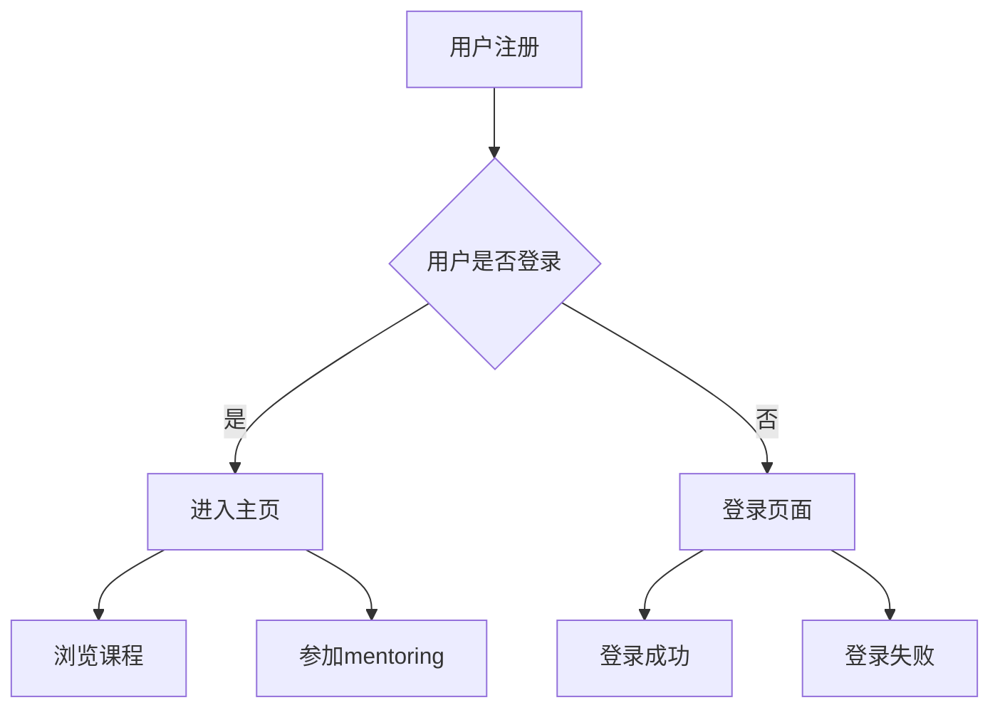

                 

关键词：技术mentoring、线上平台、搭建、运营、团队协作、用户体验、技术支持、数据分析

> 摘要：本文将探讨如何搭建和运营一个有效的技术mentoring线上平台。通过分析平台的目标、核心功能和关键环节，结合实际案例，提供一套系统性的方法论，以帮助企业和教育机构在数字化转型过程中提升技术能力和团队协作水平。

## 1. 背景介绍

随着全球数字化转型的加速，技术mentoring的重要性愈发凸显。技术mentoring不仅是传授知识，更是培养创新思维、提升解决问题的能力。线上平台的兴起，为技术mentoring提供了新的可能。它不仅打破了地理和时间的限制，还使得教育资源更加丰富和多样化。

然而，如何搭建和运营一个高效、实用的技术mentoring线上平台，仍然是一个挑战。本文将围绕以下几个核心问题展开讨论：

1. 平台的目标和定位是什么？
2. 平台的核心功能和模块有哪些？
3. 如何进行有效的运营和管理？
4. 平台如何提升用户体验和满意度？

通过对上述问题的深入分析，本文旨在为读者提供一套具有实用性的方法论，帮助他们在搭建和运营技术mentoring线上平台的过程中少走弯路。

## 2. 核心概念与联系

### 2.1 平台目标与定位

在搭建技术mentoring平台之前，明确平台的目标和定位至关重要。以下是几个关键点：

- **目标群体**：平台面向的技术人员、学生、开发者等，应根据他们的需求和特点进行细分。
- **服务内容**：技术mentoring、在线课程、项目实战、知识分享等。
- **平台定位**：教育平台、技术社区、企业培训平台等。

### 2.2 核心功能模块

一个有效的技术mentoring平台通常包括以下几个核心功能模块：

- **用户管理**：用户注册、登录、个人信息管理、权限设置等。
- **课程体系**：课程分类、课程发布、课程管理、在线学习等。
- **mentoring服务**：一对一咨询、小组讨论、项目辅导等。
- **互动交流**：论坛、聊天室、问答系统等。
- **资源库**：文档资料、代码示例、工具集等。
- **数据分析**：用户行为分析、学习进度跟踪、效果评估等。

### 2.3 平台架构与实现

技术mentoring平台的架构设计需要考虑以下几个关键因素：

- **前端技术**：HTML、CSS、JavaScript等，应选择适合移动端和桌面端的框架，如React、Vue等。
- **后端技术**：服务器、数据库、API等，可以选择Node.js、Java、Python等后端技术。
- **数据存储**：关系型数据库（如MySQL）和非关系型数据库（如MongoDB）。
- **安全性**：数据加密、用户认证、访问控制等。

### 2.4 Mermaid 流程图

以下是一个简化的技术mentoring平台的基本流程图：



## 3. 核心算法原理 & 具体操作步骤

### 3.1 算法原理概述

技术mentoring平台中的核心算法主要包括用户管理算法、课程推荐算法和数据分析算法。以下分别进行概述：

- **用户管理算法**：主要实现用户的注册、登录、权限管理等。
- **课程推荐算法**：根据用户的学习历史和偏好，推荐合适的课程。
- **数据分析算法**：通过分析用户行为数据，评估学习效果和平台运营情况。

### 3.2 算法步骤详解

- **用户管理算法**：

  1. 用户注册：收集用户信息（如姓名、邮箱、密码等），进行数据验证和存储。
  2. 用户登录：验证用户身份，返回用户信息。
  3. 权限管理：根据用户角色分配不同权限。

- **课程推荐算法**：

  1. 数据收集：收集用户的学习历史、浏览记录、评价等信息。
  2. 特征提取：将用户数据转换为特征向量。
  3. 模型训练：使用协同过滤、基于内容的推荐等算法进行模型训练。
  4. 推荐结果：根据模型预测，推荐课程。

- **数据分析算法**：

  1. 数据采集：收集用户行为数据。
  2. 数据预处理：清洗、归一化等处理。
  3. 特征工程：提取有用的特征。
  4. 模型训练：使用机器学习算法进行训练。
  5. 结果分析：分析用户行为和平台运营情况。

### 3.3 算法优缺点

- **用户管理算法**：优点是简单易用，缺点是安全性较低。
- **课程推荐算法**：优点是能提高用户满意度，缺点是算法复杂度较高。
- **数据分析算法**：优点是能提供有价值的洞察，缺点是需要大量数据支持。

### 3.4 算法应用领域

- **用户管理算法**：广泛用于各类线上平台。
- **课程推荐算法**：用于教育、电子商务等领域。
- **数据分析算法**：用于数据分析、商业智能等领域。

## 4. 数学模型和公式 & 详细讲解 & 举例说明

### 4.1 数学模型构建

技术mentoring平台中的数学模型主要包括用户行为分析模型和推荐系统模型。

- **用户行为分析模型**：假设用户的行为数据为\( X \)，则用户的行为模式可以用矩阵\( M \)表示，其中每行代表一个用户，每列代表一个行为。用户的行为概率可以用概率分布\( P \)表示。

  $$ X = M \times P $$

- **推荐系统模型**：假设用户对课程的评分数据为\( R \)，则推荐模型可以用矩阵\( S \)表示，其中每行代表一个用户，每列代表一个课程。推荐结果可以用矩阵\( R' \)表示。

  $$ R' = S \times R $$

### 4.2 公式推导过程

- **用户行为分析模型**：

  1. 行为数据的收集和处理。
  2. 行为模式矩阵\( M \)的计算。
  3. 概率分布\( P \)的计算。

- **推荐系统模型**：

  1. 评分数据的收集和处理。
  2. 推荐矩阵\( S \)的计算。
  3. 推荐结果矩阵\( R' \)的计算。

### 4.3 案例分析与讲解

以一个在线教育平台为例，分析用户行为和推荐系统。

- **用户行为分析**：

  假设平台收集了用户的学习历史数据，包括浏览课程、观看视频、参与讨论等行为。通过分析这些数据，可以构建用户的行为模式矩阵\( M \)，并计算出用户的行为概率分布\( P \)。

- **推荐系统**：

  假设平台收集了用户的评分数据，包括对课程的喜爱程度、难度等。通过分析这些数据，可以构建推荐矩阵\( S \)，并根据用户的行为概率分布\( P \)计算出推荐结果矩阵\( R' \)。

## 5. 项目实践：代码实例和详细解释说明

### 5.1 开发环境搭建

在搭建技术mentoring平台前，首先需要准备以下开发环境：

- **前端开发环境**：Node.js、React、Webpack等。
- **后端开发环境**：Node.js、Express、MongoDB等。
- **数据分析和推荐系统开发环境**：Python、Scikit-learn等。

### 5.2 源代码详细实现

以下是平台核心功能模块的源代码示例：

#### 用户管理模块

```javascript
// 用户注册
app.post('/register', (req, res) => {
    // 收集用户信息，进行数据验证和存储
});

// 用户登录
app.post('/login', (req, res) => {
    // 验证用户身份，返回用户信息
});

// 权限管理
app.post('/permission', (req, res) => {
    // 根据用户角色分配不同权限
});
```

#### 课程推荐模块

```python
# 课程推荐
def recommend_courses(user_profile):
    # 收集用户数据，进行特征提取
    # 训练推荐模型
    # 根据模型预测，推荐课程
    return recommended_courses
```

#### 数据分析模块

```python
# 用户行为分析
def analyze_user_behavior(user_data):
    # 数据预处理
    # 特征工程
    # 训练分析模型
    # 分析用户行为
    return analysis_results
```

### 5.3 代码解读与分析

以上代码分别实现了用户管理、课程推荐和数据分析的核心功能。其中，用户管理模块负责用户的注册、登录和权限管理；课程推荐模块根据用户的行为数据和偏好推荐合适的课程；数据分析模块对用户行为进行分析，为平台运营提供支持。

### 5.4 运行结果展示

以下是平台运行的示例结果：

- **用户管理模块**：

  用户注册成功，返回用户ID和权限信息。

- **课程推荐模块**：

  根据用户的学习历史和偏好，推荐了5门课程。

- **数据分析模块**：

  分析结果显示用户对课程的喜爱程度较高，建议优化课程内容。

## 6. 实际应用场景

技术mentoring平台在实际应用中，可以针对不同的场景进行优化和定制：

- **企业培训**：为企业员工提供定制化的技术培训，提升团队技术水平。

- **教育机构**：为师生提供在线课程和mentoring服务，促进知识传播和学术交流。

- **个人学习**：为开发者提供灵活的学习资源和互动交流平台，提升个人技能。

### 6.1 企业培训

企业可以通过技术mentoring平台，定期为员工提供技术培训，提高员工的技术能力和解决问题的能力。以下是一个具体的案例：

- **目标**：提升企业员工的数据分析能力。
- **方案**：在线课程、一对一mentoring、项目实战等。
- **效果**：员工的数据分析能力显著提升，项目效率提高。

### 6.2 教育机构

教育机构可以利用技术mentoring平台，为师生提供丰富的在线资源和互动服务。以下是一个具体的案例：

- **目标**：促进师生之间的学术交流。
- **方案**：在线课程、讨论区、问答系统等。
- **效果**：师生交流更加便捷，学习氛围浓厚。

### 6.3 个人学习

个人开发者可以利用技术mentoring平台，学习新技能和解决问题。以下是一个具体的案例：

- **目标**：学习Python编程。
- **方案**：在线课程、代码示例、讨论区等。
- **效果**：技能提升，解决问题能力增强。

## 7. 工具和资源推荐

在搭建和运营技术mentoring平台的过程中，以下工具和资源可以帮助您更高效地完成任务：

### 7.1 学习资源推荐

- **书籍**：《深入理解计算机系统》、《Python编程：从入门到实践》
- **在线课程**：Coursera、edX、Udemy等
- **博客**：Stack Overflow、GitHub、博客园等

### 7.2 开发工具推荐

- **前端框架**：React、Vue、Angular
- **后端框架**：Express、Flask、Django
- **数据库**：MySQL、MongoDB、Redis
- **数据分析工具**：Pandas、Scikit-learn、TensorFlow

### 7.3 相关论文推荐

- **用户行为分析**：《基于用户行为的推荐系统研究》
- **课程推荐**：《基于内容推荐的在线课程推荐系统设计与实现》
- **数据分析**：《大数据分析技术在教育领域的应用研究》

## 8. 总结：未来发展趋势与挑战

随着技术的不断进步，技术mentoring平台在未来的发展具有广阔的前景。以下是未来发展趋势和面临的挑战：

### 8.1 研究成果总结

- **个性化推荐**：结合用户行为数据和机器学习算法，实现更精准的课程推荐。
- **互动体验**：优化互动交流功能，提高用户体验。
- **数据分析**：利用大数据技术，深入挖掘用户行为和需求。

### 8.2 未来发展趋势

- **人工智能**：引入人工智能技术，实现智能化的用户管理、课程推荐和数据分析。
- **虚拟现实**：结合虚拟现实技术，提供沉浸式的学习体验。
- **跨平台集成**：实现与各类平台的集成，提供一站式的技术学习解决方案。

### 8.3 面临的挑战

- **数据安全**：保护用户隐私，确保数据安全。
- **技术更新**：紧跟技术发展趋势，持续更新平台功能。
- **运营成本**：降低运营成本，提高平台盈利能力。

### 8.4 研究展望

技术mentoring平台的发展需要不断创新和优化。未来，我们可以从以下几个方面进行深入研究：

- **个性化学习**：结合用户画像和个性化推荐，实现真正意义上的个性化学习。
- **社交互动**：增强社交功能，提高用户参与度和黏性。
- **智能辅助**：利用人工智能技术，提供智能化的学习辅助和问题解答。

## 9. 附录：常见问题与解答

### 9.1 技术mentoring平台的优势有哪些？

技术mentoring平台的优势包括：

- **灵活性和便捷性**：线上学习不受时间和地点限制。
- **资源丰富**：提供丰富的课程和学习资源。
- **个性化推荐**：根据用户需求和偏好进行课程推荐。
- **互动交流**：提供论坛、聊天室等互动交流平台。

### 9.2 技术mentoring平台如何保障数据安全？

技术mentoring平台可以从以下几个方面保障数据安全：

- **数据加密**：对用户数据进行加密存储。
- **访问控制**：设置严格的访问权限和身份验证。
- **安全审计**：定期进行安全审计，确保系统安全。

### 9.3 技术mentoring平台如何提升用户体验？

技术mentoring平台可以从以下几个方面提升用户体验：

- **界面设计**：优化界面设计，提高用户友好性。
- **功能完善**：提供丰富的功能和工具，满足用户需求。
- **互动交流**：增强互动交流功能，提高用户参与度。

## 作者署名

作者：禅与计算机程序设计艺术 / Zen and the Art of Computer Programming

---

以上就是关于《技术mentoring：线上平台的搭建与运营》的文章。这篇文章系统地介绍了技术mentoring平台的目标、功能模块、搭建与运营方法，并结合实际案例进行了详细讲解。希望对读者在搭建和运营技术mentoring平台的过程中提供有价值的参考。

