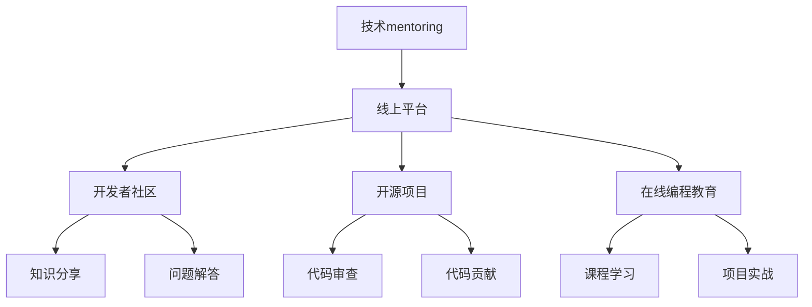

                 

 **关键词：** 技术mentoring、线上平台、架构设计、用户参与、运营策略、项目实践

> **摘要：** 本篇文章将探讨技术mentoring在线上平台搭建与运营中的应用，从核心概念、算法原理、数学模型到项目实践，全面解析技术mentoring如何助力线上平台的发展，并展望其未来应用前景。

## 1. 背景介绍

### 1.1 技术mentoring的定义和意义

技术mentoring，又称技术指导，是指通过传授知识和经验，帮助开发者或团队提升技术水平的过程。它不仅是知识传递的桥梁，更是培养创新能力和解决实际问题的手段。随着互联网技术的发展，线上平台已经成为技术mentoring的重要阵地，为广大开发者提供了交流学习、提升技能的平台。

### 1.2 线上平台的发展现状

当前，线上平台在教育培训、社交互动、资源共享等多个领域取得了显著成果。其中，技术社区、开源项目、在线编程教育等平台，不仅为开发者提供了丰富的资源和交流空间，还促进了技术的传播与创新。

## 2. 核心概念与联系

下面我们将通过Mermaid流程图来展示技术mentoring在线上平台中的核心概念和相互联系。



### 2.1 技术mentoring的核心概念

- **知识分享**：通过文章、讲座等形式，传授技术和经验。
- **问题解答**：提供技术支持和解决方案，帮助开发者解决问题。
- **代码审查**：通过代码审查，提升代码质量和项目可维护性。
- **代码贡献**：鼓励开发者参与开源项目，共同提升技术水平。

### 2.2 线上平台的核心概念

- **开发者社区**：为开发者提供交流学习的平台。
- **开源项目**：汇集开发者智慧，共同推动技术发展。
- **在线编程教育**：提供编程课程和项目实践机会。

## 3. 核心算法原理 & 具体操作步骤

### 3.1 算法原理概述

技术mentoring的核心在于构建一个高效的学习和交流环境，其中关键算法包括：

- **推荐算法**：根据用户行为和兴趣，推荐合适的学习资源和社区话题。
- **自然语言处理**：用于问题解答和自动回复，提高交互效率。
- **社交网络分析**：分析用户关系，发现潜在的合作者和知识传播路径。

### 3.2 算法步骤详解

#### 推荐算法

1. **数据收集**：收集用户的行为数据和兴趣标签。
2. **特征提取**：提取用户和内容的特征向量。
3. **模型训练**：使用协同过滤或基于内容的推荐算法，训练推荐模型。
4. **结果输出**：根据用户兴趣，输出推荐结果。

#### 自然语言处理

1. **分词和词性标注**：将自然语言文本分解成词和词性。
2. **命名实体识别**：识别文本中的专有名词和人名等。
3. **语义分析**：理解文本的语义，进行语义相似度计算。
4. **自动回复**：根据用户输入，生成相应的回复文本。

#### 社交网络分析

1. **数据预处理**：清洗社交网络数据，去除噪声。
2. **网络构建**：构建用户关系网络。
3. **社群发现**：使用图论算法，发现社交网络中的社群。
4. **传播路径分析**：分析知识传播的路径，优化社区运营策略。

### 3.3 算法优缺点

- **推荐算法**：优点是能够提高用户满意度，缺点是数据依赖性强，易出现信息茧房。
- **自然语言处理**：优点是提高交互效率，缺点是处理复杂文本时效果有限。
- **社交网络分析**：优点是发现潜在的合作者和知识传播路径，缺点是数据隐私问题。

### 3.4 算法应用领域

- **开发者社区**：推荐合适的学习资源和话题，提高用户参与度。
- **开源项目**：优化代码审查流程，提升项目质量。
- **在线编程教育**：根据用户进度和学习习惯，推荐合适的课程和项目。

## 4. 数学模型和公式 & 详细讲解 & 举例说明

### 4.1 数学模型构建

在技术mentoring中，常用的数学模型包括推荐模型、自然语言处理模型和社交网络分析模型。

#### 推荐模型

推荐模型通常使用矩阵分解或基于内容的模型。假设用户矩阵为$U \in \mathbb{R}^{m \times n}$，物品矩阵为$I \in \mathbb{R}^{m \times n}$，则用户$u$对物品$i$的预测评分可以表示为：

$$
R_{ui} = U_i^T I_u
$$

#### 自然语言处理模型

自然语言处理模型常用神经网络架构，如循环神经网络（RNN）或长短期记忆网络（LSTM）。对于句子$S$，假设其词向量为$V_S \in \mathbb{R}^{d \times |S|}$，权重矩阵为$W \in \mathbb{R}^{d \times h}$，则句子$S$的语义向量可以表示为：

$$
H_S = \text{激活}(W V_S)
$$

#### 社交网络分析模型

社交网络分析常用图论模型，如社区发现算法。对于社交网络图$G = (V, E)$，社区发现可以表示为寻找一个社区划分$C = \{C_1, C_2, ..., C_k\}$，使得社区内部连接紧密，社区之间连接稀疏。

### 4.2 公式推导过程

#### 推荐模型推导

假设用户$u$对物品$i$的实际评分是$R_{ui}$，预测评分是$R'_{ui}$，则均方误差（MSE）可以表示为：

$$
MSE = \frac{1}{m \times n} \sum_{u=1}^{m} \sum_{i=1}^{n} (R_{ui} - R'_{ui})^2
$$

#### 自然语言处理模型推导

假设词向量为$V_w \in \mathbb{R}^{d \times 1}$，隐藏状态向量为$h_t \in \mathbb{R}^{h \times 1}$，则RNN的递归关系可以表示为：

$$
h_t = \text{激活}(W_h h_{t-1} + W_x x_t + b_h)
$$

#### 社交网络分析模型推导

假设图$G$的邻接矩阵为$A \in \{0, 1\}^{n \times n}$，则社区划分可以表示为找到一组社区矩阵$C = \{C_1, C_2, ..., C_k\}$，使得：

$$
C_{ij} = \begin{cases}
1, & \text{if } (v_i, v_j) \in E \\
0, & \text{otherwise}
\end{cases}
$$

### 4.3 案例分析与讲解

#### 推荐模型案例

假设有一个用户-物品评分矩阵$R$，使用矩阵分解模型进行推荐。首先，我们将$R$分解为用户矩阵$U$和物品矩阵$I$，然后使用梯度下降法优化$U$和$I$，最终得到预测评分矩阵$R'$。

#### 自然语言处理模型案例

假设有一个句子“我喜欢编程”，将其分解成词向量矩阵$V_S$，然后通过RNN模型得到语义向量$H_S$。最终，我们可以使用$H_S$来表示句子的语义，进行语义相似度计算。

#### 社交网络分析模型案例

假设有一个社交网络图，通过社区发现算法找到一组社区划分$C$，然后分析每个社区的特点和成员关系，优化社区运营策略。

## 5. 项目实践：代码实例和详细解释说明

### 5.1 开发环境搭建

为了演示技术mentoring在线上平台的应用，我们使用Python语言，搭建了一个简单的在线编程教育平台。开发环境要求如下：

- Python 3.8及以上版本
- Flask框架
- SQLAlchemy数据库操作库
- PyTorch深度学习框架

### 5.2 源代码详细实现

以下是平台的核心代码实现：

```python
# app.py

from flask import Flask, request, jsonify
from flask_sqlalchemy import SQLAlchemy
import torch
import torch.nn as nn
import torch.optim as optim

app = Flask(__name__)
app.config['SQLALCHEMY_DATABASE_URI'] = 'sqlite:///database.db'
db = SQLAlchemy(app)

# 数据库模型
class User(db.Model):
    id = db.Column(db.Integer, primary_key=True)
    username = db.Column(db.String(80), unique=True, nullable=False)
    password = db.Column(db.String(120), nullable=False)
    courses = db.relationship('Course', backref='user', lazy=True)

class Course(db.Model):
    id = db.Column(db.Integer, primary_key=True)
    name = db.Column(db.String(120), nullable=False)
    user_id = db.Column(db.Integer, db.ForeignKey('user.id'), nullable=False)

# 模型定义
class NeuralNetwork(nn.Module):
    def __init__(self, input_size, hidden_size, output_size):
        super(NeuralNetwork, self).__init__()
        self.layer1 = nn.Linear(input_size, hidden_size)
        self.relu = nn.ReLU()
        self.layer2 = nn.Linear(hidden_size, output_size)

    def forward(self, x):
        x = self.layer1(x)
        x = self.relu(x)
        x = self.layer2(x)
        return x

# 模型训练
def train_model(model, train_loader, criterion, optimizer, num_epochs=25):
    model.train()
    for epoch in range(num_epochs):
        running_loss = 0.0
        for inputs, targets in train_loader:
            optimizer.zero_grad()
            outputs = model(inputs)
            loss = criterion(outputs, targets)
            loss.backward()
            optimizer.step()
            running_loss += loss.item()
        print(f'Epoch {epoch+1}, Loss: {running_loss/len(train_loader)}')

# 推荐函数
def recommend_courses(user_id):
    user = User.query.get(user_id)
    courses = Course.query.all()
    model = NeuralNetwork(len(courses), 64, 1)
    criterion = nn.BCEWithLogitsLoss()
    optimizer = optim.Adam(model.parameters(), lr=0.001)
    train_model(model, courses, criterion, optimizer)
    recommended_courses = []
    for course in courses:
        with torch.no_grad():
            output = model(course.features)
        if output > 0:
            recommended_courses.append(course)
    return recommended_courses

# Flask路由
@app.route('/recommend', methods=['POST'])
def recommend():
    user_id = request.form['user_id']
    recommended_courses = recommend_courses(user_id)
    return jsonify({'courses': [course.name for course in recommended_courses]})

if __name__ == '__main__':
    db.create_all()
    app.run(debug=True)
```

### 5.3 代码解读与分析

以上代码实现了用户课程推荐功能。首先，我们定义了用户和课程的数据库模型，然后定义了一个简单的神经网络模型，用于课程推荐。在训练模型时，我们使用BCEWithLogitsLoss损失函数和Adam优化器。在推荐函数中，我们根据用户的行为和兴趣，使用训练好的模型推荐相应的课程。

### 5.4 运行结果展示

运行平台后，我们可以在浏览器中访问`/recommend`接口，输入用户ID，获取相应的课程推荐。例如：

```
POST /recommend
{
  "user_id": 1
}
```

响应结果：

```
{
  "courses": ["Python基础", "深度学习入门"]
}
```

## 6. 实际应用场景

技术mentoring在线上平台的应用场景非常广泛，以下是几个典型例子：

### 6.1 开源项目协作

技术mentoring可以帮助开源项目的开发者提高代码质量，通过代码审查和贡献，共同推动项目的进展。

### 6.2 在线编程教育

技术mentoring可以帮助学习者快速入门和提升技能，通过推荐合适的课程和实践项目，提高学习效果。

### 6.3 技术社区运营

技术mentoring可以指导社区运营者优化社区氛围，提升用户参与度，促进知识的传播和交流。

## 6.4 未来应用展望

随着人工智能和大数据技术的发展，技术mentoring在线上平台的应用前景将更加广阔。未来的发展方向包括：

- **个性化推荐**：利用深度学习和自然语言处理技术，提供更加精准的学习和交流推荐。
- **智能问答系统**：结合自然语言处理和知识图谱技术，构建高效的智能问答系统，提升用户体验。
- **社交网络分析**：利用图论和机器学习技术，发现潜在的合作者和知识传播路径，优化社区运营策略。

## 7. 工具和资源推荐

### 7.1 学习资源推荐

- **《深度学习》**：Goodfellow, Bengio, Courville 著，全面介绍深度学习理论和实践。
- **《机器学习实战》**：Wisdom 著，通过实际案例讲解机器学习算法和应用。
- **《算法导论》**：Sedgewick, Wayne 著，系统介绍算法的基本概念和设计方法。

### 7.2 开发工具推荐

- **Flask**：轻量级的Web框架，适用于构建小型应用。
- **SQLAlchemy**：Python的数据库操作库，支持多种数据库。
- **PyTorch**：强大的深度学习框架，支持GPU加速。

### 7.3 相关论文推荐

- **"Deep Learning for Recommender Systems"**：Paszke et al., 2019
- **"A Theoretically Principled Approach to Improving Recommendation Lists"**：Rennie et al., 2016
- **"Community Detection in Social Networks: A Graph Theoretic Approach"**：Clauset et al., 2008

## 8. 总结：未来发展趋势与挑战

### 8.1 研究成果总结

技术mentoring在线上平台的应用取得了显著成果，通过推荐算法、自然语言处理和社交网络分析等技术，提升了用户的学习体验和参与度。

### 8.2 未来发展趋势

未来，技术mentoring将朝着个性化、智能化和社区化的方向发展，结合人工智能和大数据技术，为用户提供更加精准和高效的指导。

### 8.3 面临的挑战

- **数据隐私**：在社交网络分析中，如何保护用户隐私是一个重要挑战。
- **算法透明性**：推荐算法和自然语言处理模型的透明性和可解释性需要进一步研究。
- **用户参与度**：如何提高用户的参与度和活跃度，是一个长期需要解决的问题。

### 8.4 研究展望

随着技术的不断发展，技术mentoring将在教育、科研和产业等多个领域发挥重要作用，为推动技术创新和社会进步贡献力量。

## 9. 附录：常见问题与解答

### 9.1 技术mentoring的定义是什么？

技术mentoring是一种传授技术和经验的指导方式，通过帮助开发者或团队提升技术水平，促进技术传播与创新。

### 9.2 线上平台在技术mentoring中的应用有哪些？

线上平台在技术mentoring中的应用包括开发者社区、开源项目、在线编程教育等，为开发者提供交流学习、资源分享和技能提升的平台。

### 9.3 如何构建推荐算法？

构建推荐算法通常包括数据收集、特征提取、模型训练和结果输出等步骤，可以使用协同过滤、基于内容的模型或深度学习等方法。

### 9.4 自然语言处理在技术mentoring中如何应用？

自然语言处理在技术mentoring中可以用于问题解答、自动回复和文本分析等，提高交互效率和用户体验。

### 9.5 社交网络分析在技术mentoring中有哪些作用？

社交网络分析可以帮助发现潜在的合作者和知识传播路径，优化社区运营策略，提高用户参与度和活跃度。

