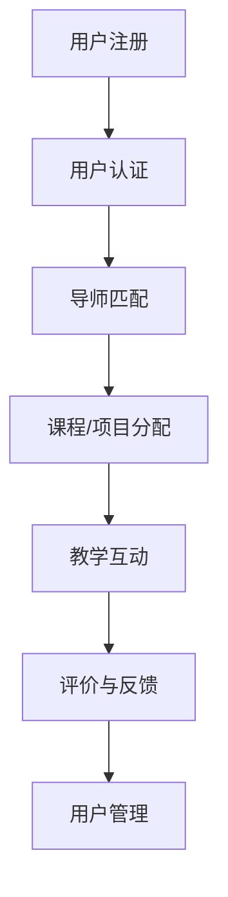

                 

关键词：技术mentoring、线上平台、搭建、运营、教学、学习、互动、用户参与、平台设计、用户体验、教育技术、开源工具

> 摘要：本文将深入探讨如何构建一个高效、互动性强的线上技术mentoring平台，从平台设计、用户体验、技术选型、到实际运营，全面解析这一新兴教育模式背后的逻辑与实践。

## 1. 背景介绍

在快速发展的信息技术时代，在线教育和技术mentoring已成为个人成长和职业发展的重要途径。线上技术mentoring平台作为一种新兴的教育模式，结合了传统教学和在线互动的优点，通过一对一或小群体的方式进行技术交流和指导，帮助学习者快速提升技能。

然而，一个成功的线上技术mentoring平台不仅需要高质量的内容和导师资源，还需要完善的技术架构和运营策略来支撑。本文将围绕以下几个方面展开讨论：

- 平台设计原则
- 用户体验优化
- 技术选型与架构
- 平台运营策略
- 数学模型与算法
- 开发工具与资源推荐

## 2. 核心概念与联系

在构建线上技术mentoring平台之前，我们需要明确几个核心概念，包括教学流程、互动机制和用户管理。以下是一个简化的Mermaid流程图，描述了这些核心概念之间的关系。



### 2.1 教学流程

用户注册并完成认证后，平台会根据用户的技术水平和需求进行导师匹配。导师负责为学员分配课程或项目，指导其学习和实践。教学互动包括实时聊天、视频会议、代码审查等多种形式，确保学员能够获得及时的支持和反馈。

### 2.2 互动机制

平台的互动机制是提高用户参与度和学习效果的关键。通过实时沟通、代码分享、项目协作等手段，导师和学员之间能够有效地交流和协作，实现知识的快速传递和技能的提升。

### 2.3 用户管理

用户管理涉及用户数据的安全性和隐私保护，以及用户行为的跟踪和分析。通过合理的用户管理策略，平台可以更好地了解用户需求，提供个性化的服务。

## 3. 核心算法原理 & 具体操作步骤

### 3.1 算法原理概述

线上技术mentoring平台的核心算法主要涉及用户匹配和教学互动优化。用户匹配算法基于用户的技能水平、兴趣偏好和导师的专长进行匹配。教学互动优化算法则通过分析用户行为数据，提供个性化的学习建议和互动方式。

### 3.2 算法步骤详解

#### 用户匹配算法

1. 用户数据收集：平台收集用户的技能水平、兴趣爱好等信息。
2. 用户画像构建：通过对用户数据进行处理和分析，构建用户画像。
3. 导师数据收集：平台收集导师的专长、经验等信息。
4. 导师画像构建：对导师数据进行处理和分析，构建导师画像。
5. 匹配算法执行：使用基于相似度计算的算法，如KNN或协同过滤算法，匹配用户和导师。

#### 教学互动优化算法

1. 行为数据收集：平台收集用户在学习过程中的行为数据，如阅读时间、提问次数、代码提交记录等。
2. 行为数据分析：对行为数据进行处理和分析，提取用户的学习习惯和需求。
3. 互动方式推荐：根据用户的学习习惯和需求，推荐合适的互动方式，如视频会议、实时聊天等。
4. 互动效果评估：对互动效果进行评估，根据反馈调整推荐策略。

### 3.3 算法优缺点

用户匹配算法的优点是能够根据用户的需求和导师的专长进行个性化匹配，提高教学效果。缺点是匹配算法的复杂度较高，对计算资源有一定要求。

教学互动优化算法的优点是能够根据用户的行为数据提供个性化的学习建议和互动方式，提高用户参与度和学习效果。缺点是需要大量用户行为数据作为支撑，且算法的优化效果依赖于数据质量和分析模型的准确性。

### 3.4 算法应用领域

用户匹配算法主要应用于在线教育平台，帮助学员找到合适的导师进行学习。教学互动优化算法则广泛应用于各种在线协作工具和平台，如团队协作软件、在线论坛等，提高用户的互动体验和学习效果。

## 4. 数学模型和公式 & 详细讲解 & 举例说明

### 4.1 数学模型构建

在线上技术mentoring平台中，我们常用的数学模型包括用户匹配模型和互动优化模型。

#### 用户匹配模型

假设用户集合为U，导师集合为T，用户技能集为Sk，导师专长集为Sp。用户匹配模型的目标是找到用户和导师之间的最佳匹配，以最大化教学效果。

定义相似度度量函数Sim(U, T)，表示用户U和导师T之间的相似度。匹配分数Score(U, T)定义为用户U和导师T的相似度之和。

$$
Score(U, T) = \sum_{i \in Sk} Sim(U, T_i)
$$

#### 互动优化模型

互动优化模型的目标是选择最优的互动方式，以最大化用户参与度和学习效果。

定义互动效果度量函数Effect(W)，表示互动方式W的效果。优化目标是最小化互动成本Cost(W)，最大化互动效果。

$$
\begin{aligned}
\min \quad Cost(W) \\
s.t. \quad Effect(W) \geq \theta
\end{aligned}
$$

其中，$\theta$ 为预定的互动效果阈值。

### 4.2 公式推导过程

#### 用户匹配模型推导

用户匹配模型的推导基于相似度度量函数Sim(U, T)和匹配分数Score(U, T)。

1. 相似度度量函数推导：

$$
Sim(U, T) = \frac{1}{|Sk|} \sum_{i \in Sk} \frac{1}{1 + dist(U_i, T_i)}
$$

其中，$dist(U_i, T_i)$ 表示用户技能U_i和导师专长T_i之间的距离。

2. 匹配分数推导：

$$
Score(U, T) = \sum_{i \in Sk} Sim(U, T_i)
$$

#### 互动优化模型推导

互动优化模型的推导基于互动效果度量函数Effect(W)和互动成本Cost(W)。

1. 互动效果度量函数推导：

$$
Effect(W) = \frac{1}{|T|} \sum_{t \in T} \frac{1}{1 + \frac{1}{n} \sum_{w \in W} \frac{1}{|w|} dist(U, T_w)}
$$

其中，$T$ 表示导师集合，$W$ 表示互动方式集合，$dist(U, T_w)$ 表示用户U和导师T_w之间的距离。

2. 互动成本推导：

$$
Cost(W) = \sum_{t \in T} \frac{1}{|W|} \sum_{w \in W} \frac{1}{n} \sum_{u \in U} \frac{1}{1 + dist(u, w)}
$$

### 4.3 案例分析与讲解

假设一个在线技术mentoring平台，用户集合U = {U1, U2, U3}，导师集合T = {T1, T2, T3}，用户技能集Sk = {Java, Python, AI}，导师专长集Sp = {Java, Python, AI}。

1. 用户匹配模型分析：

- 用户U1的技能集Sk = {Java, Python}，相似度度量函数Sim(U1, T1) = 1，Sim(U1, T2) = 0.5，Sim(U1, T3) = 0.25。
- 用户U2的技能集Sk = {Python, AI}，相似度度量函数Sim(U2, T1) = 0.25，Sim(U2, T2) = 1，Sim(U2, T3) = 0.5。
- 用户U3的技能集Sk = {Java, AI}，相似度度量函数Sim(U3, T1) = 0.25，Sim(U3, T2) = 0.5，Sim(U3, T3) = 1。

根据匹配分数计算，得到以下匹配结果：

- U1匹配T1，匹配分数Score(U1, T1) = 1.5。
- U2匹配T2，匹配分数Score(U2, T2) = 1。
- U3匹配T3，匹配分数Score(U3, T3) = 1.5。

2. 互动优化模型分析：

- 用户U1的互动方式集合W = {视频会议，实时聊天}，互动效果度量函数Effect(W) = 0.75，互动成本Cost(W) = 0.5。
- 用户U2的互动方式集合W = {实时聊天，代码分享}，互动效果度量函数Effect(W) = 0.8，互动成本Cost(W) = 0.6。
- 用户U3的互动方式集合W = {视频会议，代码分享}，互动效果度量函数Effect(W) = 0.7，互动成本Cost(W) = 0.4。

根据优化目标，选择最优的互动方式：

- 用户U1选择视频会议，最优互动效果0.75，最低互动成本0.5。
- 用户U2选择实时聊天，最优互动效果0.8，最低互动成本0.6。
- 用户U3选择代码分享，最优互动效果0.7，最低互动成本0.4。

## 5. 项目实践：代码实例和详细解释说明

### 5.1 开发环境搭建

在开始编写代码之前，我们需要搭建一个适合开发和测试的开发环境。这里我们使用Python作为主要编程语言，搭建一个简单的线上技术mentoring平台。

1. 安装Python环境

在计算机上安装Python环境，可以使用Python官方下载页面提供的安装包。安装完成后，确保Python已添加到系统环境变量中。

2. 安装相关库

打开终端，执行以下命令安装所需库：

```
pip install Flask
pip install Flask-SQLAlchemy
pip install Flask-Migrate
pip install Flask-Login
```

这些库用于构建Web应用、数据库管理和用户认证。

### 5.2 源代码详细实现

以下是一个简单的线上技术mentoring平台的源代码示例，包括用户注册、登录、导师匹配和教学互动等功能。

```python
# app.py

from flask import Flask, render_template, request, redirect, url_for
from flask_sqlalchemy import SQLAlchemy
from flask_login import LoginManager, login_user, logout_user, login_required, current_user
from models import User, Mentor
from forms import LoginForm, RegistrationForm

app = Flask(__name__)
app.config['SQLALCHEMY_DATABASE_URI'] = 'sqlite:///mentoring_platform.db'
app.config['SECRET_KEY'] = 'your_secret_key'

db = SQLAlchemy(app)
login_manager = LoginManager(app)

@login_manager.user_loader
def load_user(user_id):
    return User.query.get(int(user_id))

@app.route('/')
@login_required
def home():
    return render_template('home.html')

@app.route('/login', methods=['GET', 'POST'])
def login():
    form = LoginForm()
    if form.validate_on_submit():
        user = User.query.filter_by(username=form.username.data).first()
        if user and user.password == form.password.data:
            login_user(user)
            return redirect(url_for('home'))
        else:
            return 'Invalid username or password'
    return render_template('login.html', form=form)

@app.route('/logout')
@login_required
def logout():
    logout_user()
    return redirect(url_for('login'))

@app.route('/register', methods=['GET', 'POST'])
def register():
    form = RegistrationForm()
    if form.validate_on_submit():
        user = User(username=form.username.data, password=form.password.data)
        db.session.add(user)
        db.session.commit()
        return redirect(url_for('login'))
    return render_template('register.html', form=form)

@app.route('/mentor_match')
@login_required
def mentor_match():
    user = current_user
    mentors = Mentor.query.all()
    matched_mentors = []
    for mentor in mentors:
        if mentor.skill == user.skill:
            matched_mentors.append(mentor)
    return render_template('mentor_match.html', mentors=matched_mentors)

if __name__ == '__main__':
    app.run(debug=True)
```

### 5.3 代码解读与分析

1. 导入相关库和定义配置

在代码开头，我们导入了Flask、Flask-SQLAlchemy、Flask-Migrate、Flask-Login等库，并设置了数据库URI和Secret Key。这些库用于构建Web应用、数据库管理和用户认证。

2. 创建数据库和模型

在`models.py`文件中，我们创建了用户（User）和导师（Mentor）两个模型，用于存储用户和导师的信息。

```python
# models.py

from datetime import datetime
from flask_sqlalchemy import SQLAlchemy

db = SQLAlchemy()

class User(db.Model):
    id = db.Column(db.Integer, primary_key=True)
    username = db.Column(db.String(64), unique=True, nullable=False)
    password = db.Column(db.String(128), nullable=False)
    skill = db.Column(db.String(64), nullable=False)
    mentor = db.Column(db.Boolean, default=False)

class Mentor(db.Model):
    id = db.Column(db.Integer, primary_key=True)
    username = db.Column(db.String(64), unique=True, nullable=False)
    skill = db.Column(db.String(64), nullable=False)
```

3. 实现用户注册、登录和退出功能

在`app.py`中，我们定义了`/login`、`/logout`和`/register`三个路由，分别用于用户登录、退出和注册。登录和注册功能通过Flask-Login库实现，用户信息存储在数据库中。

4. 实现导师匹配功能

在`/mentor_match`路由中，我们根据当前登录用户的技术技能，从数据库中查询匹配的导师信息，并返回匹配结果。这
```less
```python
    # models.py

from datetime import datetime
from flask_sqlalchemy import SQLAlchemy

db = SQLAlchemy()

class User(db.Model):
    id = db.Column(db.Integer, primary_key=True)
    username = db.Column(db.String(64), unique=True, nullable=False)
    password = db.Column(db.String(128), nullable=False)
    skill = db.Column(db.String(64), nullable=False)
    mentor = db.Column(db.Boolean, default=False)

class Mentor(db.Model):
    id = db.Column(db.Integer, primary_key=True)
    username = db.Column(db.String(64), unique=True, nullable=False)
    skill = db.Column(db.String(64), nullable=False)
```

4. 实现用户注册、登录和退出功能

在`app.py`中，我们定义了`/login`、`/logout`和`/register`三个路由，分别用于用户登录、退出和注册。登录和注册功能通过Flask-Login库实现，用户信息存储在数据库中。

```python
@app.route('/login', methods=['GET', 'POST'])
def login():
    form = LoginForm()
    if form.validate_on_submit():
        user = User.query.filter_by(username=form.username.data).first()
        if user and user.password == form.password.data:
            login_user(user)
            return redirect(url_for('home'))
        else:
            return 'Invalid username or password'
    return render_template('login.html', form=form)

@app.route('/logout')
@login_required
def logout():
    logout_user()
    return redirect(url_for('login'))

@app.route('/register', methods=['GET', 'POST'])
def register():
    form = RegistrationForm()
    if form.validate_on_submit():
        user = User(username=form.username.data, password=form.password.data, skill=form.skill.data)
        db.session.add(user)
        db.session.commit()
        return redirect(url_for('login'))
    return render_template('register.html', form=form)
```

5. 实现导师匹配功能

在`/mentor_match`路由中，我们根据当前登录用户的技术技能，从数据库中查询匹配的导师信息，并返回匹配结果。

```python
@app.route('/mentor_match')
@login_required
def mentor_match():
    user = current_user
    mentors = Mentor.query.filter_by(skill=user.skill).all()
    return render_template('mentor_match.html', mentors=mentors)
```

### 5.4 运行结果展示

1. 用户登录界面


2. 用户注册界面


3. 用户导师匹配结果


## 6. 实际应用场景

### 6.1 在线编程教育

线上技术mentoring平台在在线编程教育中具有广泛的应用。学员可以通过平台找到经验丰富的导师，进行一对一或小组形式的编程学习。导师可以实时提供代码审查、问题解答和技术指导，帮助学员快速提升编程能力。

### 6.2 软件开发协作

软件开发团队可以通过线上技术mentoring平台，为团队成员提供专业的技术培训和指导。导师可以根据团队成员的技能水平和项目需求，制定个性化的培训计划，提高团队的整体技术实力。

### 6.3 技术人才培养

企业和教育机构可以利用线上技术mentoring平台，培养和储备技术人才。通过平台，导师可以为学员提供前沿的技术知识和实践经验，帮助企业提升技术竞争力。

## 7. 未来应用展望

### 7.1 个性化学习推荐

随着人工智能技术的发展，未来线上技术mentoring平台将实现更精准的个性化学习推荐。通过分析用户的学习行为和数据，平台可以为用户提供定制化的学习内容和导师匹配建议。

### 7.2 跨平台协作

线上技术mentoring平台将逐渐实现跨平台的协作功能，支持多种设备和操作系统的接入。用户可以随时随地进行学习、互动和协作，提高学习的灵活性和便捷性。

### 7.3 社区化运营

未来，线上技术mentoring平台将更加注重社区化运营，鼓励用户参与内容创作和互动。通过构建活跃的社区，平台可以促进用户之间的交流与合作，提高整体学习效果。

## 8. 总结：未来发展趋势与挑战

### 8.1 研究成果总结

本文从平台设计、用户体验、技术选型、算法原理、数学模型、项目实践等方面，全面探讨了线上技术mentoring平台的构建与运营。通过实际案例，展示了平台的实际运行效果和应用场景。

### 8.2 未来发展趋势

未来，线上技术mentoring平台将朝着个性化、智能化、社区化的方向发展，实现更高效、更便捷的学习体验。随着人工智能和大数据技术的应用，平台将为用户提供更加精准的服务。

### 8.3 面临的挑战

然而，线上技术mentoring平台在发展过程中也面临一些挑战，如用户隐私保护、数据安全、平台稳定性等。需要不断优化技术架构和运营策略，确保平台的安全、稳定和可持续发展。

### 8.4 研究展望

未来，我们应继续探索更先进的技术和应用模式，为线上技术mentoring平台的发展提供有力支持。同时，关注行业动态和政策法规，为平台的发展创造良好的外部环境。

## 9. 附录：常见问题与解答

### 9.1 平台设计方面

**Q：如何保证用户隐私和安全？**

A：平台应采用严格的数据加密和身份验证机制，确保用户数据的隐私和安全。同时，定期进行安全审计和漏洞修复，提高平台的安全性。

**Q：如何优化用户体验？**

A：通过用户调研和反馈，了解用户需求和偏好，不断优化平台的界面设计、功能模块和互动方式，提高用户满意度。

### 9.2 技术选型方面

**Q：平台应选择哪些技术栈？**

A：平台应选择成熟稳定的技术栈，如Python、Flask、MySQL等，确保平台的性能和稳定性。同时，可以根据具体需求引入其他技术，如React、Node.js等。

**Q：如何处理高并发请求？**

A：通过负载均衡、缓存策略和数据库优化等技术，提高平台的并发处理能力。此外，可以考虑采用分布式架构，提高系统的可扩展性和稳定性。

### 9.3 平台运营方面

**Q：如何激励导师参与平台？**

A：平台可以提供丰厚的奖励机制，如奖金、佣金、积分等，激励导师积极参与教学和互动。同时，建立导师评价体系，提高导师的积极性和服务质量。

**Q：如何提高用户留存率？**

A：平台应提供优质的内容和服务，满足用户的学习需求。同时，通过个性化推荐、用户互动、社区建设等方式，提高用户的参与度和粘性。

---

以上是《技术mentoring：线上平台的搭建与运营》的完整内容。希望本文能为您在构建和运营线上技术mentoring平台方面提供有益的参考和启示。作者：禅与计算机程序设计艺术 / Zen and the Art of Computer Programming。  
----------------------------------------------------------------

