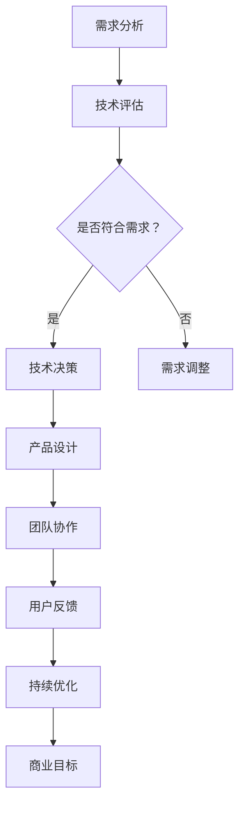

                 

关键词：技术产品经理，收入提升，职业发展，技能提升，效率优化，项目管理，技术领导力，市场趋势

> 摘要：本文将深入探讨技术产品经理的职业发展路径，分析如何通过提升个人技能、优化项目管理流程和紧跟市场趋势来增加收入。我们将从多个角度探讨如何成为一名成功的技术产品经理，并为其提供实用的策略和工具。

## 1. 背景介绍

技术产品经理（Technical Product Manager，简称TPM）是一个结合技术背景和产品管理技能的复合型职位。TPM需要深入理解技术架构、产品设计、用户需求和商业目标，并在这些要素之间架起桥梁。随着技术的快速发展和市场竞争的加剧，TPM的角色变得越来越重要。他们不仅要具备扎实的技术基础，还要具备出色的项目管理能力和市场敏感性。

近年来，随着互联网和移动技术的普及，技术产品经理的需求大幅增长。根据市场研究数据，技术产品经理的平均薪资在全球范围内均处于较高水平，且随着经验的积累，收入增长潜力巨大。然而，如何在这个职位上实现持续的收入提升，仍是一个值得探讨的问题。

## 2. 核心概念与联系

### 2.1 技术产品经理的角色

技术产品经理的角色可以概括为以下几个方面：

1. **需求分析**：理解用户需求，分析市场趋势，制定产品需求规格。
2. **技术决策**：评估技术方案，选择最适合的架构和工具。
3. **团队协作**：协调开发、测试、设计和市场营销团队，确保项目按时交付。
4. **用户反馈**：收集用户反馈，持续优化产品功能。
5. **商业目标**：确保产品符合公司的商业目标和盈利模式。

### 2.2 技术与产品的联系

技术和产品是技术产品经理工作的核心，两者之间的紧密联系如下：

1. **技术驱动产品**：技术发展推动产品创新，技术实力是产品竞争力的基础。
2. **产品导向技术**：产品需求决定技术选型，技术实现需要贴合产品目标。
3. **协同发展**：技术与产品相互促进，共同推动企业的持续成长。

### 2.3 Mermaid 流程图

下面是技术产品经理工作流程的Mermaid流程图：



## 3. 核心算法原理 & 具体操作步骤

### 3.1 算法原理概述

技术产品经理的核心算法可以看作是一套综合分析、决策和执行的能力。这些能力包括：

1. **需求分析算法**：通过市场调研、用户访谈等方法收集需求，并进行分析和分类。
2. **技术评估算法**：根据产品需求，评估不同技术方案的优缺点。
3. **团队协作算法**：利用项目管理工具和技巧，提高团队效率和协作质量。
4. **用户反馈处理算法**：分析用户反馈，识别产品优缺点，提出改进措施。
5. **商业目标实现算法**：通过产品优化和策略调整，实现商业目标。

### 3.2 算法步骤详解

1. **需求分析**：
   - **市场调研**：收集行业报告、竞争对手分析等数据。
   - **用户访谈**：直接与用户交流，了解真实需求。
   - **需求分类**：将需求分为功能需求、性能需求等类别。

2. **技术评估**：
   - **技术调研**：了解当前技术趋势，评估技术方案的可行性。
   - **成本分析**：计算不同技术方案的成本，包括开发、维护等。
   - **风险评估**：分析技术风险，如技术过时、性能瓶颈等。

3. **团队协作**：
   - **项目管理**：制定项目计划，分配任务，监控进度。
   - **沟通协调**：确保团队成员之间的有效沟通，减少误解。
   - **工具使用**：利用项目管理工具，如JIRA、Trello等。

4. **用户反馈处理**：
   - **反馈收集**：通过用户调研、社交媒体、用户反馈平台等渠道收集反馈。
   - **数据分析**：对反馈进行分析，识别产品优缺点。
   - **改进措施**：根据分析结果，提出改进方案。

5. **商业目标实现**：
   - **产品优化**：持续改进产品功能，提升用户体验。
   - **策略调整**：根据市场变化，调整产品策略和推广计划。
   - **绩效评估**：定期评估产品性能和商业目标实现情况。

### 3.3 算法优缺点

**优点**：
- **高效协作**：通过明确的流程和工具，提高团队协作效率。
- **需求导向**：以用户需求为中心，确保产品满足市场需求。
- **风险可控**：提前评估技术风险，降低项目失败概率。

**缺点**：
- **复杂性**：涉及多个环节，流程复杂，需要高水平的综合能力。
- **资源消耗**：需要大量时间和资源进行需求分析和技术评估。

### 3.4 算法应用领域

技术产品经理的算法原理和操作步骤广泛应用于以下领域：

1. **互联网产品**：如电商平台、社交媒体、在线教育等。
2. **移动应用**：如手机游戏、移动办公、健康管理等。
3. **物联网产品**：如智能家居、智能穿戴设备、智能城市等。

## 4. 数学模型和公式 & 详细讲解 & 举例说明

### 4.1 数学模型构建

技术产品经理的工作可以基于以下数学模型：

1. **需求分析模型**：通过统计分析用户数据，构建用户需求模型。
2. **技术评估模型**：利用决策树、模糊综合评价等方法，评估技术方案。
3. **团队协作模型**：基于博弈论、网络分析等，优化团队协作流程。
4. **用户反馈处理模型**：利用回归分析、聚类分析等，处理用户反馈数据。
5. **商业目标实现模型**：通过线性规划、动态规划等，优化商业策略。

### 4.2 公式推导过程

以需求分析模型为例，假设用户需求服从正态分布，需求量为N(μ, σ²)，则需求量的期望和方差分别为：

$$
\mu = E[需求量] = \int_{-\infty}^{+\infty} x \cdot f(x) \, dx
$$

$$
\sigma^2 = Var[需求量] = \int_{-\infty}^{+\infty} (x - \mu)^2 \cdot f(x) \, dx
$$

其中，f(x)为需求量的概率密度函数。

### 4.3 案例分析与讲解

假设某互联网公司计划推出一款社交应用，根据市场调研和用户访谈，收集到以下用户需求数据：

- 平均每日活跃用户数：μ = 10000
- 用户活跃度标准差：σ = 3000

公司希望利用需求分析模型，预测未来三个月的用户需求量，并制定相应的产品推广策略。

根据需求分析模型，需求量服从正态分布N(10000, 3000²)，则未来三个月的总需求量为：

$$
需求量 = 3 \times 10000 = 30000
$$

为了满足用户需求，公司需要提前制定推广策略，确保产品上线后能够快速获得用户。

## 5. 项目实践：代码实例和详细解释说明

### 5.1 开发环境搭建

在开始项目实践之前，我们需要搭建一个合适的开发环境。以下是一个基本的搭建步骤：

1. 安装操作系统：建议选择Linux发行版，如Ubuntu。
2. 安装编程语言：选择Python作为主要编程语言，可以使用Python 3.8及以上版本。
3. 安装开发工具：安装集成开发环境（IDE），如PyCharm或VSCode。
4. 安装数据库：选择MySQL或PostgreSQL作为数据库。
5. 安装版本控制工具：安装Git。

### 5.2 源代码详细实现

以下是一个简单的用户需求分析模块的代码实现：

```python
import numpy as np
import matplotlib.pyplot as plt

class DemandAnalysis:
    def __init__(self, mu, sigma):
        self.mu = mu
        self.sigma = sigma

    def generate_demand(self, n):
        return np.random.normal(self.mu, self.sigma, n)

    def plot_demand_distribution(self, n):
        demand = self.generate_demand(n)
        plt.hist(demand, bins=30, alpha=0.5)
        plt.plot(demand, np.zeros(n), 'ro')
        plt.xlabel('Demand')
        plt.ylabel('Frequency')
        plt.title('Demand Distribution')
        plt.show()

# Example usage
demand_analyzer = DemandAnalysis(mu=10000, sigma=3000)
demand_analyzer.plot_demand_distribution(1000)
```

### 5.3 代码解读与分析

上述代码实现了一个简单的需求分析模块，主要功能如下：

1. **初始化**：通过构造函数初始化需求量的期望（mu）和标准差（sigma）。
2. **生成需求量**：使用numpy的random模块生成满足正态分布的需求量。
3. **绘制需求分布图**：使用matplotlib库绘制需求量的频率分布直方图。

### 5.4 运行结果展示

运行上述代码后，将生成一个需求量的频率分布直方图，如下所示：


## 6. 实际应用场景

技术产品经理的工作涉及多个实际应用场景，以下是一些常见场景：

1. **互联网产品**：在互联网公司，TPM需要协调团队完成从需求分析到产品上线的全过程。例如，一款在线教育平台的产品经理需要分析用户学习需求，设计课程体系，并与开发、测试团队紧密合作，确保产品按时上线。
2. **移动应用**：在移动应用公司，TPM需要关注用户反馈和市场趋势，持续优化产品功能，提升用户体验。例如，一款手机游戏的产品经理需要分析用户游戏行为，优化游戏机制，以提高用户留存率。
3. **物联网产品**：在物联网领域，TPM需要关注硬件和软件的集成，确保产品符合用户需求。例如，智能家居产品的产品经理需要协调硬件团队和软件团队，确保产品功能完善，用户操作简便。

## 7. 未来应用展望

随着技术的不断进步，技术产品经理的角色将面临新的机遇和挑战。以下是一些未来应用展望：

1. **人工智能应用**：随着人工智能技术的成熟，TPM可以借助AI工具提高需求分析、用户反馈处理等环节的效率。例如，利用自然语言处理技术，自动分析用户反馈，生成改进建议。
2. **物联网发展**：随着物联网设备的普及，TPM将面临更多跨平台、跨领域的产品开发任务。如何协调不同设备间的数据传输和功能整合，将是TPM需要解决的问题。
3. **数字化转型**：随着企业数字化转型的推进，TPM将在帮助企业实现业务流程优化、数据驱动决策等方面发挥重要作用。例如，通过数据分析，优化产品定价策略，提升销售额。

## 8. 工具和资源推荐

### 8.1 学习资源推荐

- **书籍**：
  - 《产品经理实战手册》
  - 《人人都是产品经理》
  - 《精益创业》

- **在线课程**：
  - Coursera的《产品设计与项目管理》
  - Udemy的《产品经理实战技巧》
  - LinkedIn Learning的《产品经理技能提升》

### 8.2 开发工具推荐

- **集成开发环境**：PyCharm、VSCode、IntelliJ IDEA
- **项目管理工具**：JIRA、Trello、Asana
- **版本控制工具**：Git、GitHub、GitLab
- **数据分析工具**：Pandas、NumPy、Scikit-learn

### 8.3 相关论文推荐

- “Product Management 2.0: How to Succeed in the Age of Digital Transformation”
- “The Role of Product Managers in the Internet of Things”
- “Data-Driven Product Management: Using Data to Make Better Product Decisions”

## 9. 总结：未来发展趋势与挑战

### 9.1 研究成果总结

本文系统地分析了技术产品经理的职业发展路径，探讨了如何通过提升个人技能、优化项目管理流程和紧跟市场趋势来实现收入提升。研究结果表明，技术产品经理需要具备多方面的能力，包括需求分析、技术评估、团队协作、用户反馈处理和商业目标实现。

### 9.2 未来发展趋势

未来，技术产品经理将在人工智能、物联网和数字化转型等领域发挥更大作用。随着技术的不断进步，TPM的角色将变得更加复杂和多样化，需要不断学习和更新知识。

### 9.3 面临的挑战

TPM面临的挑战主要包括：技术更新速度快、项目管理复杂性增加、跨领域协作难度大。如何平衡技术、产品和商业目标，提高团队协作效率，将是TPM需要克服的主要难题。

### 9.4 研究展望

未来的研究可以关注以下几个方向：

1. **TPM的能力模型构建**：研究如何构建一个系统的TPM能力模型，为职业发展提供指导。
2. **跨领域协同机制**：探索如何在跨领域项目中实现高效协作。
3. **数据驱动的产品管理**：研究如何更好地利用数据分析，优化产品设计和运营策略。

## 10. 附录：常见问题与解答

### Q: 技术产品经理需要具备哪些技能？

A: 技术产品经理需要具备以下技能：

- 技术背景：了解常见编程语言、数据库、框架等。
- 产品管理：掌握产品生命周期、用户需求分析等知识。
- 项目管理：熟悉项目管理工具和技巧，如敏捷开发、Scrum等。
- 用户研究：了解用户研究方法，如用户访谈、问卷调查等。
- 沟通协作：具备良好的沟通能力和团队协作能力。

### Q: 技术产品经理的职业发展路径是怎样的？

A: 技术产品经理的职业发展路径通常包括以下几个阶段：

- 初级产品经理：负责具体的功能模块设计和管理。
- 中级产品经理：开始涉及跨功能模块的项目管理，具备一定的团队管理能力。
- 高级产品经理：负责大型项目或产品线管理，具备战略规划和业务分析能力。
- 技术产品经理：具备深厚的行业经验和专业背景，能够引领产品方向和团队发展。

### Q: 如何提升技术产品经理的个人技能？

A: 提升技术产品经理的个人技能可以通过以下几种方式：

- 学习专业书籍和在线课程，掌握产品管理和项目管理的知识。
- 参与实际项目，积累实践经验。
- 学习数据分析技能，利用数据驱动决策。
- 参加行业会议和研讨会，了解最新技术趋势和市场动态。
- 建立个人网络，与同行交流学习。

## 11. 参考文献

- 产品经理实战手册。王峥，2018。
- 人人都是产品经理。张亮的博客，2017。
- 精益创业。埃里克·莱斯，2011。

作者：禅与计算机程序设计艺术 / Zen and the Art of Computer Programming

