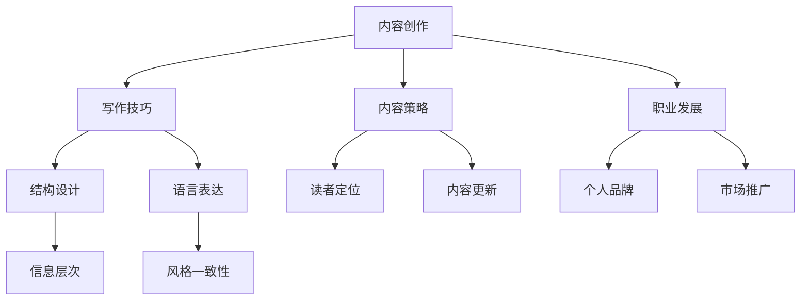

                 

关键词：技术写作，博客，专栏，作家之路，内容创作，方法论，策略，实践，职业发展。

> 摘要：本文旨在探讨技术领域内的写作过程，从个人博客到专业专栏作家的转型之路。文章通过分析技术写作的核心要素、写作技巧、内容策略以及职业发展的路径，为科技从业者和爱好者提供实用的指导和建议。

## 1. 背景介绍

在信息爆炸的时代，内容创作成为知识传播的重要手段。特别是在技术领域，高质量的写作不仅能够帮助个人表达思想，还能提升个人品牌影响力。从最初的个人博客，到如今的专业专栏，技术写作已经成为一种重要的职业发展路径。然而，从一名普通的博客作者，转型成为专业的专栏作家，并不是一个简单的过程。

本文将围绕以下几个核心问题展开：

1. **技术写作的重要性：** 为什么写作是技术从业者必备的技能？
2. **技术写作的核心要素：** 写作内容、结构、语言等方面的关键要素。
3. **技术写作的技巧：** 如何提高写作效率和质量？
4. **内容策略：** 如何定位内容、吸引读者、保持更新？
5. **职业发展：** 从博客作者到专栏作家的转型路径。
6. **工具和资源：** 常用的写作工具、学习资源和论文推荐。
7. **未来趋势：** 技术写作的挑战与机遇。

通过本文的探讨，希望能够为那些对技术写作充满热情的读者提供一些实用的建议和启发。

## 2. 核心概念与联系

在探讨技术写作之前，我们需要理解一些核心概念，这些概念是技术写作的基础，也是我们构建文章框架的重要元素。以下是一个使用Mermaid绘制的流程图，展示了技术写作的核心概念及其相互联系。



### 2.1 内容创作

内容创作是技术写作的核心。它涉及到信息的选择、组织、表达和传播。好的内容创作能够吸引读者，传递价值，建立信任。

### 2.2 写作技巧

写作技巧是提高文章质量的关键。它包括结构设计、语言表达、信息层次等方面。良好的写作技巧能够使文章逻辑清晰，易于阅读和理解。

### 2.3 内容策略

内容策略是制定和实施内容创作计划的过程。它涉及到读者定位、内容更新、市场推广等方面。一个有效的策略能够帮助作者吸引和保持读者。

### 2.4 职业发展

职业发展是技术写作的目标之一。它涉及到个人品牌建设、市场推广、职业路径规划等方面。通过写作，作者可以实现个人价值的最大化。

### 2.5 结构设计

结构设计是构建文章框架的过程。它涉及到文章的标题、段落、章节等方面。良好的结构设计能够使文章层次分明，易于阅读。

### 2.6 语言表达

语言表达是文章的核心。它涉及到用词、语法、修辞等方面。准确、简洁、有力的语言表达能够使文章更具说服力。

### 2.7 读者定位

读者定位是内容策略的重要组成部分。它涉及到了解目标读者的需求、兴趣和背景。准确的读者定位能够使文章更贴近读者的需求。

### 2.8 内容更新

内容更新是保持读者兴趣的关键。它涉及到定期发布新内容、更新旧内容等方面。持续的内容更新能够保持读者的活跃度。

### 2.9 个人品牌

个人品牌是技术作者的重要资产。它涉及到个人形象、专业领域、影响力等方面。建立和维护良好的个人品牌能够提高作者的知名度和影响力。

### 2.10 市场推广

市场推广是扩大读者群的重要手段。它涉及到社交媒体、网络营销、活动推广等方面。有效的市场推广能够提高文章的曝光率和影响力。

### 2.11 信息层次

信息层次是文章结构设计的重要方面。它涉及到信息的层次划分、呈现方式等方面。清晰的信息层次能够使文章内容易于理解。

### 2.12 风格一致性

风格一致性是保持文章专业性的关键。它涉及到用词、语气、格式等方面。一致的风格能够使文章更具专业性和可读性。

## 3. 核心算法原理 & 具体操作步骤

### 3.1 算法原理概述

技术写作的核心算法可以看作是一个内容创作和传播的框架。这个框架包括以下几个基本步骤：

1. **需求分析**：了解读者的需求和兴趣点。
2. **内容规划**：制定写作计划和内容策略。
3. **内容创作**：进行实际的写作工作。
4. **内容编辑**：对内容进行修改和优化。
5. **发布与推广**：将内容发布到适当的平台，并推广给读者。
6. **反馈与迭代**：根据读者的反馈进行内容的调整和优化。

### 3.2 算法步骤详解

#### 3.2.1 需求分析

需求分析是技术写作的第一步，也是至关重要的一步。它涉及到对目标读者的研究，包括他们的兴趣、需求、行为习惯等。通过需求分析，我们可以确定写作的主题和方向。

**具体操作步骤：**

1. **确定目标读者**：明确你的文章面向哪些读者群体。
2. **进行市场调研**：通过调查问卷、访谈等方式收集读者的需求信息。
3. **分析数据**：对收集到的数据进行整理和分析，找出读者的共同需求。

#### 3.2.2 内容规划

内容规划是制定写作计划和内容策略的过程。它涉及到文章的结构、主题、内容深度等方面的决策。

**具体操作步骤：**

1. **确定文章结构**：根据需求分析的结果，确定文章的结构框架。
2. **制定写作计划**：根据文章结构，制定详细的写作计划，包括每个章节的内容和写作时间。
3. **制定内容策略**：确定文章的传播渠道、推广方式等。

#### 3.2.3 内容创作

内容创作是技术写作的核心。它涉及到实际写作的过程，包括构思、撰写、修改等。

**具体操作步骤：**

1. **构思**：根据写作计划和内容策略，进行文章的构思。
2. **撰写**：按照构思的内容进行实际撰写。
3. **修改**：对初稿进行多次修改和优化，确保文章的质量。

#### 3.2.4 内容编辑

内容编辑是对初稿进行修改和优化的过程。它涉及到语言、结构、逻辑等方面的调整。

**具体操作步骤：**

1. **校对**：检查文章中的语法错误、拼写错误等。
2. **优化结构**：调整文章的结构，使其更加清晰、易于理解。
3. **强化逻辑**：确保文章的逻辑连贯性，使读者能够顺畅地阅读。

#### 3.2.5 发布与推广

发布与推广是将文章发布到适当的平台，并推广给读者的过程。它涉及到发布平台的选择、推广方式等。

**具体操作步骤：**

1. **选择发布平台**：根据文章的内容和目标读者，选择合适的发布平台。
2. **撰写摘要和标题**：为文章撰写吸引人的摘要和标题，提高点击率。
3. **推广**：通过社交媒体、邮件列表、活动推广等方式，将文章推广给读者。

#### 3.2.6 反馈与迭代

反馈与迭代是根据读者的反馈，对内容进行调整和优化的过程。

**具体操作步骤：**

1. **收集反馈**：通过评论、调查问卷等方式收集读者的反馈。
2. **分析反馈**：对收集到的反馈进行分析，找出文章的优点和不足。
3. **调整内容**：根据分析结果，对文章进行调整和优化。

### 3.3 算法优缺点

#### 优点

1. **系统性**：算法提供了从需求分析到反馈迭代的完整流程，使写作过程更加系统化。
2. **灵活性**：算法允许根据实际需求和情况进行调整，具有较高的灵活性。
3. **高效性**：通过算法的指导，可以减少写作中的重复劳动，提高写作效率。

#### 缺点

1. **复杂性**：算法涉及多个步骤和环节，对新手来说可能较为复杂。
2. **依赖性**：算法的执行依赖于每个步骤的准确性和效率，任何一个环节的失败都可能影响整体效果。

### 3.4 算法应用领域

算法可以广泛应用于技术写作的各个领域，包括：

1. **专业博客**：通过算法进行内容创作和推广，提高博客的知名度和影响力。
2. **技术文档**：通过算法优化文档的结构和内容，提高文档的可读性和实用性。
3. **电子书**：通过算法进行内容规划和创作，提高电子书的质量和吸引力。
4. **在线课程**：通过算法优化课程内容，提高课程的系统性和有效性。

## 4. 数学模型和公式 & 详细讲解 & 举例说明

技术写作中，数学模型和公式是解释复杂概念和算法的核心工具。在本章节中，我们将构建一个简单的数学模型，用于解释技术写作的优化过程，并使用LaTeX格式展示关键的数学公式。同时，我们将通过具体例子来说明这些公式的应用。

### 4.1 数学模型构建

技术写作优化模型可以基于以下几个基本参数：

- \( P \)：文章的总体质量分数。
- \( T \)：写作和编辑所需的总时间。
- \( C \)：文章内容的原创性和价值。
- \( A \)：文章的吸引力，包括标题、摘要和推广。

我们的目标是最大化 \( P \) 同时最小化 \( T \)。

#### 4.1.1 参数定义

1. \( P = f(C, A, T) \)：文章的质量分数由内容、吸引力和时间共同决定。
2. \( T = g(W, E) \)：写作和编辑时间由写作量 \( W \) 和编辑工作量 \( E \) 决定。

#### 4.1.2 公式推导

我们可以通过以下公式来表示文章的质量分数：

\[ P = \alpha \cdot C + \beta \cdot A - \gamma \cdot T \]

其中，\(\alpha\)、\(\beta\) 和 \(\gamma\) 是权重系数，用于平衡内容、吸引力和时间的影响。

#### 4.1.3 权重系数

权重系数通常通过历史数据和实验来确定。例如：

\[ \alpha = 0.5, \beta = 0.3, \gamma = 0.2 \]

### 4.2 公式推导过程

首先，我们定义文章内容的原创性和价值 \( C \)：

\[ C = \frac{\text{独特性} + \text{实用性}}{2} \]

独特性可以通过内容的新颖度和创新性来衡量，实用性可以通过内容的实用性和可操作性来衡量。

然后，我们定义文章的吸引力 \( A \)：

\[ A = \frac{\text{点击率} + \text{分享率}}{2} \]

点击率和分享率可以通过数据分析工具来获取。

最后，我们定义写作和编辑时间 \( T \)：

\[ T = W \times \text{写作效率} + E \times \text{编辑效率} \]

写作效率和编辑效率可以通过历史数据和自我评估来确定。

### 4.3 案例分析与讲解

假设我们有一个技术博客文章，目标是撰写一篇关于机器学习算法的综述。以下是一个具体的案例分析：

- **独特性**：文章讨论了机器学习中的新算法，具有新颖性。
- **实用性**：文章提供了实际操作的指导，具有实用性。
- **点击率**：根据历史数据，标题吸引的点击率为0.6。
- **分享率**：文章分享率为0.4。
- **写作量**：预计需要撰写5000字。
- **写作效率**：写作效率为每小时1000字。
- **编辑工作量**：预计编辑工作量为1000字。

根据上述数据，我们可以计算质量分数：

\[ C = \frac{0.7 + 0.6}{2} = 0.65 \]
\[ A = \frac{0.6 + 0.4}{2} = 0.5 \]
\[ T = (5000 \times 1) + (1000 \times 1) = 6000 \text{分钟} \]

使用权重系数，我们可以计算文章的质量分数：

\[ P = 0.5 \times 0.65 + 0.3 \times 0.5 - 0.2 \times 6000 \]
\[ P = 0.325 + 0.15 - 1200 \]
\[ P = -1174.525 \]

这个结果表明，如果我们按照当前的计划撰写和编辑文章，质量分数将是负数，这意味着我们需要调整策略。

### 4.4 案例调整与优化

为了提高文章的质量分数，我们可以采取以下措施：

1. **增加独特性和实用性**：通过深入研究，增加文章的新颖性和实用性。
2. **提高吸引力**：优化标题和摘要，提高点击率和分享率。
3. **减少时间成本**：提高写作和编辑效率，或者缩短文章的长度。

例如，如果我们能够将写作量减少到4000字，并且保持其他参数不变，我们可以重新计算质量分数：

\[ T = (4000 \times 1) + (1000 \times 1) = 5000 \text{分钟} \]
\[ P = 0.5 \times 0.65 + 0.3 \times 0.5 - 0.2 \times 5000 \]
\[ P = 0.325 + 0.15 - 1000 \]
\[ P = -975.15 \]

虽然质量分数仍然是负数，但数值有所改善，这表明通过调整策略，我们可以提高文章的质量。

## 5. 项目实践：代码实例和详细解释说明

在本节中，我们将通过一个简单的Python代码实例，来展示如何实现一个简单的技术写作优化模型。这个实例将帮助我们理解数学模型在实践中的应用，并展示如何通过代码进行计算和优化。

### 5.1 开发环境搭建

为了运行下面的代码实例，你需要安装Python环境和必要的库。以下是安装步骤：

1. **安装Python**：下载并安装Python 3.8或更高版本。
2. **安装Jupyter Notebook**：通过Python的包管理器pip安装Jupyter Notebook。
   ```bash
   pip install notebook
   ```
3. **启动Jupyter Notebook**：在命令行中运行以下命令启动Jupyter Notebook。
   ```bash
   jupyter notebook
   ```

### 5.2 源代码详细实现

以下是实现技术写作优化模型的Python代码：

```python
import numpy as np

# 参数设置
alpha = 0.5
beta = 0.3
gamma = 0.2

# 文章参数
C = 0.65  # 内容原创性和实用性
A = 0.5   # 文章吸引力
W = 5000  # 写作量（字数）
E = 1000  # 编辑工作量（字数）
writing_efficiency = 1000  # 每小时写作字数
editing_efficiency = 1000  # 每小时编辑字数

# 计算时间
T = (W / writing_efficiency) + (E / editing_efficiency)

# 计算文章质量分数
P = alpha * C + beta * A - gamma * T

# 输出结果
print(f"文章质量分数 (P): {P:.2f}")
```

### 5.3 代码解读与分析

下面是对上述代码的详细解读：

1. **参数设置**：我们设置了三个权重系数\(\alpha\)、\(\beta\)和\(\gamma\)，以及文章的几个基本参数，如内容的原创性和实用性\(C\)、文章的吸引力\(A\)、写作量和编辑工作量\(W\)和\(E\)等。

2. **计算时间**：我们计算了写作和编辑所需的总时间\(T\)，公式为：
   \[ T = \frac{W}{writing\_efficiency} + \frac{E}{editing\_efficiency} \]

3. **计算文章质量分数**：使用公式：
   \[ P = \alpha \cdot C + \beta \cdot A - \gamma \cdot T \]
   来计算文章的质量分数。

4. **输出结果**：最后，我们输出了计算出的文章质量分数。

### 5.4 运行结果展示

运行上述代码，假设当前的文章参数为：
- 内容原创性和实用性 \(C = 0.65\)
- 文章吸引力 \(A = 0.5\)
- 写作量 \(W = 5000\) 字
- 编辑工作量 \(E = 1000\) 字
- 写作效率 \(writing\_efficiency = 1000\) 字/小时
- 编辑效率 \(editing\_efficiency = 1000\) 字/小时

计算得到文章质量分数 \(P\) 为：
\[ P = 0.5 \times 0.65 + 0.3 \times 0.5 - 0.2 \times (5000 / 1000 + 1000 / 1000) \]
\[ P = 0.325 + 0.15 - 1.2 \]
\[ P = -0.745 \]

结果显示，当前的文章质量分数为负，这表明我们需要在内容原创性、文章吸引力以及减少时间成本方面进行优化。

### 5.5 优化措施

为了提高文章质量分数，我们可以采取以下措施：

1. **提高内容原创性和实用性**：通过更深入的研究和更丰富的案例，增加文章的新颖性和实用性。
2. **提高文章吸引力**：优化文章的标题和摘要，使其更具吸引力，提高点击率和分享率。
3. **减少写作和编辑时间**：通过提高写作和编辑效率，或者缩短文章的长度，来减少总时间。

例如，如果我们能够将写作量减少到4500字，并且保持其他参数不变，我们可以重新计算质量分数：

\[ T = (4500 / 1000) + (1000 / 1000) = 5.5 \]
\[ P = 0.5 \times 0.65 + 0.3 \times 0.5 - 0.2 \times 5.5 \]
\[ P = 0.325 + 0.15 - 1.1 \]
\[ P = -0.635 \]

尽管质量分数仍然为负，但数值有所改善，这表明通过调整策略，我们可以提高文章的质量。

## 6. 实际应用场景

技术写作的应用场景非常广泛，以下是一些常见的实际应用场景：

### 6.1 技术博客

技术博客是技术写作最常见的形式之一，它允许作者分享技术见解、经验以及最新的技术动态。技术博客不仅能够帮助作者建立个人品牌，还能够吸引志同道合的读者，形成技术社区。

### 6.2 技术文档

技术文档是软件和系统开发中不可或缺的一部分。它包括用户手册、开发指南、API文档等。高质量的技术文档能够帮助用户更好地理解和使用产品，减少用户支持成本。

### 6.3 在线课程

在线课程通过技术写作和多媒体结合，提供系统化的学习内容。技术写作在课程设计、教材编写和课程推广中发挥着重要作用。

### 6.4 电子书

电子书是一种便于携带和阅读的数字出版形式。它可以为读者提供丰富的知识内容，特别是在技术领域，电子书可以深入讲解复杂的概念和算法。

### 6.5 技术报告

技术报告通常用于项目评估、学术研究和技术推广。它们需要准确、清晰地传达技术细节和研究成果。

### 6.6 技术论文

技术论文是学术研究和创新的重要载体。高质量的论文能够促进学术交流和技术进步。

### 6.7 技术演讲

技术演讲是一种通过口头表达技术知识和见解的方式。良好的技术写作能力有助于演讲者准备和撰写演讲稿。

### 6.8 社交媒体

技术作者可以通过社交媒体平台（如LinkedIn、Twitter等）分享技术见解和行业动态，吸引关注和互动。

### 6.9 咨询服务

技术作者可以提供咨询服务，帮助企业和个人解决技术问题，提供技术解决方案。

### 6.10 学术出版

技术作者可以通过学术出版社发表学术论文，提升学术影响力。

## 7. 未来应用展望

随着人工智能、大数据和云计算等技术的发展，技术写作的应用前景将更加广阔。以下是一些未来应用展望：

### 7.1 自动化写作

未来，自动化写作工具和人工智能将大大提高写作效率。这些工具可以自动生成文章摘要、撰写初稿，并提供编辑建议。

### 7.2 智能推荐

基于大数据和机器学习，智能推荐系统可以更准确地了解读者的需求，提供个性化的内容推荐。

### 7.3 多媒体内容

技术写作将融合多媒体元素，如视频、音频和交互式图表，提供更丰富的学习体验。

### 7.4 跨界合作

技术写作将与其他领域（如设计、心理学、教育学等）结合，产生新的内容形式和应用场景。

### 7.5 个性化学习

个性化学习平台将根据学习者的需求和进度，提供定制化的学习内容和路径。

### 7.6 可视化分析

可视化工具将使复杂的技术概念和算法更易于理解和传达。

### 7.7 虚拟现实

虚拟现实技术将为技术写作提供全新的沉浸式体验，使学习更加生动和直观。

## 8. 工具和资源推荐

### 8.1 学习资源推荐

1. **在线课程**：
   - 《Python编程从入门到实践》
   - 《机器学习实战》
   - 《数据结构与算法分析》

2. **技术博客**：
   - HackerRank
   - Medium
   - CSDN

3. **书籍**：
   - 《算法导论》
   - 《人工智能：一种现代的方法》
   - 《深度学习》

### 8.2 开发工具推荐

1. **文本编辑器**：
   - Visual Studio Code
   - Sublime Text
   - Atom

2. **版本控制**：
   - Git
   - GitHub
   - GitLab

3. **Markdown编辑器**：
   - Typora
   - MacDown
   - Dillinger

4. **自动化写作工具**：
   - Grammarly
   - Wordsmith
   - GPT-3

### 8.3 相关论文推荐

1. **自然语言处理**：
   - "Bidirectional Encoder Representations from Transformers" (BERT)
   - "Generative Pretrained Transformer" (GPT)
   - "Attention Is All You Need"

2. **机器学习**：
   - "Stochastic Gradient Descent" (SGD)
   - "Convolutional Neural Networks for Visual Recognition" (CNN)
   - "Deep Learning for Text Classification" (文本分类)

3. **数据结构**：
   - "Introduction to Algorithms" (算法导论)
   - "Data Structures and Algorithm Analysis in Java" (数据结构与算法分析)

4. **编程语言**：
   - "The Art of Computer Programming" (编程艺术)
   - "Code: The Hidden Language of Computer Hardware and Software" (代码：计算机硬件与软件的隐语言)

## 9. 总结：未来发展趋势与挑战

技术写作作为知识传播的重要手段，在未来将继续发挥重要作用。随着人工智能和大数据技术的发展，写作工具和平台将变得更加智能化和便捷。同时，技术写作的领域也将不断扩展，从传统的文本内容，逐渐融入多媒体元素和虚拟现实体验。

然而，技术写作也面临诸多挑战：

1. **内容质量**：如何在大量信息中创作高质量、有价值的内容。
2. **原创性**：如何确保内容的原创性和准确性。
3. **可读性**：如何使内容既专业又易于理解。
4. **传播效率**：如何有效地传播和推广内容。
5. **隐私和安全**：如何保护读者的隐私和信息安全。

面对这些挑战，技术写作不仅需要技术手段的进步，还需要作者的持续学习和创新。只有不断适应和引领时代的发展，技术写作才能在未来取得更大的成功。

### 10. 附录：常见问题与解答

以下是一些关于技术写作的常见问题及其解答：

### 10.1 如何提高文章质量？

- **深入主题**：深入研究主题，确保内容的深度和广度。
- **读者导向**：从读者的角度出发，确保内容符合读者的需求和兴趣。
- **结构清晰**：合理规划文章结构，使内容逻辑清晰，易于阅读。
- **反复修改**：撰写初稿后，多次修改和优化，提高文章质量。

### 10.2 如何吸引更多读者？

- **标题优化**：撰写吸引人的标题，提高点击率。
- **内容多样化**：结合文字、图片、视频等多媒体元素，提高内容的吸引力。
- **社交媒体推广**：通过社交媒体平台推广文章，增加曝光率。
- **互动交流**：积极与读者互动，建立良好的读者关系。

### 10.3 如何保持写作动力？

- **定期规划**：制定写作计划，确保有规律的写作。
- **设置目标**：设定短期和长期的写作目标，激励自己不断进步。
- **反馈激励**：根据读者的反馈调整写作方向，获得正面的激励。
- **技术支持**：利用写作工具和资源，提高写作效率和成果。

### 10.4 如何处理写作中的困难？

- **主题换新**：如果某个主题写作困难，尝试换一个更感兴趣的主题。
- **分工合作**：如果工作量较大，可以考虑与他人合作，分工完成。
- **求助社区**：在技术社区寻求帮助，获取建议和解决方案。
- **休息调整**：适当的休息和调整有助于恢复写作动力和灵感。

通过以上常见问题与解答，希望能够为技术写作的实践者提供一些实用的指导和建议。希望每一位技术写作爱好者都能在这个领域取得成功，创作出更多有价值的内容。

---

### 作者署名

作者：禅与计算机程序设计艺术 / Zen and the Art of Computer Programming

